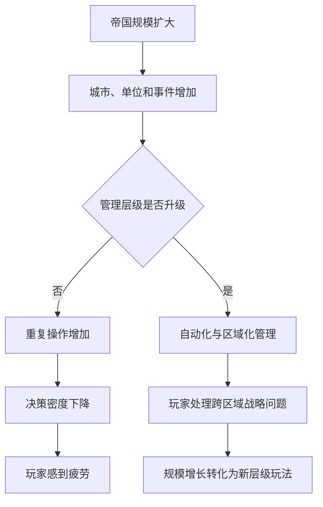
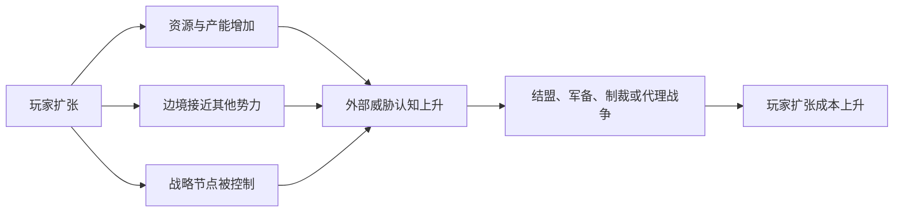

# 治理容量：为什么 4X 游戏不能让扩张永远稳赚不赔
> 系列：游戏系统的共同语言
> 日期：2026-07-31
> 状态：草稿
> 核心问题：为什么许多 4X 游戏前期充满战略选择，到了中后期却变成不断占地、点建筑和处理重复事务？
> 关键词：4X、文明战略、扩张、治理容量、组织能力、后勤、中后期管理

在很多 4X 游戏里，玩家很快就会发现一条看似朴素的规律：

> 只要还能占领更多土地，就应该继续占领。

多一座城市，通常意味着更多人口、生产力、科研、税收和战略资源；多一块领土，也意味着更大的视野、更深的防御纵深和更多可以利用的地形。

于是，扩张很容易变成一道不需要认真判断的题：

- 有空地，就建城；

- 有弱小邻国，就吞并；

- 有资源点，就抢占；

- 有人口上限，就继续增长；

- 有新单位，就继续投放到地图上。


表面上，玩家的帝国正在变得越来越强。

但体验往往在某个时刻突然发生变化：

- 每回合需要逐一检查十几座城市；

- 大量单位需要执行没有争议的移动；

- 边境过长，任何局部冲突都需要调兵；

- 新领土仍然提供收益，却不再产生新的战略问题；

- 玩家不是在决定国家方向，而是在替一个庞大组织完成日常行政。


问题不只是“后期操作太多”。

更深层的问题是：

> 游戏只模拟了扩张能够带来的资源，却没有充分模拟一个组织能够有效控制多少资源。

---

## 一、先给结论：帝国规模不应等于有效实力

4X 游戏里的领土、城市、人口和军队，通常都可以被直接计数。

但一个势力真正能够使用的力量，并不等于这些资产的简单总和。

一百座无法运输物资、无法获得命令、无法维持秩序的城市，不一定比二十座高度协同的城市更强。

五十支分散在边境、缺少补给的军队，也不一定能战胜十支部署集中、交通顺畅的军队。

这里需要引入一个比“领土数量”更重要的概念。

> **治理容量（后文简称“管得过来的规模”）**：一个势力在当前制度、交通、信息、财政和人员条件下，能够有效控制、协调、开发并保护的组织规模。

治理容量不是某一个固定数值。

它是多种能力共同形成的结果：

- 行政体系能处理多少城市；

- 交通网络能覆盖多远；

- 财政能维持多少公共设施和军队；

- 指挥系统能调度多少单位；

- 情报系统能发现多少风险；

- 制度能容纳多少文化、人口和地区差异；

- 玩家界面能否让人清楚理解当前状态；

- 自动管理系统能否执行那些已经没有战略争议的任务。


因此，4X 游戏真正需要平衡的不是“扩张”和“不扩张”，而是：

> **势力规模与治理容量之间的差值。**

规模低于治理容量时，扩张通常可以形成增长。

规模接近治理容量时，新领土会开始产生明显的机会成本。

规模超过治理容量时，帝国虽然在地图上继续变大，实际可用实力却可能停止增长，甚至下降。

---

## 二、4X 的四个 X 不是四个并列按钮

> **4X 文明战略（后文简称“帝国经营游戏”）**：以探索、扩张、开发和势力竞争为核心，使玩家长期经营国家、文明、星际势力或其他大型组织的策略游戏类型。

4X 通常由四个英文单词概括：

|维度|常见翻译|真正改变的内容|
|---|---|---|
|Explore|探索|玩家知道什么，以及可以计划什么|
|Expand|扩张|玩家控制多少空间、人口和节点|
|Exploit|开发|已控制资产能转化出多少有效产出|
|Exterminate|消灭或竞争|多个势力如何争夺有限空间和胜利机会|

这四个过程不是彼此独立的系统。

它们更接近一条不断自我放大的反馈链：


如果这条链只有正向收益，系统最终必然收敛到同一种策略：

> 尽可能快地取得更多空间，再用更多空间生产下一轮扩张需要的资源。

这类循环可以制造成长感，却很难长期制造战略深度。

因为真正的战略选择要求不同方案之间存在不可同时获得的价值。

当“占领更多”在绝大多数情况下都正确时，扩张就不再是决策，而只是执行。

---

## 三、扩张为什么必须同时制造负担

一座新城市可以带来：

- 人口；

- 生产力；

- 科研；

- 税收；

- 资源；

- 视野；

- 交通节点；

- 战略纵深。


但它也应当改变帝国需要处理的问题：

- 增加边境长度；

- 增加防守方向；

- 拉长补给距离；

- 增加行政成本；

- 引入新的文化或派系；

- 增加公共设施需求；

- 激化邻国的威胁感；

- 分散有限的建设资源；

- 增加玩家必须理解和管理的状态。


这并不意味着每建一座城市，都要立刻扣除一个固定的“腐败值”。

固定惩罚通常只能阻止扩张速度，却无法产生有意义的战略判断。

好的扩张成本应当来自结构。

例如，同样是第五座城市：

- 建在首都附近，可能容易防守、容易运输，却缺少稀有资源；

- 建在遥远矿区，可能提供关键资源，却需要长期维护交通线；

- 建在敌国边境，可能控制战略要道，也可能迫使玩家常驻军队；

- 建在海外，可能打开新的贸易圈，同时需要舰队保护；

- 建在异文化区域，可能获得人口，却带来整合与稳定问题。


因此，真正有价值的问题不是：

> 第五座城市要不要收取额外维护费？

而是：

> 这座城市与现有帝国的连接方式，会产生什么新的能力和脆弱性？

---

## 四、治理容量不是惩罚条，而是一组系统约束

最简单的治理系统，通常表现为一个上限：

```text
城市数量超过 8 座后，每座城市产出降低 5%。
```

这种做法容易实现，也能限制无脑扩张。

但它的问题同样明显：

- 玩家很难从世界状态中理解惩罚来源；

- 所有城市受到相同影响，缺少空间和结构差异；

- 解决方式通常只是研究一个“上限 +2”的科技；

- 治理系统最终退化为另一条数值成长线。


更完整的治理容量，至少可以拆成四层。

## 4.1 行政容量：能否把决策传递到地方

行政容量决定：

- 城市是否能稳定执行政策；

- 税收是否能被有效征集；

- 地方是否出现低效率、自治或腐败；

- 玩家能否统一调整生产和人口分配；

- 新征服地区需要多长时间才能纳入体系。


它关注的是“命令是否能够生效”。

## 4.2 后勤容量：资源和军队能否到达需要的位置

> **后勤网络（后文简称“送得到的能力”）**：把人员、物资、能源和军事力量从生产节点运输到使用节点的连接系统。

后勤容量决定：

- 前线军队能否补充；

- 边远城市能否获得建设材料；

- 战略资源能否输送到工业中心；

- 海外领土是否需要港口与舰队；

- 交通节点被破坏后，哪些地区会失去支持。


它关注的是“东西是否送得到”。

## 4.3 信息容量：玩家与势力能否知道发生了什么

帝国越大，需要处理的信息越多：

- 哪些城市缺粮；

- 哪条边境正在升温；

- 哪个盟友准备改变立场；

- 哪支军队已经脱离补给；

- 哪种胜利路线正在被对手推进。


信息容量不仅属于世界设定，也属于用户界面。

即使模拟层正确计算了所有风险，如果玩家无法及时理解，游戏依然只会表现为突然而不可解释的惩罚。

它关注的是“问题是否看得见”。

## 4.4 注意力容量：玩家能否做完所有决定

这是许多 4X 游戏最容易忽略的一层。

玩家本人的时间和注意力也是有限资源。

一个帝国从 3 座城市增长到 30 座城市后，如果玩家仍需：

- 逐城选择建筑；

- 逐单位移动；

- 逐条贸易路线确认；

- 逐个地区重复分配人口；

- 每回合关闭大量低优先级通知；


那么游戏实际上要求玩家亲自充当整个帝国的基层行政人员。

这不是“内容丰富”，而是决策层级没有随规模升级。

---

## 五、中后期变慢，通常不是因为系统太多

4X 的中后期经常出现两个看似矛盾的问题：

1. 系统和对象越来越多；

2. 真正需要思考的选择反而越来越少。


早期只有一座城市时，玩家选择建造侦察单位、工人还是定居者，可能决定未来几十个回合的发展方向。

后期拥有二十座城市时，其中十五座城市的正确生产项目可能毫无争议。

如果游戏仍要求玩家逐一点击，这些操作虽然数量更多，决策密度却更低。

> **决策密度（后文简称“每次操作的含金量”）**：单位时间或单位操作中，真正需要比较方案、承担机会成本并影响后续局势的决策比例。

中后期体验变差，往往不是因为玩家没有事情做，而是每次操作的含金量下降了。

可以把这一过程简化为：



因此，中后期设计的目标不应该只是“减少点击”。

更准确的目标是：

> 把已经没有争议的低层决策交给系统，让玩家开始处理只有大型势力才会出现的高层问题。

---

## 六、规模升级后，玩家应该获得什么新问题

帝国成长不应该只意味着原有工作量乘以十。

规模扩大后，游戏应逐步引入新的决策层级。

### 小规模阶段：直接经营

玩家关注：

- 首座城市建在哪里；

- 第一支侦察队往哪走；

- 优先解决粮食还是生产；

- 何时训练第一支军队；

- 第一个邻国是朋友还是威胁。


### 区域势力阶段：网络经营

玩家关注：

- 城市之间如何分工；

- 哪些交通节点必须保护；

- 哪片区域承担工业或科研；

- 边境如何形成防御纵深；

- 新领土是否值得接入现有网络。


### 大型帝国阶段：政策与组织经营

玩家关注：

- 中央集权还是地方自治；

- 如何给不同地区设定发展模板；

- 哪些区域可以委任管理；

- 如何维持多个战区；

- 对手联盟如何制衡领先者；

- 哪一种胜利路线会暴露自身意图；

- 哪些系统应被暂时放弃，以集中完成战略目标。


这意味着治理系统不只是扩张的刹车。

它也是玩法升级的通道。

---

## 七、自动化不应该替玩家“玩游戏”

谈到中后期管理，最常见的解决方案是自动化。

但自动化也可能产生新的问题：

- 系统替玩家做出关键战略选择；

- 自动管理结果不可预测；

- 玩家不知道资源为什么变化；

- AI 反复推翻玩家的长期规划；

- 最终形成“手动很累，自动很蠢”的两难。


合理的自动化需要区分三类决策。

|决策类型|是否适合自动化|示例|
|---|--:|---|
|战略意图|不宜完全自动化|选择胜利路线、发动战争、迁都|
|约束与政策|适合由玩家设定|区域优先工业、禁止消耗战略资源|
|重复执行|适合自动化|按模板补充建筑、自动续接贸易路线|

玩家不应逐项决定每个基层动作，但应能明确表达高层意图。

例如，玩家可以设定：

- 北部边境以防御和补给为优先；

- 核心区域禁止生产低级单位；

- 新城市优先解决粮食与交通；

- 海外殖民地保持自治，不参与奇观竞争；

- 所有军团不得离开补给覆盖区域。


系统负责执行这些意图，并在无法满足约束时报告异常。

自动化的理想状态不是“AI 替玩家做选择”，而是：

> 玩家制定政策，系统完成政策中没有争议的部分。

---

## 八、外交为什么也是治理容量的一部分

一个势力扩张后，不只是内部管理难度上升。

它在其他势力眼中的意义也会改变。

当玩家快速占领土地时，邻国可能并不关心玩家当前的好感度，而更关心：

- 玩家是否控制了关键通道；

- 军事产能是否快速增长；

- 自己是否会成为下一个目标；

- 双边协议能否约束玩家；

- 是否需要联合其他势力进行制衡。


> **威胁认知（后文简称“别人觉得你有多危险”）**：其他势力根据实力增长、地理位置、历史行为和战略意图，对某个势力未来风险作出的判断。

威胁认知与普通好感度并不相同。

一个国家可以喜欢玩家的文化和贸易，同时认为玩家已经强大到必须被限制。

这使扩张成本从内部系统延伸到了世界系统：



这里不能简单照搬“领先者自动被所有 AI 敌视”。

如果外交反应只是一个隐藏的追赶机制，玩家会觉得系统在作弊。

外交制衡需要满足三个条件：

1. 对手能够说明自己担忧什么；

2. 玩家能够通过协议、让步、威慑或欺骗进行回应；

3. 不同势力应根据地理、利益和性格作出不同判断。


---

## 九、不能照搬的三个设计误区

## 9.1 不是所有 4X 都需要重度腐败系统

较短流程、强调战争或多人对抗的 4X，可能不适合复杂的行政模拟。

如果一局只有两小时，玩家还没形成稳定帝国，游戏就要求处理地方派系和财政转移，反而会打断核心节奏。

治理系统的复杂度必须与：

- 单局时长；

- 地图规模；

- 玩家数量；

- 胜利条件；

- 目标受众；

- 操作频率


相匹配。

## 9.2 不能用纯惩罚解决雪球效应

领先势力需要受到更多约束，但约束不能只是：

- 收入降低；

- 建造变慢；

- 随机叛乱；

- AI 无条件围攻；

- 强制提高维护费用。


纯惩罚会削弱玩家对成长的期待。

更好的方式是让规模同时解锁新的权力和新的问题。

例如：

- 更大的帝国可以建立区域政策，但需要处理地方差异；

- 更强的军队可以跨大陆投送，但必须保护补给节点；

- 更多人口可以提供科研与税收，但会产生不同利益集团；

- 更大的外交影响力可以制定世界议程，也会暴露胜利意图。


## 9.3 自动化不能掩盖失去价值的系统

如果一个系统到了后期必须完全交给 AI，设计者需要反问：

> 这个系统后期是否仍然值得存在？

自动化可以降低执行成本，但不能替代系统演化。

城市建设在后期如果仍只是反复建造同一批建筑，那么问题不只是点击太多，而是城市已经不再提供新的战略区别。

---

## 十、一个可执行的设计检查表

设计 4X 或其他大型经营系统时，可以用以下问题检查扩张与治理是否形成了真正的关系。

### 扩张

-  新领土是否改变了战略结构，而不只是增加产出？

-  不同位置的扩张是否具有不同连接成本？

-  玩家是否存在合理的“不扩张”或“延后扩张”理由？

-  扩张速度是否受人口、交通、财政或外交条件制约？

-  新领土是否会改变邻近势力的判断？


### 治理

-  游戏是否区分名义控制与有效控制？

-  边远地区的问题是否能从地图和网络结构中解释？

-  治理困难是否有多种解决方式，而不只依赖上限科技？

-  玩家能否通过制度、交通、自治或专业化扩大治理容量？

-  超出治理能力时，后果是否可预测、可观察、可恢复？


### 中后期体验

-  帝国扩大后，玩家是否开始处理新的决策层级？

-  重复执行是否可以批量化、模板化或委任？

-  自动管理是否接受玩家设定的约束？

-  异常是否会被汇总，而不是淹没在通知中？

-  每回合新增的操作是否仍具有足够决策密度？


### 外交与战争

-  对手是否根据威胁、利益和地理位置作出反应？

-  军事实力是否受到距离、补给和工业能力影响？

-  占领土地后是否存在整合和防守阶段？

-  战争胜利是否可能造成短期强大、长期过度扩张？

-  领先者受到的制衡是否能够被玩家理解和回应？


---

## 十一、我的判断：4X 的真正资源是组织能力

4X 经常把食物、生产力、科研、金钱和战略资源放在界面最显眼的位置。

但这些资源能否转化为胜利，取决于一个更上层的条件：

> 玩家建立的组织是否有能力把分散的资产连接成一个可以行动的整体。

这也是为什么领土最多的势力不应该天然等于最强势力。

真正强大的帝国不是拥有最多城市，而是能够：

- 让城市形成分工；

- 让资源流向需要的位置；

- 让军队在正确时间抵达战场；

- 让地方执行中央意图；

- 让玩家看见真正重要的问题；

- 让低层系统在不消耗过多注意力的情况下持续运行。


从这个角度看，治理容量不是限制玩家快乐的惩罚机制。

它是把“地图涂色”提升为“组织设计”的关键。

当扩张会改变交通、外交、行政和决策层级时，一座新城市才不仅是一组新增数值，而是一个需要被纳入整体结构的新节点。

这时，“要不要继续扩张”才重新成为一道真正的策略题。

---

## 术语表

|正式术语|通俗称呼|含义|
|---|---|---|
|4X 文明战略|帝国经营游戏|围绕探索、扩张、开发和势力竞争展开的宏观策略类型|
|治理容量|管得过来的规模|势力能够有效控制、协调、开发和保护的组织规模|
|后勤网络|送得到的能力|人员、资源和军事力量在节点之间运输的系统|
|决策密度|每次操作的含金量|操作中真正包含权衡和后续影响的决策比例|
|威胁认知|别人觉得你有多危险|其他势力对玩家未来风险的综合判断|

---

## 内部资料依据

- `game-designs/游戏设计范式记录：4X 文明战略游戏中探索、扩张、开发与竞争驱动的多层帝国演化循环.md`

- `game-designs/README.md`

- `game-designs/catalog.v1.json`

- `blogs/README.md`


本文是基于内部设计研究形成的个人总结。文中提出的治理容量、自动化分层和外交制衡方式属于设计分析与工程建议，不代表任何具体项目已经实现、批准或验证这些机制。