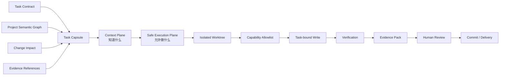
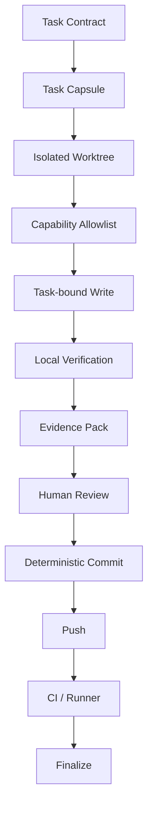

# AI 安全执行平面：隔离工作树、任务绑定写入与人类交付边界

> 系列：Sakura Framework 工程实践
>
> 日期：2026-08-10
>
> 状态：草稿
>
> 核心问题：当 AI 已经能够理解一个大型代码仓库后，怎样让它真正修改文件、执行验证并参与交付，同时不把“获得上下文”升级成“获得整个仓库的操作权”？

[系列目录](../blog.html)

让 AI 参与大型项目开发时，前半段问题通常比较容易理解：

- 给它任务目标；
- 告诉它允许读取哪些资料；
- 建立项目结构图；
- 分析改动影响；
- 找到相关测试；
- 把已有验证结果整理成可追踪 Evidence。

这些能力解决的是：

> AI 是否理解当前任务。

但真正开始修改仓库以后，问题会突然改变。

此时系统需要回答：

- AI 到底可以在哪个工作区写文件；
- 它允许调用哪些工具；
- 哪些文件可以修改；
- 哪些文件即使属于任务目录也必须禁止触碰；
- 文件在 AI 修改之前是否已经被别人改变；
- 验证命令是否真的属于当前任务；
- AI 能不能自己宣布验证通过；
- AI 能不能自己 Commit；
- 能不能直接 Push；
- 谁拥有最终接受修改的权力；
- 执行中途失败后，怎样保证主工作区没有被污染。

这已经不再是 Context Engineering。

它是权限、安全、事务和交付治理问题。

## 先说结论：理解仓库和修改仓库必须属于两个不同平面

**安全执行平面（后文简称“受控施工区”）**：在任务事实已经确定之后，以独立工作区、受限工具、任务绑定写入、验证证据和人工交付边界控制实际仓库修改的执行层。

它与此前的任务上下文层承担不同职责。

可以把两者分成：



最关键的边界是：

```text
知道某个文件
≠
允许修改这个文件

知道某个命令
≠
允许执行这个命令

生成了修改
≠
修改已经被接受

生成了 Evidence
≠
AI 有权宣布交付完成
```

如果这些状态没有被拆开，一个原本只是为了帮助 AI 理解项目的上下文系统，很容易逐步演化成事实上的远程 Shell。

## Task Contract 只能缩小权限，不能创造权限

安全执行首先需要一个非常克制的原则：

**权限单调收缩（后文简称“任务只能越管越窄”）**：下游任务、工具和执行步骤只能在已有授权范围内进一步限制操作，而不能通过生成新的配置自行扩大权限。

例如：

```text
仓库政策允许：
Packages/A/
Packages/B/
Tests/A/

当前 Task Contract 只允许：
Packages/A/Runtime/Foo.cs
Tests/A/FooTests.cs
```

那么后续 Task Capsule、Impact Report 或 Agent 推理即使发现：

```text
Packages/B/Bar.cs
```

与问题高度相关，也只能把它加入：

```text
需要观察
```

而不能自动升级成：

```text
允许修改
```

这形成两个不同集合：

```text
Read / Impact Scope
>=
Write Scope
```

影响分析可以扩大观察范围。

它不能扩大写权限。

同样，Task Contract 本身也不应该拥有：

```text
“我声明自己需要改这个文件，所以现在允许改”
```

这种自授权能力。

真正的 Authority 必须来自更高层仓库政策、人工批准或已经存在的工作状态。

## 隔离 Worktree 把修改与主工作区分开

**隔离工作树（后文简称“独立施工现场”）**：从确定的 Git 身份建立独立工作目录，使 AI 修改、验证和失败恢复不会直接污染维护者正在使用的主工作区。

直接在当前工作区让 Agent 修改文件，会立即遇到几个问题：

- 用户本地可能存在未提交修改；
- AI 无法判断 Dirty 文件是谁产生的；
- 失败恢复可能覆盖人工工作；
- `git clean`、`reset` 或 `stash` 都可能造成不可逆损失；
- 验证结果无法证明只来自 AI 当前任务的修改。

独立施工现场更适合使用这样的流程：

```text
确定 baseline HEAD
→ Preview Worktree Plan
→ 生成 PlanHash
→ 人工或受控执行 Prepare
→ 在隔离 Worktree 修改
→ Inspect
→ 验证
→ 最终 Dispose
```

这种模型的重点不是 Git Worktree 本身。

真正重要的是：

> AI 不需要拥有“整理用户工作区”的权力。

因此，安全执行系统通常反而应该禁止：

```text
git reset --hard
git clean -fd
git stash
force remove
branch mutation
任意 shell 修复
```

如果隔离环境失败，最可靠的恢复方式往往不是：

> 想办法把环境修回去。

而是：

> 丢弃这个隔离执行实例，重新从已知 baseline 创建。

这与临时构建目录、容器和短生命周期测试环境使用的是同一类思路。

## PlanHash 用来防止“我确认的已经不是正在执行的”

预览与实际执行之间还存在一个经典问题：

```text
用户看到 Plan A
→ 用户确认
→ 仓库状态变化
→ 工具实际执行 Plan B
```

用户看似确认过，实际执行对象已经变了。

**执行计划哈希（后文简称“确认指纹”）**：将执行对象、目标路径、基线身份和关键参数编码为稳定摘要，使真正执行时必须重新匹配用户此前确认的计划。

可以把流程理解为：

```text
Preview
→ 产生 PlanHash H1

用户确认 H1

真正执行前
→ 重新构造 Plan
→ 得到 H2

H1 == H2
→ 允许继续

H1 != H2
→ 拒绝执行，要求重新预览
```

这解决的是典型的 TOCTOU：

> Time of Check 与 Time of Use 之间，事实已经变化。

确认指纹不只适用于 AI。

安装器、资源删除、发布工具、批量重命名、数据库迁移和部署系统都可以使用类似模式。

## Capability Allowlist 比“禁止危险命令”更可靠

一种常见安全策略是：

```text
Agent 可以执行 Shell
但禁止 rm -rf
禁止 git reset
禁止 curl
禁止 sudo
……
```

问题是 Shell 的组合空间极大。

黑名单几乎不可能完整覆盖所有危险行为。

更可靠的方式是：

**能力白名单（后文简称“只给专用工具”）**：Agent 不获得通用执行环境，只能调用少量具有固定 Schema、固定输入边界和固定副作用的工具。

例如：

```text
workspace-inspect
task-route
package-resolve
tests-select
impact-analyze
verification-preview
```

这些工具与 Shell 的区别是：

```text
Shell：
输入 = 任意文本
副作用 = 取决于命令

Capability：
输入 = 受 Schema 限制
副作用 = 工具合同预先定义
```

因此，安全执行系统的核心问题应该从：

> 哪些命令需要禁止？

转换成：

> 当前任务真正需要哪几个能力？

这是最小权限原则在 Agent Tooling 中的直接应用。

## 第一个写能力应该非常窄

一旦 Agent 获得写权限，系统安全模型会发生本质变化。

因此最初的 Write Capability 不应该设计成：

```text
write-file(path, content)
```

更合理的是：

**任务绑定写入（后文简称“只能改任务里的明确文本”）**：写操作必须同时通过任务范围、文件所有权、文件类型、基线身份和改动计划验证。

例如一个文本修改可以要求：

```text
Task Contract scope
+
human-owned file
+
UTF-8 / LF
+
allowed extension
+
exact before SHA
+
expected after SHA
+
Change Impact
+
PlanHash
```

只有全部匹配，修改才能被接受。

这意味着：

> 文件位于允许目录中。

仍然不够。

系统还需要知道：

> 这是不是允许 AI 直接写的文件类型？

例如 Unity 项目中，下列文件即使是文本形式，也不适合作为早期 AI 安全写入目标：

```text
.meta
.prefab
.unity
.asset
.controller
.playable
.mat
.anim
```

原因不是 YAML 不能编辑。

而是这些文件真正的语义 Owner 是 Unity Editor、Importer、Serialization System 和 Asset Database。

直接改文本可能绕过：

- GUID 规则；
- FileID；
- Serialized Property；
- Import Pipeline；
- Undo；
- Prefab Override；
- Asset Validation。

所以：

```text
文本格式
≠
文本应当直接编辑
```

安全写入能力应该根据语义所有权，而不是文件扩展是否“看起来可读”。

## before SHA 把修改变成乐观并发事务

假设 Agent 读取了：

```text
Foo.cs
```

并根据这一版本生成修改。

在真正写入之前，开发者又手动修改了同一个文件。

如果系统直接覆盖：

```text
Agent old context
→ replace current file
```

就会形成典型 Lost Update。

**基线内容身份（后文简称“我改的是我刚才读到的那一版”）**：写入之前重新检查文件内容 Hash，只有目标仍等于 Agent 生成 Patch 时所依据的版本才允许提交修改。

流程近似：

```text
读取 Foo.cs
→ SHA = A

生成 Patch

写入前重新计算
→ 当前 SHA = ?

当前 == A
→ 应用修改

当前 != A
→ 拒绝，重新读取并重新规划
```

这其实就是乐观并发控制。

Agent 不需要锁住整个仓库。

但它必须保证：

> 自己没有在一个已经变化的事实基础上继续写。

## 写入成功并不等于任务成功

完成文件修改后，仍然至少存在四个不同状态：

```text
Patch Applied
Verification Passed
Human Accepted
Delivered
```

它们不能压缩成一个：

```text
Done
```

例如：

```text
Patch Applied
→ 编译失败
```

说明写入动作本身成功，但任务失败。

又例如：

```text
Verification Passed
→ 人工 Review 发现需求理解错误
```

说明代码可以编译，但仍然不应该进入主分支。

因此安全执行需要把**执行事实**和**业务接受事实**分开。

## Verification 不能由 Agent 自己定义并自己宣布通过

一个 Agent 如果同时拥有：

```text
修改代码
选择验证
运行验证
解释结果
宣布完成
```

实际上就同时拥有了执行者和审计者身份。

这会产生明显的自证风险。

更可靠的结构是：

```text
Task Contract
→ 指定 required verification class

Impact
→ 可以增加观察和推荐检查

Verification Catalog
→ 提供已登记命令

Execution Plane
→ 执行受允许命令

Evidence
→ 保存原始结果

Agent
→ 可以解释 Evidence
但不能改变 Evidence Authority
```

也就是说：

> AI 可以建议检查什么，可以执行已获授权的检查，也可以解释结果，但不能因为自己的解释自动创造更高等级的通过结论。

这与此前“Evidence Manifest 只引用事实、不重新制造 passed”属于同一原则。

## Provider 自己也需要有界执行

即使 Agent 没有 Shell，内部 Provider 仍可能启动子进程。

例如：

```text
tests-select
impact provider
schema generator
static analyzer
```

如果这些 Provider 没有：

- timeout；
- 输出大小上限；
- 稳定错误分类；
- 版本检查；

Agent 主流程仍然可能永久挂起。

因此：

**有界 Provider（后文简称“内部工具也不能无限跑”）**：每个外部分析器都必须拥有执行时间、输出容量、版本和失败语义边界，并把异常转化为稳定的 unknown 或 blocker。

理想行为是：

```text
Provider timeout
→ unknowns[]
→ blockers[]
→ providerReceipts[]
```

而不是：

```text
Provider hang
→ 整个 Agent workflow 永远等待
```

安全执行不仅需要限制 AI。

它同样需要限制 AI 所依赖的工具。

## Evidence Pack 应该是引用集合，不是第二份日志仓库

修改和验证完成后，需要一份可供 Review 使用的结果。

最容易的做法是把所有内容复制进去：

- Diff；
- 完整 Log；
- Test XML；
- Artifact；
- Impact；
- Task；
- Verification Output；
- Build Files。

长期下来，Evidence Pack 会成为另一个巨大的事实副本。

**证据包（后文简称“交付检查单”）**：组合任务、修改、Impact、Verification 和 Artifact 的稳定引用与摘要，而不是复制原始 Evidence 内容。

例如：

```text
Evidence Pack
├─ Task Contract Ref
├─ Task Capsule Ref
├─ Patch Receipt
├─ Impact Ref
├─ Verification Evidence Ref
├─ Artifact Ref
└─ Content Hashes
```

原始 Test XML 仍由测试系统拥有。

Build Artifact 仍由构建系统拥有。

Impact Report 仍由 Impact Provider 拥有。

Evidence Pack 只负责把这些事实组装成：

> 这次修改应该由 Review 者检查哪些东西？

这种 reference-only 结构可以减少：

- 事实复制；
- 状态漂移；
- 大文件重复存储；
- Evidence 二次解释；
- 不同工具对同一结果产生多个版本。

## Human Review 是 Authority Boundary，而不是 UI 步骤

**人工接受边界（后文简称“最后的接管点”）**：只有具备明确交付权限的人类操作才能把 AI 生成的修改从“候选变更”升级为“仓库接受的变更”。

这个边界应该体现在工具权限里，而不只是一句：

> 建议人工 Review。

例如 Agent/MCP 可以：

```text
生成修改
运行已授权验证
生成 Evidence Pack
```

但不能：

```text
Record Review
Commit
Push
Finalize
```

这样，“人工审核”就不再是可选流程建议。

它成为系统无法绕过的 Authority Boundary。

这点尤其重要，因为未来 AI 的代码质量可能非常高。

即使修改本身 99% 正确，也不代表 Agent 因此获得：

```text
仓库所有权
```

自动化能力和组织权限是两套独立系统。

## Alternate Index 可以减少 Commit 阶段污染

人工接受修改后，交付阶段同样需要控制。

如果直接在维护者主工作区运行：

```text
git add .
git commit
```

很容易把无关 Dirty 文件一起带入提交。

一种更稳健的方式是使用独立 Git Index。

可以把流程近似理解为：

```text
AI Worktree
→ 已确认 Patch Set

Human Review
→ 接受指定文件

Alternate Git Index
→ 只 Stage 已接受内容

Deterministic Commit
→ 明确 Parent
→ 明确 Tree
→ 明确 Message
```

这样 Commit 的内容由 Review 结果决定，而不是由当前工作区“顺便有什么”决定。

它解决的是交付阶段的范围污染。

## Direct-main 并不意味着放弃安全边界

小型单维护者仓库不一定需要为每次 AI 修改建立 PR。

`branch → PR → merge` 是一种治理方式，但不是唯一方式。

真正关键的是：

- 修改是否经过隔离；
- 是否拥有明确任务范围；
- required verification 是否完成；
- Review 是否来自人工；
- Commit 内容是否确定；
- Push 是否显式执行；
- Evidence 是否仍然可追踪。

因此可以存在：

```text
single maintainer
+
direct main
+
strict execution boundary
```

但 Direct-main 的风险等级需要进一步区分。

例如可以划分：

| Delivery Policy | 合理要求 |
|---|---|
| human-maintenance | 允许人工接受少量已知验证缺口 |
| ai-assisted | required verification 应完整，不能存在高风险 unknown |
| release-critical | 还需要 Runner、Stable API 和发布资格证据 |

这里最重要的思想是：

> 是否走 PR，与是否拥有严格安全合同不是同一个问题。

## Safe Execution 的真实验收不是单元测试，而是完整 dogfood

一个执行平面可以拥有：

- 很多 Schema；
- 完整单元测试；
- 临时 Git Repo Smoke；
- Fake Remote；
- 测试 Provider；
- 模拟 Review。

这些都很有价值。

但它们仍然不能证明：

> 真实仓库中，这整条链真的能够安全工作。

**真实仓库资格化（后文简称“拿自己开刀”）**：选择一个低风险真实任务，在共享仓库上完整执行任务创建、修改、验证、Evidence、人工 Review、Commit、Push 和 CI 闭环。

一个合适的首个任务可以非常小：

```text
README typo
或
test-only fixture
```

重点不是展示 AI 能生成复杂代码。

重点是完整走通：



只要其中任何一步仍依赖：

- 手工补文件；
- 临时放宽权限；
- 任意 Shell；
- 删除证据；
- 修改 Task Contract；
- 绕过 PlanHash；

就说明真实安全闭环还没有成立。

因此，在完成真实 dogfood 之前，更准确的状态应该是：

> Safe Execution 的设计与局部实现已经建立，但生产工作流资格仍待验证。

这比直接宣称“AI 安全执行已经完成”更加可靠。

## 证据债务会成为自动化扩张后的新瓶颈

AI 工作流能力增加以后，很容易出现一种新债务：

```text
功能实现越来越多
↓
本地测试越来越多
↓
Runner / exact-SHA 资格化跟不上
↓
大量状态停留在 local-passed / runner-pending
```

**证据债务（后文简称“代码已经有了，证明还没跟上”）**：实现和本地验证已经完成，但正式 Evidence、Runner、same-SHA 或消费资格仍未闭环的累积状态。

当 Evidence Backlog 持续增长时，继续增加新工具会产生一个反直觉结果：

> AI 基础设施越丰富，团队越难回答每项能力究竟被证明到了哪一步。

所以 Safe Execution 后续不应该简单继续扩展：

```text
C.7
C.8
C.9
更多 Capability
更多 MCP Write Tool
```

更合理的下一阶段是：

```text
Qualify
Dogfood
Reduce Unknowns
Reduce Evidence Debt
```

基础设施必须开始证明自己。

## Unity Serialized Asset 应建立新的写入层，而不是放宽文本权限

当前安全文本写入模型不能直接自然延伸为：

```text
现在允许 .cs
下一步允许 .prefab
再下一步允许 .unity
```

Unity Serialized Asset 需要完全不同的安全模型。

更合理的方向是：

```text
Serialized Asset
→ Canonical IR
→ Patch Proposal
→ Unity Editor API
→ Reload
→ Validate
→ Evidence
```

AI 修改的对象不是 Prefab YAML。

而是一份语义化操作：

```text
在节点 X 上添加 Component Y
修改 SerializedProperty Z
保留现有 Prefab Overrides
```

真正写 Asset 的仍然是 Unity Editor API。

这保持了：

```text
AI 提议修改
≠
AI 直接拥有资产序列化格式
```

这类设计可以迁移到：

- Scene；
- Animator Controller；
- Timeline；
- Material；
- ScriptableObject；
- Addressables Group；
- Project Settings。

## 安全执行不是 Sandbox，而是一条权限递减链

把这些机制组合起来以后，可以看到 Safe Execution 的核心并不是：

> 找一个 Sandbox 把 AI 关进去。

它更接近一条逐步缩小权限、逐步增加证据的链。

```text
Repository Authority
↓
Task Authority
↓
Capability Authority
↓
File Authority
↓
Patch Authority
↓
Verification Evidence
↓
Human Acceptance
↓
Delivery Authority
```

随着流程推进：

```text
AI 可以做的事情越来越明确
证据越来越丰富
最终决策权限却没有向 AI 转移
```

这是一种很重要的结构。

很多自动化系统恰好相反：

```text
Agent 了解得越多
→ 权限越大
→ 最后顺便获得部署能力
```

而安全执行应该坚持：

> 信息增加不意味着 Authority 增加。

## 常见设计失败

### 给 Agent 一个“受限制的 Shell”

最后仍然需要维护庞大的危险命令黑名单。

### Context Scope 直接作为 Write Scope

“相关”被错误解释成“允许修改”。

### 允许 Agent 自己扩大 Task Contract

任务开始后不断把新发现的文件加入权限范围。

### 直接修改用户当前 Dirty Worktree

失败恢复会威胁已有人工修改。

### 写入前不检查 before SHA

Agent 根据旧内容生成修改，却覆盖了刚刚发生的新变化。

### 所有文本格式都认为可以安全直接编辑

Unity Serialized Asset 的语义所有权被绕过。

### Agent 自己选择验证并宣布完成

执行者同时成为审计者。

### Evidence Pack 复制所有原始日志

产生第二套事实存储和状态漂移。

### Review 只是提示文本

Agent 仍然技术上可以 Commit 或 Push，人工审批可以被绕过。

### Direct-main 被理解成“无需治理”

没有 PR 不代表可以没有任务、Evidence 和交付边界。

### Provider 没有 timeout

内部工具挂起仍然可以拖死整条执行链。

### 本地测试通过后立刻扩大 Capability

真实仓库端到端流程还没有被证明，就继续增加更多写权限。

## 我的 AI 安全执行检查表

设计 Agent 执行层时，我会至少检查：

1. Context Plane 与 Execution Plane 是否是两个独立系统？
2. Task Contract 是否只能收窄权限？
3. Impact Analysis 是否只能扩大观察范围，而不能扩大 Write Scope？
4. Agent 是否在隔离工作区中执行修改？
5. 是否禁止自动清理、reset、stash 用户工作区？
6. 执行前是否验证 baseline Commit 和 Root Identity？
7. Preview 与 Execute 是否使用稳定 PlanHash 绑定？
8. Agent 是否只拥有明确的 Capability Allowlist？
9. 是否完全不提供任意 Shell？
10. 每个 Write Capability 是否限制文件类型和所有权？
11. 写入是否要求 exact before SHA？
12. 文件变化后是否拒绝使用旧 Patch？
13. Unity Serialized Asset 是否禁止直接文本写入？
14. Provider 是否拥有 timeout、输出上限和稳定错误分类？
15. Required Verification 是否来自正式合同，而不是 Agent 临时决定？
16. AI 是否只能解释 Evidence，不能创造 Evidence Authority？
17. Evidence Pack 是否以引用为主，而不是复制原始证据？
18. Agent 是否无法自己 Record Review？
19. Agent 是否无法自行 Commit、Push 或 Finalize？
20. Commit 是否只包含人工明确接受的 Patch Set？
21. Direct-main 是否按任务风险采用不同交付政策？
22. 是否已经在真实仓库完整 dogfood 一次端到端流程？
23. CI/Runner 结果是否重新绑定最终 Commit？
24. Evidence Backlog 是否受到容量控制？
25. 新 Capability 是否必须通过真实需求和资格化才能加入？
26. Prefab、Scene 等资产是否计划通过语义 IR 和 Editor API 修改？
27. 执行失败后是否可以直接丢弃隔离环境，而不是修复主工作区？
28. Debugger 是否能够还原某次 AI 修改经历了哪些权限和证据阶段？

AI 参与开发以后，最危险的变化不一定是“AI 写错代码”。

更难治理的情况是：

> 系统逐渐无法回答 AI 为什么拥有某项权限、某个修改基于什么事实、谁批准了它进入仓库，以及失败后哪一步仍然可信。

安全执行平面的价值，就是让这些问题在工具和数据模型中拥有明确答案。

理想状态不是让 AI 获得和维护者完全相同的工作环境。

而是让 AI 在一条比人类更窄、更确定、更容易审计的施工路径中工作：

```text
知道任务
→ 获得最小能力
→ 在隔离环境修改
→ 产生可验证证据
→ 交给人类接管
→ 由仓库正式交付流程完成最后一步
```

AI 可以承担越来越多工作。

但 Authority 不必因此一起扩张。

## 术语对照

| 正式术语 | 文中通俗称呼 |
|---|---|
| 安全执行平面 | 受控施工区 |
| 权限单调收缩 | 任务只能越管越窄 |
| 隔离工作树 | 独立施工现场 |
| 执行计划哈希 | 确认指纹 |
| 能力白名单 | 只给专用工具 |
| 任务绑定写入 | 只能改任务里的明确文本 |
| 基线内容身份 | 我改的是我刚才读到的那一版 |
| 有界 Provider | 内部工具也不能无限跑 |
| 证据包 | 交付检查单 |
| 人工接受边界 | 最后的接管点 |
| 真实仓库资格化 | 拿自己开刀 |
| 证据债务 | 代码已经有了，证明还没跟上 |

---

## 内部资料依据

本文主要基于以下材料整理：

- `feature-audit/AI/01-UnityGameFramework AI 工作流周度审计.md`
- `blogs/Sakura Framework 工程实践/09-开发任务胶囊与项目语义图.md`
- `blogs/publication.v1.json`
- `blogs/README.md`

当前审计材料记录 Safe Execution C.1–C.6 已具有实际 Schema、CLI、实现与本地测试，但真实共享仓库的完整端到端 dogfood delivery 尚未完成，因此本文不把“生产级 AI 自动交付已经成立”写成当前事实。

文中关于权限单调收缩、Delivery Policy、真实仓库资格化、Evidence Debt 控制以及 Unity Serialized Asset IR 的部分包含基于现有材料提出的工程归纳与后续建议，不表示对应能力已经全部实现、通过 Runner 资格化或进入 Supported 生命周期。