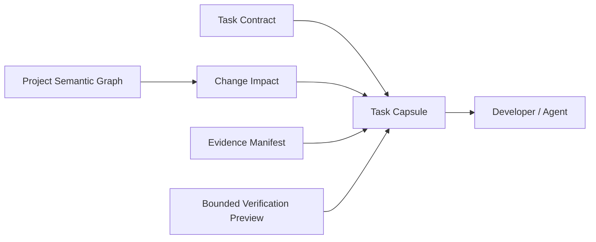
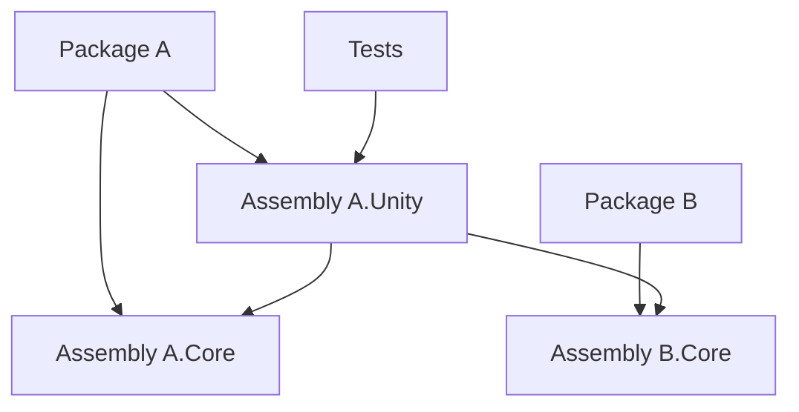
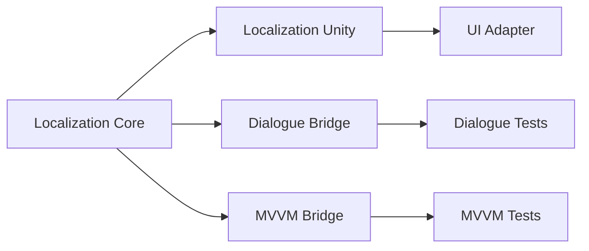

# 开发任务胶囊与项目语义图：AI 协作中的只读上下文、影响分析与证据边界

> 系列：Sakura Framework 工程实践
>
> 日期：2026-08-07
>
> 状态：可发布候选
>
> 核心问题：大型代码仓库如何把一个开发任务需要的范围、项目结构、影响关系和验证证据压缩成稳定的机器可读上下文，同时不把“理解仓库”错误地升级成“拥有执行权限”？

[系列目录](../blog.html)

让 AI 或其他自动化工具参与大型 Unity 项目开发时，最直接的方案通常是：

> 把仓库尽可能多地交给它读取。

这在小项目里问题不大。

但当一个仓库同时存在大量 UPM 包、程序集、设计文档、历史计划、生成清单、测试入口、生命周期状态和可选依赖后，“能够读取整个仓库”和“能够正确理解当前任务”已经不是同一件事。

一个 Agent 即使拥有足够大的上下文窗口，也仍然需要回答：

- 这次任务究竟允许改什么；

- 哪些文件只是历史资料；

- 哪些文档拥有当前状态解释权；

- 修改一个程序集会影响哪些包；

- 哪些测试与当前变更真正相关；

- 某条 `passed` 结论对应什么原始 Evidence；

- 某个命令只是建议运行，还是已经获得执行授权；

- 哪些信息来自静态事实，哪些只是模型自己的推断。


如果这些问题没有结构化答案，扩大上下文只会扩大搜索空间。

Sakura Framework 最近加入的 Development Intelligence 与 Project Semantic Graph，核心方向正好相反：

> 不把整个仓库倾倒给 Agent，而是先构造一份有边界、可追踪、只读的任务事实包。

## 先说结论：Agent Context 应该是投影，而不是仓库副本

**开发任务胶囊（后文简称“任务事实包”）**：围绕一个具体开发任务，把允许范围、静态影响、验证候选和 Evidence 引用组合成确定性只读结果。

任务事实包不是：

- Git 工作区副本；

- 任意 Shell；

- 自动执行器；

- 修改授权；

- 模型长期记忆；

- 对整个仓库的自然语言总结。


它更接近数据库中的只读 View。

仓库里可能存在大量事实，但当前任务只投影其中真正相关的一部分。



这个结构把四个经常混在一起的问题拆开：

1. **任务范围是什么。**

2. **项目结构是什么。**

3. **修改可能影响什么。**

4. **已有验证究竟证明了什么。**


## Task Contract 负责描述允许讨论的任务

**Task Contract（后文简称“任务边界单”）**：用严格 Schema 描述一次开发工作的目标、作用范围和相关输入，而不是依靠聊天历史隐式推断。

任务边界单最重要的作用，不是帮助 Agent “多知道一点”。

而是明确什么不属于当前任务。

例如一次 UI 修复可能只允许涉及：

```text
Packages/com.xxx.ui/
Packages/com.xxx.mvvm/
对应测试
对应设计文档
```

仓库中即使同时存在：

- Server；

- Sandbox；

- Release；

- GAS；

- Modding；


它们也不应该因为 Agent 搜索时碰巧发现，就自动进入修改范围。

这解决的是大型仓库中非常常见的**范围漂移**：

```text
修一个 UI 问题
→ 顺手重构 Event
→ 发现 Bootstrap 可以优化
→ 修改公共 API
→ 最终任务已经无法独立验证
```

任务边界单把“当前允许研究的世界”先固定下来。

## 验证命令可以被推荐，但不能因此获得执行权

开发 Agent 很容易产生这样一种逻辑：

> 我知道应该运行这个命令，所以我可以运行这个命令。

这两件事必须分开。

**有界验证预览（后文简称“建议检查项”）**：系统可以根据任务产生结构化的验证命令候选，但这些候选本身不创造执行权限。

因此：

```text
知道命令
≠
允许执行命令
```

这一区分对 AI 工作流非常关键。

例如任务事实包可以告诉 Agent：

```text
建议验证：
- 某个 Node 架构门禁
- 某个 Unity EditMode 测试
- 某个生成清单一致性检查
```

但任务事实包本身仍然只是只读数据。

是否执行这些命令，需要由另一层 Safe Execution、CI 或人工操作决定。

换句话说：

> Context Plane 负责说明“应该检查什么”，Execution Plane 才负责决定“能不能执行”。

这能防止一个原本用于提高理解能力的系统，悄悄演化成无限制自动化入口。

## Project Semantic Graph 描述代码之间的结构关系

只有路径列表仍然不足以支持影响分析。

Unity 工程中的代码关系至少包含：

- Package；

- asmdef；

- Assembly Reference；

- Package Dependency；

- 条件程序集；

- 可选 Bridge；

- 测试程序集；

- 生成 Artifact。


因此需要一个比“全文搜索”更稳定的结构表示。

**项目语义图（后文简称“项目关系图”）**：从受界静态来源中提取节点和边，形成可以被机器稳定消费的 Unity 项目拓扑。

它关注的是：

```text
A 依赖 B
B 提供 C
D 引用了 A
E 是 A 的测试闭包
```

而不是：

> 这几个文件看起来好像比较相关。

这两种关系来源完全不同。

前者可以由 Manifest、asmdef 等静态事实确定。

后者只是语义猜测。



拥有这张图以后，Agent 不需要每次重新阅读全部 asmdef 来猜依赖。

更重要的是，不同工具可以共享同一份拓扑事实。

## 图应该由确定性 Provider 产生

项目关系图最大的风险，是变成另一个不可验证的“AI 总结文件”。

如果图中的边来自：

> 模型认为这两个模块有关。

那么它无法承担架构分析职责。

因此图的数据来源必须受到限制。

**静态图 Provider（后文简称“事实采集器”）**：只从明确允许的 Unity 静态结构中读取关系，并以固定 Schema 输出节点与边。

理想关系是：

```text
Manifest / asmdef / 明确静态合同
            ↓
        Provider
            ↓
  Project Semantic Graph
```

而不是：

```text
整个仓库
   ↓
LLM 推测
   ↓
“可能的依赖关系”
```

自然语言推理仍然可以建立在图之上。

但图本身应尽可能保持确定性。

## Change Impact 不应等于 grep 结果

假设修改：

```text
Framework.Localization.Core
```

最简单的影响分析是全文搜索这个字符串。

这种方式能找到直接文本引用，却看不到很多结构关系。

真正的影响可能沿图传播：



**Change Impact（后文简称“改动波及面”）**：根据明确 Provider 和项目关系图计算任务可能影响的对象集合，并保留影响来源。

“改动波及面”应区分：

- 直接目标；

- 结构依赖；

- 测试闭包；

- 文档或生成 Artifact；

- 无法确定的部分。


它不能把“可能相关”悄悄升级成“必须修改”。

影响分析的职责是扩大观察范围，不是扩大写入范围。

这两个集合必须允许不同：

```text
需要观察的范围 ≥ 允许修改的范围
```

这是任务治理中很重要的一条边界。

## exact coverage 比“看起来差不多”更适合机器

假设 Graph 已经明确列出三个受影响程序集，但 Task Capsule 最终只带入其中两个。

如果系统只生成自然语言摘要：

> 主要影响 UI 和 Dialogue。

遗漏很难被自动发现。

更可靠的方法是验证：

```text
Graph 计算得到的结构影响
            ↓
   Capsule Impact 集合
            ↓
      exact coverage
```

对于被定义为必须覆盖的关系，投影必须完整。

这样项目结构变化后，旧 Task Capsule 会直接失效，而不是继续提供一份已经落后的上下文。

## Evidence Manifest 不应该自己制造“通过”结论

开发上下文的另一个危险来源，是测试证据被二次概括。

例如：

```text
Agent 读取了一篇审计
→ 审计说测试通过
→ Agent 在报告里再次写“测试通过”
→ 后续又把这句话当 Evidence
```

几轮之后，已经很难找到最初的测试结果。

**Evidence Manifest（后文简称“证据索引”）**：记录原始 Artifact 的身份、来源与引用关系，而不是重新创造测试事实。

证据索引应尽量指向：

- 测试 XML；

- JSON Summary；

- Runner Artifact；

- API Diff；

- Build Receipt；

- 固定 SHA。


而不是只保存：

> 验证已通过。

这与普通文档摘要有本质区别。

摘要帮助人阅读。

Evidence Manifest 帮助系统追踪事实来源。

## Task Capsule 是组合结果，不是真相源

当 Task Contract、Impact 和 Evidence 都存在以后，很容易把最终 Capsule 视为新的权威文件。

这仍然是错误的。

**任务胶囊只是投影。**

它引用真正的 Source of Truth：

```text
Task Contract
Project Graph
Impact Providers
Evidence Artifacts
```

因此它应该能够被重新生成。

如果重新生成结果变化，说明源事实已经变化。

这比手工维护一份越来越陈旧的 `agent-context.md` 更可靠。

## Machine-owned 文件应与人工文档分开

自动生成的任务数据还需要一个明确的所有权规则。

例如：

```text
.sakura/tasks/
.sakura/agent/
```

这类目录适合保存机器拥有的临时或生成结果。

它们不应要求开发者手工修补。

否则会产生新的双重真相源：

```text
源 Schema 已更新
但某个旧 Capsule 被人工改过
→ 二者开始分叉
```

机器文件最好的维护方式通常是：

> 不满意结果就修改 Provider 或源数据，然后重新生成。

而不是编辑生成物。

## Read-only 是第一阶段能力，而不是功能缺失

AI 工具建设很容易从：

```text
读取
→ 推荐
→ 自动改代码
→ 自动执行测试
→ 自动 Commit
→ 自动发布
```

一路扩张。

这种路线的风险在于，每增加一步，权限边界都会指数级复杂。

Sakura Framework 当前先完成：

- Task Contract；

- Impact；

- Evidence Manifest；

- Task Capsule；

- Project Semantic Graph；


而明确没有因此自动获得：

- 任意 Shell；

- Safe Execution；

- Git 写入；

- Asset 写入；

- Manifest 修改；

- Runner 调度；

- 发布权限。


我认为这是合理的顺序。

一个 Agent 在获得执行权之前，首先应该能够稳定回答：

> 我正在处理什么，我看到了什么，我依据什么作出判断。

如果连这一层都不稳定，更强的执行能力只会把错误更快地写进仓库。

## 对人工开发同样有价值

这种基础设施并不只服务 AI。

新成员接手一个任务时，同样需要知道：

- 任务允许修改哪些模块；

- 相关依赖在哪里；

- 哪些测试应该运行；

- 当前证据停在哪一级；

- 哪些文档只是历史背景；

- 哪些关系是静态事实。


因此 Development Intelligence 更准确的定位不是：

> AI 专用功能。

而是：

> 把开发任务从隐性团队知识转换成显式工程数据。

AI 只是最明显的消费者之一。

## 我的判断

AI 原生开发工作流的核心，不是把更多 Token 塞进上下文窗口。

更重要的是把仓库中的工程事实分成：

```text
任务范围
+
项目拓扑
+
影响关系
+
证据来源
+
执行权限
```

其中前四项可以形成只读上下文。

第五项必须保持独立。

这使系统能够做到：

> 理解能力可以很强，执行权限仍然很窄。

对于大型长期维护仓库，这比“给 Agent 一个终端，然后告诉它小心一点”更容易治理。

## 设计检查表

- 当前任务是否拥有严格 Task Contract；

- Agent 是否能够区分观察范围与写入范围；

- 验证命令候选是否会意外获得执行权限；

- 项目依赖图是否来自静态可验证 Provider；

- 图数据是否是确定性输出；

- Impact 是否保留具体来源；

- 结构影响是否存在 coverage 检查；

- Evidence 是否指向原始 Artifact；

- Capsule 是否只是可重新生成的投影；

- Machine-owned 文件是否与人工文档分离；

- Read-only Context 是否与 Safe Execution 分层；

- Agent 是否能明确指出“不知道”的部分，而不是补全推测。


## 术语对照

|正式术语|通俗称呼|含义|
|---|---|---|
|Task Contract|任务边界单|当前开发工作的结构化范围合同|
|Project Semantic Graph|项目关系图|从静态 Unity 事实生成的项目拓扑|
|Change Impact|改动波及面|结构化计算出的潜在影响范围|
|Evidence Manifest|证据索引|指向原始验证 Artifact 的引用集合|
|Task Capsule|任务事实包|为当前任务组合出的只读上下文投影|
|Bounded Verification Preview|建议检查项|可推荐但不自动获得执行权的验证候选|
|Machine-owned Artifact|机器生成物|应重新生成而非人工维护的派生数据|

> 资料说明：本文依据 2026-08-06 的 Development Intelligence Contract Foundation 与 Project Semantic Graph Foundation 整理。当前实现属于只读开发智能基础设施；Safe Execution、任意 Shell、Git/Asset 写入、Runner 调度和发布能力不应从本文内容中外推。