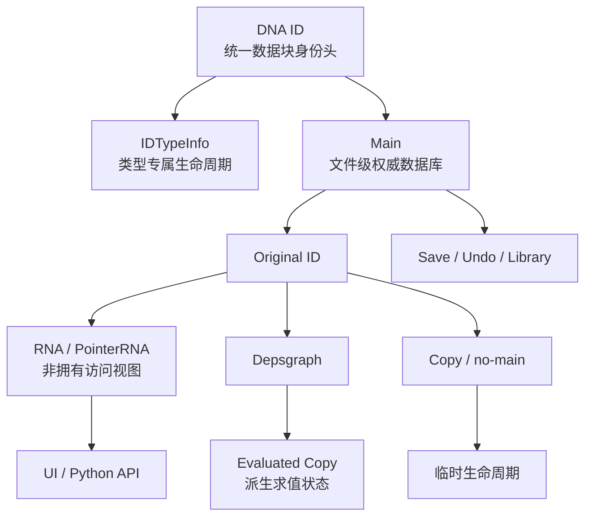
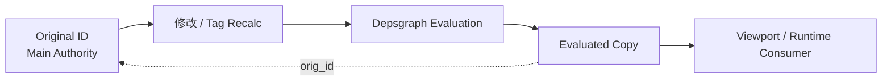
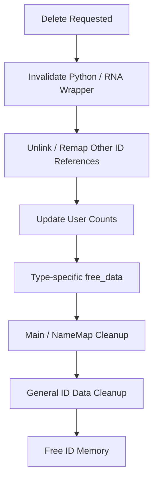
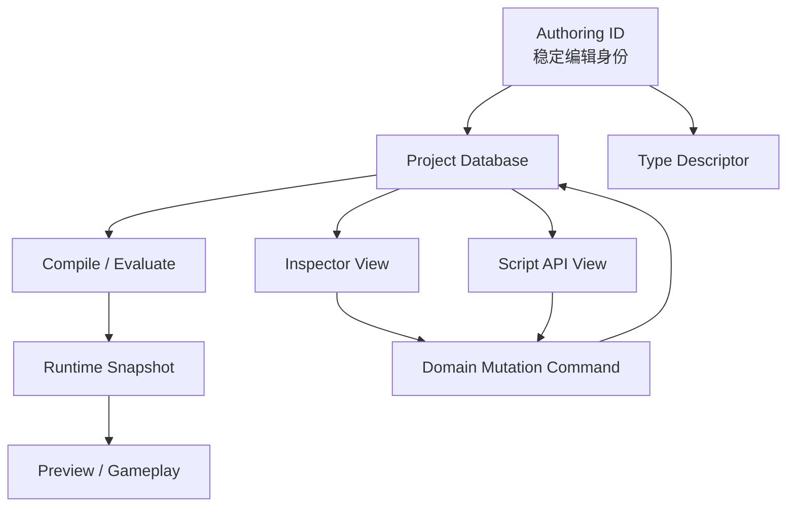

# 数据块权威层与访问视图：Blender ID、Main 与 RNA 的身份边界

> 系列：从 Blender 源码理解创作工具设计
>
> 日期：2026-09-07
>
> 状态：草稿
>
> 核心问题：Blender 中一个 Object、Mesh 或 Material 同时可能出现在 `.blend` 持久数据、Main 数据库、Depsgraph 求值结果和 Python/RNA API 中，这些“看起来像同一个对象”的表示怎样区分身份、所有权和失效边界？
>
> 关键词：Blender、ID、Main、RNA、PointerRNA、Data Block、Evaluated Data

[系列目录](../blog.html)

在 Blender Python 中，我们可以非常自然地写：

```python
obj = bpy.data.objects["Cube"]
obj.name = "Player"
```

看起来，这和操作一个普通 Python 对象没有太大区别。

`obj` 有名字。

有属性。

可以被复制。

可以被删除。

可以通过 Python 长时间保存引用。

如果只从这层 API 出发，很容易建立一个非常直觉的模型：

```text
Python Object
→
包装一个 C/C++ Object
→
这个地址就是它的身份。
```

但真正开始研究 Blender 的数据生命周期以后，这个模型很快就会遇到问题。

同一个可见 Object 可能同时存在：

- `.blend` 文件中的持久化数据；
- 当前文件 `Main` 中的原始 ID；
- Depsgraph 中的 evaluated copy；
- Python / RNA 的访问包装；
- no-main 临时副本；
- Undo 或读取流程中重新分配过地址、但仍被视作同一会话对象的数据。

于是几个原本看起来理所当然的问题，突然都需要重新回答：

```text
“这个对象是谁”
到底由什么决定？

内存地址变了以后
它还是不是原来的对象？

Python 还能访问它
是否意味着 Python 拥有它？

Depsgraph 给我的 Object
能不能直接塞回 bpy.data？

users == 0
是否意味着可以直接 free？

改 obj.name
究竟是在改一个字符串，
还是在修改文件级数据库索引？
```

Blender 数据模型最值得研究的地方，正是它没有让这些问题共享同一个答案。

## 先说结论：Blender 把权威数据、类型行为、数据库归属和 API 访问拆成了四层

**数据块权威层（后文简称“真正属于当前文件的数据”）**：由 DNA `ID`、类型专属生命周期和 `Main` 数据库共同定义，负责数据块的持久身份、归属、命名、引用关系和保存生命周期。

**访问视图（后文简称“外部系统现在怎样看见这份数据”）**：RNA / `PointerRNA` 为 UI、Python 和其他动态访问提供类型化视图，但不因此接管底层数据的生命周期。

可以把主关系压缩成：



这里有几个非常重要的不等式：

```text
ID 地址
≠
长期资产身份

可见名称
≠
单独主键

PointerRNA
≠
所有权智能指针

Evaluated ID
≠
Main 中的 Original ID

Main NameMap
≠
数据块所有权本身
```

理解这些边界以后，Blender 中大量看似特殊的创建、复制、重命名和删除逻辑都会变得更容易解释。

## DNA `ID` 不是普通基类，而是持久数据块的统一身份头

**DNA `ID`（后文简称“所有可持久数据块共同携带的身份证头”）**：位于 Object、Mesh、Scene、Material 等 Blender data-block 结构开头的统一持久化布局，使通用系统可以在不知道具体领域类型时管理身份、命名、Library、引用计数和生命周期。

这和传统面向对象中的：

```text
BaseObject
```

并不完全一样。

它首先服务的是：

```text
持久化数据协议。
```

一个 `ID` 中同时包含多种不同性质的字段。

可以粗略分成：

| 状态 | 主要职责 |
|---|---|
| 类型与名称 | 当前 data-block 是什么、叫什么 |
| Library 归属 | 属于当前文件还是 linked library |
| 用户计数 | 当前引用关系 |
| 持久 flags | 随 `.blend` 保存的状态 |
| runtime tags | 只服务当前运行流程的状态 |
| session UID | 当前 Blender 会话中的稳定身份 |
| dynamic properties | 用户/系统扩展属性 |
| evaluated origin | 派生副本指回原始 ID |
| Python instance | Python/RNA 包装缓存 |
| runtime | 不进入磁盘/Undo 的运行态 |

因此：

```text
Object
```

并不是先成为一个完整领域对象，

然后系统再额外挂：

```text
名字
Library
引用数
Python 信息。
```

这些能力从 ID 层就进入了所有 data-block 的基础合同。

## `ID.name` 甚至不是纯粹的显示名称

一个很容易产生误解的细节是：

```text
ID.name
```

并不只是：

```text
"Cube"
```

这样的用户字符串。

其前部还编码了 ID 类型信息。

通用代码可以从这里恢复：

```text
Object
Mesh
Material
Scene
...
```

对应的类型码。

所以：

```text
类型
```

并不只存在于：

- C++ RTTI；
- RNA 类型；
- Python class。

DNA 数据头自身就携带类型分派信息。

这非常符合 Blender 的文件数据模型：

> 类型身份首先属于可保存数据协议，而不只是运行时语言对象系统。

## 可见名称不是完整身份

假设当前文件中存在：

```text
Object "Foo"
Camera "Foo"
```

这可以是合法状态。

又假设：

```text
本地 Mesh "Stone"
Library A 中的 Mesh "Stone"
```

同样可以同时存在。

因此 Blender 的名称空间更接近：

```text
ID Type
+
Owning Library
+
Visible Name
```

而不是：

```text
Name
```

单独成为全局主键。

**命名空间身份（后文简称“同名是否冲突还要看它是什么类型、属于哪个 Library”）**意味着：

```text
重命名
```

也不能被理解成：

```text
直接改字符串。
```

它需要继续维护：

- 类型内唯一性；
- Library 命名空间；
- NameMap；
- 排序；
- 可能的冲突后缀。

这也是为什么：

```text
obj.name = ...
```

背后需要进入正式数据管理路径。

## 内存地址同样不适合作为稳定身份

一个对象在：

- Undo；
- 文件读取；
- 内部重新分配；
- evaluated/original 转换；

过程中，地址可能发生变化。

如果编辑器长期状态只保存：

```text
void*
```

很多跨阶段关联都会失效。

Blender 因此还存在：

**`session_uid`（后文简称“当前 Blender 会话里的稳定身份号”）**：在 rename 和部分内部重分配以后仍然保持，可用于运行时缓存、Undo 场景和当前会话内的 ID 关联。

但这里必须保留一个非常重要的边界：

```text
session_uid
≠
跨文件永久 UUID。
```

它适合回答：

```text
“当前这次 Blender 会话中，
重新分配后的这个 ID
是不是之前那个 ID？”
```

它不适合回答：

```text
“另一台电脑上的另一个 .blend
是不是同一个长期资产？”
```

稳定身份永远要先定义：

> 稳定到哪个生命周期。

## 一个 ID 可以同时拥有多种不同的“身份”

可以把常见身份层次拆成：

| 身份 | 适用范围 |
|---|---|
| 内存地址 | 当前实例当前分配 |
| 类型 + Library + Name | 文件数据库中的命名身份 |
| `session_uid` | 当前 Blender 会话中的稳定身份 |
| RNA Path | API / Animation / UI 中的访问路径 |
| 外部资产身份 | 需要由更高层资产系统定义 |

这提醒我们：

> “给对象加一个 ID”并不能自动解决身份问题。

真正应该先问：

```text
谁需要识别它？

跨越什么生命周期？

允许 rename 吗？

允许重新分配吗？

允许跨文件吗？

允许跨进程吗？
```

不同问题需要不同身份。

## `IDTypeInfo` 把统一身份接到类型专属生命周期

统一 `ID` 头解决的是：

```text
所有 data-block
都需要共同遵守什么。
```

但 Mesh 和 Object 的内部数据当然完全不同。

Mesh 可能拥有：

- CustomData；
- Geometry；
- Attribute；
- Cache。

Object 则可能拥有：

- Modifier；
- Constraint；
- Data 引用；
- Runtime 状态。

通用 ID 系统不可能硬编码所有领域结构。

因此 Blender 使用：

**`IDTypeInfo`（后文简称“这类数据块自己的生命周期说明书”）**：把统一 ID 类型码映射到该类型的结构大小、Main 分区以及 init/copy/free/read/write 等领域回调。

可以理解成：

```text
统一身份协议
+
类型专属行为表。
```

例如通用层能够决定：

```text
这是一个 Mesh ID
```

随后：

```text
IDTypeInfo<Mesh>
```

再负责真正的 Mesh：

- 初始化；
- 深复制；
- 释放；
- ID 遍历；
- Cache 遍历；
- 文件读写。

这种设计避免两个极端。

### 极端一：所有生命周期逻辑集中到一个巨大 switch

```text
if Object ...
if Mesh ...
if Material ...
```

最终所有领域互相污染。

### 极端二：每个领域完全自己管理

那样：

- Main；
- Save；
- Undo；
- Library；
- RNA；

又无法获得统一数据块合同。

`ID + IDTypeInfo` 正好形成中间层：

> 身份和生命周期协议统一，领域内部结构保持专属。

## `Main` 不是所有对象的一个大数组

**`Main`（后文简称“当前 `.blend` 文件的权威数据块数据库”）**：保存当前文件拥有或引用的数据块，并按 ID 类型维护多个集合、名称映射、关系信息、锁和文件级状态。

它并不是：

```text
vector<BaseObject*>
```

那样的单一异构集合。

更接近：

```text
Main
├─ Scenes
├─ Objects
├─ Meshes
├─ Materials
├─ Libraries
├─ Actions
├─ Collections
└─ ...
```

不同 ID 类型进入不同：

```text
ListBase。
```

同时还有：

- NameMap；
- global NameMap；
- relation cache；
- ID map；
- 文件路径与版本信息；
- Library 读取过程中的辅助 Main。

所以：

```text
“进入 Main”
```

是一件非常具体的业务事实。

它意味着：

> 这份 ID 已经进入当前文件数据库的正式治理范围。

## “对象存在”和“对象属于 Main”不是同一事实

Blender 允许创建：

```text
no-main ID。
```

这种对象拥有合法 ID 结构。

也可以拥有类型专属数据。

但它：

- 不进入普通 Main ListBase；
- 不遵守完全相同的用户计数语义；
- 不触发完全相同的 Depsgraph 类型状态；
- 生命周期更多由调用方负责。

所以：

**no-main 数据（后文简称“合法存在，但暂时不属于当前文件数据库”）**是非常重要的中间状态。

这和很多编辑器架构中的：

```text
Preview Object
Temporary Asset
Import Staging Object
Transaction Scratch Data
```

非常相似。

如果系统只有：

```text
Created
/
Destroyed
```

两种状态，

就很难安全表达：

```text
已经构造
但还没有提交进权威数据库。
```

## `Main` 与辅助索引也不能互相冒充

`Main` 为了加速运行，会维护：

- NameMap；
- global NameMap；
- relation map；
- UID map。

这些结构非常重要。

但它们并不是权威所有权本身。

真正的数据块归属仍然需要和：

```text
类型 ListBase
```

保持一致。

因此：

```text
NameMap 里还能找到
```

不自动意味着：

```text
ID 仍然合法属于 Main。
```

同样：

```text
从 ListBase 删除
```

却忘记更新 NameMap，

也会产生数据库事实漂移。

这是一条非常常见的基础设施原则：

> **索引是事实的投影，不是第二个事实源。**

## `Main` 的释放顺序本身也表达依赖

当整个 Main 被清空时，

不同 ID 类型并不能简单：

```text
随机 free。
```

因为有些数据块仍然引用其他数据块。

如果被依赖者先释放，

使用者的清理路径可能立即看到悬空引用。

因此 Main 的遍历和清理顺序本身会考虑：

```text
谁使用谁。
```

这意味着：

> 数据库根不仅负责“存了哪些对象”，还需要理解“销毁这些对象时应该按照什么依赖顺序”。

这和：

- DI Container Shutdown；
- Scene World Teardown；
- Module Unload；
- Asset Runtime Strong Clear；

其实属于同一类问题。

## RNA 不是第二套数据模型

Python 和 UI 需要：

```text
obj.name
mesh.vertices
material.diffuse_color
```

这样的动态访问方式。

最简单的实现想象是：

```text
RNA
重新拥有一份对象数据。
```

实际更接近：

**RNA 访问层（后文简称“把底层数据块投影成统一动态 API”）**：描述类型、属性和函数，并把真正的创建、重命名、删除、用户计数和更新操作继续委托给 BKE/领域系统。

也就是说：

```text
RNA
负责怎么访问。

BKE / Main
负责什么是真的。
```

这条边界非常重要。

如果 API Layer 自己开始维护第二份真实数据：

```text
Python 认为名称是 A
Main 认为名称是 B，
```

系统很快就会失去单一真相。

## `PointerRNA` 也不是所有权智能指针

**`PointerRNA`（后文简称“带类型与归属上下文的数据访问描述”）**主要携带：

- 实际数据地址；
- RNA 类型；
- 根 `owner_id`；
- 可选 ancestors。

其中最容易被误读的是：

```text
owner_id。
```

它表达：

> 这个被访问的子结构最终属于哪个根 ID。

例如一个：

```text
Bone
Modifier
Socket
```

本身可能不是独立 Main data-block。

RNA 仍然需要知道：

```text
它最终属于哪个 Object / Armature / NodeTree。
```

这样：

- RNA path；
- 动画路径；
- 更新回调；

才有稳定根。

但：

```text
PointerRNA.owner_id
```

不意味着：

```text
PointerRNA 负责让 owner_id 一直活着。
```

它是归属关系。

不是生命周期所有权。

## “知道它属于谁”和“负责让它活着”是两种权限

这条设计值得特别保留。

假设一个 API Wrapper 保存：

```text
Owner = Scene
```

它可能只是为了：

- 路径计算；
- 更新通知；
- 错误信息；
- 归属判断。

不能据此自动认为：

```text
Wrapper
拥有 Scene 的强引用。
```

否则每一个观察视图都会偷偷变成 Owner。

系统将非常难以释放对象。

所以：

**归属根（后文简称“出问题或更新时应该回到哪个根对象”）**

和：

**生命周期 Owner（后文简称“谁有资格要求这个对象继续存在”）**

应该始终分开。

## ancestors 同样只是路径信息，不是强引用链

`PointerRNA` 可以携带祖先关系，

帮助构造：

```text
root.modifiers["X"].property
```

这类路径。

但研究材料也明确提醒：

```text
ancestor chain
```

不保证在任何创建方式下都完整。

一个离散构造的子结构 Pointer，

可能只知道：

```text
owner_id，
```

并不知道完整访问路径。

因此 ancestors 更适合作为：

```text
path context。
```

而不是：

```text
对象身份的唯一来源。
```

也不应该被当成：

```text
强所有权图。
```

## RNA/Python 修改仍然必须回到领域规则

例如：

```python
obj.name = "Player"
```

不应该只是：

```text
strcpy(id->name)
```

因为 rename 还涉及：

- 类型/Library 命名空间；
- 唯一名称；
- NameMap；
- Notifier；
- 可能的依赖更新。

同样：

```python
bpy.data.objects.remove(obj)
```

也不是：

```text
delete obj。
```

它需要通过正式删除路径，

处理：

- unlink；
- 外部 ID 引用；
- user count；
- Python wrapper；
- Main；
- NameMap；
- editor notification。

动态 API 的价值不是：

> 绕过底层规则。

而是：

> 用统一方式安全进入底层规则。

## Original 与 Evaluated 是两种不同的数据生命周期

这可能是 Blender 数据模型中最值得迁移的边界之一。

当前 `Main` 中拥有：

```text
Original ID。
```

Depsgraph 为了：

- modifier；
- constraint；
- animation；
- dependency evaluation；

可能产生：

```text
Evaluated Copy。
```

于是从用户表面看：

```text
都是 Object。
```

但它们承担的职责完全不同。

### Original

**原始数据（后文简称“应该修改和保存的权威数据”）**。

它属于：

- Main；
- `.blend`；
- Undo；
- 编辑状态。

### Evaluated

**求值数据（后文简称“为了当前结果计算出来的派生版本”）**。

它属于：

- Depsgraph；
- 当前求值周期；
- 运行时消费；
- Viewport / Render。

可以画成：



这里真正需要保护的是：

> **派生结果不能反向冒充源数据。**

## evaluated copy 不应该直接重新塞回 `Main`

一个 evaluated Object 可能已经包含：

- 求值后的 modifier 结果；
- 临时 runtime data；
- copied-on-eval 引用；
- 指向其他 evaluated 对象的关系。

如果直接：

```text
把 evaluated pointer
注册回 Main，
```

就会把派生运行态污染到持久编辑数据中。

Blender 因此对：

```text
copy for use in bmain
```

存在额外修复流程，

会尝试把直接使用的 evaluated 引用替换回：

```text
original counterpart。
```

这说明：

```text
Copy
```

也不是一个纯内存操作。

复制跨越不同生命周期域时，

需要重新建立目标域合法关系。

## 这和“运行时实例不能直接写回配置资产”是同一原则

很多游戏工具也存在：

```text
Authoring Data
→
Runtime Instance。
```

例如：

```text
Prefab Asset
→
Scene Instance

Ability Definition
→
Runtime Ability

Graph Definition
→
Compiled Runtime Graph

Character Config
→
Combat Runtime State。
```

最危险的错误之一就是：

```text
运行态修改
直接污染源资产。
```

Blender 的 original / evaluated 分离提供了一个很清楚的参照：

> **源数据和派生数据可以拥有相同领域类型，但仍然必须属于不同权威域。**

不要依赖：

```text
它们 class 一样
```

来推断：

```text
它们可以互相替代。
```

## Copy 同样不是 `memcpy`

一个 Blender data-block 被复制时，

系统需要处理：

- 是否加入 Main；
- 是否是 no-main；
- user count；
- Library；
- embedded ID；
- 类型专属 deep copy；
- Depsgraph tag；
- evaluated reference 修复。

所以：

**生命周期感知复制（后文简称“复制的不只是内存，还要重新建立目标世界里的合法关系”）**

比：

```text
Clone()
```

更接近真实行为。

这对编辑器系统尤其重要。

一个对象复制以后：

```text
应该共享什么？
应该深拷什么？
谁的 user count 变化？
谁是新 owner？
缓存还能不能继承？
```

都属于复制合同。

## no-main、original 和 evaluated 可以理解成三种数据域

为了降低混淆，可以把它们放进同一张表。

| 数据域 | 是否属于 Main | 主要用途 | 能否直接当持久源数据 |
|---|---|---|---|
| Original/Main ID | 是 | 正式编辑与保存 | 是 |
| no-main ID | 否 | 临时处理、过渡数据 | 取决于后续正式提交 |
| Evaluated ID | 否/特殊域 | Depsgraph 计算结果 | 否 |

这种分层比单一：

```text
Object.IsTemporary
```

更有表达力。

因为：

```text
Temporary
```

没有告诉系统：

> 为什么临时，以及允许进入哪里。

## 删除真正需要保护的是“旧观察者不能再触碰已释放数据”

**数据块失效协议（后文简称“先让外部引用停止认为它有效，再真正释放内存”）**：删除 Main-owned ID 时，不仅释放对象本身，还需要处理 API wrapper、其他数据块引用、类型专属资源和数据库索引。

一个简化的删除主链可以理解成：



顺序的核心价值在于：

```text
不要先 free
再指望其它系统发现它已经没了。
```

## Python wrapper 必须在底层内存释放前失效

如果 Python 仍然保存：

```python
obj = bpy.data.objects["Cube"]
```

随后底层 ID 被删除，

最危险的结果不是：

```text
obj 访问时报错。
```

而是：

```text
obj 仍然持有旧地址，
并继续访问已经被复用的内存。
```

所以删除路径会主动失效 Python/RNA instance。

之后继续访问应该进入：

```text
失效错误。
```

而不是：

```text
悬空内存读取。
```

这体现了一条很重要的 API 生命周期原则：

> **过期视图应该显式失败，而不是继续伪装成合法对象。**

## `users == 0` 也不是随处 `free` 的许可证

引用计数是删除判断的一部分。

但它并不是完整删除协议。

即使真实用户数已经为零，

对象仍然可能参与：

- Main ListBase；
- NameMap；
- Python wrapper；
- editor references；
- notifier；
- embedded data；
- dynamic properties。

所以：

```text
reference count == 0
```

只能回答：

> 是否还存在某类使用关系？

它不能单独回答：

> 是否已经完成全部生命周期退出条件？

这是所有引用计数系统都值得注意的边界。

## 引用计数是一条证据，不是整个生命周期

同样的误区在资源系统、智能指针和对象池里都很常见：

```text
count == 0
→
delete。
```

但成熟系统通常还存在：

```text
Registered?
Published?
In-flight?
Pinned?
In Main?
Pending callback?
External wrapper?
```

所以更准确的思路是：

```text
Ref Count
+
Ownership Domain State
+
Registry State
+
Deferred Work
→
最终释放资格。
```

Blender 的 ID 删除流程正好展示了这种多条件生命周期。

## Main 中的权威状态修改还需要进入更新传播

编辑器数据被修改以后，

事情并不会停在：

```text
内存字段已经变化。
```

它还需要让：

- Depsgraph；
- Editor；
- Viewport；
- UI；

知道：

```text
哪些派生结果已经过期。
```

因此 RNA 属性最终经常会继续进入：

```text
BKE mutation
→
recalc / tag
→
notifier
→
Depsgraph
→
draw。
```

这说明：

**权威修改（后文简称“真正改了源数据”）**

和：

**观察刷新（后文简称“所有派生视图终于知道源数据变了”）**

同样是两个阶段。

数据系统负责真相。

刷新系统负责让派生世界追上真相。

## Main 很像编辑器中的 Composition Root，但不要机械类比

从框架角度，很容易把：

```text
Main
```

类比成：

- World；
- Scene；
- Asset Database；
- Service Container。

它确实和这些系统共享：

```text
权威集合根
+
生命周期根
+
索引根。
```

但 Main 仍然有 Blender 特有语义：

- `.blend` 文件级数据库；
- Library Linking；
- 多种 ID Type；
- Undo / File Read；
- intrusive ListBase；
- NameMap。

所以真正应该迁移的是原则：

> **长期编辑数据应该拥有明确的数据库 Owner。**

不是复制：

```text
Main + ListBase
```

本身。

## RNA 也更适合类比“访问协议”，而不是 DTO

RNA 不只是：

```text
把 C Struct 转成 JSON。
```

它仍然保留：

- 动态属性；
- 方法；
- 更新；
- owner root；
- path；
- UI / Python 访问。

因此它更接近：

> **位于领域数据和动态工具生态之间的一层类型化访问协议。**

这类协议在自己的工具链里也很有价值。

例如：

```text
Authoring Model
↓
Property Descriptor
↓
Inspector / Script / Automation / Serialization Tool。
```

只要所有工具都直接写领域对象内部字段，

就会不断复制：

- 校验；
- Undo；
- Dirty；
- Update；
- Notification。

一个统一访问协议可以把这些入口收敛到相同领域规则。

## 但反射/API 层绝不能成为第二个 Authority

一旦工具层为了方便开始维护：

```text
自己的真实名称
自己的真实 owner
自己的真实 user count
自己的真实状态，
```

数据模型就会分叉。

最健康的方向通常是：

```text
Reflection / API
描述访问方式

Domain / Database
拥有真实状态。
```

缓存当然可以存在。

但缓存必须能够回答：

```text
由谁失效？
怎样重建？
是否可回写？
```

否则 Cache 很快会变成影子数据库。

## 这种分层最适合长期创作工具

Blender 这种设计的复杂度并不适合所有项目。

一个小型运行时游戏如果只有：

- 数十个对象；
- 不需要文件数据库；
- 没有脚本反射；
- 没有 Undo；
- 没有 Library；
- 没有派生求值图；

完全没有必要建立：

```text
ID
IDTypeInfo
Main
RNA
Evaluated Copy
```

五层基础设施。

这套模型真正有价值的工作负载是：

```text
数据长期存在
+
工具长期编辑
+
多个 API 访问
+
对象关系复杂
+
需要 Save / Undo
+
需要运行时派生视图。
```

也就是典型 DCC、Editor 和大型内容框架。

## 对自研工具链最值得迁移的五条原则

### 1. Authority 与 View 分开

```text
Inspector 看见的数据
```

不应自动等于：

```text
Inspector 拥有的数据。
```

### 2. Source 与 Evaluated 分开

```text
编译结果
预览结果
运行时实例
```

不要直接反写：

```text
Authoring Definition。
```

### 3. Stable Identity 明确生命周期范围

不要只问：

```text
有没有 ID。
```

要问：

```text
它稳定到 Save？
Session？
进程？
跨项目？
```

### 4. Registry 与 Ownership 分开

```text
能查到
```

不意味着：

```text
Registry 负责保活。
```

### 5. 删除是失效协议，不是 `free`

先停止新的合法访问。

再清已有关系。

最后释放内存。

## 一个适合游戏编辑器的数据分层

如果设计自己的技能编辑器、关卡工具或大型配置工具，可以参考更轻量的结构：



关键点是：

```text
Inspector
和
Script API
都不直接成为 Authority。

Runtime Snapshot
也不直接成为 Authoring Data。
```

所有修改最终重新进入统一领域提交路径。

这会显著降低：

- Undo 漂移；
- Dirty 漂移；
- Save 漂移；
- Preview 污染源资产；
- API 与 Inspector 行为不一致。

## 常见设计失败

### 用内存地址作为长期身份

Undo、reload、copy 以后身份立即失去稳定性。

### 把可见名称当成全局主键

类型、Library 和 rename 开始制造冲突。

### 把 Session ID 当资产 UUID

生命周期范围被错误扩大。

### Main-owned 和 Temporary Object 使用同一生命周期

临时对象被误写入 Save，或权威对象被当普通临时数据释放。

### API Wrapper 拥有底层数据

工具层和领域层开始争夺生命周期权力。

### `owner_id` 被解释成强引用

访问归属被错误升级成保活权。

### evaluated copy 被直接写回 Authoring Database

派生运行态污染权威源数据。

### Clone 只做内存复制

引用、用户计数、Owner 和 Cache 仍然指向旧生命周期。

### 直接修改 Name 字段

NameMap 和命名唯一性开始漂移。

### `users == 0` 就直接 free

Registry、Wrapper 和外部引用没有退出。

### 先 free，再让 Wrapper 自己发现目标已失效

API 进入悬空引用风险。

### Index 被当成第二个事实源

数据库和辅助映射逐渐互相矛盾。

### Reflection Cache 可以任意回写

View 最终成长为第二套 Authority。

## 我的编辑器数据权威检查表

1. 持久编辑对象是否拥有明确统一身份？
2. 身份的稳定生命周期是 Session、文件、项目还是跨项目？
3. 可见名称是否被错误当成唯一身份？
4. 类型与命名空间是否参与身份解析？
5. 是否区分持久 flags 与纯 runtime tags？
6. 类型专属生命周期是否和通用身份协议分离？
7. 是否存在明确的数据数据库根 / Owner？
8. 数据库是否按类型或领域建立正式集合？
9. 辅助 Index 是否被明确视为 Projection？
10. Index 与权威集合漂移时是否有检测能力？
11. Temporary / Preview / no-main 数据是否拥有独立生命周期？
12. Temporary Data 如何正式提交进权威数据库是否明确？
13. Authoring Source 与 Evaluated / Compiled State 是否分离？
14. Evaluated State 是否禁止直接冒充 Source？
15. Runtime Snapshot 回写源数据是否经过明确 Conversion？
16. API Wrapper 是否明确为 owning 或 non-owning？
17. `owner` 字段究竟表示归属根还是生命周期所有者？
18. Path Context 是否不会被错误当成强引用关系？
19. Reflection / Script API 是否调用领域 Mutation API？
20. Inspector 和 Script 是否遵守同一验证规则？
21. Rename 是否维护所有相关索引？
22. Copy 是否重新建立目标生命周期中的合法引用？
23. 用户计数是否只承担自己真正能证明的使用关系？
24. `refCount == 0` 是否不会单独决定最终释放？
25. 删除前是否先停止外部 Wrapper 继续合法访问？
26. 删除是否处理其他对象对目标的引用？
27. 类型专属资源是否在通用内存释放前完成 cleanup？
28. Registry / NameMap 是否在正确阶段退出？
29. 删除后旧 API Wrapper 是否结构化失败，而不是访问悬空内存？
30. 权威数据修改以后是否能让所有派生视图正确失效？
31. Undo / Save / Reload 是否使用权威数据，而不是临时求值状态？
32. 当前项目真的需要完整数据块数据库，还是一个简单对象集合已经足够？

Blender 的数据模型最容易被一句：

```text
所有东西都是 ID data-block。
```

概括掉。

这句话有帮助。

但真正值得研究的并不是“ID 很统一”。

而是 Blender 没有让：

```text
统一
```

变成：

```text
所有东西都共享同一个生命周期。
```

`ID` 提供统一身份头。

`IDTypeInfo` 保留类型专属行为。

`Main` 管理当前文件的权威数据块。

RNA 把这些数据暴露给动态工具和 Python。

Depsgraph 则可以建立与原始数据类型相似、但完全不同生命周期的 evaluated copy。

no-main 数据又允许系统拥有合法但尚未进入文件数据库的临时对象。

于是同一个领域概念可以同时存在：

```text
持久源数据
临时数据
求值数据
API 视图。
```

而系统仍然知道：

```text
谁是真的
谁只是视图
谁可以修改
谁可以保存
谁应该失效。
```

这也是 Blender 数据架构最值得迁移的核心：

> **大型创作工具真正需要统一的，不是所有对象的实现方式，而是“身份、权威、访问和失效”之间的合同。**

只要这几层保持清楚，

Python 可以很动态。

编辑器可以很复杂。

Depsgraph 可以生成大量派生数据。

Undo 和文件读取可以重新分配对象。

上层工具仍然不必因为这些变化而失去对数据真相的判断。

## 术语对照

| 正式术语 | 文中通俗称呼 |
|---|---|
| 数据块权威层 | 真正属于当前文件的数据 |
| 访问视图 | 外部系统现在怎样看见这份数据 |
| DNA `ID` | 所有可持久数据块共同携带的身份证头 |
| 命名空间身份 | 同名是否冲突还要看它是什么类型、属于哪个 Library |
| `session_uid` | 当前 Blender 会话里的稳定身份号 |
| `IDTypeInfo` | 这类数据块自己的生命周期说明书 |
| `Main` | 当前 `.blend` 文件的权威数据块数据库 |
| no-main 数据 | 合法存在，但暂时不属于当前文件数据库 |
| RNA 访问层 | 把底层数据块投影成统一动态 API |
| `PointerRNA` | 带类型与归属上下文的数据访问描述 |
| 归属根 | 出问题或更新时应该回到哪个根对象 |
| 原始数据 | 应该修改和保存的权威数据 |
| 求值数据 | 为了当前结果计算出来的派生版本 |
| 生命周期感知复制 | 复制的不只是内存，还要重新建立目标世界里的合法关系 |
| 数据块失效协议 | 先让外部引用停止认为它有效，再真正释放内存 |
| 权威修改 | 真正改了源数据 |
| 观察刷新 | 所有派生视图终于知道源数据变了 |

---

## 内部资料依据

本文主要基于以下材料整理：

- `notes/Blender源码研究/02_DNA_RNA_ID数据模型/02_从DNA_ID到Main与RNA_数据块身份所有权和失效边界.md`
- `notes/Blender源码研究/01_运行时与窗口系统/01_从creator到WM_main_启动事件循环与退出边界.md`
- `notes/Blender源码研究/00_Blender源码研究路线指导文档.md`
- `notes/Blender源码研究/README.md`
- `blogs/README.md`
- `blogs/publication.v1.json`

本文基于 2026-09-06 的 Blender `5.3.0 alpha` 主线源码静态研究整理。

当前研究已经沿源码闭合：

- DNA `ID` 统一数据头；
- `IDTypeInfo` 类型生命周期表；
- `Main` 的按类型 ListBase 与 NameMap；
- ID 创建与 no-main 路径；
- RNA / `PointerRNA` 的 `owner_id` 与访问语义；
- original / evaluated 数据边界；
- ID copy；
- Python/RNA wrapper 失效；
- ID unlink / remap / free 主链。

研究同时识别了与这些合同直接相关的 C++ 与 Python 测试入口，但本轮源码研究没有构建 Blender，也没有执行 GTest、Python test harness 或 GUI 端到端验证。

因此本文不声称：

- 当前源码快照已经通过本地 Blender 构建；
- `session_uid` 是跨文件或跨进程永久资产 ID；
- `PointerRNA.owner_id` 代表内存所有权；
- evaluated copy 可以直接作为 `Main` 的持久源数据；
- NameMap 或关系映射本身承担 data-block 权威所有权；
- 所有 Blender ID 类型都拥有完全相同的领域内部生命周期；
- 本文已经覆盖 `.blend` block 编解码、Library Override、完整 Depsgraph 图求值或具体 Object/Mesh 领域算法。

文中将 Authority/View 分离、Original/Evaluated 分离、生命周期感知复制和失效前 Wrapper 撤销等思想迁移到其他编辑器和游戏工具链，属于工程设计归纳，不表示其他项目需要复制 Blender 的 `ID`、`Main`、ListBase 或 RNA 具体实现。
