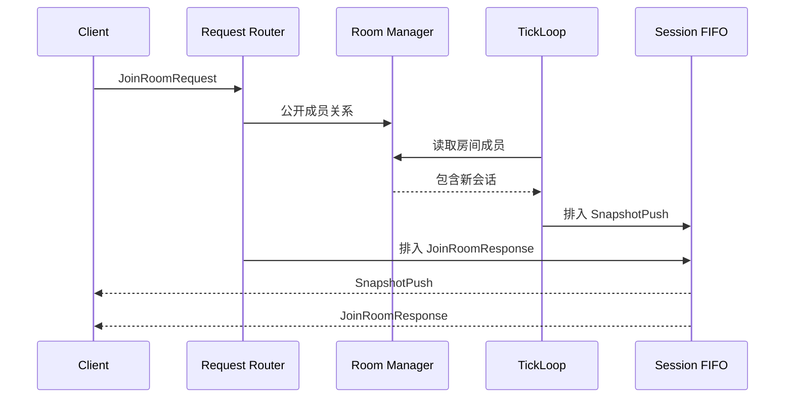
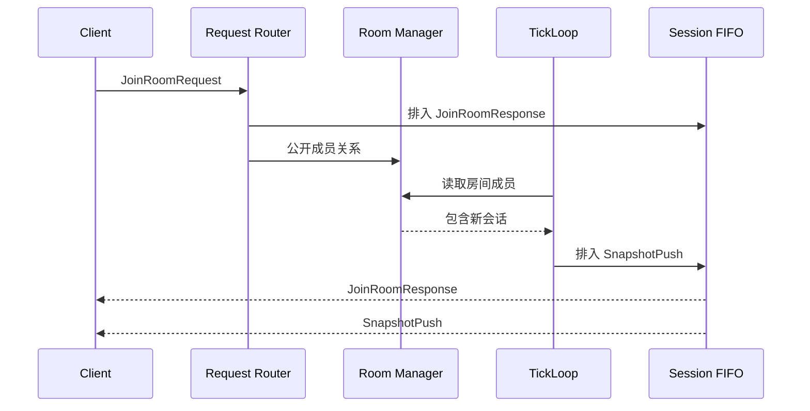

# 房间加入协议中的响应顺序与快照可见性边界

> 系列：Sakura Framework 工程实践
>
> 日期：2026-08-05
>
> 状态：可发布候选
>
> 核心问题：多人服务器处理加入房间请求时，为什么先修改成员关系、再发送成功响应，会让客户端在协议上看到颠倒的消息顺序？

[系列目录](../blog.html)

客户端发送 `JoinRoomRequest` 后，通常期待看到这样的顺序：

```text
JoinRoomRequest
→ JoinRoomResponse
→ 后续 SnapshotPush
```

这个顺序看起来理所当然。

服务器已经收到请求，完成校验，把玩家加入房间，然后回复成功。加入成功以后，TickLoop 再向房间成员推送快照。

但在并发服务器中，“代码按这个顺序写”不等于“消息按这个顺序进入客户端队列”。

如果处理线程先公开房间成员关系，TickLoop 就可能立即发现这个新成员，并向同一会话排入 `SnapshotPush`。而请求处理线程仍在准备或等待 `JoinRoomResponse`。

最终，同一名客户端可能先看到房间快照，后看到加入成功响应。

客户端明明还没有收到“你已经进房”的确认，却已经开始接收房间状态。

## 先说结论：先排入响应，再公开订阅资格

**会话可见性提交点（后文简称“正式进房点”）**：会话从“请求正在处理”切换为“可以被房间广播和 TickLoop 观察”的唯一时刻。

修复这类问题的关键，不是让响应发送得更快。

而是重新定义正式进房点：

```text
完成认证与请求校验
→ 将 JoinRoomResponse 排入该会话 FIFO
→ 再公开房间成员关系
→ TickLoop 才能把后续 SnapshotPush 排入同一 FIFO
```

这里保证的是**入队顺序**。

它不要求响应已经穿过网络到达客户端，只要求响应先于快照进入同一会话的有序发送队列。

只要发送器遵守 FIFO，客户端观察到的协议顺序就稳定下来。

## 旧顺序的问题，不在 JoinRoom 本身

旧流程可以画成：



每个局部动作都可能是正确的：

- Room Manager 正确保存了成员；

- TickLoop 正确向成员生成快照；

- Router 正确创建了成功响应；

- Session FIFO 正确保持入队顺序。


错误来自它们之间的可见性边界。

Router 在“响应尚未排队”时，就把会话公开给另一个异步生产者。

这是一种典型的并发协议问题：

> 状态变更不仅改变数据，也会改变其他线程从什么时候开始拥有发送资格。

## 新顺序把成功响应变成协议屏障

修复后的流程是：



**协议屏障（后文简称“先确认再开流”）**：在会话进入持续推送流之前，先把建立该流所需的确认消息放入同一有序队列。

成功响应在这里承担了两个职责：

1. 告诉客户端，请求已被服务器接受。

2. 划定从请求—响应阶段进入持续快照阶段的顺序边界。


这和数据库事务中的提交点很相似。

房间成员关系不是普通字段。它会让 TickLoop、广播器、房间事件和其他异步生产者开始对该会话工作。

因此，“把玩家放进集合”实际上也是在发布一项并发权限。

## 为什么不能只在客户端忽略早到快照

一种表面修复是让客户端这样做：

```text
如果还没有收到 JoinRoomResponse：
    暂存或丢弃 SnapshotPush
```

这种方案可以作为防御，但不应替代服务器顺序保证。

原因包括：

- 每个客户端都要复制同一套协议补丁；

- 快照可能包含初始化所需的第一份状态，丢弃后无法恢复；

- 暂存需要容量、超时和重放策略；

- 其他消息类型仍可能发生类似抢跑；

- 服务端日志会继续呈现“业务已生效但响应未确认”的分裂状态。


客户端可以拒绝非法顺序，但服务器仍应尽量不产生非法顺序。

更合理的责任划分是：

|层级|责任|
|---|---|
|服务器 Router|定义请求响应与状态公开的顺序|
|Session FIFO|保持同一会话消息的入队顺序|
|TickLoop|只向已经公开的成员生成快照|
|客户端|对异常顺序做保护和诊断，而不是承担主修复|

## 线性化点必须能被测试观察

**线性化点（后文简称“这一刻算完成”）**：一个并发操作可以被视为瞬间生效的单一位置，所有参与者对操作前后顺序得到一致解释。

加入房间操作的线性化点不应模糊地写成：

> `HandleJoinRoomAsync` 返回时。

因为在函数执行期间，其他线程已经可能观察到中间状态。

更强的测试应该直接观察关键时刻：

1. 捕获 `JoinRoomResponse` 被发送器接收的瞬间；

2. 在该回调中查询 Room Manager；

3. 断言玩家此时还没有公开房间关系；

4. 请求处理完成后，再断言玩家已经属于目标房间。


这类测试验证的不是最终结果。

最终结果“玩家在房间里”即使旧实现也能通过。

它验证的是：

> 成功响应入队时，快照生产资格仍未公开。

这正是竞态修复真正需要保护的合同。

## 这种顺序依赖一个重要前提

把成功响应放在成员提交之前，并不适用于所有实现。

它要求：

- 房间存在性、权限、容量等可失败校验已经完成；

- 响应入队成功后，成员提交不会再产生普通业务失败；

- 或者成员提交本身是可证明不会失败的内存操作。


如果未来 `JoinRoom` 需要：

- 分布式租约；

- 数据库写入；

- 跨服确认；

- 房间容量竞争；

- 付费或资格扣除；


那么“先回复成功，再提交成员”就可能引入相反问题：客户端收到成功，但后续提交失败。

这时需要更完整的状态机。

```text
Validated
→ ResponseQueued
→ MembershipCommitted
→ SnapshotEligible
```

或者引入：

- `Joining` 中间状态；

- 原子房间事务；

- 单线程房间 Actor；

- 服务器生成的 Join revision；

- 可重试且幂等的提交协议。


当前修复成立，是因为它把“响应入队”和“公开快照资格”之间的本地顺序明确了，而不是声称所有加入房间流程都只需要交换两行代码。

## 这个问题可以迁移到更多系统

同类竞态经常出现在：

- 订阅频道后立即开始推送事件；

- 登录成功后开始同步玩家状态；

- 进入副本后开始广播战斗帧；

- 观察者注册后开始发送增量更新；

- 匹配成功后开始下发对局数据；

- 热更新激活后开始向新 Runtime 路由请求。


它们共同拥有一个结构：

```text
一次请求
→ 一条确认消息
→ 一项新的持续可见性或推送资格
```

只要“推送资格”先于“确认消息入队”公开，就可能发生抢跑。

## 设计检查表

实现类似协议时，可以检查：

- 哪个状态变更会让异步生产者开始向会话发送消息；

- 请求响应和后续推送是否进入同一有序队列；

- 成功响应是“创建完成”“开始发送”还是“已排入 FIFO”；

- 状态公开前，所有可能失败的业务校验是否已经结束；

- 响应入队失败时，成员关系是否保持未提交；

- TickLoop 是否只读取正式公开的成员；

- 测试是否观察了线性化点，而不只是最终状态；

- 客户端是否会记录异常顺序，帮助发现未来回归；

- 多房间、重连、重复请求和断线清理是否遵守同一边界。


## 术语对照

|正式术语|通俗称呼|含义|
|---|---|---|
|会话可见性提交点|正式进房点|会话开始对房间广播与 TickLoop 可见的时刻|
|协议屏障|先确认再开流|确认消息先进入同一 FIFO，持续推送随后开放|
|线性化点|这一刻算完成|并发操作被视为原子生效的唯一位置|
|入队顺序|谁先排队|同一会话发送队列中的确定消息顺序|

> 资料说明：本文依据 2026-08-04 的服务器路由修复与回归测试整理。文章讨论的是同一会话 FIFO 中的消息入队顺序，不等同于跨网络的物理到达时间保证。