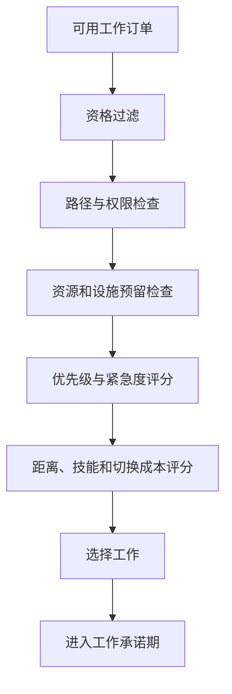
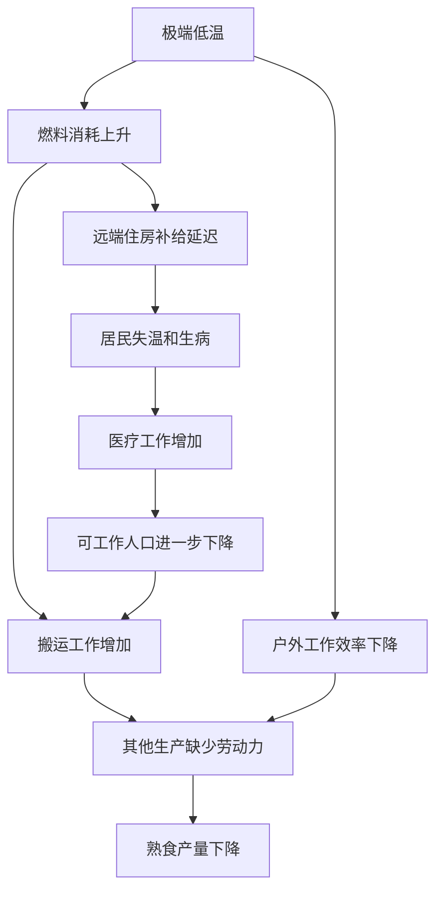

# 可调度劳动能力：自主居民调度与聚落生产链

> 系列：游戏系统的共同语言
>
> 日期：2026-08-05
>
> 状态：可发布
>
> 核心问题：殖民地模拟中明明拥有居民、原料和生产设施，为什么关键工作仍然可能无人执行，甚至引发整座聚落的连锁崩溃？

[系列目录](../blog.html)

殖民地的仓库里还有大量谷物。

厨房没有损坏，也没有停电。聚落里有会烹饪的居民，附近甚至还存放着足够的燃料。

但熟食库存仍然归零了。

居民开始饥饿，工作效率下降；厨师因为自身饥饿离开岗位寻找食物；搬运者忙于处理另一项高优先级任务；病人得不到餐食，医生也被迫中断制药。

玩家看到的结果是：

> 聚落明明有粮，为什么所有人还是快饿死了？

这类问题不能只用“食物产量不足”解释。

在殖民地模拟中，资源存在并不等于资源能够在需要的时候被转化、运输和消费。

真正稀缺的往往不是人口总数，也不是仓库里的原料，而是把正确居民、正确工作和正确资源及时组合起来的能力。

## 先说结论：居民数量不是劳动力，能够完成关键工作才是

**可调度劳动能力（即“真正派得上用场的人手”）**：在给定时间和空间条件下，可以由具备合法权限、技能、健康状态和资源条件的居民完成关键工作的有效劳动能力。

假设聚落拥有二十名居民。

这并不意味着当前拥有二十份可用劳动力。

其中可能有人：

- 正在睡觉；
- 因伤无法移动；
- 没有对应技能；
- 被禁止从事某项职业；
- 无法进入目标区域；
- 距离工作地点过远；
- 正在执行已经承诺的高优先级任务；
- 因饥饿或精神状态中断工作；
- 缺少工具；
- 无法预留所需资源。

因此，人口统计只能回答：

> 聚落里一共有多少居民？

可调度劳动能力回答的是：

> 此时此地究竟有谁能够把这件事做完？

这也是殖民地模拟与普通城市建设最大的差异之一。

城市建设可以把大量人口聚合成统计数字；殖民地模拟通常必须解释具体是谁、为什么没有工作，以及哪个条件阻止了他完成任务。

## 玩家表达意图，系统负责把意图变成行为

玩家通常不会逐步命令居民：

1. 走到仓库；
2. 拿起五份谷物；
3. 前往厨房；
4. 把谷物放到输入区；
5. 找到燃料；
6. 启动炉灶；
7. 烹饪餐食；
8. 把成品搬到食堂。

玩家表达的通常是更高层意图：

- 熟食库存低于二十份时自动烹饪；
- 医疗工作优先于普通生产；
- 冬季提高燃料储备；
- 禁止普通居民进入污染区；
- 指定某名高技能居民主要负责研究；
- 暂停装饰建设，将劳动力投入应急物资。

**间接指挥（即“发布目标而不是遥控动作”）**：玩家通过区域、订单、库存阈值、优先级和制度表达目标，由运行时负责拆分和分配具体行为。

这一交互方式决定了殖民地模拟的核心不是操作居民，而是组织系统。


其中任何一步失败，最终表现都可能是“居民没有食物”。

但不同失败需要完全不同的解决方式。

## 工作订单是意图与行为之间的合同

**工作订单（即“系统里真正等待完成的事”）**：由玩家命令、库存目标、居民需求、建筑蓝图或环境故障生成，包含目标、资源、权限、优先级和执行状态的可调度任务。

工作订单可能来自：

- 建造蓝图；
- 生产配方；
- 库存上下限；
- 医疗需求；
- 火灾；
- 清洁和维修；
- 居民饥饿；
- 农作物收获；
- 动物照料；
- 防御警报；
- 玩家划定的采集区域。

一个工作订单不应该只是“类型加坐标”。

它至少需要回答：

| 信息 | 回答的问题 |
|---|---|
| 工作类型 | 要做什么 |
| 目标 | 对谁或在哪里执行 |
| 所需资源 | 需要哪些物品、工具和设施 |
| 合法条件 | 谁有资格执行 |
| 优先级 | 与其他工作相比有多重要 |
| 紧急度 | 是否允许中断当前行为 |
| 预留状态 | 资源是否已经被其他工作占用 |
| 执行状态 | 当前进行到哪一步 |
| 创建时间 | 已经等待了多久 |
| 失败原因 | 为什么暂时无法继续 |

合理的订单状态可以包括：

```text
Proposed
→ Available
→ Reserved
→ Assigned
→ InProgress
→ Completed
```

异常路径则可能进入：

```text
Suspended
Blocked
Cancelled
Failed
```

只有状态明确，系统才能区分：

- 尚未找到执行者；
- 找到了执行者但资源不足；
- 资源已预留但路径失效；
- 工作已开始但被紧急需求中断；
- 工作已经完成，只是产物尚未送达。

## 调度不是找“最优居民”，而是分层排除和评分

居民选择工作时，不应该直接在全地图中寻找理论收益最高的任务。

合理调度通常分为两个阶段。

### 第一阶段：合法性过滤

先排除根本无法执行的候选：

- 居民是否允许该工作；
- 身体状态是否支持；
- 技能是否达到要求；
- 工具是否存在；
- 目标是否可达；
- 区域权限是否允许；
- 资源是否能够预留；
- 工作台是否可用；
- 当前紧急需求是否允许继续工作。

### 第二阶段：候选评分

对合法工作进行比较：

- 玩家设置的优先级；
- 聚落当前紧急度；
- 居民技能；
- 工作偏好；
- 距离；
- 已经等待的时间；
- 当前携带的物品；
- 是否可以顺路完成；
- 聚落当前全局缺口；
- 切换任务需要付出的成本。



这种结构能够避免两类极端。

第一类是居民无视距离和权限，瞬间选择全局最优任务，使空间布局失去意义。

第二类是居民只看一个优先级整数，导致低效居民跨越整张地图执行并不适合自己的工作。

## 工作承诺用于避免“所有人都在路上，什么都没完成”

居民状态会不断变化：

- 饥饿值上升；
- 新任务出现；
- 距离变化；
- 工作优先级调整；
- 其他居民完成部分工作；
- 路径暂时受阻。

如果居民每次发现一个评分更高的任务就立刻切换，聚落会出现严重抖动：

```text
前往砍树
→ 发现搬运评分更高
→ 转身搬运
→ 饥饿值上升
→ 转身吃饭
→ 医疗任务出现
→ 再次转身
```

最终，大量时间消耗在移动和切换上，没有任何工作到达完成点。

**工作承诺（即“接了活就先做一段”）**：居民选定工作后，在没有高等级中断的情况下，保持最低执行时间或完成既定阶段的稳定机制。

工作承诺可以考虑：

- 最短执行时间；
- 已完成路径比例；
- 已搬运资源；
- 当前工作阶段；
- 预留成本；
- 紧急中断等级；
- 相同工作批处理。

它并不意味着居民不能处理中断。

火灾、重伤和紧急饥饿仍可打断普通工作。

但系统需要区分：

> 有新任务出现。

和：

> 当前工作必须立刻停止。

## 预留系统防止多名居民争抢同一份资源

假设两名厨师同时发现最后一堆谷物。

如果系统只在居民真正拾取物品时修改库存，两人都可能认为原料可用，并同时前往仓库。

到达之后，其中一人才能发现目标已经消失。

更严重的情况还包括：

- 两名医生同时前往治疗同一患者；
- 多个生产任务同时承诺使用同一批材料；
- 多名居民同时占用一个工作台；
- 两个建筑蓝图争抢最后一批建材；
- 多人前往同一个狭窄位置并互相阻塞。

**资源预留（即“先声明这份东西归哪个工作”）**：工作开始前，对物品、工作台、床位、位置和输出容量建立临时独占或配额关系。

预留系统需要覆盖：

- 物品数量；
- 工作台；
- 病床；
- 建筑位置；
- 工具；
- 患者；
- 运输目的地；
- 输出仓位；
- 狭窄通道。

同时，预留必须能够可靠释放。

触发释放的情况包括：

- 工作完成；
- 工作取消；
- 居民死亡或昏迷；
- 路径不可达；
- 目标销毁；
- 玩家修改订单；
- 工作超时；
- 紧急事件中断。

如果释放逻辑不完整，聚落可能出现另一种隐形故障：

> 资源明明存在，却永远显示正在被占用。

因此，预留泄漏需要成为可检测错误，而不是让玩家自行猜测。

## 有粮不等于有饭：生产是一条条件链

假设仓库中有一百份谷物，但居民没有可吃的餐食。

完整链路至少需要成立：

```text
原料存在
→ 原料位于合法位置
→ 居民可以访问
→ 原料未被其他工作预留
→ 厨房拥有燃料或电力
→ 厨房没有损坏
→ 存在合法配方
→ 有居民能够烹饪
→ 居民当前可以工作
→ 输出区域还有空间
→ 成品被及时搬运
→ 消费者可以到达成品
```

**生产可达链（即“资源真正走到消费者手里的路”）**：资源从存在、可访问、可加工、可运输到最终可消费所需的完整条件集合。

生产停滞可能来自完全不同的层次：

| 表面问题 | 可能根因 |
|---|---|
| 厨房没有生产 | 厨师、燃料、原料、权限或输出空间不足 |
| 居民没有吃饭 | 餐食不可访问、被预留或不符合配给 |
| 建筑迟迟不完成 | 材料未搬运、施工者不足或位置不可达 |
| 医疗没有执行 | 病床、药品、医生技能或患者运输失败 |
| 工作台反复停机 | 成品无人清运，输出格已满 |
| 仓库显示资源充足 | 资源距离过远或位于禁止区域 |

如果界面只显示最终结果，玩家只能逐项打开面板排查。

这不是策略深度，而是信息缺失。

## 空间布局不是装饰，而是调度系统的输入

两个拥有相同建筑和居民数量的聚落，可能产生完全不同的效率。

空间会影响：

- 通勤时间；
- 搬运距离；
- 工作切换成本；
- 医疗响应；
- 食物获取；
- 火灾传播；
- 温度；
- 门口拥堵；
- 防御路径；
- 居民社交频率。

例如，将厨房放在农田旁边不一定高效。

原料距离变短了，但如果：

- 食堂和居民宿舍很远；
- 成品仓库位于另一侧；
- 燃料需要从远端运输；
- 狭窄门口限制搬运；

最终总物流成本仍可能更高。

因此，殖民地模拟中的地图不是建筑摆放画布。

它是一张持续运行的物流和行为网络。

有意义的空间反馈应包括：

- 通勤热图；
- 搬运距离；
- 工作台利用率；
- 仓库服务范围；
- 食堂覆盖；
- 医疗响应时间；
- 门口和通道拥堵；
- 燃料及电力网络。

## 居民的需求既创造生命感，也会打断生产

自主居民不是不会疲劳的机器。

他们可能因为：

- 饥饿；
- 睡眠；
- 疼痛；
- 温度；
- 娱乐；
- 安全；
- 社交；
- 精神压力；

离开当前工作。

这种中断让居民成为需要维护的个体，而不是纯粹生产速率。

但需求系统同样需要稳定规则。

如果饥饿值每变化一点，居民就重新规划行为，工作系统会持续抖动。

常见稳定手段包括：

- 阈值迟滞；
- 最短行为持续时间；
- 紧急等级；
- 工作承诺；
- 路径成本；
- 当前任务阶段。

例如，居民在饥饿度达到普通阈值后，可以完成手头短工作再去进食；达到紧急阈值时，则允许立即中断。

这样，需求既能影响居民，又不会让聚落陷入行为混乱。

## 危机不是随机扣资源，而是利用已有弱点

殖民地危机最有价值的地方，不是一次性制造高额损失。

它应该让聚落现有结构接受压力测试。

寒潮可以沿以下链路传播：



寒潮本身没有直接删除食物。

它通过燃料、搬运、生产、健康和劳动力网络放大聚落原有缺陷。

这使玩家可以从失败中得到明确判断：

- 燃料安全库存不足；
- 住房过于分散；
- 只有一名厨师；
- 仓库位置不合理；
- 医疗系统没有替补；
- 紧急工作优先级设计错误。

高质量危机应该允许玩家使用已经存在的管理工具恢复：

- 调整优先级；
- 临时改变配给；
- 启用备用岗位；
- 关闭非必要设施；
- 修改区域权限；
- 启用紧急仓库；
- 暂停低价值建设。

危机的意义不是宣告玩家失败，而是迫使聚落暴露真实结构。

## 警报必须解释根因，而不是重复结果

低质量警报是：

> 居民正在挨饿。

玩家已经可以从画面上看到这一点。

更有价值的警报应该告诉玩家：

```text
可食用餐食不足
└─ 厨房停止生产
   ├─ 烹饪优先级低于燃料搬运
   ├─ 当前厨师正在满足紧急饥饿需求
   └─ 备用厨师未启用烹饪工作
```

**因果诊断（即“系统告诉玩家为什么”）**：从最终异常反向追踪工作、资源、路径、权限、预留和居民状态，给出可采取行动的原因链。

长期未执行的工作至少应显示：

- 没有合法居民；
- 技能不足；
- 目标不可达；
- 原料不足；
- 原料已被预留；
- 工作台无电；
- 输出空间已满；
- 优先级过低；
- 居民正在处理紧急需求。

如果玩家不能知道任务为什么失败，间接管理就会退化为盲目调整数字。

## 后期成长应该升级管理层级

早期聚落人口较少时，玩家可以逐项调整：

- 谁负责烹饪；
- 哪块区域存放木材；
- 哪个工作优先；
- 哪间屋子允许进入。

但人口和生产链扩大后，继续要求同样粒度的操作，只会增加微操。

后期系统应逐步提供：

- 新居民工作模板；
- 生产模板；
- 仓储模板；
- 班次；
- 库存目标；
- 区域权限模板；
- 配给制度；
- 自动补货；
- 应急方案；
- 管理岗位。

成长过程应表现为：

```text
逐项指定工作
→ 设置居民职业
→ 设置聚落优先级
→ 设置库存和生产规则
→ 使用模板和制度管理
```

玩家仍然需要作出决策，但决策对象从单个动作升级为组织结构。

这与农场经营中的自动化类似，却存在一个关键区别：

农场工具主要压缩玩家本人的重复劳动。

殖民地制度则改变多个自主居民如何选择和协作。

## 与相近类型的边界

| 类型 | 玩家主要控制方式 | 劳动力特征 | 核心问题 |
|---|---|---|---|
| 殖民地模拟 | 订单、区域、制度和优先级 | 独立需求、技能、路径和情绪 | 如何将人口转化为有效组织 |
| 即时战略 | 直接选择和命令单位 | 多以战斗与采集能力为主 | 如何即时控制战场和资源 |
| 城市建设 | 分区、道路和宏观政策 | 常被聚合为人口统计 | 如何维持城市服务和财政 |
| 工厂自动化 | 建造机器和物流线路 | 行为通常确定且无需求 | 如何优化吞吐和比例 |
| 农场生活模拟 | 玩家直接执行日常劳动 | 玩家本人是主要劳动者 | 如何分配个人时间与体力 |

这些类型可以组合。

但殖民地模拟的关键不只是存在自动单位，而是居民的需求、路径、技能和社会状态会持续改变生产结果。

## 常见设计失败

### 居民直接读取全局最优任务

居民无视距离、知识和权限，使空间设计失去意义。

### 玩家必须手动指定每项劳动

间接管理退化为高频单位微操。

### 优先级只有一个整数

无法表达聚落紧急度、居民专长、距离和任务承诺。

### 没有统一预留系统

多个工作争抢同一物品、工作台、床位或患者。

### 资源没有唯一位置

物品在居民背包、地面和仓库中重复存在或突然丢失。

### 居民频繁切换任务

大量时间花在移动和重新规划上，没有工作完成。

### 生产停滞不可解释

玩家只能逐个检查设施、居民和仓库猜测根因。

### 搬运被视为免费

建筑间距离不影响产能，仓库布局失去价值。

### 人口增长只有收益

接纳居民成为无条件正确选择，组织复杂度没有增加。

### 危机只是随机扣除资源

危机没有通过已有物流、健康和劳动力网络传播。

### 后期只增加人口和建筑

没有模板、制度和管理层级升级。

### 故障没有恢复路径

关键居民或设施失效后，聚落永久进入死锁。

## 我的设计检查表：聚落为什么没有把事情做完

设计自主居民和工作系统时，我会检查：

1. 玩家表达的是高层意图，还是仍需遥控每个动作？
2. 所有生产、搬运、医疗和建造是否进入统一工作订单？
3. 工作订单是否保留明确状态和失败原因？
4. 工作候选是否先过滤合法性，再进行评分？
5. 调度是否同时考虑技能、距离、权限和紧急度？
6. 居民是否拥有合理的工作承诺，避免频繁切换？
7. 所有独占物品、设施和位置是否经过统一预留？
8. 订单取消和居民中断后，预留是否能够可靠释放？
9. 每件物品是否只有一个权威位置？
10. 工作中断时，居民携带的资源是否仍可解释？
11. 生产提交点是否防止重复消耗或重复生成产物？
12. 搬运距离和通道拥堵是否真实影响生产？
13. 居民需求是否能够中断工作，却不会持续造成行为抖动？
14. 系统能否解释一项工作为什么没有执行？
15. 警报能否从结果追踪到可操作的根因？
16. 危机是否利用已有弱点产生连锁影响？
17. 聚落是否拥有替补人员、安全库存和备用路线？
18. 人口增长是否同时增加组织复杂度？
19. 后期是否提供模板、制度和应急方案？
20. 聚落失败后，玩家能否还原第一个关键故障及其传播链？

殖民地模拟的核心成长，并不是让居民数量不断增加。

它是让玩家逐渐理解：

- 资源为什么没有流动；
- 工作为什么没有完成；
- 哪些居民真正可以承担关键岗位；
- 空间、制度和优先级如何影响自主行为；
- 如何让聚落在某个局部节点失效后仍能继续运行。

仓库里有粮，只能说明聚落曾经完成了生产。

居民最终吃到饭，才说明整个组织真正运转了起来。

## 术语对照

| 正式术语 | 文中通俗称呼 |
|---|---|
| 可调度劳动能力 | 真正派得上用场的人手 |
| 间接指挥 | 发布目标而不是遥控动作 |
| 工作订单 | 系统里真正等待完成的事 |
| 工作承诺 | 接了活就先做一段 |
| 资源预留 | 先声明这份东西归哪个工作 |
| 生产可达链 | 资源真正走到消费者手里的路 |
| 因果诊断 | 系统告诉玩家为什么 |

---

## 内部资料依据

本文主要基于以下材料整理：

- `game-designs/殖民地模拟游戏设计范式.md`
- `blogs/README.md`
- `blogs/publication.v1.json`

本文是对殖民地模拟与聚落生存经营设计范式的个人综述。文中的工作订单、调度评分、资源预留、危机传播和管理层级属于可选设计方法，不表示所有殖民地模拟作品都必须采用完全相同的居民粒度、需求模型、任务状态机或失败强度。
