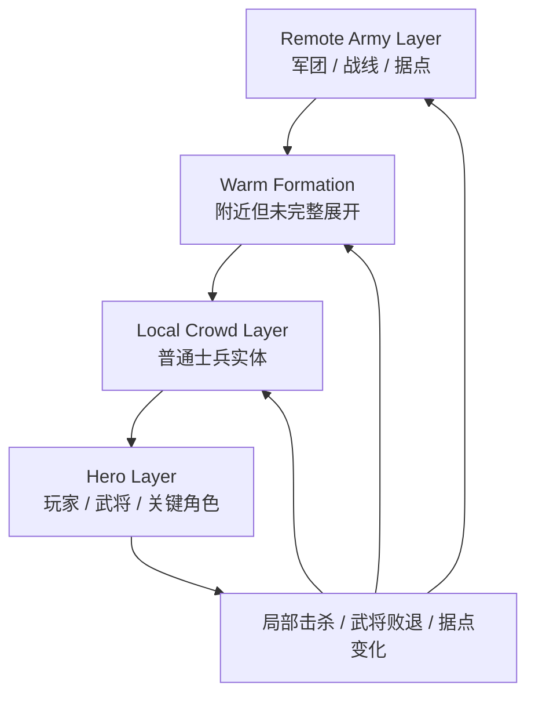
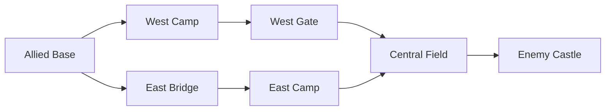

# 局部战力尖峰与双尺度战场：无双式动作的军团聚合、武将锚点与战线转换

> 系列：游戏系统的共同语言
>
> 日期：2026-09-08
>
> 状态：草稿
>
> 核心问题：一个以玩家单人高强度战斗为核心的动作游戏，怎样同时表现数百名士兵持续作战的大规模战场，又避免把每一个远处士兵都做成完整 AI？
>
> 关键词：Musou、Battlefield、Simulation LOD、Army Formation、Materialization

[系列目录](../blog.html)

玩家正在战场东侧与一名敌方武将交战。

画面里几十名士兵被击飞。

与此同时，地图另一侧还有：

- 友军正在进攻西门；

- 一支敌军正在逼近本阵；

- 两名友方武将正在交战；

- 一个据点持续产生增援。


玩家不可能同时看见这些事情。

但这些事情又不能因为：

```text
Camera 看不到
```

就全部暂停。

否则就会出现一种非常假的战争：

> 世界只有玩家附近几百米是真实的，玩家一转身，整个战争便停止存在。

反过来，如果让战场上五百名、上千名普通士兵都拥有完整：

```text
Behavior Tree
NavMesh Path
感知
复杂战斗决策
动画状态
Buff
碰撞
```

CPU、内存和调试成本很快就会失控。

无双式军团动作真正需要解决的，不是“怎样同时显示很多人”。

而是：

> **怎样让一个玩家直接操作的高精度局部战斗，持续改变一个远比玩家视野更大的低精度战争。**

## 先说结论：玩家应该是一枚在军团模拟上移动的局部战力尖峰

**局部战力尖峰（后文简称“玩家走到哪里，哪里就突然进入高强度真实战斗”）**：玩家英雄拥有远高于普通士兵的局部改变能力，并把自己的行动结果写回军团、据点和战线状态。

一个典型战场可以拆成三层：



### Hero Layer

高精度模拟：

- 玩家；

- 敌我武将；

- Boss；

- Mission Critical Actor。


### Local Crowd Layer

玩家附近真正生成的普通士兵：

- 有位置；

- 会移动；

- 会攻击；

- 会受击；

- 会被击飞。


但 AI 成本明显低于武将。

### Remote Army Layer

远离玩家的战争：

- Formation Strength；

- Morale；

- Officer State；

- Zone；

- Casualty；

- Front Pressure。


不逐兵模拟。

这三层共同回答：

```text
近处怎样打得爽
+
远处怎样继续像一场战争。
```

## 普通士兵和武将不是同一种敌人的两个数值档

无双类最容易犯的错误之一，是建立一个：

```text
Enemy
```

然后：

```text
普通兵
HP = 100

武将
HP = 5000
技能更多一点。
```

这忽略了两者完全不同的系统职责。

### 普通士兵是密度单位

普通兵主要负责：

- 战场规模；

- 阵线存在感；

- 包围；

- 连击资源；

- 必杀资源；

- 路线阻力；

- 力量反馈。


玩家打飞十名士兵时获得的是：

```text
“一骑当千”的体验。
```

普通兵并不需要每一个都成为值得单独研究十秒的决斗对象。

### 武将是决策单位

武将负责：

- 局部战略锚点；

- 高价值战斗；

- 据点控制；

- 军团士气；

- 关键事件；

- 路线开闭；

- Mission 后果。


所以可以概括成：

> **士兵负责让战争看起来足够大，武将负责让战争值得玩家选择去哪里。**

## 战场首先应该是一张战略图，其次才是一张 NavMesh

一个无双战场通常拥有：

```text
本阵
西门
东桥
中央战场
据点
城门
侧路
敌军本阵。
```

这些位置之间存在：

```text
Battlefield Graph。
```

例如：



远端 Formation 不需要每秒为一百个士兵计算：

```text
A*
```

它只需要知道：

```text
Current Zone
Target Zone
Route
Order。
```

因此需要区分：

**战略导航（即“这支军团应该去哪片战区”）**

和：

**局部导航（即“真正生成出来的士兵怎样在当前区域移动”）**。

这两种导航解决的是不同规模的问题。

## Army Formation 必须成为正式运行时对象

如果系统里只有：

```text
SoldierEntity[]
```

而没有真正的 Formation，

远端战争就很难存在。

**Army Formation（后文简称“一支军团在远处仍然存在的最小战争身份”）**至少需要表达：

```text
FormationId
Team
Commander
Composition
AggregateStrength
Morale
CurrentZone
TargetZone
Order
Casualties。
```

这带来一个非常重要的不变量：

> **实体被卸载不等于士兵死亡，士兵死亡也不能因为实体被卸载而被忘记。**

假设一个 Formation 原本代表：

```text
120 人。
```

玩家接近以后生成其中：

```text
60 个 Local Entity。
```

玩家击杀 18 人。

随后离开。

系统不能：

```text
Despawn 剩余 42
↓
Formation 又恢复成原来的 120。
```

正确结果应该重新聚合成：

```text
Formation
已经真实损失 18 名士兵。
```

## Materialization 是双尺度模拟真正的桥

**Materialization（后文简称“远处军团靠近玩家以后，展开成真正可以打的角色”）**：根据 Formation 当前聚合事实，生成局部实体表示。

它不是：

```text
进入区域
→
随机 Spawn 一堆差不多的兵。
```

Materialization 需要参考：

- 当前兵力；

- 士气；

- 兵种组成；

- 武将状态；

- 既有实体；

- 当前人口预算。


反过来的：

**Dematerialization（即“玩家离开以后，把仍然活着的局部实体重新压回军团状态”）**

也不能等于 Destroy。

它是：

```text
Local Representation
→
Aggregate Representation。
```

这两次转换前后的关键战争事实必须连续。

## 武将身份通常不应该被随便聚合掉

普通士兵在远处可以只剩：

```text
GruntCount = 83。
```

但一名有名字的武将：

```text
General Zhao
```

如果：

- 参与 Mission；

- 控制据点；

- 有独立血量；

- 有败退状态；

- 可能被玩家追击；


就不能在远端被平均成：

```text
OfficerPower = 120。
```

然后玩家回来时随机再造一名替代品。

所以 Simulation LOD 并不只是：

```text
距离越远
信息越少。
```

还需要考虑：

```text
Identity Importance。
```

远处的重要武将可以：

```text
低频更新
```

但仍保留稳定身份。

## Simulation Tier 不能只按距离判断

一个简单系统可能写：

```text
distance < 50m
→ Tier 1

distance > 200m
→ Tier 3。
```

这不够。

假设地图另一端的友军主将正在进行：

```text
Mission Critical Duel。
```

即使离玩家很远，

也不能把它当作普通匿名军团随机结算。

更稳健的 Tier 评估可以同时考虑：

- Player Distance；

- Camera；

- Mission Importance；

- Officer；

- Objective；

- Combat Activity；

- Cutscene / Replay。


**模拟重要度（即“现在这件事对玩法结果有多重要”）**

应该和空间距离共同决定精度。

## 远端战争不能成为隐藏随机秒杀

玩家打开地图：

```text
西线
友军明显占优。
```

五秒以后突然：

```text
友军全灭。
```

而系统无法解释：

```text
为什么。
```

这种远端模拟虽然很省性能，却会破坏玩家对战场的判断。

更好的 Remote Resolution 应该围绕：

```text
Strength
Morale
Officer
Terrain
Supply
Reinforcement
```

按战略 Tick 计算：

- Pressure；

- Casualty；

- Retreat Risk。


远端战争最重要的并不是：

```text
和近场每一刀完全一致。
```

而是：

> **玩家根据当前战况作出的战略判断，在合理时间尺度上具有可预期性。**

## 玩家介入应该改变战争轨迹，而不是只增加击破数

如果玩家杀了：

```text
500 个普通兵，
```

但：

- 前线没变化；

- 据点没变化；

- 友军没有推进；

- 武将没有反应；


那么大规模战场实际上只是：

```text
巨大的背景刷怪场。
```

局部动作应该可以转换成宏观结果。

例如：

```text
击败 Officer
↓
敌军 Morale 下降
↓
Formation Pressure 减弱
↓
友军推进

攻占 Base
↓
敌军 Reinforcement 关闭
↓
我方 Formation 获得补给
↓
Central Gate 暴露。
```

这就是：

**局部—宏观转换（即“玩家亲手打赢的一场局部战斗，会继续改变整张地图”）**。

## 动态事件的价值在于重新分配玩家注意力

当玩家准备直冲主线时：

```text
友军武将陷入危机。
```

或者：

```text
敌军侧翼伏兵出现。
```

玩家需要重新回答：

```text
我现在最值得去哪？
```

这让无双类不只是：

```text
沿路线不断打。
```

而是不断进行：

```text
Travel Cost
vs
Strategic Value
```

的快速选择。

所以 Battle Director 的重要职责之一，不是疯狂生成事件。

而是：

> **制造多个不能同时完美解决的战场需求。**

## 与横版清版动作的边界

两类都存在：

```text
一个玩家打很多人。
```

但清版动作主要解决：

```text
当前一个 Arena 中
六个敌人怎样围攻得可读。
```

无双类主要解决：

```text
一个完整战场中
几十个局部战斗怎样和远端战争同时存在。
```

前者的关键是：

```text
Attack Concurrency。
```

后者的关键是：

```text
Simulation Scale。
```

## 与幸存者类的边界

幸存者类大量敌人通常是：

```text
持续压力场。
```

无双的普通兵虽然也是密度单位，

但战场上还存在：

- Officer；

- Base；

- Route；

- Formation；

- Frontline。


玩家不仅要：

```text
活下来和清怪，
```

还要：

```text
改变战争结构。
```

## 与 RTS 的边界

RTS 的主要控制语言是：

```text
对军团下命令。
```

无双类则是：

```text
玩家亲自成为战场上的一个单位。
```

玩家不是：

```text
拖框选择一支军队。
```

而是：

> 用自己的高战斗密度去改变一支军队原本无法解决的局部问题。

## 常见失败

### 五百个士兵都用完整 AI

性能和调试成本失控。

### 远处一律 Pause

玩家视野决定世界时间。

### 远处一律随机算胜负

战场信息失去可信度。

### Materialize 时随机重建军团

之前造成的伤亡消失。

### 武将和普通兵只是 HP 不同

战略锚点和密度单位的职责混在一起。

### 战场只有 NavMesh，没有 Battlefield Graph

远端军团无法形成低成本战略移动。

### 玩家杀很多人却不改变宏观状态

“战争”退化成背景。

## 我的双尺度战场检查表

1. Hero、Local Crowd、Remote Army 是否分层？

2. Simulation Tier 是否不仅由距离决定？

3. 普通士兵与武将是否承担不同职责？

4. 是否存在稳定 ArmyFormationId？

5. Local Soldier 是否知道 ParentFormation？

6. 本地伤亡是否写回 Aggregate State？

7. Dematerialization 是否明确不等于死亡？

8. Materialization 是否依据真实聚合状态？

9. 重要武将是否保留稳定身份？

10. Battlefield 是否拥有 Zone Graph？

11. Strategic Navigation 与 Local Navigation 是否分离？

12. 远端战争是否具有可解释输入？

13. 远端结果是否具有可预期性？

14. 据点、武将、士气是否能够真正改变军团战力？

15. 玩家局部胜利是否能转换成宏观推进？

16. 动态事件是否制造真实的注意力取舍？

17. 玩家离开再返回时，世界历史是否连续？


无双式动作真正让人产生“一骑当千”感的，不只是：

```text
一个技能击飞五十个人。
```

而是：

> **玩家能够明确感到，自己刚才亲手解决的局部危机，正在让整条战线向前移动。**

普通士兵创造规模。

武将创造节点。

军团创造持续战争。

玩家则是：

```text
在这套大规模系统上
不断移动的一枚局部战力尖峰。
```

近处是动作游戏。

远处是战争模拟。

真正成熟的无双式战场，需要让两者始终属于同一场战争。

## 术语对照

|正式术语|通俗称呼|
|---|---|
|局部战力尖峰|玩家走到哪里，哪里就突然进入高强度真实战斗|
|Simulation LOD|根据重要度切换不同模拟成本|
|Army Formation|一支军团在远处仍然存在的战争身份|
|Materialization|把远端聚合军团展开成局部实体|
|Dematerialization|把局部实体重新压回军团状态|
|Battlefield Graph|战区之间的战略连接图|
|局部—宏观转换|玩家局部胜利继续改变整张地图|

## 内部资料依据

- `game-designs/无双式军团割草动作游戏设计范式.md`

- `game-designs/横版清版动作游戏设计范式.md`

- `blogs/README.md`

- `blogs/publication.v1.json`


本文是对 Musou / Warriors-like Battlefield Action 的个人设计综述。Simulation Tier、Formation、Materialization 等均为设计和工程抽象，不表示所有同类作品采用相同实现，也不表示具体建议已经在某个项目中完成运行验证。

---
