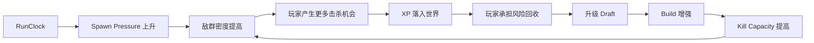

# 压力—火力追逐：幸存者类的时间难度轴与空间化成长

> 系列：游戏系统的共同语言
>
> 日期：2026-08-13
>
> 状态：可发布
>
> 核心问题：幸存者类如何在玩家输入始终非常简单的情况下，让一场单局从稀疏敌群持续演化成数百甚至上千单位参与的高密度战斗，并让成长、移动和构筑始终保持有效决策？

[系列目录](../blog.html)

幸存者类游戏的开局通常非常安静。

玩家只有一个基础攻击。

地图上可能只有几只行动缓慢的敌人。

操作也极其简单：

- 移动；
- 偶尔调整方向；
- 极少量主动技能。

几分钟之后，画面却可能完全不同。

敌人从四面八方涌入。

投射物、范围攻击、状态效果和召唤物覆盖大面积战场。

玩家每秒击杀几十甚至上百个单位。

经验、宝箱和特殊奖励不断出现。

角色的技能已经从一个基础攻击成长为一整套自动运行的战斗系统。

但玩家的主要输入仍然可能只是：

> 往哪里走。

这正是幸存者类最值得研究的地方。

它没有随着模拟规模增加同步增加输入复杂度。

相反，它把复杂度主动从：

```text
即时操作
```

转移到了：

```text
空间判断
+
构筑
+
自动执行系统
+
压力管理
```

## 先说结论：幸存者类的核心不是“很多敌人”，而是压力与火力持续互相追逐

**压力—火力追逐（即“敌人越来越多，玩家必须更快变强”）**：系统随着运行时间持续提高敌群输入压力，而玩家通过击杀、经验回收和构筑成长不断提高单位时间处理能力，两条曲线在整个单局中持续竞争。

可以把这套关系压缩成：



如果只有压力增长，没有玩家成长：

```text
敌群越来越多
→
玩家迟早必败
```

如果只有玩家成长，没有压力增长：

```text
玩家越来越强
→
后半局只剩挂机
```

这个品类真正需要维持的是：

> 玩家不断接近“已经足够强”，系统又不断把新的压力推到他面前。

## 时间通常比地图区域更适合作为主难度轴

传统 RPG 常使用空间表达难度：

```text
新手村
→
中级区域
→
高级区域
```

玩家进入更远区域，因此遇到更强敌人。

幸存者类通常不同。

玩家可能始终在同一个 Arena 中活动。

真正变化的是：

```text
RunElapsedTime
```

因此：

**时间压力轴（即“活得越久，世界越危险”）**：使用统一运行时间驱动生成预算、敌人种类、精英、Boss 与终局事件，使难度随着单局推进自动升级。

例如：

```text
00:00
基础近战敌人

03:00
快速单位出现

05:00
第一批精英

08:00
高生命阻挡型单位

10:00
Boss

15:00
远程与高密度组合

20:00
终局压力
```

这里真正重要的不是这些具体分钟数。

而是所有系统共享同一个权威 `RunClock`。

不应该出现：

```text
EnemySpawner 自己计时
BossSpawner 自己计时
EventSystem 自己计时
UI 再维护一份剩余时间
```

否则：

- Boss 出现时间；
- 敌人压力；
- UI；
- Replay；
- 暂停；
- 时间缩放；

会逐渐出现不同版本的“当前时间”。

## 难度升级应该增加压力结构，而不只是增加生命值

最简单的难度曲线是：

```text
Enemy HP × 2
Enemy HP × 4
Enemy HP × 8
```

这种设计确实会增加数值压力，却不会持续创造新的空间问题。

更有价值的是：

**结构性压力升级（即“不是更厚，而是更难处理”）**：随着单局推进逐渐引入不同速度、距离、体型、攻击方式和空间职责的敌人，使玩家需要解决越来越多维度的问题。

例如：

```text
早期
慢速近战敌人
→
主要测试基础输出

中期
快速敌人
→
测试外围防线和移动

之后
远程敌人
→
迫使玩家改变移动路线

再之后
高生命阻挡单位
→
制造局部墙体与路径压缩

终局
多种敌人组合
→
同时测试范围、穿透、控制和单体能力
```

这样一来，成长就不能只回答：

> 我的 DPS 是否更高？

还必须回答：

- 是否能处理大量低血单位；
- 是否有穿透；
- 是否能控制高速敌人；
- 是否能处理高生命目标；
- 是否能攻击远程威胁；
- 是否拥有足够覆盖范围；
- Boss 出现后是否仍有单体能力。

## Pressure 与 Power 应该是两条独立曲线

**玩家火力曲线（即“当前构筑到底能处理多少东西”）**：由等级、能力、被动、装备、进化和其他成长共同形成的单位时间战斗处理能力。

**敌群压力曲线（即“系统每秒往战场里塞多少麻烦”）**：由生成数量、敌人权重、生命、速度、精英和特殊能力共同形成的外部输入压力。

两条曲线不能被揉成一个：

```text
当前难度 = 63
```

因为同样的“难度 63”可能来自完全不同的结构：

```text
100 个脆弱敌人
```

与：

```text
5 个高速高血敌人
```

对构筑的要求完全不同。

一个很适合内部分析的简化指标是：

```text
KillCapacityPerSecond
```

对比：

```text
SpawnCostPerSecond
```

前者近似回答：

> 当前玩家每秒能消化多少敌群价值？

后者近似回答：

> 系统每秒正在向战场注入多少敌群成本？

当：

```text
Kill Capacity
>
Spawn Pressure
```

玩家能够清理新生成单位。

战场甚至会逐渐变空。

当：

```text
Kill Capacity
≈
Spawn Pressure
```

玩家处于一种动态平衡。

敌人始终存在，却没有完全失控。

当：

```text
Kill Capacity
<
Spawn Pressure
```

敌人会开始积压。

局部密度上升。

可移动空间减少。

最终形成真正的生存压力。

## 敌人积压本身就是反馈，不需要额外制造“困难模式”

这是幸存者类很有意思的一点。

假设生成系统持续输入：

```text
20 单位压力 / 秒
```

而玩家只能处理：

```text
15 单位压力 / 秒
```

系统并不一定需要立即：

```text
玩家受到固定惩罚
```

差额本身就会累积到世界里。

```text
每秒少处理 5
→
场上敌人越来越多
→
可通行空间越来越少
→
玩家更难靠近经验
→
成长进一步减慢
→
压力继续扩大
```

这是一种天然反馈链。

相反，当玩家完成一个强力进化后：

```text
处理能力突然提高
→
积压敌群被快速清空
→
战场重新打开
```

玩家会非常直观地感受到：

> 构筑真正跨过了一个能力阈值。

这比简单显示：

```text
攻击力 +37%
```

更有表现力。

## 击杀并不应该直接等于成长

这是幸存者类非常有辨识度的一层设计。

很多游戏采用：

```text
Enemy Death
→
Player XP += Value
```

如果这样设计，玩家只要能稳定击杀，就会自动获得全部成长。

但典型幸存者类经常采用：

```text
Enemy Death
→
生成经验资源
→
经验留在世界空间
→
玩家接近
→
Pickup
→
XP 才真正提交
```

**空间化成长（即“经验已经赚到，但还要亲自取回来”）**：把击杀产生的数值奖励先表现为世界中的空间资源，使玩家必须承担路线与距离风险才能真正获得成长。

因此：

```text
Kill
≠
XP 已到账
```

更准确的是：

```text
Kill
→
产生潜在成长
→
进入世界空间
→
玩家回收
→
成长提交
```

这一步让本来纯数值的奖励重新变成玩法。

## 击杀效率高，不代表成长效率高

假设玩家拥有非常强的远程火力。

大量敌人在屏幕边缘死亡。

经验铺满外围。

此时：

```text
Kills / Second
```

可能非常高。

但如果玩家始终缩在安全中心，不愿意靠近敌群：

```text
XP Collected / Second
```

可能很低。

这形成两个不同指标：

```text
战斗效率
```

和：

```text
成长回收效率
```

玩家需要不断判断：

- 现在是否值得进入敌群边缘收经验；
- 是沿外圈扫过 XP，还是留在安全区域；
- 是否为了一个高价值掉落改变路线；
- 是否等待磁吸范围提高；
- 是否利用技能空窗冲进去回收。

于是，移动不再只是：

> 躲开敌人。

它同时是：

> 管理战斗收益。

## 空间化经验把“移动”从防御输入变成经济输入

如果 XP 自动到账，移动主要承担：

```text
规避伤害
```

一旦 XP 留在世界中，移动还承担：

```text
获取成长资源
```

两种职责开始产生冲突。

安全路线往往不是收益最高路线。

收益最高路线往往需要接近刚刚死亡的敌群。

可以把一次移动决策写成：

```text
往安全区域走
→
减少短期风险
→
但可能放弃大量 XP

往经验密集区走
→
提高成长速度
→
但进入敌群重新填充的区域
```

这就是幸存者类最简单，却非常有效的空间经济。

## 磁吸并不只是便利性参数

经验拾取半径往往被当作 QoL 属性。

但在这种系统里，它实际上会改变：

```text
玩家需要多接近奖励
```

因此磁吸范围扩大意味着：

```text
相同 XP
→
更低回收风险
```

它属于一种真正的经济效率提升。

如果后期提供：

- Magnet；
- Pickup Range；
- 全图经验吸收；
- 特殊宝箱；

它们改变的不只是“少走几步”。

而是重新定义：

> 玩家为了获得已经产生的成长资源，需要付出多少空间风险。

例如“全图吸经验”的价值，也不只是一次 XP 奖励。

它还会把此前因为安全原因暂时留在危险区域的所有未提交成长一次性结算。

## 玩家输入越简单，自动火力越需要可预测

**自动火力系统（即“玩家负责构筑，系统负责按规则执行”）**：能力按照冷却、目标、触发条件和空间规则自动运行，而不是要求玩家手动控制每一次攻击。

这种设计把玩家注意力从：

```text
按哪个技能
```

转移到：

```text
我应该拥有什么技能。
```

但自动化有一个前提：

> 自动规则必须足够稳定，玩家才能围绕它构筑。

例如目标选择如果完全随机：

```text
同样站位
同样敌群
→
每次攻击行为都毫无规律
```

玩家就无法利用：

- 位置；
- 面向；
- 穿透；
- 距离；
- 聚怪；

进行规划。

自动化并不是减少规则。

恰恰相反。

玩家一旦失去直接控制，系统就更需要让自动行为可理解。

## 幸存者类真正减少的是输入复杂度，不是决策复杂度

这类游戏经常被描述成：

> 操作简单。

但“操作简单”不能等同于“设计简单”。

玩家仍然需要不断处理：

- 往哪里移动；
- 什么时候冒险收经验；
- 哪个能力值得加入；
- 是扩宽技能种类，还是继续强化核心技能；
- 哪些被动用于满足进化条件；
- 当前缺单体、群体还是控制；
- 是否为 Boss 保留某种能力；
- 哪些升级只是数值漂亮，却无法解决当前压力。

因此：

**输入—模拟解耦（即“按钮没变多，世界却越来越复杂”）**：玩家输入数量保持相对稳定，但敌人数、技能数量、投射物、状态和组合行为可以持续增加。

这是幸存者类非常值得迁移的思想。

复杂体验并不一定要求复杂输入。

## Upgrade Draft 把高密度战斗切成短决策节点

战斗过程中，玩家需要持续移动。

如果升级选择也必须在实时战斗中完成，会产生很高认知负担。

因此很多作品在升级时：

```text
暂停
或
大幅减速
```

随后提供有限候选。

**升级 Draft（即“战斗暂时停一下，决定系统下一步长成什么”）**：在高强度实时循环中插入短暂离散决策窗口，让玩家重新配置构筑，而不需要同时处理群潮。

这会形成独特节奏：

```text
连续移动与生存
→
短暂停顿
→
高信息密度选择
→
立即回到战斗
→
马上看到升级产生的结果
```

它是一种非常高效的：

```text
决策
→
验证
```

循环。

## 构筑需要同时存在宽度和深度竞争

假设玩家每次升级都只选择：

```text
伤害 +10%
```

构筑很快会退化成单一数值成长。

更有意义的是让玩家在两种成长方向之间竞争：

### 构筑宽度

获得新的：

- 武器；
- 技能；
- 召唤；
- 控制方式。

收益是覆盖更多场景。

代价是：

- 槽位被占；
- 升级池被稀释；
- 核心技能更难达到高等级。

### 构筑深度

持续强化已有核心：

- 更高等级；
- 更短冷却；
- 更多投射物；
- 更大范围；
- 更强穿透；
- 最终进化。

收益是更快建立明确能力核心。

代价是早期功能覆盖不足。

因此构筑应该不断回答：

> 我现在缺新的能力，还是缺把已有能力推过阈值？

## Evolution 是一种构筑承诺机制

**能力进化（即“满足前置组合后，把基础能力升级成新的行为层级”）**：通过能力等级、指定被动或其他组合条件，把已经投入的构筑路线转换为高阶效果。

它的价值不只是：

```text
伤害更高。
```

更重要的是，它让玩家提前规划：

```text
如果我要得到终极能力 A
→
现在就必须保留被动 B
→
意味着少一个其他被动槽位
```

所以 Evolution 会制造长期承诺。

这使升级选择不再只比较：

```text
当前提升多少。
```

还要比较：

```text
它把我的 Build 带向哪里。
```

## Boss 应该检查构筑短板，而不是只做厚血包

普通群潮主要测试：

```text
持续处理大量目标
```

Boss 则可以专门检查群潮不容易暴露的弱点。

例如：

- 高生命单体；
- 高移动速度；
- 强迫持续走位；
- 区域封锁；
- 阶段转换；
- 特定伤害窗口。

**能力检查点（即“系统确认这套构筑有没有明显缺口”）**：在压力曲线中使用精英和 Boss 测试与普通群潮不同的能力维度。

如果 Boss 只是：

```text
普通敌人
×
100 倍生命
```

它只能测试：

```text
总 DPS 够不够。
```

无法判断：

- 单体能力；
- 机动；
- 控制；
- 生存；
- 空间管理。

高质量 Boss 应该迫使玩家重新理解自己的 Build，而不是只延长战斗时间。

## 防御构筑也不能删除移动价值

幸存者类通常保留“移动”作为最核心直接输入。

因此防御 Build 有一个必须警惕的边界：

```text
足够高防御
→
玩家站着不动
→
也能永久生存
```

一旦成立：

```text
空间决策
```

会一起失效。

但另一极端也有问题：

```text
无论怎样移动
→
都无法躲开伤害
```

那战斗又会退化为纯数值检查。

合理状态应该是：

```text
Build
决定容错与处理能力

Movement
仍然决定空间风险
```

两者缺一不可。

## 战场视觉必须服务于移动信息

幸存者类后期极容易出现：

- 巨大范围特效；
- 数百投射物；
- 大量伤害数字；
- 多种状态；
- 密集敌人；
- 宝箱和 XP；
- Boss 技能。

问题是，玩家的主要输入恰恰是移动。

这意味着最重要的信息仍然是：

```text
哪里安全
哪里危险
哪些东西必须躲
哪些资源值得拿
```

如果玩家自己的火力特效遮住：

- 敌人；
- 投射物；
- 地面危险区；

死亡原因会从：

```text
我的空间判断失误
```

变成：

```text
我根本没看见。
```

所以后期特效规模越夸张，视觉优先级反而越需要克制。

## “同屏一千敌人”首先是架构问题

幸存者类很容易把设计目标写成：

```text
更多敌人。
```

但敌人数提高一个数量级以后，很多传统实现方式会直接失效。

如果每个敌人都拥有：

- 独立完整 AI；
- 独立导航查询；
- 独立 Update；
- 高频目标搜索；
- 独立 Animator；
- 独立物理体；

单位数从：

```text
50
→
500
→
1000
```

时，CPU 成本不会自然保持可接受。

因此：

**密度预算（即“画面里有多少单位，本身就是一项技术资源”）**：敌人数量、投射物、经验碎片、伤害数字和特效都必须拥有明确性能预算，并与战斗压力设计共同调节。

幸存者类不是：

> 先设计一千个敌人，再让程序优化。

“敌群如何低成本模拟”本身就是品类运行时的一部分。

## AutoCast 不能每次技能都扫描全部敌人

假设：

```text
1000 Enemy
×
6 Auto Ability
×
每秒多次 Target Search
```

如果每一次施法都：

```text
遍历全部敌人
→
找最近目标
```

复杂度会迅速膨胀。

因此高密度运行时通常需要：

- Spatial Hash；
- Grid；
- Chunk；
- 邻域查询；
- 分层目标缓存；

让：

```text
FindNearestEnemy
```

变成：

```text
查询附近少量空间 Bucket
```

而不是全局扫描。

这里很能体现幸存者类的特点：

> 玩家操作很轻，但底层模拟绝不轻。

## XP 也不能一个敌人对应一个永久对象

如果每个敌人死亡都生成一个独立经验 GameObject：

```text
每秒击杀 500 Enemy
→
每秒产生 500 XP Object
```

很快就会出现数千经验对象。

而玩家可能故意暂时不收。

因此经验系统通常需要：

- Pooling；
- Aggregation；
- 邻近合并；
- 分级 XP Value；
- Magnet 批量处理。

例如附近多个：

```text
1
1
1
1
1
```

可以逐步聚合为：

```text
5
```

在不改变总经验的前提下降低对象数。

这是一个很典型的设计—工程共同边界：

> “经验留在世界里”是玩法要求，但“不受控生成数万个经验对象”不是。

## 伤害数字和视觉反馈同样需要预算

高密度战斗中，一个常见意外瓶颈不是敌人 AI。

而是 UI。

如果每次 Damage Event 都创建：

```text
Floating Damage Number
```

当一秒产生数万次伤害时，UI 数量会远超实际可读信息量。

更合理的方式可能是：

- 合并同目标短时间伤害；
- 限制同时可见数量；
- 只显示暴击或高价值事件；
- 距离过远不显示；
- 对群体伤害使用聚合表现。

反馈系统也应该遵循：

> 玩家真正能够读取多少信息？

而不是：

> 底层发生了多少事件就画多少文本。

## Replay 与随机流也需要提前设计

幸存者类包含大量随机：

- Spawn；
- Upgrade Draft；
- Crit；
- Target；
- Loot；
- Event；
- Evolution；
- Boss 行为。

如果所有系统共享一个 RandomStream，那么新增一个：

```text
随机视觉事件
```

都可能改变之后所有升级和生成结果。

因此随机最好按照职责拆分：

```text
SpawnRandom
UpgradeRandom
CombatRandom
LootRandom
PresentationRandom
```

这样至少可以保证：

> 增加一个纯表现随机，不会把整个 Run 的战斗结果一起改写。

如果游戏需要 Replay、Bug 复现或自动平衡模拟，这一边界会尤其重要。

## 压力—火力曲线比单项数值更适合调平衡

幸存者类拥有大量参数：

- Weapon Damage；
- Enemy HP；
- Spawn Rate；
- XP；
- Cooldown；
- Area；
- Move Speed；
- Boss HP。

逐个调整这些参数很容易陷入：

```text
哪里感觉不对
→
改几个数
```

更有价值的是看整局时间序列。

例如：

| 指标 | 观察的问题 |
|---|---|
| ActiveEnemies | 敌群何时开始明显积压 |
| SpawnCostPerSecond | 系统当前输入多少压力 |
| KillCapacityPerSecond | 玩家当前消化能力 |
| XPOnGround | 玩家是否无法安全回收收益 |
| XPCollectedPerSecond | 实际成长速度 |
| Level by Time | 成长是否落后或过快 |
| Damage by Ability | 构筑是否被单一技能垄断 |
| Evolution Time | 高阶能力是否出现过早或过晚 |
| Boss Kill Time | 单体能力是否合理 |
| Death Time Distribution | 是否存在异常固定死亡墙 |

理想曲线通常不是：

```text
Pressure 永远低于 Power。
```

那样不会形成生存压力。

也不是：

```text
Pressure 永远高于 Power。
```

那样玩家没有恢复机会。

更像是：

```text
压力逼近
→
玩家完成升级
→
短暂领先
→
压力再次追上
→
构筑继续跨阈值
```

这也是“压力—火力追逐”真正的含义。

## 允许玩家短暂压过系统非常重要

当玩家完成一个关键 Evolution 后，最爽的时刻往往是：

```text
原本已经堆满屏幕的敌人
→
突然被快速清空
```

如果系统在这一刻立即同步增加敌人生命和数量，把玩家成长完全抵消：

```text
我变强了
但没有任何体验差异
```

成长反馈会消失。

因此压力曲线不需要始终紧贴玩家能力。

合理的节奏可以让玩家：

```text
短暂超过压力
→
获得力量释放
→
随后系统在新的时间阶段再次追上
```

压力和火力应该追逐。

不应该像橡皮筋一样每一秒完全重合。

## 同样不能让玩家永久甩开压力

另一种失败是：

```text
10 分钟完成核心 Build
→
之后 20 分钟所有敌人自动蒸发
```

玩家已经解决系统，但游戏仍要求继续等待。

此时：

- 移动没有意义；
- XP 没有意义；
- Upgrade 没有意义；
- Boss 也只是血更厚。

这说明：

```text
PlayerPowerCurve
```

已经永久脱离：

```text
EnemyPressureCurve。
```

后期需要通过：

- 新敌人结构；
- 精英；
- Boss；
- 空间封锁；
- 终局事件；

重新提出问题，而不是单纯把旧敌人乘更多数量。

## 局外成长应该扩展可能性，而不是删除单局压力

幸存者类经常拥有 Meta Progression。

它可以解锁：

- 新角色；
- 新武器；
- 新被动；
- 新地图；
- 新挑战；
- 新构筑池。

也可以提供有限基础成长。

但如果长期局外数值最终让玩家：

```text
开局就拥有远高于压力曲线的能力
```

单局构筑会逐渐失去意义。

更健康的局外成长通常更偏向：

```text
增加内容空间
增加构筑路线
提供有限容错
```

而不是：

```text
把 Pressure System 彻底数值碾压。
```

单局仍然应该需要重新建立火力。

否则它不再是一场构筑过程，只剩账号等级展示。

## 与相近类型的边界

| 类型 | 主要直接输入 | 压力来源 | 成长方式 | 核心空间问题 |
|---|---|---|---|---|
| 幸存者类 | 持续移动 | 时间驱动敌群密度 | 单局快速 Draft | 在群潮中回收成长资源 |
| 双摇杆射击 | 移动 + 精确瞄准射击 | 敌人和关卡 | 装备或技能 | 同时处理移动与射击 |
| 塔防 | 部署与升级 | 波次 + 路径 | 防御体系建设 | 路径覆盖与火力布局 |
| 动作 Roguelite | 完整战斗操作 | 房间 / 区域 / Boss | 随机能力组合 | 操作与构筑共同决定生存 |
| 自走棋 | 准备阶段构筑 | 对手阵容 | 商店、经济与合成 | 布阵后自动验证 |

幸存者类真正独特的地方不是：

```text
敌人很多。
```

而是：

```text
大量敌人
+
低输入复杂度
+
自动火力
+
时间压力
+
空间化成长
+
高速单局构筑
```

这些元素共同形成的反馈循环。

## 这套范式不能直接照搬到所有动作游戏

如果一个游戏的核心价值来自：

- 精确瞄准；
- 武器手感；
- 主动连招；
- 格挡；
- 招架；
- 高频技能管理；

那么强行使用全自动火力，可能直接删除最有价值的操作空间。

同样，经验空间化也不是所有游戏都需要。

如果战斗节奏非常低，玩家每次击杀后只是机械地走过去捡资源，那么：

```text
世界掉落
```

没有产生真正风险，只增加了清扫劳动。

这种机制成立的前提是：

> 奖励位置与危险空间之间存在持续冲突。

值得迁移的是关系，不是表面形式。

## 常见设计失败

### 只增加敌人生命，不改变压力结构

后期只是数字膨胀，Build 不需要解决新问题。

### 敌人很多，但行为完全一样

数百单位只是视觉复制，没有形成新的空间压力。

### XP 自动直接进入角色

击杀收益失去空间回收这一层决策。

### XP 对象完全不聚合

玩法要求变成对象数量灾难。

### 自动攻击每次扫描全场敌人

敌人数越多，目标搜索成本越失控。

### 每个 Enemy 都使用完整复杂 AI

千单位模拟无法扩展。

### Player Power 长期低于 Pressure

一次早期错误就把整局推入不可恢复失败。

### Player Power 长期远高于 Pressure

后半局变成等待终局计时器。

### 防御 Build 可以完全 AFK

玩家唯一核心输入——移动——失去意义。

### 再好的移动也无法避免伤害

战斗反过来变成纯数值检查。

### Boss 只有更多生命值

无法暴露构筑真正短板。

### 自己的特效遮住危险信息

玩家死于视觉噪声，而不是决策错误。

### Damage Number 无限制生成

UI 反而成为主要性能瓶颈。

### 所有随机系统共享一个 RandomStream

增加一个无关随机事件，就让整个 Run 无法复现。

## 我的压力—火力设计检查表

1. 是否存在唯一权威 `RunClock`？
2. Spawn、Boss、事件和终局是否共享同一时间轴？
3. 难度是否主要通过压力结构升级，而不仅是 HP 倍增？
4. 是否分别记录 PlayerPowerCurve 与 EnemyPressureCurve？
5. 是否能估算 KillCapacityPerSecond？
6. 是否能估算 SpawnCostPerSecond？
7. Kill Capacity 不足时，敌人是否会自然形成可理解积压？
8. 玩家完成关键成长后，是否能短暂明显超过压力？
9. 系统是否会在后续阶段重新追上玩家？
10. 是否存在长期无压力的“挂机阶段”？
11. Enemy Death 是否先生成空间奖励，而不是直接提交所有收益？
12. XPOnGround 与 XPCollected 是否分开统计？
13. 玩家是否必须在安全和成长效率之间做移动选择？
14. Pickup Range 是否被视为经济效率，而不只是便利属性？
15. XP 是否存在 Pooling 和 Aggregation？
16. 超额 XP 是否能够正确处理连续多次 LevelUp？
17. Upgrade Draft 是否提供足够的宽度—深度取舍？
18. Ability 与 Passive 是否拥有明确槽位上限？
19. Evolution 是否形成长期构筑承诺，而不是免费升级？
20. 自动攻击的目标选择是否可预测？
21. AutoCast 是否使用空间查询，而不是全敌人扫描？
22. 大量 Enemy 是否使用适合高密度模拟的简化行为？
23. Combat Random、Spawn Random、Upgrade Random 是否隔离？
24. Boss 是否检查与普通群潮不同的能力维度？
25. 防御构筑是否仍然需要移动？
26. 操作优秀是否仍能减少可避免伤害？
27. 自己的攻击特效是否不会遮挡关键危险信息？
28. Damage Number 是否拥有聚合和显示预算？
29. Telemetry 是否能还原某个时间点压力为何失控？
30. 单局结束后是否能区分“Build 不够”“成长回收不足”和“移动判断失误”？

幸存者类最容易被看见的是屏幕上的敌人数量。

但敌人数量只是结果。

真正驱动整场游戏的是三套系统之间的关系：

```text
时间
制造压力

构筑
制造火力

空间
决定成长能否真正回收
```

玩家不断杀死敌人。

系统不断把更多敌人推回来。

玩家生成大量经验。

却必须重新走进危险空间才能真正获得它们。

新的升级提高 Kill Capacity。

随后更高的 Spawn Pressure 又开始占据战场。

一场成熟的幸存者类单局因此不是一条单向成长曲线。

它更像两条曲线持续互相追赶：

> **敌群压力不断逼近玩家，玩家通过空间回收和构筑升级一次次重新拉开距离。**

最终的 Boss 与终局群潮，只是在问最后一个问题：

> 这套在二十分钟里逐渐形成的系统，是否真的已经能够承受最终压力。

## 术语对照

| 正式术语 | 文中通俗称呼 |
|---|---|
| 压力—火力追逐 | 敌人越来越多，玩家必须更快变强 |
| 时间压力轴 | 活得越久，世界越危险 |
| 结构性压力升级 | 不是更厚，而是更难处理 |
| 玩家火力曲线 | 当前构筑到底能处理多少东西 |
| 敌群压力曲线 | 系统每秒往战场里塞多少麻烦 |
| 空间化成长 | 经验已经赚到，但还要亲自取回来 |
| 自动火力系统 | 玩家负责构筑，系统负责按规则执行 |
| 输入—模拟解耦 | 按钮没变多，世界却越来越复杂 |
| 升级 Draft | 战斗暂时停一下，决定系统下一步长成什么 |
| 能力进化 | 满足前置组合后，把基础能力升级成新的行为层级 |
| 能力检查点 | 系统确认这套构筑有没有明显缺口 |
| 密度预算 | 画面里有多少单位，本身就是一项技术资源 |

---

## 内部资料依据

本文主要基于以下材料整理：

- `game-designs/幸存者类游戏设计范式.md`
- `blogs/README.md`
- `blogs/publication.v1.json`

本文是对幸存者类 / Horde Survival / Bullet Heaven 设计范式的个人综述。

文中的 `KillCapacityPerSecond`、`SpawnCostPerSecond`、PlayerPowerCurve、EnemyPressureCurve、经验空间化、Evolution 和压力阶段属于分析框架与可选设计方法，不表示所有幸存者类作品都采用相同公式、敌人预算、升级暂停方式、技能槽位或终局时间。

尤其需要注意，`KillCapacityPerSecond` 与 `SpawnCostPerSecond` 更适合作为内部比较和趋势分析指标，而不是单一的胜负公式。敌人的空间分布、速度、碰撞体积、攻击模式、玩家移动能力、控制效果和地形都可能让相同名义压力产生完全不同的实际生存难度。
