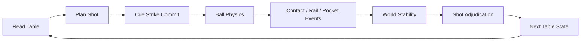

# 下一杆状态设计：台球中的击球承诺、母球走位与整杆裁定

> 系列：游戏系统的共同语言
>
> 日期：2026-09-08
>
> 状态：草稿
>
> 核心问题：台球游戏怎样把一次玩家输入转换成完整物理事件历史，并让玩家真正规划的不只是当前进球，而是下一杆的整个球桌状态？
>
> 关键词：Billiards、Cue Strike、Position Play、Shot Adjudication、Physics

[系列目录](../blog.html)

桌面上有一颗非常容易进的目标球。

玩家只要：

```text
沿着明显线路轻轻一打
```

就能落袋。

但高手可能不会这样打。

因为如果直接进球，

母球会停在：

```text
下一颗球完全没有进攻角度的位置。
```

另一种杆法虽然更难，

却可以让母球：

```text
撞目标球
→
碰库
→
回到桌面中央
→
留下下一杆。
```

所以台球里真正的决策不是：

> “怎样把当前这颗球打进去？”

而是：

> **怎样在完成当前目标以后，把整个球局送到一个对下一杆更有利的状态。**

## 先说结论：一次击球操作的是球桌的下一状态

**下一杆状态设计（后文简称“这一杆不仅要进，还要决定下一杆从哪里开始”）**：玩家提交 Cue Strike 后，不再直接控制球，全部球体经过连续碰撞形成新的稳定球局，Rule Engine 再根据完整事件历史决定球权与合法性。

核心循环：



玩家真正追求的是：

```text
Current Shot Success
+
Next Shot Quality。
```

## Planning 和 Committed Shot 必须分开

瞄准期间：

- 改方向；

- 改力度；

- 改杆头击点；

- 改视角；


都属于：

```text
Planning。
```

真正击球以后：

```text
Cue Strike Commit。
```

玩家通常不能在球运动途中重新控制母球。

因此台球天然拥有：

```text
Intent
→
Commitment
→
Physical Consequence。
```

## Cue Strike 不只是 `velocity = direction × power`

如果只给母球一个线速度，

就很难稳定表达：

- Follow；

- Draw；

- Side Spin；

- Tip Offset。


**Cue Strike Resolver（后文简称“把球杆动作转换成线动量和角动量”）**应该把：

```text
Aim
Power
TipOffset
CueElevation
```

转换为：

```text
Linear Impulse
+
Angular Impulse。
```

击中球心：

```text
主要产生线速度。
```

击点偏高：

```text
增加前滚。
```

击点偏低：

```text
产生回旋趋势。
```

所以所谓杆法，本质上不是一个：

```text
Spin Buff。
```

而是一次初始物理状态提交。

## Spin 必须是 Gameplay State

母球视觉模型旋转得很漂亮，

并不意味着游戏真的支持杆法。

真正需要保存：

```text
AngularVelocity。
```

随后它通过：

- Cloth Friction；

- Ball Contact；

- Cushion Contact；


不断变化。

因此：

```text
玩家按下 Draw
```

不应该在碰到目标球的一刻再临时查询。

Draw 在 Shot Commit 时就已经进入了：

```text
母球角动量。
```

## Sliding → Rolling 是走位可信度的重要阶段

母球刚离杆时不一定处于纯滚动。

随着桌布摩擦：

```text
Sliding
→
Rolling。
```

这会决定母球在真正撞上目标球时：

```text
还剩多少 Follow / Draw。
```

所以同样的杆头击点，

不同：

```text
击球距离
力度
摩擦
```

会产生不同走位。

玩家能够长期学习的，正是这种稳定关系。

## 物理不一定要绝对真实，但必须稳定且可学习

一个游戏当然可以简化真实台球物理。

问题不在于：

```text
是否百分之百现实。
```

而在于：

```text
相同输入
是否能够形成稳定经验。
```

玩家会学习：

```text
这种力度大约走半台。

这种侧旋碰库以后大约偏多少。
```

如果每杆都因为隐藏随机扰动产生明显不同结果，

技能迁移就会崩溃。

所以即使存在：

```text
角色能力误差
```

也更适合在：

```text
Cue Strike Commit
```

时加入可解释输入偏差，

而不是让球在飞行过程中偷偷随机修正。

## 所有球都应该是独立权威实体

每颗球需要稳定：

```text
BallId。
```

因为规则可能关心：

- 球号；

- 分值；

- 球组；

- First Contact；

- Pocket Order；

- Respotted；

- Replay。


所以目标球不是：

```text
某个 Scene Prefab
进入 Trigger 就加分。
```

它是具有长期规则身份的 Gameplay Entity。

## 球桌也不是 Plane + 六个大 Trigger

Pocket 如果只是一块大 Trigger，

就会出现：

```text
视觉明显擦袋而过
逻辑却直接吸入。
```

更好的袋口可以拆成：

```text
Jaw Collision
→
Mouth Region
→
Capture Threshold
→
Pocket Transit。
```

Ball 从：

```text
On Table
```

进入：

```text
Pocketed
```

是一项 Ball Lifecycle Transition。

## 一杆不能在第一次碰撞后立即裁定

母球首先合法命中了目标球。

系统如果立即宣布：

```text
Legal Shot。
```

后面可能又发生：

```text
Scratch。
```

最终整杆仍然犯规。

因此：

> **Shot Legality 是整杆属性。**

Physics 应持续记录：

```text
First Object Contact
Rail Contact
Pocket
Scratch
Ball Off Table。
```

直到：

```text
所有球稳定。
```

然后冻结：

```text
Shot Facts。
```

Rule Engine 才一次性裁定。

## 物理事实和赛事规则必须彻底分离

Physics 只回答：

```text
谁碰了谁？
哪颗球进了哪个袋？
最后停在哪里？
```

Rule Engine 回答：

```text
合法吗？
谁得分？
谁继续？
是否 Ball-in-Hand？
是否赢得 Rack？
```

于是同一套 Physics Core 可以支撑：

- 8-Ball；

- 9-Ball；

- Snooker-like；

- Carom；

- Trick Shot。


而不是在 Ball Script 中写：

```text
if ballNumber == 8:
    Win()
```

## First Contact 必须是稳定的一次性事实

许多规则需要判断：

```text
母球第一颗碰到的是谁。
```

所以：

```text
CueBallFirstObjectContact
```

只能写一次。

后续再次碰球不能覆盖。

类似地，

Rail Contact 也应该是正式事件，

而不是：

```text
Collider 回调次数。
```

否则球持续贴库震荡可能产生：

```text
20 次碰库。
```

规则真正关心的通常只是：

```text
是否发生过合法 Rail Contact。
```

## Scratch 是规则事实，不是 Destroy Cue Ball

母球落袋以后，

不是：

```text
Destroy(cueBall)。
```

而是：

```text
CueBallPocketed = true。
```

Rule Engine 决定：

- Foul；

- Ball-in-Hand；

- 下一阶段；

- 母球重新放置。


所以 Ball-in-Hand 本身还应该成为：

```text
Placement Phase。
```

玩家获得的是：

```text
合法区域内重新放置母球的权利。
```

不是系统随便瞬移到某个默认点。

## Shot Preview 和真实 Shot 必须共享模型

如果辅助线按：

```text
中心击球
```

预测，

而真实 Shot 默认偷偷加入 Spin，

辅助线必然失去可信度。

所以 Preview 应读取同一套：

```text
Aim
Power
TipOffset
Table Physics
Ball State。
```

辅助程度可以不同：

- Beginner；

- Competitive；

- Manual。


但不能拥有第二套物理。

## 母球走位才是长期技术的主要来源

进一颗球只是：

```text
当前目标。
```

真正高水平的连续进攻需要控制：

```text
Cue Ball Final State。
```

可以粗略理解为：

```text
Shot Value
=
Current Pot Probability
+
Next Position Quality
+
Opponent Risk。
```

这不是严格公式。

它强调：

> 一杆的质量不能只用“这球进没进”判断。

## Safety 也是下一状态设计

玩家没有好进攻线路时，

可以主动选择：

```text
不强行进球
```

而把球局送到：

```text
对手难以直接进攻
```

的状态。

这说明台球的下一状态设计既包括：

```text
Position Play
```

也包括：

```text
Safety Play。
```

两者都是：

```text
操纵未来球局。
```

## 与物理弹球的边界

弹球里玩家持续用：

```text
Flipper
```

影响球。

台球则是：

```text
一次 Commit
→
长时间观察结果。
```

弹球强调实时控制连续物理。

台球强调：

```text
高质量单次输入
+
未来状态预测。
```

## 与回合制炮术的共同点和差异

两者都有：

```text
Planning
→
Commit
→
Physics
→
Stable
→
Rule。
```

但炮术攻击会：

```text
永久修改 Terrain。
```

台球则主要：

```text
重新排列共享球局。
```

前者不断改战场本身。

后者不断改状态布局。

## 常见失败

### 球进袋就立即裁定整杆

后续 Scratch 无法正确处理。

### Physics 自己决定得分和胜负

规则无法复用。

### Spin 只是视觉效果

杆法没有真实技能意义。

### 不固定 Physics Tick

不同帧率形成不同球感。

### Ball Collision 由数组遍历顺序决定

密集碰撞结果不稳定。

### Pocket 只是一个大 Trigger

袋口行为失真。

### Preview 使用另一套简化模型

玩家无法信任辅助线。

## 我的台球检查表

1. Shot 是否有明确 Planning / Commit？

2. Cue Strike 是否同时产生线动量与角动量？

3. Spin 是否属于权威球状态？

4. Sliding / Rolling 是否具有稳定模型？

5. Physics Tick 是否固定？

6. 高速碰撞是否避免明显 tunneling？

7. 球是否拥有稳定 BallId？

8. Pocket 是否有正式生命周期？

9. First Contact 是否只记录一次？

10. Rail Contact 是否是语义事件？

11. Scratch 是否属于 Shot Fact？

12. 是否等待所有球稳定？

13. Shot Legality 是否整杆统一裁定？

14. Physics 与 Ruleset 是否分离？

15. Ball-in-Hand 是否是正式 Placement Phase？

16. Preview 是否复用真实 Strike Model？

17. 当前设计是否奖励下一杆位置，而不只是进球？


台球最有意思的地方并不是：

```text
球体碰撞很真实。
```

而是：

> **玩家用一次极短的击球动作，试图控制未来几秒整张球桌的状态演化。**

真正成熟的玩家思考的不是：

```text
这一球能不能进。
```

而是：

```text
这一球结束以后
下一杆还剩下什么。
```

## 术语对照

|正式术语|通俗称呼|
|---|---|
|下一杆状态设计|这一杆同时决定下一杆从哪里开始|
|Cue Strike Commit|正式击球|
|Position Play|为下一杆做走位|
|Shot Facts|整杆发生过的规则事实|
|Shot Adjudication|所有球停下以后统一裁定|
|Ball-in-Hand|新的合法摆球阶段|
|Stable Physics|可以被长期学习的稳定球感|

## 内部资料依据

- `game-designs/台球游戏设计范式.md`

- `game-designs/物理弹球游戏设计范式.md`

- `game-designs/回合制炮术对抗游戏设计范式.md`

- `blogs/游戏系统的共同语言/19-物理事实到规则语义.md`

- `blogs/README.md`


本文讨论的是 Cue Sports 的共同系统模型，不对应某一个赛事规则的完整官方实现。
