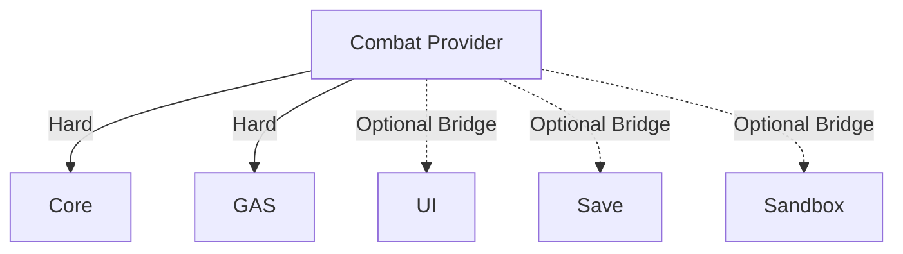

# 框架能力语义目录：能力词表、证据化声明与可解释模块选择

> 系列：Sakura Framework 工程实践
>
> 日期：2026-08-07
>
> 状态：可发布候选
>
> 核心问题：大型模块化框架如何从“有哪些包”进一步表达“能解决什么问题、由谁提供、证据在哪里、还需要哪些依赖和项目责任”，并让工具可以确定性地回答能力选择问题？

[系列目录](../blog.html)

模块化框架发展到一定规模后，会出现一个有些反直觉的问题：

> 包越多，用户越难知道自己应该安装什么。

假设框架中存在这些模块：

```text
config-core
save
ui
mvvm
command
simulation
dialogue
jrpg
crpg
gas
semantic-combat
...
```

熟悉仓库的人看到名字，大致能够判断它们负责什么。

但对于新项目、自动化工具甚至几个月后的维护者而言，一个包名并不能完整回答：

- 它提供什么游戏能力；

- 它只是底层设施还是完整功能；

- 两个相近模块的差异是什么；

- 需要哪些硬依赖；

- 哪些集成只是 Optional Bridge；

- 它是否满足确定性要求；

- 它当前处于什么生命周期；

- 项目还需要自己实现什么；

- 某种游戏类型应该组合哪些能力。


传统 Module Catalog 很擅长描述：

> 仓库里有什么。

但它并不天然描述：

> 用户想完成某件事时，该选择什么。

这就是能力语义目录试图补上的那一层。

## 先说结论：模块是实现单位，Capability 才是需求语言

**Capability Semantics（后文简称“能力语义”）**：用稳定、与具体包名解耦的词汇描述框架能够提供的业务或工程能力，并建立能力到实现模块之间的可验证映射。

例如，与其让用户搜索：

```text
com.unitygame.framework.command
```

不如先表达需求：

```text
simulation.deterministic-replay
```

与其直接选择某个 UI 包，不如表达：

```text
presentation.ui-navigation
```

与其从名字猜测 Config 包负责什么，可以表达：

```text
content.versioned-config
```

这里发生了一个重要变化：

```text
Package-first
“这个包有什么？”
```

变成：

```text
Capability-first
“我需要什么能力？”
```

对于大型框架，后者更接近消费项目真正的决策过程。

## Capability Definition 建立稳定词表

**Capability Definition（后文简称“能力词条”）**：定义一个稳定能力 ID，以及它的类别、说明、选择问题和质量属性。

例如，一个能力词条可以描述：

```text
能力：
版本化配置

Category：
content

解决的问题：
运行时配置需要经过校验并以一致版本提交

质量属性：
atomic
versioned
```

这里最有价值的字段之一是 `qualityAttributes`。

因为“提供配置系统”仍然过于模糊。

两个实现都可能叫 Config，但一个只负责读取 JSON，另一个提供：

- 版本；

- 校验；

- 原子提交；

- Snapshot；

- 回滚边界。


能力语义不仅描述“有这个功能”，还可以描述它的工程性质。

类似地：

```text
确定性 Replay
→ deterministic
→ auditable

UI Navigation
→ typed
→ lifecycle-safe

Local Save
→ atomic
→ recoverable
```

这种属性非常适合机器过滤和架构比较。

## selectionQuestions 把模块文档转成设计决策

普通包说明经常写：

> 本包提供 ATB Timeline。

但用户真正需要回答的是：

> 我的战斗是否采用 ATB 行动槽？

因此能力词条可以带有**选择问题**。

选择问题不是营销文案，而是帮助项目把需求转换为能力条件。

例如：

```text
是否需要任务或成就生命周期？
→ progression.quest-lifecycle

战斗是否需要显式回合阶段？
→ combat.turn-state-machine

界面跳转是否需要与 Prefab 和页面类解耦？
→ presentation.ui-navigation
```

这让 Framework Catalog 从“软件库存”向“架构决策辅助”迈了一步。

## Module Claim 负责声明由谁提供能力

定义能力之后，还不能直接说某个模块支持它。

需要第二层关系。

**Capability Claim（后文简称“能力声明”）**：某个模块声明自己以特定方式提供某项能力，并附带可追踪依据。

结构大致是：

```text
Capability Definition
        ↓
     Claim
        ↓
Provider Module
        ↓
Evidence
```

这样可以避免把能力词表和包实现写成同一份静态列表。

一个能力可能：

- 由一个主 Provider 完整提供；

- 由多个模块共同完成；

- 需要 Optional Bridge 才能接入另一领域；

- 只在特定 Profile 或生命周期下成立。


能力与包之间天然是多对多关系。

因此语义层不应该重新制造“一能力一个包”的假象。

## Claim 必须绑定 Evidence

如果 Catalog 允许随意声明：

```text
这个包支持 Deterministic Replay
这个包支持 Recoverable Save
这个包支持 Lifecycle-safe UI
```

能力目录很快会退化成宣传清单。

**证据化能力声明（后文简称“有依据的能力”）**：Capability Claim 必须能够指向实现、合同、测试或其他被允许的证据来源。

这里的关键不是 Evidence 数量。

而是声明和证据之间有明确关系：

```text
Claim：
提供确定性 Replay

Evidence：
核心合同 / 测试 / 文档 / 实现入口

因此 Resolver 才允许输出该 Claim
```

如果 Evidence 丢失、字段损坏或引用失效，严格 Verifier 应让 Catalog 失败。

而不是为了保持漂亮的能力列表继续展示。

## Optional Bridge 与 Hard Dependency 必须分开

模块化框架很容易因为能力组合而重新形成大依赖球。

例如某个战斗模块可以：

- 独立运行；

- 可选接 UI；

- 可选接 Save；

- 可选接 Audio；

- 可选接 Wasm。


如果 Capability Resolver 把所有这些关系都算成安装要求，推荐结果会越来越大。

因此需要区分：

**硬依赖**：

> 没有它，这个 Provider 本身就不能成立。

**Optional Bridge**：

> Provider 可以独立成立，但安装另一个模块后能够建立额外集成。

例如：



这一区分直接影响消费闭包。

否则一句：

> 支持 UI 集成

最终可能变成：

> 所有使用 Combat 的项目都必须安装 UI。

## Reference Recipe 描述组合，不代表自动安装

能力语义目录还可以进一步描述典型玩法组合。

当前 Catalog 已经开始为不同参考方向定义 Recipe，例如：

- Roguelite 2D；

- JRPG；

- CRPG。


**Reference Recipe（后文简称“能力配方”）**：针对一种项目需求给出能力组合与候选 Provider，但本身不执行安装和 Manifest 修改。

这一边界尤其重要。

能力配方回答：

> 如果我要构建这一类项目，可能需要哪些能力？

而不是：

> 帮我立刻把这些包写进项目。

因此它可以大胆承担分析责任，同时保持写入权限为零。

## JRPG 和 CRPG 不应该因为都叫 RPG 就得到同一答案

能力语义的价值，在相近领域里更加明显。

JRPG 和 CRPG 都可能需要：

- 对话；

- 任务；

- 存档；

- 战斗；

- UI。


但关键规则可能明显不同。

例如一个方向可能强调：

```text
ATB
回合阶段
Field/Battle 双上下文
战斗指令 UI
主表 Schema
```

另一个方向可能更重视：

```text
D20
行动经济
技能检定
规则判定
复杂世界事实
```

如果工具只根据关键词：

> RPG

搜索包名，很容易得到高度相似的结果。

而稳定 Capability ID 可以让两个 Recipe 在需求层就产生差异。

## Resolver 应该解释答案，而不是只给包名

普通依赖解析器输出：

```text
安装：
A
B
C
D
```

对于大型框架仍然不够。

用户还需要知道：

- 为什么选 A；

- A 满足哪个 Capability；

- B 为什么是硬依赖；

- C 是不是 Optional；

- 是否存在 Preview 生命周期风险；

- 哪部分仍需项目实现；

- 当前约束下有没有完整解。


**可解释 Capability Resolver（后文简称“带理由的能力解析”）**：在返回 Provider 和依赖闭包的同时，保留能力映射、生命周期、风险和项目责任信息。

理想输出更接近：

```text
需要：
presentation.ui-navigation

Provider：
UI Navigation Module

原因：
该模块拥有该 Capability 的有效 Claim

硬依赖：
Core
UI Core

Optional Bridge：
MVVM

项目责任：
提供业务 Route Table

Lifecycle：
Preview
```

这样解析结果既能被人审阅，也适合其他工具继续消费。

## Stable-only 无解时应该明确返回无解

能力解析还有一个重要的失败模式：

> 用户要求只使用 Stable 模块，但某项能力只有 Preview Provider。

最危险的做法是：

- 自动放宽约束；

- 偷偷使用 Preview；

- 找一个“差不多”的 Stable 模块代替；

- 省略无法满足的能力。


更可靠的输出应该是：

```text
No solution under current constraints.
```

**约束保持解析（后文简称“条件不够就不凑答案”）**：Resolver 不为了生成结果而静默改变用户的生命周期、依赖或质量要求。

Fail closed 在这里不是错误体验。

它是在保护架构决策。

## 确定性 Resolver 比直接接 LLM 更适合第一阶段

看到“语义目录”很容易立即想到：

- Embedding；

- Vector Database；

- LLM；

- 自然语言需求解析；

- 自动安装 Agent。


这些都可能是未来消费者。

但第一阶段先建立一个确定性的能力词表和 Resolver 更重要。

因为 LLM 可以帮助把：

> 我想做一个带回合制、对话和检定的 RPG

映射到：

```text
combat.turn-state-machine
narrative.dialogue-graph
rules.skill-check
```

但 LLM 不应该自行决定：

> 哪个包真的实现了这些能力。

后者必须回到受验证 Catalog。

因此合理链路可以是：


AI 可以理解用户。

Catalog 负责描述工程事实。

两者职责不同。

## 生成 Index 是人机共享接口

原始 Catalog 适合机器读取，但人工浏览需要另一种形式。

因此可以从同一个 Catalog 确定性生成 Capability Index：

```text
能力
→ Provider
→ Evidence
→ Optional Bridge
→ Recipe
```

重要的是这个 Index 不能成为第二个手工维护的真相源。

它应该始终由 Catalog 生成。

这样：

- 编辑器工具；

- 文档；

- Agent；

- CLI；

- 未来 Installer Preview；


都可以围绕同一份 Capability Identity 工作。

## 我的判断

大型框架最早通常按“技术模块”组织：

```text
Event
Audio
UI
Save
Command
GAS
```

这是合理的源码组织方式。

但消费项目思考问题时通常使用另一种语言：

```text
我要可恢复存档
我要确定性 Replay
我要回合状态机
我要动态叙事
我要可测试的 UI 导航
```

能力语义层的价值，就是在两种语言之间建立一张可验证映射。

```text
项目需求语言
      ↓
Capability
      ↓
Claim + Evidence
      ↓
Provider + Dependency Closure
      ↓
实际模块
```

当这条链路稳定以后，AI 推荐、安装器、项目模板和架构审计都可以成为它的消费者，而不必各自维护一份“我觉得这个包是干什么的”知识。

## 设计检查表

- Capability ID 是否独立于包名；

- 能力词条是否包含明确工程含义；

- 是否表达质量属性而不只是功能名称；

- Module Claim 是否有 Evidence；

- Evidence 损坏时 Verifier 是否失败；

- Hard Dependency 与 Optional Bridge 是否分离；

- Recipe 是否保持只读；

- Resolver 是否返回完整硬依赖闭包；

- Resolver 是否说明生命周期风险；

- 项目责任是否与框架能力分开；

- stable-only 无解时是否明确失败；

- AI 语义推理是否与工程事实 Resolver 分层；

- Generated Index 是否只有一个上游真相源。


## 术语对照

|正式术语|通俗称呼|含义|
|---|---|---|
|Capability Semantics|能力语义|与具体包名解耦的功能与工程能力描述|
|Capability Definition|能力词条|稳定能力 ID 及其说明和质量属性|
|Capability Claim|能力声明|模块声明自己提供某项能力|
|Evidence-backed Claim|有依据的能力|能够追溯到实现或验证事实的声明|
|Optional Bridge|可选桥接|不扩大 Provider 基础硬依赖的额外集成|
|Reference Recipe|能力配方|某类项目所需能力的只读参考组合|
|Capability Resolver|带理由的能力解析|根据能力和约束返回 Provider 与依赖闭包|

> 资料说明：本文依据 2026-08-06 的 Capability Semantics Pilot 与 Module Catalog v2 整理。当前能力目录包含稳定词表、证据化 Claims、Reference Recipes 与只读 Resolver；Developer Console 自动安装、Manifest 修改、LLM/向量检索和完整领域本体不应从本文内容中外推。
