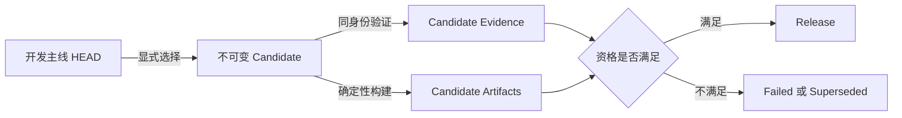
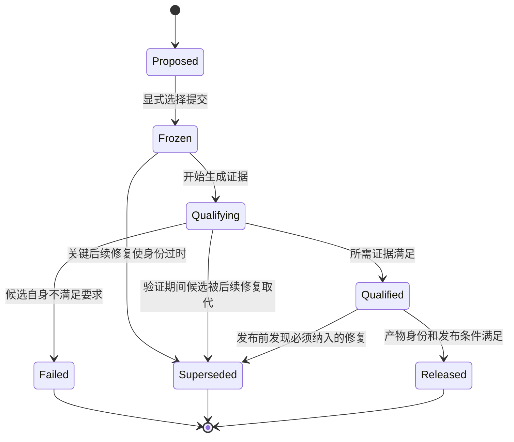

# 候选版本身份治理：发布冻结、失效判定与主线回退

> 系列：大型 Unity 框架的治理复盘
>
> 日期：2026-08-06
>
> 状态：草稿
>
> 核心问题：一个发布候选被冻结之后，如果主分支又合入了与构建、测试或消费路径有关的修复，原候选是否还能继续作为交付对象？

[系列目录](../blog.html)

项目准备进入发布阶段时，团队通常会选择一个提交作为候选版本。

接下来，CI 围绕这份候选执行：

- 构建；
- 单元测试；
- Unity 测试；
- Player 验证；
- API 兼容检查；
- 消费项目演练；
- 性能比较；
- 制品组装；
- 发布前检查。

验证过程中，团队发现了问题。

问题可能发生在：

- 消费闭包缺少必要包；
- Sample 清理不完整；
- Testbed 残留旧资源；
- 构建脚本无法保留失败制品；
- 候选安装路径无法在干净项目中运行；
- 测试进程可能永久挂起。

维护者随后把修复合入主分支。

此时最容易出现一种错误判断：

> 问题已经修复，可以继续验证原来的候选。

但如果候选是一个固定提交，后续修复并不存在于候选代码中。

继续验证原候选，只能继续证明旧问题仍然存在；临时从主分支借用修复，又会破坏候选和证据之间的身份一致性。

候选版本治理首先不是测试数量问题，而是身份问题。

## 先说结论：候选版本是一份不可变对象，不是不断追赶主分支的名称

**候选版本身份（即“这次究竟准备交付哪份代码”）**：由不可变提交、源码树、构建配置和预期产物共同确定的发布候选对象。

候选版本一旦选定，至少应绑定：

- Commit SHA；
- Git Tree Hash；
- 版本号或候选编号；
- 构建配置；
- 依赖锁定信息；
- 目标平台；
- 证据要求；
- 预期产物清单。

候选名称不能只表示一种意图，例如：

```text
当前准备发布的 main
```

因为 `main` 会继续变化。

更可靠的表达是：

```text
Candidate C
→ 固定提交 S
→ 固定源码树 T
→ 固定构建合同 B
→ 固定证据集合 E
```

任何验证结论都必须能够回答：

> 它验证的是不是这份候选？

## 工作分支、候选版本和发布产物是三种不同身份

大型项目中至少同时存在三类代码身份。

| 身份 | 主要用途 | 是否允许变化 |
|---|---|---|
| 开发主线 | 持续合入功能、修复和文档 | 允许持续变化 |
| 发布候选 | 接受资格验证的固定源码状态 | 不允许静默变化 |
| 发布产物 | 由候选生成的可分发制品 | 生成后不可变 |

三者之间应形成单向关系：



开发主线可以在候选产生之后继续前进。

但这些后续提交不会自动进入候选。

如果团队希望新修复进入交付对象，就必须选择新的候选身份，而不是继续沿用旧候选名称。

## Same-SHA 的意义是防止证据与交付对象分离

**同提交证据（即“证明和交付使用同一份代码”）**：测试、构建、制品组装和发布判断全部绑定到同一个不可变提交。

假设流程如下：

```text
提交 A
→ Unity 测试通过
→ Player 构建通过

提交 B
→ 修复消费项目
→ 准备发布 B
```

提交 A 的证据不能直接证明提交 B。

即使 B 只修改了一个看似简单的脚本，它仍可能改变：

- 包闭包；
- 构建参数；
- Sample；
- Testbed；
- Player 内容；
- 制品结构；
- 安装流程。

反过来也一样。

如果候选固定在 A，却在执行验证时从 B 借用测试脚本或修复文件，验证对象就不再清晰：

```text
源码来自 A
测试工具来自 B
消费脚本来自 B
制品部分来自 A
```

最终团队无法回答：

- 测试通过的是哪一份系统；
- 修复是否真实存在于交付产物；
- 用户安装后是否会遇到已知问题；
- 失败应该归因于候选还是验证基础设施。

Same-SHA 不是形式主义。

它用于保证：

> 被证明的对象，就是准备交付的对象。

## 后续提交不会自动使候选失效，但关键路径修改会

候选选定后，主分支出现新提交是正常现象。

不是每一个新提交都必须废弃候选。

例如，以下变化通常可以经过评估后认定不影响候选：

- 与发布内容无关的研究文档；
- 未来版本设计稿；
- 不参与候选构建的内部工具；
- 不影响公开产物的拼写修正；
- 与候选平台无关的实验分支材料。

真正需要判断的是：

> 后续变化是否修改了候选资格结论所依赖的事实？

**候选失效条件（即“旧候选已经不值得继续验”）**：候选选定后，出现了会改变其可构建性、可消费性、正确性、安全性或证据有效性的相关变化。

常见失效路径包括：

| 修改范围 | 失效原因 |
|---|---|
| 候选构建脚本 | 旧候选无法使用修复后的构建流程 |
| 消费项目或 Walkthrough | 原候选的真实接入路径仍然失败 |
| Testbed 与 Fixture | 旧证据环境存在已确认缺陷 |
| Stable Profile 或包闭包 | 候选安装内容与当前合同不一致 |
| 发布校验器 | 旧验证结果不能满足修正后的判定规则 |
| 安全、数据损坏或恢复修复 | 继续交付旧候选风险不可接受 |
| Player 或平台修复 | 候选产物仍包含已知平台问题 |
| API 或协议修复 | 候选与实际消费合同不一致 |

候选失效应由规则判断，而不是由维护者凭印象决定。

## 候选应该拥有显式状态机

候选状态不应只有“正在准备”和“发布完成”。

更完整的状态可以包括：



其中最重要的区别是：

- `Failed`：候选接受验证后，明确不满足要求；
- `Superseded`：候选已经被更新的必要代码取代，不再值得继续验证。

两者不能混为一谈。

旧候选被后续关键修复取代，不代表项目失败。

它只表示：

> 当前交付对象已经发生变化，原证据链应该停止。

## Superseded 不是删除历史，而是结束错误方向

候选失效后，团队常见的错误动作有两种。

### 错误一：删除失败记录

为了让下一次候选看起来干净，维护者删除旧 Attempt、日志和失败说明。

这样会丢失：

- 问题首次出现的位置；
- 哪个验证发现了问题；
- 为什么需要选择新候选；
- 新候选应该特别复验什么；
- 同类问题是否反复发生。

### 错误二：继续执行旧候选的全部验证

团队认为已经投入了大量 CI 成本，希望先把旧候选流程“跑完”。

但如果关键修复不在候选中，这些结果很难再支持交付决策。

正确做法是：

1. 保留旧候选身份；
2. 保留已经生成的证据；
3. 记录失效原因；
4. 将状态标记为 `superseded`；
5. 停止剩余高成本资格化；
6. 不自动选择新候选；
7. 在未来真正需要交付时，显式选择新的固定提交。

历史记录的价值在于解释演进，不在于强行把每次 Attempt 推到终点。

## 发布冻结不是让整个仓库停止开发

**发布冻结（即“固定交付对象，不再偷偷换内容”）**：确定候选后，限制进入该候选的变化，并要求所有修改通过显式失效、重选或例外流程处理。

冻结不一定意味着：

- 主分支停止合并；
- 所有新功能都暂停；
- 文档不得更新；
- 其他实验分支不得继续；
- 团队只能处理发布事项。

它真正冻结的是候选身份。

团队可以采用两种基本策略。

### 策略一：主线冻结

适合发布周期短、团队规模较小的项目：

```text
main
→ 暂停普通功能
→ 只接收候选阻断修复
→ 修复后重选 Candidate
→ 发布后解除冻结
```

### 策略二：发布旁路

适合主线仍需持续开发的项目：

```text
main
→ 持续开发收敛

release candidate
→ 固定提交
→ 独立资格验证
→ 只通过显式方式接受必要修复
```

无论采用哪种方式，都不能让候选一边声明不可变，一边持续从主线吸收未登记修改。

## 发布准备应是限时旁路，而不是永久占据项目主线

大型框架通常长期处于能力建设、整合和验证阶段。

发布准备与持续开发的目标不同：

| 开发收敛 | 发布准备 |
|---|---|
| 完善能力 | 固定范围 |
| 允许调整 API | 控制变化 |
| 扩充消费证据 | 资格化固定对象 |
| 修复架构边界 | 只处理发布阻断 |
| 面向未来设计 | 面向当前交付 |

如果项目实际仍在快速修复消费闭包、Testbed 和 Sample，却把发布准备设为唯一 Active 工作，就会产生冲突：

- 修复是否允许进入候选；
- 新能力验证是否属于发布；
- 失败是能力问题还是候选问题；
- 主分支是否应停止；
- 自动化 Agent 应继续开发还是继续 RC；
- README、计划和机器状态应该相信哪一个。

**发布旁路（即“临时进入交付模式”）**：由维护者显式启动、绑定固定候选、拥有明确退出条件的限时工作模式。

合理的发布旁路至少应定义：

- 启动人或批准来源；
- 候选身份；
- 允许的修改类型；
- 所需证据；
- 最大持续时间；
- 失效条件；
- 退出条件；
- 回到开发主线的方式。

发布旁路完成或失效后，应主动退出。

它不应该因为状态文件没有更新，而无限期占据项目主线。

## 功能蔓延和必要修复必须分开处理

候选期间出现新需求时，维护者需要区分三类变化。

### 候选阻断修复

不修复就无法正确交付：

- 数据损坏；
- 安全问题；
- 安装失败；
- 关键平台崩溃；
- 候选消费闭包错误；
- 测试基础设施无法得到可信结果。

处理方式：

```text
旧 Candidate 标记 Superseded
→ 修复进入开发主线
→ 重新评估是否选择新 Candidate
```

### 候选质量改进

有价值，但不影响当前候选基本正确性：

- 更详细诊断；
- 更快构建；
- 更好的编辑器提示；
- 非关键性能优化；
- 文档体验改善。

处理方式：

- 默认进入下一版本；
- 除非维护者明确认定为本次交付要求，否则不重选候选。

### 新功能或范围扩大

改变原候选产品范围：

- 新模块；
- 新平台；
- 新 Profile；
- 新协议；
- 新 Sample；
- 新公共 API。

处理方式：

- 不进入当前候选；
- 回到开发主线；
- 未来重新启动发布旁路。

冻结阶段最危险的不是修复 Bug，而是把“顺手再补一点”不断包装成发布必要项。

## 候选身份必须进入机器真理源

如果候选信息只存在于 README 或计划文本中，自动化无法可靠判断它是否已经过期。

机器状态至少应记录：

```text
candidateVersion
candidateCommit
candidateTreeHash
candidateSelectedAt
sourceCommit
sourceTreeHash
generatedAt
qualificationState
invalidationState
invalidationReason
```

同时还应维护关键路径集合：

```text
Candidate Build
Release Verification
Consumer Walkthrough
Stable Profiles
Testbed
Player Qualification
Artifact Assembly
```

状态生成时可以执行：

```text
存在 Candidate
AND Candidate 之后修改了关键路径
AND 没有显式豁免或失效记录
→ 状态生成失败
```

这种失败不是阻止开发。

它是在迫使仓库回答：

> 当前候选是否仍然有效？

## README、计划和机器状态不能表达三套发布现实

候选治理通常涉及多个状态来源：

- 根 README；
- 工作计划；
- Work Status；
- Release Policy；
- Candidate Manifest；
- Workflow 输入；
- Artifact Manifest。

这些文档可以承担不同职责，但不能对同一个事实给出不同答案。

例如：

```text
README
→ 当前仍在开发收敛，未启动发布

Work Status
→ release-preparation，继续 Active RC

Candidate Manifest
→ 固定旧提交

main
→ 已经包含候选相关修复
```

此时自动化和维护者都无法确定下一步。

更合理的职责划分是：

| 信息 | 建议真理源 |
|---|---|
| 当前项目工作模式 | Work Status 或明确模式文件 |
| 候选身份 | Candidate Manifest |
| 发布政策 | Release Policy |
| 人类入口说明 | README 查询并解释权威状态 |
| 测试结果 | Evidence Manifest |
| 产物身份 | Artifact Manifest |

README 可以解释状态，但不应独立定义另一套状态。

## 新候选不应该被自动选择

旧候选失效后，最方便的做法是：

```text
读取最新 main
→ 自动生成 Candidate 2
→ 继续跑验证
```

这种自动推进存在两个风险。

第一，最新 HEAD 可能仍在变化，没有经过维护者范围确认。

第二，候选失败可能说明项目尚未真正进入交付阶段，而不是只差一次重试。

因此，候选重选应是显式动作。

维护者需要重新确认：

- 当前功能范围是否冻结；
- 关键修复是否全部进入；
- 工作区和主分支是否稳定；
- 是否仍然希望交付；
- 当前证据成本是否值得投入；
- 是否存在尚未关闭的高风险能力问题。

自动化可以生成候选建议，但不应自行决定：

> 现在应该发布这份代码。

## 候选治理中的常见失败

### 使用分支名作为候选身份

`main`、`release` 或 `develop` 都会移动，不能作为不可变证据对象。

### 后续修复进入主分支后继续验证旧候选

修复不存在于候选中，验证成本无法支持实际交付对象。

### 从新提交借用脚本验证旧源码

源码、测试工具和消费路径不再属于同一身份。

### 把 Superseded 记录成 Failed

掩盖了候选被后续必要修改取代的真实原因。

### 每次失效后自动选择最新 HEAD

发布流程开始自行驱动项目，而不是服从维护者的交付意图。

### 发布准备永久占用 Active 工作

项目主线从能力建设被悄然转为 RC 清单处理。

### 候选期间不断加入小功能

产品范围持续扩大，冻结失去意义。

### README 与机器状态长期矛盾

人类和自动化按照不同工作模式执行。

### 候选信息不绑定源码树

同一提交引用的外部依赖或生成内容变化后，证据仍被错误复用。

### 为了保住候选而降低验证标准

证据要求开始迁就候选，而不是判断候选是否合格。

## 我的候选版本治理检查表

准备或维护发布候选时，我会检查：

1. 候选是否绑定不可变 Commit SHA？
2. 是否同时记录 Git Tree Hash？
3. 构建配置和依赖是否可重现？
4. 测试、消费演练和制品是否全部绑定同一候选？
5. 是否存在从后续提交借用修复或脚本的情况？
6. 候选之后是否修改过构建、消费、Testbed 或验证关键路径？
7. 哪些路径变化会自动使候选失效？
8. 候选失效后是否使用 `Superseded` 而不是删除历史？
9. 是否会停止已无交付价值的高成本验证？
10. 新候选是否必须由维护者显式选择？
11. 发布准备是否拥有明确开始和结束条件？
12. 项目主线是否仍然与发布旁路清楚分离？
13. 候选期间允许进入哪些类型的修复？
14. 新功能是否被明确推迟到下一版本？
15. README、状态文件和 Candidate Manifest 是否表达同一事实？
16. 状态文件是否记录生成时所依据的提交？
17. 自动化能否检测 Candidate 与当前关键路径之间的漂移？
18. 候选产物是否能够追溯到唯一源码身份？
19. 已通过的证据是否会因为候选身份变化自动过期？
20. 当前真的需要继续发布，还是应该回到能力收敛？

发布候选的价值不在于拥有一个 RC 编号。

它的价值在于把一份明确代码从持续变化的开发主线中分离出来，并围绕这份代码建立完整、可追溯的资格结论。

一旦必要修复已经进入更晚的主分支，旧候选就不应该继续假装代表项目当前准备交付的状态。

正确的治理不是强行把每次候选推到发布终点。

而是始终准确回答：

> 当前正在验证哪一份代码，这份代码是否仍然值得交付？

## 术语对照

| 正式术语 | 文中通俗称呼 |
|---|---|
| 候选版本身份 | 这次究竟准备交付哪份代码 |
| 同提交证据 | 证明和交付使用同一份代码 |
| 候选失效条件 | 旧候选已经不值得继续验 |
| 发布冻结 | 固定交付对象，不再偷偷换内容 |
| 发布旁路 | 临时进入交付模式 |

---

## 内部资料依据

本文主要基于以下材料整理：

- `diary/2026/08/08-05 审计报告.md`
- `blogs/README.md`
- `blogs/publication.v1.json`

本文是对大型软件仓库候选版本与发布工作流的工程复盘。文中的候选状态机、关键路径失效检测、发布旁路和机器真理源字段属于治理建议，不表示相关框架已经实施了完全相同的候选失效机制或发布状态模型。