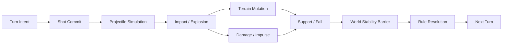

# 弹道承诺与战场改写：回合制炮术中的不可逆射击、地形事务与世界稳定屏障

> 系列：游戏系统的共同语言
>
> 日期：2026-09-08
>
> 状态：草稿
>
> 核心问题：一次炮击怎样同时成为伤害行为、地形编辑和未来战术状态提交，并保证连续物理世界真正稳定后才安全进入下一回合？
>
> 关键词：Artillery、Shot Commit、Terrain Mutation、World Stability Barrier、Ballistics

[系列目录](../blog.html)

玩家准备攻击山坡另一侧的敌人。

他可以：

```text
提高角度
降低力度
换武器
考虑风向
移动角色。
```

只要还没有开火，

这些都只是计划。

但按下 Fire 的一刻，

情况发生根本变化。

Projectile 已经离开炮口。

玩家通常不能：

```text
飞到一半重新调角度。
```

弹丸落地以后：

- 敌人受到伤害；

- 地面被炸出一个坑；

- 角色被击退；

- 脚下支撑消失；

- 角色继续坠落；

- 新的射击通道被打开。


于是这一发攻击真正改变的并不只是：

```text
Enemy HP。
```

它还改变了：

```text
整个下一回合的战场。
```

## 先说结论：一发炮弹是一笔对未来战场的不可逆提交

**弹道承诺（后文简称“开火以前可以反悔，开火以后只能接受物理后果”）**：玩家把角度、力度、武器和环境上下文提交成一次 Shot，随后结果由连续物理世界决定。

核心链条可以写成：



这一结构同时存在两个时间域：

### Tactical Turn Time

回答：

```text
谁现在拥有决策权？
```

### Physics Simulation Time

回答：

```text
弹丸、击退和坠落怎样连续发生？
```

游戏可以是回合制。

物理世界却不能因此变成：

```text
一格一格的抽象动画。
```

## Fire 不是 Turn End

玩家按下 Fire 后，

还可能继续发生：

```text
Projectile 飞行
↓
Explosion
↓
Terrain 切除
↓
Actor 被推飞
↓
脚下地形消失
↓
Actor 下坠
↓
再次碰撞
↓
Damage
↓
Death。
```

如果 Fire 一发生就：

```text
ActiveActor = NextActor，
```

下一名玩家可能在：

```text
上一发炮弹还没处理完
```

时获得行动权。

所以必须存在：

**World Stability Barrier（后文简称“上一发所有真正后果都结束以后才交棒”）**。

一个可能的稳定条件是：

- 无 Active Projectile；

- 无 Pending Explosion；

- 无 Pending Terrain Mutation；

- 无待结算 Damage；

- 无待结算 Fall Death；

- Actor 已稳定；

- Effect Queue 已清空。


注意：

```text
Animation Finished
```

不应该成为稳定性的权威定义。

动画属于表现。

规则稳定来自 Gameplay State。

## Terrain 是 Gameplay State，不是背景 Collider

炮术游戏最独特的一项机制是：

> **攻击能够永久改变地形。**

因此 Terrain 不能只是：

```text
一张 Sprite
+
一个 Collider。
```

更合理的是拥有权威：

```text
Terrain Mask / Field / Voxel / Polygon State。
```

表现层再从它生成：

- Mesh；

- Texture；

- Collider。


这形成：

**地形真相与地形视图分离（即“先改真正可站立的世界，再重新画出来”）**。

错误方向是：

```text
先在 Texture 上画一个洞
↓
再让 Gameplay 猜这个洞应该怎样碰撞。
```

正确方向是：

```text
Logical Terrain Mutation
↓
Collision Revision
↓
Support Query
↓
Visual Rebuild。
```

## 爆炸更像几何事务，而不是 Destroy 附近对象

二维炮术中，

一次爆炸可以理解成：

```text
Subtract Circle
from
Terrain Mask。
```

或者：

- Subtract Capsule；

- Cut Line；

- Add Platform；

- Replace Material。


一次 Terrain Mutation 可以拥有：

```text
MutationId
SourceEvent
Shape
AffectedBounds
RevisionBefore
RevisionAfter。
```

执行顺序：

```text
读取当前 Terrain Revision
↓
应用逻辑几何修改
↓
得到 Affected Bounds
↓
更新碰撞
↓
更新 Support
↓
发布 TerrainChanged
↓
局部重建表现
↓
提交新 Revision。
```

这是一笔正式世界状态事务。

## 地形变化真正危险的是它会改变其他系统的前提

一块地被炸掉以后，

影响的不只是：

```text
这里少了一块像素。
```

还包括：

- Actor Standing；

- Navigation；

- Projectile Line；

- Cover；

- Fall Risk；

- AI Tactical Analysis；

- 下一发可行弹道。


所以 Terrain Changed 必须成为领域事件。

尤其重要的是：

> **没有直接受到爆炸伤害的角色，也可能因为脚下支撑消失而死亡。**

## Support 应该重新查询，而不是一直保留 Grounded

假设角色站在：

```text
一块细长平台。
```

爆炸发生在角色脚下。

角色没有进入 Damage Radius。

如果 Character Controller 仍然保存：

```text
Grounded = true，
```

就会悬浮。

更可靠的是：

**Support Query（后文简称“当前真的还有东西托住我吗”）**。

Terrain Revision 变化以后，

只需要对受影响区域附近的 Actor 重新判断：

```text
IsSupported？
```

如果没有：

```text
进入 Falling。
```

于是：

```text
炸地形
```

本身就成为独立战术。

## Damage、Knockback 和 Terrain Damage 必须拆开

如果 Explosion 只有：

```text
ExplosionDamage = 100
```

一个黑盒参数，

所有武器最终只是在比较：

```text
谁伤害更高。
```

炮术真正丰富的地方在于三个结果可以分离：

### Health Damage

直接削减生命。

### Impulse

改变角色位置。

### Terrain Mutation

重写未来战场。

于是可以自然出现：

```text
低伤害
高 Knockback

低人物伤害
高地形破坏

高伤害
低地形破坏。
```

它们拥有完全不同的战术用途。

## Projectile 必须是真正穿过空间的独立实体

如果发射以后直接写：

```text
TargetActorId = Enemy
```

然后播放弧线动画，

弹道游戏的核心已经消失。

Projectile 应拥有：

```text
Position
Velocity
Age
Gravity
Wind Response
Collision
Fuse
Bounce。
```

玩家表达的是：

```text
Launch Intent。
```

不是：

```text
Hit Command。
```

结果来自：

```text
Projectile 真正经过了哪里。
```

这让：

- 地形遮挡；

- 风；

- 高差；

- 空中碰撞；


都成为真实规则。

## 一次 Shot 的价值不只在当前命中

假设玩家可以：

```text
直接命中敌人
造成 70 伤害。
```

另一个选择只能：

```text
造成 30 伤害，
```

但炸掉敌人脚下高地，

让他下回合：

- 无法获得高角度；

- 暴露在低谷；

- 可能继续坠落。


第二发可能具有更高长期价值。

所以炮术的战略对象其实是：

**未来战场拓扑（后文简称“这发以后，大家还可以站在哪里、从哪里射击”）**。

一次 Shot 同时回答两个问题：

```text
现在伤谁？
```

以及：

```text
下一轮世界长什么样？
```

## World Stability 也是规则裁定边界

一名角色 HP 已经归零，

但还在：

```text
被爆炸冲击飞行。
```

此时立即：

```text
Remove Actor
```

可能改变后续碰撞。

类似地：

```text
Terrain Mutation
```

尚未结束时也不能开始下一回合。

所以：

```text
Physical Consequence
```

和：

```text
Rule Resolution
```

最好分开。

这和台球、弹球一类物理规则游戏有共同思想：

> 连续物理负责产生事实，离散规则在稳定边界后统一解释这些事实。

## 与普通战棋远程攻击的边界

战棋中的弓箭可以：

```text
选择目标
→
命中率
→
伤害。
```

即使播放弹道动画，

真正的游戏状态仍可能已经在点击技能的一刻决定。

炮术类型不同。

它要求：

```text
Trajectory
```

本身成为决策对象。

## 与即时射击的边界

即时射击也拥有 Projectile。

但玩家通常持续拥有：

```text
移动和射击控制。
```

炮术则强调：

```text
长时间 Planning
→
单次 Commit
→
等待整个世界结算。
```

它是一种高承诺密度的回合物理游戏。

## 常见失败

### Fire 以后立即换回合

上一发物理尚未稳定。

### Terrain 只是视觉 Mesh

无法可靠保存、Replay 和查询。

### 地形破坏通过 Destroy 小对象模拟

连续战场被切碎成大量特殊对象。

### Grounded 不随 Terrain Revision 更新

角色悬浮。

### Damage、Impulse、Terrain 共用一个伤害参数

武器战术角色收敛。

### 动画结束被当作规则稳定

表现成为 Authority。

### 每次爆炸重建整张地图

小型地形变化制造不必要的大成本。

## 我的炮术检查表

1. Shot 是否有明确 Commit 点？

2. Turn Time 与 Physics Time 是否分离？

3. Fire 是否不会直接结束 Turn？

4. 是否存在正式 World Stability Barrier？

5. Stability 是否读取 Gameplay Fact，而不是动画？

6. Terrain 是否有独立权威表示？

7. Visual / Collider 是否由 Terrain Truth 派生？

8. Terrain Mutation 是否拥有 Revision？

9. Mutation 是否只局部重建？

10. TerrainChanged 是否通知 Support / Navigation / Projectile？

11. Actor Support 是否能因炸地而失效？

12. Damage、Impulse、Terrain Damage 是否分离？

13. Projectile 是否真实穿过空间？

14. 环境参数是否进入 Projectile Simulation？

15. 下一回合是否一定读取修改后的战场？

16. Replay 是否能够恢复 Terrain Mutation 历史？


回合制炮术看起来是在：

```text
算抛物线。
```

但真正让它能够独立成为一个类型的，并不是弹道公式本身。

而是：

> **每一次射击都同时是一笔对当前敌人和未来世界的不可逆提交。**

玩家不是只在找：

```text
最容易命中的目标。
```

还在决定：

```text
下一回合的地形
应该变成什么样。
```

## 术语对照

|正式术语|通俗称呼|
|---|---|
|弹道承诺|开火以后只能接受物理后果|
|Shot Commit|正式把本次瞄准变成世界输入|
|World Stability Barrier|上一发所有后果结束以后才交棒|
|Terrain Truth|真正可站立、可破坏的世界事实|
|Terrain Mutation|对地形进行正式几何修改|
|Support Query|当前真的还有东西托住角色吗|
|未来战场拓扑|下一轮大家还能站哪里、从哪里打|

## 内部资料依据

- `game-designs/回合制炮术对抗游戏设计范式.md`

- `game-designs/物理弹球游戏设计范式.md`

- `blogs/游戏系统的共同语言/19-物理事实到规则语义.md`

- `blogs/README.md`


本文为通用设计抽象，不代表特定商业作品或现有项目内部实现。

---
