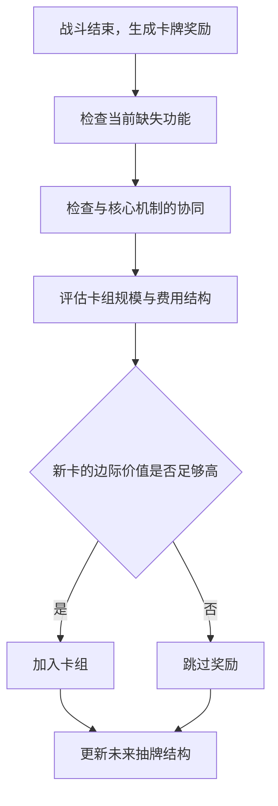

# 未来抽牌质量与构筑收敛：卡组规模、抽取概率与奖励边际价值

> 系列：游戏系统的共同语言
>
> 日期：2026-08-04
>
> 状态：可发布
>
> 核心问题：卡组构筑游戏为什么必须允许玩家拒绝奖励，以及一张单独很强的卡为什么可能让整套卡组变弱？

[系列目录](../blog.html)

玩家击败一场战斗后，面前出现三张奖励卡。

其中一张拥有更高稀有度、更大的伤害数字和更华丽的描述。它单独看起来明显强于卡组中的基础牌。

玩家拿走它，卡组总战力似乎应该上升。

但几场战斗之后，情况却可能变得更差：

- 需要防御时总是抽不到防御；
- 核心组合牌很少同时出现；
- 手里经常塞着费用过高的卡；
- 关键引擎启动得越来越慢；
- 每张新牌都“有用”，整套卡组却越来越不稳定。

这不是玩家对卡牌强度判断错误，也不一定是随机数特别差。

更常见的原因是：玩家得到了一项新能力，同时降低了未来抽到正确行动的概率。

卡组不是一个装满能力的仓库。

它是一种决定玩家未来能够做什么的概率结构。

## 先说结论：评价新卡时，应该看它如何改变未来手牌

**未来抽牌质量（即“下一手好不好”）**：卡组在后续回合中，以可接受概率提供当前局面所需行动组合的能力。

这里的“质量”不是指单张卡有多强。

它需要同时考虑：

- 能否及时抽到；
- 抽到后是否付得起费用；
- 是否与同一手牌中的其他卡兼容；
- 是否解决当前敌人提出的问题；
- 是否会挤占更重要卡牌的抽取机会；
- 是否让卡组更接近明确的运行结构。

因此，卡牌奖励的真实问题不是：

> 这张牌强不强？

而是：

> 加入它以后，我下一轮抽牌会变得更好吗？

## 卡组既是能力列表，也是概率分布

在普通角色扮演游戏中，学会一个新技能通常不会妨碍旧技能出现。

玩家打开技能栏，已经学会的技能仍然在那里。

卡组构筑游戏不同。

玩家虽然拥有全部卡牌，但每回合只能使用抽到的有限手牌。

这意味着卡组同时承担两个职责：

1. 记录玩家拥有哪些行动。
2. 决定这些行动以什么频率出现。

加入一张卡会产生至少四种变化：

| 变化 | 可能收益 | 可能代价 |
|---|---|---|
| 增加新行动 | 获得新的攻击、防御或资源能力 | 旧行动出现频率降低 |
| 增加协同组件 | 形成新的组合 | 组件可能无法同时抽到 |
| 增加卡组规模 | 提高功能覆盖 | 核心循环变慢 |
| 改变费用结构 | 获得高价值大牌 | 手牌更容易出现费用冲突 |

因此，卡牌奖励不是普通物品奖励。

玩家每拿一张牌，都在修改未来所有回合的行动概率。

## 一个简单例子：强卡是怎样被卡组稀释的

**卡组稀释（即“好牌被挤远”）**：加入新的低相关卡牌后，核心牌或核心组合在有限抽牌窗口中出现概率下降的现象。

假设玩家有一套十张牌的卡组，其中只有一张关键防御牌，每回合抽五张。

在不考虑额外抽牌、保留和检索的简化情况下：

| 卡组状态 | 首轮抽到关键防御牌的概率 |
|---|---:|
| 10张牌，其中1张关键牌 | 50% |
| 加入5张无关牌，共15张 | 约33.3% |

玩家没有删除关键牌。

关键牌也没有被削弱。

但由于其他牌增加，它在需要时出现的概率已经明显下降。

如果核心机制需要两张不同卡牌同时出现，稀释会更加明显。

| 卡组状态 | 首轮五张牌同时包含两张指定组件的概率 |
|---|---:|
| 10张牌 | 约22.2% |
| 15张牌 | 约9.5% |

这个例子并不是通用平衡公式。

实际结果还会受到以下因素影响：

- 每回合抽牌数；
- 弃牌堆何时洗回；
- 卡牌是否保留；
- 是否可以检索；
- 是否存在预见或整理牌序；
- 卡牌能否消耗；
- 战斗通常持续多少回合。

但它说明了一个基础事实：

> 增加能力和提高能力可用性，是两件不同的事。

## 一张牌的价值必须看“边际变化”

**构筑边际价值（即“加进来以后多了什么”）**：一张卡相对于当前卡组，而不是相对于空白环境所提供的实际增量。

同一张牌在不同卡组中的价值可能完全不同。

例如，一张“造成中等伤害并施加中毒”的卡：

- 在没有中毒协同的卡组里，可能只是普通攻击；
- 在拥有毒层数倍增效果的卡组里，可能是核心启动器；
- 在已经拥有大量中毒牌的卡组里，可能只是重复组件；
- 在缺乏即时防御的卡组里，即使协同很好，也可能无法解决当前生存问题；
- 在能量紧张的卡组里，费用可能使它无法被合理打出。

因此，评价一张卡至少需要检查五个维度。

### 1. 功能价值

它是否补足当前缺失的能力：

- 单体伤害；
- 群体处理；
- 持续防御；
- 爆发防御；
- 抽牌；
- 能量；
- 状态解除；
- 长期成长；
- 终结能力。

### 2. 协同价值

它是否强化当前已经形成的机制：

- 状态叠加；
- 弃牌；
- 消耗；
- 生成临时卡；
- 多次攻击；
- 护甲保留；
- 费用变化；
- 特定标签。

### 3. 概率成本

它是否降低关键牌和关键组合的出现频率。

### 4. 行动经济成本

它是否会制造：

- 费用过高；
- 手牌堵塞；
- 需要额外准备回合；
- 与其他高费卡竞争能量；
- 抽到却无法打出的无效手牌。

### 5. 路线与时间价值

当前单局还剩多少调整机会：

- 是否还有商店可以删牌；
- 是否还能升级；
- 下一个Boss测试什么；
- 是否有足够战斗让新机制成型；
- 当前生命是否允许继续投资长期构筑。

单独强大的卡牌，不一定拥有足够高的构筑边际价值。

## “跳过奖励”是一种主动成长

很多游戏会把跳过奖励设计成不完整选择：

- 没有补偿；
- 按钮很小；
- 默认焦点在选牌上；
- 玩家会觉得不拿就是浪费。

但在卡组构筑游戏中，跳过并不等于没有成长。

**负空间成长（即“什么都不拿也能变强”）**：通过拒绝低相关奖励、删除弱卡或避免无效扩张，提高已有系统稳定性的成长方式。

玩家跳过一张牌时，保留了：

- 当前卡组规模；
- 核心牌出现率；
- 费用结构；
- 现有协同比例；
- 未来删除机会；
- 构筑方向的清晰度。

因此，一个完整的奖励决策应该允许：

“跳过”必须是系统承认的正式选择，而不是玩家对奖励界面的拒绝操作。

## 构筑收敛不是无脑追求最小卡组

**构筑收敛（即“越打越像一套牌”）**：玩家通过加牌、跳过、删除、升级、遗物和路线选择，让卡组逐渐围绕少数明确机制运行，同时减少不相关内容。

构筑收敛通常会经历几个阶段：

### 初始阶段：功能不完整

初始套牌通常具备最基础的攻击和防御，但效率低、方向不明确。

玩家首先需要解决生存问题。

### 识别阶段：发现候选核心

奖励、遗物或角色能力开始暗示可能的构筑方向。

玩家还不能立刻把全部资源押在一个组合上。

### 收敛阶段：提高相关组件比例

玩家开始：

- 选择与核心机制有关的牌；
- 跳过无关奖励；
- 删除效率较低的基础牌；
- 升级关键组件；
- 选择能提供调整机会的路线。

### 验证阶段：面对不同敌人测试

卡组需要证明自己不仅能在理想牌序下运作，还能处理：

- 多目标；
- 高爆发；
- 持久战；
- 状态干扰；
- 卡牌污染；
- 资源封锁；
- Boss阶段变化。

### 完成阶段：形成稳定但仍有弹性的结构

成熟构筑应该拥有明确核心，同时保留最低限度的功能覆盖。

因此，构筑收敛不等于：

> 牌越少越好。

过薄的卡组也可能出现问题：

- 缺少群体处理；
- 被状态牌或诅咒污染；
- 面对特定敌人没有替代方案；
- 核心组件被封锁后完全停机；
- 无限循环过度依赖单一条件；
- 长期成长不足。

真正目标不是最小卡组，而是最少的无关内容。

## 构筑需要核心，也需要功能覆盖

**功能覆盖（即“至少要能处理这些问题”）**：卡组面对预期敌人机制时，拥有最低限度应对手段的能力范围。

一个构筑可能拥有极高爆发，却没有防御。

也可能拥有稳定防御，却无法在敌人持续强化前结束战斗。

还可能拥有完整组合，但启动速度太慢。

设计敌人时，可以把每种遭遇视为一项构筑压力测试：

| 遭遇类型 | 主要测试 |
|---|---|
| 高爆发敌人 | 首轮防御和即时响应 |
| 多目标敌人 | 群体处理和目标分配 |
| 持续成长敌人 | 伤害成长与终结速度 |
| 高频小伤害 | 持续防御和减伤结构 |
| 状态污染敌人 | 抽牌稳定性和清理能力 |
| 反制高频出牌 | 单卡效率和行动节制 |
| 长期Boss战 | 资源循环和可持续性 |

敌人不应该只增加生命和攻击。

它们应当暴露构筑缺口。

但这种压力测试也不能在终局突然宣布某个构筑完全无效。

如果Boss会严重限制：

- 中毒；
- 多次攻击；
- 无限循环；
- 护甲；
- 召唤；
- 能量获取；

相关风险应该提前通过普通敌人、精英、路线信息或Boss预览逐步出现。

## 路线选择也是卡组编辑

地图路线不只是决定玩家下一场打谁。

不同节点提供的是不同类型的构筑机会：

| 节点 | 主要价值 |
|---|---|
| 普通战斗 | 获得卡牌选择和货币 |
| 精英 | 高风险换取高价值遗物 |
| 商店 | 买牌、删牌、购买消耗品 |
| 营地 | 恢复生命或升级核心牌 |
| 事件 | 以不确定代价调整卡组或资源 |
| 宝箱 | 获得不增加卡组规模的遗物 |
| 特殊挑战 | 获取稀有成长或规则变化 |

因此，路线选择真正回答的是：

> 当前构筑最缺少哪一种调整机会？

一套牌卡组过大，可能更需要商店的删除机会，而不是继续进行普通战斗。

核心牌尚未升级，可能更需要营地。

卡组强度足够但缺少规则型增益，可能值得挑战精英。

路线和卡组不是两个独立系统。

路线决定玩家还能以什么方式修改未来抽牌质量。

## 随机性应该制造适应，而不是替代决策

卡组构筑式 Roguelike 必然包含随机性：

- 抽牌顺序；
- 奖励候选；
- 商店商品；
- 路线；
- 敌人组合；
- 事件；
- 遗物。

问题不在于是否随机，而在于玩家是否拥有管理随机性的工具。

**随机性控制（即“运气不好时还能做什么”）**：玩家通过构筑和战斗决策降低不利随机结果影响的能力。

常见工具包括：

- 增加抽牌；
- 检索指定类型；
- 预见和调整牌序；
- 保留卡牌；
- 弃牌重抽；
- 消耗低价值牌；
- 缩小卡组；
- 增加能量；
- 携带消耗品；
- 选择替代路线；
- 为关键机制准备冗余组件。

好的随机性会改变最优行动。

坏的随机性会取消行动空间。

例如：

- “这一回合没有抽到核心牌，因此需要使用临时防御过渡”是适应问题；
- “这一回合没有抽到唯一防御牌，因此必定死亡”通常是构筑或系统容错不足。

## 奖励系统不能完全迎合，也不能完全无视构筑

卡牌奖励存在两个相反风险。

### 完全迎合当前构筑

系统不断提供玩家最需要的同类牌。

结果是：

- 每局快速形成同一套路；
- 早期选择自动决定全部后续奖励；
- 玩家不需要适应；
- 发现构筑的乐趣变成系统配牌。

### 完全不考虑功能覆盖

奖励完全随机，长期不给出：

- 基础防御；
- 抽牌；
- 能量；
- 伤害成长；
- 必要状态组件。

结果是部分单局在很早阶段就失去形成有效结构的可能。

更稳健的奖励生成可以同时使用：

- 角色牌池；
- 稀有度；
- 区域进度；
- 当前标签；
- 功能缺口；
- 重复限制；
- 保底机制；
- 适度的反向选项；
- 玩家仍可选择跳过。

系统可以提高相关机会，但不应替玩家完成构筑。

## 失败应该能够被解释

单局失败后，玩家很容易说：

> 我只是没抽到牌。

有时这是真的。

但更有价值的复盘需要区分：

- 卡组过度膨胀；
- 关键牌数量不足；
- 防御覆盖不足；
- 费用曲线过高；
- 抽牌能力不足；
- 路线过于保守，成长不够；
- 精英挑战过多，生命被提前消耗；
- 金钱没有及时用于删牌或购买；
- 药剂和消耗品没有使用；
- Boss机制理解错误；
- 战斗中的牌序处理失误。

失败界面可以展示：

- 最终卡组规模；
- 核心牌平均出现周期；
- 无效手牌次数；
- 平均每回合能量浪费；
- 最大单回合伤害；
- 平均防御；
- 主要生命损失来源；
- 未使用消耗品；
- 关键路线选择；
- 本局加牌、跳过和删牌记录。

这些数据不应直接宣布“正确答案”。

它们的作用是帮助玩家形成下一局假设：

> 我不一定需要更强的攻击牌，可能需要更小的卡组和更稳定的抽牌。

## 与相近类型的边界

| 类型 | 卡组形成时间 | 主要随机性 | 核心决策 |
|---|---|---|---|
| 卡组构筑式 Roguelike | 单局过程中 | 抽牌、奖励、路线和事件 | 让临时卡组逐步收敛 |
| 集换式卡牌游戏 | 对局开始前 | 抽牌和匹配环境 | 预先构建稳定牌库 |
| 固定卡组关卡游戏 | 关卡前调整 | 对局抽牌 | 用已有收藏解决关卡 |
| 普通 Roguelike | 单局过程中 | 地图、装备、技能和敌人 | 组合多类临时资源 |
| 自动战斗游戏 | 回合或阶段间 | 单位刷新和装备 | 阵容、经济和站位 |

卡组构筑式 Roguelike 的独特之处是：

> 战斗奖励会持续修改后续战斗中行动出现的概率。

玩家不是只在变强。

玩家在不断重写自己的未来回合。

## 常见设计失败

### 获得新卡永远是正收益

玩家无需考虑抽牌概率，奖励选择失去长期代价。

### 跳过奖励没有价值

系统迫使卡组不断膨胀，构筑无法真正收敛。

### 核心机制依赖唯一稀有卡

没有抽到该卡时，整个角色缺乏可运行方向。

### 卡组越小越无条件强

敌人污染牌、功能覆盖和长期战斗无法对极薄卡组形成有效约束。

### 奖励完全迎合当前标签

每局都形成同一套标准答案。

### 奖励完全不提供基础功能

随机性在构筑形成前就决定单局是否可行。

### 敌人只增加数值

战斗无法测试不同构筑维度。

### Boss突然封锁整套构筑

玩家在终局才发现此前全部投资无效。

### 卡牌文本与执行顺序不一致

玩家无法预测抽牌、触发、消耗和状态结算。

### 失败只能被解释成运气

游戏没有提供构筑规模、抽取率、费用和资源使用方面的复盘信息。

## 我的设计检查表：奖励是真的增强，还是只增加内容

设计卡组构筑循环时，我会检查：

1. 卡组是否被系统明确视为概率分布，而不仅是卡牌列表？
2. 玩家能否随时查看抽牌堆、弃牌堆和消耗区？
3. 奖励界面是否允许方便地查看当前卡组？
4. 跳过奖励是否是正式且有价值的选择？
5. 删除卡牌是否拥有清楚的机会成本？
6. 卡牌升级是否能提供不增加卡组规模的成长？
7. 新卡是否需要同时评估功能、协同、费用和概率成本？
8. 构筑是否能够逐步收敛，而不是无限叠加机制？
9. 系统是否避免让构筑完全依赖唯一稀有卡？
10. 过薄卡组是否仍会面对状态污染和功能覆盖压力？
11. 奖励生成是否在迎合与完全随机之间保持适度距离？
12. 玩家是否拥有抽牌、检索、保留或牌序控制手段？
13. 路线是否提供不同类型的构筑调整机会？
14. 普通敌人、精英和Boss是否测试不同构筑维度？
15. Boss反制机制是否提前出现过可学习信号？
16. 卡牌文本是否与实际执行顺序一致？
17. 单局失败是否能被复盘为构筑、路线、资源或执行问题？
18. 局外成长是否主要扩展内容空间，而不是永久提高基础数值？
19. 高频出牌构筑是否不会被冗长动画惩罚？
20. 玩家下一次面对奖励时，是否真的需要思考“不拿会不会更强”？

卡组构筑游戏最重要的成长，不是把更多强卡放进牌库。

而是让玩家逐渐理解：

- 自己真正依赖什么；
- 哪些牌只是在占用抽牌机会；
- 哪些功能虽然不华丽，却维持了整套卡组的稳定；
- 哪些奖励应该拒绝；
- 哪条路线能让构筑继续收敛。

一套成熟卡组并不一定拥有最多能力。

它应该在需要的时候，更稳定地提供正确能力。

## 术语对照

| 正式术语 | 文中通俗称呼 |
|---|---|
| 未来抽牌质量 | 下一手好不好 |
| 卡组稀释 | 好牌被挤远 |
| 构筑边际价值 | 加进来以后多了什么 |
| 负空间成长 | 什么都不拿也能变强 |
| 构筑收敛 | 越打越像一套牌 |
| 功能覆盖 | 至少要能处理这些问题 |
| 随机性控制 | 运气不好时还能做什么 |

---

## 内部资料依据

本文主要基于以下材料整理：

- `game-designs/游戏设计范式记录：卡组构筑式 Roguelike 游戏中受限抽取、构筑收敛与“选择—战斗—重组—风险升级”的单局演化循环.md`
- `blogs/README.md`
- `blogs/publication.v1.json`

本文是对卡组构筑式 Roguelike 设计范式的个人综述。文中的抽牌概率示例采用简化条件，仅用于解释卡组规模如何影响关键组件出现机会，不是具体游戏的平衡结论。不同作品可以通过额外抽牌、检索、保留、消耗、牌序控制和特殊洗牌规则改变这些关系。