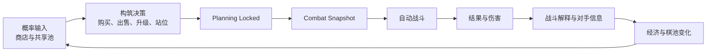

# 构筑与验证分离：自走棋的共享棋池、经济资本与自动战斗

> 系列：游戏系统的共同语言
>
> 日期：2026-08-12
>
> 状态：可发布
>
> 核心问题：当玩家无法在战斗中直接纠正单位行为时，自走棋怎样让商店、经济、阵容和站位决策形成足够可信、可解释且能够持续调整的竞技循环？

[系列目录](../blog.html)

自走棋最容易产生一种误解：

> 玩家只是买几个单位，把它们放到棋盘上，然后看 AI 自己打。

如果只看战斗阶段，这个描述似乎没有错。

但真正玩上一段时间后，玩家会发现，自己最重要的决定往往发生在战斗开始之前：

- 这张棋现在该不该买；
- 要不要为了它跌破利息线；
- 已经有两张同名棋，还要不要继续追第三张；
- 对手也在玩同一套阵容，继续追牌是否值得；
- 当前应该刷新商店，还是先升级人口；
- 一套中期过渡阵容应该继续强化，还是开始为后期转型腾位置；
- 核心输出应该放在角落，还是为了防刺客主动换位；
- 候补席已经满了，哪一条未来路线应该被放弃。

战斗开始之后，玩家反而基本失去了即时纠错能力。

这意味着自走棋的主要策略并不发生在“单位正在攻击”的那几秒里。

它发生在此前。

## 先说结论：自走棋的核心是构造系统，再让系统接受公开验证

**构筑与验证分离（即“先搭好，再看它自己跑”）**：玩家主要在准备阶段配置经济、单位、羁绊、装备与空间关系，战斗阶段则冻结这些决策并让统一规则自动执行，以结果反向验证此前的构筑质量。

整个循环可以压缩为：



这种结构与 RTS 有一个根本差异。

RTS 中：

```text
战略准备
和
战术执行
```

往往同时发生。

玩家看到敌人行动后，可以立即：

- 拉兵；
- 转火；
- 释放技能；
- 撤退；
- 更换目标。

自走棋则有意把二者拆开。

准备阶段结束之后，玩家原则上只能观察此前的决定会产生什么结果。

因此，一场自动战斗真正承担的职责不是：

> 给玩家提供更多即时操作。

而是：

> 成为此前构筑决策的验证器。

如果验证器本身不可理解，这个类型的策略基础也就会一起失效。

## 商店不是商品菜单，而是概率接口

**概率商店（即“只能从系统给出的候选里做选择”）**：玩家不能访问完整单位集合，而是在有限候选中，根据当前等级、供应池、权重和随机状态获得本轮可购买内容。

普通商店可以近似理解为：

```text
我有钱
→ 我选择商品
→ 我购买
```

自走棋商店更接近：

```text
当前等级
+
当前池状态
+
当前商店规则
+
随机流
→
生成有限 Offer

玩家再决定：
买 / 不买 / 刷新 / 锁定
```

因此，玩家不是在完整内容空间里寻找最优答案。

而是在一个不断变化的局部候选集中作决策。

这里产生的第一个重要成本是：

> 刷新不是为了“买到我想要的东西”，而是在支付金币换取一次重新暴露概率空间的机会。

玩家可能花掉大量金币，仍然没有看到目标棋子。

这种失败是否合理，取决于玩家能否理解：

- 当前费用等级的基础出现率；
- 自己的等级；
- 共享池剩余数量；
- 是否有其他玩家正在持有同类单位；
- 商店是否存在锁定和保留；
- 当前阵容是否已经过度依赖某一张低概率棋。

如果这些信息完全不可解释，玩家看到的就只剩：

> 系统不让我抽到。

## 共享棋池把其他玩家变成自己的概率变量

**共享棋子池（即“大家从同一批货里拿东西”）**：某类单位在整场比赛中只有有限副本，玩家购买、商店预留、出售和淘汰会共同改变剩余供应。

这是自走棋与很多单机构筑游戏最重要的区别之一。

假设某个四费单位一共有有限副本。

玩家 A 持有其中大量副本。

那么玩家 B 后续看到它的概率可能下降。

于是：

```text
对手买了什么
```

不仅是在告诉我：

> 他正在组成什么阵容。

还在告诉我：

> 我自己的未来商店空间已经变化。

**间接资源竞争（即“还没打你，我们已经在抢同一份资源”）**因此成立。

多人互动不再只发生在战斗阶段。

它已经提前进入了：

- 商店；
- 候补席；
- 升星；
- 转型；
- 阵容选择。

这也解释了为什么侦察对手具有双重价值。

玩家观察其他棋盘，不只是为了判断：

```text
下一轮应该怎样站位。
```

还在判断：

```text
我这套阵容还有多少供给空间。
```

## 共享池必须维护数量守恒

共享池一旦成为玩法事实，就不能只把它实现成一个“降低概率的黑箱参数”。

底层至少需要能够解释每一份棋子现在位于哪里。

例如：

```text
Pool
→ Shop Reservation
→ Player Bench
→ Player Board
→ Merge Composition
→ 返回 Pool
```

同一个副本在任何时刻都不应该同时属于两个状态。

如果采用三合一升星：

```text
3 个一星
→
1 个二星
```

玩家棋盘上虽然只看到一个实例，但它仍然占用了三份底层供应。

所以：

```text
Unit Instance 数量
```

不能直接等同于：

```text
Pool Copy 数量。
```

一名玩家淘汰后，也不是简单删除他的阵容。

如果设计规定已占用棋子返池，那么：

```text
Player Eliminated
→ 收集其占用的 Pool Copies
→ 原子返还 Shared Pool
→ 其他玩家的未来商店概率发生变化
```

因此淘汰一个玩家不仅减少比赛人数。

它还会重写剩余玩家的概率空间。

## 商店 Offer 需要先预留，再购买

共享池还会带来一个非常具体的并发问题。

假设某张高阶棋只剩最后一个副本。

玩家 A 与玩家 B 几乎同时刷新商店。

如果系统在“购买完成”时才扣减共享池，那么两个人都可能同时看到最后一份单位。

更稳定的流程是：

```text
生成 Shop Offer
→ 从 Shared Pool 临时 Reserve
→ Offer 展示给玩家

玩家购买
→ Reserve 转为 Ownership

玩家刷新或 Offer 过期
→ Reserve 返回 Pool
```

**商店预留（即“展示给你以后，先替你占住这份货”）**让 Offer 本身成为一份可兑现承诺。

这样玩家看到一个合法商品后，不会因为其他玩家稍后先点购买而突然得到：

```text
购买失败：库存已经被别人抢走。
```

如果商店支持 Lock，那么锁定的 Offer 还应继续占用对应预留。

否则所谓“锁商店”只是 UI 保留，底层供应却已经被其他玩家重新消费。

## 棋子价值不是一个固定数字

同一个单位在不同状态下，价值可以差很多。

第一次看到某个单位：

```text
它是一张候选。
```

已经拥有两个一星，再看到第三个：

```text
它可能立即触发二星。
```

当前差一个关键羁绊：

```text
它可能让整个阵容跨过阈值。
```

自己的候补席已经满：

```text
它即使很强，也可能没有实际容纳空间。
```

对手有三个人正在追同一阵容：

```text
它所在路线的未来供应风险更高。
```

因此：

**状态依赖价值（即“同一张棋在不同局面不是同一个价”）**：单位的真实构筑价值需要同时考虑当前持有数量、羁绊、经济、候补席、供应竞争、阵容阶段和未来转型计划。

这也是为什么简单的：

```text
UnitPower = 100
```

无法真正表示一张棋是否值得买。

玩家真正支付的不是只有显示价格。

还可能同时支付：

- 候补席空间；
- 利息损失；
- 转型承诺；
- 装备承诺；
- 阵容位置；
- 未来刷新预算。

## 合成把随机积累转换成确定成长

**合成进度（即“随机抽到的东西终于变成确定战力”）**：玩家通过多次获得相同单位，把分散的概率事件逐渐转换成明确的星级提升。

例如：

```text
第一个单位
→ 获得这个能力

第二个单位
→ 只是积累

第三个单位
→ 突然触发二星
```

这会让第三个副本的边际价值远高于第一个。

合成系统因此承担了一项很重要的职责：

> 把多次不确定的商店结果累积成可以被玩家预期的确定性成长节点。

但合成也会反过来扩大承诺。

玩家已经持有：

```text
5 / 9
```

个三星所需副本时，很容易继续投入更多刷新。

即使其他玩家已经严重挤压池子。

这会形成典型的沉没成本问题：

> 我已经追这么久了，现在换阵容是不是更亏？

一个好的自走棋系统需要允许玩家真正“转型”，而不是让所有中期投入都变成不可退出的路线锁定。

## 候补席实际上保存的是未来选择权

候补席很容易被视为：

> 棋盘放不下的单位暂时丢这里。

但它实际上是一项非常重要的经济资源。

**候补席选择权（即“我愿意花空间保留哪些未来可能”）**：玩家用有限格位保存尚未投入当前阵容、但可能用于升星、转型或未来羁绊的单位。

候补席中可能同时存在：

- 当前阵容的升星副本；
- 新阵容的过渡组件；
- 临时卡牌；
- 高费核心；
- 针对特定对手的替补；
- 尚未决定是否保留的机会。

因此 Bench Full 并不是单纯的 UI 麻烦。

它会迫使玩家做真正的战略清理：

```text
卖掉什么
→
意味着主动关闭哪一条未来路线？
```

如果候补席无限大，玩家可以几乎无成本保存所有可能构筑。

随机商店带来的不确定性就会明显下降。

如果候补席过小，玩家又会被迫过早放弃合理转型。

它应该制造机会成本，而不是制造库存整理劳动。

## 金币既是货币，也是资本

自走棋经济最有辨识度的地方之一，是金币经常同时拥有两种价值：

```text
现在可以花掉的资源
```

和：

```text
保留下来以后可以产生更多收入的资本。
```

**经济资本（即“钱不花也在产生价值”）**：存量金币不仅用于支付当前行为，还可能通过利息规则影响未来收入。

于是玩家每花一笔钱，都可能存在两层成本。

例如当前：

```text
19 金币
```

购买一个 2 金币单位后：

```text
17 金币
```

表面成本：

```text
2 金币
```

但如果这使玩家跌破一个利息阈值，真实机会成本还可能包含：

```text
下一轮少获得的利息。
```

所以：

```text
显示价格
≠
有效成本
```

这会让很多简单行为突然拥有时间维度。

一张只值 2 金币的棋，可能因为：

- 能立刻形成二星；
- 能维持连胜；
- 能避免本轮大量掉血；

而值得牺牲利息。

另一张同样 2 金币的棋，如果只是：

```text
也许以后有用
```

就可能不值得破坏经济线。

## 当前战力和未来经济必须长期互相竞争

金币通常同时可以用于：

- 买棋；
- 刷新；
- 升人口；
- 保留利息。

因此玩家始终在处理：

```text
Spend Now
vs
Invest for Later
```

### 买棋

提升当前或未来阵容质量。

### 刷新

支付确定货币，换取新的随机机会。

### 升人口

购买：

- 更多上场单位容量；
- 更高阵容复杂度；
- 某些设计中的高费用棋出现概率。

### 存钱

牺牲当前强化，扩大未来资本。

真正优秀的经济循环，不应该让其中任何一个长期成为唯一正确答案。

如果“永远存到最大利息再动”几乎没有风险，前期战斗失去意义。

如果“不花钱就一定掉大量生命”，经济运营又会消失。

## 生命值也可以成为经济资源

连败补偿会进一步制造一种特殊交换：

```text
当前生命
→
未来经济
```

**生命—经济转换（即“用血量换发育时间”）**：玩家允许自己暂时维持较弱阵容，以承受生命损失为代价积累更好的经济、商店或转型条件。

这个机制可以给落后玩家保留恢复路线。

但它不能变成无风险套利。

如果：

```text
故意连败
→
稳定获得额外经济
→
中期必然翻盘
```

那么前期赢下战斗反而可能成为错误选择。

因此连败收益需要与：

- 玩家剩余生命；
- 后期单轮伤害；
- 连败收益上限；
- 中期提速；

共同设计。

核心不是禁止玩家“卖血”。

而是：

> 血量应该是一笔真实有限的资本，而不是免费的利息启动器。

## 升人口同时购买容量和未来概率

人口等级经常被简化理解成：

```text
+1 个上场位置
```

实际上它通常连接两套系统。

第一：

```text
Board Capacity
```

决定阵容最多可以同时运行多少单位。

第二：

```text
Shop Distribution
```

影响不同费用档位进入商店的概率。

所以升级人口实际同时购买了：

- 当前或下一轮的部署容量；
- 更高阵容复杂度；
- 未来商店内容结构。

这使人口升级天然与刷新发生竞争。

玩家可能拥有一个尚未成型的低费阵容。

此时继续刷新，可以追求：

```text
当前阵容质量。
```

把金币投入人口，则是在购买：

```text
未来阵容空间。
```

这也是自走棋经济系统能够产生长期规划的重要原因。

## 阵容不是棋子强度的简单求和

假设：

```text
Unit A = 100
Unit B = 100
Unit C = 100
```

并不意味着：

```text
TeamPower = 300
```

阵容的实际战斗表现还受到：

- 星级；
- 装备；
- 羁绊；
- 前后排结构；
- 技能时序；
- 控制；
- 攻击距离；
- 站位；
- 当前对手；

共同影响。

一个个体较弱的棋子，可能因为补齐关键羁绊，使整个阵容产生新的规则效果。

因此：

**组合强度（即“队伍强不强不能只把数值相加”）**：阵容价值来源于单位、协同、空间和对手之间的关系，而不是各单位孤立 Power 的简单总和。

这也是为什么隐藏一个“准确战力值”往往很危险。

一旦 UI 暗示：

```text
你的战力 = 13426
对手战力 = 12781
```

玩家自然会期待：

> 我应该赢。

但站位、目标选择和技能时机可能让结果完全不同。

内部可以拥有强度估计用于测试。

它不应伪装成完整胜负答案。

## 站位是自走棋的第二条策略轴

如果商店和经济解决的是：

```text
我拥有谁。
```

站位解决的是：

```text
这些单位怎样进入战斗。
```

两名玩家可以拥有完全相同的：

- 棋子；
- 星级；
- 装备；
- 羁绊；

但因为位置不同产生完全不同结果。

站位会改变：

- 首次接敌对象；
- 移动路径；
- 前排承伤；
- 后排安全；
- 刺客切入；
- AoE 覆盖；
- 控制时机；
- Mana 获取速度；
- 技能释放顺序。

于是自走棋并不是纯粹的商店 RNG。

空间部署是另一条不可替代的策略轴。

## 对手信息让“固定最优站位”难以长期成立

如果玩家一直面对同一个固定敌人，就可能逐渐找到一个静态最优阵型。

多人轮换对手后，站位问题会持续变化。

对手可能：

- 刺客很多；
- AoE 很强；
- 前排极厚；
- 控制链很长；
- 核心单位集中在一侧。

于是玩家需要执行：

```text
Scouting
→
Interpretation
→
Formation Adaptation
```

前一轮失败，也可以成为下一轮的输入。

例如：

```text
核心输出在角落
→
刺客直接切入
→
Carry 未释放技能就死亡
```

下一轮玩家把核心移到中后排，再用辅助单位包围。

如果第二次战斗结果明显变化，玩家会获得一种很关键的反馈：

> 战斗结果确实是我此前站位决策的后果。

这正是自动战斗系统需要维护的策略可信度。

## 准备结束需要真正冻结阵容

**准备冻结边界（即“倒计时结束后这套阵容正式交卷”）**：Planning 阶段结束时，把当前合法阵容、羁绊、装备、位置和随机种子原子化为战斗快照，后续 Combat 不再直接读取持续变化的玩家状态。

倒计时最后一刻可能同时发生：

- 买棋；
- 卖棋；
- 合成；
- 移动；
- 装备；
- 升级人口。

如果 Combat 直接读取实时 PlayerState，就可能出现：

```text
BoardSystem 看到了新位置
TraitSystem 还是旧羁绊
CombatSystem 已经开始
ShopSystem 又触发了合成
```

不同系统看到的是不同版本的阵容。

因此更稳定的过程是：

```text
Planning Timer End
→
停止新的构筑修改
→
验证阵容合法性
→
重新计算派生状态
→
创建 CombatSnapshot
→
启动 Combat
```

**战斗快照（即“这一轮真正拿去比赛的阵容版本”）**可以包含：

- 单位状态；
- 星级；
- 装备；
- 羁绊；
- 位置；
- 玩家等级；
- Combat Seed。

战斗阶段只读取这一份不可变输入。

这是非常典型的事务提交边界。

## 战斗中的死亡不能删除玩家拥有的棋子

这里也有一个很重要的状态所有权问题。

战斗中的单位只是：

```text
Combat Unit。
```

它从玩家永久阵容快照生成。

因此：

```text
Combat Unit 死亡
```

只代表：

> 这一轮战斗里它已经不能继续行动。

不能代表：

> 玩家永久失去了这张棋。

否则 Combat System 就会越权修改 Roster。

合理的状态关系更接近：

```text
Player Roster
→
Combat Snapshot
→
Combat Runtime Unit
```

战斗结束后：

```text
丢弃 Combat Runtime
```

玩家原本的阵容仍然存在。

这种“权威状态与临时模拟状态分离”的思想，同样可以迁移到：

- 回合模拟；
- Replay；
- Ghost 对战；
- 离线战斗验证；
- 服务器重放。

## 自动战斗必须尽量可复现

玩家不能在战斗中人工修复 AI 决策。

因此随机和 AI 行为必须受到比普通实时战斗更严格的可解释要求。

可以把基础目标定义为：

```text
相同 CombatSnapshot
+
相同 CombatSeed
+
相同规则版本
≈
相同 CombatResult
```

这里并不要求完全取消随机。

仍然可以存在：

- 暴击；
- 闪避；
- 随机目标；
- 概率触发。

但随机应该：

- 来自明确随机流；
- 能够 Replay；
- 不依赖渲染帧；
- 能被调试工具追踪。

否则新增一个无关视觉随机效果，都可能因为共享 RNG 调用顺序改变整场战斗结果。

## AI 不能偷偷替玩家做到“理论最优”

自动战斗还有另一种风险：

设计者为了让单位显得聪明，偷偷写入：

```text
群体技能永远命中最多敌人的完美位置
```

或者：

```text
刺客总能找到理论价值最高的后排。
```

如果这些规则没有在游戏语义中明确，玩家会很难预测战斗。

好的 AI 并不等于：

> 永远执行全局最优动作。

它更应该：

- 使用明确目标规则；
- 遵守搜索范围；
- 遵守 Taunt；
- 遵守移动限制；
- 遵守技能条件；
- 在相同状态下尽量稳定。

玩家需要学习的是：

> 这个单位会怎样行动。

而不是猜测：

> 设计者这次希望它有多聪明。

## 战斗结果必须能够解释失败原因

一场自动战斗结束时，玩家真正需要的不是只有：

```text
失败
-8 HP
```

更有价值的结果是：

```text
核心输出总伤害正常
前排存活时间正常
但 Carry 在首次施法前被刺客接触
```

于是下一轮玩家知道：

> 问题主要不是阵容数值，而是 Formation。

**战斗可解释性（即“输了以后知道该改哪里”）**：系统能够把自动模拟结果映射回玩家此前可以控制的构筑、经济和站位决定。

可用的调试或复盘数据包括：

- 单位总输出；
- 承伤；
- 首次施法时间；
- 目标选择；
- 移动路线；
- 控制覆盖；
- 核心单位死亡时间；
- 羁绊贡献；
- 当前对手阵型。

这里的目标不是给玩家一个：

```text
正确答案按钮。
```

而是让结果能够形成新的决策输入。

## 战斗是验证器，所以结果反馈必须进入下一轮

一轮完整自走棋循环应该是：

```text
商店给出概率输入
→
玩家形成阵容
→
自动战斗
→
战斗暴露问题
→
观察其他玩家
→
修改经济、阵容或站位
→
再次验证
```

战斗不是构筑的终点。

它是下一次构筑的传感器。

这也是自走棋比纯粹“挂机看数值”更有策略深度的关键。

如果玩家输了，却无法知道：

- 是数值不够；
- 羁绊错误；
- 星级不足；
- 站位被克制；
- 商店路线已经被多人竞争；
- 经济投入时机错误；

那么下一轮就无法产生新的假设。

玩家只能继续：

> 再刷几次看看。

策略很快就会退化成随机等待。

## 淘汰会重新塑造整场比赛

玩家淘汰通常首先改变：

```text
剩余竞争者数量。
```

在共享棋池中，它还会改变：

```text
全局供应结构。
```

例如：

```text
一名 Warrior 玩家被淘汰
→
大量 Warrior 副本返池
→
仍然坚持 Warrior 的其他玩家
突然更容易完成升星
```

这意味着比赛后期的概率空间不是简单越来越贫瘠。

它可能因为玩家退出重新松动。

因此，自走棋的宏观演化不只是：

```text
所有玩家都越来越强。
```

还包括：

```text
玩家逐步淘汰
→
供应重新分配
→
构筑路线重新估值
```

这是共享有限资源系统非常有价值的一层动态。

## 与卡组构筑式 Roguelike 的区别

二者都包含：

- 有限随机候选；
- 构筑收敛；
- 拒绝低价值选项；
- 概率管理；
- 单局成长。

但核心概率对象不同。

卡组构筑中：

```text
我拿了哪些牌
→
修改我自己的未来抽牌概率。
```

共享棋池自走棋中：

```text
我和别人拿了哪些单位
→
共同修改大家未来的商店供应。
```

一个主要是：

**内部概率结构。**

另一个额外加入：

**多人共享供应竞争。**

同时，自走棋还拥有明显的：

```text
Planning
→
Resolution
```

结构和空间部署问题。

因此不能把它简单理解为：

> 卡组构筑换成棋子。

## 与 RTS 和战术 RPG 的区别

RTS 中，玩家通常持续拥有单位控制权。

战斗结果的一部分来自：

- 操作；
- 转火；
- 移动；
- 技能；
- 即时反应。

自走棋则主动降低 Combat Phase 的人工控制，把策略密度压到准备阶段。

回合制战术 RPG 虽然也是离散阶段，但玩家通常逐单位决定：

```text
谁移动
谁攻击
目标是谁
```

自走棋的单位执行权则主要交给统一 Combat AI。

因此其设计重点会转向：

- 预先构筑；
- 规则透明；
- AI 可解释；
- 概率管理；
- 站位预判。

## 这套设计不能简单复制到所有自动战斗游戏

“自动战斗”本身并不足以构成自走棋。

如果一个游戏：

- 没有有限准备阶段；
- 没有持续构筑；
- 没有经济取舍；
- 没有阵容空间；
- 没有多人或环境信息适应；
- 战斗结果也不会影响下一轮构筑；

它更可能只是：

```text
自动执行模块。
```

共享棋池也不是所有自走棋都必须采用的绝对规则。

有些设计可以使用：

- 独立玩家池；
- 部分共享；
- 动态补充；
- 其他稀缺机制。

值得迁移的不是固定的“全局棋子数量表”。

而是：

> 如果多人竞争同一个有限内容空间，其他人的选择应该怎样成为自己的决策变量。

## 常见设计失败

### 商店只显示结果，不解释概率来源

玩家长期刷不到目标棋，却无法判断是等级、池枯竭还是单纯随机。

### 共享池存在，但玩家几乎感知不到

侦察无法帮助构筑决策，所谓多人竞争只停留在隐藏后台。

### 商店展示时不预留副本

最后一个单位可能同时出现在多个玩家商店，并在购买时产生冲突。

### 所有路线都可以无成本长期保留

候补席过大，玩家不必真正放弃未来选择。

### 利息收益几乎没有战斗风险

固定存钱路线成为唯一经济答案。

### 连败奖励过强

故意输掉前期成为稳定最优策略。

### 阵容强度只按单位 Power 相加

羁绊、站位、控制和对手关系无法真正影响结果。

### Combat 直接读取实时阵容

Planning 最后一刻的修改导致羁绊、位置和战斗状态版本不一致。

### AI 为了“聪明”使用隐藏全局最优规则

玩家无法预测自动行为。

### 战斗随机依赖渲染帧或共享随机流

同一阵容无法稳定 Replay，调试结果不可复现。

### Combat Unit 死亡直接修改玩家 Roster

临时战斗状态越权污染永久阵容。

### 玩家淘汰时部分棋子没有正确返池

整个后续商店概率空间被悄然破坏。

### 战斗结束只显示胜负

玩家无法知道应该调整阵容、经济还是站位。

## 我的自走棋设计检查表

1. Planning Phase 与 Combat Phase 是否拥有明确边界？
2. 战斗开始前是否会原子生成 CombatSnapshot？
3. Combat 是否只读取冻结输入，而不是实时玩家状态？
4. 商店概率是否由明确规则产生？
5. 共享池存在时，单位数量是否真正守恒？
6. Shop Offer 是否会预留有限池副本？
7. 锁定商店是否同时保留对应 Pool Reservation？
8. 升星后的 UnitInstance 是否仍能追踪真实 SourceCopyCount？
9. 淘汰玩家的池副本是否能够完整、原子返还？
10. 玩家能否理解等级怎样改变费用档位概率？
11. 侦察对手是否真的能帮助判断供应竞争？
12. Bench 是否制造合理机会成本，而不是纯整理负担？
13. 金币是否同时存在当前消费与未来资本价值？
14. 利息阈值是否让 Effective Cost 可以被玩家理解？
15. 连胜和连败是否都存在真实代价？
16. 升人口是否同时影响容量和未来商店结构？
17. 阵容是否存在真正的宽羁绊与深羁绊取舍？
18. 相同阵容通过不同站位能否产生可理解差异？
19. 自动 AI 的目标选择规则是否能够说明？
20. 同一 Snapshot 与 Seed 是否能够稳定 Replay？
21. Combat Random 是否与表现随机隔离？
22. AI 是否避免使用未公开的理论最优目标选择？
23. 战斗复盘是否能解释核心单位的死亡和技能时序？
24. 一轮失败是否能够形成下一轮可行动的调整假设？
25. 调试工具能否解释“为什么一直刷不到这张棋”？
26. 是否存在 Shared Pool Inspector 和 Economy Timeline？
27. Pairing 是否避免明显的连续极端对手重复？
28. Ghost 对战是否使用冻结快照而不是实时玩家状态？
29. 网络重连是否不会重新刷新 Shop 或返还已经消费的金币？
30. 战斗系统是否始终只是验证构筑，而不是偷偷拥有玩家永久状态？

自走棋最有价值的设计思想，并不是：

> 把操作交给 AI。

而是重新分配玩家的决策位置。

玩家不再持续控制：

```text
这个单位下一秒攻击谁。
```

而是提前决定：

```text
我应该拥有什么
愿意为未来支付多少
保留哪些可能
放弃哪些路线
怎样组织空间
如何针对其他玩家
```

随后，系统把这些决定冻结下来，公开运行一次结果。

好的自动战斗不是替玩家思考。

它应该尽量忠实地执行玩家此前构造的系统。

于是，一场失败真正有价值的含义就变成：

```text
这套构筑
在这些规则
面对这个对手
以这个站位
运行以后
暴露了什么问题。
```

玩家据此重新构筑。

再让系统验证一次。

这才是自走棋真正持续运转的核心循环：

> **概率输入 → 构筑决策 → 自动验证 → 信息反馈 → 再构筑。**

## 术语对照

| 正式术语 | 文中通俗称呼 |
|---|---|
| 构筑与验证分离 | 先搭好，再看它自己跑 |
| 概率商店 | 只能从系统给出的候选里做选择 |
| 共享棋子池 | 大家从同一批货里拿东西 |
| 间接资源竞争 | 还没打你，我们已经在抢同一份资源 |
| 商店预留 | 展示给你以后，先替你占住这份货 |
| 状态依赖价值 | 同一张棋在不同局面不是同一个价 |
| 合成进度 | 随机抽到的东西终于变成确定战力 |
| 候补席选择权 | 我愿意花空间保留哪些未来可能 |
| 经济资本 | 钱不花也在产生价值 |
| 生命—经济转换 | 用血量换发育时间 |
| 组合强度 | 队伍强不强不能只把数值相加 |
| 准备冻结边界 | 倒计时结束后这套阵容正式交卷 |
| 战斗快照 | 这一轮真正拿去比赛的阵容版本 |
| 战斗可解释性 | 输了以后知道该改哪里 |

---

## 内部资料依据

本文主要基于以下材料整理：

- `game-designs/自走棋游戏设计范式.md`
- `blogs/README.md`
- `blogs/publication.v1.json`

本文是对自走棋 / Auto Battler 宏观设计范式的个人综述。

文中的共享棋池、三合一升星、利息、连胜连败、人口等级、Ghost、CombatSnapshot 等机制属于常见或可选设计方法，不表示所有自走棋作品都必须采用完全相同的棋池数量、商店概率、经济阈值、合成规则或战斗模型。

尤其需要注意：共享棋池并不是定义自走棋类型的唯一必要条件。本文选择它作为重点，是因为它能够最清楚地展示“其他玩家的构筑行为如何进入自己的概率空间”这一多人策略关系；没有共享池的自走棋仍然可以通过其他稀缺资源、对手信息和构筑约束建立有效竞争。
