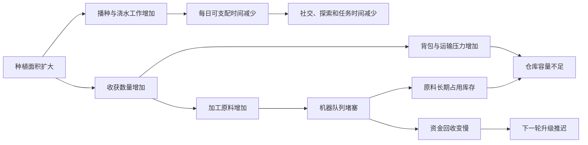

# 劳动瓶颈传播：经营规模扩张中的时间、运输与加工压力

> 系列：游戏系统的共同语言
>
> 日期：2026-08-03
>
> 状态：可发布
>
> 核心问题：经营模拟中的规模扩张为什么不会自动带来更高效率，反而可能让玩家被浇水、收获、运输和加工等重复劳动彻底占满？

[系列目录](../blog.html)
玩家刚开始经营一座农场时，每天要做的事情并不多：

- 给几块土地浇水；

- 收获少量作物；

- 去商店购买种子；

- 和附近居民交谈；

- 剩余时间去钓鱼、采矿或探索。


这段时期虽然资源紧张，但玩家通常拥有相当大的行动自由。

随着农场扩大，情况开始变化。

土地更多了，动物更多了，加工设备也更多了。理论上，这意味着玩家已经取得进步，应该拥有更高的收益和更多选择。

但很多经营游戏会在这个阶段出现相反体验：

- 早上先浇完全部土地，商店已经快关门；

- 收获后背包装不下，需要反复往返仓库；

- 动物产品塞满加工机器，第二批原料只能等待；

- 扩建了更多土地，却没有时间参加节庆或推进关系；

- 每天收入提高了，玩家能够自由支配的时间却越来越少。


农场看起来更成功，玩家却比开局时更像被工作困住。

这不是单独某项操作过慢，而是整个经营系统发生了瓶颈传播。

## 先说结论：规模成长必须改变劳动组织，而不能只增加劳动对象

**劳动瓶颈传播（即“活越堆越多”）**：生产规模扩大后，新增工作量超过现有时间、体力、运输、加工或储存能力，并沿生产链扩散到其他系统的现象。

增加一块田地，不只是增加一块田地。

它还可能增加：

- 播种时间；

- 每日浇水；

- 肥料消耗；

- 收获操作；

- 背包占用；

- 仓库空间；

- 运输次数；

- 加工队列；

- 出售和分类操作；

- 下一季重新整理土地的成本。


如果这些环节没有同步升级，规模增长只会把玩家每天必须完成的固定劳动不断放大。

因此，经营游戏中的成长不应该只是：

> 从照顾十块田，变成照顾一百块田。

更合理的成长是：

> 从亲手照顾十块田，逐步学会组织一百块田。

## 每一天都是一笔有限预算

**日常劳动预算（即“今天能做多少事”）**：玩家在一天内能够使用的时间、体力、工具能力、移动距离和注意力总量。

生活经营游戏通常同时限制时间与体力。

二者看起来相似，却不能完全合并。

|活动|时间消耗|体力消耗|
|---|--:|--:|
|浇水、耕地、砍树|中|高|
|与居民交谈|中|低|
|等待加工完成|高|低|
|采矿和战斗|高|高|
|整理仓库|中|低|
|参加节庆|高|通常较低|
|吃饭恢复体力|少量|恢复体力|

时间回答的是：

> 今天还能安排多少活动？

体力回答的是：

> 玩家还能承担多少高强度劳动？

即使玩家拥有无限食物，可以不断恢复体力，商店仍可能关门，NPC仍会离开，节庆仍会结束，一天也仍然会过去。

反过来，玩家即使还有很多时间，也可能因为体力耗尽而无法继续采矿或耕作。

好的劳动预算会迫使玩家选择：

- 今天优先赚钱，还是维护关系；

- 趁下雨去采矿，还是处理加工积压；

- 扩种高收益作物，还是保留自由时间；

- 提前准备节庆物品，还是追求当日现金流。


坏的劳动预算则会让所有“选择”退化为固定顺序：

> 先做完全部必做工作，剩下多少时间再说。

当必做工作占满一天，经营策略也就消失了。

## 瓶颈不是一个点，而是一条传播链

假设玩家把种植面积扩大了一倍。

表面变化只有土地增加，实际影响可能沿系统逐步传播：



某个环节堵塞后，并不会只影响该环节。

加工机器不足，意味着原料不能及时变现；原料不能及时变现，又会占用仓库；仓库拥堵会增加整理和搬运；资金回收延迟则会推迟下一次工具或设施升级。

最终，玩家可能拥有大量资产，却缺乏现金、时间和空间。

这就是瓶颈传播最重要的特征：

> 局部容量不足，会把压力转移到相邻系统。

## 延迟收益让生产规模不能只看售价

**生产生命周期（即“从投入到回款”）**：资源从购入、培育、收获、加工到最终产生可使用收益所经历的完整过程。

一项作物的真实价值并不只是售价。

它至少还受到以下因素影响：

- 种子价格；

- 生长天数；

- 是否需要每日浇水；

- 是否可以重复收获；

- 当前季节剩余天数；

- 每格土地的占用周期；

- 收获需要的操作量；

- 是否依赖加工设备；

- 加工时间；

- 仓库和背包占用；

- 能否用于任务、礼物或烹饪；

- 资金何时真正回到玩家手中。


两种作物可能具有相同最终利润，但对劳动预算的影响完全不同。

|作物类型|特征|适合的经营状态|
|---|---|---|
|短周期作物|回款快、重复播种多|早期缺现金|
|长周期作物|回款慢、日常维护稳定|已有资金缓冲|
|再生作物|前期投入高、后续少播种|中长期经营|
|高价值加工原料|利润高、占用机器|加工容量充足|
|低维护作物|单位利润较低、劳动少|时间成为主要瓶颈|
|跨季或温室作物|生产稳定|已建立长期设施|

如果游戏只向玩家显示单价，玩家无法判断真正的生产成本。

经营决策会变成查攻略寻找“最高售价作物”，而不是分析自己的农场当前缺什么。

## 规模扩张应该主动制造压力

经营系统不必阻止玩家扩大规模。

相反，扩张带来的压力正是产生规划的来源。

新增土地、动物和设备可以增加收益潜力，同时增加：

- 固定日常工作；

- 维护需求；

- 资源补给；

- 运输距离；

- 队列管理；

- 空间争夺；

- 失败风险。


问题不在于是否产生压力，而在于玩家是否拥有明确的解决手段。

例如：

|瓶颈|可用升级|
|---|---|
|浇水时间过长|洒水器、工具范围升级、雨水设施|
|动物照料过多|自动喂食、自动收集、牧场布局|
|运输频繁|就近仓库、传送、手推车、批量搬运|
|加工积压|更多机器、更快配方、加工建筑|
|库存混乱|自动分类、搜索、附近容器读取|
|土地不足|扩建、温室、高密度作物|
|现金流过慢|直售比例调整、短周期产品、贷款|
|玩家时间不足|雇员、助手、生产模板|

压力与解决方案之间形成了经营成长。

没有压力，自动化没有价值。

没有解决方案，扩张只是在惩罚玩家。

## 自动化的职责是转移决策层级

**劳动压缩（即“少做重复事”）**：玩家证明自己掌握某段重复流程后，通过工具、设施或组织升级降低其操作成本。

早期手动浇水通常是有价值的。

它让玩家理解：

- 每块土地都需要维护；

- 水和体力是有限资源；

- 种植规模会产生劳动成本；

- 天气会改变日程安排。


但如果游戏到了第二年，玩家仍必须逐格完成完全相同的操作，这段劳动就不再提供新信息。

劳动压缩并不意味着删除经营玩法。

它应该把玩家的决策从低层操作提升到更高层级：

```text
早期
→ 决定今天给哪几块地浇水

中期
→ 决定洒水器覆盖什么区域

后期
→ 决定哪类生产值得占用自动化容量
```

玩家不再逐项执行劳动，但仍然需要决定：

- 自动化设施放在哪里；

- 哪些流程值得优先自动化；

- 自动化需要多少资金和空间；

- 是否保留少量高价值手工生产；

- 腾出的时间要用于探索、社交还是新产业。


高质量自动化减少执行负担，却保留资源配置。

低质量自动化则可能走向两个极端。

### 自动化太弱

玩家规模越大，重复操作越多，最终每天只是在完成维护清单。

### 自动化太强

所有生产自动运行，玩家只需睡觉等待收入，经营系统失去新的决策。

合理自动化应当消除已经解决的问题，同时暴露更高层的新问题。

## 加工链的本质是容量分配

加工通常能提高商品价值，但不能设计成无条件优于直接出售。

否则玩家每次收获后只有唯一正确答案：

> 所有东西都放进机器。

真正有意义的加工决策需要考虑：

- 当前是否急需现金；

- 机器是否有空余容量；

- 加工需要多长时间；

- 商品品质是否影响产出；

- 原料是否有其他用途；

- 是否要为任务或节庆保留；

- 下一批原料何时到来；

- 仓库是否有空间等待。


**加工容量（即“机器能吃下多少”）**：一定时间内加工设施能够接收和完成的原料总量。

当原料产量超过机器能吃下的量时，瓶颈会向前传播：

```text
机器排队
→ 原料滞留
→ 仓库拥堵
→ 资金回收延迟
→ 下一轮投资推迟
```

玩家此时有多种合理选择：

- 增加加工设备；

- 直接出售低品质原料；

- 改种低产高价值作物；

- 减少种植面积；

- 错开不同作物的收获日；

- 将部分资源用于烹饪、礼物或任务；

- 建立专门的生产区域。


加工系统由此不再是简单的价值乘数，而是生产结构的调节器。

## 日历会把瓶颈变成有截止日期的问题

**日历节律（即“季节的钟”）**：由日、周、季节和年份共同构成，并统一调度生产、商店、居民、天气、节庆和任务的权威时间结构。

经营游戏中的瓶颈之所以紧张，是因为它们通常不能无限期处理。

玩家需要面对：

- 作物是否来得及在季末成熟；

- 建筑能否在冬季前完工；

- 节庆物品是否能提前加工；

- 商店今天是否营业；

- NPC事件是否只在特定日期发生；

- 委托是否即将到期；

- 动物过冬设施是否准备完成。


季节的钟让“以后再做”具有真实代价。

例如，一个需要十天成熟的作物，在季节只剩六天时，理论利润再高也没有意义。

因此，种子界面应该至少显示：

- 可种植季节；

- 生长天数；

- 再生周期；

- 当前季节剩余天数；

- 预计收获次数；

- 季末处理规则。


如果系统拥有截止日期，却不向玩家提供足够信息，失败就不是规划失误，而是界面隐瞒。

## 社交并不是生产系统之外的休闲菜单

生活模拟经常把社交与经营分成两个互不关联的系统：

- 农场用于赚钱；

- NPC用于送礼和看剧情。


这种拆分会让玩家在时间紧张时自然放弃社交，因为它无法解决任何经营问题。

更紧密的系统可以让关系影响：

- 商店折扣；

- 新种子；

- 配方；

- 工具升级；

- 建筑施工；

- 区域开放；

- 自动化助手；

- 社区项目；

- 结局评价。


农场产出也可以进入社交系统：

- 作为礼物；

- 参与节庆；

- 完成居民委托；

- 修复公共设施；

- 推进角色事件；

- 提供家庭生活资源。


这样，社交不再只是“放弃赚钱去看剧情”。

它也是一种长期投资。

玩家需要判断：

> 今天少收一点资源，去帮助某个居民，是否会换来未来的新能力或新机会？

## 季节变化必须改变经营结构

如果季节只更换地表颜色和背景音乐，它就没有真正参与经营。

有意义的季节变化可以影响：

- 可种植作物；

- 天气频率；

- 日照时长；

- 水资源；

- 鱼类和采集物；

- 动物需求；

- 节庆；

- NPC日程；

- 商店商品；

- 区域开放；

- 加工和储备策略。


玩家进入新季节后，应该重新回答：

- 这一季的主要收入来源是什么；

- 哪些旧生产设施暂时失去作用；

- 是否需要准备冬季库存；

- 哪些居民和任务在本季更重要；

- 应该扩张，还是利用淡季升级基础设施。


季节因此成为一次经营结构重组，而不是视觉换装。

## “最优解”不应该吞掉所有生活方式

经营游戏很容易被经济系统推向单一最优路线：

- 只种利润最高的作物；

- 全部原料进入同一种机器；

- 永远不参加低收益活动；

- 社交只服务于必要解锁；

- 装饰和生活选择被视为浪费。


这会让游戏拥有大量内容，却只剩下一条有效玩法。

长期目标应该允许多种生活方式贡献进度，例如：

- 经济收入；

- 农场建设；

- 社区复兴；

- 居民关系；

- 收藏；
    -烹饪；

- 动物培育；

- 探索；

- 节庆表现；

- 环境改善。


不同路线不必完全等价，但不能让其中大部分长期处于明显无效状态。

否则，玩家不是在经营自己的生活，而是在执行一份已经被算出的最优生产表。

## 常见设计失败

### 农场越大，逐格操作越多

规模增长与劳动量线性绑定，却没有工具升级、批量操作或自动化。

### 作物只按售价比较

忽略生长周期、季节剩余时间、加工容量和劳动成本。

### 所有加工都无条件增值

直接出售失去意义，加工变成必做机械步骤。

### 仓库管理占满游戏时间

物品系统缺少分类、搜索、自动堆叠和附近容器读取。

### 日历只是界面数字

作物、NPC、商店、任务和节庆各自拥有不一致的时间规则。

### 季节只改变画面

经营结构、资源和NPC生活没有发生变化。

### 关系系统退化成每日送礼

没有共同事件、任务、区域变化和长期互助。

### 自动化移除所有决策

玩家后期只需等待机器产出，不再需要调整生产结构。

### 主线依赖唯一季节物品

玩家错过后只能无意义地等待整年，且没有替代路径。

### 时间规则不一致

对话、菜单、制作、室内活动和场景切换是否耗时没有统一原则。

## 与相近类型的边界

|类型|主要限制|规模成长|时间结构|
|---|---|---|---|
|农场生活模拟|每日时间、体力、季节|工具、设施、自动化、关系|日、周、季节、年份|
|工厂自动化|物流吞吐与机器比例|生产线复制和优化|多为连续运行|
|城市建设|土地、财政、人口与服务|城区和治理扩张|长周期模拟|
|生存游戏|饥饿、危险和资源缺口|生存能力及基地|时间多服务于威胁|
|餐厅经营|顾客波次、座位和制作队列|员工、厨房和菜单|营业日或关卡制|

这些类型都可能出现瓶颈传播，但关注点不同。

农场生活模拟的独特之处在于，它同时要求生产链与个人日程共用同一天。

玩家不是一个脱离世界的管理者。

他本人也是生产系统中最早、最有限的一台机器。

## 我的设计检查表：扩张是在成长，还是只在加班

设计经营循环时，我会检查：

1. 每日时间和体力是否形成不同的限制？

2. 玩家能否清楚知道今天有哪些时间敏感事项？

3. 扩大土地、动物或设备后，会增加哪些下游工作？

4. 系统是否能识别当前真正的瓶颈？

5. 工具升级是否减少操作次数，而不只是增加数值？

6. 中后期是否提供批量操作和自动化？

7. 自动化是否仍然需要空间、资金和生产结构决策？

8. 直售与加工是否各有合理场景？

9. 加工容量不足是否会真实影响仓库和现金流？

10. 作物信息是否支持跨季规划？

11. 季末是否提供清晰风险预警？

12. NPC关系是否能与生产、建设或区域解锁连接？

13. 社交、探索和装饰是否能参与长期目标？

14. 不同收入路线是否具有基本可行性？

15. 日历是否是所有系统共享的权威时间源？

16. 日终结算顺序是否确定且可重复验证？

17. 玩家规模扩大后，自由支配时间是否逐渐恢复？

18. 玩家是否从执行劳动成长为组织劳动？

19. 是否存在只有查攻略才能避免的整季损失？

20. 后期玩家仍然需要做新的决策，还是只需等待产出？


经营游戏的成长，不应该表现为玩家每天承担更多相同工作。

真正有意义的规模成长，是玩家逐渐学会：

- 哪些工作值得亲自完成；

- 哪些工作应该交给工具；

- 哪些流程需要扩大容量；

- 哪些产业应该主动缩减；

- 如何在生产、关系、探索和生活之间分配有限时间。


一座成熟农场的价值，不只是它每天能生产多少商品。

还在于它是否终于允许玩家拥有自己的生活。

## 术语对照

|正式术语|文中通俗称呼|
|---|---|
|劳动瓶颈传播|活越堆越多|
|日常劳动预算|今天能做多少事|
|生产生命周期|从投入到回款|
|劳动压缩|少做重复事|
|加工容量|机器能吃下多少|
|日历节律|季节的钟|

---

## 内部资料依据

本文主要基于以下材料整理：

- `game-designs/游戏设计范式记录：农场经营与生活模拟游戏中日历节律、劳动预算与“生产—社交—建设—季节演化”的长期生活循环.md`

- `blogs/README.md`


本文是对农场经营与生活模拟设计范式的个人综述。文中的劳动预算、自动化、加工容量和长期评价结构属于可选设计方法，不表示所有农场或生活模拟作品都必须采用相同时间长度、季节规则、经济模型或失败强度。