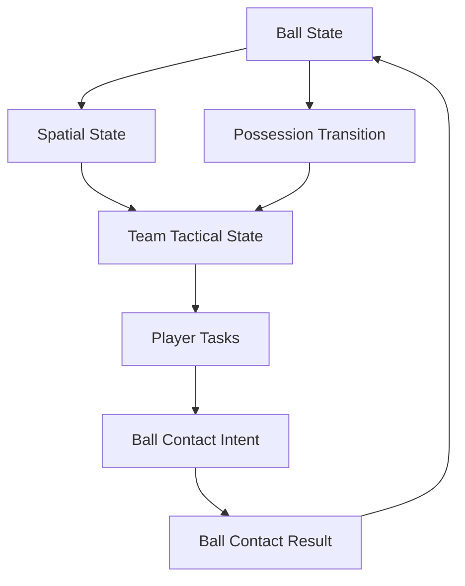

# 共享球权与团队空间：足球模拟中的未来接球点、无球跑位与攻守转换

> 系列：游戏系统的共同语言
>
> 日期：2026-09-08
>
> 状态：草稿
>
> 核心问题：足球模拟怎样让一个独立运动的球、22 名球员和两套团队战术持续形成协调关系，而不是把比赛退化成“当前持球人 + 21 个追球 AI”？
>
> 关键词：Football Simulation、Possession、Lead Target、Off-ball Movement、Team Phase

[系列目录](../blog.html)

玩家控制中场球员。

右侧边锋正在向前高速跑动。

如果系统简单执行：

```text
Pass Target
=
Receiver.CurrentPosition，
```

等足球真正飞到那里时，

边锋早已经离开。

一个看起来正确的传球指令，

因此会变成：

```text
把球踢到队友身后。
```

这暴露了足球模拟最基本的问题：

> 足球不是把一颗球“交给某个角色”，而是把球送进未来某个时间点的共享空间。

与此同时，

如果其余 21 名球员都独立执行：

```text
靠近足球
```

整个比赛很快会变成儿童足球：

```text
所有人挤成一团。
```

真正的足球需要：

- 有人持宽度；

- 有人拉深度；

- 有人保护身后；

- 有人制造传球线；

- 有人压迫；

- 有人封路线。


所以足球模拟真正需要组织的是：

```text
Ball
+
Space
+
Team Phase。
```

## 先说结论：球必须独立存在，球队围绕球和空间持续切换职责

**共享球权（后文简称“球从来不真正属于谁，只是有人暂时更容易控制它”）**：足球始终是独立权威实体，所谓 Possession 是球员与球之间的控制关系，而不是对象所有权。

核心结构可以表示为：



球的真实事实是：

```text
Position
Velocity
Spin
LastTouch。
```

球员是否“控球”则可以是一种：

```text
Control Confidence。
```

## Ball Owner 是一个危险的过度简化

低成本实现可能写：

```text
currentBallOwner = PlayerA
```

然后：

```text
Ball Transform
吸附 PlayerA Foot。
```

这种模型很容易破坏：

- 截球；

- 偏转；

- 抢断；

- 头球；

- 争顶；

- Loose Ball。


更合理的是：

```text
足球始终独立运动。
```

Player A 只是在当前状态下：

```text
最有可能成功进行下一次合法触球。
```

当球离脚稍远，

Opponent B 仍然可以先触到。

真正具有强 Owner 语义的特殊状态可以是：

```text
GoalkeeperHeld。
```

而不是所有带球状态。

## Contested Ball 不需要立刻宣布归属

两名球员同时冲向 Loose Ball。

系统没必要在距离达到某个阈值时：

```text
Possession = A。
```

更自然的是：

```text
Ball 保持 Free
A 有 Touch Candidate
B 也有 Touch Candidate

谁首先完成合法 Contact
谁真正改变球。
```

这种结构会让：

```text
争抢
二点球
偏转
```

自然出现。

## 所有足球动作最终都可以归约到 Ball Contact

传球、射门、解围、头球、抢断，

表现完全不同。

底层却共享一个事实：

> **某个身体部位在某个时间窗口对足球施加了作用。**

因此可以存在：

**Ball Contact Resolver（后文简称“真正决定这一脚最终把球踢成什么样”）**。

玩家提交：

```text
IntendedTarget
DesiredVelocity
DesiredHeight
ContactType
Power。
```

Resolver 再考虑：

- 球的位置；

- 身体姿态；

- Contact Window；

- 压力；

- 技术；

- 平衡；

- Ball 当前速度；


形成：

```text
ResultVelocity
ResultSpin
AccuracyError。
```

这使：

```text
Intent
≠
Outcome。
```

玩家想把球传到某处。

角色能不能真的做到，

由动作和能力共同决定。

## 传球目标应该是一块未来空间

**Lead Target（后文简称“球到的时候队友应该在哪里”）**：根据 Receiver 的运动、计划跑位、Ball Travel Time 和防守者位置预测未来接球位置。

例如：

```text
Receiver Current Position = P0
Velocity = V
Estimated Ball Travel Time = t
```

真正目标更接近：

```text
P(t)
```

而不是：

```text
P0。
```

这尤其解释了：

### Through Ball

直塞不是：

```text
普通传球
速度更快
精度更低。
```

它真正改变的是 Target Semantics：

> **不再传给队友，而是传到一块队友有机会比防守者更早到达的未来空间。**

## Assisted Pass 和 Manual Pass 不应该拥有两套物理

Full Assist 可以：

```text
帮玩家选 Receiver
帮玩家算 Lead Point。
```

Semi Assist：

```text
玩家决定大方向
系统微调落点。
```

Manual：

```text
玩家直接指定空间。
```

但最终都应该进入：

```text
PassIntent
→
BallContactResolver。
```

而不是：

```text
Assist 模式自动传送到队友
Manual 模式才真的模拟球。
```

否则不同操作模式根本不是同一个比赛规则。

## 接球也不是自动吸附

足球到达 Receiver 附近，

真正发生的是：

```text
First Touch。
```

结果可能是：

- 完美停球；

- 顺势向前卸球；

- 向侧面停球；

- 弹远；

- 被抢。


所以接球同样是一项主动技能。

**First Touch（后文简称“第一脚决定下一步还有没有球权”）**可以读取：

```text
IncomingVelocity
BallHeight
BodyOrientation
Pressure
Technique
PreferredFoot
DesiredNextAction。
```

优秀球员甚至不会：

```text
把球停死。
```

而是第一脚就：

```text
把球带离逼抢方向。
```

## One-Touch 是没有完整进入“控球状态”的新 Contact

高速配合中：

```text
Incoming Pass
→
Contact Window
→
Direct Pass。
```

球员甚至没有必要：

```text
先成为 Ball Owner
再执行一次 Pass。
```

这也是独立 Ball State 模型的优势。

球只是连续经历：

```text
Contact
→
Contact
→
Contact。
```

## 团队 AI 需要显式 Team Phase

同一个左后卫：

控球时可能：

```text
前插。
```

失球的一瞬间：

```text
立刻回撤
或参与 Counter Press。
```

所以单个 Agent 只拥有：

```text
自己的位置和最近目标
```

是不够的。

**Team Phase（后文简称“整支球队当前共同处于哪个攻守阶段”）**可以至少包括：

```text
In Possession
Out of Possession
Attacking Transition
Defensive Transition
Set Piece Attack
Set Piece Defense。
```

再进一步细分：

```text
Build Up
Final Third
High Press
Mid Block
Low Block。
```

Team Phase 为 11 名球员提供共同上下文。

## 球权转换必须触发整支球队角色翻转

当 Possession 明显改变：

原进攻方：

```text
In Possession
→
Defensive Transition。
```

原防守方：

```text
Out of Possession
→
Attacking Transition。
```

这不应该等待：

```text
11 个 Agent
各自几秒后才发现球已经丢了。
```

Team Coordinator 应该正式提交一次：

```text
Possession Transition。
```

## 攻守转换是足球最重要的短周期状态之一

稳定控球阶段，

一支球队通常已经：

```text
展开宽度
拉高位置。
```

一旦失球：

```text
防守结构还没回来。
```

这是最脆弱的几秒。

对手同样处于：

```text
刚抢到球
尚未完全展开。
```

所以双方同时面临：

- Counter Press；

- Counter Attack；

- Recovery。


转换阶段真正的价值在于：

> **旧阵型还没有来得及变成新阵型。**

## Counter Press 不是“最近的人一起追球”

如果所有近处球员直接：

```text
MoveTo(Ball)
```

会把队形撕碎。

真正的 Counter Press 还要考虑：

- 谁压 Ball Carrier；

- 谁封第一脚传球；

- 谁保护后场；

- 谁防反击出口。


所以无球 AI 不是：

```text
没有球时的备用逻辑。
```

它恰恰决定了足球的大部分时间。

## 无球价值应该能被系统看到

足球中，最重要的动作经常没有触球：

```text
拉开防线
吸引后卫
进入空当
保护传球线
补位。
```

如果 AI Utility 只奖励：

```text
谁更靠近 Ball，
```

球队会天然收缩。

更合理的 Spatial Evaluation 需要看：

```text
Passing Lane
Dangerous Space
Width
Depth
Defensive Cover
Numerical Advantage。
```

球员真正争夺的是：

```text
未来几秒哪些空间可用。
```

## 与俱乐部经营模拟的边界

足球经理或俱乐部经营主要处理：

- 招募；

- 财务；

- 训练；

- 长期阵容。


本文只处理：

```text
比赛真正运行起来以后
22 名球员怎样共同反应。
```

一个是组织经营。

一个是实时团队模拟。

## 与单角色动作游戏的边界

玩家虽然通常只直接控制一名球员，

但比赛的真正对象始终是：

```text
Team。
```

如果 21 名非控制角色只是跟随脚本，

球队就不会形成：

```text
真实的无球空间。
```

## 常见失败

### Ball 直接吸附当前 Owner

截球和二点球失真。

### Pass 目标是 Receiver 当前坐标

移动接球永远落后。

### 所有无球队员靠近 Ball

球队失去阵型。

### Possession Change 等每个 AI 自己发现

攻守转换迟钝。

### Receive 自动吸附

First Touch 能力失去意义。

### Assist 模式和 Manual 模式使用不同球规则

竞技技能无法迁移。

## 我的足球模拟检查表

1. Ball 是否是独立权威实体？

2. Possession 是否是派生关系？

3. Contested Ball 是否允许真正保持 Free？

4. 所有主要足球动作是否进入统一 Contact Resolver？

5. Intent 与 Result 是否分离？

6. Pass Target 是否支持未来空间？

7. Through Ball 是否真正面向 Lead Space？

8. First Touch 是否有自己的质量判定？

9. One-Touch 是否不依赖“先吸附球”？

10. TeamPhase 是否显式存在？

11. Possession Transition 是否同时改变两支球队？

12. Counter Press 是否不是所有人追球？

13. AI 是否评价无球空间？

14. Width / Depth 是否属于球队结构？

15. 当前实现是否真的在模拟一支球队，而不只是 22 个 Agent？


足球模拟最终并不是：

```text
22 个 AI
围着一个球。
```

而是：

> **一个独立球体不断重写空间价值，而两支球队持续根据这个共享事实重组自己的职责。**

球权改变的一瞬间，

变化的不是：

```text
currentOwner。
```

而是：

```text
整个团队的行动语言。
```

## 术语对照

|正式术语|通俗称呼|
|---|---|
|共享球权|球不真正属于谁，只是有人暂时更容易控制|
|Ball Contact|真正改变足球状态的一次触球|
|Lead Target|球到的时候队友应该在哪里|
|First Touch|第一脚决定下一步还有没有球权|
|Team Phase|整支球队当前共同处于哪个阶段|
|Possession Transition|攻守职责整体翻转|
|Off-ball Space|没有球的人正在争夺的未来空间|

## 内部资料依据

- `game-designs/足球比赛模拟设计范式.md`

- `game-designs/俱乐部经营模拟类游戏设计范式.md`

- `blogs/README.md`

- `blogs/publication.v1.json`


本文为足球实时比赛模拟的通用设计抽象，不代表某款商业足球游戏的内部实现。

---
