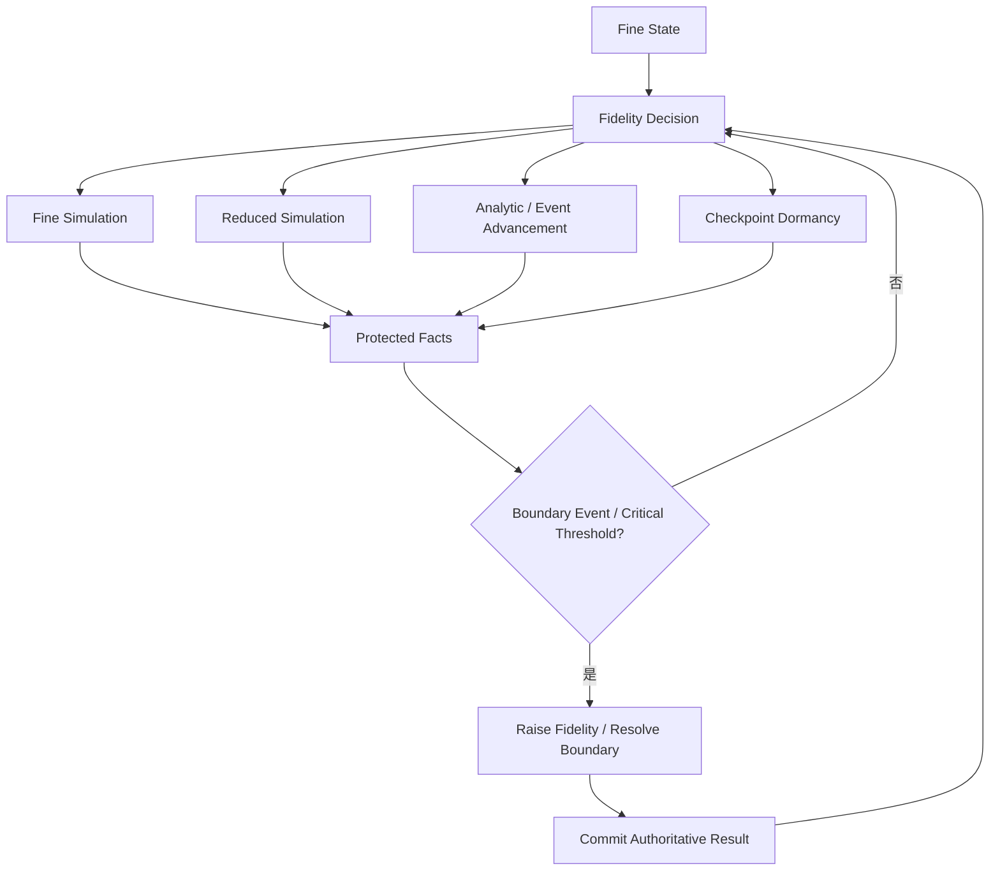
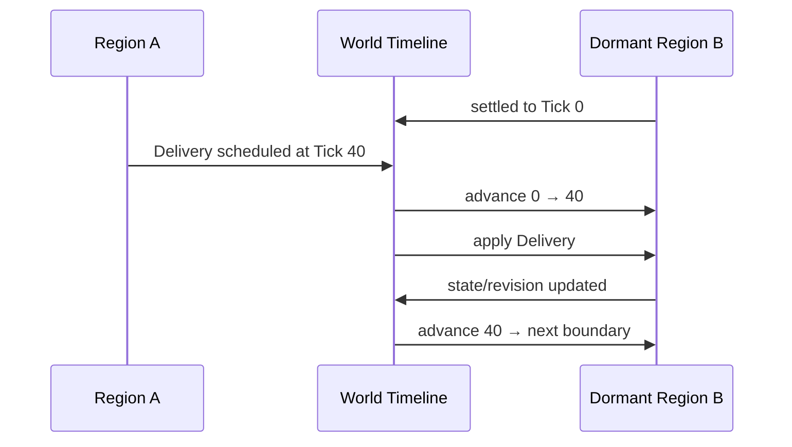

# 后果保持的多精度世界模拟：休眠、粗化与恢复之间的事实边界

> 系列：前沿游戏工程研究
>
> 日期：2026-09-08
>
> 状态：草稿
>
> 核心问题：大型系统世界为了性能把远处区域从精细模拟降级为低频、解析推进甚至休眠以后，怎样保证资源、身份、任务、拓扑和跨区域事件不会因为模拟精度变化而产生不同的玩法结果？
>
> 关键词：World Simulation、Multi-Fidelity、Dormancy、Invariant、Background Simulation、Systemic World

[系列目录](../blog.html)

玩家离开了一座工厂。

镜头已经移动到几十公里外。

从渲染角度看，这座工厂当然没有必要继续：

```text
渲染角色
播放动画
执行完整寻路
更新所有粒子
每帧模拟机器零件。
```

于是系统决定：

```text
远处区域
→
进入低精度模拟。
```

听起来很合理。

假设离开时：

```text
区域 B
时间 = Tick 0

库存：
铁矿 = 0

生产线：
10 单位铁矿
→
1 个零件

区域 A
有一辆运输车
正在向 B 运送 20 单位铁矿。
```

玩家离开以后，

区域 B 被直接按照：

```text
elapsedTime = 100 Tick
```

一次性结算到 Tick 100。

因为 Tick 0 时：

```text
库存 = 0，
```

系统认为：

```text
这 100 Tick
没有发生任何生产。
```

但真实世界中，

运输车应该在：

```text
Tick 40
```

抵达。

如果区域 B 当时仍然精细模拟，

正确世界历史应该是：

```text
Tick 40
收到 20 铁矿

Tick 40～100
生产线开始工作

最终
得到若干零件。
```

现在玩家重新回到工厂。

游戏面临一个很尴尬的问题：

```text
到底应该相信
“远处区域的低成本结算”
```

还是：

```text
“如果这里一直正常运行，本来应该发生的世界历史”？
```

如果两者不同，

玩家会逐渐发现一条非常奇怪的玩法规则：

> **看不看这个地方，会改变这个地方发生什么。**

这不是普通性能误差。

这是世界规则被性能优化偷偷修改了。

## 先说结论：多精度模拟真正需要保持的是玩法后果，而不是所有微观状态

**后果保持的多精度世界模拟（后文简称“算得少一点，但不能改写已经应该成立的世界事实”）**：同一个世界系统允许在不同区域、时间和负载条件下使用不同精度的模拟方法，但精度切换必须明确哪些事实不能改变、哪些量允许近似、哪些事件不能跨越，以及什么时候必须恢复更高精度。

它并不要求：

```text
远处区域
和
镜头附近区域

每一帧都产生完全相同的微观状态。
```

真正要求的是：

```text
谁仍然存在
谁拥有多少资源
哪些交易已经完成
哪些任务已经结束
哪些路径已经关闭
哪些关键阈值已经越过
```

不能因为模拟精度不同而改变。

可以把基本结构压缩成：



关键不是：

```text
有几个 LOD Level。
```

而是：

> **每一个 Level 被允许省略什么，又绝对不能省略什么。**

## 模拟精度和表现加载是两个不同问题

这是最容易被混淆的一层。

假设一个远处区域完全不可见。

渲染系统可以：

```text
不生成 Character Renderer
不加载高精度 Mesh
不播放 Animation
不提交 Particle
不生成 Audio Source。
```

这并不能继续推出：

```text
这个区域的任务停止
物流停止
生态停止
资源关系停止。
```

反过来也一样。

一个位于镜头附近的装饰 NPC，

可能需要：

```text
高表现精度
```

但 Gameplay 上完全不重要。

一笔发生在地图另一端的关键交易，

可能：

```text
完全不可见
```

却必须精确。

因此：

**表现精度（后文简称“玩家现在能看多细”）**

和：

**模拟精度（后文简称“世界规则现在必须算多细”）**

应该是两个决策。

距离和可见性可以成为调度信号。

不能成为玩法正确性的定义。

## 多精度不等于“远处 Tick 慢一点”

最简单的远端优化经常是：

```text
附近
60 Tick/s

中距离
10 Tick/s

远距离
1 Tick/s。
```

这种方案可以降低 CPU。

但它仍然没有回答：

```text
1 秒里发生了多少件不能跳过的事情？
```

假设：

```text
Tick 10
订单创建

Tick 20
通路关闭

Tick 30
运输出发

Tick 40
资源到账

Tick 50
机器完成生产

Tick 60
任务检测库存。
```

如果系统：

```text
Tick 0
直接跳到
Tick 100，
```

就必须知道：

> 中间哪些事件会改变后续计算。

否则：

```text
低频
```

只是：

```text
少算了很多步骤。
```

并不自动等于：

```text
获得了合法的近似结果。
```

## 可以先把世界模拟分成四类精度

具体项目不必使用相同名字。

但至少应该区分不同数学性质的运行方式。

| 模拟层级 | 适合保留的内容 | 主要风险 |
|---|---|---|
| 精细模拟 | 个体行为、局部路径、交互、关键接触 | 成本高 |
| 简化模拟 | 关键个体、区域任务、聚合资源 | 不能丢失唯一身份 |
| 解析 / 事件推进 | 已证明可以按公式结算的过程 | 不能跨越中途依赖变化 |
| 检查点休眠 | 不需要演化或演化已由其他 Owner 承接的状态 | 不能把“没有算”当成“已经正确算完” |

重点不是：

```text
Level 0
Level 1
Level 2
Level 3。
```

重点是：

> 每一层都拥有明确合同。

## 精度合同决定“什么可以丢，什么不能丢”

本文把这类合同称为：

**Fidelity Contract（后文简称“这一层到底允许近似到什么程度”）**：一个可降级系统在进入低成本模拟以前，声明必须精确保留的事实、允许近似的量、禁止跨越的事件边界、最大推进跨度、恢复条件和误差定义。

一个最小合同至少需要回答三类问题。

### 必须精确保留的事实

例如：

- 稳定实体身份；
- 资源账本；
- 所有权；
- 已提交交易；
- 已完成任务；
- 已经发生的唯一事件；
- 会改变后续规则的离散状态。

这些状态可以换表示方式。

但不能换事实。

### 允许近似的量

例如：

- 不参与关键判定的群体分布；
- 装饰性个体的位置；
- 连续环境估计；
- 非关键统计量；
- 视觉模拟结果。

这些状态可以允许误差。

但必须定义：

```text
误差是什么
允许多大。
```

不能只写：

```text
差不多即可。
```

### 不允许跨越的边界

例如：

- 拓扑改变；
- 跨区域物资到达；
- 唯一实体进入 / 离开；
- 关键阈值触发；
- 外部玩家干预；
- 规则版本变化；
- 交易提交。

这些事件一旦发生，

后续世界演化公式可能已经改变。

所以不能：

```text
先按旧条件一路算到底
以后再把事件补进去。
```

## 休眠状态不是“当前场景截图”

一个区域被卸载时，

如果只保存：

```text
当前可见 NPC
当前几个箱子
当前建筑模型
```

然后重新进入时再从这些对象恢复，

这只是：

```text
Scene Persistence。
```

并不等于：

```text
World Continuity。
```

真正需要继续存在的可能包括：

```text
RegionId
LogicalTime
RuleVersion
ProtectedEntityIds
ResourceLedger
TaskStates
AggregatePopulation
PendingBoundaryEvents
UnfinishedTransfers。
```

也就是说：

> **休眠状态保存的应该是继续演化世界所需的事实，而不是离开时画面上有什么。**

## 恢复并不是降级操作的数学逆运算

假设精细世界状态是：

```text
S。
```

我们把它压缩成低精度状态：

```text
C(S)。
```

随后玩家重新接近，

系统执行恢复：

```text
E(C(S))。
```

最理想的幻想是：

```text
E(C(S)) = S。
```

但很多情况下根本没有必要，也不现实。

假设一个区域拥有：

```text
1000 个没有唯一剧情身份的普通居民。
```

降级以后，

系统可能只保存：

```text
不同年龄段人数
职业比例
食物需求
总体健康度。
```

恢复时重新生成的具体居民位置，

几乎不可能与玩家离开那一刻逐个相同。

这完全可以接受。

真正应该要求的是：

```text
I(E(C(S))) = I(S)
```

其中：

**受保护投影 `I`（后文简称“无论怎样降级，这些玩法事实都必须一样”）**：

只抽取真正不能改变的 Gameplay Invariant。

例如：

```text
唯一角色身份
资源总量
任务终态
交易状态
所有权
关键世界关系。
```

恢复以后，

这些事实应该保持一致。

## 允许近似的部分则应该拥有误差预算

假设：

```text
A(S)
```

表示允许近似的一组状态。

可以进一步要求：

```text
distance(
    A(E(C(S))),
    A(S)
)
<= ε
```

这里的：

```text
ε
```

不是统一常数。

每一种近似都需要自己的定义。

例如：

```text
区域人口数量
误差 = 0

平均满意度
误差 <= 2%

装饰性位置分布
允许统计意义接近

连续环境场
允许规定数值误差。
```

如果一个系统连：

```text
误差怎么定义
```

都说不清楚，

它就不适合拿近似结果去决定：

```text
胜负
资源
任务完成
永久资产。
```

## 唯一实体不能被平均掉以后再随机恢复

假设一名 NPC：

```text
名字 = Aria

当前任务：
把医疗物资送往区域 C

持有：
UniqueQuestItem #4021。
```

区域进入聚合模拟以后，

如果系统把她压进：

```text
CourierCount = 12
```

随后恢复时随机生成：

```text
12 个运输员
```

世界从统计上可能仍然：

```text
人数一致。
```

但 Gameplay 事实已经被破坏。

所以：

**受保护实体（后文简称“即使进入粗模拟，它仍然必须是它自己”）**

不能直接消失在匿名聚合量里。

真正可以聚合的是：

```text
允许身份丢失的群体状态。
```

而不是所有实体。

## “资源总量一样”同样不一定足够

假设：

```text
A 区域有 100 铁矿

B 区域有 0 铁矿。
```

一笔运输准备：

```text
A → B
20 铁矿。
```

如果粗模拟只保证：

```text
全世界铁矿总量 = 100，
```

但恢复以后变成：

```text
A = 100
B = 0，
```

守恒成立。

Gameplay 仍然错误。

因为：

```text
资源位置
```

同样可能是受保护事实。

所以 Invariant 不能只定义：

```text
总量守恒。
```

还需要根据 Gameplay 决定：

```text
所有权
位置
承诺
目标
操作身份
```

是否必须保留。

## 跨区域事件必须进入时间轴

回到开头的例子。

区域 B：

```text
Tick 0
进入低精度模拟。
```

区域 A：

```text
Tick 40
产生一个送往 B 的交付事件。
```

错误结算：

```text
B:
Tick 0
→
一次性结算
→
Tick 100

然后：

应用 Tick 40 的交付。
```

这会破坏：

```text
Tick 40～100
```

之间的世界历史。

正确思路更接近：

```text
B
先从 Tick 0
推进到下一个外部边界 Tick 40

↓

应用交付

↓

重新确定状态与公式

↓

再继续推进。
```

可以表示为：



这就是：

**边界事件推进（后文简称“可以跳时间，但不能跳过会改变公式的事情”）**。

## 时间水位比“这帧更新多少”更重要

大型后台模拟更适合让每个区域明确：

```text
我已经可靠结算到哪个逻辑时间？
```

可以称为：

**逻辑时间水位（后文简称“这个区域的世界历史已经确认到哪里”）**。

例如：

```text
Region A
SettledThrough = Tick 120

Region B
SettledThrough = Tick 80

Region C
SettledThrough = Tick 120。
```

如果 A 产生：

```text
Tick 100
送往 B 的边界事件，
```

B 就不能继续从：

```text
80
直接跳到
120
```

而必须首先处理：

```text
Tick 100。
```

这种结构比：

```text
每帧所有区域统一 Update
```

更加适合多精度世界。

因为不同区域可以使用不同结算方式。

但它们仍然共享同一条逻辑时间关系。

## 跨区域转移尤其需要单一事务 Owner

最危险的实现之一是：

```text
区域 A
认为：
我把 20 铁矿发出去了。

区域 B
休眠结算时又认为：
我根据平均输入速率获得了 20 铁矿。
```

如果两套模拟都能独立修改同一笔资源，

最终可能：

```text
生成两份资源。
```

因此：

**跨区域事务（后文简称“一笔东西只能有一个正式来源和一个正式到账点”）**

需要由明确 Owner 负责：

```text
源扣减
Transit
目标到账。
```

区域模拟只消费：

```text
已经合法提交的世界事件。
```

而不是各自猜：

```text
理论上应该收到多少。
```

## 关键阈值不能被粗模拟一脚跨过去

假设一个设施：

```text
Temperature < 100
正常

Temperature >= 100
发生不可逆损坏。
```

粗模拟想一次推进：

```text
80
→
120。
```

如果当前近似模型无法可靠判断：

```text
什么时候越过 100
```

系统不能简单：

```text
先算到 120
→
发现超过
→
再补一次损坏。
```

因为：

```text
损坏发生以后
80～120 之间的生产逻辑
可能已经完全不同。
```

所以：

**关键唤醒边界（后文简称“粗模拟再往前走就可能改变规则，所以必须先停下来算清楚”）**

应该在提交不可逆结果以前触发。

可能的流程是：

```text
Coarse Step
发现即将接近 Threshold

↓

提高 Fidelity

↓

精确求出 Threshold Crossing

↓

提交离散事件

↓

重新选择后续模拟方式。
```

## “看见了再唤醒”通常太晚

很多 Streaming 系统习惯：

```text
玩家靠近
→
唤醒区域。
```

这对表现加载很合理。

对 Gameplay 模拟却不够。

真正需要唤醒的条件还可能包括：

- 外部交易到达；
- 关键任务即将完成；
- 拓扑被修改；
- 受保护 NPC 即将跨区；
- 资源即将越过关键阈值；
- 规则版本发生变化；
- 玩家远程操作了该区域。

因此：

```text
Visibility
```

只是 Wake Trigger 之一。

不是唯一 Trigger。

## 模拟模式切换还需要滞回

假设玩家站在两个区域边界。

每一次轻微移动都可能让：

```text
Region A
Fine → Coarse

下一帧
Coarse → Fine

再下一帧
Fine → Coarse。
```

这会产生：

- 重建成本；
- Cache 抖动；
- 状态反复聚合与展开；
- 可观察差异。

因此：

**模拟滞回（后文简称“不要因为刚刚跨过阈值就马上来回切档”）**

通常需要：

```text
不同进入 / 退出阈值
+
Minimum Residence Time。
```

这和纹理 Streaming、内存预算等系统的 Hysteresis 是同一种控制思想。

但这里还有更严格的一条要求：

> 模式切换本身不能改变玩法结果。

如果：

```text
机器在 Fine 模式
每小时生产 100

Coarse 模式
每小时生产 110，
```

玩家最终会发现：

```text
离开工厂
反而产得更多。
```

性能策略已经变成隐藏玩法策略。

## 性能状态不应该成为玩家可利用的经济变量

这是多精度模拟最值得单独强调的原则之一。

如果：

```text
看着 NPC
和
不看 NPC
```

会让：

```text
工作效率
死亡概率
资源产量
战斗结果
```

长期出现系统性差异，

玩家迟早会学会利用。

例如：

```text
把危险区域移出视野
→
让粗模拟帮自己规避高风险过程。
```

或：

```text
离开工厂
→
解析公式比真实运输更高效。
```

于是：

```text
Distance
Visibility
Performance Budget
```

开始偷偷成为游戏规则。

这通常应该被视为模拟合同失败。

## 有些状态根本不应该被近似

多精度并不意味着：

```text
所有系统都必须拥有 Coarse Mode。
```

例如：

- 玩家永久资产转移；
- 唯一角色死亡；
- 关键剧情结果；
- 排名；
- 交易市场；
- 不可逆地形变化；

如果系统无法提供可信近似，

完全可以选择：

```text
保持精确状态

或

只在事件发生时推进。
```

优化的目标不是：

```text
所有东西都必须降级。
```

而是：

```text
只在有明确误差合同的地方降低成本。
```

## 不知道，就应该返回 Unknown

假设粗模拟预测：

```text
这段时间大概不会跨过任务阈值。
```

但它无法证明。

最危险的实现是：

```text
当作不会跨过
继续提交。
```

更可靠的结果是：

```text
Unknown
→
提高精度。
```

这是一种很重要的基础设施态度：

> **不知道不是失败，假装知道才是。**

同样适用于：

- Solver；
- 静态分析；
- Deadlock Detection；
- AI 评价；
- 资源预测。

只要分析器拥有误判可能，

它就不应该自动获得不可逆裁决权。

## 多精度世界需要区分 Authority 与 Projection

假设一个区域拥有：

```text
真实库存
真实任务状态
真实道路拓扑。
```

运行时可以维护很多派生投影：

```text
区域危险度
预计产出
运输 ETA
人口热力图
AI Offer
地图可达图。
```

这些投影可以采用：

```text
更低频
近似
缓存
增量更新。
```

但它们不能反过来成为第二套 World Authority。

例如：

```text
运输 ETA
预测会收到 20 铁矿
```

不能直接修改：

```text
Inventory += 20。
```

必须等待真正的：

```text
Transfer Commit。
```

这和任何大型系统里的：

```text
Authority
vs
Prediction / View
```

分离属于同一原则。

## 一个逻辑阶段最好先冻结输入，再统一发布结果

当多个系统互相影响时，

多精度模拟还有另一项风险：

```text
A 更新
→
触发 B

B 更新
→
触发 C

C 更新
→
立即重新触发 A

一直递归到
“看起来稳定”。
```

在复杂世界里，

这很容易形成：

- 无界传播；
- 顺序相关；
- 难以 Replay；
- 难以定位谁先修改了什么。

更可审计的逻辑阶段可以是：

```text
冻结本阶段外部输入
↓
处理到期边界事件
↓
各领域 Owner 计算候选状态
↓
验证受保护事实
↓
提交
↓
计算关系与拓扑派生投影
↓
发布可消费版本
↓
驱动表现和 Save Snapshot。
```

这并不是要求所有项目使用同一条 Fixed Pipeline。

它强调的是：

> 世界更新应该拥有可说明的提交边界。

## 单一写者不等于一个巨型 WorldManager

“一个事实只能有一个 Authority”

不意味着：

```text
所有世界状态
都由一个 WorldManager 修改。
```

更合理的是：

```text
Inventory Owner
负责库存

Task Owner
负责任务

Topology Owner
负责世界连接

Population Owner
负责种群

Transfer Coordinator
负责跨 Owner 事务。
```

每一个受保护状态集合有明确写者。

跨集合操作再由上层协调必要原子边界。

这比：

```text
一个万能 WorldManager
拥有全部逻辑
```

更容易演化。

## 降级状态最好拥有正式 Checkpoint

一个低精度 Region Checkpoint 至少可以表达：

```text
RegionId
SettledThrough
RuleVersion

ProtectedEntities
ProtectedResources

AggregateState

PendingBoundaryEvents
PendingTransfers

FidelityMode
FidelityContractVersion。
```

这里最重要的不是字段名字。

而是：

> Checkpoint 必须包含继续正确推进世界所需的信息。

它不能只是：

```text
Save Scene Objects。
```

## Fidelity Contract 也应该拥有版本

长期游戏会修改：

- 生产公式；
- 聚合方式；
- 恢复算法；
- 阈值；
- AI；
- World Rule。

假设旧 Save 中存在：

```text
Coarse State V1。
```

新版本使用：

```text
Recovery Algorithm V3。
```

如果系统不知道：

```text
这个聚合状态是按什么规则生成的，
```

恢复结果可能已经无法解释。

因此多精度状态至少需要知道：

```text
Rule Version
Aggregation Version
Recovery Version。
```

长期 Save、版本升级和跨版本 World Simulation 会因此变成正式兼容问题。

## 粗模拟最大的优势往往不是“少 Tick”，而是改变算法

如果一个区域有：

```text
10,000 个居民。
```

精细模拟可能运行：

```text
10,000 个 Individual AI。
```

低精度模拟不一定只是：

```text
AI 每 10 秒跑一次。
```

更有价值的降级可能是：

```text
个体模拟
→
人口群体模型。
```

或：

```text
逐辆运输
→
事件化物流流量。
```

或：

```text
逐帧生产机器
→
解析生产结算。
```

真正的 Multi-Fidelity 是：

> **不同精度可以使用不同状态表示和不同算法，只要它们服从同一组受保护事实。**

这比单纯降低 Update Frequency 更强。

## 但状态表示切换必须明确损失了什么

从：

```text
1000 个个体
```

压缩成：

```text
Population Aggregate
```

时，

系统必须明确：

```text
哪些信息被舍弃？
```

例如：

- 具体位置；
- 临时情绪；
- 微观路径；
- 动画状态。

以及：

```text
哪些仍然保留？
```

例如：

- 唯一角色；
- 人数；
- 关键资源；
- 任务；
- 已承诺迁移；
- 关键死亡事件。

如果设计文档无法写出这张表，

说明 Fidelity Boundary 还没有被真正理解。

## 一个非常实用的验证方法：三条路径对照

多精度模拟不能只靠：

```text
看起来运行正常。
```

更适合建立三条对照路径。

### Baseline

全精细模拟。

### Naive Low-Fidelity

简单降低 Tick 或 elapsed-time 结算。

### Contracted Multi-Fidelity

使用正式 Fidelity Contract、边界事件和唤醒策略。

然后对三条路径输入：

```text
完全相同的世界事件。
```

同时主动制造：

- 镜头频繁离开 / 返回；
- 区域不断 Fine / Coarse 切换；
- 跨区域物流；
- 临界阈值；
- 规则版本切换；
- 唯一实体迁移。

最后比较：

```text
Protected Facts。
```

## 验证应该把“必须相等”和“允许误差”分开

例如：

| 状态 | 验证方式 |
|---|---|
| Resource Ledger | 必须完全相等 |
| Unique Entity Identity | 必须完全相等 |
| Transaction State | 必须完全相等 |
| Task Terminal State | 必须完全相等 |
| Topology Revision | 必须完全相等 |
| Aggregate Population | 按合同决定精确或误差 |
| Environmental Field | 检查数值误差 |
| Decorative Position | 可以只做统计验证 |

如果所有字段都要求：

```text
逐 bit 相等，
```

多精度失去意义。

如果所有字段都允许：

```text
差不多，
```

世界又失去可信度。

真正难的是：

> 明确每一类事实的证据标准。

## World Transition Report 可以成为非常有价值的调试证据

系统每次：

```text
Fine
→
Coarse

Coarse
→
Dormant

Dormant
→
Fine
```

时，

都可以形成一份结构化报告。

例如：

```text
Region:
Factory-17

From:
Fine

To:
Analytic

Logical Time:
12040

Reason:
Distance + CPU Budget

Protected:
UniqueActors = 3
InventoryRevision = 824
TaskRevision = 91

Pending Boundary:
Delivery #2041 @ Tick 12120

Max Advance:
80 Tick

Approximation:
PopulationMood <= 2% error
```

恢复以后：

```text
Invariant Check:
PASS

Approximate Error:
Mood = 0.7%
```

这种证据比：

```text
Region downgraded
```

一行日志有用得多。

## 调试器真正应该回答的是“为什么这一片世界变成了这样”

一个系统世界发生异常时，

开发者最需要知道：

```text
这个区域什么时候降级？

为什么降级？

当时保护了哪些事实？

中间收到了哪些外部事件？

用了哪个规则版本？

什么时候重新唤醒？

恢复时哪些字段发生了误差？
```

如果这些信息全部散落在：

- Streaming Log；
- AI Log；
- Inventory Log；
- Save Log；
- Task Log；

中，

跨精度 Bug 会极其难查。

所以多精度世界模拟天然需要：

```text
World Transition Trace。
```

## 常见失败一：Offscreen 就等于 Pause

对于完全局部、没有长期后果的游戏，

这可以非常合理。

但在系统世界中，

区域可能继续拥有：

- 生产；
- 消耗；
- 运输；
- 任务；
- 生态；
- 社会变化。

直接 Pause 会把：

```text
玩家是否在附近
```

变成世界时间规则。

## 常见失败二：Dormant 就等于 elapsedTime × rate

解析公式只在其假设成立时才正确。

如果中间存在：

```text
输入变化
输出饱和
关键事件
外部依赖
状态切换，
```

一次性 Rate 积分就会漏掉历史。

## 常见失败三：把唯一实体混进匿名聚合量

如果该实体：

- 有名字；
- 持有任务；
- 持有唯一物品；
- 参与关系；
- 可能被玩家再次找到；

就不能只保存：

```text
Count += 1。
```

## 常见失败四：恢复时随机生成“差不多”的世界

统计量相同，

不代表世界事实相同。

如果：

```text
任务对象
所有权
交易身份
```

已经改变，

玩家看到的是另一条世界历史。

## 常见失败五：只保存可见场景对象

Streaming Scene 是表现与空间容器。

它不自动拥有：

```text
完整世界状态。
```

## 常见失败六：距离决定正确性

距离可以决定：

```text
预算优先级。
```

不能直接决定：

```text
哪些 Gameplay Fact 可以变得不准确。
```

## 常见失败七：粗模拟先提交，之后再修正

如果已经：

```text
给玩家发奖励
完成任务
杀死唯一角色，
```

再说：

```text
高精度重算发现刚才其实不成立，
```

系统已经失去事务边界。

## 常见失败八：两个区域各自结算同一笔跨区资源

这会直接产生：

```text
Duplicate
Missing
Double Spend。
```

跨区关系必须有唯一正式 Owner。

## 常见失败九：Unknown 被强行转换成 Result

无法证明是否跨过关键阈值时，

最可靠的动作往往是：

```text
提高 Fidelity。
```

而不是：

```text
猜一个结果继续。
```

## 常见失败十：为了多精度系统建立一个万能 WorldManager

这只是把所有领域 Ownership 集中成新的复杂度中心。

多精度需要统一：

```text
合同。
```

不需要统一：

```text
所有领域实现。
```

## 与图形 LOD 的边界

图形 LOD 主要回答：

```text
玩家现在需要看到多少视觉细节？
```

Simulation Fidelity 回答：

```text
世界现在需要计算多少玩法细节？
```

二者可以使用同一类：

```text
距离
重要度
预算
```

作为输入。

但不能共享结果。

远处 Boss：

```text
Visual LOD
可以很低

Gameplay Fidelity
仍然可能很高。
```

附近草丛：

```text
Visual LOD
很高

Gameplay Fidelity
可能几乎为零。
```

## 与普通 Streaming 的边界

Streaming 主要管理：

```text
数据和对象
是否加载。
```

多精度模拟管理：

```text
即使不完整加载
世界状态怎样继续合法演化。
```

一个区域完全可以：

```text
Gameplay State
仍然存在

Scene Object
完全未加载。
```

因此：

```text
Unload Scene
```

不能自动等于：

```text
Delete World State。
```

## 与离线收益的边界

Idle Game 常见：

```text
OfflineGain
=
Rate × elapsedTime。
```

这是多精度模拟的一种非常特殊情形。

只有当：

```text
Rate 在整个区间内保持有效
```

或者系统能够：

```text
按事件分段重新计算
```

时，

这种解析结算才可靠。

如果过程中存在：

- 资源耗尽；
- 容量上限；
- Auto Buyer；
- 阈值；
- 外部事件；

就必须分段。

所以多精度世界模拟可以看成：

> 把“离线结算”问题推广到一个仍然不断与其他区域交换事件的在线世界。

## 与 Server Interest Management 的边界

网络 Interest Management 决定：

```text
哪些客户端
需要接收哪些状态。
```

它同样不是：

```text
世界是否继续存在。
```

一个没有任何客户端订阅的 Region，

服务器仍然可能需要：

```text
维持经济
处理交易
推进关键事件。
```

Replication Interest 和 Simulation Fidelity 因此应该分别治理。

## 与分布式世界的边界

本文讨论的精度合同可以在：

```text
单进程
单 Authority
```

中成立。

这并不自动证明：

```text
跨服务器分片
```

已经获得：

- 分布式事务；
- 共识；
- 全局事件顺序；
- 网络分区恢复。

一旦跨进程，

还需要单独设计：

```text
跨分片协议。
```

不能把本地：

```text
一次 Commit
```

直接宣传成：

```text
分布式原子事务。
```

## 什么游戏真正值得使用多精度世界模拟

这套结构尤其适合：

- 开放世界生存；
- 聚落模拟；
- 工厂与物流；
- 大型战略；
- 生态模拟；
- Persistent World；
- 系统性沙盒；
- 大量远端区域仍会影响玩家的游戏。

这些类型共同拥有：

```text
世界状态长期存在

+

玩家不可能同时观察所有区域

+

远处区域仍然会产生未来后果。
```

如果一个游戏：

- 只有很小关卡；
- 离开区域就允许合法重置；
- 不存在长期后台状态；
- 世界没有跨区域事件；

那么完整 Multi-Fidelity Infrastructure 很可能没有必要。

简单 Pause、Unload 或低频更新已经足够。

## 多精度系统应该从一个真实切片开始，而不是先建世界平台

如果要实际研究这项能力，

我更倾向先选择一个非常小的完整问题。

例如：

```text
两个区域

一个生产设施

一种资源

一条跨区物流

一个会在阈值后改变状态的任务。
```

然后实现三条对照：

```text
全精细

简单低频

合同式多精度。
```

不断：

```text
离开
返回
切换区域重要度
插入跨区事件。
```

只要第三条路径仍不能稳定保留：

```text
资源
身份
任务
事件顺序，
```

就没有必要继续增加：

- 生态；
- AI；
- 动态天气；
- 社会关系。

先证明最小后果闭环。

## 第一阶段真正应该追求的不是性能数字

当然最终需要 Benchmark。

但第一个问题不是：

```text
CPU 降低了多少？
```

而是：

```text
优化以后
世界还是不是同一个世界？
```

只有：

```text
Correctness
```

闭合以后，

才值得比较：

```text
CPU Time
Memory
Settlement Cost
Wake Cost
Transition Cost。
```

否则获得的只是：

```text
一种更快地产生错误世界的方法。
```

## 一个最小 Fidelity Contract 可以长这样

以下不是要求某个项目复制的 API。

它只是帮助设计时检查语义。

| 项 | 需要回答的问题 |
|---|---|
| Allowed Modes | 这个系统允许哪些精度？ |
| Protected Facts | 哪些状态绝不能因精度改变？ |
| Approximate Fields | 哪些量可以近似？ |
| Error Metric | “近似正确”怎样测量？ |
| Forbidden Boundaries | 哪些事件绝不能被一次粗步跨过去？ |
| Max Advance | 一次最多推进多少逻辑时间？ |
| Wake Triggers | 什么情况下必须提高精度？ |
| Aggregation Version | 当前压缩方式是哪一版？ |
| Recovery Version | 当前恢复方式是哪一版？ |
| Authority Owner | 最终谁有资格提交世界事实？ |

只要其中几项无法回答，

说明这个系统还不适合进入低精度模式。

## 我的多精度世界模拟检查表

1. Simulation Fidelity 与 Rendering LOD 是否分离？
2. Visibility 是否只是调度信号，而不是正确性定义？
3. 每个可降级系统是否拥有明确 Fidelity Contract？
4. 必须精确保留的 Gameplay Fact 是否已经列出？
5. Stable Entity Identity 是否不会被错误聚合掉？
6. Resource Ownership 是否属于 Protected Fact？
7. 已提交 Transaction 是否能够跨精度保持身份？
8. Task Terminal State 是否不会在恢复时重算成另一个结果？
9. 哪些字段允许近似是否明确？
10. 每种近似是否拥有 Error Metric？
11. 没有误差保证时是否返回 Unknown？
12. 哪些 Event 属于 Forbidden Boundary 是否明确？
13. 跨区域事件是否拥有逻辑时间身份？
14. Dormant Region 是否记录 Settled-Through Time？
15. 是否会推进到 Boundary Event 再重新计算？
16. 是否避免先结算整个区间、之后再补中途事件？
17. 跨区域资源是否拥有唯一 Transaction Owner？
18. 是否能够防止两个 Region 各自结算同一笔资源？
19. Critical Threshold 是否会在不可逆 Commit 前触发 Wake？
20. 是否避免粗模拟先发奖励、再高精度纠正？
21. 唤醒条件是否超越“玩家重新看见它”？
22. External Intervention 是否可以立即影响 Dormant Simulation？
23. Fidelity 切换是否有 Hysteresis？
24. 是否存在 Minimum Residence Time？
25. Fine / Coarse 切换是否不会系统性改变产出或胜负？
26. Region Checkpoint 是否包含玩法事实，而不只是 Scene Object？
27. Aggregation 与 Recovery 是否拥有版本身份？
28. Original State 与 Derived Projection 是否拥有不同 Authority？
29. 投影是否不会直接写回权威状态？
30. 一个逻辑阶段是否拥有明确输入冻结和提交边界？
31. 多领域状态是否保持单一写者？
32. 跨 Owner 操作是否拥有显式协调点？
33. 是否避免万能 WorldManager？
34. 是否拥有 Full-Fidelity Baseline？
35. 是否与 Naive Low-Frequency 路径做过对照？
36. 验证是否区分 Exact Invariant 和 Approximate Error？
37. 是否主动测试反复 Fine / Coarse 切换？
38. 是否测试跨区资源到达？
39. 是否测试关键阈值？
40. 是否测试唯一实体迁移？
41. 是否测试规则版本变化？
42. World Transition 是否留下结构化诊断？
43. Debugger 是否能回答一次状态为什么降级、何时恢复？
44. 当前系统真的需要 Multi-Fidelity，还是简单 Pause 已经足够？

大型系统世界最诱人的承诺之一是：

```text
即使玩家不在这里，
世界仍然继续运行。
```

但真正困难的并不是：

```text
让世界继续 Tick。
```

而是：

> **让它在不必完整 Tick 的情况下，仍然继续成为同一个世界。**

我们当然可以让远处区域少算一些东西。

可以把几千个普通居民压成统计量。

可以把连续生产转换成解析结算。

可以让不可见设施暂时没有运行时 GameObject。

甚至可以完全卸载对应场景。

这些都不是问题。

真正不能丢掉的是：

```text
已经发生的事实。
```

如果玩家离开以后：

```text
一笔已经送达的资源消失
```

如果：

```text
一个唯一 NPC 被恢复成另一个匿名样本
```

如果：

```text
关闭的通路因为重新加载又自动开启
```

如果：

```text
同一座工厂因为是否在屏幕里
长期产量不同，
```

世界就已经不再拥有可信的连续性。

所以多精度模拟真正需要管理的，

从来不是：

```text
Tick Rate。
```

而是：

```text
哪些事实允许近似
哪些事实必须守恒
哪些边界不能跳过
什么时候必须停止猜测并重新算清楚。
```

这就是后果保持的多精度世界模拟最值得迁移的核心：

> **性能系统可以改变世界被计算的方式，但不应该偷偷改变世界已经发生了什么。**

## 术语对照

| 正式术语 | 文中通俗称呼 |
|---|---|
| 后果保持的多精度世界模拟 | 算得少一点，但不能改写已经应该成立的世界事实 |
| 表现精度 | 玩家现在能看多细 |
| 模拟精度 | 世界规则现在必须算多细 |
| Fidelity Contract | 这一层到底允许近似到什么程度 |
| 受保护投影 | 无论怎样降级，这些玩法事实都必须一样 |
| 受保护实体 | 即使进入粗模拟，它仍然必须是它自己 |
| 边界事件推进 | 可以跳时间，但不能跳过会改变公式的事情 |
| 逻辑时间水位 | 这个区域的世界历史已经确认到哪里 |
| 跨区域事务 | 一笔东西只能有一个正式来源和一个正式到账点 |
| 关键唤醒边界 | 粗模拟再往前走就可能改变规则，所以必须先停下来算清楚 |
| 模拟滞回 | 不要因为刚刚跨过阈值就马上来回切档 |
| World Transition Report | 一次精度切换留下的结构化因果证据 |
| Unknown | 当前近似模型无法可靠裁定，需要提高精度 |

---

## 内部资料依据

本文主要基于以下材料整理：

- `notes/《前沿技术》/SakuraGameFramework_前沿技术规划_系统性世界与可计算环境_2026-09-06.md`
- `notes/《前沿技术》/SakuraGameFramework_前沿技术工程深化方案_V2_2026-09-06.md`
- `notes/《前沿技术》/README.md`
- `blogs/README.md`
- `blogs/publication.v1.json`

本文属于前沿工程设计研究，不是已经上线或完成验证的框架能力说明。

原始材料已经明确区分：

- 有近期研究支撑的问题与方法；
- 面向具体框架提出的集成研究；
- 当前已有工程能力；
- 尚未通过真实 Consumer 和运行测试证明的候选设计。

本文进一步将其中“后果保持的多精度世界模拟”抽象成可独立阅读的通用工程问题。

因此本文不声称：

- 当前框架已经实现完整 Multi-Fidelity World Simulation；
- 现有 Dormancy / Streaming 能力已经自动满足本文提出的 Fidelity Contract；
- `I(E(C(S))) = I(S)` 是所有系统世界都必须采用的唯一数学定义；
- 任意聚合模型都能够给出可靠误差预算；
- 本文已经解决跨进程、跨服务器分片的一致性和分布式事务问题；
- 所有开放世界都值得建设多精度模拟基础设施；
- 近期研究论文中的实验结果可以直接外推到实际游戏生产环境。

本文真正提出的设计判断是：

> 如果一个长期世界允许在不同精度下继续演化，那么“哪些事实必须保持不变、哪些状态允许近似、哪些事件不能被粗模拟跨越”应该成为明确合同，而不是隐藏在各个系统自己的 Update 频率和距离判断中。
