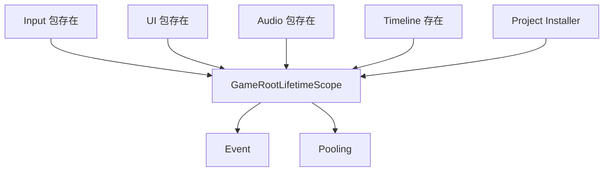
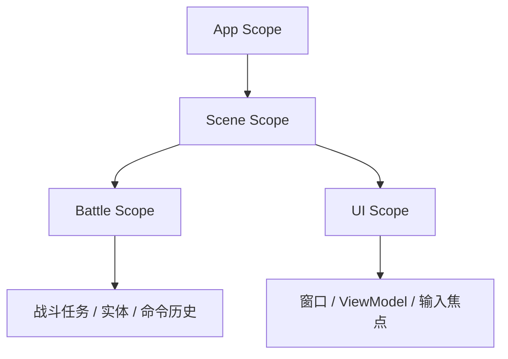

# Bootstrap 组合根：服务装配、生命周期所有权与重复接管隔离

> 系列：Sakura Framework 工程实践
>
> 日期：2026-08-05
>
> 状态：可发布候选
>
> 核心问题：框架启动器需要把模块装进同一运行时，同时避免核心依赖膨胀、重复 Host、生命周期冲突和项目覆盖失效。

[系列目录](../blog.html)

很多 Unity 项目的 Bootstrap 最初只是一个 `DontDestroyOnLoad` 对象。

它在 `Awake()` 中依次创建：

- EventManager；

- AudioManager；

- UIManager；

- SaveManager；

- InputManager；

- PoolManager。


项目继续增长后，这个对象会承担越来越多责任：

- 决定所有服务的创建顺序；

- 持有全部模块引用；

- 执行初始化状态机；

- 每帧更新框架模块；

- 处理场景切换；

- 接收项目自定义注册；

- 管理主线程任务；

- 在退出时清理全部内容。


最终，Bootstrap 可能从启动入口变成一个无法替换的超级管理器。

Sakura Framework 当前的方向，是把 Bootstrap 收敛为**唯一组合根与生命周期协调器**，而不是把全部能力重新集中到一个类中。

## 先说结论：组合根负责装配，不负责吞并模块

**组合根（后文简称“服务总装入口”）**：在应用启动边界集中决定服务注册、生命周期和依赖关系的位置。

服务总装入口应该知道：

- 哪些模块属于 App Scope；

- 哪些可选包已经安装；

- 项目提供了哪些覆盖实现；

- 启动任务按什么顺序执行；

- Root 销毁时如何释放所有权。


但它不应该知道：

- 具体战斗技能如何计算；

- UI 页面如何导航；

- 音频表如何组织；

- 项目资源如何加载；

- 某个场景有哪些敌人；

- 某项业务状态如何保存。


组合根的职责是组装系统，不是成为系统本身。

## 最小基础闭包限制了启动器责任

当前默认 Bootstrap 的基础闭包只直接装配 Event 与 Pooling。

Input、UI、Audio、Timeline 等能力只有在消费项目显式安装对应包并满足最低条件时，才通过条件程序集贡献到同一个 Root。



这种设计避免了两个常见问题。

### 核心依赖膨胀

如果 Bootstrap 为了开箱即用而硬依赖全部客户端模块，那么只需要 Event 和 Pooling 的项目，也会被迫安装 UI、Audio、Input 和 Timeline。

启动器会变成新的聚合大包。

### 可选能力假装必需

某个模块很常用，不代表它属于所有项目的启动合同。

服务器工具、编辑器工具、纯模拟测试和无 UI 的消费场景，都可能不需要完整客户端闭包。

最小基础闭包让默认 Root 保持可解释：

> 未安装的能力不会以隐藏依赖、Missing Script 或空占位服务的形式进入项目。

## 条件 Contribution 把扩展留给模块自己

**条件 Contribution（后文简称“装了才贡献”）**：可选包在自身存在且版本满足要求时，向既有组合根追加服务描述，而不让组合根反向硬依赖该包。

“装了才贡献”通常由条件程序集、版本约束和稳定注册顺序共同完成：

- 包不存在时，程序集不编译；

- 包版本不足时，不启用对应 Contribution；

- 条件满足时，服务描述进入统一组合流程；

- 项目自己的 Installer 仍拥有明确覆盖顺序。


这比在 Root 中通过反射执行“找到类型就创建”更可靠。

反射式尽量装配会让依赖错误在运行时才暴露，也无法证明缺失包时的编译路径是否安全。

## 一个模块只能属于一个 Host

大型框架经常同时存在多种模块创建方式：

- 默认 Bootstrap；

- 场景中的 Manager；

- `SingletonManager`；

- 项目自定义 Host；

- 测试 Fixture；

- 热重载后残留的旧 Root。


如果这些入口都能接管同一模块，就会出现重复生命周期：

- 同一事件订阅两次；

- 同一模块每帧 Tick 两次；

- 清理时重复释放同一对象；

- 两个容器返回不同服务身份；

- 旧 Root 销毁时清掉新 Root 的 Resolver。


**唯一 Host 所有权（后文简称“一个模块只归一个启动器”）**：同一具体模块在同一生命周期中只能被一个容器、Manager 或项目 Host 接管。

组合根在装配时需要识别：

- 模块是否已经被其他 Host 接管；

- 当前 App Scope 是否已拥有该模块；

- 重复接管是否应跳过或拒绝；

- 冲突是否进入结构化诊断。


这里不能用“最后创建的覆盖前一个”作为默认策略。

覆盖会掩盖重复初始化，而旧对象仍可能继续运行。

更安全的行为是 fail closed：

> 无法证明唯一所有权时，不继续启动第二份模块。

## Root 身份需要代际保护

场景重载、测试重建和 Editor PlayMode 反复进入时，Root 可能经历替换。

一个容易忽略的问题是：

```text
Root A 绑定全局 Resolver
→ Root B 建立并替换 Resolver
→ Root A 延迟执行 OnDestroy
→ Root A 清空全局 Resolver
→ Root B 仍存在，但 Facade 全部解析失败
```

因此，Root 绑定不能只有一个全局引用。

**Root 代际绑定（后文简称“旧根不能清新根”）**：每次 Resolver 绑定记录 Owner 与 generation，释放时只有当前绑定仍属于自己，才允许清理。

同样的原则也适用于：

- 主线程 Dispatcher；

- 当前 Save Session；

- 热更新 Runtime；

- 场景级输入焦点；

- 网络连接 Host。


## 项目 Installer 需要确定性组合

项目通常需要在默认框架服务之上添加：

- 自定义启动状态；

- 项目战斗规则；

- 特定 UI 服务；

- 业务配置加载器；

- 存档桥接；

- 平台服务实现。


如果 Installer 只按程序集扫描得到的自然顺序执行，同一项目可能在不同环境中得到不同注册结果。

因此，Installer 组合需要稳定排序，例如依据：

1. Phase；

2. Priority；

3. 程序集全名；

4. 类型全名。


**确定性 Installer 组合（后文简称“每次按同一顺序装”）**：相同输入程序集在不同机器和运行中得到相同注册顺序与冲突结论。

稳定顺序仍不足以解决同一接口的多实现问题。

项目还需要明确注册意图。

|意图|含义|
|---|---|
|Default|提供缺省单值实现|
|Override|替换已有 Default|
|Multi|作为有序集合中的一个实现|
|普通独占注册|声明该契约只应由当前 Installer 提供|

如果两个 Installer 都无意间注册同一单值接口，框架不应依赖“后注册覆盖前注册”的容器细节，而应在容器构建前报告冲突。

## 注册应先归一，再一次提交

Installer 执行期间可能发生：

- 类型加载失败；

- 构造异常；

- 重复 Default；

- 无 Default 的 Override；

- 普通注册与显式意图混用；

- DI 到 VContainer 转换失败。


如果每个 Installer 执行后立即写入最终容器，失败时可能留下半套注册。

**组合提交边界（后文简称“整套注册一起生效”）**：先收集并验证所有服务描述，只有全部归一成功后，才转换并提交到最终容器。

```text
发现 Installer
→ 稳定排序
→ 隔离执行
→ 收集 Descriptor
→ 验证冲突与意图
→ 全部成功
→ 转换并构建容器
```

这使 Root 构建失败能够得到明确结论，而不是启动一个缺少部分服务的运行时。

## Bootstrap FSM 与任务监管器应共享 Scope

启动流程经常包含异步任务：

- 加载配置；

- 初始化存档；

- 建立资源目录；

- 登录平台服务；

- 预热对象池；

- 进入首场景。


如果每个状态自己创建 CancellationToken 和后台任务，Root 销毁时很难确认哪些任务仍在运行。

更合理的方式是把 App Scope、Bootstrap FSM 和启动任务绑定到共同任务监管器。

这样：

- Root 销毁可以取消 App Owner 下的任务；

- 当前运行、最近结果和失败可以统一观察；

- Scene Scope 释放时，可以取消场景拥有的待执行项；

- 新一轮运行不会继续接收旧任务回调。


主线程 Dispatcher 也只应存在一个 Pump，避免多个入口重复消费队列。

## App Scope 不应持有 Gameplay 临时模块

默认 Root 适合持有：

- Event；

- Pooling；

- Config；

- Asset；

- Audio；

- Save；

- 应用级 Command 服务。


它不应默认创建：

- 当前战斗实体；

- 关卡专用导航；

- 房间状态；

- 页面级 ViewModel；

- 临时输入拦截；

- 某局技能解析器。


这些对象应进入 Scene、Battle 或 UI Scope。



如果所有内容都被放进 `DontDestroyOnLoad` Root，场景切换只会更换画面，不会真正结束旧玩法生命周期。

## 自动创建与项目覆盖可以同时成立

小型项目希望安装包后无需手动拖拽 Root。

大型项目则希望提供自定义 `GameRootLifetimeScope`，决定 Profile、Installer 和 Scope 策略。

合理规则是：

- 首场景前检测不到 Root 时，创建默认组合根；

- 项目已放置自定义 Root 时，自动启动器跳过；

- 自定义 Root 仍复用既有服务上下文和生命周期合同；

- 不创建第二套 Bootstrap Host；

- 项目覆盖通过正式 Installer 或派生 Root 完成。


默认自动化负责降低接入成本，项目覆盖负责提高控制力。

二者共享同一条运行时路径。

## 我的判断

Bootstrap 的成熟度，不取决于它能创建多少 Manager。

更重要的是它能否维持以下约束：

- 最小闭包明确；

- 可选能力只在安装后贡献；

- 同一模块只有一个 Host；

- Installer 顺序确定；

- 注册冲突在构建前失败；

- Root 替换不会发生代际误清；

- App 与 Gameplay 生命周期分离；

- 启动任务都有共同 Owner。


当这些约束成立时，Bootstrap 才是架构边界，而不是启动脚本集合。

## 设计检查表

- 默认 Root 的硬依赖是否保持最小；

- 可选模块是否通过条件 Contribution 加入；

- Core 是否反向依赖 Unity 适配或具体业务；

- 同一模块是否可能被两个 Host 接管；

- Root 替换时旧对象是否可能清理新绑定；

- Installer 是否有稳定排序；

- 多实现注册是否声明 Default、Override 或 Multi；

- 注册失败是否会留下半套容器；

- 主线程任务是否只有一个 Pump；

- Bootstrap FSM 和异步任务是否共享 Owner；

- Scene、Battle、UI 模块是否被错误放进 App Scope；

- 项目自定义 Root 是否会触发默认 Root 重复创建。


## 术语对照

|正式术语|通俗称呼|含义|
|---|---|---|
|组合根|服务总装入口|集中决定服务注册、依赖和生命周期的位置|
|条件 Contribution|装了才贡献|可选包满足条件后向既有 Root 增加服务|
|唯一 Host 所有权|一个模块只归一个启动器|防止重复初始化、Tick 和清理|
|Root 代际绑定|旧根不能清新根|旧 Owner 不能释放后继 Root 的全局身份|
|确定性 Installer 组合|每次按同一顺序装|相同输入产生相同注册结果|
|组合提交边界|整套注册一起生效|所有描述验证成功后才构建最终容器|

> 资料说明：本文依据 2026-08-05 的 Bootstrap 包说明、默认组合根实现和运行时生命周期策略整理。文中默认闭包与条件模块属于该时间点的实现快照。