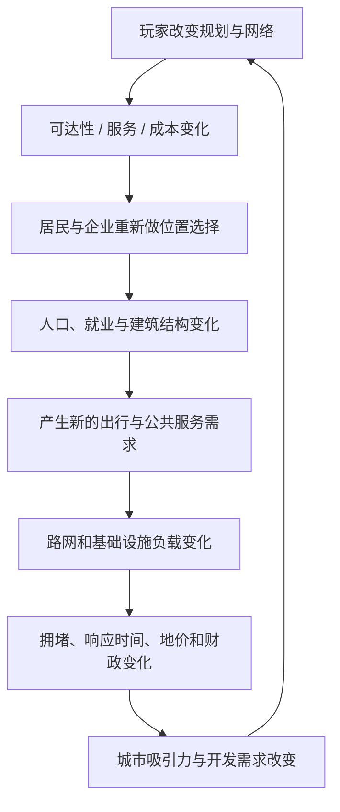
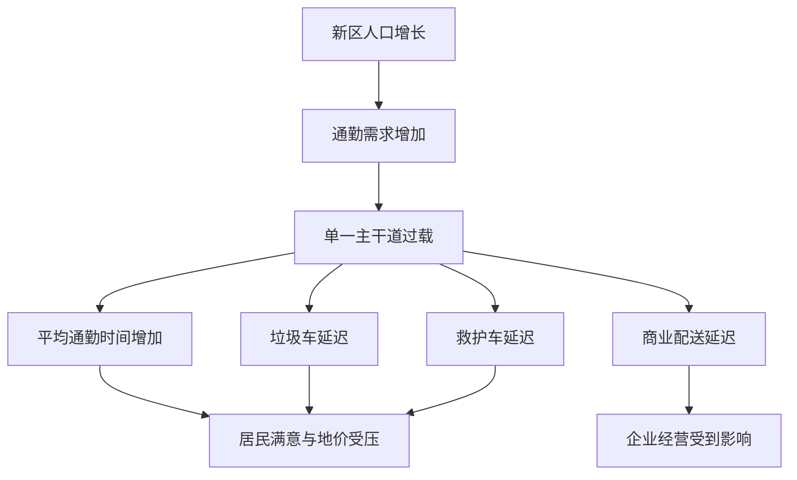
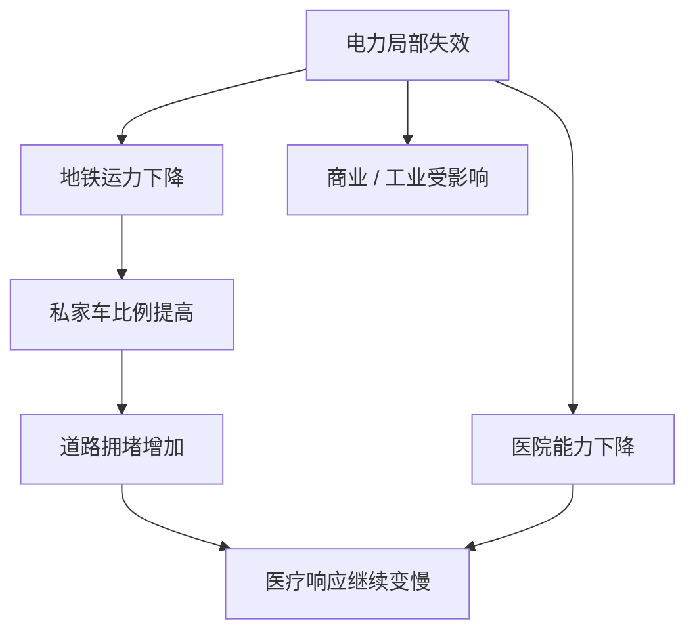

# 可达性驱动的城市自组织：路网容量、公共服务与土地价值的反馈闭环

> 系列：游戏系统的共同语言
>
> 日期：2026-08-15
>
> 状态：草稿
>
> 核心问题：城市建设模拟怎样让道路、分区、居民、企业和公共服务形成真实的互相影响，而不是退化成“哪里变红就多盖一个建筑”的数值面板？
>
> 关键词：City Builder、Accessibility、Transport Network、Land Value、Public Service、Delayed Feedback

[系列目录](../blog.html)

玩家新建了一个住宅新区。

道路已经接通。

水、电都正常。

住宅需求很高。

高密度住宅陆续建成，大量居民迁入。

从表面看，这是一次非常成功的扩张。

几个月后，新区却开始同时出现：

- 垃圾堆积；
- 医疗响应过慢；
- 商业缺货；
- 居民抱怨通勤；
- 土地价值停滞；
- 建筑不再升级。

玩家最直觉的处理方式可能是：

> 垃圾不够，就再建一个垃圾处理厂。

但新的处理厂建成后，垃圾问题几乎没有变化。

原因并不在垃圾处理能力。

处理厂本身甚至还有大量空余容量。

真正的问题是：

> 垃圾车根本无法及时穿过已经严重拥堵的主干道。

同一条道路上还挤着：

- 上班居民；
- 商业配送车辆；
- 救护车；
- 消防车；
- 公交；
- 工业货运。

一个最初表现为“交通拥堵”的局部问题，正在同时制造垃圾、医疗、商业和居住质量问题。

这就是城市建设模拟真正值得研究的地方。

玩家看到的是一座城市。

底层运行的却是一组持续互相改变条件的网络。

## 先说结论：城市不是玩家直接搭出来的，而是在玩家约束下自己长出来的

**约束驱动模拟（即“玩家规定允许发生什么，城市决定最终发生什么”）**：玩家主要通过道路、分区、基础设施、公共服务、税率和政策改变城市环境条件，而居民、企业和开发行为根据这些条件自主决定迁入、迁出、建设、就业和出行。

这与直接放置建筑的经营游戏有明显区别。

玩家划出住宅区时，不应该等价于：

```text
点击 Residential Zone
→
立即生成住宅楼
→
人口 +100
```

更完整的流程应该是：

```text
划定住宅用途
→
检查住宅需求
→
检查土地是否合法
→
检查道路接入
→
检查水电
→
检查土地价值
→
开发行为成立
→
建筑施工
→
住宅空位出现
→
居民迁入
```

所以，玩家控制的是：

```text
城市生长条件
```

而不是：

```text
城市最终状态。
```

可以把整个类型的核心循环压缩成：



城市不是一张被玩家逐格填满的地图。

它更像一个在约束条件下持续寻找新稳定态的系统。

## 可达性比直线距离更接近城市真正的空间价值

**可达性（即“从这里实际能多容易到达机会”）**：一个位置通过道路、步行、公共交通和其他交通方式访问工作、商业、服务与其他区域时的综合时间和成本。

假设住宅区距离办公中心只有一公里。

地图上的直线距离非常近。

但如果两者之间：

- 只有一座桥；
- 桥前有大型路口；
- 高峰期长期排队；
- 没有地铁；
- 公交班次稀疏；

真实通勤时间仍然可能非常高。

所以：

```text
Distance = 1 km
```

并不能直接推导：

```text
Accessibility = High
```

城市空间更接近：

```text
Accessibility
=
Travel Time
+
Congestion
+
Transfer Cost
+
Parking
+
Transport Availability
+
Network Reliability
```

这里不需要强求一个通用数学公式。

重要的是设计模型必须承认：

> 两个位置在地图上很近，不代表它们在城市运行意义上很近。

这会直接改变玩家对道路的理解。

## 道路不是装饰，也不是“建筑必须贴路”的前置条件

**共享运输网络（即“所有城市系统都在争同一份通行能力”）**：道路、路口和交通线路构成有限容量网络，居民通勤、货运、公交、消防、医疗和垃圾收运共同消耗这套网络。

如果道路只承担：

```text
建筑旁边有没有 RoadAccess
```

那么道路系统实际上只是建筑合法性条件。

真正的城市模拟里，它还要承担：

- Commute；
- Shopping；
- Freight；
- Education；
- Emergency；
- Healthcare；
- Garbage；
- Tourism。

也就是说：

```text
住宅系统
商业系统
产业系统
医院
消防
垃圾
公交
```

表面属于不同模块。

最后却都可能生成：

```text
Trip
```

而这些 Trip 又全部进入同一个：

```text
Road / Transit Network。
```

因此交通系统不是一个孤立子玩法。

它是大量城市系统共享的执行层。

## “有资源”与“资源能到达”是两个不同事实

这一点与生产经营系统中的物流问题相似，但城市网络的规模更大。

例如：

```text
医院床位 = 充足
```

并不能推出：

```text
医疗服务 = 正常。
```

完整链路可能是：

```text
居民需要医疗
→
生成 Healthcare Trip
→
分配救护车
→
选择道路
→
进入交通网络
→
实际到达患者
→
运送到医院
→
医院处理
```

如果堵在：

```text
Trip → Network
```

这一段，

再增加医院容量也不能解决问题。

同样：

```text
垃圾处理容量足够
```

不代表垃圾能被及时处理。

```text
发电总量充足
```

也不代表所有城区一定不会停电。

城市系统中，一个非常重要的判断原则是：

> **Supply 存在，不等于 Supply 可以被送到 Demand。**

## 公共服务应该拆成覆盖、容量与响应三个维度

**服务三元模型（即“理论能管、实际装得下、真正来得及”）**：公共服务不能只使用覆盖半径判断，而应至少区分 Coverage、Capacity 和 Response Time。

以消防为例。

### Coverage

消防站理论上可以到哪些区域。

它回答：

> 这个地方属于不属于服务范围？

### Capacity

消防站同时能够处理多少事故。

它回答：

> 即使能够到达，现在还有没有车辆和人员？

### Response Time

实际从消防站到现场需要多久。

它回答：

> 真正赶到的时候是不是已经太晚？

三个维度缺一不可。

一张地图可以显示：

```text
整片城区都是绿色消防覆盖
```

但如果：

- 消防站只有两辆车；
- 两辆车正在执行其他任务；
- 主干道严重拥堵；

实际消防能力仍然可能很差。

因此：

```text
Coverage = 100%
```

完全不等于：

```text
Service Quality = 100%。
```

## 红绿覆盖图只能发现问题，不能解释问题

城市模拟很容易依赖 Heatmap。

道路红了。

玩家知道：

> 这里堵。

住宅区变红。

玩家知道：

> 这里服务不好。

但 Heatmap 只能回答：

```text
哪里有异常？
```

无法回答：

```text
为什么异常？
```

因此：

**因果可解释性（即“从结果一路追到真正约束”）**：允许玩家从一个异常指标继续向下展开，最终定位导致该异常的网络、容量、人口或政策原因。

例如：

```text
垃圾堆积
↓
处理设施容量：125%
↓
收集完成率：68%
↓
平均车辆到达时间过高
↓
East Residential → Center 主干道拥堵
```

此时玩家会得到完全不同的解决思路。

错误思路：

```text
垃圾多
→
增加垃圾场
```

真实问题：

```text
垃圾多
→
垃圾车收不回来
→
检查交通网络
```

一旦模拟系统具有延迟和传播，可解释性就不再只是调试工具。

它本身就是玩家学习系统规则的主要界面。

## 城市问题往往具有时间延迟

**延迟反馈（即“今天的规划，几个月后才真正暴露后果”）**：玩家行为对人口、交通、地价和财政的影响需要经过多个模拟阶段才完全出现。

假设玩家划出一大片高密度住宅。

最初只会发生：

```text
Zone Applied
```

随后才逐步发生：

```text
建筑生成
→
居民迁入
→
产生通勤
→
学校入学
→
商业需求增长
→
交通增加
→
服务负荷提高
→
土地价值变化
```

所以一个今天看起来非常成功的规划：

```text
人口快速增长
税收快速增加
```

可能在半年之后暴露成：

```text
道路严重过载
学校不足
服务车辆延迟
财政维护支出过高
```

这也是城市建设模拟和普通即时经营系统的重要差别。

玩家不是只在解决当前状态。

他在不断承担：

> 当前决策未来会释放什么后果。

## 增长本身就是下一阶段问题的来源

很多成长系统采用：

```text
规模扩大
→
收益变大
```

城市建设不能只停在这里。

更典型的关系应该是：

```text
Growth
→
Complexity
→
New Constraint
→
Infrastructure Upgrade
→
New Growth Capacity
```

例如：

```text
1000 人
→
普通道路完全足够

10000 人
→
主干路开始拥堵

50000 人
→
所有就业集中在单中心已经不可持续
```

这并不是：

> 游戏突然提高难度。

而是：

> 原本合理的城市结构在新的规模下已经不再合理。

**规模阈值（即“旧方案在更大城市里开始失效”）**是城市成长最重要的长期压力之一。

如果一套道路布局从：

```text
1000 人
```

一直无代价支持：

```text
100 万人，
```

城市增长就只剩数字膨胀。

## 一个新区如何把局部问题传播到整座城市

可以用一个完整例子说明这种系统关系。

假设初始城市有约三万人。

市中心拥有大量就业。

玩家在东部建设新住宅区。

最初：

```text
东区人口 = 0
```

随着住宅需求释放：

```text
东区人口
0
→
8000
→
16000
```

但就业仍然集中在市中心。

于是早高峰出现大量：

```text
East Residential
→
Center Jobs
```

通勤需求。

开始时：

```text
Flow / Capacity = 0.6
```

道路仍然正常。

人口继续增加后：

```text
Flow / Capacity ≈ 1.05
```

路网接近或超过容量。

随后发生：



玩家看到的是多个问题。

底层却可能只有一个主要约束：

```text
Transportation Bottleneck。
```

这就是系统性模拟与简单数值管理的差别。

## 单纯扩路可能只是在移动问题

玩家发现主干道拥堵后，最自然的反应是：

```text
再修一条路。
```

短期内，这通常有效。

部分交通被分流。

平均速度提高。

但随后可能出现：

**诱导需求（即“容量增加以后，更多交通又会把容量吃满”）**：新增道路容量降低出行成本后，更多居民选择驾车、更多开发进入新区，最终使新增容量再次接近饱和。

于是：

```text
新增道路
→
Travel Cost 降低
→
区域更容易开发
→
更多人口进入
→
更多驾车出行
→
新道路再次拥堵
```

这并不意味着：

> 扩路永远没用。

而是意味着：

> 路网容量不能脱离城市空间结构单独解决。

玩家真正需要考虑的是：

- 人为什么必须跨区移动；
- 工作为什么全部集中在中心；
- 是否存在公共交通替代；
- 商业和办公是否可以进入新区；
- 是否能够形成新的城市副中心。

## 公共交通改变的不只是车辆数量

假设玩家建设：

```text
East Residential
→
Center Business
```

地铁线路。

如果：

```text
Car Travel Time = 45 min
Metro Travel Time = 28 min
```

部分居民会重新做 Mode Choice。

交通方式占比可能从：

```text
Car 78%
Transit 8%
```

变化为：

```text
Car 52%
Transit 31%
```

此时，地铁的影响并没有停在：

```text
道路少一些车。
```

它还可能继续产生：

```text
站点可达性提高
→
站点周边土地价值提高
→
建筑升级
→
人口密度提高
→
商业进入
→
新的 Trip 产生
```

也就是说：

> 交通改善会改变城市形态，而城市形态又会重新改变交通。

## 可达性本身会被资本化为土地价值

**土地价值（即“这块空间在当前城市结构中有多值得占用”）**：由交通可达性、服务质量、环境、工作机会、公共交通和其他区位因素共同产生的空间经济吸引力。

它不是简单的：

```text
幸福度。
```

同一块土地可能因为新增地铁站而发生：

```text
Accessibility ↑
→
Land Value ↑
→
开发密度 ↑
→
税基 ↑
```

但高地价同样不能被设计成纯正收益。

如果中心城区持续升值：

```text
房价提高
→
低收入家庭承担不起
→
向郊区迁移
→
通勤距离增加
→
道路压力增加
```

于是：

```text
Land Value ↑
```

可能在另一条链上制造：

```text
Housing Accessibility ↓
Transport Pressure ↑
```

好的模拟系统应允许一个指标同时拥有收益和代价。

否则玩家永远只需要追求：

```text
所有数值越高越好。
```

## 城市布局应该产生多种可运行稳定态

城市建设不应该存在唯一“正确布局”。

例如：

### 高密度单中心

优点：

- 土地利用率高；
- 公交容易集中覆盖；
- 服务效率可能较高。

代价：

- 地价高；
- 路口压力大；
- 中心拥堵风险高。

### 低密度郊区

优点：

- 环境质量较高；
- 局部拥堵较少。

代价：

- 道路维护面积大；
- 公交成本高；
- 私家车依赖高。

### 工业集中

优点：

- 货物流组织简单；
- 专业设施容易共用。

代价：

- 污染集中；
- 货运道路压力大。

### 工业分散

优点：

- 局部污染降低；
- 部分就业更靠近住宅。

代价：

- 运输路径可能更复杂；
- 基础设施重复建设。

城市系统真正需要保护的是：

> 不同空间结构在不同成本组合下都可以成立。

这比提供一套隐含“标准最优城市模板”更有长期策略价值。

## 单中心向多中心演化是一种结构性解决方案

回到前面的东区问题。

玩家第一次处理拥堵时：

```text
扩路
```

只是增加运输容量。

第二次处理：

```text
地铁
```

改变交通方式。

进一步的解决方式则可以直接修改需求来源：

```text
在东区地铁站周围增加
Mixed Use
Commercial
Office
```

这样部分居民不再需要：

```text
East
→
Center
```

每天跨城通勤。

城市开始从：

```text
Single Center
```

演化为：

```text
Polycentric City。
```

这类解决方案之所以重要，是因为它不是在优化：

```text
如何让更多车通过同一条道路。
```

而是在重新回答：

```text
为什么这么多人必须走这条道路？
```

这是城市规划比交通优化更高一层的决策。

## “为什么”必须成为城市模拟的一等功能

城市模拟如果拥有几十个相互影响的系统，却只能给玩家：

```text
Residential Demand = 0
```

那么复杂性只会表现成不透明。

需求系统更适合展示：

```text
Residential Demand

+35 Jobs Available
+12 Education
-28 High Vacancy
-18 High Tax

Final: +1
```

企业缺工可以展示：

```text
Job Slots: 1200
Candidate Population: 1800
Education Mismatch: -420
Commute Failure: -560
Wage Mismatch: -140
```

某栋建筑没有升级则可以展示：

```text
Land Value: insufficient
Education: sufficient
Transit Access: insufficient
Pollution: high
```

这就是：

**解释型模拟（即“系统不仅计算结果，也保留结果是怎么来的”）**。

它带来的价值不只是方便开发者 Debug。

玩家才能真正完成：

```text
观察
→
提出原因假设
→
修改规划
→
等待反馈
→
验证假设
```

这才是一场城市建设游戏真正的决策循环。

## 城市模拟尤其需要因果历史

因为反馈存在延迟，玩家遇到当前问题时，真正的错误决策可能发生在很久以前。

例如：

```text
三个月前新增高密度住宅
→
两个月前人口大量迁入
→
一个月前主干道开始过载
→
今天垃圾、医院和商业同时报警
```

如果系统只展示当前状态：

```text
垃圾堆积
```

玩家无法知道它来自哪一项历史结构变化。

因此：

**因果时间线（即“现在的问题是从哪一步长出来的”）**可以记录关键状态转换：

```text
08:00 新区开发资格提高
↓
人口 +3200
↓
Morning Commute +4100 Trips
↓
Main Artery Congestion 68% → 94%
↓
Garbage Collection Completion 91% → 67%
```

对于高度延迟的模拟系统，这类历史比单一当前指标更有价值。

## 服务范围不能依赖简单圆形半径

很多城市游戏为了性能或 UI 简化，使用：

```text
消防站半径 800m
```

半径内变绿色。

这种模型非常容易理解。

但它会制造不符合玩家直觉的结果：

```text
消防站就在街对面
```

却因为：

- 道路单向；
- 河流没有桥；
- 路口阻塞；
- 服务车辆忙碌；

实际到达时间非常差。

所以更完整的 Service Coverage 应基于：

```text
Network Travel Cost
```

而不是：

```text
Euclidean Radius。
```

对于学校和公园等非紧急设施，则可以使用不同模型。

学校更关注：

```text
Eligible Population
+
Capacity
+
Accessibility
```

消防和医疗更关注：

```text
Vehicle Availability
+
Travel Time
+
Incident Demand。
```

这里有一个很重要的架构思想：

> “公共服务”可以共享框架，但不能假装所有公共服务拥有同一种运行语义。

## 基础设施总量正常，也可能存在局部网络瓶颈

假设城市总发电：

```text
100 MW
```

总需求：

```text
95 MW
```

从全局总量看完全健康。

但东城区的输电连接只允许：

```text
20 MW
```

而局部需求已经：

```text
30 MW。
```

因此：

```text
Global Supply > Global Demand
```

仍然可以同时存在：

```text
Local Blackout。
```

**网络瓶颈（即“总量够，但通往这里的管道不够”）**是城市公用事业必须区别于简单资源池的一层。

同样规则可以用于：

- 电力；
- 水；
- 污水；
- 供热；
- 数据网络。

这再次说明：

> 城市系统最重要的不是有多少资源，而是资源通过什么网络到达哪里。

## 基础设施故障应该沿真实依赖传播

断电之后，不应该只是：

```text
居民幸福度 -10。
```

它可能进一步影响：

```text
商业停止
工业减产
医院能力下降
污水泵站停机
地铁停止
```

而地铁停机又可能导致：

```text
道路交通增加
→
救护车变慢
```

于是形成：



这类系统性传播真正有价值的前提是：

> 每条传播关系都来自已有系统依赖。

如果灾难只是随机给多个数值同时减分，就不属于真正的故障传播。

## 城市财政应该把“建得起”和“养得起”分开

假设医院建设成本：

```text
100000
```

每周运营：

```text
5000。
```

玩家拥有：

```text
120000
```

所以他确实：

```text
建得起。
```

但如果城市每周盈余只有：

```text
2000
```

那他并不：

```text
养得起。
```

**维护承诺（即“每一项扩张都会留下长期账单”）**：基础设施和公共服务在建设以后持续产生运营、维护、人员和更新成本。

这让城市扩张从：

```text
有钱就盖
```

变成：

```text
未来财政是否能支撑这个结构？
```

快速扩张还会产生典型现金流缺口：

```text
道路和设施先建设
→
现金立即下降
→
住宅随后慢慢建成
→
人口再迁入
→
税收更晚才增加
```

城市甚至可能：

```text
长期是健康项目
```

却因为短期现金流断裂而陷入危机。

## 政策同样需要延迟反馈

高税率可以立即：

```text
增加税收。
```

但后续可能逐渐造成：

```text
企业利润下降
→
投资减少
→
开发需求降低
→
企业迁出
→
就业下降
→
人口迁出
```

因此政策不能设计成：

```text
点击按钮
→
幸福度立即 -5
→
税收立即 +10%
```

更合理的是：

**政策惯性（即“制度先改变条件，主体再慢慢响应”）**：政策先修改居民和企业的决策环境，真正的城市结构变化在之后多个模拟周期中逐步出现。

它让政策成为长期规划，而不是即时 Buff。

## 宏观模拟和微观表现应该主动分层

城市建设还有一个非常现实的工程边界：

```text
100 万人口
```

不等于必须运行：

```text
100 万个完整高频 Citizen AI。
```

**模拟层级分离（即“宏观事实可以真实，画面里的个体只是抽样表现”）**：人口、就业和需求可以在 Household、Cohort 或聚合层计算，而只有真正需要出行或进入玩家视野的部分才实例化为车辆与行人。

可以拆为：

```text
Macro
人口
就业
需求

Meso
Household
Business
Trip

Micro
Citizen
Vehicle
Pedestrian
```

这样：

```text
10000 个相似通勤 Trip
```

可以真实贡献交通流量，

但画面里只实例化：

```text
500 个代表车辆。
```

这不是“偷模拟”。

只要宏观流量、容量和结果保持一致，它是在把：

```text
模拟事实
```

与：

```text
表现密度
```

分开。

## 完全聚合也不是答案

另一极端是：

```text
人口 = 103247
交通 = 72
商业需求 = 61
```

所有东西都只剩数字。

城市会变成 Excel。

微观居民和车辆仍然有价值。

它们可以提供：

- 城市生命感；
- 交通表现；
- 个体 Inspector；
- 统计抽样；
- 问题解释。

因此更合适的结构是：

> 宏观真实，微观抽样。

玩家点击一个车辆时，可以看到：

```text
Home
→
Work
Purpose: Commute
Expected Time: 22 min
Current Time: 41 min
Delay Reason: Junction Congestion
```

个体成为宏观系统的可观察窗口，而不是宏观系统唯一的计算方式。

## 与殖民地模拟的边界

殖民地模拟中，玩家很可能面对：

```text
为什么 Alice 不去搬木头？
```

需要调查：

- Alice 当前需求；
- 技能；
- Work Priority；
- Reservation；
- 路径；
- 当前任务。

城市建设更常见的问题则是：

```text
为什么工业区明明有岗位，仍然长期缺工？
```

它需要分析：

- 区域人口；
- 教育结构；
- 工资；
- 通勤时间；
- 住房成本；
- 交通连接。

可以把二者简单区分为：

```text
Colony Simulation
→
具体个体怎样执行任务

City Builder
→
聚合人口和网络怎样形成结构
```

城市建设当然也可以模拟单个市民。

但玩家通常不需要亲自为某个市民安排：

```text
08:00 去某公司上班。
```

他需要改变的是：

```text
这片区域有没有足够可达的就业机会。
```

## 与工厂自动化的边界

工厂系统主要关心：

```text
矿石
→
传送带
→
机器
→
产品。
```

它主要追求：

```text
吞吐。
```

城市中的流则更加复杂：

```text
人口
车辆
就业
消费
服务
货运
税收。
```

更重要的是，城市不能只追求最高运输效率。

它还必须同时处理：

- 生活质量；
- 污染；
- 房价；
- 服务；
- 公共财政；
- 城市形态。

因此：

```text
最快的物流城市
```

不一定是：

```text
最健康的城市。
```

## 与交通经营游戏的边界

交通经营游戏可以把：

```text
线路盈利
```

作为核心目标。

城市建设中的公交即使亏损，也可能仍然值得保留。

因为它可能间接：

```text
降低道路压力
→
提高可达性
→
提升土地价值
→
支持高密度开发
→
扩大税基
```

所以一条公交线的价值不一定能通过：

```text
Fare Revenue - Operating Cost
```

单独判断。

它还属于整个城市空间结构的一部分。

## 这套范式不能机械追求“越真实越好”

更精确并不自动等于更好的城市模拟。

如果系统真实模拟：

- 每个居民每天所有活动；
- 每辆车每次换道；
- 每栋建筑所有经济交易；
- 每一条供水管压力；

却无法把结果解释给玩家，

那么复杂度只会变成黑箱。

一个系统是否值得保留高精度，应该至少满足其中一个条件：

1. 它产生玩家可理解的决策；
2. 它改变其他系统的重要结果；
3. 玩家拥有能够干预它的工具；
4. 它支持有价值的表现或故事。

如果一个变量：

```text
计算非常复杂
```

但玩家：

```text
看不见
理解不了
也无法改变，
```

它很可能只是模拟成本。

## 常见设计失败

### 分区完成就立即生成建筑

规划和城市生长被压成同一个动作。

### 需求只有三根进度条

玩家知道住宅需求低，却不知道原因。

### 道路只是建筑接入条件

人口、货运和服务并不真正竞争路网容量。

### 道路容量完全线性

无法形成接近容量后突然恶化的拥堵。

### 只模拟道路，不模拟路口

玩家看到宽阔道路，却无法解释为什么十字路口仍然堵死。

### 公交拥有无限容量

只要画一条线，就可以无成本吸收全部乘客。

### 服务只看圆形覆盖

医院旁边即使严重堵车，仍被判定完全服务正常。

### 所有居民都运行完整 AI

城市人口规模无法扩展。

### 完全不模拟任何个体

城市又失去生命感和可解释入口。

### 高地价永远是好事

房价、人口结构和通勤反馈全部消失。

### 城市扩张只增加收入

道路、公交、学校、医院没有长期维护承诺。

### 建筑升级不增加基础设施负荷

高密度增长没有真实代价。

### 拥堵只能通过扩路解决

公交、混合用地和副中心失去意义。

### 所有结果即时发生

城市没有惯性，也没有长期规划。

### 结果有延迟，却没有因果追踪

玩家知道城市坏了，却不知道是哪一步规划造成的。

### Heatmap 是唯一解释工具

能看到哪里红，却不知道为什么红。

## 我的城市自组织设计检查表

1. 玩家是在直接放置最终结果，还是设置城市生长条件？
2. Zoning 和 Building Development 是否是两个独立阶段？
3. 城市是否拥有真正的 Residential / Commercial / Industrial 等需求来源？
4. Demand 是否可以展开到具体 Growth Factor 与 Suppression Factor？
5. Parcel 是否独立于纯视觉网格？
6. 可达性是否基于真实 Travel Cost，而不是只使用直线距离？
7. 居民、货运、垃圾、消防和医疗是否共享同一交通网络事实？
8. 道路是否存在明确容量？
9. 路口是否拥有独立容量和信号语义？
10. 拥堵是否具有非线性恶化区间？
11. Trip 是否保留 Origin、Destination 和 Purpose？
12. 点击拥堵道路时，是否能解释主要 OD Flow？
13. 公交是否拥有车辆数、班距和运力？
14. Mode Choice 是否考虑真实时间、价格和停车成本？
15. 公共服务是否区分 Coverage、Capacity 与 Response Time？
16. Service Heatmap 是否只是发现问题，而不是唯一解释方式？
17. Utility 是否区分总供应与局部网络瓶颈？
18. 基础设施故障是否沿真实依赖传播？
19. 土地价值是否能被拆解成可解释来源？
20. 高土地价值是否也可能产生住房成本和结构性代价？
21. 建筑升级是否同步提高交通和 Utility 需求？
22. 城市增长是否会制造下一阶段的新约束？
23. 扩路是否可能通过新的开发和出行改变长期需求？
24. 玩家是否拥有公交、混合用地、分中心等结构性解决方案？
25. 建设成本与运营成本是否明确分离？
26. 快速扩张是否可能产生 Growth Cashflow Gap？
27. 税率和政策是否通过延迟行为反馈发挥作用？
28. Household / Cohort 与表现 Citizen 是否可以使用不同模拟粒度？
29. 高人口城市是否避免“一人一个完整高频 AI”？
30. Heatmap、Inspector 和 Causality Graph 是否各有独立职责？
31. 玩家能否从一个问题一路追踪到真正根因？
32. 不同 TimeScale 下长期模拟结果是否基本一致？
33. 存档是否优先保存权威状态，而不是大量派生 Heatmap 与 Route Cache？
34. 网络局部损坏是否可以隔离，而不是让整座城市崩溃？
35. 一种城市结构是否过度优于所有其他规划方式？

城市建设模拟真正有价值的成长，不是：

```text
城市面积越来越大。
```

而是玩家不断发现：

```text
原来这套结构在这个规模下已经不够用了。
```

一开始，一条道路可以解决问题。

后来需要公交。

再后来需要重新分布就业。

最终可能需要把单中心城市改造成多中心结构。

同一座城市在成长过程中不断提出新的约束。

而玩家也从：

```text
建道路
```

逐渐成长为：

```text
设计一套让人口、经济和网络能够长期共存的城市结构。
```

因此，成熟的 City Builder 并不是让玩家摆满建筑。

它让玩家改变条件，然后观察一座城市怎样响应这些条件。

道路改变可达性。

可达性改变开发价值。

开发改变人口和工作。

人口和工作生成新的出行。

出行重新占满道路。

于是玩家再次面对城市。

这就是它真正持续运转的核心反馈：

> **规划改变网络，网络改变行为，行为改变城市，而新的城市状态再次要求新的规划。**

## 术语对照

| 正式术语 | 文中通俗称呼 |
|---|---|
| 约束驱动模拟 | 玩家规定允许发生什么，城市决定最终发生什么 |
| 可达性 | 从这里实际能多容易到达机会 |
| 共享运输网络 | 所有城市系统都在争同一份通行能力 |
| 服务三元模型 | 理论能管、实际装得下、真正来得及 |
| 因果可解释性 | 从结果一路追到真正约束 |
| 延迟反馈 | 今天的规划，几个月后才真正暴露后果 |
| 规模阈值 | 旧方案在更大城市里开始失效 |
| 诱导需求 | 容量增加以后，更多交通又会把容量吃满 |
| 土地价值 | 这块空间在当前城市结构中有多值得占用 |
| 解释型模拟 | 系统不仅计算结果，也保留结果是怎么来的 |
| 因果时间线 | 现在的问题是从哪一步长出来的 |
| 网络瓶颈 | 总量够，但通往这里的管道不够 |
| 维护承诺 | 每一项扩张都会留下长期账单 |
| 政策惯性 | 制度先改变条件，主体再慢慢响应 |
| 模拟层级分离 | 宏观事实可以真实，画面里的个体只是抽样表现 |

---

## 内部资料依据

本文主要基于以下材料整理：

- `game-designs/城市建设模拟游戏设计范式.md`
- `game-designs/README.md`
- `game-designs/catalog.v1.json`
- `blogs/README.md`
- `blogs/publication.v1.json`

本文是对城市建设模拟 / City Builder / Urban Planning Simulation 设计范式的个人综述。

文中的 Accessibility、Service Coverage / Capacity / Response Time、Induced Demand、Polycentric City、Simulation LOD、Trip Sampling 和 Causality Graph 等属于用于解释城市模拟的设计与工程模型，不表示所有城市建设游戏都必须采用完全相同的市民粒度、交通分配算法、土地市场、公共服务逻辑或经济模型。

尤其需要注意：

- “可达性比直线距离更重要”是一项建模原则，不意味着所有系统都必须运行高精度逐车寻路；
- “扩路可能产生诱导需求”不等于扩路永远无效，具体效果取决于土地开发、交通方式和城市结构模型；
- “宏观真实、微观抽样”是一种性能与表现权衡，而不是唯一正确的人口模拟实现；
- 本文中的副中心演化案例用于解释系统反馈，不表示所有 City Builder 都必须强制玩家从单中心转向多中心城市。