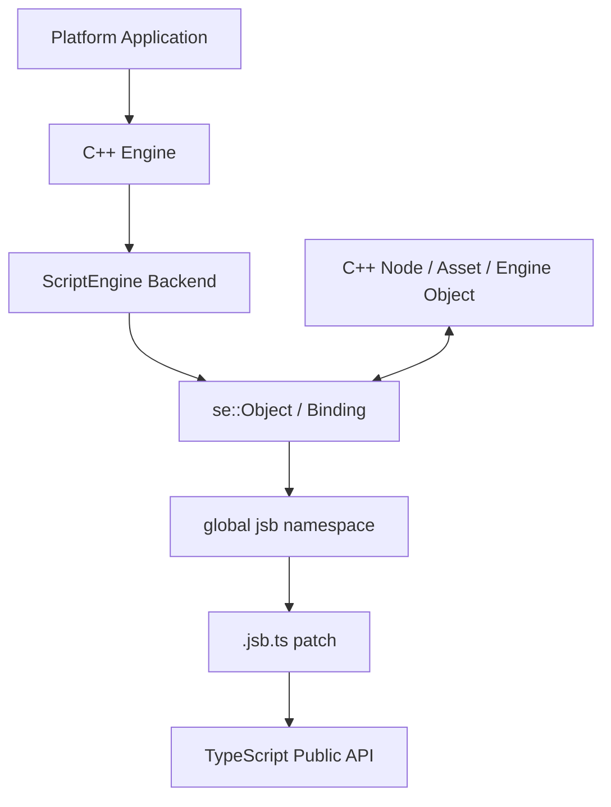
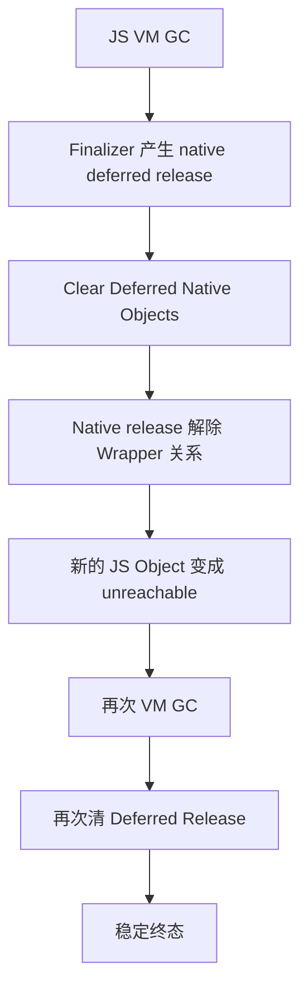

# 双运行时身份收敛：Cocos JSB 的对象映射、引用保活与清理边界

> 系列：从 Cocos Engine 源码理解引擎设计
>
> 日期：2026-08-30
>
> 状态：草稿
>
> 核心问题：Cocos Native 同时拥有 JavaScript / TypeScript 对象世界和 C++ 对象世界时，同一个 Node、Asset 或引擎对象怎样保持稳定身份，又怎样保证任意一侧释放以后不会留下悬空 Wrapper、错误保活或重复对象？
>
> 关键词：Cocos Engine、JSB、Dual Runtime、Object Identity、Lifetime、Bindings

[系列目录](../blog.html)

在 Cocos Creator 的 TypeScript 代码中，我们可以很自然地写：

```text
node.parent = root
node.addComponent(...)
asset.addRef()
```

从调用体验看，这些对象和普通 TypeScript 类没有明显区别。

但在 Native 平台上，一个 `Node` 很可能同时涉及：

```text
TypeScript / JavaScript API
JS VM Object
se::Object Wrapper
C++ Node
native object lifetime
```

于是一个非常简单的问题开始变得不简单：

> 当 TypeScript 中最后一个引用消失时，这个对象到底应该什么时候死？

反过来也一样。

如果 C++ 世界已经准备销毁某个对象，但 JavaScript VM 中还保存着对应 Wrapper：

```text
这个 Wrapper
下一次被访问时
应该命中什么？
```

再进一步，一个 Asset 同时存在：

```text
JavaScript _ref
native refCount
AssetManager release eligibility
```

时，

哪一项才真正代表：

```text
这个资源仍然有人使用？
```

如果把这些概念都压成一句：

```text
JSB 会自动管理生命周期，
```

很多问题最终只会在：

- 场景切换；
- VM Restart；
- Asset Release；
- Native Shutdown；
- GC；
- 编辑器重载；

这些最难排查的时刻暴露出来。

## 先说结论：JSB 真正维护的是两个运行时之间的身份与生命周期协议

**双运行时身份收敛（后文简称“JS 和 C++ 最终必须始终认得这是同一个对象”）**：JavaScript VM 与 native C++ 分别拥有自己的对象、引用和回收规则，JSB 通过 Wrapper、native identity mapping、引用关系和清理协议，使两套对象图在创建、访问、销毁和重启时持续保持一致。

可以先把 Native Cocos 的主要层次压缩成：



这不是：

```text
TypeScript Object
调用
C++ Object
```

那么简单。

真正发生的是：

```text
native 对象
+
VM Wrapper
+
绑定描述
+
脚本层行为 patch
```

共同组成用户最后看到的 API。

## Native Cocos 首先是一套双运行时系统

**双运行时（后文简称“同一个游戏里同时活着一套 JS 世界和一套 C++ 世界”）**：脚本 VM 和 native Engine 分别拥有自己的对象模型、执行规则、内存生命周期和调用栈，并通过绑定层交换状态和行为。

Native 平台的大体结构可以理解为：

```text
Platform Application
  ↓
C++ Engine
  ↓
ScriptEngine
  ↓
JS VM
  ↓
jsb.* Native Bindings
  ↓
TypeScript Engine API
```

这里最容易形成一个错误直觉：

```text
TypeScript 中定义了 Node
→
Node 就由 TypeScript 对象拥有状态。
```

实际并不一定如此。

在 Native 路径中：

```text
export const Node = jsb.Node
```

更接近：

> TypeScript 世界直接把 native binding 暴露出的类作为自己的公共 `Node` 类型，再继续在它的 prototype 上补行为。

也就是说，`.jsb.ts` 通常不是：

```text
再创建一个 TypeScript Shadow Node
```

然后和 C++ Node 手工同步全部数据。

它更多是在已经存在的 native-backed 对象上补足 TypeScript 层需要的公共语义。

## Web API 相似，不代表底层 Owner 相同

这也是阅读 Cocos Engine 源码时最容易混淆的地方。

Web / Minigame 可能主要运行：

```text
TypeScript Engine
→
PAL
→
WebGL / WebGPU / 平台适配层。
```

Native 则可能是：

```text
C++ Engine
→
ScriptEngine
→
JSB
→
.jsb.ts patch。
```

上层都可能暴露：

```text
Node
Asset
Director
Camera
```

但：

> API 形状相似，不代表状态所有权和生命周期实现相同。

所以在源码中看到：

```text
node.ts
node.jsb.ts
native Node.cpp
```

时，第一件事不应该是寻找：

> 哪一份才是真正的 Node？

更准确的问题是：

> 每一层分别拥有什么职责？

## Auto Binding、Manual Binding 和 `.jsb.ts` 是一条接力链

**绑定装配链（后文简称“机械接口自动生成，复杂语义手写，最后再把 TS 表面补完整”）**：Cocos 把跨语言绑定拆成多个职责层，而不是要求一个生成器同时理解所有平台、生命周期和 TypeScript 行为。

可以分成三层。

### Auto Binding

适合规则化内容：

- 构造；
- 属性；
- 方法；
- 可机械表达的参数和返回值。

它的目标是：

> 大量普通 C++ API 不需要人工逐个写 JavaScript Wrapper。

### Manual Binding

适合：

- 特殊容器转换；
- Callback；
- 平台桥；
- 网络；
- Audio；
- GFX；
- Scene；
- Java / ObjC / ArkTS 等复杂交互。

这部分真正承载：

> 无法仅靠类型声明可靠推导的语义。

### `.jsb.ts` Patch

继续负责：

- Prototype Helper；
- EventTarget / CallbacksInvoker 行为；
- Decorator Metadata；
- Serialization；
- Prefab / Editor 规则；
- TypeScript Value Cache；
- Native State 对齐；
- 与纯 TS API 保持兼容形状。

三层关系因此是：

```text
Auto
→
解决机械绑定

Manual
→
解决跨语言复杂语义

.jsb.ts
→
解决脚本层产品 API。
```

而不是：

```text
有 Auto Binding
所以以后不应该存在 Manual Binding。
```

## 生成器不应该承担所有例外

这条设计非常值得迁移。

很多代码生成系统最终都会遇到一个诱惑：

```text
发现一个特殊需求
→
继续往 Generator Template 加 if。
```

时间久了以后：

```text
生成器
```

开始理解：

- VM；
- 平台；
- Asset；
- Scene；
- Thread；
- Callback；
- Editor；
- Serializer。

最后它实际上变成了一个隐藏 Runtime。

更可维护的结构通常是：

```text
大部分规则化 API
→
Generated

少量异常语义
→
Manual Adapter

上层产品行为
→
Runtime Patch。
```

不同层接受不同维护成本。

## ScriptEngine 后端本身又是一层防火墙

Cocos Native 并不只面对一种 JavaScript VM。

底层可以存在不同 ScriptEngine Backend。

绑定注册代码因此不应该到处直接依赖：

```text
V8-specific API
JSVM-specific API
SpiderMonkey-specific API。
```

**脚本后端防火墙（后文简称“绑定代码只认识统一 JS 对象接口，不直接认识每个 VM”）**通过 `se::Object`、`se::State`、`se::Value` 等抽象隔离大量 VM 细节。

这样：

```text
Scene Binding
Asset Binding
GFX Binding
```

可以面向统一 `se::*` 表面。

而：

- Handle Scope；
- GC；
- Finalizer；
- Debugger；
- VM 特殊行为；

仍然留在 Backend 自己处理。

这不是为了假装所有 VM 完全相同。

恰恰相反：

> 正因为底层存在差异，公共 binding 才需要一个明确防火墙。

## 模块注册顺序实际上也是依赖图

Native ScriptEngine 启动时，不是所有绑定模块无序注册。

可以大致理解成：

```text
Global
→
Engine
→
Cocos Manual
→
Platform
→
GFX
→
Network
→
Extension
→
Assets
→
Pipeline
→
Geometry
→
Scene
→
Render / 2D
→
Feature Modules。
```

其中有些依赖是明确存在的。

例如：

```text
Extension
依赖
Network

Pipeline
依赖
Asset。
```

因此：

**绑定注册顺序（后文简称“JS 世界搭起来也有自己的模块依赖拓扑”）**不是普通的文件排列。

ScriptEngine 真正开始执行项目代码以前，

必须先保证：

```text
项目将要引用的 jsb.* namespace
已经按照合法依赖顺序建立。
```

如果这个顺序被错误调整，

表现可能不是编译失败。

而是：

```text
某个模块注册时找不到依赖 Type / Namespace。
```

## Node 展示了“native 拥有数据，TS 补充行为”

Native 路径中的 Node 是很适合观察职责分层的实例。

TypeScript 侧并不是维护一个完全独立的 Node 数据副本。

更接近：

```text
jsb.Node
→
native-backed object

node.jsb.ts
→
在其 prototype 上补 Cocos Creator 需要的脚本行为。
```

例如脚本层可以补：

- Component Helper；
- Node Event；
- Parent / Child Helper；
- Prefab / Serialization；
- Decorator Metadata；
- Component 生命周期接缝；
- Transform Value Object Cache。

而真正底层 Transform、Scene Graph 等核心状态仍可能主要由 native 对象拥有。

因此：

**Native Owner + Script Patch（后文简称“C++ 保存核心事实，脚本层补用户真正需要的操作语义”）**

比：

```text
C++ 和 TypeScript 各有一份完整 Node
```

更接近实际设计。

## 但脚本层 Cache 仍然需要同步协议

这并不意味着：

```text
TypeScript 永远不保存任何状态。
```

出于 API 形状或减少对象创建等原因，

脚本层仍可能维护：

- 临时 Vector；
- Transform Value Object；
- Metadata；
- Component 数组；
- Event 状态。

于是必须继续回答：

> 这些值究竟是权威状态，还是 native 状态的脚本投影？

如果是后者，

系统需要明确：

```text
什么时候从 native 同步
什么时候把脚本修改写回 native
谁拥有最终真相。
```

跨语言系统最危险的不是存在 Cache。

而是：

> 两边都逐渐把自己的 Cache 当成 Authority。

## 一个 native pointer 可能对应多个 Wrapper View

为了避免同一个 native 对象每次跨语言访问都创建新的 Wrapper，

系统需要：

**跨语言身份映射（后文简称“看到同一个 C++ 对象时尽量找到原来的 JS Wrapper”）**。

概念上可以理解为：

```text
native pointer
→
se::Object wrapper。
```

但当前映射并不是简单的一对一 HashMap。

它允许：

```text
同一个 native pointer
```

在不同 class view / binding 情况下存在多个 Wrapper 条目。

因此数据结构需要同时考虑：

```text
Native Identity
+
JSB Class Type。
```

同一个：

```text
pointer + class
```

有效情况下仍应保持唯一 Wrapper。

这比简单：

```text
Dictionary<void*, JSObject>
```

更接近真实跨语言类型系统。

## Identity Map 解决的是“它是谁”，不是“它该不该活”

这是整套生命周期里最重要的区分之一。

假设：

```text
pointer map
```

中仍然能够找到某个 Wrapper。

这只能证明：

> 当前映射系统仍然知道这个 native identity 曾对应哪个 wrapper。

它不能证明：

```text
JS VM 必须继续保活这个 Wrapper。
```

也不能证明：

```text
native object 仍然有业务 Owner。
```

所以：

**身份映射（即“它是谁”）**

和：

**生命周期所有权（即“谁负责让它继续存在”）**

必须分开。

这与很多 Handle 系统都相同。

一个 Dictionary 能够找到对象，

从来不意味着它就应该成为该对象的 Owner。

## JSB 中至少存在五种容易混淆的引用关系

可以把常见动作拆成：

| 机制 | 真正表达的含义 |
|---|---|
| Private Data | Wrapper 当前绑定哪份 native 数据或 holder |
| Native Pointer Map | 从 native identity 能否重新找到 Wrapper |
| Wrapper Ref | C++ 侧 `se::Object` Wrapper 本身的引用关系 |
| VM Root | JavaScript GC 是否允许回收这个 JS Object |
| Attach / Detach | Wrapper 与 Wrapper 之间是否建立强可达关系 |

除此之外，

Cocos native 对象自己还可能拥有：

```text
native RefCount
```

AssetManager 又可能维护：

```text
JS _ref。
```

所以实际生命周期不是：

```text
refCount > 0
→
活着。
```

而是一张跨多个 Owner Domain 的关系图。

## Root 不等于 Native Ownership

**VM Root（后文简称“告诉 JavaScript GC 现在不要收这个 Wrapper”）**只解决 VM 可达性。

它不自动回答：

```text
Native Object
为什么应该继续活着？
```

一个 Wrapper 可以被 root，

但 native 业务状态已经没有合法 Owner。

这会造成：

```text
JS 对象一直活着
但底层对应对象已经处于错误生命周期。
```

反过来，

native refCount 仍然大于零，

也不能自动推出：

```text
JS Wrapper 必须被 root。
```

因为该 native 对象可能：

- 只被其他 C++ 系统使用；
- 暂时不需要暴露给 JS；
- Wrapper 可以以后重新建立。

把两种 Ref 都叫：

```text
reference
```

非常容易产生误释放。

## Attach / Detach 解决的是 Wrapper 之间的可达关系

假设 Wrapper A 逻辑上拥有 Wrapper B。

如果 VM 只知道：

```text
A
```

却没有任何关系把 B 保持可达，

B 可能被 GC。

因此可以建立：

```text
A
→
attach B。
```

它表达：

> 只要 A 这一层 Wrapper 关系仍然成立，B 也应该继续处于 JS 可达图中。

这与：

```text
A native object
拥有
B native object
```

仍然不是同一个合同。

跨语言对象图经常需要：

```text
JS Graph
```

和：

```text
Native Graph
```

分别存在，

再通过 binding 保证二者不会长期互相矛盾。

## Asset 展示了“双层引用计数”问题

Asset 是另一个非常直观的例子。

脚本层可以维护：

```text
Asset._ref。
```

Native 对象又拥有自己的：

```text
native ref。
```

当调用：

```text
addRef
```

时，

可以同时推进：

```text
JS AssetManager ownership
+
native object protection。
```

当调用：

```text
decRef
```

时，

两层状态也需要同步收敛。

但两者仍然服务不同 Owner。

**业务资源引用（后文简称“AssetManager 认为还有没有系统在使用资源”）**

和：

**native 对象引用（后文简称“C++ 对象现在是否允许真正析构”）**

不是一回事。

它们通常应该一致推进。

却不能因此被合并成一个没有语义名称的：

```text
refCount。
```

## 双账本最危险的是发生漂移

假设：

```text
JS _ref = 0
```

但 native ref 仍然异常保留。

结果可能是：

```text
AssetManager
认为资源已经可以释放

native object
却一直无法析构。
```

这是一种泄漏。

反过来：

```text
JS _ref > 0
```

但 native protection 过早消失，

就可能形成：

```text
脚本仍然认为自己拥有 Asset
底层对象却已经进入销毁。
```

这是更加危险的生命周期错误。

因此跨语言引用桥最重要的要求不是：

```text
两边都有 RefCount。
```

而是：

> 每一个增减操作都必须拥有明确、可验证的双边状态转换。

## Cleanup 无法简单“一边清完，再清另一边”

这是 JSB 生命周期最有价值的另一个设计点。

假设 ScriptEngine 开始 Shutdown。

一种很自然的做法是：

```text
先执行一次 JS GC
→
再释放全部 native object。
```

问题在于：

```text
JS GC
```

执行 Finalizer 时，

可能把某些 native 对象放入：

```text
Deferred Release Pool。
```

随后清理这些 native 对象，

又可能解除最后一条 Wrapper 关系。

于是 JavaScript 世界又出现：

```text
新的可回收对象。
```

所以单轮：

```text
GC
→
native clear
```

不一定已经完成。

## 多轮清理是跨语言对象图的固定点求解

**多轮清理收敛（后文简称“JS 清一次会影响 C++，C++ 清一次又可能让 JS 再多出垃圾”）**：VM GC 和 native deferred release 交替推进，直到跨语言引用图进入稳定终态。

概念上可以表示为：



这实际上是一种小型固定点求解：

```text
直到
JS 可达图
与
Native 生命周期图
都不再产生新的待清理状态。
```

这是跨 Managed / Native Runtime 都非常值得借鉴的思想。

## Shutdown 顺序本身也是生命周期合同

Engine Shutdown 不能随便写成：

```text
delete everything。
```

某些 ScriptEngine cleanup 逻辑仍然可能访问：

- GPU Resource；
- Event；
- Scheduler；
- native system；
- binding state。

因此：

```text
谁先销毁
谁后销毁
```

本身就是架构不变量。

例如，如果 ScriptEngine cleanup 仍然需要检查 GPU 资源使用，

就不能：

```text
先彻底销毁 GFX Owner
→
再 Cleanup VM。
```

否则 cleanup code 进入的将是已经无效的系统。

所以：

**销毁拓扑（后文简称“初始化有依赖顺序，关闭同样有逆向依赖顺序”）**

不能被当成普通实现细节。

## Restart 应该被视作整套 VM Identity Reset

Native Engine 可能支持：

```text
Restart VM。
```

最危险的理解是：

```text
旧 Wrapper 还在
→
重新连一下新 VM。
```

一个 VM Restart 更合理的语义是：

```text
旧脚本运行时结束
→
旧 Wrapper Identity 终止
→
旧 Class Mapping 清理
→
重新创建 ScriptEngine Runtime
→
重新注册模块
→
重新执行 Adapter / Main Script。
```

**运行时身份重建（后文简称“重启以后重新建立整张 JS/native 身份图”）**

比：

```text
尽量复用旧 Wrapper
```

更容易维持正确性。

因为旧 Wrapper 的：

- VM Identity；
- Handle；
- Class Type；
- Root；
- Closure；

都属于旧运行环境。

## 稳定帧边界比任意回调栈内 Restart 更安全

Restart 同样不适合：

```text
任意用户回调
→
立即销毁当前 VM。
```

此时调用栈中可能还有：

- JS Function；
- Binding State；
- Native Callback；
- GFX Resource；
- Event Iteration。

更稳健的模型是：

```text
记录 restart requested
→
等待稳定 Tick Boundary
→
统一 teardown
→
统一 rebuild。
```

这与 Scene Mutation、ECS Structural Mutation、资源 Strong Clear 的很多设计都属于同一类思想：

> 高破坏性生命周期动作应该在明确 Safe Point 提交。

## Native Script 文件读取与对象生命周期是两个不同问题

Native JSB 还可能处理：

- `.js`；
- `.jsc`；
- 解密；
- gzip。

这些能力属于：

```text
脚本部署与读取合同。
```

它们不应该因为存在：

```text
XXTEA
```

之类过程，就被误写成：

```text
强安全边界。
```

密钥和解密逻辑依然在客户端运行环境中。

这与对象身份、Wrapper 生命周期是另一层问题。

把部署加密和 Runtime Ownership 混起来，通常只会让威胁模型失真。

## 常见失败一：pointer map 成为过期身份缓存

如果 native object 已经销毁，

但：

```text
Native Pointer Map
```

仍然保留旧 wrapper entry，

未来相同地址被复用以后，

系统可能错误命中：

```text
上一代对象的 Wrapper。
```

因此 Identity Map 必须参与：

```text
对象注销 / cleanup。
```

它不能是一个只增加、不删除的缓存。

## 常见失败二：Wrapper Root 泄漏

一个 wrapper 因为：

```text
root()
```

被 VM 永久视为可达，

即使实际业务关系已经结束，

GC 仍然不能回收它。

如果 Wrapper 又通过 attach graph 间接保活其他对象，

最终泄漏的可能不是一个对象。

而是一整张 Wrapper 子图。

这也是为什么：

```text
root
```

应该被理解成高权力生命周期动作。

而不是普通“防止变量消失”的便利函数。

## 常见失败三：native ref 与业务 ref 漂移

Asset 已经展示过这一问题。

类似情况也可能出现在其他资源对象。

因此引用计数 API 最好使用语义化命名：

```text
WrapperRef
NativeObjectRef
AssetUsageRef
VMRoot
```

而不是全都叫：

```text
AddRef
Release。
```

接口名字本身就是维护人员理解 Ownership Graph 的第一层工具。

## 常见失败四：先销毁低层 Owner，再让 VM Cleanup 访问它

这类问题最容易出现在 Shutdown / Restart。

平时运行完全正常。

只有：

```text
退出游戏
热重启
切换 Runtime
```

才发生崩溃。

因此跨语言系统的生命周期测试不能只覆盖：

```text
调用功能正确。
```

还必须覆盖：

```text
Initialize
Use
Release
Restart
Shutdown。
```

完整周期。

## 常见失败五：把 `.jsb.ts` 当成 Shadow State Owner

如果维护者认为：

```text
TypeScript Node
```

和：

```text
native Node
```

是两个平行 Authority，

很容易开始在两边增加：

```text
同名字段
同名缓存
各自生命周期判断。
```

最终所有功能都需要：

```text
手工双向同步。
```

更准确的第一步应该是：

> 先确认这个字段究竟由哪一侧拥有，再决定另一侧是否需要 cache 或 projection。

## 与普通 FFI 的区别

一个简单 Foreign Function Interface 可能只是：

```text
JS
→
调用 C function
→
得到结果。
```

JSB 需要解决的内容更多：

- 长生命周期对象；
- 对象 identity；
- 类系统；
- Prototype；
- Event；
- GC；
- native ref；
- ScriptEngine restart；
- Asset lifecycle；
- Scene lifecycle。

因此 Cocos JSB 更接近：

> 一套跨运行时对象系统。

而不是：

> 一组 C++ 函数绑定。

## 与 Godot ObjectID / RefCounted 模型的边界

Godot 的 ObjectID、RefCounted、Ref 和 WeakRef 主要解决：

```text
同一个 native 对象系统内部
怎样区分身份、强所有权和弱观察关系。
```

Cocos JSB 面对的是更复杂的一层：

```text
native C++ object graph
+
JavaScript VM object graph。
```

因此还需要：

- Wrapper；
- native pointer mapping；
- VM root；
- attach graph；
- ScriptEngine backend；
- binding metadata。

两个主题共享：

```text
身份
≠
所有权。
```

这一原则。

但 Cocos 额外处理的是：

> 两套垃圾回收 / 引用体系如何保持同一对象事实。

## 与资源 Lease 系统的边界

资源 Lease 通常表达：

```text
哪个业务 Scope
拥有一次 Asset Acquire。
```

JSB Asset `_ref` 与 native ref 的问题更底层。

它首先解决：

```text
脚本资源状态
怎样和 native 对象状态保持一致。
```

这并不能替代：

- Gameplay Scope；
- Scene Scope；
- Warmup Ownership；
- Asset Lease。

反过来，

业务 Asset Lease 也不能替代 VM Wrapper 生命周期。

一个成熟引擎完全可能同时需要：

```text
JS/native lifecycle bridge
+
business asset ownership。
```

二者不要因为都出现：

```text
Ref
```

就强行统一。

## 对自研跨语言框架的迁移方式

如果一个自研引擎需要：

```text
C++ Core
+
C# / Lua / JavaScript Gameplay
```

我会首先明确六层状态。

### Native Identity

```text
native object id / pointer
```

回答：

> C++ 世界里它是谁？

### Managed Wrapper Identity

回答：

> 脚本 Runtime 里哪一个对象代表它？

### Mapping

回答：

> 怎样从一侧稳定找到另一侧？

### VM Reachability

回答：

> 脚本 GC 是否允许回收 Wrapper？

### Native Lifetime

回答：

> native object 当前由谁保证存活？

### Business Ownership

回答：

> 业务层为什么还需要这个对象？

只要六个概念仍然被叫做：

```text
reference，
```

后续生命周期几乎一定会变得难以审计。

## 对绑定生成器的迁移方式

绑定生成器最好只承担：

```text
规则化、可证明的机械工作。
```

例如：

- 类型映射；
- 普通 method；
- property；
- enum。

真正涉及：

- Callback Lifetime；
- Ownership Transfer；
- Async Completion；
- Thread Affinity；
- Platform-specific Semantics；

时，

更适合进入显式 Manual Adapter。

否则 Generator Template 很快会变成：

```text
几十个特殊 if。
```

而这些 if 最终实际上是隐藏的业务生命周期。

## 对 Wrapper Map 的迁移方式

跨语言 Identity Map 至少要回答：

```text
Key 是什么？
Class / Type 是否参与身份？
地址复用怎么处理？
对象销毁时谁删除 Mapping？
VM Restart 时谁整体重建？
```

如果直接使用：

```text
void* → ManagedObject
```

而没有：

- Type；
- Generation；
- Cleanup；
- Runtime Instance；

概念，

很容易在地址复用和热重载后产生旧 Wrapper 复活。

## 对 Shutdown 的迁移方式

一个跨语言 Runtime 的 Shutdown 更适合设计成：

```text
Stop New Work
↓
Detach Gameplay
↓
Run VM GC / Finalizers
↓
Drain Native Deferred Release
↓
Repeat Until Stable / Bounded
↓
Cleanup Binding Metadata
↓
Destroy Lower Runtime Owners。
```

而不是：

```text
delete VM
delete Engine
```

两行结束。

其中：

```text
多轮
```

并不意味着无限循环。

系统仍然需要：

- 有界次数；
- 明确诊断；
- 如果无法收敛则报告残留关系。

## 测试重点不应该只放在“绑定能不能调用”

绑定系统最容易拥有的测试是：

```text
JS 调 C++
→
返回值正确。
```

这只能证明调用通道。

更高价值的生命周期测试还应该覆盖：

```text
同一个 native object
多次进入 JS
→
是否复用合法 wrapper

JS reference 消失
→
native object 是否按合同存活

native owner 释放
→
wrapper 后续访问是否安全失败

attach / detach
→
GC 行为是否正确

Asset addRef / decRef
→
双账本是否保持一致

VM restart
→
旧 mapping 是否完全失效

Engine shutdown
→
GC / deferred release 是否最终收敛。
```

跨语言 Bug 往往不会出现在第一次调用。

它们更喜欢出现在最后一次释放。

## 我的 JSB / 双运行时生命周期检查表

1. 脚本 API 与 native 实现是否明确区分状态 Owner？
2. Web 和 Native 同形 API 是否不会被误解成相同内部生命周期？
3. Auto Binding、Manual Binding 与 Script Patch 是否拥有明确职责边界？
4. 生成器是否只承担规则化机械转换？
5. 特殊 Callback / Ownership 是否进入显式 Manual Adapter？
6. ScriptEngine backend 是否通过统一 API 与业务绑定隔离？
7. VM-specific GC / finalizer 行为是否被限制在 Backend 边界？
8. 模块 Binding Registration 是否拥有依赖顺序？
9. 项目脚本执行以前所需的 `jsb.*` namespace 是否已经完整建立？
10. `.jsb.ts` 是否清楚区分 native authority 与脚本 cache？
11. Native Identity 与 JS Wrapper Identity 是否是两个概念？
12. Pointer Map 是否考虑 class/type 维度？
13. 同一个 native pointer + class 是否保持唯一合法 wrapper？
14. Pointer Map 是否不会被误用成生命周期 Owner？
15. Wrapper Private Data 是否不会被误解成强保活？
16. Wrapper Ref 与 VM Root 是否拥有不同语义？
17. Root / Unroot 是否严格成对并可观测？
18. Attach / Detach 是否只表达 Wrapper Graph 可达性？
19. Native RefCount 是否与 VM Reachability 分开？
20. AssetManager `_ref` 是否与 native object ref 分开？
21. 双层引用增减是否有确定状态转换？
22. 双账本漂移是否有诊断能力？
23. native object 销毁时是否清理 Identity Mapping？
24. 地址复用是否不会命中上一代 Wrapper？
25. VM GC 是否允许触发 native deferred release？
26. Native release 是否可能继续改变 JS 可达图？
27. Cleanup 是否允许多轮有界收敛？
28. Shutdown 是否拥有明确逆向依赖顺序？
29. ScriptEngine Cleanup 依赖的底层 Owner 是否不会过早销毁？
30. Restart 是否重建 VM Identity，而不是复用旧 Wrapper？
31. 高破坏生命周期操作是否发生在稳定 Safe Point？
32. `.jsc` / Script Encryption 是否不会被错误描述成强安全边界？
33. 跨语言错误是否能够区分 Missing Mapping、Dead Native、Dead Wrapper 与 Ref Drift？
34. 测试是否覆盖 GC、Release、Restart 和 Shutdown，而不仅是函数调用？
35. 当前系统中的每一种“Ref”是否都能回答：它究竟在保护哪一层生命周期？

Cocos JSB 最容易被一句：

```text
JavaScript 调用 C++。
```

概括掉。

这句话没有错。

但它只描述了最简单、也是最不危险的一次函数调用。

真正长期存在的问题是：

```text
调用结束以后
对象还会继续存在。
```

JavaScript VM 有自己的可达图。

C++ Engine 有自己的对象图。

AssetManager 又有自己的业务引用。

Wrapper 还需要保持对象身份。

不同 VM Backend 继续拥有自己的 GC 与 Finalizer。

所以跨语言绑定真正困难的地方不是：

> 怎样把一个 `Vector3` 参数传给 C++。

而是：

> **怎样让两套运行时在数千帧、场景切换、资源释放和 VM 重启之后，仍然对“这个对象是谁、为什么还活着、什么时候可以死”保持同一个答案。**

Auto Binding 负责减少机械代码。

Manual Binding 负责表达无法自动生成的语义。

`.jsb.ts` 负责把 native-backed 对象补成上层真正需要的 TypeScript API。

Pointer Map 保持身份。

VM Root 保持脚本可达性。

Native Ref 保护 C++ 对象。

业务 `_ref` 决定资源是否仍有人使用。

Cleanup 则让这些不同账本最终重新归零。

这也是 JSB 最值得迁移到其他跨语言引擎中的设计思想：

> **跨语言桥接不是一次函数调用协议，而是一套跨两个对象世界持续维持身份、所有权和销毁顺序的一致性协议。**

## 术语对照

| 正式术语 | 文中通俗称呼 |
|---|---|
| 双运行时身份收敛 | JS 和 C++ 最终必须始终认得这是同一个对象 |
| 双运行时 | 同一个游戏里同时活着一套 JS 世界和一套 C++ 世界 |
| 绑定装配链 | 机械接口自动生成，复杂语义手写，最后再把 TS 表面补完整 |
| 脚本后端防火墙 | 绑定代码只认识统一 JS 对象接口，不直接认识每个 VM |
| 绑定注册顺序 | JS 世界搭起来也有自己的模块依赖拓扑 |
| Native Owner + Script Patch | C++ 保存核心事实，脚本层补用户真正需要的操作语义 |
| 跨语言身份映射 | 看到同一个 C++ 对象时尽量找到原来的 JS Wrapper |
| 身份映射 | 它是谁 |
| VM Root | 告诉 JavaScript GC 现在不要收这个 Wrapper |
| 业务资源引用 | AssetManager 认为还有没有系统在使用资源 |
| native 对象引用 | C++ 对象现在是否允许真正析构 |
| 多轮清理收敛 | JS 清一次会影响 C++，C++ 清一次又可能让 JS 再多出垃圾 |
| 销毁拓扑 | 初始化有依赖顺序，关闭同样有逆向依赖顺序 |
| 运行时身份重建 | 重启以后重新建立整张 JS/native 身份图 |

---

## 内部资料依据

本文主要基于以下材料整理：

- `notes/CocosEngine源码研究/02_跨语言与原生/01_JSB双运行时_Application绑定装配与对象生命周期.md`
- `notes/CocosEngine源码研究/01_运行时与场景/01_Game到Director_初始化分层双时钟与首帧状态机.md`
- `notes/CocosEngine源码研究/01_运行时与场景/02_Scene_Node_Component生命周期_激活重入与延迟销毁.md`
- `notes/CocosEngine源码研究/03_资源系统/01_AssetManager从请求到释放_管线依赖与循环引用.md`
- `notes/CocosEngine源码研究/04_渲染系统/01_Root到GFX_相机提取管线提交与Present.md`
- `notes/CocosEngine源码研究/README.md`
- `blogs/README.md`
- `blogs/publication.v1.json`

本文主要依据 Cocos Engine 3.8.9 的当前源码研究笔记整理。

当前研究已经通过源码静态对照闭合：

- Application / Engine / ScriptEngine 的装配关系；
- ScriptEngine backend 抽象；
- Auto / Manual / `.jsb.ts` 三层 binding；
- Module Registration 顺序；
- Node native owner 与 TypeScript patch；
- Asset JS/native 双引用；
- Native Pointer → Wrapper Mapping；
- root / unroot；
- attach / detach；
- DeferredReleasePool；
- Engine destroy / restart。

但当前研究没有完成所有 ScriptEngine Backend 的运行时矩阵验证，也没有找到一条单独覆盖 Node / Asset patch、GC、DeferredReleasePool、Restart 和 Shutdown 的完整跨后端 E2E 测试。

因此本文不声称：

- V8、JSVM、SpiderMonkey 等所有后端在所有生命周期边界上已经被运行证明完全一致；
- Pointer Map 本身能够保证对象生命周期安全；
- VM Root 等价于 native 对象所有权；
- Asset `_ref` 与 native RefCount 永远天然同步；
- `.jsb.ts` 中所有字段都只是 Cache，而不存在具有脚本层所有权的状态；
- JSB 当前实现能够证明所有平台的热重启与 Shutdown 都不存在残留对象。

文中将 Identity Mapping、VM Reachability、Native Lifetime、Business Ownership 和多轮 Cleanup 分离的思想迁移到其他 C++ / C# / Lua / JavaScript 引擎桥接，属于工程设计归纳，不表示其他系统需要复制 Cocos 的 `se::Object`、JSB Namespace 或具体 RefCount 实现。
