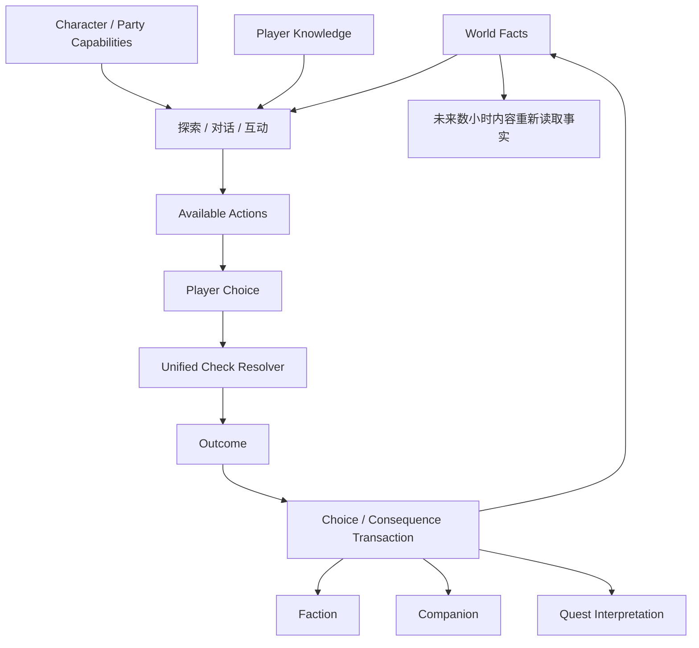

# 反应式世界状态：CRPG 的统一检定、失败推进与长期后果传播

> 系列：游戏系统的共同语言
>
> 日期：2026-09-08
>
> 状态：草稿
>
> 核心问题：CRPG 怎样让角色能力、队伍成员、知识与历史行为真正决定玩家能尝试哪些事情，并让一次对话或检定的结果在数小时后仍然成为世界事实，而不是只在当前 Dialogue Tree 中改变一个 Flag？
>
> 关键词：CRPG、World State、Skill Check、Fail Forward、Choice Transaction、Companion

[系列目录](../blog.html)

玩家来到一座城门前。

守卫拒绝让队伍进入。

系统给出几个选择：

```text
[Persuasion]
说服守卫。

[Intimidation]
威胁他。

[Noble]
以贵族身份要求放行。

[Arcana]
指出城门上的魔法封印其实已经失效。

[Leave]
寻找其他路线。
```

玩家选择：

```text
Persuasion。
```

检定失败。

如果这是一个普通的“分支选项系统”，结果可能只是：

```text
FAIL
→
回到上一个对话节点。
```

玩家读档。

再次点击。

直到成功。

但一个真正反应式的 CRPG 可以让失败本身进入世界：

```text
守卫提高警戒
↓
谈判成本增加
↓
某些选项关闭
↓
玩家改走贿赂或潜入

数小时以后
↓
该地区阵营已经记录
“这支队伍曾试图欺骗守卫”。
```

队伍中的某名 Companion 甚至可能：

```text
赞赏你的胆量
```

而另一名 Companion：

```text
认为你破坏了当地秩序。
```

真正让这种游戏成立的，并不是：

```text
Dialogue Tree 很大。
```

而是：

> **世界能够记住选择所改变的事实，并在未来重新读取这些事实。**

## 先说结论：CRPG 的核心运行时应该是反应式 World State，而不是 Dialogue Flag 集合

**反应式世界状态（后文简称“世界会记住发生过什么，并在以后继续使用这些事实”）**：探索、对话、任务、阵营、角色和战斗共同读取同一组长期世界事实，玩家选择经过统一规则验证后提交为正式变化，后续内容再次根据这些事实决定可见选项和结果。

可以先压缩成：



真正重要的是：

```text
Dialogue
Quest
Faction
Companion
```

都不能各自维护互相矛盾的“世界”。

## World Fact 应该描述世界，而不是描述脚本走到哪里

非常常见的内容状态是：

```text
quest_42_step_5_done = true。
```

这种 Flag 对当前脚本很方便。

但它没有表达：

> 世界究竟发生了什么？

更有领域意义的 Fact 可能是：

```text
Character.Alric.Alive = false

Settlement.RedVale.Controller = Rebels

Faction.MerchantLeague.Attitude = Hostile

World.Well.Poisoned = true

Party.Knows.WellPoisonSource = true。
```

这些事实可以被：

- Quest；

- Dialogue；

- Faction；

- Companion；

- Encounter；


共同读取。

这就是：

**领域世界事实（后文简称“记录发生了什么，而不是记录哪段脚本跑完了”）**。

## Dialogue、Quest 与 NPC Script 不能各自拥有一套真相

假设：

```text
NPC Script
认为国王已死。

Quest Flag
仍然认为国王活着。

Dialogue
仍然允许和国王讨论明天的会议。
```

每一个子系统内部可能都“没有 Bug”。

真正的问题是：

```text
它们没有共享 Authority。
```

所以高层内容系统应该更多：

```text
读取 World Fact
```

而不是：

```text
自己保存真正世界状态。
```

Quest 尤其容易变成 God Object。

它不应该决定：

```text
门是否真的打开
NPC 是否真的死亡
城市是否真的毁灭。
```

Quest 更适合承担：

**玩家进度解释（后文简称“把已经发生的世界事实整理成玩家当前应该理解的任务状态”）**。

## 对话中说出的内容也不等于世界真相

NPC 说：

```text
“国王已经死了。”
```

这只是：

```text
Dialogue Statement。
```

它可能：

- 正确；

- 撒谎；

- 误解；

- 传闻。


所以：

```text
Dialogue Text
```

不能直接成为：

```text
World Truth。
```

这里自然产生另一层重要区分。

## World Truth 和 Player Knowledge 必须分开

世界真实事实：

```text
Assassin = NPC A。
```

玩家是否知道：

```text
完全是另一个状态。
```

**玩家知识（后文简称“世界已经是真的，但我的队伍有没有发现这件事”）**可以决定：

- Dialogue Option；

- Journal；

- Accusation；

- Quest Route；

- Investigation。


例如：

```text
Party.Knows.AssassinIdentity = true。
```

这份 Knowledge 可以被多个完全不同 Quest 重新使用。

因此 Knowledge 不应该只是：

```text
某个 Quest 的内部 Flag。
```

它是一种跨内容资产。

## 角色能力首先是一种“内容访问权限”

RPG 属性最容易被理解成：

```text
Strength
→
Damage。

Intelligence
→
Spell Power。
```

CRPG 更有意思的一层是：

> **Build 会改变玩家能够看见和尝试哪些内容。**

Strength 可以：

- 撬门；

- 搬石头；

- 威胁；

- 破坏障碍。


Intelligence 可以：

- 解读古文；

- 识别魔法；

- 推导仪式。


Background：

```text
Noble
```

可以影响：

- NPC 认知；

- Faction Access；

- Dialogue；

- Starting Knowledge。


所以：

**能力可达性（后文简称“Build 不只决定效率，还决定哪些解决方式进入你的行动菜单”）**

是传统 CRPG 最重要的角色成长价值之一。

## 如果 Build 只改变战斗数值，Role Playing 会明显收缩

玩家开局选择：

```text
Criminal
Scholar
Noble
Cleric
Veteran。
```

如果这些 Background 最终只改变：

```text
+2 某属性
```

但世界从来不承认它们，

角色创建很快会变成：

```text
战斗 Build 配点。
```

真正有角色扮演意义的身份应该进入：

```text
World Reaction。
```

例如：

```text
Criminal
→
某些地下组织更容易接纳

Noble
→
某些守卫愿意听你说话

Local
→
知道当地信息

Outsider
→
被某些人怀疑。
```

角色是谁，

因此不只存在于 Character Sheet。

## 所有能力检定最好通过统一 Check Engine

如果 Dialogue 写：

```text
if persuasion > 10
```

Interaction 写：

```text
if strength + random > 15
```

Quest 再写另一套：

```text
skill * 1.5 > difficulty，
```

玩家根本无法形成统一 Rulebook 心智模型。

同一个 Character Sheet：

```text
在不同系统里
按照不同秘密公式工作。
```

所以：

**统一检定引擎（后文简称“整个游戏用同一种规则解释你的能力”）**

应该服务于：

- Dialogue；

- Exploration；

- Interaction；

- Passive Discovery；

- Quest；

- 必要时 Combat 外的其他规则。


它至少需要知道：

```text
谁在检定
使用什么能力
当前难度
有哪些 Modifier
随机源
结果等级。
```

## 检定结果不应该只有 Success / Failure

传统二值结果：

```text
成功
失败。
```

很容易制造：

```text
失败
=
什么都没有发生。
```

CRPG 更适合支持：

```text
Critical Success
Success
Partial Success
Failure
Critical Failure。
```

**结果等级（后文简称“不是只有开门和不开门，中间也可以有代价”）**

给内容作者更多后果空间。

例如 Persuasion：

```text
Success
→
免费通过。

Partial
→
可以通过，但支付更高费用。

Failure
→
拒绝，并提高警戒。

Critical Failure
→
对方识破谎言，并通知其他守卫。
```

一次 Roll 因此真正改变：

```text
后续问题。
```

## 失败应该改变故事，而不是停止故事

**Fail Forward（后文简称“失败以后进入另一条更麻烦的路，而不是逼玩家读档”）**是 CRPG 很重要的内容原则。

如果每一个 Skill Check：

```text
失败
→
永久失去唯一正确内容
```

玩家自然学会：

```text
Quicksave
Roll
失败
Load。
```

随机检定最后变成：

```text
重复读档直到系统同意。
```

更健康的失败可以产生：

- 更高成本；

- 新敌人；

- 新警戒；

- 较差信息；

- Companion Reaction；

- Faction Penalty；

- 替代路线。


玩家仍然愿意成功。

但失败不再意味着：

```text
停止游戏。
```

## Fail Forward 也不能让成功失去价值

另一极端同样有问题。

如果失败永远：

```text
只是换一句文本
最后结果完全相同，
```

玩家会觉得：

```text
能力和 Roll 都是装饰。
```

所以失败推进的核心不是：

```text
所有结果都一样。
```

而是：

> **所有结果都能继续，但进入的成本、资源、关系和未来状态不同。**

成功购买：

```text
更好的世界状态。
```

失败购买：

```text
新的问题。
```

两者都推进游戏。

## Passive Check 不能每帧重复 Roll

假设队伍走到陷阱旁。

系统每帧：

```text
Perception Check。
```

即使成功率只有：

```text
10%。
```

玩家只要站在旁边足够久：

```text
迟早一定成功。
```

这会破坏概率意义。

所以 Passive Check 应该围绕：

**Check Opportunity（后文简称“这次发现机会到底算不算已经用过”）**。

例如：

```text
DiscoveryOpportunityId。
```

同一机会：

```text
只 Roll 一次。
```

只有条件真正改变时：

```text
新的成员加入
获得新的线索
光照条件变化
```

才重新开放机会。

这是一项很适合调查、探索和隐蔽信息系统的规则。

## Party 不只是四个战斗单位

CRPG 的 Party 最容易被简化成：

```text
Tank
Damage
Heal
Support。
```

但在世界层面，

不同 Companion 还提供：

- Skill；

- Background；

- Knowledge；

- Faction Identity；

- Interjection；

- Personal Values；

- 特殊互动。


因此：

**队伍能力集合（后文简称“你带谁同行，会改变这趟旅程能看到什么”）**

本身就是内容状态。

一个 Rogue：

```text
不只提供 Combat DPS。
```

还可能提供：

```text
Lockpicking
Criminal Contact
Trap Knowledge。
```

一个 Scholar：

```text
不只提供法术。
```

还可能看懂：

```text
Ancient Text。
```

Party Composition 于是直接改变：

```text
可见内容空间。
```

## “队伍里有人会”不代表任何人都能执行

假设：

```text
Party.HasSkill(Lockpicking, >=12)
```

为真。

真正执行检定的角色仍然应该记录：

```text
Rogue。
```

因为结果可能影响：

- 个人成长；

- Companion Reaction；

- 装备 Modifier；

- 失败后果。


某些对话还可能规定：

```text
NPC 只接受主角谈判。
```

这时即使后排 Bard Charisma 更高，

也不能无条件：

```text
自动代打检定。
```

所以：

```text
Capability Query
```

和：

```text
Check Actor
```

是两件事。

## Companion 必须同时是战斗 Actor 和叙事 Actor

一个 Companion 如果只有：

```text
Combat Skills
+
营地里几段固定剧情，
```

队伍和反应世界仍然是两套分离系统。

更完整的 Companion 可以拥有：

- Values；

- Personal Goal；

- Trust；

- Respect；

- Alignment；

- Memory；

- Personal Quest；

- Interjection；

- Leave Condition。


玩家重大 Choice 以后，

Reaction System 可以查询：

```text
Choice Tags
+
Companion Values
+
Context
+
Past Memory。
```

得到：

```text
Approval Change
Interjection
Confrontation
Quest
Leave Party。
```

Companion 因此不是：

```text
剧情结束后恢复成战斗棋子。
```

它一直存在于世界反应中。

## Companion Relation 不适合只有一个“好感度”

一个角色可以：

```text
非常尊敬玩家能力
```

但：

```text
强烈反对玩家立场。
```

如果只有：

```text
Approval = 52，
```

两种关系会被压成无法解释的平均值。

内部可以分别维护：

```text
Trust
Respect
Affection
Ideological Alignment。
```

正式 UI 当然可以简化。

但系统仍然知道：

> 这名角色究竟因为什么继续同行，又因为什么正在接近冲突。

## 不能为每一个 Choice 手写所有 Companion 反应

假设：

```text
20 Companion
×
500 Choices。
```

全部手写：

```text
Choice A
if Serra ...
if Alric ...
if ...
```

内容成本会迅速爆炸。

一种更系统化的结构是：

```text
Choice Semantic Tags
+
Companion Value Profile
+
Important Specific Overrides。
```

例如 Choice 标记：

```text
Merciful
Cruel
Greedy
Lawful
Betrayal
ProtectWeak。
```

普通 Reaction：

```text
由 Value Profile 推导。
```

真正关键剧情再写：

```text
Specific Reaction。
```

这就是：

> **系统规则负责覆盖广度，手工内容负责高价值例外。**

## Conversation 不是 Dialogue Node 链表

一次真正 CRPG 对话可能同时：

- 改变 Item；

- 扣钱；

- 触发 Skill Check；

- Companion 插话；

- NPC 离开；

- Faction 改变；

- Combat 启动。


所以 Conversation 更适合拥有正式 Runtime State：

```text
Entering
NPCSpeaking
PlayerChoosing
ResolvingCheck
ResolvingConsequences
Interjection
Exiting
Interrupted。
```

Dialogue Node 则主要描述：

- Text；

- Speaker；

- Conditions；

- Choices；

- Presentation；

- Semantic Tags。


节点不是业务 God Object。

## Availability、Resolution 与 Consequence 必须分离

假设存在选项：

```text
[Noble]
“以王室名义要求守卫开门。”
```

三件事应该分别判断。

### Availability

为什么看得见？

```text
因为 Player Background = Noble。
```

### Resolution

选了以后是否成功？

```text
可能仍然需要 Authority Check。
```

### Consequence

成功或失败以后发生什么？

```text
Gate Open
Faction Reaction
Companion Reaction。
```

如果三者全部写进：

```text
一段 Dialogue Script，
```

后续工具很难回答：

```text
为什么这个选项没出现？

为什么它出现但失败？

失败以后是谁改了 Faction？
```

## Choice 应该作为事务提交

一个选项可能同时：

```text
扣钱
转移 Item
执行 Check
改变 NPC
改变 Quest
改变 Faction
改变 Companion
启动 Combat。
```

如果代码：

```text
先扣钱
↓
再删 Item
↓
改 Faction
↓
最后某一步失败，
```

世界会进入半提交状态。

因此：

**Choice Transaction（后文简称“这句话真正说出去以后，所有后果一起成为世界事实”）**

可以采用：

```text
Player Click
→
重新验证 Choice
→
锁定必要 Context
→
准备 Cost
→
执行 Check
→
决定 Outcome
→
构建 Consequence Plan
→
验证
→
原子提交 World Mutation
→
发布 Domain Events。
```

这里真正重要的是：

```text
UI 显示合法
≠
点击时仍然合法。
```

提交前应该重新验证当前 World State。

## 长期反应来自“世界事实被未来内容重新读取”

选择后果真正有价值的地方不只是：

```text
当前 Dialogue Node 变了。
```

而是：

```text
数小时以后
另一个完全不同系统
重新读取当初写入的 Fact。
```

例如：

```text
Faction.MerchantLeague.Attitude = Hostile。
```

后续可以同时影响：

- Shop Price；

- Quest Availability；

- Guard Response；

- Travel；

- Companion Discussion。


这就是：

**长期后果传播（后文简称“小选择进入世界以后，之后很多系统都能重新看见它”）**。

它不是为每个后续场景手写：

```text
if quest42_choiceB。
```

而是未来内容继续读取：

```text
MerchantLeague.Attitude。
```

## CRPG 的“反应性”不是分支数量

一份剧情可以画出：

```text
2000 个 Dialogue Node。
```

仍然几乎没有真正反应性。

如果所有分支：

```text
只存在当前对话
结束后全部汇回同一路径，
```

它更接近文本数量。

真正有价值的 Reactivity 来自：

```text
世界、知识、关系和能力状态
长期改变未来的条件。
```

所以：

```text
Choice Count
```

不是最好的反应性指标。

更值得关注：

```text
Fact Reuse
Cross-System Consequence
Alternative Solution Coverage。
```

## 与 JRPG 的边界

JRPG 同样拥有：

- Party；

- Character Growth；

- Dialogue；

- Town；

- Dungeon。


但其长期结构往往更强调：

```text
稳定章节
角色队伍成长
预定叙事推进。
```

CRPG 最具有辨识度的一层则是：

```text
角色能力和历史
持续改变内容可达性和后果。
```

这不是“西式美术”或者“文字更多”。

而是一种不同的 World Reactivity 组织方式。

## 与沉浸式模拟的边界

沉浸式模拟同样强调：

```text
统一世界规则
多种解决方式。
```

两者确实有明显重叠。

但 CRPG 通常额外把：

- Character Sheet；

- Skill Check；

- Party；

- Faction；

- Companion；

- Dialogue；

- 长期选择；


放到更中心的位置。

沉浸式模拟可能主要让：

```text
火焰
物理
AI
空间
```

产生替代路径。

CRPG 还会让：

```text
身份
知识
关系
数值规则
```

成为解决路径。

## 与纯分支叙事游戏的边界

Choice Narrative 也可以拥有大量后果。

但 CRPG 的 Choice 通常不是只根据：

```text
玩家点击哪句话。
```

它还依赖：

```text
角色 Build
Party
Skill
Item
Knowledge
World Fact。
```

玩家不是只在选择：

```text
我想说什么。
```

还在承担：

> **我之前把角色塑造成谁，所以现在有哪些话有资格说。**

## 常见设计失败

### Dialogue、Quest、NPC 各自保存一套世界 Flag

长期状态互相矛盾。

### World Fact 使用大量弱语义 `step_5_done`

未来系统无法理解真正发生了什么。

### Dialogue Text 直接被当成 World Truth

NPC 撒谎、误解和 Knowledge 系统无法成立。

### Build 只影响战斗效率

角色身份无法改变内容访问空间。

### 不同系统各写一套 Skill Check

玩家无法形成统一 Rulebook。

### Skill Check 只有 Success / Nothing

失败天然诱导 Save Scum。

### Fail Forward 让所有结果最后完全相同

能力和成功本身又失去价值。

### Passive Check 每帧 Roll

玩家站着不动迟早自动发现一切。

### Party Capability 和 Check Actor 不分

任何成员能力都被错误当作主角能力。

### Companion 只在营地剧情里“活着”

重大世界选择无法持续影响同行关系。

### 每个 Choice 手写所有 Companion 反应

内容组合量迅速爆炸。

### Conversation 只是 Node 链

Cost、Check、Faction、Combat 等业务后果全部散在脚本里。

### Choice 不使用事务

多系统后果可能只提交一半。

### Quest 成为 World State Owner

任务状态开始决定整个世界真正发生了什么。

## 我的反应式 CRPG 检查表

1. 是否存在统一 World Fact Authority？

2. Fact 是否描述世界，而不是脚本进度？

3. Dialogue、Quest、Faction 是否共享同一事实层？

4. World Truth 与 Player Knowledge 是否分离？

5. Knowledge 是否可以跨 Quest 重用？

6. Character Attribute 是否同时影响内容访问空间？

7. Background / Race / Class 是否拥有规则意义？

8. 所有非战斗检定是否使用统一 Check Resolver？

9. Check 是否记录明确 Actor？

10. Check 是否拥有 Modifier 与 Random Stream 身份？

11. 是否支持 Degree of Success？

12. Failure 是否通常产生新的状态，而不是无事发生？

13. Success 是否仍然明显优于 Failure？

14. Passive Check 是否按 Opportunity 管理？

15. Retry Policy 是否明确？

16. Party 是否被建模为多角色能力集合？

17. Party Capability 与实际 Check Actor 是否分离？

18. Companion 是否同时进入 Combat 和 Narrative Runtime？

19. Companion Reaction 是否有 Values / Memory 上下文？

20. 是否避免只用一个 Approval Number 表达所有关系？

21. Choice 是否拥有 Semantic Tags？

22. 普通 Companion Reaction 是否可以系统生成？

23. 重要剧情是否允许 Specific Override？

24. Conversation 是否拥有 Runtime Phase？

25. Dialogue Node 是否避免承担完整业务逻辑？

26. Availability、Check、Consequence 是否分离？

27. Choice 点击时是否重新验证合法性？

28. Choice 是否通过事务统一提交跨系统后果？

29. Quest 是否更多解释 World Fact，而不是拥有 World Fact？

30. 一个选择数小时后是否仍能被其他内容重新读取？

31. Debugger 是否能回答某个当前选项为什么存在或不存在？

32. 是否能追踪一个 World Fact 最初由哪次 Choice 写入？

33. 当前所谓 Reactivity 来自真实共享状态，还是只是 Dialogue Node 数量？


传统 CRPG 最容易被概括成：

```text
很多对话
很多 Skill Check
很多分支。
```

但这些东西单独都不能保证真正的角色扮演。

真正重要的是一条贯穿整个游戏的关系：

```text
我把角色塑造成什么样
↓
决定我现在能看见、理解和尝试哪些事情

我真正做了什么
↓
写入这个世界

世界以后
继续按照这些事实回应我。
```

所以：

```text
Character Build
```

不是单纯战斗配装。

它是一组内容访问权限。

```text
Skill Check
```

不是一次随机拦路。

它是一套整个世界共同承认的规则解释器。

```text
Choice
```

也不只是跳去另一个 Dialogue Node。

它是一次可能同时修改关系、阵营、任务和世界事实的正式提交。

而失败真正有趣的地方，不是：

```text
系统拒绝了玩家。
```

而是：

> **系统接受“这次失败真的发生了”，然后继续问玩家准备怎样面对它制造的新世界。**

当这些事实可以在几小时、几十小时以后重新出现，

玩家最终获得的就不只是一条设计师安排好的故事。

而是一段能够清楚回答：

```text
这个世界为什么变成现在这样？
```

的个人历史。

这才是反应式 CRPG 最值得保留的核心。

## 术语对照

|正式术语|文中通俗称呼|
|---|---|
|反应式世界状态|世界会记住发生过什么，并在以后继续使用这些事实|
|领域世界事实|记录发生了什么，而不是记录哪段脚本跑完了|
|玩家进度解释|把已经发生的世界事实整理成玩家当前应该理解的任务状态|
|玩家知识|世界已经是真的，但我的队伍有没有发现这件事|
|能力可达性|Build 不只决定效率，还决定哪些解决方式进入你的行动菜单|
|统一检定引擎|整个游戏用同一种规则解释你的能力|
|结果等级|不是只有开门和不开门，中间也可以有代价|
|Fail Forward|失败以后进入另一条更麻烦的路，而不是逼玩家读档|
|Check Opportunity|这次发现机会到底算不算已经用过|
|队伍能力集合|你带谁同行，会改变这趟旅程能看到什么|
|Choice Transaction|这句话真正说出去以后，所有后果一起成为世界事实|
|长期后果传播|小选择进入世界以后，之后很多系统都能重新看见它|

---

## 内部资料依据

本文主要基于以下材料整理：

- `game-designs/传统 CRPG游戏设计范式.md`

- `game-designs/README.md`

- `blogs/游戏系统的共同语言/04-世界拓扑与能力门控.md`

- `blogs/README.md`

- `blogs/publication.v1.json`


本文是对传统 CRPG / Party-Based Computer Role-Playing Game / Choice-Reactivity RPG 的个人综述。

文中的 World Fact Store、Check Resolver、Degree of Success、Check Opportunity、Choice Transaction、Companion Value Profile 与 Fail Forward 属于用于组织复杂反应式内容的设计与工程模型，并不表示所有 CRPG 都必须采用相同的数据结构、检定公式或叙事工具。

尤其需要注意：

- “共享 World Fact”不意味着所有内容都必须写入一个巨大字符串 Dictionary；

- “Fail Forward”不意味着失败必须与成功提供相同收益；

- “统一 Check Engine”强调规则一致性，不要求探索、对话和战斗共享完全相同的所有数学公式；

- “Companion Reaction 使用 Tags + Profile”适合减少机械组合量，关键剧情仍然需要人工编写高价值反应；

- “Quest 不应成为 World Truth Owner”不意味着 Quest Runtime 不需要维护自身进度和显示状态；

- 本文没有把任何特定商业 CRPG 的实现细节写成普遍事实。
