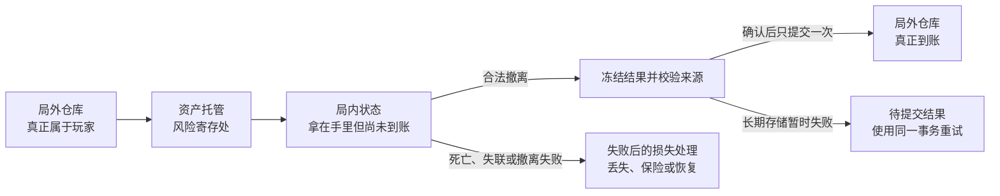

# 撤离式 PvPvE 的事务提交边界：为什么“成功带出来才算真正到手”

> 系列：游戏系统的共同语言
>
> 状态：可发布候选
>
> 核心问题：为什么玩家明明已经捡到战利品，系统仍不能把它算作长期资产？

[系列目录](../blog.html) · [下一篇](./stealth-recoverable-exposure.html)

玩家在地图里打开箱子、捡起稀有物品、把它装进背包时，画面会告诉他：“你得到了它。”

但在撤离式 PvPvE 游戏里，这句话只说对了一半。

**PvPvE（玩家对玩家兼玩家对环境，即“多人混合战局”）**：玩家既会与其他玩家竞争，也要面对 AI 和环境威胁的战局结构。

玩家确实拿到了物品，却还没有真正拥有它。只要尚未成功离开战局，这件物品仍可能因为死亡、掠夺、失联或撤离失败而消失。真正决定收益的并不是拾取动作，而是随后发生的撤离与结算。

这也是我认为撤离玩法最值得研究的地方：它把“获得奖励”拆成了两个不同的时刻。

- 第一个时刻是玩家拿到东西。
- 第二个时刻是系统承认东西已经属于玩家。

两个时刻之间的距离，就是撤离玩法最主要的紧张感来源。

## 先说结论：事务提交边界，就是收益的“真正到账点”

这里需要先定义一个正式概念。

**事务提交边界（即“真正到账点”）**：一批局内临时结果经过校验后，被一次性确认并写入长期状态的边界。

“事务”听起来像数据库术语，但玩家感受到的事情很简单：

> 只有成功带出来，收益才真正算数。

如果玩家只是拾取了物品，系统只需要在当前战局中承认“它现在由谁拿着”。如果玩家完成撤离，系统才需要进一步确认：

- 玩家是否满足撤离条件；
- 物品是否确实来自这场战局；
- 同一物品是否被重复结算；
- 玩家带入的装备应该保留、损坏还是丢失；
- 任务、经验和声望是否需要同步更新；
- 最终结果是否已经写入长期存档。

因此，撤离点不是普通传送门。它是整个战局从“临时运行”转向“长期结果”的入口。

## 局内持有权：为什么“拿在手里”还不等于真正拥有

为了说清这件事，还要区分三个概念。

**局内持有权（即“拿在手里”）**：物品当前由哪个角色或容器控制。

**局内归属（即“本局算谁的”）**：在当前战局规则中，物品被记录为属于哪个参与者或实体。

**持久所有权（即“真正进仓库”）**：物品已经进入玩家的长期账户，可以在战局外出售、装备、制造或带入下一局。

**资产托管（即“风险寄存处”）**：玩家准备进入战局时，系统先锁定本次携带的长期资产，使它们暂时不能参与其他交易。

三者并不总是同时变化。

玩家从箱子里拿起战利品后，已经“拿在手里”，本局也可能“算他的”，但它还没有“真正进仓库”。如果另一名玩家击败他并拿走物品，前两种状态可以继续变化，最后的长期结果仍未确定。

可以把整个过程画成一条状态链：

这张图里最重要的不是某个具体字段，而是状态不能被混在一起。

如果拾取物品时就直接写入长期仓库，系统随后还要处理死亡扣除、其他玩家掠夺、断线回档和重复结算。每一个异常都可能把局内状态与长期存档撕成两份不同的事实。

更稳妥的方式是：战局负责记录变化，结算负责确认结果。

## 为什么带入的装备需要先放进“风险寄存处”

撤离玩法不仅延迟确认新获得的物品，也会让玩家主动把旧资产带入风险。

前面定义的资产托管，也就是“风险寄存处”，负责在战局开始前锁定玩家准备携带的长期资产。

如果一把武器已经被带入战局，它就不应该同时被：

- 卖给商人；
- 放进另一名角色的装备栏；
- 用作制造材料；
- 再次带入另一场战局；
- 通过市场转移给其他玩家。

所以“风险寄存处”不是为了制造一个好听的后台名词，而是为了回答一个很实际的问题：

> 这件物品已经进入风险环境了吗？

只有当战局尚未真正开始，例如匹配失败或角色没有成功生成，系统才适合把托管安全回滚。玩家已经进入有效战局之后，普通断线或主动关闭客户端不能成为无风险取回装备的办法。

否则玩家面对危险时最合理的操作就不是寻找撤离点，而是拔网线。

## 撤离为什么必须由玩家主动决定

普通关卡通常由系统决定结束时间：击败首领、完成目标或者到达终点。

撤离玩法把结束权交给了玩家。

玩家需要不断比较：

- 当前背包里的收益；
- 继续搜索可能得到的额外收益；
- 剩余弹药和治疗资源；
- 已经承受的伤势；
- 撤离路线的距离；
- 其他玩家可能出现的位置；
- 剩余时间；
- 队友状态。

这可以理解为**继续行动的期望收益（即“再贪一手值不值”）**。

只要收益尚未抵达真正到账点，玩家每向前走一步，都在同时放大两个东西：

- 成功时可以带走的价值；
- 失败时可能失去的价值。

因此，撤离玩法最关键的选择往往不是“能不能打赢眼前的敌人”，而是：

> 即使能赢，这场战斗还值不值得打？

战斗可能消耗弹药、治疗、时间和位置隐蔽性。玩家赢下遭遇，却可能因为伤势过重、出口关闭或第三方队伍介入而输掉整次行动。

战斗胜利和行动成功因此被明确分开。

## 不完全信息不是让玩家瞎猜

撤离玩法通常不会告诉玩家地图上还剩多少敌人、哪个区域已经被搜过、哪个出口有人埋伏。

这种设计可以称为**不完全信息（即“只知道一部分真相”）**。

但“只知道一部分”不等于“什么也不知道”。如果玩家无法通过任何线索判断风险，撤离选择就会从决策变成赌博。

有用的线索包括：

- 远处枪声的方向和频率；
- 已经打开的门或容器；
- 尸体与掉落物；
- AI 的警戒状态；
- 环境机关的变化；
- 撤离点的激活反馈；
- 时间、天气和地图广播。

这些痕迹让玩家能够建立一个不完整但可用的局势模型。

真正好的风险不是完全未知，而是：

> 信息不够完整，但足以让玩家为自己的判断负责。

这也解释了为什么撤离点常常会变成风险集中区。多个玩家根据有限信息选择少数离场路线，出口自然成为路线交汇点、信息争夺点和最后一次风险判断。

## 失败必须真实，但不能让玩家永远爬不起来

如果死亡之后所有装备自动恢复，战利品又在拾取瞬间永久入库，所谓风险就只剩下表面演出。

但如果连续失败会让玩家永久失去参与核心循环的能力，系统又会形成另一种问题。

这种问题可以称为**不可恢复死锁（即“输到再也玩不动”）**：玩家越失败，越没有资源取得下一次成功，最终连低风险尝试都无法进行。

因此，撤离玩法需要同时成立的不是一句“失败有代价”，而是两条看似相反的原则：

1. 损失必须真实，玩家才会认真考虑是否继续冒险。
2. 恢复路径必须存在，玩家才有机会重新进入循环。

恢复路径可以采用不同形式：

- 基础补给；
- 低成本装备；
- 保底任务；
- 可重复获取的普通资源；
- 保险返还；
- 安全容器；
- 队友协助；
- 面向失败玩家的低风险路线。

这些机制不应该完全抹掉失败，否则真正到账点会失去意义。它们更像止损装置：保留失败的疼痛，但避免失败变成永久退出。

## 成功撤离后，结算仍可能没有立刻完成

玩家体验中的“撤离成功”和后台数据的“持久化成功”也不是同一件事。

撤离成功后，系统通常还需要生成结果快照，检查物品来源，计算丢失和保险候选，再更新仓库、角色、任务、经验与声望。

这里还需要一个正式术语。

**幂等结算（即“重复处理也只算一次”）**：同一个战局结果即使因为超时或重试被提交多次，也只能产生一次长期变化。

如果玩家已经合法撤离，但存储服务暂时不可用，合理的处理不是：

- 把玩家改判为死亡；
- 让客户端重新发送一份全新的奖励请求；
- 重复生成同一批物品；
- 重复发放经验。

系统应保存一份待提交结果，随后使用同一个结算身份重试。

这看起来是后台可靠性问题，但它直接影响玩家是否相信风险规则。玩家可以接受“我因为没有撤离而失去物品”，却很难接受“我已经撤离，只是服务器保存失败，所以全部没了”。

规则越强调高风险，结算就越需要可信。

## 和类魂、远征、Roguelike 相比，哪些地方相似

“延迟确认收益”并不只存在于撤离式 PvPvE，但不同类型不能被简单写成同一种系统。

| 类型 | 相似之处 | 关键区别 |
|---|---|---|
| 撤离式 PvPvE | 收益要经过离场和结算才能进入长期状态 | 强调共享战局、物品来源、跨玩家转移与服务端结算 |
| 类魂动作 RPG | 死亡会把一部分收益转为风险资产 | 通常给予一次返回死亡地点的回收机会，二次死亡才造成永久损失 |
| 远征管理 | 玩家需要判断继续深入还是带着已有成果撤回 | 重点是补给、路线、成员状态和主动止损，不一定需要物品级托管 |
| 卡牌构筑 Roguelike | 路线持续比较生命、构筑成熟度、商店与高风险奖励 | 局内构筑和路线选择是重点，不应硬套撤离点或跨玩家所有权 |

这些类型共享一个更上层的结构：

> 玩家已经积累了价值，但价值尚未完全安全。

它们真正不同的是：

- 哪个事件确认收益；
- 失败时损失什么；
- 玩家有没有回收机会；
- 长期状态与局内状态如何分层；
- 是否存在其他玩家参与所有权转移。

所以，“真正到账点”是一种分析工具，不是一套可以原封不动复制到所有游戏中的模板。

## 设计一个真正到账点时，我会检查什么

如果要判断一个撤离循环是否成立，我会先问以下问题。

### 进入风险

- 玩家带入的资产是否真的被锁定？
- 玩家是否清楚哪些资产会承担损失？
- 战局尚未开始时，系统能否安全回滚？
- 战局已经开始后，断线是否会错误地变成安全退出？

### 局内变化

- “拿在手里”和“真正进仓库”是否明确分开？
- 物品是否有可审计的来源和流转记录？
- 玩家能否通过环境痕迹推理风险？
- 继续探索是否同时增加潜在收益与潜在损失？

### 提交结果

- 撤离条件是否清晰且能持续验证？
- 结果是否会在提交前被冻结？
- 重复结算是否只产生一次结果？
- 存储暂时失败时，是否能保留待提交结果并安全重试？

### 失败与恢复

- 失败是否产生玩家能够理解的真实损失？
- 玩家是否仍有重新进入循环的基础资源？
- 恢复机制是在止损，还是已经把风险完全抹掉？
- 连续失败会不会让玩家输到再也玩不动？

## 结语：真正有价值的不是高惩罚，而是可信的风险

撤离玩法经常被概括成“死亡会掉装备”，但我认为这还没有触及它真正特别的地方。

它真正改变的是奖励被确认的时机。

玩家捡到物品时，收益开始存在；玩家完成撤离并通过结算时，收益才真正成立。中间这段尚未确认的状态，让移动、战斗、路线、声音、时间和信息都获得了新的意义。

也正因为如此，撤离玩法不能只设计损失。它还必须设计：

- 风险从什么时候开始；
- 玩家如何判断风险；
- 什么条件结束风险；
- 结果如何可信地提交；
- 失败后如何重新站起来。

高惩罚只能让玩家害怕失去。

清晰、可推理、可结算、可恢复的风险，才会让玩家愿意再走进下一局。

## 术语对照

| 正式术语 | 文中通俗称呼 | 含义 |
|---|---|---|
| PvPvE（玩家对玩家兼玩家对环境） | 多人混合战局 | 玩家、其他玩家、AI 与环境共同构成威胁 |
| 事务提交边界 | 真正到账点 | 局内结果被确认并写入长期状态的边界 |
| 局内持有权 | 拿在手里 | 当前由哪个角色或容器控制物品 |
| 局内归属 | 本局算谁的 | 当前战局规则记录的临时归属 |
| 持久所有权 | 真正进仓库 | 已进入长期账户并可在局外使用 |
| 资产托管 | 风险寄存处 | 入局前锁定持久资产，避免重复使用或交易 |
| 继续行动的期望收益 | 再贪一手值不值 | 额外收益与新增风险之间的比较 |
| 不完全信息 | 只知道一部分真相 | 信息不完整，但仍有线索可供推理 |
| 不可恢复死锁 | 输到再也玩不动 | 连续失败让玩家失去再次参与循环的能力 |
| 幂等结算 | 重复处理也只算一次 | 同一结果被重试时不会重复发放或扣除 |

## 内部资料依据

以下链接用于仓库内部审稿与追溯，不是公开版最终引用：

- [撤离式 PvPvE：风险资产托管、局内所有权转移与撤离提交边界](../journal.html#design-extraction-pvpve)
- [类魂动作 RPG：死亡回收与检查点世界循环](../journal.html#design-soulslike-action-commitment-recovery)
- [远征队探险管理：风险投资与主动撤退](../journal.html#design-expedition-management)
- [卡牌构筑式 Roguelike：风险路线经营](../journal.html#design-deckbuilder-roguelike)

公开发布前应补充公开案例或公开设计资料，并把内部路径替换为稳定公开链接。
