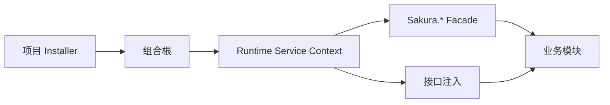

# 运行时消费模式：Facade、模块化安装与显式 Scope 的迁移阶梯

> 系列：Sakura Framework 工程实践
>
> 日期：2026-08-05
>
> 状态：可发布候选
>
> 核心问题：不同规模的 Unity 项目对服务访问、模块注册和生命周期所有权存在不同要求，框架需要提供可以渐进迁移的使用方式。

[系列目录](../blog.html)

Unity 框架在服务访问方式上经常走向两个极端。

一种做法是让所有系统都通过全局单例访问：

- `AudioManager.Instance`；

- `UIManager.Instance`；

- `SaveManager.Instance`；

- `EventManager.Instance`。


这种方式接入迅速，适合原型，但随着场景、团队和模块增加，服务由谁创建、何时销毁、测试时如何替换，会逐渐失去明确答案。

另一种做法是在项目开始阶段就要求所有业务使用严格构造注入、显式 Scope 和完整组合根。边界更清楚，却也可能让小型项目为尚未出现的问题承担过高复杂度。

Sakura Framework 当前采用的不是二选一，而是一条可以逐步收紧的运行时消费路径。

## 先说结论：访问方式应随所有权复杂度升级

**运行时消费模式（后文简称“框架使用档位”）**：项目访问框架服务、登记模块和管理生命周期时采用的一组统一规则。

框架使用档位不是代码质量排名，也不是团队人数达到某个数字后必须执行的升级流程。

它回答的是三个更具体的问题：

1. 服务是否只有一个清晰 Owner；

2. 服务是否需要跨场景、跨团队或跨玩法共享；

3. 项目是否必须禁止所有隐式创建与兼容回退。


当前存在三种正式方式。

|模式|主要入口|适用状态|生命周期要求|
|---|---|---|---|
|`simple-facade`|`Sakura.*` Facade|原型、小型项目、单一 Owner|Owner 自行管理，允许受限兼容创建|
|`modular-installer`|`IProjectInstaller` + `TryGet`|多场景服务、多人协作、模块化项目|区分 App 与 Gameplay 生命周期|
|`strict-scoped-di`|构造注入纯接口 + 显式 Scope|大型项目、发布加固、严格边界|所有 Owner 和释放点显式声明|

这三种方式共享同一套服务合同。

项目迁移时，不需要把 Audio、Event、UI、Save 等模块替换成另一套实现，只需要逐步改变它们的注册、解析和所有权规则。

## Simple：把 Facade 当作稳定入口

Simple 模式的目标是降低第一次接入成本。

业务代码可以从以下门面进入：

- `SakuraEvent`；

- `SakuraPooling`；

- `SakuraAudio`；

- `SakuraUi`；

- `SakuraSave`；

- `SakuraCommand`。


Facade 在调用方和具体实现之间增加了一层策略边界：

```text
业务代码
→ Sakura.* Facade
→ 当前 Runtime Service Context
→ 容器服务或受控兼容实例
```

当项目还没有组合根时，Simple 模式允许强制入口使用受限兼容创建，以便旧项目渐进迁移。

但 `TryGet*` 始终只查询现有服务，不创建 Manager、`GameObject` 或其他隐藏状态。

这条规则很重要：

> “尝试获取”应保持观察语义，不能因为一次查询改变运行时结构。

因此，Simple 并不等于任何地方都可以随意创建单例。

它只是允许框架在没有 Root 的小型项目里保留一条明确、可诊断的兼容通道。

## Modular：把跨场景服务交给项目组合根

当项目出现以下情况时，Simple 模式开始接近边界：

- 多个场景共享同一服务；

- 不同团队分别维护 UI、战斗、存档和资源模块；

- 服务需要在测试中替换；

- 项目必须说明某个实现由谁注册；

- 同一接口存在默认实现和项目覆盖实现。


这时更合适的是 Modular 模式。

项目通过 `IProjectInstaller` 或等效入口，把服务登记到组合根中。业务仍可使用 `Sakura.*.TryGet*`，但服务身份来自当前 Resolver，而不是场景搜索或隐式创建。



Modular 模式下，无 Root 时只允许读取已经存在的兼容实例，不再创建缺失 Manager。

这使项目能够按以下顺序迁移：

1. 为跨场景服务建立正式注册；

2. 观察哪些调用仍然使用兼容路径；

3. 替换不明确的服务访问；

4. 把回退数量降到可控范围。


它没有要求业务立即全部改成构造注入，却已经把“服务从哪里来”交给了统一组合根。

## Strict：把隐式回退视为组合错误

Strict 模式不是默认答案。

它适合服务注册已经完整、生命周期边界已经建立，并且项目准备把隐式行为全部转化为错误的阶段。

在 Strict 模式中：

- Root 中未注册的服务不会回退到场景单例；

- 无 Root 时不会查询 Legacy Manager；

- 强制属性不会创建缺失对象；

- 业务对象优先通过构造函数接收接口；

- Scene、Battle、UI 等临时模块使用显式 Scope；

- 兼容路径触发时记录 `StrictProfileViolation`。


Strict 真正增加的不是 DI 语法，而是可证明性。

当一个对象能够运行时，团队可以回答：

- 谁创建了它；

- 它属于哪个 Scope；

- 哪些对象依赖它；

- Scope 结束时谁负责释放；

- 如果未注册，系统在哪里失败。


只有当这些答案已经存在时，切换 Strict 才是在收紧边界。

否则，它只会把尚未完成的迁移一次性暴露为大量空引用。

## Root 就绪后，所有模式都应以 Resolver 为准

三种档位的差异主要发生在“没有 Root”时。

一旦组合根就绪，Facade 必须只认当前 Resolver。

|运行状态|`TryGet*`|强制入口|
|---|---|---|
|Root ready|只查询 Resolver，缺项失败|只返回 Resolver 中的身份，缺项为空|
|无 Root + Simple|读取现有兼容实例|可返回现有实例或受限创建|
|无 Root + Modular|读取现有兼容实例|只返回现有实例，不创建|
|无 Root + Strict|不查询兼容实例|返回空并记录拒绝|

假设 Root 中缺少 Audio 服务，Facade 却自动找到了场景里的旧 `AudioManager`，项目便会进入分裂状态：

- 一部分模块使用容器身份；

- 一部分模块使用场景身份；

- 测试与正式运行可能得到不同对象；

- Root 重建后，旧对象仍可能被继续访问。


因此，Root ready 后的 Resolver miss 应被视为组合缺口，而不是触发“寻找一个能用的对象”。

## 迁移信号比团队规模更可靠

框架使用档位不应根据项目人数机械选择。

更可靠的是观察迁移信号。

### 从 Simple 迁移到 Modular

- 多个场景需要共享服务；

- 团队需要明确模块 Owner；

- 服务需要项目自定义实现；

- 测试需要替换依赖；

- 场景中开始出现重复 Manager。


### 从 Modular 迁移到 Strict

- 非预期 Facade 回退已经接近零；

- App、Scene、Battle、UI Scope 已有明确创建与释放点；

- 所有关键服务都已正式登记；

- 发布前需要禁止隐式创建；

- 团队需要把组合错误提前暴露。


没有这些信号时，提前升级不会自动让架构更好，只会增加注册、Scope 和测试样板。

## Runtime Monitor 是迁移仪表盘

消费模式不能只靠文档约定。

项目还需要观察实际运行时发生了什么：

- 当前 Profile；

- Resolver 是否绑定；

- 服务解析成功与失败次数；

- Facade 回退次数；

- 最近一次访问来源；

- 当前活动 Scope；

- 模块生命周期摘要。


**回退预算（后文简称“还剩多少旧路”）**：项目允许保留的兼容服务访问数量和范围。

从 Simple 迁移到 Modular 时，目标不是立即让回退为零，而是让它可见、可分类、可逐步减少。

从 Modular 迁移到 Strict 前，目标才是把关键路径上的回退预算归零。

## Scope 解决的是所有权

大型项目通常至少需要四类生命周期。

|Scope|典型服务|
|---|---|
|App|配置、事件、资源、对象池、音频、存档|
|Scene|场景导航、局部资源句柄、房间状态|
|Battle|战斗编排、临时实体、技能上下文、随机流|
|UI|页面 ViewModel、窗口路由、输入拦截、页面任务|

Scope 的价值不只是统一调用 `Dispose()`。

它还建立了任务、事件订阅、资源 Lease 和临时状态的共同 Owner。

当 Battle Scope 结束时，释放它应同时意味着：

- 取消战斗任务；

- 注销事件监听；

- 归还对象池实例；

- 释放资源句柄；

- 清理命令历史；

- 关闭战斗专用 UI；

- 阻止旧回调继续写入下一局。


## Legacy Manager 是迁移通道

旧 `XxxManager.Instance`、`MonoSingleton` 和兼容包装器仍可能需要保留。

但它们的身份应明确为 Compatibility，而不是第四种正式架构选择。

如果 Legacy 被描述为第四种模式，项目会永远缺少退出条件：

- 新代码继续使用旧入口；

- Modular 只负责新模块；

- Strict 因兼容调用无法启用；

- 最终同时维护两套访问模型。


合理策略是：

> 允许旧路存在，但要求它有适用范围、观测方式和迁移触发条件。

## 我的判断

一套可长期使用的 Unity 框架，不应强迫所有项目从同一个复杂度起点出发。

更重要的是提供一条不更换核心服务合同的升级路径：

```text
方便接入
→ 明确注册
→ 显式所有权
→ 禁止隐式回退
```

Facade、Installer 和严格 DI 不是互相竞争的信仰。

它们是项目在不同生命周期阶段，对同一组框架能力采用的不同治理强度。

## 设计检查表

- 服务是否只有一个清晰 Owner；

- `TryGet*` 是否保持无创建副作用；

- Root ready 后是否仍可能回退到场景单例；

- 跨场景服务是否进入项目 Installer；

- 默认实现与项目覆盖是否声明注册意图；

- Facade 回退是否可观测；

- Scene、Battle、UI 临时对象是否属于显式 Scope；

- Strict 启用前关键路径回退是否归零；

- Legacy 入口是否被明确标记为迁移通道；

- 模式升级是否由实际边界问题触发。


## 术语对照

|正式术语|通俗称呼|含义|
|---|---|---|
|运行时消费模式|框架使用档位|服务访问、注册和生命周期的统一规则|
|组合根|服务总装入口|统一登记并创建项目运行时服务的位置|
|回退预算|还剩多少旧路|项目仍允许存在的兼容访问范围|
|显式 Scope|有名字的生命周期|由明确 Owner 创建和释放的一组服务与任务|
|Legacy Compatibility|迁移通道|为存量项目保留但不鼓励新代码采用的旧入口|

> 资料说明：本文依据 2026-08-05 的运行时消费模式身份、访问迁移指南与 Bootstrap 实现整理。三种模式属于当前正式推荐路径，具体包生命周期和发布状态仍以对应版本清单为准。
