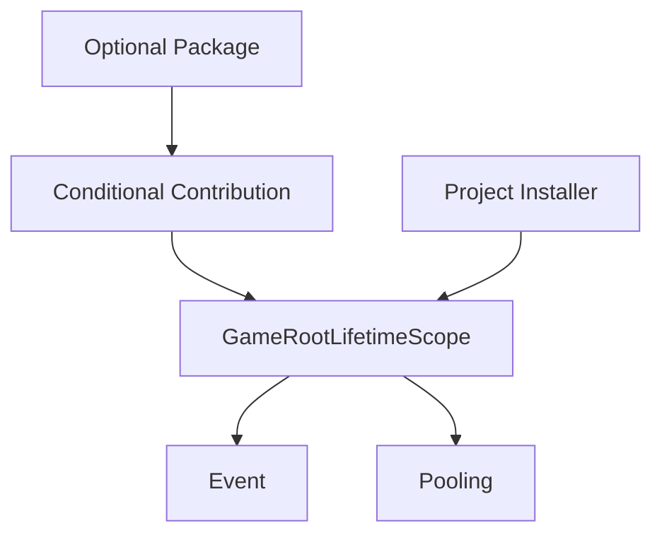

# 运行时消费模式与组合根：从 Facade 到显式 Scope 的迁移阶梯

> 系列：Sakura Framework 工程实践
>
> 日期：2026-09-09
>
> 状态：可发布候选
>
> 核心问题：不同规模的 Unity 项目怎样在不更换服务合同的前提下，从快速接入逐步迁移到确定性组合根、显式生命周期和严格依赖边界？

[系列目录](../blog.html)

Unity 框架常见的两种极端，一种是所有系统都通过全局单例访问，另一种是在项目开始时就要求完整构造注入、显式 Scope 和组合根。前者接入快但所有权模糊，后者边界清楚却可能把尚未出现的复杂度提前压给小项目。

Sakura 的关键判断是：访问方式、组合根和生命周期不应被当成互相竞争的架构信仰，而应成为同一组服务合同上的迁移阶梯。

## 先说结论：消费复杂度应随所有权问题升级

**运行时消费模式（后文简称“框架使用档位”）**：项目访问服务、登记模块、建立组合根并管理生命周期时采用的一组统一规则。

| 模式 | 主要入口 | 适用状态 | 所有权要求 |
|---|---|---|---|
| `simple-facade` | `Sakura.*` Facade | 原型、小型项目、单一 Owner | 允许受限兼容创建 |
| `modular-installer` | `IProjectInstaller` + `TryGet` | 多场景、多团队、模块化项目 | App 与 Gameplay 生命周期分开 |
| `strict-scoped-di` | 构造注入 + 显式 Scope | 大型项目、发布加固 | 禁止隐式回退与创建 |

三种模式共享服务合同。迁移改变的是注册、解析和所有权规则，而不是把 Audio、Event、UI、Save 等能力换成完全不同的实现。

## Facade 是接入入口，不是隐藏的全局所有权

Simple 模式允许业务通过 `SakuraEvent`、`SakuraPooling`、`SakuraAudio`、`SakuraUi`、`SakuraSave` 和 `SakuraCommand` 等门面进入当前 Runtime Service Context。

```text
业务代码
→ Sakura.* Facade
→ Runtime Service Context
→ 容器服务或受控兼容实例
```

`TryGet*` 必须保持观察语义：它只查询已有服务，不创建 Manager、`GameObject` 或新的隐藏状态。Simple 允许的是一条明确、可诊断的兼容通道，而不是任何地方都能随意创建单例。

## 组合根负责装配，不负责吞并模块

**组合根（后文简称“服务总装入口”）**：集中决定服务注册、依赖关系和生命周期的启动边界。

组合根应该知道哪些模块属于 App Scope、哪些可选包已安装、项目有哪些覆盖实现、启动任务按什么顺序执行，以及 Root 销毁时怎样释放所有权；它不应该知道具体战斗技能、页面导航、音频表或场景敌人的业务细节。

默认 Bootstrap 的基础闭包应保持最小，通常只直接装配 Event 与 Pooling。Input、UI、Audio、Timeline 等能力在自身包存在并满足版本条件时，通过 **条件 Contribution（后文简称“装了才贡献”）** 加入既有 Root。



这样可以避免核心依赖膨胀，也避免让服务器工具、编辑器工具、纯模拟测试或无 UI 场景被迫安装完整客户端闭包。

## Modular 把服务来源交给 Installer

当多个场景共享服务、测试需要替换实现、团队需要明确模块 Owner，或项目出现默认实现与覆盖实现时，应迁移到 Modular。

项目通过 `IProjectInstaller` 或等效入口把服务登记到组合根。业务仍可使用 Facade，但服务身份来自当前 Resolver，而不是场景搜索或隐式创建。

Installer 必须按稳定的 Phase、Priority、程序集全名和类型全名排序。多实现注册应明确 `Default`、`Override`、`Multi` 或普通独占意图；不能依赖“后注册覆盖前注册”的容器细节。

**组合提交边界（后文简称“整套注册一起生效”）**要求先发现 Installer、稳定排序、隔离执行、收集 Descriptor、验证冲突，全部成功后才转换并构建最终容器。

```text
发现 Installer
→ 稳定排序
→ 隔离执行
→ 收集 Descriptor
→ 验证冲突与意图
→ 一次构建容器
```

如果中途类型加载、构造、DI 转换或注册意图检查失败，不能留下半套注册。

## 自动 Root 与项目覆盖可以共存

小项目可以在首场景前检测不到 Root 时创建默认组合根；项目已经提供自定义 `GameRootLifetimeScope` 时，自动启动器必须跳过，不得创建第二个 Bootstrap Host。

自定义 Root 仍然复用既有服务上下文和生命周期合同，项目覆盖通过正式 Installer 或派生 Root 表达。**唯一 Host 所有权（后文简称“一个模块只归一个启动器”）**要求同一模块在同一生命周期中只能被一个容器、Manager 或项目 Host 接管。

重复接管不能用“最后创建的覆盖前一个”掩盖。无法证明唯一所有权时，应跳过或拒绝启动，并产生结构化诊断。

Root 身份还需要 **代际绑定（后文简称“旧根不能清新根”）**：每次 Resolver 绑定记录 Owner 与 generation，释放时只有当前绑定仍属于自己才允许清理。否则 Root A 延迟销毁可能清空 Root B 已建立的全局 Resolver。

## Scope 把服务、任务与资源归给同一个 Owner

App、Scene、Battle 和 UI 是常见的四类生命周期：

| Scope | 典型服务 |
|---|---|
| App | 配置、事件、资源、对象池、音频、存档 |
| Scene | 导航、局部资源句柄、房间状态 |
| Battle | 战斗编排、临时实体、技能上下文、随机流 |
| UI | 页面 ViewModel、窗口路由、输入拦截 |

当 Battle Scope 结束时，释放它应同时取消战斗任务、注销事件、归还对象池、释放资源句柄、清理命令历史、关闭战斗 UI，并阻止旧回调继续写入下一局。

Bootstrap FSM、异步启动任务和主线程 Dispatcher 也应绑定到共同的 App Owner，并且只保留一个 Pump。Root 销毁时，任务监管器能够统一取消启动任务、观察失败并防止旧回调进入新一轮运行。

App Scope 不应默认持有当前战斗实体、关卡导航、房间状态、页面 ViewModel 或临时输入拦截。把所有对象都放入 `DontDestroyOnLoad` Root，只会让场景切换更换画面而不真正结束旧玩法生命周期。

## Strict 把隐式回退变成组合错误

Strict 模式适合服务注册完整、Scope 边界已经建立、项目准备禁止隐式创建的阶段。它要求：

- Root 中未注册的服务不会回退到场景单例；
- 无 Root 时不查询 Legacy Manager；
- 强制入口不会创建缺失对象；
- 业务对象优先通过构造函数接收接口；
- Scene、Battle、UI 临时模块使用显式 Scope；
- 兼容路径触发时记录 `StrictProfileViolation`。

Strict 增加的不是 DI 语法，而是可证明性。项目需要能够回答谁创建了对象、它属于哪个 Scope、Scope 结束时谁释放，以及未注册时系统在哪里失败。

Root ready 后，Facade 必须只认当前 Resolver：

| 运行状态 | `TryGet*` | 强制入口 |
|---|---|---|
| Root ready | 只查询 Resolver，缺项失败 | 只返回 Resolver 身份 |
| 无 Root + Simple | 读取或受限创建兼容实例 | 可返回已有或兼容实例 |
| 无 Root + Modular | 只读取已有兼容实例 | 不创建缺失 Manager |
| 无 Root + Strict | 不查询兼容实例 | 返回空并记录拒绝 |

Root ready 后的 Resolver miss 是组合缺口，不是继续寻找另一个对象的信号。

## Legacy 只能是迁移通道

旧 `XxxManager.Instance`、`MonoSingleton` 和兼容包装器可以暂时存在，但必须被标记为 Compatibility，并拥有适用范围、观测方式和退出条件。它不能被描述成第四种正式架构模式，否则 Modular 和 Strict 永远没有完成迁移的终点。

Runtime Monitor 应记录当前 Profile、Resolver 是否绑定、解析成功与失败次数、Facade 回退次数、访问来源、活动 Scope 和模块生命周期摘要。**回退预算（后文简称“还剩多少旧路”）**让项目可以从 Simple 逐步减少兼容访问，并在进入 Strict 前把关键路径回退归零。

## 迁移阶梯由边界信号触发

从 Simple 到 Modular 的信号包括：多个场景共享服务、团队需要明确 Owner、服务需要替换、场景开始出现重复 Manager。从 Modular 到 Strict 的信号包括：关键服务已正式登记、App/Scene/Battle/UI Scope 已有明确创建与释放点、非预期 Facade 回退接近零，以及发布前需要禁止隐式创建。

没有这些信号时提前升级，只会增加注册、Scope 和测试样板；但当边界问题真实出现时，继续停留在 Simple 又会让所有权和失败状态不可证明。

## 我的判断：组合根是治理边界，消费模式是治理强度

一套可长期使用的 Unity 框架，不应强迫所有项目从同一个复杂度起点出发。更重要的是在同一服务合同上提供：

```text
方便接入
→ 明确注册
→ 唯一 Host
→ 显式 Scope
→ 禁止隐式回退
```

Facade、Installer、组合根和严格 DI 只有在连接到同一套所有权、注册和失败合同后才构成真正的迁移路径。组合根越成熟，知道的业务细节应越少；它只负责把模块按确定性规则装配起来，并把生命周期交给正确的 Scope。

## 设计检查表

- `TryGet*` 是否保持无创建副作用；
- 默认 Root 的硬依赖是否最小；
- 可选模块是否通过条件 Contribution 加入；
- 同一模块是否可能被两个 Host 接管；
- Root 替换时旧对象是否可能清理新绑定；
- Installer 是否稳定排序并声明注册意图；
- 注册失败是否会留下半套容器；
- Bootstrap FSM 与异步任务是否共享 Owner；
- App、Scene、Battle、UI Scope 是否边界清晰；
- Root ready 后是否仍可能回退到场景单例；
- Legacy 入口是否有可观测的回退预算；
- Strict 启用前关键路径回退是否归零；
- 项目自定义 Root 是否会触发默认 Root 重复创建。

## 术语对照

|正式术语|通俗称呼|含义|
|---|---|---|
|运行时消费模式|框架使用档位|服务访问、注册和生命周期的统一规则|
|组合根|服务总装入口|统一登记并创建项目运行时服务的位置|
|条件 Contribution|装了才贡献|可选包满足条件后向既有 Root 增加服务|
|唯一 Host 所有权|一个模块只归一个启动器|防止重复初始化、Tick 和清理|
|Root 代际绑定|旧根不能清新根|旧 Owner 不能释放后继 Root 的全局身份|
|组合提交边界|整套注册一起生效|全部描述验证成功后才构建最终容器|
|显式 Scope|有名字的生命周期|由明确 Owner 创建和释放的一组服务、任务与资源|
|回退预算|还剩多少旧路|项目仍允许存在的兼容访问范围|

## 内部资料依据

本文重新组织原 `05-运行时消费模式与架构升级阈值` 与原 `06-Bootstrap组合根与生命周期所有权`。新增结构把 Facade、Installer、组合根、Host 唯一性和 Scope 所有权放进同一条迁移链；它不是把两篇文章按章节简单拼接。
