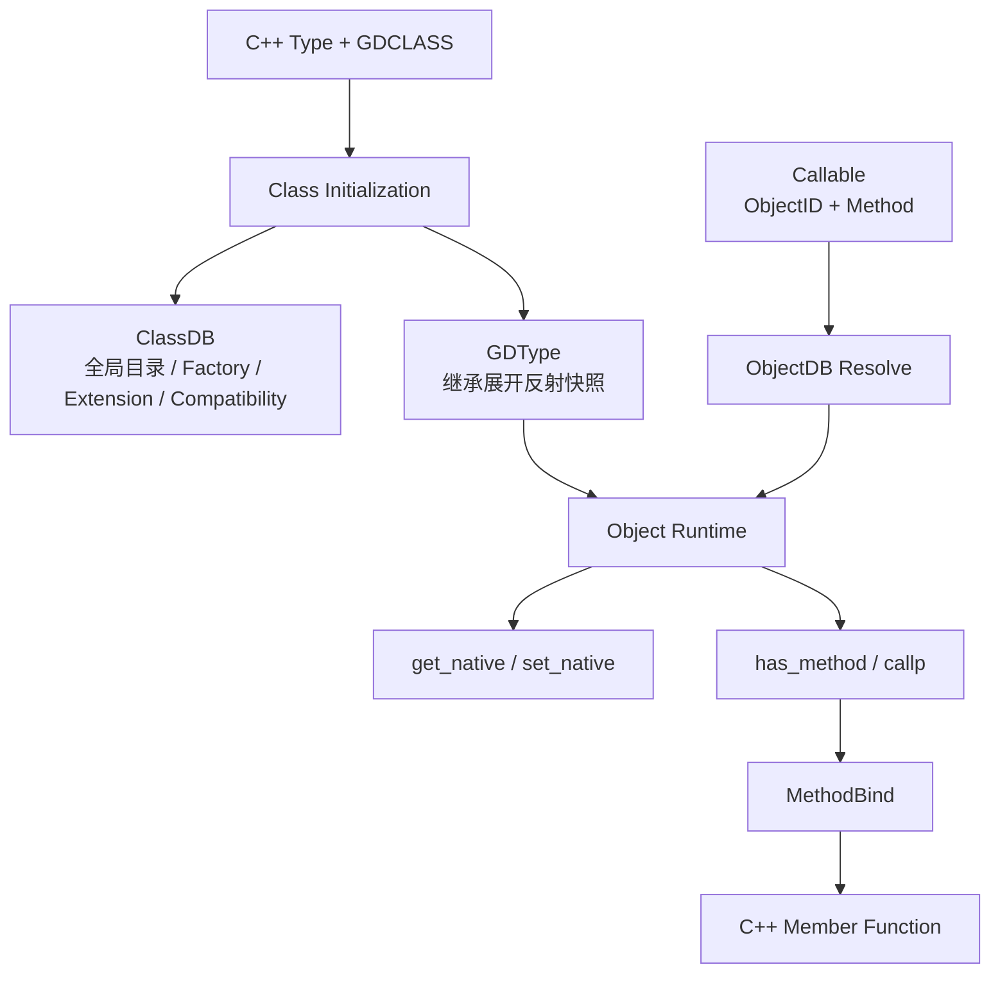

# 反射快照与运行时热路径：Godot GDType、ClassDB 与 MethodBind 的职责分离

> 系列：从 Godot 源码理解引擎设计
>
> 日期：2026-08-25
>
> 状态：草稿
>
> 核心问题：动态语言和编辑器需要按名字查找属性、方法、信号与类型信息时，引擎怎样保留完整反射能力，同时避免每一次对象访问都重新进入一个全局类数据库并沿继承链搜索？
>
> 关键词：Godot、GDType、ClassDB、MethodBind、Callable、Reflection

[系列目录](../blog.html)

提到 Godot 的原生反射系统，很容易形成一个直观模型：

```text
ClassDB
=
全局反射数据库
```

于是所有动态能力似乎都可以继续推导成：

```text
Object
→
取得类名
→
进入 ClassDB
→
沿父类查方法
→
找到 MethodBind
→
执行调用
```

这种理解在概念层并不奇怪。

Godot 确实拥有一个叫 `ClassDB` 的全局类目录。

GDScript、Inspector、GDExtension、场景序列化和动态实例化，也确实都需要某种统一的类型信息基础设施。

但重新对照当前 Godot `4.8.0-dev` 源码以后，可以看到一个更值得研究的结构变化：

> 高频对象反射已经不再把 ClassDB 当作所有成员元数据的唯一仓库。

方法、属性、信号、常量以及继承展开后的成员视图，正在由每个类型自己的 `GDType` 直接持有。

ClassDB 仍然存在。

但它开始更像全局控制面。

而不是每一次运行时反射都必须经过的中央数据路径。

## 先说结论：Godot 把反射拆成了控制面、类型快照、调用适配和目标身份四层

**反射控制面（后文简称“全局类型目录”）**：负责按照类型名发现类、管理父类拓扑、实例化工厂、扩展类、兼容信息和公共查询入口，但不要求自己承担所有对象运行时成员访问。

**类型反射快照（后文简称“每个类型自己的成员索引”）**：`GDType` 保存该类型当前可见的继承展开成员，以及只属于当前类自身的成员表。

**动态调用适配（后文简称“把动态参数真正转进 C++ 函数”）**：`MethodBind` 负责把 Variant、validated argument 或原生指针调用统一适配到具体 C++ 成员函数。

**延迟目标调用（后文简称“记住要调用谁，但真正执行时再找对象”）**：标准 `Callable` 保存 ObjectID 与方法名，实际调用时重新解析 Object，再进入对象自己的动态调用路径。

可以把整体关系压缩成：



真正值得注意的是：

```text
ClassDB
和
GDType
不是重复存储同一份信息的两个容器。
```

它们正在承担不同访问模式。

## ClassDB 仍然重要，但它不再等于“所有反射成员表”

当前 `ClassDB::ClassInfo` 仍然承担大量重要职责。

例如：

- API 类型；
- exposed / disabled / virtual / runtime 状态；
- 父 `ClassInfo`；
- creation function；
- GDExtension；
- 兼容 MethodBind；
- 全局类名目录；
- 默认值与工具元数据。

因此：

```text
GDType 出现
```

并不意味着：

```text
ClassDB 可以被删除。
```

更准确的理解是：

> ClassDB 负责回答“系统里有哪些类，以及这些类如何被发现、创建和治理”。

而 GDType 更适合回答：

> “已经拿到这个具体类型以后，它当前有哪些可以直接使用的成员”。

这是两种明显不同的访问模式。

## GDType 保存的是已经展开继承关系的类型快照

**继承展开快照（后文简称“把父类能用的东西提前复制进来”）**：类型注册期间把父类当前可见的常量、枚举、信号、方法和属性复制到子类型自己的完整成员表，使运行时查询不必每次重新沿父类链向上搜索。

GDType 中可以看到两组重要数据：

```text
method_map
self_method_map

signal_map
self_signal_map

constant_map
self_constant_map

property_map
self_property_map
```

二者分别回答：

```text
完整表：
这个类型最终能看见什么？

self-only 表：
这些东西里哪些是当前类型自己声明的？
```

因此运行时如果要执行：

```text
obj.has_method("foo")
```

并不需要每次：

```text
当前类没找到
→
去父类
→
还没找到
→
继续去祖父类。
```

继承关系已经在注册阶段被展开。

运行期可以直接查当前 GDType 的完整表。

## 这是一种典型的“写少读多”优化

这种设计当然不是免费的。

如果父类型拥有：

```text
100 个成员，
```

很多子类都会复制相应的可见索引。

因此它使用更多注册期工作与元数据空间，换取运行时更简单的查询。

可以把取舍理解成：

```text
注册期：
更多继承展开与快照构建

运行期：
更少全局目录查找
更少父链遍历。
```

这是非常典型的：

**读优化型元数据结构（后文简称“类型注册时多做一点，运行时少找几层”）**。

它并不意味着：

> 任何类型系统都应该复制整套继承成员。

只有在：

```text
注册次数很少
运行期动态查询很多
```

的系统里，这种交换才尤其合理。

## 快照成立的前提是父类型不能再随意改变

假设：

```text
BaseType
method_map = A B C
```

子类型初始化时复制：

```text
DerivedType
method_map = A B C
```

随后父类型又新增：

```text
D。
```

如果 Derived 没有同步更新，就会出现：

```text
Base 能看到 D
Derived 反而看不到 D。
```

因此一旦采用继承快照，就必须回答：

> 父快照什么时候正式冻结？

当前 GDType 明确拥有：

```text
UNINITIALIZED
MUTABLE
FINALIZED
```

三种构建状态。

`GDType::initialize()` 在建立子类型时会消费父类型快照，并把父类型推进到 `FINALIZED`。

随后当前类型进入：

```text
MUTABLE
```

并继续绑定自己的成员。

这意味着：

**类型冻结边界（后文简称“父描述已经被别人复制以后不能再偷偷改”）**本身就是快照正确性的组成部分。

如果没有冻结协议，所谓“预计算反射”很快就会退化成缓存失效问题。

## 叶子类型没有必要被夸大成绝对不可变对象

这里也需要保留一个边界。

当前源码能够确认：

- 成员绑定要求主线程；
- GDType 必须处于 `MUTABLE`；
- 父类型在被子类快照消费后进入 `FINALIZED`。

但不能因此把结论扩大成：

> 所有 GDType 在类型系统层面从某个瞬间开始永远严格不可变。

例如没有子类继续消费的叶子类型，其生命周期细节并不能只靠“有三个 InitState”直接推导成更强保证。

所以更准确的工程结论是：

> 当前系统依靠注册时序、主线程绑定与状态约束建立“注册期写、运行期读”的事实，而不是提供一个任意阶段都自动线程安全的 immutable type object。

## GDCLASS 真正装配的是两套结构

一个带 `GDCLASS` 的原生类型初始化时，可以把主链概括成：

```text
Parent.initialize_class()
↓
ClassDB::_add_class(...)
↓
Current GDType.initialize()
↓
复制父类型快照
↓
Current _bind_methods()
↓
Current _bind_compatibility_methods()
```

随后 `ClassDB::register_class<T>()` 再补：

- creation function；
- exposed / virtual；
- API partition；
- 其他全局类登记信息。

所以：

```text
反射成员构建
```

和：

```text
把类作为全局可发现 / 可实例化类型登记
```

虽然彼此相关，但仍可以理解成两个职责。

这也是为什么：

```text
ClassDB = Reflection Everything
```

越来越难准确描述当前结构。

## Object 热路径已经可以直接消费 GDType

新的分层真正有意义，不在于字段换了一个文件存。

如果 Object 动态调用仍然是：

```text
Object
→
get_class_name()
→
ClassDB
→
找到 ClassInfo
→
沿继承关系查 MethodBind，
```

那只是重新组织数据。

更值得关注的是当前调用链已经开始直接利用对象自己的 GDType。

例如 `Object::has_method` 的原生查询可以概括为：

```text
ScriptInstance
↓
Object GDType method_map
↓
Method exists?
```

`Object::callp` 则更接近：

```text
ScriptInstance::callp
↓
如果脚本真正处理成功
→ 返回

如果脚本只是 INVALID_METHOD
↓
查询当前对象 GDType method_map
↓
MethodBind::call
```

这保留了：

```text
脚本覆盖优先
原生反射兜底
```

的语义。

改变的是：

> 原生兜底不再必须从全局 ClassDB 按类名重新查起。

## 控制面与热路径分离是真正值得迁移的思想

**控制面与热路径分离（后文简称“全局系统负责管理，实例运行不要每次都回总部”）**：全局目录负责注册、发现、创建和治理，而高频运行代码消费已经定位好的局部描述或快照。

这种分层非常适合动态框架。

例如一个自研游戏框架可能拥有：

```text
CapabilityRegistry
ServiceCatalog
CommandCatalog
BindingCatalog。
```

它们很适合用于：

- 编辑器发现；
- 模块选择；
- 调试；
- 文档；
- 工厂创建。

但如果每一次运行时：

```text
UI Binding 更新
Command 调用
Service Dispatch
```

都需要：

```text
String Name
→
全局 Registry
→
类型查找
→
成员查找
→
执行，
```

控制面就会慢慢进入热路径。

更合理的模式通常是：

```text
注册阶段
→
解析描述
→
生成稳定句柄

运行阶段
→
直接使用句柄。
```

Godot 当前反射结构正好提供了一个很清楚的案例。

## 统一 property_map 实际承担的是动态成员命名空间

当前 GDType 中一个比较容易被名字误导的结构是：

```text
property_map。
```

它并不只保存传统意义上的：

```text
property getter / setter。
```

还可以表示：

- SETGET；
- INTEGER_CONSTANT；
- METHOD；
- SIGNAL。

也就是说，从动态表达式：

```text
object.foo
```

的角度看，

`foo` 可能代表：

- 属性值；
- 整数常量；
- Callable；
- Signal。

因此：

**动态成员命名空间（后文简称“同一个名字在动态访问里只能有一种解释”）**比“属性表”更接近它真正承担的职责。

如果方法、属性、信号和常量各自维护完全独立的名字空间，却又都支持：

```text
object.name
```

形式访问，就会产生歧义。

当前绑定入口会在统一成员域中检查重名。

这实际上把：

```text
名字冲突
```

从运行时解析问题提前变成：

```text
类型注册错误。
```

## 注册期拒绝歧义比运行期决定优先级更稳定

假设一个类型同时拥有：

```text
method: state
signal: state
property: state。
```

动态语言面对：

```text
object.state
```

必须决定：

```text
属性优先？
方法优先？
信号优先？
```

如果依赖某套隐式优先级：

- Debug 与 Release 可能表现不同；
- 不同脚本绑定可能解释不同；
- Inspector 与运行时可能不一致。

更稳健的方式是：

> 这种类型定义本身就非法。

于是统一成员命名空间承担的是一种：

**注册期歧义消除（后文简称“不要把名字冲突留给运行时猜”）**。

这同样非常适合命令、配置、事件、Binding 等需要名字驱动访问的框架。

## 属性 accessor 也在注册阶段提前解析

传统动态属性实现可能保存：

```text
getterName = "get_health"
setterName = "set_health"
```

每次访问：

```text
get property
→
再按名字找 getter
→
调用。
```

当前 GDType Property 则可以直接保存已经解析的：

```text
const MethodBind *getter
const MethodBind *setter。
```

因此属性注册阶段会提前验证：

- getter 是否存在；
- setter 是否存在；
- 参数数量是否匹配；
- index property 是否符合规则。

成功以后，运行期不必再次做同一轮字符串方法查找。

这是一种：

**预解析执行句柄（后文简称“初始化时把名字变成真正可执行的引用”）**。

它把错误提前暴露。

也把运行时逻辑缩短。

## MethodBind 真正解决的是动态世界和静态 C++ 函数之间的 ABI 差异

找到方法以后，仍然不能直接说：

```text
现在调用 C++ function。
```

脚本和引擎动态层使用：

```text
Variant
```

而真正 C++ 函数可能接受：

```text
int
String
Vector3
Object*
enum
const reference
```

因此：

**MethodBind（后文简称“动态调用到静态函数之间的类型适配器”）**负责把统一动态调用模型映射到具体 C++ 成员函数。

当前可以区分三条主要通道。

| 通道 | 主要场景 | 核心职责 |
|---|---|---|
| `call` | 普通动态 / Variant 调用 | 参数数量、类型转换与 CallError |
| `validated_call` | 上层已经验证签名 | 减少重复校验 |
| `ptrcall` | GDExtension / generated bindings | 使用类型化内存布局进行 ABI 调用 |

这里尤其需要避免一个常见夸张：

```text
ptrcall
=
普通 C++ 直接调用
=
完全零成本。
```

它仍然处于 Godot 的绑定和 ABI 合同中。

只是省去了普通 Variant 路径的一部分包装与动态检查。

## `call`、`validated_call` 和 `ptrcall` 是同一语义的不同执行合同

三条路径存在的价值，并不是提供三个功能重复的 API。

而是允许调用方根据自己已经掌握的信息，选择不同成本和责任边界。

### `call`

调用方什么都不能假定。

MethodBind 必须检查：

- 参数数量；
- 参数类型；
- 默认参数；
- CallError。

### `validated_call`

调用方已经完成相应签名验证。

因此可以省略部分重复检查。

### `ptrcall`

双方已经遵守明确的原生 ABI。

可以绕开 Variant 参数组织。

这里可以看到一个很通用的性能设计：

> 不要通过删除安全检查优化所有调用，而是提供“已经证明前置条件”的更窄执行路径。

这样快速通道仍然拥有明确适用边界。

## Object 动态调用保留脚本覆盖优先

Godot Object 并不是纯 C++ 反射对象。

它还可能绑定 ScriptInstance。

因此：

```text
obj.call("foo")
```

不能简单：

```text
GDType method_map
→
MethodBind。
```

当前模型会先给脚本层机会。

只有脚本报告：

```text
INVALID_METHOD
```

时，

才继续寻找原生 MethodBind。

如果脚本真正产生：

- 参数错误；
- const 错误；
- 其他有效调用错误；

则不能悄悄回退原生实现。

这保护的是：

**动态覆盖语义（后文简称“脚本真正接管以后，原生层不能假装没看见”）**。

这也是为什么 Callable 不适合长期缓存一个原生 MethodBind 后直接调用。

## Callable 保存调用身份，而不是缓存最终执行对象

标准 Callable 可以近似理解为：

```text
ObjectID
+
MethodName。
```

真正调用时：

```text
Callable::callp
→
ObjectDB::get_instance(ObjectID)
→
Object::callp(MethodName)
→
Script / GDType / MethodBind。
```

这有两个重要结果。

第一：

```text
Callable
```

没有因为记住目标而自动取得 Object 所有权。

对象已经销毁时，可以通过 ObjectID 解析失败得到结构化错误，而不是继续持有悬空裸指针。

第二：

```text
Callable
```

没有提前锁死最终 MethodBind。

因此实际调用时仍然能够看到：

```text
当前对象的脚本覆盖状态。
```

这就是：

**调用身份与执行目标分离（后文简称“先记住要叫谁，真正拨号时再找当前接听者”）**。

它和 Godot 已有的 ObjectID 生命周期设计自然结合。

## Callable 与 Ref 解决的是两类完全不同的问题

这也是本篇与生命周期专题容易产生混淆的地方。

```text
Callable(ObjectID, method)
```

表达：

> 如果这个对象到时候还存在，就尝试调用它。

而：

```text
Ref<T>
```

表达：

> 只要我还持有这份 Ref，对象就不能进入最终释放。

两者不应该互相替代。

如果一个回调只是观察关系：

```text
Callable / ObjectID
```

通常已经足够。

如果异步任务的语义要求：

```text
任务完成之前目标必须活着，
```

才需要额外的强生命周期关系。

因此：

```text
我知道怎样调用你
```

和：

```text
我负责让你继续活着
```

仍然是两种权限。

## ClassDB 仍然是不可替代的全局控制面

把成员查询热路径移入 GDType 后，很容易又走向另一个极端：

```text
既然 Object 不再依赖 ClassDB 查方法，
那 ClassDB 已经过时。
```

并不是。

全局类型系统仍然需要一个地方回答：

- 这个名字对应哪个 Class？
- 谁继承谁？
- 这个类允许实例化吗？
- creation function 是什么？
- 这是原生类还是 GDExtension 类？
- 旧版本兼容签名怎样解析？
- API hash 怎样计算？
- 类型是否 disabled / exposed / virtual？

这些职责天然是：

```text
全局控制面问题。
```

GDType 不应该为了“统一”把它们全部吸收回来。

因此当前结构最有意思的地方，不是从：

```text
ClassDB
```

迁移到：

```text
GDType。
```

而是：

> 两者终于更清楚地分别服务全局治理和实例热路径。

## ClassDB Lock 与 GDType InitState 是两套不同并发合同

ClassDB 的全局 `classes` 等控制面需要读写锁保护。

GDType 的成员构建则主要依赖：

- 类型局部初始化 Mutex；
- 主线程要求；
- `MUTABLE / FINALIZED` 状态。

这说明：

```text
全局目录并发
```

和：

```text
单类型反射构建
```

不是同一个问题。

如果只依赖一把：

```text
Global Reflection Lock，
```

所有动态对象查询都可能被拖回同一个同步点。

当前对象热路径直接消费已经展开的 GDType，也意味着普通：

```text
get
set
call
```

不需要为每次访问先取得 ClassDB 的全局目录锁。

这同样是控制面与热路径分离的直接收益。

## “注册阶段写、运行阶段读”比“到处上锁”更重要

很多动态系统面对并发问题时，第一个方案是：

```text
所有 Metadata Dictionary
都加 ReaderWriterLock。
```

这当然可以工作。

但如果系统本身的业务事实是：

```text
应用启动时注册类型
运行以后几乎只读，
```

更有价值的策略往往是：

```text
明确 Registration Phase
→
完成 Validation
→
冻结或稳定快照
→
Runtime 直接读。
```

这样同步不再需要持续付费。

这是一种：

**阶段式并发治理（后文简称“能在初始化阶段解决的问题，不要让运行时每次重新抢锁”）**。

它不只适用于反射。

也适用于：

- Command Registry；
- Event Schema；
- Config Descriptor；
- Serialization Schema；
- Network Protocol；
- Dependency Graph。

## 热卸载会重新暴露快照生命周期问题

快照优化还有一个必须支付的代价：

> 谁现在可能还保存着这份快照？

对于普通内建类型：

```text
引擎进程结束
```

之前类型基本一直存在。

问题不大。

但 GDExtension 可以卸载。

当扩展类从 ClassDB 全局目录移除以后，

某些旧消费者仍然可能暂时保存：

```text
GDType*
```

如果此时立刻 free：

```text
旧观察者
→
Use After Free。
```

当前实现选择：

```text
ClassDB 不再暴露该类
↓
GDType 暂时不立即释放
↓
进入 autorelease pool
↓
ClassDB cleanup 时统一回收。
```

这是：

**反射元数据延迟回收（后文简称“先让类型从目录消失，再晚一点释放它的描述”）**。

它用一部分暂时的内存保留，降低热卸载阶段旧观察者发生悬空访问的风险。

## 延迟释放不等于完整解决热卸载安全

这里同样不能扩大结论。

当前能够确认的是：

```text
GDType 快照
```

不会在扩展类注销时立即 free。

这并不自动证明：

- GDExtension 实例全部安全；
- 扩展库代码可以任意卸载；
- 所有 MethodBind 观察关系都拥有完整 Lease；
- 所有外部模块都不会保存其他裸指针。

所以更准确的判断是：

> 当前实现为 GDType 元数据本身选择了延迟释放策略。

它展示了一个生命周期取舍。

不是完整插件热卸载证明。

## 反射系统真正的设计单位不是“字典”，而是生命周期

如果只从数据结构看，可以把反射理解成：

```text
StringName
→
Metadata。
```

但真正决定架构复杂度的是生命周期：

```text
类型何时创建描述
↓
父类型何时冻结
↓
当前类型何时允许绑定
↓
什么时候进入运行时高频读取
↓
扩展卸载后目录何时移除
↓
旧快照什么时候真正释放。
```

因此一个成熟 Reflection System 不只是：

> 有一个可以查成员的 Map。

它需要一份：

**反射元数据生命周期（后文简称“类型描述从出生到退出到底经历什么”）**。

只有生命周期清楚以后：

- 无锁读；
- 继承快照；
- 预解析执行句柄；
- 热卸载；

这些优化才有安全基础。

## 这种设计最适合“注册少、查询多”的系统

并不是所有动态系统都应该复制 Godot 的结构。

如果一个框架需要：

```text
运行期间频繁增加和删除类型成员，
```

继承展开快照会带来非常高的 invalidation 成本。

如果类型层级极深、成员表巨大，但实际动态查询很少，

复制整套继承表也未必值得。

所以更准确的适用条件是：

```text
类型结构相对稳定
+
注册频率低
+
运行期动态查询高频
+
需要脚本 / 编辑器 / 序列化共同访问。
```

这正好符合游戏引擎原生反射常见的工作负载。

## 对自研框架的迁移启示：先区分目录和运行句柄

假设一个 Unity Framework 拥有：

```text
Command Catalog。
```

最初可以设计：

```text
Execute("Inventory.Open")
→
GlobalCatalog.Find(...)
→
Reflection
→
Invoke。
```

随着调用频率增加，更合适的模型可能是：

```text
Registration
→
Catalog 做名字发现
→
解析成 CommandDescriptor / Delegate

Runtime
→
直接调用已解析 Descriptor。
```

同样的思想可以用于：

- UI Binding；
- Ability；
- Event Schema；
- Serialization；
- Config Access。

**全局目录适合发现，稳定句柄适合执行。**

这比“所有地方都通过全局 Registry 查名字”更容易扩展。

## 继承展开同样可以迁移，但必须同时设计冻结点

假设一个 Framework 的能力描述支持继承：

```text
BasePanel
→
InventoryPanel
→
EquipmentPanel。
```

如果每次查 Binding 都沿父层级合并，

运行时成本和实现复杂度都会持续存在。

可以在注册阶段生成：

```text
ResolvedBindingMap。
```

但一旦这么做，就必须同步引入：

```text
Parent Definition Frozen
```

或者：

```text
Descendant Cache Invalidation。
```

只迁移快照，不迁移冻结协议，是非常危险的半套设计。

## 统一命名空间同样适用于动态框架

如果一个脚本 DSL 支持：

```text
object.health
object.onDamage
object.attack
object.MAX_HP
```

那么：

- Property；
- Event；
- Command；
- Constant；

很可能已经共享用户可见名字空间。

此时让每个子系统独立允许：

```text
health
```

同名注册，最终只能在运行时决定：

```text
到底解析谁。
```

更好的方式通常是：

```text
注册时统一冲突检查。
```

这种设计不会自动适合所有 API。

但只要访问语法已经统一，就值得认真考虑统一名字所有权。

## MethodBind 的快速通道提示了另一条框架设计原则

一个系统通常同时存在两类调用。

第一类：

```text
外部动态输入
```

必须全面验证。

第二类：

```text
内部已经验证过的调用
```

如果仍然每次重复完成：

- 名字查找；
- 参数检查；
- 类型转换；

会浪费大量工作。

因此可以设计：

```text
Dynamic Invoke
Validated Invoke
Compiled / Typed Invoke。
```

但每个快速通道都必须绑定前置证明。

不能把：

```text
少检查
```

误写成：

```text
任何地方都更推荐。
```

性能优化真正成立的前提是：

> 上层已经承担了被省略的验证责任。

## Callable 则提示了“身份引用优先于裸目标缓存”

跨帧回调尤其容易写成：

```text
target pointer
+
function pointer。
```

这条路径非常快。

但目标一旦销毁，生命周期问题就会暴露。

Godot 标准 Callable 更接近：

```text
稳定 ObjectID
+
MethodName
→
调用时重新解析。
```

这牺牲了一部分极端直接性。

换来：

- 目标销毁安全失败；
- Script override 仍然生效；
- 调用目标不会因为缓存 MethodBind 被提前固定。

对于低频回调、UI、事件和跨帧任务，这种语义往往比保存最终执行指针更稳定。

## 常见设计失败

### 所有反射成员继续长期塞在全局 Registry

控制面逐渐成为所有运行时动态访问的共享热路径。

### 每次查询都沿父类链重新搜索

注册期可以预计算的继承结果被持续重复计算。

### 复制继承表以后仍允许父表任意修改

子类快照开始过期。

### 只有缓存，没有明确冻结或失效策略

优化变成不可验证的陈旧状态。

### 方法、属性、事件、常量拥有独立重名规则

统一动态访问语法产生运行时歧义。

### Property 只保存 getter/setter 字符串

每次访问继续重复方法名解析。

### 所有动态调用永远走最重 Variant 验证路径

已经验证的内部调用没有合法快速通道。

### 所有地方都强行改用 ptrcall

快速 ABI 路径被错误扩大成普通动态调用替代品。

### Callable 长期缓存裸 Object 指针

目标生命周期结束以后容易产生悬空访问。

### Callable 提前缓存原生 MethodBind

脚本覆盖关系可能被绕过。

### 所有 Metadata 都依赖同一把全局锁

读多写少的运行时仍持续支付同步成本。

### 运行时允许任意线程修改反射成员

“注册期构建、运行期读取”的稳定假设失效。

### Extension 从 ClassDB 移除后立即 free 所有类型元数据

仍持有旧 GDType 观察引用的代码可能产生悬空访问。

### 看到 GDType 延迟释放，就宣称插件热卸载完全安全

局部元数据生命周期策略被错误扩大成完整系统保证。

## 我的反射系统检查表

1. 全局类型目录和对象运行热路径是否是两个职责？
2. Runtime 动态调用是否每次都必须进入全局 Registry？
3. 类型继承关系是否可以在注册阶段展开？
4. 完整成员表与 self-only 成员表是否需要分别存在？
5. 采用继承快照以后，父类型何时冻结是否明确？
6. 如果支持运行期热改，是否存在可靠 cache invalidation？
7. 类型注册和普通运行时是否拥有不同线程合同？
8. 运行时只读路径是否可以避免全局写锁？
9. 属性、方法、事件和常量是否共享用户可见命名空间？
10. 同名歧义是注册时拒绝，还是运行时猜优先级？
11. Property accessor 是否能够在注册时预解析？
12. Getter / Setter 参数是否合法是否在构建阶段验证？
13. 动态调用是否区分普通、已验证和类型化快速路径？
14. 快速路径省略的验证由谁承担？
15. Script Override 与 Native Fallback 的优先级是否稳定？
16. 回调保存的是目标身份，还是未经生命保护的裸指针？
17. 目标已销毁时，调用是否能返回结构化失败？
18. Callable 是否会因为提前缓存最终执行函数而绕过动态覆盖？
19. 全局 Class Registry 是否仍只承担真正需要全局视图的职责？
20. Factory / Compatibility / Extension 信息是否有明确 Owner？
21. Extension 卸载后，旧反射快照由谁负责生命周期？
22. 元数据立即释放、延迟释放和 Lease 各自的取舍是否明确？
23. 调试工具能否区分“类不存在”和“成员不存在”？
24. Method Not Found、Target Dead、Argument Error、Const Error 是否是不同失败？
25. Reflection Hot Path 是否能够通过 Profile 证明值得优化？
26. 当前框架真的属于“注册少、读取多”的工作负载吗？
27. 如果不是，是否仍然适合复制继承快照？
28. 所谓性能改进是否有 Benchmark，还是只有源码结构推断？
29. 单元测试是否覆盖重名、继承、动态调用和目标销毁？
30. 热卸载测试是否验证旧观察者不会读取已经释放的元数据？

Godot 的反射系统很容易被一句：

```text
ClassDB 是引擎的类型数据库。
```

概括掉。

这句话没有错。

但它已经不足以解释当前运行时。

更完整的模型是：

```text
ClassDB
知道系统里有哪些类型。

GDType
知道某个具体类型当前能看到哪些成员。

MethodBind
知道怎样把动态参数送进真正的 C++ 函数。

Callable
知道以后应该尝试调用哪个对象的哪个方法。
```

每一层拥有不同生命周期。

也服务不同访问频率。

类型注册阶段可以承担更多：

- 继承展开；
- 重名检查；
- accessor 解析；
- 元数据构建。

换来运行阶段更直接的：

```text
Object
→
GDType
→
MethodBind。
```

所以当前反射架构最值得迁移的思想，并不是：

> 把 ClassDB 拆成更多类。

而是：

> **让负责全局发现和治理的控制面，与真正承受高频访问的运行时热路径使用不同的数据形态。**

只有这样，动态能力和运行时效率才不需要永远依赖同一个中央反射字典。

## 术语对照

| 正式术语 | 文中通俗称呼 |
|---|---|
| 反射控制面 | 全局类型目录 |
| 类型反射快照 | 每个类型自己的成员索引 |
| 动态调用适配 | 把动态参数真正转进 C++ 函数 |
| 延迟目标调用 | 记住要调用谁，但真正执行时再找对象 |
| 继承展开快照 | 把父类能用的东西提前复制进来 |
| 读优化型元数据结构 | 类型注册时多做一点，运行时少找几层 |
| 类型冻结边界 | 父描述已经被别人复制以后不能再偷偷改 |
| 控制面与热路径分离 | 全局系统负责管理，实例运行不要每次都回总部 |
| 动态成员命名空间 | 同一个名字在动态访问里只能有一种解释 |
| 注册期歧义消除 | 不要把名字冲突留给运行时猜 |
| 预解析执行句柄 | 初始化时把名字变成真正可执行的引用 |
| MethodBind | 动态调用到静态函数之间的类型适配器 |
| 动态覆盖语义 | 脚本真正接管以后，原生层不能假装没看见 |
| 调用身份与执行目标分离 | 先记住要叫谁，真正拨号时再找当前接听者 |
| 阶段式并发治理 | 能在初始化阶段解决的问题，不要让运行时每次重新抢锁 |
| 反射元数据延迟回收 | 先让类型从目录消失，再晚一点释放它的描述 |

---

## 内部资料依据

本文主要基于以下材料整理：

- `notes/GODOT源码研究/02_对象系统/01_Object_GDCLASS机制.md`
- `notes/GODOT源码研究/02_对象系统/05_ClassDB_MethodBind与Callable反射机制.md`
- `notes/GODOT源码研究/02_对象系统/03_ObjectDB内存管理与生命周期.md`
- `notes/GODOT源码研究/02_对象系统/04_Object信号连接与分发机制.md`
- `blogs/从Godot源码理解引擎设计/01-身份与所有权分离.md`
- `blogs/README.md`
- `blogs/publication.v1.json`

本文主要依据 2026-08-23 重核时的 Godot `4.8.0-dev`、`master` 源码快照整理。

当前研究已经通过源码对照确认：

- `GDType` 拥有继承展开与 self-only 的 method/property/signal/constant 表；
- `ClassDB::ClassInfo` 主要承担全局类目录、工厂、扩展和兼容控制面；
- `Object::get_native`、`set_native`、`has_method`、`callp` 等原生热路径可直接读取对象对应的 `GDType`；
- 成员绑定受到主线程和 `GDType` 初始化状态约束；
- `Callable` 标准调用通过 ObjectID 重新解析目标，再进入 `Object::callp`；
- GDExtension 注销后对应 GDType 快照采用延迟回收。

但本轮研究没有编译 Godot，也没有运行 `test_object`、`test_method_bind`、`test_class_db` 或 `test_callable` 等 doctest；同时没有对 GDScript Bytecode、C# Generated Binding、GDExtension ABI 或反射查询性能进行 Benchmark。

因此本文不声称：

- 继承表复制在任何类型规模下都一定优于运行时父链查询；
- `ptrcall` 等同于普通 C++ 函数调用或保证零分配；
- 所有 GDType 在任意时刻都具备完全不可变语义；
- ClassDB 已经退出 Godot 的反射系统；
- GDType 延迟回收已经完整解决 GDExtension 的所有热卸载生命周期问题。

文中将控制面/热路径分离、注册期继承展开、统一命名空间和预解析执行句柄迁移到其他游戏框架，属于工程设计归纳，不表示其他项目需要复制 Godot 的具体类型、宏或内存管理方案。
