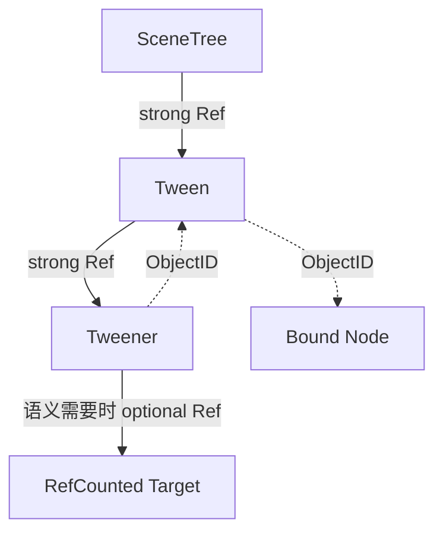

# 身份与所有权分离：Godot ObjectID、RefCounted 与弱引用的生命周期模型

> 系列：从 Godot 源码理解引擎设计
>
> 日期：2026-08-07
>
> 状态：草稿
>
> 核心问题：跨帧保存一个对象时，系统究竟应该只记住“它是谁”，还是必须保证“它继续活着”？

[系列目录](../blog.html)

游戏引擎中很多生命周期问题并不是发生在对象创建时，而是发生在“稍后再使用它”的那一刻。

例如：

- 一个 Tween 需要在未来几帧继续修改某个目标；
- 一个异步加载任务要在结束时回调原对象；
- 一个事件订阅者保存了另一模块的对象；
- 一个子系统需要记住某个 Node，但并不应该因此阻止 Node 被销毁；
- 一个资源正在参与后台任务，任务结束前又不能提前析构。

最直接的做法是保存一个指针。

但指针只回答：

> 那块内存在哪里？

它没有回答：

> 那个对象现在还是不是原来的对象？

更没有回答：

> 我保存这个关系之后，是否应该阻止它被销毁？

这三个问题如果使用同一种引用关系表达，系统最终通常会在两个方向之一失控：

- 引用太弱，跨帧访问出现悬空目标；
- 引用太强，对象之间形成无法释放的所有权环。

Godot 的对象系统值得研究的地方，就在于它没有试图用一种“万能引用”解决所有问题，而是把身份和所有权拆成了不同机制。

## 先说结论：能够找到对象，与有权让对象继续存活，是两种不同能力

**身份引用（即“记住它是谁”）**：保存一个稳定身份，在使用时重新判断该身份当前是否仍然对应有效对象，但本身不延长目标生命周期。

**强所有权（即“保证它继续活着”）**：只要这份引用仍然存在，目标就不能进入最终析构。

Godot 中大致可以看到四层职责：

| 机制 | 主要职责 | 是否保活 |
|---|---|---|
| `ObjectID` | 保存对象身份 | 否 |
| `ObjectDB` | 验证身份当前是否仍有效 | 否 |
| `Ref<T>` | 持有 `RefCounted` 强引用 | 是 |
| `WeakRef` | 保存弱身份，需要时重新解析 | 否 |

而 `RefCounted` 本身负责定义：

> 强引用增加和减少时，什么时候对象仍然活着，什么时候可以进入最终销毁。

这种分层的核心价值，不只是防止崩溃。

它让代码可以准确表达关系：

```text
我只需要以后重新找到你
```

和：

```text
只要这个任务没有结束，你就必须继续存在
```

并不是同一句话。

## ObjectID 解决的是身份陈旧，而不是对象所有权

普通裸指针最大的跨帧风险，是地址和逻辑身份被混在了一起。

对象已经销毁后：

```text
Object *target
```

仍然可能保留原地址。

如果内存之后被重新利用，这个地址甚至可能对应另一份完全不同的数据。

Godot 的 `ObjectID` 不直接把裸指针作为长期身份，而是通过 ObjectDB 中的槽位和校验值重新解析对象。

可以把它近似理解为：

```text
ObjectID
=
槽位位置
+
这一代对象的校验身份
```

当对象被删除时，对应槽位会失效。

即使同一个槽位以后分配给新对象，新对象也拥有新的 validator。

因此旧 ID 再去解析时：

```text
槽位相同
但 validator 不同
→ 返回无效
```

这是一种典型的**代际身份（即“地址能复用，身份证不能冒用”）**设计。

它解决的问题是：

> 我保存的那个身份，现在是否仍然代表原来的对象？

但 ObjectID 本身不会增加引用计数。

保存一个 ObjectID，并不会阻止目标被销毁。

这正是它有价值的地方。

如果一个观察者只是需要：

- 下次 Tick 检查对象是否仍存在；
- 回调时重新找目标；
- 保存父对象身份；
- 在编辑器或调试工具中记录实例；

那么它通常没有理由仅仅因为“记住了目标”就取得目标生命周期所有权。

## 身份解析成功，也不等于后续操作期间一定安全

这里还有一个容易被忽略的时间窗口。

假设逻辑是：

```text
通过 ObjectID 找到目标
→ 执行一组后续操作
```

如果目标是普通 Object，身份解析成功只能说明：

> 在解析的那个时刻，它仍然有效。

它并不会自动为后续所有操作创建强生命周期保证。

因此需要区分两个语义。

### 瞬时观察

只需要：

```text
现在对象还在吗？
```

可以使用身份验证。

### 跨操作稳定持有

需要：

```text
从现在到这段操作结束，对象必须一直存在。
```

对于 `RefCounted` 对象，应把身份提升成强 `Ref`。

这形成了一条重要设计原则：

> Handle 用来重新找到对象，Lease/Ref 用来跨越时间保护对象。

很多框架把这两个能力都塞进一个 `EntityHandle`、`ServiceHandle` 或裸对象引用中，后续就很难判断一个调用者究竟只是观察者，还是生命周期 Owner。

## RefCounted 使用的是侵入式引用计数

Godot 的 `Ref<T>` 和 `std::shared_ptr` 在使用体验上有相似之处，但内部模型不同。

**侵入式引用计数（即“计数器就在对象自己身上”）**：强引用计数属于目标对象本身，而不是由一个独立 control block 保存。

因此只有继承 `RefCounted` 的类型才参与这一协议。

结构可以简化为：

```text
RefCounted
├─ refcount
├─ 首次认领状态
└─ 释放临界状态

Ref<T>
└─ T*
   └─ 通过 RefCounted 协议增减强引用
```

`Ref<T>` 本身并不单独决定对象是否 delete。

它只负责成对调用引用协议。

真正的最终释放条件仍由 RefCounted 的生命周期逻辑决定。

这使“引用包装”和“对象生命协议”保持了清晰分工。

## 第一个 Ref 不是普通的加一操作

新创建的 RefCounted 对象有一个很特殊的阶段：

> 对象已经存在，但第一份正式强所有权尚未完成接管。

如果新对象一创建，计数就简单从零开始，那么并发环境下会出现一个危险问题：

```text
对象刚创建
→ 还没建立第一份正式 Ref
→ 另一个线程看见 count == 0
→ 把它判断为不可再引用
```

Godot 因此使用了一个首次认领协议。

可以把过程理解为：

```text
对象出生
→ 处于临时生命状态
→ 第一份 Ref 完成认领
→ 进入普通引用计数阶段
```

它不只是一个实现技巧。

它揭示了生命周期系统中经常被忽略的第四个阶段：

```text
未创建
→ 已创建但尚未正式接管
→ 正常持有
→ 最终释放
```

如果自己的框架允许对象先由工厂创建，再由 Scope、容器或 Lease 系统接管，就同样需要定义：

> 创建完成到正式 Owner 建立之间，谁负责让对象保持有效？

## 引用计数归零之后不能再复活

引用计数系统最危险的竞态之一是：

```text
线程 A：
最后一个强引用释放
→ count 变为 0
→ 开始析构

线程 B：
同时尝试增加引用
```

如果线程 B 可以把 0 再加回 1，就会得到一个正在销毁过程中的“复活对象”。

这类对象可能已经：

- 清理了脚本绑定；
- 释放了内部资源；
- 从全局注册表摘除；
- 断开了事件；
- 处于部分析构状态。

Godot 的安全引用计数把零作为终态：

```text
count > 0
→ 可以增加

count == 0
→ 新 reference 失败
```

**零后不可复活（即“进入死亡流程后不能抢救回来”）**是一条非常值得迁移的原则。

类似规则同样适用于：

- 代际 Entity Handle；
- Session Lease；
- Asset Lease；
- 异步任务 Token；
- 网络连接 Handle；
- 运行时服务 Scope。

如果一个资源已经越过最终释放边界，新 acquire 应失败，而不是重新把旧身份拉回活动状态。

## 替换所有权时，应先保护新对象，再释放旧对象

生命周期 Bug 不只来自“忘记引用”。

引用替换顺序也很重要。

假设一个 Owner 当前持有 A，现在要改成 B。

危险顺序是：

```text
先释放 A
→ A 触发一串析构
→ 析构间接影响 B
→ 再尝试持有 B
```

Godot `Ref<T>` 的替换策略更接近：

```text
确认并取得 B 的新强引用
→ 当前引用切换到 B
→ 最后释放旧的 A
```

**先获取后释放（即“先抓住新的，再松开旧的”）**降低了替换过程中对象图提前坍塌的风险。

这条原则并不限于智能指针。

在框架设计中，下列操作也适合遵循相同顺序：

- Runtime Service 热切换；
- Scene Scope 迁移；
- Asset 版本切换；
- 当前 Session 更换；
- 配置快照更新；
- 活动 Controller 替换。

如果新 Owner 尚未建立，就先销毁旧 Owner，系统会人为制造一个没有合法拥有者的中间状态。

## 弱引用真正解决的是“关系存在，但不拥有”

对象图中最容易形成强引用环的关系是：

```text
Parent
→ strong Child

Child
→ strong Parent
```

如果 Parent 和 Child 都是引用计数对象：

```text
Parent 等 Child 释放
Child 等 Parent 释放
→ 两边都无法归零
```

引用计数并不是追踪式 GC。

它不会自动分析整张对象图并发现循环。

因此，关系本身需要携带所有权语义。

一个常见规则是：

```text
Owner → Child
使用强引用

Child → Owner
使用 ObjectID / WeakRef
```

这并不是说“父子关系永远如此”。

真正原则是：

> 决定生命周期的边使用强引用，只用于导航或回查的反向边使用弱身份。

例如：



图中每条边表达不同责任。

这比“所有地方都用智能指针”更重要。

真正决定系统能否正确释放的，不是智能指针数量，而是对象图中哪一条边拥有谁。

## WeakRef 不是更安全的裸指针

Godot 的 WeakRef 本质上保存的是目标 ObjectID。

它自己可以被正常持有，但不会替目标续命。

读取 WeakRef 时，会重新去 ObjectDB 判断身份。

如果目标是 RefCounted，并且调用方需要稳定使用，就可以在那一刻形成一个新的强 Ref 快照。

因此它的语义更像：

```text
我记得你是谁
但我没有权利要求你一直活着

需要使用时
→ 再看看你是否还存在
→ 必要时临时取得强所有权
```

这与裸指针最大的区别在于：

裸指针通常隐含一种危险假设：

> 我保存了地址，所以以后还能用。

WeakRef/ObjectID 的默认假设恰好相反：

> 目标随时可能已经不存在，必须重新验证。

这是一种更适合跨帧、异步和事件系统的默认心智模型。

## SceneTreeTimer 和 Tween 展示了三种引用如何同时存在

新增加的 SceneTreeTimer/Tween 源码研究提供了一个非常清楚的真实案例。

SceneTree 持有：

```text
strong Ref → SceneTreeTimer
strong Ref → Tween
```

这表示：

> 只要任务还登记在 SceneTree 调度列表中，它必须继续存在。

Tween 内部又持有：

```text
strong Ref → Tweener
```

表示 Tweener 的生命周期属于 Tween。

但 Tweener 反过来访问父 Tween 时，不再建立另一条强边，而是：

```text
ObjectID → parent Tween
```

需要时再解析。

绑定普通 Node 时，同样只保存 ObjectID。

原因是：

> 一个 Tween 观察或操作某个 Node，不应默认意味着 Tween 有权阻止 Node 被场景系统销毁。

如果目标是 RefCounted，且某类 Tweener 的语义确实要求目标在任务期间存活，则可以额外保存强 Ref。

这里不是统一使用一种引用，而是根据关系选择：

| 关系 | 适合的表示 |
|---|---|
| 调度器必须保证任务存在 | 强 Ref |
| 父流程必须拥有子步骤 | 强 Ref |
| 子步骤只需回查父流程 | ObjectID |
| Tween 绑定普通场景 Node | ObjectID |
| 异步任务必须保住资源对象 | 可选强 Ref |

这是一种非常成熟的对象图设计：

> 引用类型跟随责任，而不是跟随编码习惯。

## 暂时离开场景树，也不等于对象已经死亡

Tween 绑定 Node 的处理还有一个值得注意的细节。

目标可能处于三种不同状态：

```text
ObjectDB 已找不到
→ 对象已经失效

对象还存在，但暂时不在 SceneTree
→ 生命周期仍然有效，只是当前不能推进

对象存在且在 Tree 中
→ 按暂停和 Process 规则继续
```

如果只使用一个：

```text
target == null
```

很容易把“暂时不可参与运行”和“已经不存在”混在一起。

这说明生命周期状态往往不是简单的：

```text
alive / dead
```

而至少可能包含：

```text
存在
可解析
已挂载
可处理
正在运行
已完成
等待清理
已销毁
```

对框架来说，这是一条很重要的设计提醒：

> 存活状态、激活状态和调度状态应当分开表达。

GameObject Active、Service Installed、Session Connected、Task Running、Asset Loaded 都不应该被粗暴压成同一个布尔值。

## 原子引用计数并不等于对象线程安全

`SafeRefCount` 使用原子协议处理引用数量。

这保证的是：

- 增减引用不会因为普通数据竞争直接破坏计数；
- 归零之后不能重新增加；
- 最终释放过程拥有明确临界边界。

但它并不保证：

```text
两个线程可以同时修改 Resource 的业务字段
```

也不保证：

```text
普通 Object 通过 ObjectID 找到后
可以无约束跨线程长期使用
```

**引用线程安全（即“生命票数算得准”）**和**对象线程安全（即“对象内容可以并发访问”）**是两个不同问题。

这一点非常容易在框架设计中被混淆。

例如一个线程安全的 `SharedHandle<T>` 只能证明：

> Handle 的 acquire/release 没有竞争错误。

它不能自动证明：

> T 的 Update、Dispose、Reload 和事件回调可以并发执行。

生命周期协议只解决生命周期问题。

业务并发仍然需要自己的锁、Actor、Job、主线程约束或不可变数据策略。

## 跨语言对象的最终销毁还需要统一裁决

Godot 的 RefCounted 并不只面对 C++。

一个对象还可能关联：

- ScriptInstance；
- GDExtension；
- 语言绑定；
- 托管运行时对象。

因此最终一次 `unreference()` 不能简单理解为：

```text
count == 0
→ delete
```

底层还需要处理跨语言绑定的生命周期转换，并确保其他释放临界段已经退出。

这暴露了另一个通用问题：

> 一个对象可能拥有多个生命周期系统，但最终只能有一个销毁事实。

Unity 框架中也经常存在类似情况：

```text
C# Service
+
Native Handle
+
UnityEngine.Object
+
异步任务
+
事件订阅
```

如果各层分别认为自己拥有最终释放权，就容易出现：

- Native 已释放，Managed 仍持有；
- Managed Dispose 完成，异步回调再次访问；
- Unity Object 已 Destroy，但普通 C# 引用仍非 null；
- 事件总线继续保留旧订阅者；
- 热更新卸载后旧 Delegate 仍然存在。

跨运行时生命周期必须在某个明确边界统一收敛。

## 这套模型与几种常见方案的区别

| 方案 | 身份稳定性 | 自动保活 | 强环风险 | 跨帧观察 |
|---|---|---|---|---|
| 裸指针 | 低 | 否 | 低 | 风险高 |
| 全部强智能指针 | 高 | 是 | 高 | 安全但容易过度拥有 |
| 纯代际 Handle | 高 | 否 | 低 | 需要重新解析 |
| Godot 式混合模型 | 身份与所有权分开 | 按关系选择 | 可主动弱化 | 适合复杂对象图 |

Godot 的价值并不在于：

> 每个项目都应该复制 ObjectDB 和 RefCounted。

真正值得迁移的是分型思想：

```text
身份
≠
所有权
≠
运行状态
≠
线程安全
```

只要这四件事在类型和 API 中被明确区分，很多生命周期 Bug 会在设计阶段就变得更容易发现。

## 对一般游戏框架的迁移方式

一个自研框架不需要直接复制 `Ref<T>`。

可以把相同原则映射成自己的结构。

例如 ECS：

```text
EntityHandle
→ index + generation
→ 只表达身份

EntityLease
→ 在异步操作期间阻止实体资源提前回收
```

例如服务系统：

```text
ServiceId
→ 查找服务身份

ServiceScope
→ 决定服务由谁创建和销毁
```

例如资源系统：

```text
AssetHandle
→ 定位逻辑资源

AssetLease
→ 保证加载结果在消费者使用期间不被卸载
```

例如网络：

```text
SessionId
→ 表示连接身份

SessionLease / ConnectionOwner
→ 决定连接的真实生命周期
```

它们都遵循同一条规则：

> “我知道你是谁”和“我负责让你活着”必须是两种不同权限。

## 几种常见设计失败

### 所有跨模块关系都保存对象引用

短期方便，但最终无法判断哪个模块真正拥有生命周期。

### 所有关系都改成强引用

消除了悬空访问，却制造大量对象环和无法释放的问题。

### Handle 被当成强生命周期保证

代际 ID 只能验证身份，不能自动保证解析后的对象一直存活。

### 弱引用解析一次后长期保存裸指针

第一次检查有效，不代表后续帧仍然有效。

### 引用计数归零后允许重新 acquire

对象可能已经开始析构，形成危险复活。

### 强引用计数使用原子操作后，就宣称对象线程安全

计数安全与业务状态并发安全完全不同。

### 一个 `isAlive` 表达所有状态

无法区分存在、挂载、运行、完成、等待清理和最终销毁。

### 双向对象关系全部使用强引用

引用计数系统无法自动回收环。

### 创建者和真正 Owner 之间没有接管协议

对象在初始化阶段可能处于无人负责或重复负责状态。

### Managed、Native 与引擎对象各自独立释放

最终生命周期没有统一裁决点。

## 我的生命周期设计检查表

设计跨帧对象关系时，我会至少检查：

1. 这个引用表达身份，还是表达所有权？
2. 保存它是否应该阻止目标被销毁？
3. 如果只需要观察，能否使用代际 Handle 或弱引用？
4. ID 被重新解析后，后续操作是否需要临时 Lease？
5. 对象销毁后，旧 ID 是否一定无法命中新对象？
6. 最后一个强 Owner 释放后，是否禁止重新 acquire？
7. 创建到第一 Owner 接管之间是否有明确生命协议？
8. 替换 Owner 时是否先取得新所有权，再释放旧所有权？
9. 对象图中的反向边是否真的需要强引用？
10. 是否存在 RefCounted/SharedPtr 强引用环？
11. 回调、Signal 和异步任务是否会偷偷形成强环？
12. 目标暂时停用与真正销毁是否被区分？
13. 完成、停止、失效和等待清理是否拥有独立状态？
14. 引用计数线程安全是否被错误扩大成对象线程安全？
15. 跨线程使用时，业务字段是否有独立并发协议？
16. Managed、Native 和引擎对象最终由谁裁决销毁？
17. Scope 退出时是否能够确定性断开所有强边？
18. 调试工具能否解释“谁现在还在持有这个对象”？
19. 弱身份解析失败时，调用方是否能够安全退化？
20. 当前关系是否真的需要生命周期耦合？

复杂系统的生命周期问题，很多时候并不是“忘了释放”。

更常见的根因是：

> 一段代码保存了一个关系，却没有明确这个关系究竟意味着什么。

Godot 的 ObjectID、RefCounted、Ref 和 WeakRef 最值得借鉴的地方，就是把这些不同含义拆开。

ObjectID 负责回答：

> 这个身份现在还有效吗？

Ref 负责回答：

> 谁正在保证这个对象继续存在？

WeakRef 负责表达：

> 我记得这个对象，但我并不拥有它。

而对象图真正稳定之后，生命周期管理也就不再只是“哪里调用 free”的问题。

它变成了一套可以被类型、结构和工具共同验证的所有权协议。

## 术语对照

| 正式术语 | 文中通俗称呼 |
|---|---|
| 身份引用 | 记住它是谁 |
| 强所有权 | 保证它继续活着 |
| 代际身份 | 地址能复用，身份证不能冒用 |
| 侵入式引用计数 | 计数器就在对象自己身上 |
| 零后不可复活 | 进入死亡流程后不能抢救回来 |
| 先获取后释放 | 先抓住新的，再松开旧的 |
| 引用线程安全 | 生命票数算得准 |

---

## 内部资料依据

本文主要基于以下研究材料整理：

- `notes/GODOT源码研究/02_对象系统/12_RefCounted与Ref强弱所有权及并发销毁边界.md`
- `notes/GODOT源码研究/02_对象系统/03_ObjectDB内存管理与生命周期.md`
- `notes/GODOT源码研究/01_运行时调度/16_SceneTreeTimer与Tween轻量调度及生命周期边界.md`
- `blogs/README.md`

本文基于当前 Godot 源码研究笔记进行工程化整理。关于 RefCounted 首次认领、零后不可复活、跨语言释放裁决和部分并发销毁边界，目前主要属于源码审计结论，而不是已经通过独立专项测试全面验证的行为保证；文中迁移到其他游戏框架的 Handle、Lease 和 Scope 设计属于工程建议，不表示相关项目已经采用完全相同的实现。
