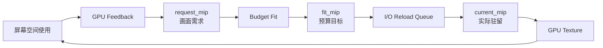

# 驻留状态收敛：Godot 纹理 Mip 流送的反馈需求、预算目标与实际驻留

> 系列：从 Godot 源码理解引擎设计
>
> 日期：2026-08-28
>
> 状态：草稿
>
> 核心问题：当场景拥有大量高分辨率纹理时，系统怎样根据画面真实使用情况决定哪些纹理应该提高质量、哪些应该降级，同时保证显存预算、I/O 峰值和资源生命周期都保持可控？
>
> 关键词：Godot、Texture Streaming、Mip、GPU Feedback、Memory Budget、Residency

[系列目录](../blog.html)

镜头正在快速靠近一面巨大的建筑墙体。

墙上的纹理此时仍然比较模糊。

系统已经知道：

> 这张纹理现在需要更高分辨率。

但这并不意味着下一帧它就一定能够立刻显示完整 mip 0。

原因可能有很多：

- 当前显存预算已经接近上限；
- 其他更重要纹理同样在请求提高质量；
- I/O 线程还有此前的重载任务；
- GPU feedback 刚刚到达 CPU；
- 当前只允许纹理每次推进一级 mip；
- 纹理虽然已经收到新的目标，但实际 GPU payload 尚未完成替换。

于是一个看起来只有：

```text
纹理清晰
/
纹理模糊
```

两种结果的问题，实际上至少存在三种不同状态：

```text
画面想要什么
预算允许什么
GPU 现在真正有什么。
```

Godot 当前的纹理 Mip Streaming 最值得研究的地方，就是它没有把这三个事实压成同一个 `LOD` 数字。

## 先说结论：纹理流送是一套持续运行的反馈控制系统

**驻留状态收敛（后文简称“从画面想要的质量逐步追到 GPU 真正拥有的质量”）**：渲染器持续测量画面对纹理分辨率的需求，预算系统根据全局资源压力决定允许达到的质量，再由 I/O 与 GPU 资源替换逐步让实际驻留状态追赶目标。

整个系统可以压缩成：



这里首先需要记住：

```text
Mip 0
=
最高质量。

Mip index 越大
=
驻留分辨率越低。
```

因此：

```text
request_mip = 0
fit_mip = 2
current_mip = 3
```

实际表达的是：

```text
画面希望最高质量
↓
预算暂时只批准到 mip 2
↓
I/O 目前甚至还只完成到 mip 3。
```

系统正在向目标收敛。

但还没有完成。

## Texture Streaming 和异步 Resource Loading 是两类问题

这两个系统很容易因为都涉及：

```text
I/O
异步
资源
```

而被合并理解。

实际上它们的完成对象完全不同。

### ResourceLoader

主要回答：

```text
我请求的这个 Resource
什么时候能够被拿到？
```

典型生命周期是：

```text
Request
→
Dependency
→
Load
→
Complete。
```

### Texture Streaming

主要回答：

```text
一个已经存在的纹理
当前应该驻留到哪一个 mip？
```

它不会在第一次 Resource Load 完成以后结束。

运行过程中会持续：

```text
升质量
降质量
再升质量
再降质量。
```

因此它的生命周期更像一个长时间运行的控制器：

```text
Observe
→
Decide
→
Adjust
→
Observe Again。
```

这也是为什么把两者统一成一个：

```text
AsyncResourceLoader
```

往往会损失重要状态语义。

## 流式纹理首先需要可独立寻址的 Mip 数据

普通纹理可以在加载时直接建立完整 GPU Texture。

流式纹理则需要：

> 不必读取完整最高质量内容，也能直接从某个较低 mip 开始建立合法纹理。

Godot 当前引入的 `.stex` 文件会保存：

- 原始宽高；
- Image Format；
- mip 数量；
- 每个 mip 的 offset；
- 每个 mip 的 size；
- 完整 mip chain。

因此运行时可以直接：

```text
Seek 到 mip 3
→
读取 mip 3
→
继续读取 mip 4…N
→
把 mip 3 作为当前最高质量层。
```

这里有一个很重要的细节。

所谓：

```text
当前驻留 mip 3
```

并不是：

```text
GPU 只保留 mip 3 这一张图。
```

而是：

```text
mip 3
+
更低质量的 mip 4…N
```

共同组成一条新的、较短 mip chain。

这样 GPU 仍然可以正常完成不同采样距离下的 mip 选择。

## Resource 的逻辑尺寸和实际驻留尺寸不能混为一谈

**逻辑纹理尺寸（后文简称“这张纹理本来有多大”）**和**驻留纹理尺寸（后文简称“GPU 现在真正放了多大”）**是两个不同事实。

例如源纹理：

```text
4096 × 4096。
```

当前只从 mip 2 开始驻留：

```text
1024 × 1024
+
后续更小 mip。
```

此时 Resource 仍然应该知道：

```text
原图是 4096 × 4096。
```

因为 GPU feedback 计算需要根据原始尺寸判断：

> 当前屏幕覆盖究竟需要哪个 mip。

如果系统把：

```text
当前 resident width
```

误写回：

```text
Resource logical width，
```

下一轮质量计算就会不断围绕一个已经降级后的尺寸继续判断，形成错误反馈。

所以：

> 逻辑身份描述资源本身，驻留状态描述资源当前实现。

两者不能互相覆盖。

## Resource 身份稳定，底层 payload 可以变化

流式纹理另一个非常重要的目标是：

```text
提高或降低 mip
```

时，不要求所有材质重新绑定一张新的 Texture Handle。

Godot 当前的重载路径会：

```text
读取新的 mip chain
→
建立新的 GPU Texture
→
把新纹理兼容替换进原有 RID 身份。
```

上层材质继续引用原来的纹理身份。

变化的是：

```text
这个身份当前背后的 GPU payload。
```

**稳定资源身份（后文简称“壳不换，里面驻留的质量可以换”）**可以避免流式更新向整个上层引用图扩散。

这种设计并不只适用于纹理。

任何需要：

```text
逻辑对象长期稳定
+
底层实现可以重建
```

的资源，都可以考虑类似结构。

## GPU 比 CPU 更知道纹理究竟被怎样使用

一个最简单的纹理 Streaming 算法是：

```text
Texture 与 Camera 的距离
→
决定 mip。
```

但距离并不等于真实纹理需求。

同一张纹理可能：

- 被透视压缩；
- 位于斜面；
- 只占很小屏幕面积；
- 被高倍 UV 平铺；
- 出现在多个不同尺寸物体上。

因此 Godot 当前方案让 Shader 直接根据：

```text
dFdx(UV)
dFdy(UV)
```

估算纹理坐标在屏幕空间中的变化尺度。

**GPU 使用反馈（后文简称“由真正正在画这些像素的 GPU 告诉系统需要多细”）**比简单世界距离更接近最终采样事实。

它回答的不是：

```text
纹理离镜头几米？
```

而是：

```text
当前这些 fragment
实际需要多少 texel 密度？
```

## 反馈粒度本身就是预算

如果每一个：

```text
texture sampler
```

都在 GPU feedback buffer 中拥有独立 slot，

反馈精度会很高。

代价也是：

- buffer 更大；
- atomic 次数更多；
- 回读数据更多；
- CPU 处理量更高。

当前实现选择：

```text
材质
```

作为主要反馈身份。

一个材质中的多张流式纹理共享同一份屏幕空间 UV 需求。

**反馈聚合粒度（后文简称“用多细的单位收集真实需求”）**本身也是一项性能—精度权衡。

粒度越细：

```text
判断越准确
反馈成本越高。
```

粒度越粗：

```text
成本降低
但同组资源可能被一起过度提质。
```

这是一种很通用的遥测设计问题。

并不是 Streaming 独有。

## GPU Feedback 不应该让 Render Thread 等待

渲染线程最不应该做的是：

```text
GPU feedback 还没回来
→
那我停下来等。
```

当前实现使用多个 feedback buffer 轮转，并通过异步 GPU readback 获取结果。

大致过程是：

```text
Buffer A
GPU 正在写

Buffer B
正在异步 Readback

Buffer C
已经清零
准备下一帧使用。
```

如果当前所有反馈 buffer 都在途：

```text
本轮直接跳过新的反馈提交。
```

而不是：

```text
阻塞 Render Thread。
```

这体现了一项重要原则：

**观测可丢帧，主渲染不可被观测拖死。**

Texture Streaming 并不要求：

```text
每一帧都必须得到新反馈。
```

少一次样本最多让质量调整稍晚。

它不应该直接让整帧停止。

## request、fit 与 current 是整个系统最重要的三本账

**反馈需求（后文简称“画面想要什么”）**：经过 GPU feedback、平滑和闲置策略以后形成的 `request_mip`。

**预算目标（后文简称“系统现在允许什么”）**：考虑显存预算、单纹理 LOD 边界和全局竞争以后形成的 `fit_mip`。

**实际驻留（后文简称“I/O 和 GPU 现在真正做到了什么”）**：已经完成 Resource Reload 和 GPU Texture Replace 的 `current_mip`。

三者之间应该始终允许存在差异：

```text
request
≠
fit
≠
current。
```

这种差异不是错误。

恰恰是异步预算系统的正常运行状态。

## 一个简单调试矩阵

假设一张纹理看起来过于模糊。

可以先查看三种状态。

| request | fit | current | 更可能的问题 |
|---:|---:|---:|---|
| 0 | 0 | 3 | I/O / reload 尚未追上 |
| 0 | 2 | 2 | 预算不允许当前提到最高质量 |
| 3 | 3 | 3 | GPU feedback 本身认为不需要更高质量 |
| 0 | 0 | 0 | Residency 已满足，应检查采样、材质或其他渲染问题 |

如果只显示：

```text
Current LOD = 3
```

第一、第二、第三种情况在调试界面中看起来完全一样。

这就是状态拆分真正带来的可观测价值。

## 画面需求不应该直接触发 I/O

如果 Shader 反馈：

```text
mip 0。
```

系统立刻：

```text
Load mip 0。
```

那么全场纹理同时接近镜头时，很容易制造巨大内存和 I/O 峰值。

所以 GPU Feedback 首先只是：

```text
Demand。
```

还必须经过：

```text
Admission。
```

也就是预算准入。

这和很多实时系统一样：

```text
需求
≠
资源分配许可。
```

## 预算系统真正决定“谁可以牺牲质量”

当前预算拟合会先为每张纹理形成候选：

```text
请求质量
单纹理 min/max
系统 min/max
当前活动状态
预计驻留字节数。
```

如果总量没有超过预算：

```text
不需要额外降级。
```

如果超过预算：

系统需要回答：

> 哪些纹理应该先增加 mip，也就是降低质量？

当前源码中的比较策略大致考虑：

- 已经比自身请求质量更高的纹理；
- 长时间未活动的纹理；
- 占用更大的纹理；
- 当前质量更高的纹理。

这说明预算器并不是简单：

```text
所有 Texture mip +1。
```

它在做的是：

**资源牺牲排序（后文简称“预算不够时决定先让谁变糊”）**。

这才是真正的 Streaming Policy。

## 预算不能越过硬规则去追求一个不可能数字

假设所有纹理已经达到允许的最差 mip，

总内存仍然超过预算。

系统可以：

```text
继续无视 LOD 下限降低质量
```

强行满足预算。

也可以：

```text
保持硬边界
→
报告预算无法满足。
```

当前实现选择后者。

这个选择很重要。

它明确了：

```text
Memory Budget
```

是一项软目标。

而：

```text
Min / Max LOD Override
```

可以是更强的内容合同。

成熟预算系统不应该为了让 Dashboard 数字好看，悄悄破坏更高优先级约束。

## 单阈值预算很容易制造质量抖动

假设预算：

```text
512 MB。
```

系统刚超过：

```text
513 MB
→
降级纹理。
```

降级后变成：

```text
511 MB。
```

下一轮又允许提质。

随后再次：

```text
513 MB。
```

于是不断：

```text
Upgrade
Downgrade
Upgrade
Downgrade。
```

这会同时制造：

- I/O 抖动；
- GPU Resource 重建；
- 可见画质跳动。

因此当前实现使用 high/low 区间，而不是单一阈值。

**预算滞回（后文简称“超过一段才开始降，降下来以后多留一点余量”）**可以显著降低临界值附近来回切换。

在当前研究快照中，预算拟合使用了一段明确 deadband。

具体比例属于当前实现细节。

真正值得迁移的是：

> 触发边界和恢复边界最好不是同一个数字。

## 画质不足和内存回收的用户感知成本不同

镜头突然靠近一个大型物体时，如果纹理仍然模糊：

```text
非常容易看见。
```

镜头刚离开以后，如果纹理多保持几秒较高质量：

```text
玩家通常完全不会发现。
```

因此两种状态变化不应该使用对称速度。

**非对称响应（后文简称“靠近时快提质，离开后慢慢回收”）**：

```text
请求更高质量
→
快速响应

请求降低质量
→
平滑 / inactivity decay。
```

这样可以同时减少：

- 可见糊图；
- 镜头轻微移动造成的质量震荡；
- 高频 I/O Reload。

这是一种非常通用的实时控制思想：

> 提升服务质量和回收资源往往拥有不同的人类感知成本。

## fit 已经变化，也不应该一次跳到目标

假设：

```text
current_mip = 5
fit_mip = 0。
```

最直接的做法是：

```text
直接加载完整 mip 0 chain。
```

但这可能突然制造：

- 大量磁盘读取；
- Image 构建；
- GPU Texture Replacement；
- 内存峰值。

当前 I/O 路径更接近：

```text
5
→
4
→
3
→
2
→
1
→
0。
```

**渐进式收敛（后文简称“一档一档追，不让一次状态变化制造大峰值”）**让质量目标可以很激进，但执行成本保持平滑。

这也是：

```text
Target State
```

与：

```text
Transition Policy
```

必须分开的原因。

目标可以是 mip 0。

并不意味着实现必须一步完成。

## 快速变化的目标不能无限生成 I/O Job

镜头高速移动时：

```text
fit_mip
```

可能连续变化：

```text
4
→
1
→
3
→
0
→
2。
```

如果每一次变化都生成一个独立 I/O Request：

```text
历史目标队列
```

会迅速堆积。

等任务真正执行时，它们可能已经完全失去价值。

当前实现会合并：

```text
pending_reload_mip。
```

如果已有工作在队列中：

```text
更新最新目标
```

而不是重复再排一个完整 job。

**目标合并（后文简称“只追最新状态，不把已经过时的目标逐个补做”）**是所有实时异步状态机都非常重要的一项能力。

它适用于：

- 纹理 Streaming；
- Scene Streaming；
- UI Search；
- 自动保存；
- 网络状态同步；
- AI 请求。

只要中间历史状态没有必须逐项执行的业务意义，就不应该机械保留。

## `fit_mip` 和 `current_mip` 的差值本身就是 Backlog

假设：

```text
request = 0
fit = 0
current = 4。
```

需求和预算完全一致。

问题只是：

```text
执行层还没追上。
```

这个差值可以视作：

**驻留积压（后文简称“系统已经批准，但底层还欠多少执行工作”）**。

如果大量纹理长期存在：

```text
fit << current，
```

说明真正瓶颈可能是：

- 磁盘；
- 解压；
- Image 构造；
- GPU 替换；
- 操作限速。

继续提高 Budget 并不能解决。

这也说明一个成熟 Streaming Dashboard 不应该只显示：

```text
Memory Used。
```

还应该显示：

```text
Demand Gap
Admission Gap
Execution Gap。
```

## Flush 必须有明确完成语义

有些工具场景不能接受：

```text
最终会慢慢追上。
```

例如：

- 截图；
- 高质量预览；
- 场景切换；
- 画质设置切换；
- Benchmark 准备。

这时需要：

```text
Flush。
```

但：

```text
RequestFlush()
```

仍然不应该被解释成：

```text
已经完成。
```

当前流程会：

```text
强制执行一次 Fit
→
让已有 Reload 跳过普通限速追向 Target
→
插入 I/O Fence
→
等待此前工作
→
发出 flush_completed。
```

**流送完成边界（后文简称“明确等到这一批目标真正追完以后再继续”）**必须通过 Fence 和 Completion Signal 表达。

这和所有异步系统一样：

```text
请求
```

和：

```text
请求已兑现
```

是两件事。

## Flush 也不是永恒稳定点

这里还要保留一个很重要的边界。

Flush 可以保证：

```text
这次 Fence 之前的相关工作已经完成。
```

但 GPU 画面仍然继续运行。

之后可能又产生新的 Feedback：

```text
新的 request
→
新的 fit
→
新的 streaming work。
```

所以：

```text
flush_completed
```

不是：

> 从现在开始 Streaming 世界永远不会再变化。

它只建立：

> 这一批已知目标的明确完成点。

把局部 Barrier 扩大成永久状态，是异步系统中很常见的错误。

## 删除资源比停止请求复杂得多

假设一张 Texture 正在：

```text
I/O thread
读取新的 mip chain。
```

此时场景卸载。

Resource 被删除。

如果主线程直接：

```text
free StreamingState，
```

后台 job 还可能继续访问这块内存。

因此删除过程需要拆开：

```text
宣布 removing
→
取消新的 target
→
从 RenderingServer 解除关联
→
等待此前已经排入 I/O 的工作
→
最后 free state。
```

**删除收敛（后文简称“先阻止新工作，再等旧工作排空，最后才真正释放”）**不是一个普通 `delete`。

这条原则在：

- Asset Loading；
- Network Session；
- Worker Job；
- File Handle；

中都非常常见。

资源生命周期真正危险的时刻，往往不是加载。

而是：

> 已经有人在后台使用它时，Owner 决定它应该消失。

## 线程分工必须围绕状态所有权，而不是“全部 atomic”

当前 Texture Streaming 至少涉及：

| 执行域 | 主要职责 |
|---|---|
| Render Thread | 建反馈 Buffer、材质索引、GPU Readback |
| Feedback Thread | 解码反馈、平滑、预算 Fit |
| I/O Thread | 文件读取、纹理 Reload、推进 current mip |
| Game / Editor | Resource API、设置、Flush |

部分关键字段使用 atomic。

但真正的顺序关系很大程度上来自：

```text
Command Queue
+
单线程写入责任。
```

这说明：

> 看到 `memory_order_relaxed` 并不能直接判断系统没有同步。

同样：

> 加了 atomic 也不能替代线程所有权设计。

并发系统的正确性通常来自：

```text
谁可以写什么
什么时候可以写
通过哪条 Queue 交接。
```

而不是每个字段各自证明线程安全。

## Texture Streaming 的观测值也有证据层级

当前系统可以报告：

```text
Texture Streaming Memory。
```

但这个值主要根据 StreamingState 和 mip 字节估算。

它并不等于：

```text
D3D12 / Metal / Vulkan Driver
报告的实际物理显存驻留真值。
```

因此：

**预算模型观测值（后文简称“控制器认为自己用了多少”）**和：

**驱动物理驻留（后文简称“GPU 驱动实际上占用了多少”）**

不能使用同一个标签。

如果 Debug UI 写：

```text
VRAM Used = 412 MB
```

读者会自然认为这是物理事实。

更准确的名称应该体现：

```text
Streaming Estimated Resident Bytes。
```

这也是所有性能工具应该注意的证据边界：

> 模型估计值、逻辑状态和硬件事实必须明确标注来源。

## 当前源码中的能力边界

当前研究快照中，这套纹理 Streaming 并不是所有运行环境默认强制启用。

存在明确边界：

- Streaming Project Setting 可关闭；
- Compatibility Renderer 不进入完整 Streaming；
- Headless 不建立正常 Render Feedback Buffer；
- Importer 依赖可用的 VRAM Compression Family；
- 预算功能本身也可单独关闭。

这些事实很重要。

看到源码中存在完整：

```text
TextureStreaming
```

实现，不应扩大成：

> 当前所有 Godot 项目默认都在自动进行 Mip Residency Streaming。

代码存在、可配置启用和默认产品行为仍然是三种不同状态。

## 当前证据也还主要停留在源码闭环

研究已经从源码闭合：

- `.stex`；
- StreamedTexture2D；
- Material Feedback；
- Shader Feedback；
- Budget Fit；
- I/O Reload；
- Flush；
- 删除边界。

但当前笔记也明确记录：

- 没有编译 Godot；
- 没有运行真实 GPU Feedback；
- 没有 D3D12 / Metal / Vulkan 驻留 Benchmark；
- 没有 focused Texture Streaming Test；
- reload failure / remove race 仍需要运行证据。

因此最合适的表述是：

> 当前源码已经形成完整的 Streaming 状态机设计。

而不是：

> 当前实现已经被证明在所有平台拥有稳定性能和正确性。

## 与传统 LOD 的边界

普通 Mesh / Texture LOD 可能只是：

```text
根据距离
选择已经存在的多个资源版本。
```

纹理 Mip Streaming 更进一步：

```text
资源身份不变
↓
实际驻留 mip chain 持续变化。
```

它管理的是：

```text
Residency。
```

而不是只管理：

```text
Sample Selection。
```

这也是为什么它需要：

- I/O；
- Memory Budget；
- Resource Replacement；
- Thread Ownership。

## 与 Virtual Texturing 的边界

这套 Mip Streaming 同样不应该直接等同于 Virtual Texturing。

当前 StreamedTexture2D 更接近：

```text
以整条“从某 mip 到尾部”的 mip chain
作为驻留单位。
```

而 Virtual Texturing 通常会进一步把：

```text
Texture
```

切成更细的 Tile / Page，

按页面进行物理映射与反馈。

二者共享：

- Feedback；
- Budget；
- Residency；

思想。

但资源粒度和底层内存模型不同。

不能只因为都叫 Streaming 就写成同一种技术。

## 与普通 Asset Warmup 的边界

Asset Warmup 解决：

```text
我预测之后可能需要整个资源
→
提前 Acquire。
```

Mip Streaming 解决：

```text
资源已经存在
→
当前到底需要驻留到多高质量。
```

因此：

```text
Asset Present
```

并不代表：

```text
Residency Quality 已满足。
```

这是另一条值得迁移的状态边界。

## 对自研资源系统最值得迁移的是三态模型

如果自己设计资源 Streaming，我最优先保留的是：

```text
Requested
Admitted
Resident。
```

例如开放世界 Mesh Streaming：

```text
requested_lod
→
视觉系统想要哪个 LOD

admitted_lod
→
预算器允许哪个 LOD

resident_lod
→
磁盘 / GPU 当前真正完成哪个 LOD。
```

Scene Streaming 也可以类似：

```text
desired_state
→
scheduler accepted state
→
actual loaded state。
```

这种三态模型一旦成立，很多问题都会从：

```text
“系统好像坏了”
```

变成：

```text
到底卡在哪一层？
```

## Budget 应该只决定准入，不应该伪装成完成

假设内存压力缓解以后：

```text
admitted_lod
```

立即提高。

UI 如果马上显示：

```text
High Quality Loaded，
```

就是把准入状态冒充实际完成。

正确做法是继续等待：

```text
resident_lod
```

追上。

这一点不仅适用于 Streaming。

任何异步资源预算系统都需要防止：

```text
Scheduler 已批准
=
资源已经存在。
```

## 高频目标变化应该合并，而不是排队历史

玩家镜头、网络 Interest、AI 目标和搜索框都属于快速变化输入。

很多系统最初都会写成：

```text
输入每变化一次
→
排一个 Task。
```

最终 Task Queue 充满已经过时的历史目标。

更合适的是先问：

> 中间每一个状态是否都具有必须执行的业务意义？

如果没有：

```text
latest target wins
```

通常比：

```text
replay every target
```

更合理。

Texture Streaming 的 pending mip 合并是一个很清楚的实例。

## 滞回适用于所有资源回收控制器

只要存在：

```text
超过阈值
→
回收

低于阈值
→
重新扩张，
```

单一阈值就容易制造抖动。

例如：

- Object Pool；
- Worker Scale Out；
- Memory Cache；
- CDN Warm Cache；
- NPC LOD；
- Network Interest。

都可以考虑：

```text
high watermark
low watermark。
```

这并不意味着每个系统都使用同一百分比。

值得迁移的是：

> 回收触发点和恢复触发点拥有不同边界。

## 我的纹理 Streaming 检查表

1. Texture Resource 身份与当前驻留 payload 是否分离？
2. 逻辑 Width / Height 是否不会被当前 mip 尺寸覆盖？
3. 文件格式是否能够直接寻址目标 mip？
4. 从目标 mip 加载时是否保留合法的低质量 mip chain？
5. `requested`、`admitted`、`resident` 是否是三种不同状态？
6. 当前 Mip 0 / Mip N 的质量方向是否在 API 中足够清楚？
7. GPU Feedback 是否来自真实屏幕空间使用，而不只是世界距离？
8. Feedback 粒度是 per-texture、per-material 还是其他单位？
9. Feedback 粒度的精度—成本取舍是否明确？
10. GPU Readback 是否完全异步？
11. Feedback Buffer 饱和时是否可以跳帧，而不是阻塞 Render Thread？
12. 提高画质和降低画质是否需要不同响应速度？
13. 是否存在 inactivity decay？
14. Budget Fit 是否尊重单纹理硬 LOD 边界？
15. 预算无法满足时是否显式报告，而不是偷偷突破内容合同？
16. 是否使用 Hysteresis 避免预算边缘抖动？
17. Budget Candidate 是否拥有明确降级排序？
18. `fit` 变化以后是否允许渐进式收敛？
19. I/O 操作是否有速率限制？
20. Pending Target 是否会合并到最新目标？
21. 是否避免为过时目标无限堆 I/O Job？
22. `fit - current` 差距是否能够作为 Execution Backlog 观测？
23. Flush 是否拥有 Fence 与明确 Completion Event？
24. Flush Completion 是否不会被扩大成永久稳定状态？
25. Resource Remove 是否先阻止新工作，再等待旧工作排空？
26. Streaming State 的最终 free 是否晚于已有 I/O Job？
27. Render / Feedback / I/O / Game Thread 是否有明确状态 Owner？
28. Atomic 是否只是辅助，而不是线程所有权的替代品？
29. Debug UI 能否同时显示 request / fit / current？
30. 显存观测值是否明确标记是预算估计还是 Driver 真值？
31. Streaming Disabled / Unsupported Renderer 是否有明确退化路径？
32. 当前方案是否真的需要 Mip Streaming，而不是简单全加载或普通 LOD？
33. 运行测试是否覆盖快速镜头切换、预算震荡和 reload failure？
34. 删除与 Reload 竞态是否有 focused evidence？
35. 不同 GPU Backend 的实际驻留和性能是否经过独立验证？

Texture Streaming 最容易被概括成：

```text
离镜头近
→
加载高清 mip

离镜头远
→
卸载高清 mip。
```

这种描述没有错。

但它会掩盖真正困难的地方。

渲染器首先要知道：

```text
画面到底需要什么。
```

然后资源预算器需要决定：

```text
现在能允许什么。
```

再然后 I/O 和 GPU 才真正执行：

```text
现在做到了什么。
```

三件事永远可能暂时不一致。

正是这种不一致，让异步系统能够存在。

Godot 当前这套设计最值得保留的，不是具体的 UV 梯度公式，也不是某一个内存预算数字。

而是这三个状态之间清楚的责任边界：

```text
request_mip
→
需求事实

fit_mip
→
预算裁决

current_mip
→
实际完成。
```

GPU Feedback 不直接控制 I/O。

Budget 不假装资源已经加载。

I/O 也不必一次跳到最终目标。

资源身份则在整个过程中保持稳定。

于是一个不断变化、不断竞争资源的视觉需求，终于能够被整理成一套可限速、可回退、可观测、可 Flush，也能够安全销毁的持续控制系统。

这就是纹理 Mip Streaming 真正值得迁移的设计思想：

> **实时资源系统不应该追求“请求立即等于现实”，而应该建立一个能够让现实稳定追赶请求的状态收敛协议。**

## 术语对照

| 正式术语 | 文中通俗称呼 |
|---|---|
| 驻留状态收敛 | 从画面想要的质量逐步追到 GPU 真正拥有的质量 |
| 逻辑纹理尺寸 | 这张纹理本来有多大 |
| 驻留纹理尺寸 | GPU 现在真正放了多大 |
| 稳定资源身份 | 壳不换，里面驻留的质量可以换 |
| GPU 使用反馈 | 由真正正在画这些像素的 GPU 告诉系统需要多细 |
| 反馈聚合粒度 | 用多细的单位收集真实需求 |
| 反馈需求 | 画面想要什么 |
| 预算目标 | 系统现在允许什么 |
| 实际驻留 | I/O 和 GPU 现在真正做到了什么 |
| 资源牺牲排序 | 预算不够时决定先让谁变糊 |
| 预算滞回 | 超过一段才开始降，降下来以后多留一点余量 |
| 非对称响应 | 靠近时快提质，离开后慢慢回收 |
| 渐进式收敛 | 一档一档追，不让一次状态变化制造大峰值 |
| 目标合并 | 只追最新状态，不把已经过时的目标逐个补做 |
| 驻留积压 | 系统已经批准，但底层还欠多少执行工作 |
| 流送完成边界 | 明确等到这一批目标真正追完以后再继续 |
| 删除收敛 | 先阻止新工作，再等旧工作排空，最后才真正释放 |
| 预算模型观测值 | 控制器认为自己用了多少 |

---

## 内部资料依据

本文主要基于以下材料整理：

- `notes/GODOT源码研究/04_资源与场景/07_StreamedTexture2D纹理Mip流式加载与反馈预算状态机.md`
- `notes/GODOT源码研究/04_资源与场景/04_ResourceLoader线程化加载、缓存与完成边界.md`
- `notes/GODOT源码研究/04_资源与场景/02_资源导入管线与Metadata依赖缓存机理.md`
- `notes/GODOT源码研究/README.md`
- `blogs/README.md`
- `blogs/publication.v1.json`

本文主要依据研究时的 Godot `4.8.0-dev` / `master` 源码快照整理，其中纹理 Mip Streaming 的核心研究锚点来自当前笔记固定的源码提交。

当前研究已经静态闭合：

- `.stex` 文件格式；
- `StreamedTexture2D`；
- Resource / RID 稳定身份；
- Material Feedback；
- Forward Clustered / Mobile Shader Feedback；
- 异步 GPU Readback；
- Feedback Thread；
- Memory Budget Fit；
- I/O Reload；
- Flush；
- Remove / Reload 生命周期边界。

但本轮研究没有：

- 编译 Godot；
- 运行真实 Forward Clustered / Mobile GPU Feedback；
- 执行 D3D12、Metal、Vulkan 的驻留 Benchmark；
- 运行 focused Texture Streaming Test；
- 实测高频镜头切换下的预算滞回；
- 验证 reload failure 与 remove/reload 竞态；
- 证明当前实现已经成为所有 Godot 项目的默认启用行为。

因此本文把相关机制描述为**当前源码快照中已经形成的设计与状态机**，而不把跨平台性能、GPU 实际显存占用和最终产品默认策略写成已经获得运行验证的事实。

文中将 `requested → admitted → resident`、稳定资源身份、预算滞回、目标合并和渐进式收敛迁移到其他 Asset、Scene 或 Mesh Streaming 系统的部分属于工程设计归纳，不表示这些系统必须复制 Godot 的 `.stex`、Material Feedback 或具体线程模型。
