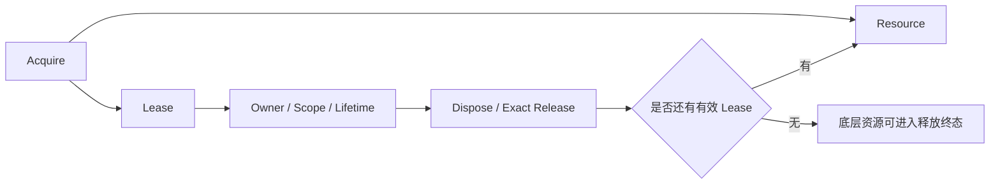
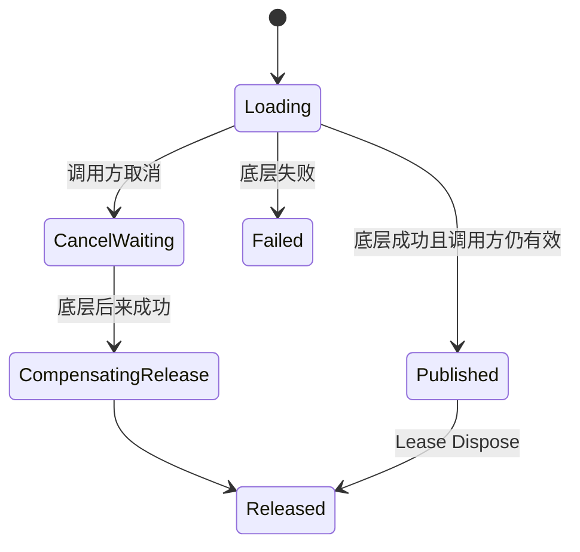
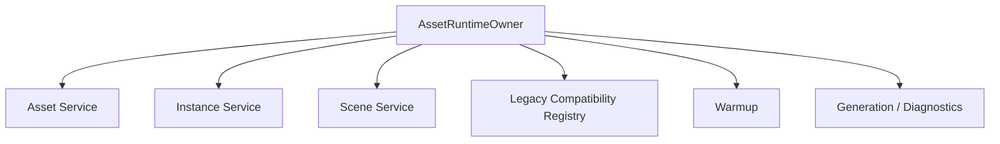

# 资源所有权闭环：Lease、Scope 与统一释放终态

> 系列：Sakura Framework 工程实践
>
> 日期：2026-08-17
>
> 状态：草稿
>
> 核心问题：一个资源已经成功加载之后，框架怎样准确知道究竟是谁拥有它、应该在什么时候释放，以及 Scene 切换、异步取消、兼容 API 和紧急清理同时存在时，怎样保证整个资源系统最终只剩一个生命周期事实？
>
> 关键词：Asset、Lease、Ownership、Scope、Lifetime、Strong Clear

[系列目录](../blog.html)

资源系统最容易实现的版本通常长这样：

```text
Load(key)
→
得到资源

使用

Release(key)
```

对于一个很小的项目，这种 API 完全可能已经足够。

只有一个调用者。

一个 Key 对应一个资源。

场景切换时全部清掉。

没有异步取消。

没有 Warmup。

没有跨模块共享。

也没有兼容旧 API。

此时：

```text
谁加载
```

和：

```text
谁释放
```

通常是同一段代码。

问题并不明显。

但随着框架逐渐增加：

- Asset 缓存；
- Prefab 实例；
- Scene 加载；
- 异步操作；
- Cancellation；
- Gameplay Scope；
- App Scope；
- Owner-bound 生命周期；
- Warmup；
- Facade；
- Legacy API；
- Diagnostics；

原本简单的：

```text
Release(key)
```

开始无法回答一个越来越重要的问题：

> 这一次 Release，到底是在释放谁拥有的哪一次 Acquire？

这也是资源系统从“加载器”演变成“所有权系统”的分界线。

## 先说结论：成熟资源系统管理的不是资源，而是资源所有权

**资源所有权（即“谁现在有资格让它继续存在”）**：某个调用方因为一次成功获取而承担的生命周期责任，包括持有、转移、作用域绑定以及最终释放。

资源本身可以被多个系统共享。

例如：

```text
Player UI
Gameplay System
Tutorial
Photo Mode
```

都可能需要同一张角色头像。

如果资源系统只保存：

```text
key → loaded object
```

它知道：

> 这张图现在已经加载。

却不知道：

> 有多少独立消费者仍然需要它？

于是资源系统至少还需要另一层事实：

```text
Resource
+
Ownership
```

更完整的关系可以表示为：



这里真正决定资源是否应该继续存在的，不只是：

```text
资源有没有被加载。
```

而是：

```text
是否还有有效所有权。
```

## Key 适合描述资源身份，不适合描述一次持有关系

假设两个系统都调用：

```text
Load("hero/avatar")
```

随后：

```text
System A
Release("hero/avatar")
```

仅凭 Key，资源系统并不知道：

- A 是否真的拥有一次加载；
- A 释放的是自己的持有，还是 B 的；
- 这是不是重复 Release；
- A 是否已经因为 Scope Dispose 被自动释放过；
- 当前 Key 是否已经被重新加载成新一代资源状态。

所以：

**资源标识（即“我要找什么”）**和**持有标识（即“我拥有哪一次”）**应该分开。

Key 负责：

```text
hero/avatar
```

Lease 则负责：

```text
这一次 Acquire 建立的具体所有权。
```

这和很多系统中的身份分离非常相似：

```text
AssetKey
≠
AssetLease

EntityId
≠
EntityLease

SessionId
≠
ConnectionOwnership
```

## Lease 是资源系统中的所有权凭证

**Lease（即“这一份资源使用权的收据”）**：一次成功 Acquire 生成的唯一生命周期凭证；Lease 有效期间调用方拥有相应资源使用权，Dispose Lease 则精确释放这一份所有权。

理想语义类似：

```text
lease = Acquire(key)

try
    使用 lease.Resource
finally
    lease.Dispose()
```

这里最重要的一点是：

```text
Dispose(lease)
```

并不是：

```text
Release(key)
```

前者拥有精确身份。

它知道自己释放的是：

> 某一次真实建立过的所有权。

这可以天然降低：

- 重复 Release；
- 错释放；
- 跨系统释放；
- Ref Count 不平衡；
- Key 重用；
- 兼容 API 账本漂移；

等问题。

## Generation 用来阻止旧 Lease 干扰新生命周期

一个资源系统可能经历：

```text
加载
→
强清
→
重新初始化
→
再次加载同一个 Key
```

此时 Key 完全一样。

但前后其实属于两代不同运行时状态。

如果旧 Lease 还能继续操作新一代资源：

```text
Generation 1 Lease
→
Runtime Clear

Generation 2
→
重新 Acquire 同一个 Key

旧 Lease Dispose
→
错误影响 Generation 2
```

就会产生典型的跨代释放。

因此可以引入：

**所有权世代（即“这是哪一轮运行时产生的持有关系”）**：每次 Runtime Ownership 重置以后更新 Generation，使旧 Lease 无法被解释为当前生命周期中的有效凭证。

于是一次 Lease 的身份不再只是：

```text
Key
```

而更接近：

```text
ResourceIdentity
+
LeaseIdentity
+
Generation
```

这样：

```text
旧 Lease
```

在新运行时中最多只能被识别为：

```text
stale。
```

不能继续修改当前所有权状态。

## Asset、Instance 和 Scene 不能假装拥有同一种生命周期

资源系统经常把所有内容统一叫：

```text
Asset。
```

但至少存在三种明显不同的所有权语义。

### 共享 Asset

例如：

- Texture；
- AudioClip；
- ScriptableObject；
- Prefab Asset。

多个消费者可以共享同一加载结果。

核心问题是：

```text
最后一个 Owner 离开以后才能释放共享资源。
```

### Instance

例如：

```text
InstantiateAsync(prefab)
```

这里每次调用产生的是：

> 一个独立实例。

即使底层使用相同 Prefab Key：

```text
Instance A
Instance B
Instance C
```

也拥有不同生命周期。

因此：

```text
ReleaseInstance(A)
```

不能被简单解释成：

```text
Release(prefabKey)。
```

### Scene

Scene 又不同。

它往往拥有：

- 加载状态；
- 激活状态；
- Scene Instance；
- Additive 关系；
- Unload 异步过程；
- 世界生命周期。

因此：

```text
Unload Scene
```

本质上不是普通引用计数减一。

它通常需要一次明确的异步生命周期事务。

所以，一个统一的资源系统可以共享：

```text
Ownership Model
```

却不应该强行让：

```text
Asset
Instance
Scene
```

使用完全相同的释放实现。

## Owner、Scope 与 Lifetime 是三个不同问题

资源被 Acquire 以后，需要回答：

```text
谁拥有？
什么时候释放？
由什么事件触发释放？
```

这三件事很容易被混在一起。

可以把它们拆成：

**Owner（即“责任属于谁”）**：逻辑上的持有者。

例如：

```text
Inventory UI
Gameplay Session
Photo Mode
```

**Scope（即“跟哪个运行区域一起活”）**：资源应当跟随哪个生命周期容器整体退出。

例如：

```text
App Scope
Gameplay Scope
Scene Scope
Feature Scope
```

**Lifetime Policy（即“什么事件算结束”）**：真正触发释放的规则。

例如：

```text
Manual
Dispose Owner
Scope Dispose
Scene Exit
Warmup Session End
```

这三层不必全部暴露给最终用户。

但框架内部应该知道自己正在表达哪一个事实。

否则很容易出现：

```text
Owner 被 Dispose 了
但 Asset 仍然挂在 Scene Scope

Scene 已经切换
但 Legacy Facade 仍保留旧 Lease

Warmup 已经结束
但预加载资源仍然没有 Owner
```

## Scope 的价值是把成批生命周期变成确定事件

如果一个 Gameplay Session 内加载了：

```text
120 个 Asset
37 个 Instance
2 个 Additive Scene
```

然后要求每个系统自行：

```text
OnExit()
→
逐个 Release
```

清理正确性会高度依赖调用者纪律。

一旦某个异常路径漏掉：

```text
Release
```

资源就会泄漏。

**所有权 Scope（即“这个区域结束时，把属于它的账一次结清”）**：集中登记一组 Lease，并在 Scope 结束时确定性释放仍属于该 Scope 的所有权。

例如：

```text
GameplayScope
├─ AssetLease A
├─ AssetLease B
├─ InstanceLease C
└─ SceneLease D
```

退出时：

```text
GameplayScope.Dispose()
→
Release A
→
Release B
→
Release C
→
Unload D
```

业务系统仍然可以提前释放。

但 Scope 是最终兜底 Owner。

这与：

```text
“场景卸载时调用 Resources.UnloadUnusedAssets”
```

不是同一个层次。

后者是运行时扫描。

Scope 是明确的所有权合同。

## Cancellation 最危险的误区是“我不等了，所以操作不存在了”

异步资源加载经常遇到：

```text
await LoadAsync()
```

过程中调用方取消。

最简单的理解是：

```text
Cancellation requested
→
任务结束
→
资源不存在
```

但很多真实底层系统并不是这样工作的。

可能实际发生：

```text
调用方取消等待
↓
await 返回 Cancelled

但是底层 Addressables / Scene Operation
仍然继续

若干帧以后
↓
底层加载真正成功
```

此时如果没有额外处理：

```text
调用方已经离开
+
资源后来成功创建
+
没人持有返回值
=
泄漏
```

所以：

**等待取消（即“调用方不再等结果”）**和**底层操作取消（即“资源真的不会出现”）**必须分开。

一个可靠的 Owned Operation 至少要保证：

```text
调用方仍然有效
+
底层成功
→
发布 Lease

调用方已经取消
+
底层后来成功
→
立即进入补偿释放

调用方取消
+
底层失败
→
记录失败，不产生 Lease
```

这可以概括为：



取消等待不能制造孤儿资源。

## 成功结果必须在“发布 Lease”之前完成所有权判断

这里还有一个更细的竞态：

```text
底层加载成功
```

和：

```text
调用方 Cancellation
```

可能发生得非常接近。

如果流程是：

```text
底层成功
→
把资源返回调用方
→
之后才检查 Cancellation
```

调用方可能已经退出，资源却已经失去 Owner。

更稳健的模型是：

```text
底层完成
→
检查 Operation Ownership
→
建立 Lease
→
只有 Lease 成功进入有效 Owner 后
→
才发布成功结果
```

也就是说：

> 成功不是“底层返回了对象”。

成功应该是：

> “底层返回对象，并且所有权已经成功交接给合法 Owner。”

这一点对：

- Asset；
- Prefab Instance；
- Scene；
- Network Connection；
- File Handle；

其实都适用。

## Warmup 不是“提前 Load 一下”，它同样需要 Owner

预加载系统常见的错误实现是：

```text
Load(asset)
→
缓存
→
以后应该会有人用
```

但这句话没有回答：

> 在真正消费者出现之前，谁负责让这个资源继续存在？

**Warmup Ownership（即“预加载阶段自己就是临时 Owner”）**：预加载成功以后由 Warmup Session 或 Coordinator 持有 Lease，直到资源被转交、Warmup 结束或 Coordinator Dispose。

因此：

```text
Warmup
→
不是没有 Owner

WarmupSession
→
就是 Owner。
```

这很重要。

否则 Warmup 会制造一种特殊资源：

```text
已经被加载
但没人负责释放。
```

一个完整 Warmup Session 至少需要处理：

- Key 去重；
- 并发限制；
- 优先级；
- Frame Budget；
- Cancellation；
- 成功 Lease；
- Dispose；
- Structured Report。

最关键的仍然是：

```text
成功结果一定有 Owner。
```

## Warmup Dispose 必须和在途任务竞争得过

考虑下面的时间线：

```text
Warmup 开始加载 A
↓
Coordinator Dispose
↓
底层 A 仍然在加载
↓
A 加载成功
```

如果实现只在：

```text
Dispose 当下
```

释放已经成功的 Lease，

那么稍后完成的 A 仍然可能成为孤儿。

因此 Warmup 的终态需要同时覆盖：

```text
已经成功的 Lease
+
仍然在途的 Operation。
```

也就是说 Dispose 不只是：

```text
foreach lease:
    Dispose()
```

它还必须改变 Session 状态，使后续异步成功结果只能进入：

```text
compensating release
```

而不能再次成为正常 Warmup 成功。

## Legacy API 是生命周期系统最容易出现第二本账的地方

现代资源 API 可能已经变成：

```text
Acquire()
→
Lease
```

但为了兼容旧项目，Facade 仍然提供：

```text
LoadAssetAsync(key)
Release(key)
```

这时通常需要内部建立一层：

```text
Legacy Lease Registry
```

例如：

```text
LoadAssetAsync
→
Acquire
→
把 Lease 压入 Legacy Stack
→
只把 Resource 返回给旧调用方

Release(key)
→
找到一份旧 Lease
→
Dispose
```

这是一种合理兼容方式。

但它也非常危险。

因为此时资源系统拥有两本所有权账：

```text
Modern Lease Ownership
+
Legacy Compatibility Registry。
```

如果 Strong Clear 只清前者：

```text
底层已经释放
```

而 Legacy Registry 仍然认为：

```text
这里还有 Lease。
```

整个系统就会出现两个互相矛盾的事实。

因此兼容层不能成为永久独立 Owner。

它必须被纳入统一 Runtime Ownership Root。

## Strong Clear 必须拥有精确定义

`ReleaseAll()` 这种 API 看起来很直观。

但它实际上可能拥有完全不同的语义。

### 语义 A：清共享 Asset 缓存

```text
ReleaseAllAssets()
```

它不保证：

- Instance；
- Scene；
- Warmup；
- Legacy Lease；

一起消失。

这是一个 Partial Clear。

### 语义 B：整个 Asset Runtime 强制进入零所有权终态

```text
ReleaseAllAsync()
```

它要求：

```text
Asset
Instance
Scene
Legacy Lease
Warmup
Generation
```

全部收敛。

两种语义都可以成立。

真正危险的是：

```text
API 名称看起来像 B
实现实际上只有 A。
```

**统一释放终态（即“清完之后系统只能有一种答案”）**：执行 Strong Clear 后，所有参与资源生命周期的服务、账本、兼容层和在途操作必须对“当前是否仍有有效 Ownership”得到一致结论。

如果：

```text
Asset Service：0
Instance Service：0
Scene Service：2
Legacy Registry：14
```

那么：

```text
ReleaseAll
```

就不能被称为完整 Strong Clear。

## Scene 让 Strong Clear 天然更适合异步语义

Scene Unload 通常本身就是异步操作。

因此一个完整：

```text
ReleaseAll()
```

如果试图保持同步 API，很容易出现两个问题。

### 阻塞等待

为了真正等 Scene 退出：

```text
同步阻塞异步生命周期。
```

可能带来主线程风险。

### 提前返回

方法立即返回：

```text
Scene Unload
仍然在后台继续。
```

那么调用方又不能把返回点当成完整终态。

所以更清晰的 API 往往是：

```text
await ReleaseAllAsync()
```

它明确表示：

> 只有当所有属于这次 Strong Clear 的异步生命周期都进入终态，操作才真正完成。

旧同步 API 可以为了兼容保留。

但它需要明确：

```text
它只是触发
还是完整等待？
```

不能把两个语义藏在同一个名字里。

## Runtime Owner 应该是唯一能够执行 Strong Clear 的所有权根

当 Asset 系统内部已经存在：

```text
Asset Service
Instance Service
Scene Service
Legacy Registry
Warmup Coordinator
Diagnostics Generation
```

逐个让外部调用：

```text
AssetService.ReleaseAll()
InstanceService.ReleaseAll()
SceneService.ReleaseAll()
Warmup.Dispose()
Legacy.Clear()
```

并不能真正形成可靠合同。

更适合的结构是：



然后由：

```text
AssetRuntimeOwner.ReleaseAllAsync()
```

统一：

1. 阻止新的 Acquire；
2. 标记当前 Generation 结束；
3. 取消或封闭 Warmup；
4. 处理在途操作；
5. 释放 Asset Lease；
6. 释放 Instance；
7. Unload Scene；
8. 清 Legacy Registry；
9. 收敛 Diagnostics；
10. 进入明确终态。

这里的顺序可以根据具体实现调整。

核心不是步骤表。

核心是：

> Strong Clear 只有一个 Owner。

## Diagnostics 不能因为“为了观察”而成为新的所有者

资源系统成熟以后，通常需要 Ledger 记录：

- Key；
- LeaseId；
- Owner；
- Scope；
- Generation；
- Acquire Time；
- Release Time；
- Current State；
- Call Site 或诊断身份。

但：

**诊断账本（即“记录谁拥有，不负责让它继续存在”）**必须保持观察者身份。

如果 Diagnostics 为了方便保存：

```text
UnityEngine.Object
Owner Object
Scene Object
```

强引用，

就会出现荒谬状态：

```text
真正业务 Owner 已经释放
↓
Diagnostics 为了显示信息仍然持有对象
↓
资源永远无法释放
```

所以 Ledger 更适合保存：

```text
脱敏 ID
字符串身份
Weak identity
Generation
Lifecycle metadata
```

而不是强引用真实资源。

可观测性不能改变被观察系统的生命周期。

## Diagnostics 同样需要隐私边界

调用位置和 Owner Identity 很容易包含：

- 本机绝对路径；
- 用户名；
- 工程路径；
- 临时目录；
- CI Workspace。

因此：

```text
Diagnostic Identity
```

进入日志、Artifact 或公开报告以前，需要执行统一的路径脱敏。

例如：

```text
用户主目录/项目/...
CI 工作区/项目/...
```

都应归一化成不会泄露本机信息的形式。

这里值得强调的是：

> Path Sanitizer 应该是一项共享基础能力。

如果：

```text
Editor Tool
Asset Ledger
AI Tool
Build System
```

各自维护一份“绝对路径判断”，不同平台迟早会出现行为漂移。

## Backend 边界应该限制在真正需要接触底层加载 API 的地方

当框架已经拥有 Asset Service 后，另一个很常见的问题是：

```text
业务模块还是到处直接调用 Addressables。
```

这会破坏 Ownership Model。

因为业务模块可以绕过：

- Lease；
- Scope；
- Diagnostics；
- Generation；
- Cancellation Compensation。

因此：

**加载后端边界（即“只有最底层适配层直接碰 Addressables”）**：Production Consumer 通过统一 Asset Ownership API 获取资源，只有明确负责底层装载的 Backend 或特殊 Content Delivery Adapter 直接操作具体资源框架。

这里也不能走向另一种极端：

```text
全仓禁止出现任何 Addressables API。
```

例如 Content Catalog 管理：

```text
LoadContentCatalogAsync
RemoveResourceLocator
```

本身可能属于：

```text
Content Delivery
```

而不是普通 Asset Load。

正确目标应该是：

```text
普通资源消费
→
Asset Ownership API

特殊内容分发
→
明确 Adapter Exception。
```

边界要跟随语义，而不是跟随关键字搜索。

## Scene Scope 和 Gameplay Scope 可以自然承担资源生命周期

假设一场 Gameplay Session 需要：

- HUD Prefab；
- Character Portrait；
- Boss Audio；
- Gameplay Scene；
- Effect Prefab；
- Tutorial Overlay。

如果这些资源都绑定到：

```text
GameplayScope
```

那么 Session 结束时可以直接：

```text
Dispose GameplayScope。
```

而不需要每个系统分别记住：

```text
我当时加载了什么。
```

这会把资源系统和更高层 Scope 生命周期连接起来：

```text
App Scope
└─ Gameplay Scope
   ├─ Scene Scope
   ├─ UI Scope
   └─ Feature Scope
```

资源 Lease 可以被某个 Scope 收养。

Scope 结束以后，仍然存在的 Lease 自动进入释放流程。

这是一种比：

```text
场景切换时扫一遍缓存
```

更确定的生命周期模型。

## 但 Scope 不能偷偷替业务决定所有权

Scope 也不是万能答案。

如果所有资源都默认：

```text
绑定当前 Scene。
```

那么某些需要跨场景存在的资源会被错误释放。

例如：

- App 级字体；
- 全局音频；
- 常驻配置；
- 下载后的共享 Catalog；
- Gameplay Session 跨 Additive Scene 的角色资源。

因此 Scope 应该表达真实生命周期：

```text
App Owned
Gameplay Owned
Scene Owned
Feature Owned
Manual
```

而不是：

```text
反正放进某个 Scope。
```

资源所有权的价值就在于：

> 让生命周期关系显式。

如果 Scope 只是另一个隐式全局容器，问题只会换一个名字继续存在。

## Exact Release 比“尽量清掉”更重要

大型资源系统非常容易出现一种心态：

```text
反正最后再 ReleaseAll。
```

这会掩盖大量局部错误。

例如：

```text
打开 UI 十次
→
留下十份 Legacy Lease

切换 Scene
→
留下两个 Scene Lease

Warmup 重建
→
旧 Coordinator 没清完
```

最后一键 Strong Clear 的确可能把内存清掉。

但系统仍然不知道：

> 哪一个生命周期节点本来应该负责释放？

**精确释放（即“每一份 Ownership 都知道自己的正常结束位置”）**才是主要目标。

Strong Clear 应该是：

- Application Shutdown；
- Runtime Reset；
- Emergency Recovery；
- Test Isolation；

等异常或高层终态工具。

而不是日常生命周期正确性的替代品。

## Strong Clear 更像事务终止，而不是垃圾回收

如果把资源 Runtime 理解成一组活跃 Lease，那么：

```text
ReleaseAllAsync()
```

其实很像一次事务级 Abort。

它需要：

```text
停止接受新业务
↓
让在途操作进入可控终态
↓
撤销或释放所有现有 Ownership
↓
统一所有账本状态
↓
生成最终诊断结果
```

这和：

```text
GC 看看谁没引用
```

是两种完全不同的机制。

GC 关注：

```text
对象是否仍然可达。
```

Ownership Runtime 关注：

```text
业务上是否仍有合法 Owner。
```

因此即使底层语言拥有 GC，

资源所有权系统仍然有价值。

因为：

```text
UnityEngine.Object
Addressables Handle
Scene
Native Resource
```

的业务生命都不等同于 C# 对象可达性。

## 一个完整异常案例

假设玩家进入 Boss 战。

Gameplay Scope 需要：

```text
Boss Scene
Boss Prefab
Boss BGM
UI Portrait
Effect Assets
```

其中部分内容提前由 Warmup 加载。

过程如下：

```text
WarmupSession
→
Acquire Boss Prefab
→
持有 Warmup Lease
```

Gameplay 正式启动后，资源进入真实 Consumer。

随后玩家立即退出 Boss 战。

此时：

```text
Gameplay Scope Dispose
+
Warmup Coordinator Dispose
+
Scene Unload
```

同时发生。

但 Boss Scene 的异步加载已经发出，还没完成。

数帧后：

```text
Scene Load Operation
成功返回。
```

一个正确的系统应该得到：

```text
调用方已经取消 / Scope 已关闭
→
不发布新的 Scene Lease
→
立即进入补偿 Unload
→
Diagnostics 标记 Cancelled-LateSuccess-Released
```

而不是：

```text
没人 await
→
Scene 留在后台
→
以后偶尔才被 ReleaseAll 清掉。
```

这个例子能看出：

> 生命周期正确性真正困难的地方，往往发生在正常调用已经结束之后。

## 资源系统应该能够回答“为什么这个东西还活着”

调试资源泄漏时，最没帮助的信息是：

```text
Asset is loaded.
```

真正需要的解释是：

```text
Asset: BossPortrait
Generation: 18
Active Lease: 2

Lease A
Owner: BossHUD
Scope: GameplayScope#42
Acquired: 12.4s

Lease B
Owner: WarmupSession#9
State: Pending Dispose
Acquired: 8.1s
```

因此 Ownership Diagnostics 的最高价值不是：

```text
显示当前加载了多少 MB。
```

而是：

> 为每一个仍然存活的资源提供一条所有权解释。

如果系统可以回答：

```text
谁 Acquire
为什么还没 Release
属于哪个 Scope
从哪个 Generation 来
当前是否 stale
```

很多所谓的“随机内存泄漏”都会变成普通状态机问题。

## 与简单引用计数的区别

Lease 系统确实可能在内部使用引用计数。

但二者并不等价。

简单引用计数通常只知道：

```text
count = 3。
```

Ownership Lease 还可以知道：

```text
Lease 1 → Inventory UI
Lease 2 → Gameplay Scope
Lease 3 → Warmup Session。
```

两者都能判断：

```text
count == 0
```

时资源可以释放。

但只有后者能够解释：

> 为什么现在还是 3？

这对于大型框架、长时间 Session 和复杂 Scene 流程非常重要。

## 与对象所有权系统的边界

资源 Lease 和普通对象 Ownership 有大量共同思想：

```text
唯一 Owner
Weak Observer
Scope
Generation
Exact Release
```

但资源系统还拥有一些特殊问题：

- 同 Key 共享；
- 缓存；
- 异步底层操作；
- Instance；
- Scene；
- Addressables Handle；
- Warmup；
- 内存预算。

因此不能简单把：

```text
IDisposable
```

套在所有资源上就认为问题解决。

真正需要设计的是：

> Resource Lifetime Graph。

## 小型项目并不一定需要完整 Lease 架构

这套模型不能机械套用到所有游戏。

如果一个项目：

- 资源数量很少；
- 生命周期完全跟 Scene 一致；
- 没有跨场景共享；
- 没有 Warmup；
- 没有异步取消；
- 只有一个 Resource Owner；
- 不需要第三方模块接入；

简单的：

```text
Load
→
Scene owns
→
Scene unload
```

可能更加合适。

Lease 的价值会随着：

```text
Owner 数量
异步程度
共享程度
生命周期层级
兼容历史
```

共同上升。

所以真正的升级信号应该是：

> 资源生命周期已经无法再通过调用栈和代码位置直接推断。

这时才值得把 Ownership 升级成一等数据。

## 常见设计失败

### 用 Key 代替 Ownership

知道加载的是哪个资源，却不知道谁拥有哪一次加载。

### Release(key) 可以由任何调用者执行

一个模块可以释放其他模块仍然需要的资源。

### Cancellation 被当作底层操作真的停止

调用方离开以后，稍后成功的异步结果成为孤儿。

### Asset、Instance、Scene 共用一个简单 Release 语义

不同生命周期被强行压成同一种引用计数。

### Warmup 成功以后没有 Owner

预加载资源长期驻留，却没人能够解释应该由谁释放。

### Legacy Facade 自己维护永久第二本账

现代 Lease 已经释放，上层 Registry 仍保留旧所有权状态。

### ReleaseAll 名称暗示完整清理，实现却只清部分服务

调用方错误地把 Partial Clear 当成 Runtime 终态。

### Scene Strong Clear 仍使用纯同步语义

异步 Unload 的完成边界无法准确表达。

### Diagnostics 保存资源强引用

观察系统自己变成资源泄漏来源。

### 每个模块都自己实现路径脱敏

跨平台诊断出现不同隐私规则。

### 为了统一边界，把所有 Addressables 使用全部禁止

特殊 Content Delivery 语义被错误塞进普通 Asset Load 模型。

### Scope 被当成万能垃圾桶

资源只是被随便挂到某个 Scope，而不是绑定真实生命周期。

### 日常泄漏依赖最终 ReleaseAll 收拾

Exact Release 错误被长期掩盖。

## 我的资源所有权检查表

1. Resource Key 和 Ownership Identity 是否是两个概念？
2. 每次 Acquire 是否产生唯一 Lease？
3. Lease 是否能够精确对应自己的 Release？
4. 是否存在 Generation，阻止旧 Lease 干扰新 Runtime？
5. Asset、Instance 和 Scene 是否拥有不同底层释放语义？
6. Owner、Scope 与 Lifetime Policy 是否被明确区分？
7. Scope Dispose 是否能够释放仍属于它的 Lease？
8. Manual Lease 是否不会被错误挂到短生命周期 Scope？
9. App 级资源是否不会因 Scene Exit 被误释放？
10. Gameplay 资源是否能够跟 Session 确定性退出？
11. Cancellation 是否只代表停止等待，而不是假设底层操作停止？
12. 调用方取消后，Late Success 是否有补偿释放？
13. 成功结果是否在合法 Owner 建立以后才对外发布？
14. Warmup Session 是否真实持有成功 Lease？
15. Warmup Dispose 是否能处理在途操作的 Late Success？
16. Legacy API 是否通过 Lease Adapter 实现，而不是维护独立资源事实？
17. Legacy Registry 是否属于统一 Runtime Owner？
18. Strong Clear 是否覆盖 Asset、Instance、Scene、Warmup 和 Compatibility Lease？
19. `ReleaseAll` 到底是 Partial Clear 还是完整 Runtime Clear，命名是否与实现一致？
20. Scene Unload 存在时，完整 Strong Clear 是否拥有异步完成边界？
21. Strong Clear 开始以后是否阻止新的正常 Acquire？
22. Diagnostics 是否不持有资源和 Owner 强引用？
23. Diagnostics Identity 是否经过跨平台路径脱敏？
24. Ledger 是否可以解释每一个仍然活跃的 Lease？
25. Production Consumer 是否统一通过 Ownership API 获取资源？
26. 底层 Addressables 是否只出现在明确 Backend / Adapter Boundary？
27. Content Delivery 与普通 Asset Load 是否被分开建模？
28. Exact Release 错误是否能够在正常运行阶段被发现？
29. 长时间 Session 中 Lease 数量是否能够回到稳定区间？
30. Scene Switch、Cancellation、Repeated Warmup 和 Runtime Reset 是否有自动化压力测试？
31. 同一个 Key 重复 Acquire / Release 是否仍保持账本一致？
32. Runtime Strong Clear 结束后，所有服务是否对“当前有效 Ownership 数量”得到同一个答案？

一个成熟的资源系统，最终不应该只回答：

```text
这个资源加载了吗？
```

它应该进一步回答：

```text
谁拥有它？
为什么它还活着？
它属于哪个生命周期？
如果 Owner 消失会发生什么？
异步取消后如果它又成功出现怎么办？
整个 Runtime 被清空以后还有没有第二本账认为它仍然存在？
```

这也是从：

```text
Load / Release
```

升级到：

```text
Acquire
→
Lease
→
Owner / Scope / Lifetime
→
Exact Release
```

真正带来的变化。

资源加载只是开始。

真正困难、也真正决定长期稳定性的，是让每一份资源最终都能准确回答：

> **我因谁而存在，又应该随谁一起结束。**

## 术语对照

| 正式术语 | 文中通俗称呼 |
|---|---|
| 资源所有权 | 谁现在有资格让它继续存在 |
| 资源标识 | 我要找什么 |
| Lease | 这一份资源使用权的收据 |
| 所有权世代 | 这是哪一轮运行时产生的持有关系 |
| Owner | 责任属于谁 |
| Scope | 跟哪个运行区域一起活 |
| Lifetime Policy | 什么事件算结束 |
| 所有权 Scope | 这个区域结束时，把属于它的账一次结清 |
| 等待取消 | 调用方不再等结果 |
| Warmup Ownership | 预加载阶段自己就是临时 Owner |
| 统一释放终态 | 清完之后系统只能有一种答案 |
| 诊断账本 | 记录谁拥有，不负责让它继续存在 |
| 加载后端边界 | 只有最底层适配层直接碰 Addressables |
| 精确释放 | 每一份 Ownership 都知道自己的正常结束位置 |

---

## 内部资料依据

本文主要基于以下材料整理：

- `diary/2026/08/08-12 审计报告.md`
- `diary/2026/08/08-13 审计报告.md`
- `blogs/README.md`
- `blogs/publication.v1.json`

当前审计材料显示，相关 Asset 系统已经形成 Asset / Instance / Scene Lease、Generation、Ownership Context、Diagnostics Ledger、Consumer Migration 和 Warmup Coordinator 等实际能力；但统一 Strong Clear 尚未完全闭环，Scene Lease、Legacy Compatibility Lease 与其他 Ownership 状态仍需要进一步收敛。

因此本文将“Acquire → Lease → Owner / Scope / Lifetime → Exact Release”视为当前已经形成的工程方向，但把统一 `AssetRuntimeOwner`、完整 `ReleaseAllAsync()` 终态和部分跨平台诊断改进明确作为后续收敛建议，而不是写成已经实现并完成验证的事实。

文中的 Lease、Scope、Generation、Warmup Ownership 和 Runtime Strong Clear 是可迁移的工程模型，不表示所有 Unity 项目都需要采用完全相同的服务数量、接口名称或资源生命周期架构。
