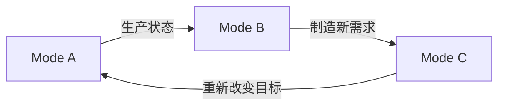
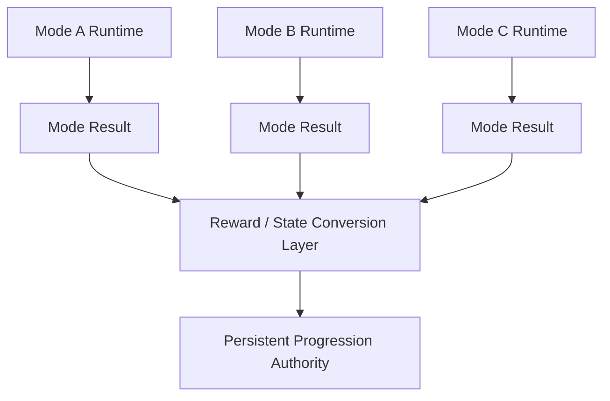

# 异质玩法嵌合：服务型游戏的动机兼容、奖励契约与系统飞轮

> 系列：游戏系统的共同语言
>
> 日期：2026-09-01
>
> 状态：草稿
>
> 核心问题：一个本身足够好玩的新玩法进入长期服务型游戏以后，怎样判断它是在强化核心产品，还是正在变成模式孤岛、强制作业或玩家契约冲突？
>
> 关键词：Live Service、Mode Integration、Reward Contract、Gameplay Flywheel、Mandatory Depth

[系列目录](../blog.html)

一个服务型游戏正在准备大型版本更新。

团队做出了一套全新的玩法。

它单独拿出来非常完整。

有自己的：

- 资源；
- Build；
- 风险；
- 成长；
- UI；
- 奖励；
- 甚至独立的长期进度。

内部测试也证明：

> 这套玩法本身确实很好玩。

于是一个看起来很自然的决定出现了：

```text
既然它很好玩
→
把它接进长期养成

让它产出核心资源
→
玩家自然会长期参与。
```

上线以后，系统数据可能也确实很好看。

因为大量玩家都进入了新模式。

但进一步观察，会发现很多人不是因为真正喜欢它。

而是因为：

```text
想继续玩原本喜欢的核心模式
↓
需要保持成长效率
↓
核心成长资源被绑定到新玩法
↓
所以不得不进入新模式。
```

从参与率看：

```text
新模式成功。
```

从玩家动机看：

```text
新模式正在变成作业。
```

这就是服务型游戏非常容易遇到的一类结构性误判：

> **玩法本身好玩，不等于它适合进入另一套产品的 Core Loop。**

## 先说结论：异质玩法的价值取决于“嵌合质量”，而不只是玩法质量

**异质玩法嵌合（后文简称“不同玩法到底能不能真正长在同一个游戏里”）**：将行为语言、玩家动机、奖励性质或运行节奏明显不同的玩法接入同一个长期产品，并让这些玩法形成稳定价值关系的设计过程。

一个新玩法是否适合进入 Core Loop，可以先用一个启发式模型理解：

```text
Integration Value
≈
Mode Quality
×
Audience Compatibility
×
Motivation Compatibility
×
Reward Compatibility
×
Systemic Reusability
×
Narrative Compatibility
×
Mandatory Depth Fit
×
Operational Sustainability
```

这不是用来直接计算产品分数的数学公式。

它真正表达的是：

> 任意一项接近零，都可能让“单独非常优秀的玩法”在产品层面产生严重问题。

例如：

```text
玩法非常好
+
受众高度重合
+
世界观非常契合

但
奖励直接破坏核心竞技公平

→
仍然可能是错误嵌合。
```

因此评估一个玩法不能只问：

```text
它好不好玩？
```

还必须继续问：

```text
谁会喜欢它？
为什么玩它？
它奖励什么？
这些奖励进入哪里？
不喜欢它的人是否也必须玩？
它会不会形成长期系统复利？
三年后又要怎样维护？
```

## Core Fantasy、Core Loop 与 Reward Contract 必须拆开

这是判断异质玩法时最容易被混淆的三层。

### Core Fantasy

**核心幻想（即“玩家觉得自己正在扮演什么角色、做什么很酷的事”）**。

例如：

```text
驾驶机甲
经营工业基地
带领角色远征
探索危险世界。
```

### Core Loop

**核心循环（即“玩家实际一遍又一遍执行什么行为”）**。

例如：

```text
竞技：
Match
→
对抗
→
胜负
→
排名
→
Next Match

搜打撤：
Deploy
→
Search
→
Fight
→
Risk
→
Extract
→
Economy

工厂：
Acquire Resource
→
Produce
→
Route
→
Optimize
→
Expand

Roguelite：
Enter
→
Build
→
Risk
→
Boss / Exit
→
Restart
```

### Reward Contract

**奖励契约（即“玩家认为投入这类行为以后，系统理应回报我什么”）**。

例如：

竞技玩家更容易接受：

```text
投入时间
→
理解
→
操作
→
团队协作
→
排名与表现提高。
```

RPG 玩家更容易接受：

```text
投入时间
→
资产
→
Build
→
能力提高。
```

优化型玩家则可能更期待：

```text
投入理解
→
系统效率提高
→
规模扩大。
```

三层必须分别判断。

## 主题一致，不代表玩法契约一致

两个模式都围绕：

```text
机甲。
```

不意味着：

```text
喜欢机甲竞技
=
喜欢机甲搜打撤。
```

两个模式都围绕：

```text
二次元角色。
```

也不意味着：

```text
喜欢角色战斗
=
喜欢自动化工厂。
```

这就是：

**受众重叠（即“可能同时喜欢”）**
和
**受众同一（即“基本就是同一群人”）**

之间的差别。

前者很常见。

后者远没有想象中普遍。

所以：

```text
Core Fantasy 一致
```

最多证明：

> 新模式放进这个世界观并不奇怪。

它不能继续证明：

> 核心玩家愿意长期执行这套行为。

## 动机兼容比题材兼容更重要

假设玩家进入主产品是为了：

```text
Competitive Mastery。
```

他享受的是：

- 对局理解；
- 操作；
- 博弈；
- 团队；
- 排名。

新模式满足的却是：

```text
Acquisition
+
Risk
+
Power Progression。
```

两套玩法都可能很好玩。

问题在于：

> 它们满足的不是同一种玩家动机。

如果两者完全独立：

```text
想玩 A
→
玩 A

想玩 B
→
玩 B。
```

这只是多模式产品。

并不一定有问题。

真正危险的是：

```text
想把 A 玩好
→
必须先长期玩 B。
```

这时两个不同动机被强行绑在一起。

## Organic Progression 与 Forced Progression

**有机进度（后文简称“我喜欢玩这个，所以自然得到另一个系统需要的东西”）**：玩家主动执行某个玩法，而其结果自然进入另一个自己也愿意参与的循环。

例如：

```text
Run
→
形成 Build
→
Build 进入高难挑战
→
高难挑战暴露新的 Build 需求
→
再次进入 Run。
```

这里 A 和 B 使用相近的战斗语言与构筑逻辑。

跨模式状态拥有清楚意义。

另一种结构则是：

**强制进度（后文简称“我想玩 B，但系统规定必须先去做 A”）**。

例如：

```text
核心玩家喜欢 B
↓
B 的竞争力依赖 A 的资产
↓
玩家必须反复执行 A
↓
即使完全不喜欢 A。
```

这里最关键的问题不是：

```text
A 好不好玩。
```

而是：

> A 和 B 的玩家动机是否足够一致，能够让这段连接看起来像进度，而不是劳动。

## 跨模式连接越强，并不自动越好

服务型游戏经常把：

```text
系统之间互相连接
```

本身视作架构成熟度。

但连接强度和连接质量不是一回事。

一个非常强的连接可以是：

```text
不玩家园
→
战斗伤害 -40%。
```

从系统图看：

```text
家园
和
战斗
连接得非常深。
```

从玩家体验看：

> 不喜欢家园的战斗玩家被强行征税。

因此真正目标不是：

```text
让所有模式互相有奖励。
```

而是：

> 让模式之间交换符合双方契约的状态。

## Reward Compatibility 决定跨模式资产能不能安全流动

**奖励兼容性（即“这个奖励进入另一个模式以后，会不会破坏那个模式原本承诺的体验”）**是跨模式设计最重要的检查之一。

例如：

```text
伤害 +20%。
```

在 PvE 中可能表示：

```text
长期成长。
```

在强调公平竞技的 PvP 中却可能表示：

```text
场外数值优势。
```

同一个奖励没有改变。

心理性质完全改变。

所以设计跨模式 Reward Bridge 时，不应该先问：

```text
怎样让 A 的奖励在 B 里更值钱？
```

应该先问：

```text
B 到底允许什么类型的价值进入？
```

例如 B 可能接受：

- 外观；
- 表达；
- 横向选择；
- 新操作方式；
- 不破坏竞技基线的身份资产。

却不接受：

- 基础攻击倍率；
- 无法追赶的长期属性；
- 直接改变胜率的场外数值。

奖励首先服从目标模式契约。

## 奖励桥最好拥有显式类型

从工程角度看，跨模式奖励也不适合简单写成：

```text
ModeAReward
→
PlayerPower += X。
```

更合理的是存在明确的：

```text
Reward Contract
```

例如：

```text
RewardType:
    Cosmetic
    Expression
    HorizontalUnlock
    EconomicResource
    BuildAsset
    CompetitivePower
    SocialStatus
```

然后每个目标模式明确：

```text
哪些 RewardType
可以进入自身权威状态。
```

这样跨模式价值不再是任意系统互相写数据。

而是经过一个可审计的转换层。

## Gameplay Hub 与 Gameplay Flywheel 是两种不同产品结构

异质玩法可以只是并列存在。

**Gameplay Hub（即“玩家站在大厅里自己选择今天玩哪一种游戏”）**：

```text
         Mode A
           ↑
Mode B ← Player → Mode C
           ↓
         Mode D
```

它并不是坏结构。

但它通常意味着：

- 每个模式独立获得内容；
- 每个模式独立平衡；
- 每个模式独立维护；
- 各模式不会自动增加其他模式的价值。

新增一个 Mode：

```text
内容量增加。
```

但并不天然：

```text
系统价值复利。
```

另一种结构是：

**Gameplay Flywheel（即“一个玩法的结果自然成为另一个玩法的新问题”）**：



例如：

```text
探索
→
发现资源与空间问题

生产
→
建立解决这些问题的基础设施

基础设施
→
打开新的探索范围

新的区域
→
产生新的生产需求。
```

这里新增一个系统不只是增加一条菜单入口。

它改变了其他已有系统的价值。

## Flywheel 的关键不是“互相给奖励”

下面这种结构：

```text
Mode A
完成一次
→
Mode B 货币 +10

Mode B
完成一次
→
Mode A 货币 +10
```

表面上已经：

```text
双向连接。
```

但两个玩法仍然可能完全独立。

真正的系统飞轮更接近：

```text
A 产生的状态
改变 B 中真正需要解决的问题。

B 产生的结果
又改变 A 中下一次决策。
```

交换的是：

```text
Meaningful State。
```

而不只是货币。

## Systemic Reusability 决定新内容有没有复利

**系统复用度（即“新增内容能不能重新激活旧系统，而不是只增加自己的专属内容”）**是长期服务设计非常值得单独评估的维度。

一个新模式如果需要：

- 独立敌人；
- 独立经济；
- 独立装备；
- 独立地图；
- 独立平衡；
- 独立运营；

却几乎不能重新使用已有系统，

它实际上接近：

> 在同一个客户端里再开发一款游戏。

反过来，如果新系统可以重新解释：

- 旧角色；
- 旧状态；
- 旧地图；
- 旧资源；
- 旧能力；

新增内容的边际价值就更高。

理想情况下：

```text
新系统
×
旧内容库
```

可以产生新的组合空间。

## Mandatory Depth 和 System Depth 必须分开

一个系统很深，

并不意味着正常玩家必须理解得同样深。

**系统深度（即“真正愿意研究的人能挖多深”）**

和：

**强制深度（即“一个普通玩家为了正常推进必须学多深”）**

是两个不同变量。

一个 Factory 系统可以拥有：

```text
非常高的 System Depth。
```

同时只要求普通玩家理解：

```text
机器
输入
输出
供电
简单连接。
```

更复杂的：

- 吞吐优化；
- 多区域物流；
- 模块化蓝图；
- 空间压缩；
- 极限产能；

可以留给愿意研究的玩家。

这就是：

**Mandatory Floor / Optional Ceiling（后文简称“低强制下限、高自愿上限”）**。

```text
                 Optional Ceiling
                        ↑
                极限优化与深挖
                        ↑
──────────────────────────────────
                 Mandatory Floor
                        ↓
              正常推进需要理解的程度
```

## 降低强制下限，不等于把系统做浅

这是非常重要的一点。

复杂系统面向大受众时，常见处理是：

```text
玩家抱怨复杂
→
删除复杂度。
```

结果：

```text
深度玩家也没有东西可研究。
```

另一种方式是保留深度，同时提供：

- Preset；
- Blueprint；
- Recommendation；
- Auto；
- Template；
- Beginner Route。

这些能力不是简单 QoL。

它们更像：

**复杂度逃生通道（即“不愿深入的人可以低成本使用，愿意深入的人仍然拥有完整上限”）**。

系统因此不必在：

```text
所有人都被迫精通
```

和：

```text
所有人都只能玩浅层版本
```

之间二选一。

## Meaningful but Non-Mandatory Optimization

长期系统最健康的状态之一，可以概括为：

> **值得优化，但不要求完美。**

例如：

```text
基础理解
→
可以获得约 80% 正常价值

进一步学习
→
提升到更高效率

极限优化
→
成为自愿目标
而不是主线资格。
```

这里的百分比只是说明结构，不是固定平衡公式。

真正原则是：

```text
深度投入应该奖励玩家
而不是
不投入就惩罚玩家。
```

这对：

- Factory；
- 装备 Build；
- 家园；
- 高级经济；
- 交易；
- 战术编成；

都适用。

## Identity Core 是一种合法的高风险设计

不是所有受众较窄的玩法都应该弱化。

有些玩法承担的是：

**产品身份（即“拿掉它以后，这款游戏就迅速变得和大量竞品相似”）**。

这种模式可以成为：

**Identity Core（即“不是所有人最喜欢，但它决定产品究竟是谁”）**。

这是一种高风险命题。

因为它天然面对：

```text
做得太浅
→
失去差异化

做得太深且强制
→
排斥不喜欢它的人。
```

因此 Identity Core 尤其适合：

```text
Low Mandatory Floor
+
High Optional Ceiling。
```

这并不能保证市场成功。

但至少让产品身份和受众兼容问题被显式设计，而不是上线以后才发现。

## Optional Island 也完全可以是正确设计

服务型游戏并不要求每个系统都必须形成 Flywheel。

**Optional Island（即“它基本独立，但喜欢它的人可以长期玩”）**可以是非常健康的结构。

例如某些：

- 休闲玩法；
- 摄影；
- 装饰；
- 社交；
- 家园；

完全可以不影响核心战斗。

问题只会出现在：

```text
产品宣称它是可选内容
```

但实际上：

```text
核心进度长期依赖它。
```

Optional Island 最重要的合同就是：

> 真的允许玩家不参与。

## Forced Bridge 是最危险的嵌合类型

**Forced Bridge（即“两个动机不同的玩法被强奖励硬绑在一起”）**通常拥有以下结构：

```text
玩家喜欢 B
↓
B 的正常竞争力 / 成长效率
依赖 A
↓
玩家不得不重复 A
↓
A 与 B 的动机却明显不同。
```

这里参与率可能很高。

甚至 DAU 也可能提升。

但这些指标不能单独证明：

```text
A 很受欢迎。
```

因为系统自己制造了参与义务。

因此对 Forced Bridge 必须观察：

```text
Voluntary Participation
```

而不是只有：

```text
Participation。
```

## 评估新模式时应该主动去掉奖励测试一次

一个非常有价值的问题是：

> 如果今天把跨模式奖励暂时拿掉，玩家还会不会主动进入这个玩法？

它不能直接决定模式去留。

但可以帮助判断：

```text
玩家在消费 Gameplay
```

还是：

```text
玩家在购买 Reward。
```

如果：

```text
Reward Removed
→
参与几乎归零，
```

至少说明这个模式当前很大一部分价值来自外部奖励，而不是玩法自身动机。

这时再增加更强奖励，

可能只会进一步加深 Forced Progression。

## 运营指标必须区分“喜欢玩”和“必须玩”

对于异质玩法，建议至少观察：

```text
Voluntary Entry Rate
Reward-Driven Entry Rate
Repeat Rate After Reward Cap
Average Session Length
Completion Without Core Reward
Mode Abandonment
Core Player Cross-Mode Conversion。
```

如果奖励已经拿满以后：

```text
玩家立即停止进入，
```

模式很可能主要承担劳动职责。

如果玩家在没有额外效率奖励以后仍持续参与，

则更接近真实动机。

## PvP 还必须计算 Queue Population Cost

PvE 内容可以被大量分叉。

竞技 PvP 的每一个 Queue 都需要：

```text
同时在线人口。
```

增加：

```text
地区
×
MMR
×
队伍规模
×
休闲 / 排位
×
玩法模式
```

以后，

有效匹配池会不断被切碎。

因此 PvP 产品评估新玩法时，还需要计算：

**Queue Population Cost（即“增加一个模式以后，它会从哪些现有匹配池抽走人”）**。

新增玩法的成本不是只有：

```text
开发成本。
```

还有：

```text
匹配生态成本。
```

一个模式完全可能：

```text
自己很好玩，
```

但把已有两个稳定 Queue 都切成：

```text
等待时间过长
MMR 范围过宽
机器人填充增加。
```

产品总体仍然变差。

## Narrative Compatibility 也有两个层级

一个系统可以在世界观上非常合理。

却在具体叙事节奏里非常突兀。

因此：

**宏观叙事兼容（即“这套玩法是否符合世界和角色身份”）**

和：

**微观节奏兼容（即“此刻剧情真的适合让玩家停下来做这件事吗”）**

应该分别评估。

例如：

```text
工业建设
```

可以完美符合：

```text
开拓未知地区。
```

但在剧情高潮里要求玩家先完成一段长时间物流教程，

仍然可能破坏节奏。

更健康的关系是：

```text
Narrative
定义问题

System
提供解法空间。
```

而不是：

```text
Narrative
强行把玩家拉进一套 tutorial checklist。
```

## Gameplay-as-Crafting 可以让跨模式资产拥有经历

很多长期资产来自：

```text
刷材料
→
离开 Gameplay
→
菜单强化
→
得到资产。
```

另一种结构是：

**Gameplay-as-Crafting（即“玩法过程本身就是长期资产的制造过程”）**。

例如：

```text
一次 Roguelite Run
→
形成一个 Build

一套 Factory
→
形成一张生产网络

一次远征
→
形成一支长期队伍状态。
```

这样资产获得：

**Provenance（即“它来自一段玩家真正经历过的过程”）**。

这往往比：

```text
点击合成按钮
```

拥有更强心理价值。

但它也带来一个新的长期问题。

## Persistence Debt：长期资产一定会向未来收费

**Persistence Debt（后文简称“玩家越认真投入，开发者未来越难随便改”）**：一个高投入、长期保留资产对未来平衡、版本迁移和系统重构产生的兼容成本。

可以用一个简单启发式理解：

```text
Persistence Debt
≈
Player Investment
×
Asset Permanence
×
Balance Volatility。
```

例如：

- 长期装备；
- Build Snapshot；
- 抽取角色；
- 高投入基地；
- 玩家经济资产。

如果玩家在一个系统里投入几十小时，

团队不能只设计：

```text
今天怎样让玩家获得它。
```

还必须设计：

```text
两年以后系统规则大改
这份旧资产怎样继续成立？
```

玩法嵌合一旦生产长期资产，

就同时接管了未来版本迁移责任。

## 一个模式进入 Core Loop 前，应该明确自己的状态所有权

从运行时架构看，异质玩法最危险的实现是：

```text
Mode A
可以直接写 Core Progression

Mode B
也可以直接写 Core Progression

Mode C
继续直接写。
```

长期以后，没有系统能够回答：

```text
这个长期状态究竟由谁拥有？
```

更稳健的结构可以是：



每个 Mode 只拥有：

```text
自己的 Runtime Truth。
```

跨模式长期价值则通过明确转换协议进入持久状态。

这样 Reward Compatibility 才不仅存在于策划文档。

它还能进入运行时边界。

## Mode Result 和 Persistent Reward 不应该是一个对象

例如一个 Extraction 模式产生：

```text
本局成功撤离
获得临时 Loot
风险等级
表现结果。
```

这些首先属于：

```text
Mode Result。
```

真正写入长期账户的：

```text
Currency
Cosmetic Unlock
Build Asset
Rating
```

属于：

```text
Persistent Reward。
```

中间应该存在：

```text
Conversion / Commit。
```

这样未来调整跨模式奖励时，

不需要改写模式内部所有运行逻辑。

## 不要让副玩法拥有核心模式内部私有状态

如果 Mode A 为了给 Mode B 奖励，

直接写入：

```text
ModeB.InternalPowerMultiplier，
```

两个系统已经形成隐藏耦合。

更适合：

```text
Mode A
产生公开 Reward / Capability

Mode B
根据自身合同解释它。
```

例如：

```text
Shared Horizontal Unlock
```

可以进入多个系统。

但每个模式仍然拥有自己的：

```text
Combat Rule
Matchmaking Rule
Difficulty Rule。
```

跨模式连接应该通过公开合同。

而不是共享内部变量。

## 失效隔离必须纳入长线设计

服务型游戏最终一定会遇到：

- 某模式临时下线；
- 某玩法维护；
- 某经济系统重做；
- 某赛季机制废弃；
- 某资产停止产出。

因此新模式进入 Core Loop 以前还需要回答：

> 如果这个模式明天关闭一个月，核心游戏还能不能正常运行？

如果答案是：

```text
不能，
```

这说明模式已经成为单点依赖。

这不一定绝对错误。

但必须被当成：

```text
Core Infrastructure。
```

获得相应：

- SLA；
- Migration；
- Fallback；
- Recovery；
- Test Coverage。

不能同时把它描述为：

```text
只是一个副玩法。
```

## 服务型游戏的系统图最好区分四类连接

可以把跨玩法连接粗略分成：

| 连接 | 含义 |
|---|---|
| Optional | 不参加不会影响核心资格 |
| Convenience | 提升效率，但不是正常进度门槛 |
| Structural | 一个系统真实改变另一个系统的问题空间 |
| Mandatory | 不完成就无法正常进入核心进度 |

问题不在于：

```text
Mandatory 永远不能存在。
```

而在于：

> 设计者是否清楚知道自己建立的是哪一种连接。

很多玩家冲突都来自：

```text
设计层认为这是 Convenience
玩家实际体验却是 Mandatory。
```

## 一个模式可以用七维模型做评审，但不能机械算总分

在正式立项评审时，可以使用下面的七个维度。

| 维度 | 主要问题 |
|---|---|
| Audience Compatibility | 核心受众是否自然可能喜欢它 |
| Motivation Compatibility | 两套玩法满足的是否是相近动机 |
| Reward Compatibility | 奖励进入目标模式后是否破坏其契约 |
| Systemic Reusability | 是否重新激活已有内容 |
| Narrative Compatibility | 世界观与局部叙事节奏是否匹配 |
| Mandatory Depth | 普通玩家必须掌握多深 |
| Operational Cost | 是否产生独立内容、平衡、经济和运营负担 |

PvP 再额外加入：

```text
Queue Population Cost。
```

可以使用 1～5 分进行内部讨论。

但总分不应该自动决定：

```text
做
/
不做。
```

真正更有价值的是发现：

```text
某个维度已经低到构成产品风险。
```

例如：

```text
Reward Compatibility = 很低
```

通常比：

```text
整体平均分 3.7
```

更值得关注。

## 四种常见的异质玩法结构

### Systemic Amplifier

**系统放大器（即“新玩法让核心系统本身产生更多组合价值”）**。

结构：

```text
A 产生 B 所需状态
↓
B 重新制造 A 的目标。
```

这是最接近 Flywheel 的形态。

### Optional Island

**可选孤岛（即“基本独立，但不伤害核心玩法”）**。

它不产生巨大系统复利。

但只要维护成本可接受，也完全可以成立。

### Forced Bridge

**强制桥接（即“为了核心玩法，被迫长期参与不同动机玩法”）**。

这是最需要警惕的形态。

### Identity Core

**身份核心（即“受众未必最大，但承担产品差异化”）**。

它需要特别关注：

```text
Mandatory Floor
和
Optional Ceiling。
```

这四类没有绝对好坏顺序。

关键是：

> 不要把一种结构当成另一种结构进行产品承诺。

## 设计新模式前，我会先做一次“去奖励评审”

假设新玩法已经拥有完整玩法原型。

先临时忽略：

- 每日任务；
- 战力资源；
- 周常积分；
- 独占材料。

只留下玩法本身。

然后检查：

```text
核心玩家为什么主动进入？
```

如果答案非常清楚：

```text
因为它提供了新的 Mastery / Optimization / Risk / Expression。
```

说明玩法本身拥有独立动机。

如果答案主要是：

```text
因为这里产核心养成材料，
```

至少要意识到：

> 当前真正运行的是奖励系统，不一定是玩法吸引力。

## 第二步评审奖励进入哪里

再把奖励加回来。

逐项检查：

```text
这个奖励进入哪个模式？
```

然后问：

```text
它在那个模式里代表的是
成长
便利
表达
还是不公平优势？
```

任何跨模式奖励都应该以**目标模式**的心理契约为准。

不是以来源模式“希望自己更重要”为准。

## 第三步评审不喜欢这套玩法的人

这是异质系统最容易遗漏的一类玩家。

不要只问：

```text
深度玩家能玩多深？
```

还要问：

```text
完全不喜欢它的人
为了正常体验产品
最低必须做多少？
```

如果答案是：

```text
每天 30 分钟，
```

这已经不是：

```text
可选深度。
```

而是产品核心劳动。

此时团队必须明确接受：

> 这套玩法就是产品身份的一部分，而不是外围系统。

## 第四步评审三年后的维护账

最后检查：

- 是否产生永久资产；
- 是否拥有独立经济；
- 是否需要独立平衡；
- 是否切割 PvP Queue；
- 是否需要长期产新内容；
- 是否有版本迁移；
- 是否可以安全关闭；
- 是否需要补偿旧玩家。

一个模式上线的开发成本只是一小部分。

真正长期成本是：

**Operational Cost（即“以后每个版本还要持续为它付多少钱和注意力”）**。

## 我的异质玩法嵌合检查表

1. 新玩法的 Core Fantasy 是什么？
2. 新玩法的 Core Loop 是什么？
3. 新玩法的 Reward Contract 是什么？
4. 核心产品玩家进入游戏的主要动机是什么？
5. 新玩法与核心玩法的 Audience 是重叠，还是基本同一？
6. 两个玩法主要满足的 Motivation 是否一致？
7. 如果去掉外部奖励，玩家是否仍会主动参与新玩法？
8. 新玩法奖励进入目标模式后，是否改变目标模式的基本契约？
9. PvP 中是否存在 Power Progression 污染公平性？
10. 不玩新玩法，玩家是否会在核心模式里明显吃亏？
11. 当前连接属于 Organic Progression 还是 Forced Progression？
12. 模式之间是在形成 Gameplay Hub，还是 Gameplay Flywheel？
13. 新模式是否能够重新激活既有角色、地图、资源和规则？
14. 新增内容的 Systemic Reusability 是否足够高？
15. System Depth 和 Mandatory Depth 是否分别定义？
16. 是否能够做到 Low Mandatory Floor / High Optional Ceiling？
17. Preset、Blueprint、Auto 是否可以作为 Complexity Escape Hatch？
18. 极限优化是否是奖励投入，而不是正常进度资格？
19. 新玩法是否承担产品 Identity Core？
20. 如果承担 Identity Core，团队是否真的接受它带来的受众筛选？
21. Optional Island 是否真的允许玩家长期不参加？
22. 是否存在“名义可选、实际上强制”的隐藏 Bridge？
23. 新玩法产生的 Mode Result 与 Persistent Reward 是否分离？
24. 跨模式 Reward 是否经过明确 Conversion Layer？
25. Mode 是否不会直接修改其他模式的内部私有状态？
26. 长期 Persistent Asset 是否有版本迁移策略？
27. 是否评估 Persistence Debt？
28. Narrative Macro Compatibility 是否成立？
29. 当前剧情节奏是否适合要求玩家进入这套玩法？
30. 新模式是否需要独立经济？
31. 是否需要独立内容生产线？
32. 是否需要独立平衡团队？
33. PvP 是否计算了 Queue Population Cost？
34. 模式关闭或维护时，核心游戏是否仍能运行？
35. 如果不能，它是否已经被按 Core Infrastructure 治理？
36. 是否有 Fallback、Migration 和 Recovery？
37. Analytics 是否区分 Voluntary Participation 与 Reward-Driven Participation？
38. 奖励拿满以后，玩家是否仍然继续主动参与？
39. 当前高参与率究竟来自玩法动机，还是来自奖励义务？
40. 三年以后，如果必须重构这套系统，已有玩家资产怎样处理？
41. 新玩法是在增加一个新的菜单入口，还是让已有系统形成新的状态循环？
42. 玩家最终感受到的是“我一直在玩同一个游戏”，还是“我每天轮流完成几个不同游戏的作业”？

服务型游戏最容易追求的是：

```text
更多玩法
更多系统
更多长期目标。
```

这些东西当然都可以增加产品内容量。

但内容量并不自动产生系统深度。

真正长期有价值的结构，更接近：

```text
一个系统产生状态
↓
另一个系统真正使用这些状态
↓
新的状态重新制造前一个系统的目标
↓
旧内容因此获得新的解释。
```

这样，新玩法不是长在产品旁边。

它长进了原本的游戏。

反过来，如果新玩法只依靠：

```text
核心资源
周常积分
独占强化
```

迫使玩家参与，

系统之间虽然连接得很紧，

玩家却未必觉得它们属于同一个体验。

异质玩法真正需要追求的，从来不是：

> **“怎样让所有玩家都去玩这个模式。”**

而是：

> **“怎样让真正喜欢它的人拥有足够深度，让不喜欢它的人不会被惩罚，同时让它产生的状态能够以不破坏原有玩家契约的方式重新进入整个产品。”**

这才是服务型游戏从“玩法集合”走向“系统飞轮”的关键。

## 术语对照

| 正式术语 | 文中通俗称呼 |
|---|---|
| 异质玩法嵌合 | 不同玩法到底能不能真正长在同一个游戏里 |
| 核心幻想 | 玩家觉得自己正在扮演什么角色、做什么很酷的事 |
| 核心循环 | 玩家实际一遍又一遍执行什么行为 |
| 奖励契约 | 玩家认为投入这类行为以后，系统理应回报我什么 |
| 有机进度 | 我喜欢玩这个，所以自然得到另一个系统需要的东西 |
| 强制进度 | 我想玩 B，但系统规定必须先去做 A |
| 奖励兼容性 | 这个奖励进入另一个模式以后，会不会破坏那个模式原本承诺的体验 |
| Gameplay Hub | 玩家站在大厅里自己选择今天玩哪一种游戏 |
| Gameplay Flywheel | 一个玩法的结果自然成为另一个玩法的新问题 |
| 系统复用度 | 新增内容能不能重新激活旧系统 |
| 强制深度 | 一个普通玩家为了正常推进必须学多深 |
| Mandatory Floor / Optional Ceiling | 低强制下限、高自愿上限 |
| 复杂度逃生通道 | 不愿深入的人可以低成本使用，愿意深入的人仍然拥有完整上限 |
| Identity Core | 不是所有人最喜欢，但它决定产品究竟是谁 |
| Optional Island | 基本独立，但不伤害核心玩法 |
| Forced Bridge | 两个动机不同的玩法被强奖励硬绑在一起 |
| Queue Population Cost | 增加一个模式以后，它会从哪些现有匹配池抽走人 |
| Gameplay-as-Crafting | 玩法过程本身就是长期资产的制造过程 |
| Persistence Debt | 玩家越认真投入，开发者未来越难随便改 |
| Systemic Amplifier | 新玩法让核心系统本身产生更多组合价值 |

---

## 内部资料依据

本文主要基于以下材料整理：

- `notes/多玩法系统游戏逆向拆解/01_卡厄斯梦境_Extraction-Based_Build_Factory.md`
- `notes/多玩法系统游戏逆向拆解/02_解限机_竞技PVP与搜打撤模式契约冲突.md`
- `notes/多玩法系统游戏逆向拆解/03_明日方舟终末地_基建作为高风险核心玩法.md`
- `notes/多玩法系统游戏逆向拆解/04_综合_服务型游戏异质玩法嵌合理论.md`
- `notes/角色经济型游戏逆向拆解/README.md`
- `blogs/README.md`
- `blogs/publication.v1.json`

本文是基于多个服务型游戏系统研究形成的通用设计方法论。

文中使用的 Systemic Amplifier、Optional Island、Forced Bridge、Identity Core、Mandatory Floor / Optional Ceiling、Persistence Debt、Gameplay Flywheel 等概念属于分析与设计工具，并不表示所有服务型游戏都必须采用相同的模式关系、奖励类型或运营结构。

尤其需要注意：

- “玩法本身好玩不代表适合进入 Core Loop”不意味着产品不应该增加异质玩法；
- “Forced Bridge 风险高”不意味着所有跨模式强关联都错误，动机高度兼容时强连接完全可能成立；
- “低强制下限、高自愿上限”是一项适用于复杂系统的常用目标，不表示所有核心玩法都应该允许玩家绕过；
- “去奖励评审”只是用于分析真实参与动机的思考工具，不代表正式产品应该真的移除奖励进行线上实验；
- “Gameplay Flywheel”强调不同玩法交换具有真实系统意义的状态，并不要求所有玩法必须形成闭环；
- “Persistence Debt”用于提醒长期资产会产生未来兼容成本，不意味着应避免长期资产本身；
- 文中的产品案例来自内部逆向研究与设计思辨，不等同于相关产品的官方设计说明，也不将产品表现简单归因于单一系统。
