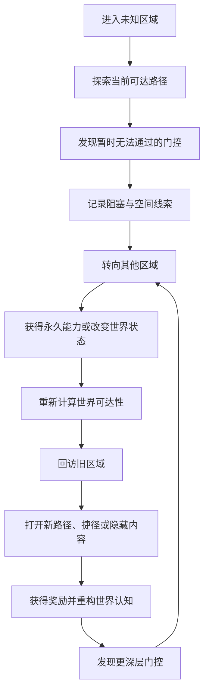

# 世界拓扑与能力门控：银河城地图中的权限、可达性与区域重访

> 系列：游戏系统的共同语言
>
> 日期：2026-07-30
>
> 状态：可发布候选
>
> 核心问题：为什么玩家获得二段跳、冲刺或感知能力后，改变的不只是角色动作，还包括整个世界的可达范围？

[系列目录](../blog.html) · [上一篇](./authoritative-time-source.html)

玩家第一次进入一个陌生区域时，可能会看到：

- 明显高于当前跳跃极限的平台；

- 带有特殊裂纹的墙体；

- 无法抵抗的高温通道；

- 只能从另一侧打开的门；

- 隐约可见却无法触及的隐藏房间；

- 地图上通向未知区域、却暂时无法通过的出口。

这些东西不会立刻给予奖励，甚至会让玩家暂时受挫。

但在银河城游戏中，这种受阻不是普通的失败提示。它更像是世界提前提出的问题：

> 你现在还没有答案，但以后可以回来。

因此，银河城地图不能只被理解为一组房间的平面布局。它还记录了玩家当前拥有哪些能力、哪些连接已经开放、哪些区域仍被条件阻塞，以及世界变化之后哪些旧路径需要重新解释。

我更愿意把它理解为一张会随着玩家成长而变化的权限图。

## 先说结论：银河城的地图同时包含空间、权限与记忆

**能力门控拓扑（即“权限地图”）**：由区域、房间和连接构成，并根据玩家能力、世界状态、任务和Boss进度决定哪些连接当前可以通过的世界结构。

普通地图主要回答：

> 我在哪里？

权限地图还要回答：

> 我现在能去哪里？

> 为什么这里暂时不能去？

> 获得新能力之后，哪些旧地点会重新产生价值？

一张银河城地图至少同时包含三层信息。

|层次|记录内容|玩家感受到的东西|
|---|---|---|
|空间层|房间、区域、距离、方向和入口|世界长什么样|
|权限层|能力门、世界条件、单向连接和捷径|当前能去哪里|
|记忆层|已观察门控、已发现路径、地图标记和旧区域线索|以后应该回到哪里|

如果只有空间层，游戏只是把许多关卡连接起来。

如果只有权限层，能力容易退化成不同颜色的钥匙。

只有三层共同工作，玩家才会经历完整的：

> 探索 → 受阻 → 成长 → 回访 → 重新理解世界

## 世界不是场景列表，而是一张带条件的图

**世界拓扑（即“连接骨架”）**：独立于具体场景表现，用节点和连接描述区域、房间、入口、单向路径、捷径及传送关系的逻辑结构。

在连接骨架中：

- 区域和房间是节点；

- 门、出口、电梯和通道是边；

- 二段跳、冲刺、钥匙和世界阶段是通行条件；

- 捷径是永久改变图结构的连接；

- 传送点是满足额外规则的远距离连接；

- 场景资源只是这些节点和连接的视觉及交互载体。

例如，一条连接可以被表达为：

|字段|示例|
|---|---|
|起点|高塔下层|
|终点|高塔上层|
|通行方式|空中跨越|
|必需能力|二段跳与空中冲刺|
|初始状态|已发现但不可通过|
|通过后效果|开放新区域|
|后续变化|可从另一侧打开永久捷径|

这种逻辑结构不应该依赖目标房间已经加载。

即使玩家当前在地图另一端，系统仍应能够判断：

- 某个房间理论上是否可达；

- 某个能力可以打开哪些连接；

- 主线目标是否仍然存在合法路径；

- 世界阶段变化是否关闭了唯一出口；

- 玩家是否可能进入无法返回的区域。

场景负责表现世界，连接骨架负责解释世界。

## 银河城循环实际在更新什么

权限地图的核心运行循环可以压缩为：

玩家看到的是角色获得了一个新动作。

系统实际发生的事情更多：

1. 玩家能力集合发生变化。

2. 与该能力相关的门控条件重新求值。

3. 部分连接从不可通过变为可通过。

4. 新房间进入理论可达集合。

5. 地图上的旧门控可能更新提示。

6. 路径规划和快速旅行候选发生变化。

7. 任务、NPC和世界事件可能获得新的触发条件。

8. 自动验证需要确认新的能力顺序没有制造死锁。

所以获得能力不是单纯的角色属性变化。

它是一次世界权限更新。

## 能力应该是动作，也是空间权限

**空间权限（即“新通行证”）**：某项能力对世界连接、环境交互和区域可达范围产生的长期影响。

银河城中的优秀能力通常同时服务多个系统。

|能力|操作变化|空间权限|战斗或环境用途|
|---|---|---|---|
|二段跳|增加一次空中行动|到达更高平台|调整空中攻击位置|
|空中冲刺|快速水平位移|越过宽阔缺口和高速门|躲避、追击和取消后摇|
|钩索|拉向锚点|穿越断层和垂直区域|拉取敌人、物体或机关|
|重击|改变攻击节奏|打破重型墙体和地面|破甲、击飞和范围伤害|
|感知能力|显示特殊信息|发现假墙和隐藏平台|识别弱点、陷阱或生命|
|热抗性|抵抗环境伤害|进入高温区域|应对火焰敌人和机关|

低质量能力只回答：

> 哪一扇门可以用它打开？

高质量能力还会回答：

> 玩家以后如何移动？

> 战斗节奏发生了什么变化？

> 哪些旧场景会得到新的解释？

> 玩家是否可以把它和已有能力组合起来？

当能力只负责打开对应颜色的门时，它仍然是传统钥匙，只是换了一层动画。

真正有价值的能力会改变玩家使用角色和观察空间的方式。

## 阻塞不是拒绝，而是一份未来承诺

玩家第一次接近门控时，系统需要帮助他形成四个判断：

1. 这里确实存在内容。

2. 当前暂时无法通过。

3. 未来可能获得解决方式。

4. 这个位置值得记住或标记。

这要求不同门控拥有一致的视觉和交互语言。

例如：

- 特定裂纹始终对应重型破坏能力；

- 相似风流始终暗示高速空中移动；

- 高温扭曲始终对应环境抗性；

- 特定符号始终对应感知或文字能力；

- 单侧机关始终表示需要从另一边打开。

**门控视觉语言（即“世界提示语”）**：使用稳定的材质、形状、动画、声音和反馈，让玩家能够识别阻塞类别并形成长期记忆的表达规则。

世界提示语不一定直接公布答案。

游戏可以选择不同的信息透明度：

|透明度|地图与反馈|
|---|---|
|高|直接显示缺少空中冲刺、热抗性等能力|
|中|显示移动门、环境门或感知门等类别|
|低|只记录存在异常或允许玩家手动标记|

低透明度并不等于没有规则。

即使不显示能力名称，同类门控也必须保持足够一致，让玩家能够通过观察学习世界的语法。

否则探索会退化为：

- 攻击所有墙体；

- 反复扫描整张地图；

- 获得能力后不知道应该去哪里；

- 依赖攻略而不是自己的空间记忆。

## 地图需要记住玩家曾经为什么失败

门控状态不应该只有“开”和“关”。

更合理的状态包括：

- 尚未发现；

- 已观察但不可通过；

- 当前可以通过；

- 已永久解锁；

- 暂时失效；

- 已破坏；

- 被剧情封锁；

- 已从另一侧打开。

其中最容易被忽略的是“已观察但不可通过”。

这个状态说明玩家已经发现了问题，只是还没有解决问题。

当玩家获得新能力后，系统可以根据游戏的信息透明度：

- 更新地图标记；

- 高亮可能重新访问的区域；

- 在区域完成率中显示未解决门控；

- 通过NPC、环境或任务给予回访线索；

- 允许玩家自行筛选过去记录的阻塞。

地图的职责不是替玩家完成推理，而是保存玩家已经获得的信息。

好的地图帮助记忆。

坏的地图要么什么都不记，迫使玩家重复劳动；要么把全部答案直接标出，使探索变成清单导航。

## 新能力获得后，世界需要“重新亮路”

**可达性重算（即“重新亮路”）**：在能力、捷径、Boss、任务或世界阶段发生变化后，重新判断当前状态下哪些连接和目标可以到达。

重新亮路不需要每帧扫描整张世界图。

它通常由少数关键事件触发：

- 获得永久能力；

- 打开捷径；

- 获得钥匙物品；

- 击败Boss；

- 激活传送点；

- 完成任务；

- 改变世界阶段。

系统输入可以包括：

- 玩家当前启用的能力标签；

- 已完成的Boss和任务；

- 世界标志；

- 当前世界阶段；

- 临时区域规则；

- 起始房间。

输出则可以包括：

- 当前可达房间；

- 当前可通过连接；

- 仍被阻塞的门；

- 新增可达区域；

- 已失去连接的区域；

- 无法到达的必要目标；

- 可能出现的无返回风险。

这里还要区分两种可达性。

**理论可达**表示规则上存在合法路径。

**玩家实际可达**还会受到地图发现、当前资源、操作难度、环境风险和单向落差影响。

自动内容验证应该使用理论可达。

玩家地图则应该尊重实际发现状态。

系统知道一条隐藏路线存在，不代表地图必须提前告诉玩家。

## 技巧性越级也应该有明确身份

部分银河城允许玩家通过高难操作提前越过能力门。

例如：

- 利用敌人反弹获得额外高度；

- 通过连续攻击延长滞空；

- 使用爆炸冲击穿过缺口；

- 通过精确冲刺提前到达后期区域。

这种路线可能带来速通、高手表达和非线性探索。

但系统必须区分：

- 正式支持的技巧路线；

- 被容忍但不保证的边缘路线；

- 会破坏状态的物理漏洞。

正式支持的技巧路线应该进入权限地图和验证模型。

系统至少需要确认：

- 提前进入后剧情仍然成立；

- 玩家拥有合法返回路径；

- Boss和NPC状态不会错乱；

- 存档不会记录无法恢复的组合；

- 后续能力仍然可以正常取得。

“玩家能跳过去”不能自动等同于“游戏流程支持他跳过去”。

## 回访有价值，是因为旧区域变成了新问题

银河城不可避免地要求玩家返回旧区域。

但回访和走回头路不是同一件事。

低质量回访是：

- 沿完全相同的长路线返回；

- 房间、敌人和信息没有变化；

- 只打开一扇颜色匹配的门；

- 奖励不足以补偿通勤成本；

- 玩家没有清晰的回访目标。

高质量回访至少改变一种东西：

- 新能力创造新的移动路线；

- 旧房间出现新的垂直层；

- 世界阶段改变环境或敌人；

- NPC和任务状态发生变化；

- 新感知能力揭示过去看不见的信息；

- 旧Boss区域变成交通枢纽；

- 玩家可以利用新能力绕过过去的危险；

- 捷径显著压缩重复路线。

回访的价值不只是奖励。

它还向玩家证明：

> 我已经不再是第一次进入这里的那个人。

## 捷径是对已掌握路线的压缩

**路线压缩（即“少走熟路”）**：玩家已经证明自己理解和通过某段路线后，系统永久降低未来重复经过该路线的成本。

捷径可以表现为：

- 从另一侧打开的门；

- 放下梯子；

- 启动电梯；

- 修复轨道；

- 打破墙体；

- 改变水位；

- 激活空中通道；

- 建立永久传送连接。

捷径不是普通奖励。

它改变的是世界连接结构。

一次完整的捷径解锁通常需要：

1. 验证玩家位于合法一侧。

2. 验证当前解锁条件。

3. 更新捷径的持久状态。

4. 修改世界连接图。

5. 更新地图。

6. 保存状态。

7. 发布捷径解锁事件。

这些步骤必须保持一致。

不能出现：

- 门的动画已经打开，但连接图仍认为不可通行；

- 地图显示捷径存在，但重新加载后门又关闭；

- 存档保留了门状态，却没有保留对应世界连接；

- 玩家从错误的一侧触发捷径。

从工程角度看，捷径是一笔会同时修改场景、拓扑、地图和存档的事务。

## 快速旅行不能过早取代世界

捷径和快速旅行都能减少移动成本，但职责不同。

|机制|主要作用|
|---|---|
|新移动能力|改变玩家经过空间的方式|
|捷径|压缩已经掌握的局部路线|
|快速旅行|连接中后期已经建立认知的远距离区域|

快速旅行开放过早，会削弱：

- 世界连续感；

- 区域关系记忆；

- 捷径的价值；

- 玩家对路线的掌握。

开放过晚，则会让：

- 支线回访；

- NPC任务；

- 收集清理；

- Boss重试；

- 补给和商店访问

逐渐变成通勤负担。

合理的顺序通常是：

> 先让玩家理解世界，再让他压缩世界。

## 世界状态会改变权限地图

银河城世界并不一定保持静止。

Boss死亡、设施启动或剧情推进可能导致：

- 水位升高或下降；

- 城堡进入封锁状态；

- 地下区域恢复供电；

- 腐化扩散；

- 新桥梁出现；

- 旧道路坍塌；

- NPC迁移；

- 房间敌人和环境发生变化。

世界阶段变化不只是替换背景。

它可能增加、移除或改变世界连接。

因此，每次阶段切换后都必须重新验证：

- 主线目标是否仍可达；

- 检查点是否仍然有效；

- 快速旅行终点是否存在；

- NPC和任务目标是否进入非法位置；

- 收集品是否被永久封闭；

- 玩家当前房间是否仍具有出口；

- 存档能否恢复到一致状态。

如果世界阶段只更新了一部分房间，就可能出现分裂世界：

- 场景表现已经变化；

- 地图仍使用旧连接；

- 存档写入新阶段；

- 玩家却被困在旧房间变体中。

世界阶段切换应被当作一次需要完整提交或完整回滚的拓扑事务。

## 世界记忆必须进入存档

银河城存档不能只保存玩家坐标和角色数值。

它至少需要保留：

- 永久能力；

- 当前房间和检查点；

- 已观察及已通过的能力门；

- 已解锁捷径；

- 地图发现状态；

- 已取得收集品；

- Boss状态；

- 机关状态；

- NPC和任务状态；

- 传送点；

- 当前世界阶段；

- 内容版本。

当前可达房间、路径缓存和地图完成率等内容，可以在加载后重新计算。

这形成了一个重要原则：

> 保存事实，重建推论。

“玩家已经获得空中冲刺”是事实。

“高塔上层现在可以到达”是由能力、连接和世界状态共同推导出的结果。

把所有推导结果都写入存档，不仅增加兼容负担，也可能在版本更新后产生互相矛盾的数据。

## 为什么逻辑拓扑必须与场景资源分离

如果世界连接关系完全隐藏在场景物体和碰撞体中，团队很难回答：

- 主线是否始终可解；

- 某个能力实际打开了多少内容；

- 世界阶段是否关闭了唯一道路；

- 某个收集品是否可以永久错过；

- 玩家为什么会被困住；

- 哪条捷径几乎没有使用价值。

当世界拓扑独立存在后，系统可以在不加载完整场景的情况下：

- 计算可达性；

- 检查循环依赖；

- 生成地图；

- 模拟能力获得顺序；

- 验证无返回点；

- 比较两个世界阶段；

- 执行自动探索；

- 迁移旧存档。

这并不意味着所有设计都要变成表格。

场景仍然负责构图、节奏、操作感和视觉叙事。

逻辑拓扑负责确保这些场景能够组成一个长期一致、可验证的世界。

## 自动验证应该检查“是否可解”，而不只是“能否加载”

银河城内容量扩大后，仅靠人工完整通关很难覆盖所有状态组合。

自动验证至少应该检查：

### 主线可达性

从初始能力和世界状态开始，模拟：

- 获得能力；

- 击败Boss；

- 打开门；

- 解锁捷径；

- 推进世界阶段。

最终目标必须存在合法路径。

### 能力依赖

检查：

- 能力前置是否构成循环；

- 能力获取地点是否需要该能力本身；

- 某项能力是否完全没有实际用途；

- 某项能力是否只打开一个低价值门；

- 提前获得能力是否破坏必要状态。

### 无返回点

重点验证：

- 单向落差；

- Boss门；

- 传送；

- 临时连接；

- 水位变化；

- 世界阶段切换。

玩家不应进入没有出口、没有检查点且无法恢复的非法区域。

### 地图与完成率

检查：

- 计入完成率的内容是否都可获取；

- 被删除内容是否仍残留在统计中；

- 隐藏房间规则是否一致；

- 完成率是否真的可以达到100%；

- 玩家能否判断缺失的是房间、收集品、Boss还是任务。

自动测试无法评价一个房间是否有趣。

但它可以提前证明某条主线根本无法走通。

## 玩家是在探索，还是只是在迷路

银河城需要让玩家感到未知，但不能让他失去全部方向。

合理探索通常表现为：

- 玩家拥有多个候选方向；

- 知道哪些区域尚未确认；

- 记得若干暂时无法通过的门；

- 新能力提供新的回访目标；

- 即使选错路线，也会获得信息、奖励或捷径。

低质量迷路则表现为：

- 不知道主线大致方向；

- 不知道哪里尚未探索；

- 不记得旧门控的位置；

- 所有房间缺乏视觉区分；

- 长距离移动没有反馈；

- 到达死路后没有任何新信息。

迷路和探索的区别，不在于是否提供箭头。

而在于玩家是否能够形成下一步假设。

好的探索会让玩家想：

> 我可以先去高塔，也可以回到地下水道试试新能力。

坏的迷路只会让玩家想：

> 我是不是漏掉了某个毫无提示的入口？

## 与相近类型的边界

|类型|世界结构|主要推进方式|旧区域价值|
|---|---|---|---|
|线性动作平台|关卡顺序|完成当前关卡|通常较低|
|开放世界|大范围地理空间|任务、等级、距离和区域风险|主要来自任务与资源刷新|
|类魂动作RPG|高风险连接网络|战斗学习、检查点和Boss|捷径及路线熟练度|
|Roguelike|随机或重组地图|单次Run和临时构筑|通常在下一局重置|
|银河城|持续且可回访的权限地图|永久能力和世界状态|会随能力成长被重新解释|

这些类型可以组合，但组合不等于核心循环相同。

类魂游戏也有捷径，但捷径通常服务于死亡重试和风险路线。

开放世界也有限制区域，但限制不一定由精密的能力依赖图控制。

线性平台游戏也有二段跳，但新能力不一定要求玩家重新理解旧关卡。

银河城的关键不是某个单独功能，而是能力、拓扑、记忆和回访之间形成了长期闭环。

## 常见失败：地图相连，不代表世界成立

### 能力只是彩色钥匙

能力没有操作、战斗和组合价值，只负责打开对应门。

### 回访路线过长

玩家反复穿过完全相同的房间，没有捷径、世界变化或新移动体验。

### 门控语言不一致

相同能力对应完全不同的视觉表现，玩家无法建立规则记忆。

### 世界实际上仍然线性

地图看似拥有大量分支，实际每个阶段始终只有一条合法路线。

### 能力顺序无法验证

玩家提前到达后期区域后，引发剧情缺失、Boss状态错误或存档死锁。

### 地图不记录旧门控

玩家获得能力后知道它很重要，却不知道应该去哪里使用。

### 快速旅行开放时机错误

过早破坏世界认知，过晚制造支线通勤。

### 世界阶段关闭唯一主线

环境变化修改了连接，却没有重新检查关键目标的可达性。

### 隐藏内容完全依赖撞墙

探索退化为对每一面墙进行重复攻击。

### 完成率不可诊断

游戏只显示99%，却不说明缺少的是房间、任务、Boss还是收集品。

## 我的设计检查表：这张地图是否真的会随成长变化

设计一款银河城时，我会至少检查以下问题：

1. 世界是否拥有独立于场景资源的逻辑连接图？

2. 房间、入口、门控、捷径和能力是否拥有稳定标识符？

3. 每项核心能力是否同时服务于操作与至少一种世界交互？

4. 玩家第一次遇到门控时，能否判断这里值得以后回来？

5. 同类门控是否使用一致且可学习的世界提示语？

6. 系统是否记录已观察但尚未解决的阻塞？

7. 获得能力后，是否会重新计算受影响的连接和目标？

8. 理论可达性是否与玩家实际发现状态分开？

9. 支持的技巧越级路线是否进入正式验证模型？

10. 回访是否带来新路线、新理解或显著奖励？

11. 捷径是否真正压缩了已经掌握的路线？

12. 快速旅行是否在玩家建立世界认知之后才逐步开放？

13. 世界阶段变化后，是否重新验证主线、检查点和传送？

14. 存档是否保存事实，并在加载后重建可达性等派生状态？

15. 自动测试能否发现循环能力依赖、无返回点和不可达目标？

16. 地图完成率是否能够解释玩家具体缺少哪类内容？

17. 玩家迷路时，调试工具能否还原他的房间、门控和能力路径？

18. 新能力获得后，是否立刻提供安全的练习环境和明确反馈？

如果这些问题没有得到回答，地图即使面积很大，也可能仍然只是一串被走廊连接起来的关卡。

真正成立的银河城世界，会随着玩家成长不断改变自己的含义：

- 第一次看到高塔时，它是一道无法跨越的障碍；

- 获得空中冲刺后，它变成新的目标；

- 打开电梯后，它变成交通枢纽；

- 世界阶段变化后，它又可能成为新的任务区域。

玩家成长的不只是角色。

他也在逐渐获得解释世界的能力。

## 术语对照

|正式术语|文中通俗称呼|
|---|---|
|能力门控拓扑|权限地图|
|世界拓扑|连接骨架|
|空间权限|新通行证|
|门控视觉语言|世界提示语|
|可达性重算|重新亮路|
|路线压缩|少走熟路|

---

## 内部资料依据

本文主要基于以下研究材料整理：

- `game-designs/银河城游戏设计范式.md`

- `blogs/README.md`

本文是对银河城设计范式的个人综述，不代表所有银河城作品必须采用完全相同的地图规模、能力顺序、信息透明度或快速旅行策略。文中的运行时结构和验证方法属于可选工程方案，不应被理解为某个具体项目已经实施的功能。
