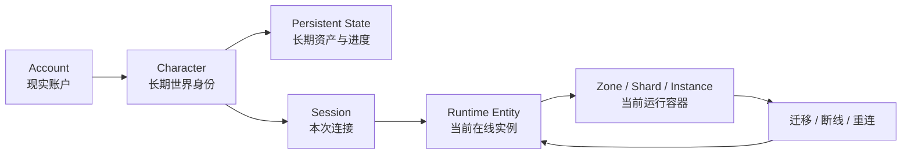
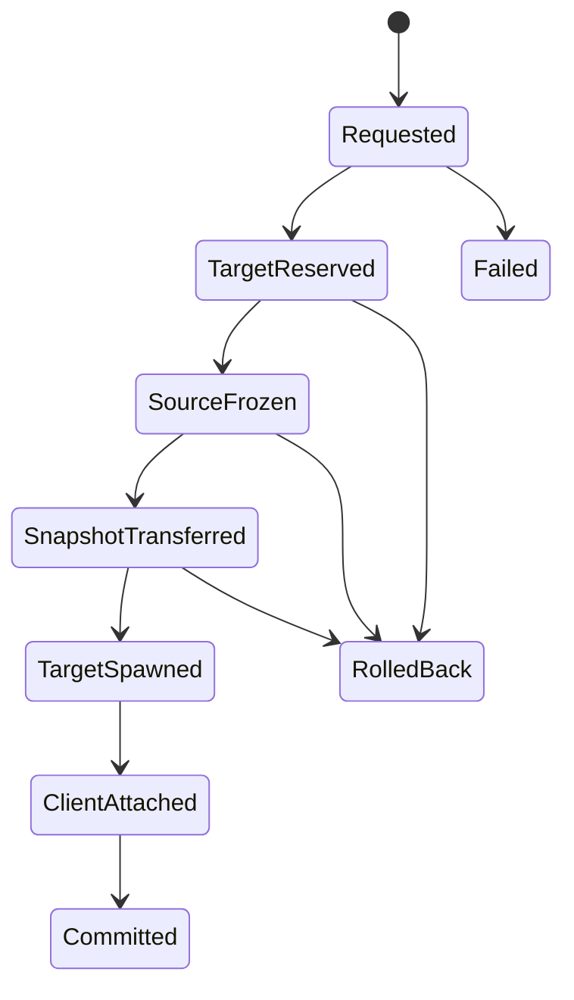

# 持久身份与临时运行时：MMORPG 的角色会话、世界分片与跨区事务

> 系列：游戏系统的共同语言
>
> 日期：2026-08-22
>
> 状态：草稿
>
> 核心问题：玩家感知中的“同一个角色、同一个世界”需要跨越登录会话、网络断线、服务器进程、Zone、Shard 和 Instance 长期成立，运行时应该怎样拆分这些身份与生命周期？
>
> 关键词：MMORPG、Persistent World、Character Identity、Session、Shard、Zone Transfer

[系列目录](../blog.html)

玩家昨天晚上在一座主城下线。

今天重新登录。

他仍然拥有昨天获得的装备、公会身份、任务进度和拍卖订单。

好友已经比昨天高了两级。

某个世界 Boss 在玩家离线期间已经被其他人击败。

市场价格也发生了变化。

玩家走出主城，跨过地图边界。

画面短暂加载了一下，但角色仍然是原来的角色。

稍后他加入朋友的队伍，却发现两个人明明都站在“北风平原”，一开始却互相看不见；系统经过一次分线调整后，两人才出现在同一个世界实例中。

晚上网络突然断开。

玩家立刻重新连接。

服务器必须判断：

- 旧连接是真的死了，还是只是暂时丢包；

- 新连接能不能接管原来的角色；

- 旧服务器上那个 Runtime Entity 是否还活着；

- 是否允许同一个 Character 同时出现两份；

- 玩家断线前正在跨区的话，到底应该恢复在 Source 还是 Target。


从玩家视角看，这些事情最终应该只有一个结果：

> 我还是昨天那个角色，我回到了同一个长期世界。

但服务器内部真正维持这句话，需要的是一整套身份、所有权和事务边界。

## 先说结论：MMORPG 的核心不是“很多玩家”，而是持久身份跨越临时运行时继续成立

**持久身份（后文简称“不会因为下线就消失的那个我”）**：独立于本次网络连接、服务器进程和场景实例存在，并能够跨会话继续承载角色资产、成长、社会关系和历史的长期身份。

**临时运行时（后文简称“这一次在线时被服务器托管的那个我”）**：为了当前 Session、当前 Zone 和当前战斗而存在的在线实体；它可以被销毁、迁移和重建，但不能改变长期角色是谁。

可以先把最重要的关系压缩成：



这张图真正表达的是：

```text
Character
不等于
Session

Session
不等于
Runtime Entity

Runtime Entity
也不等于
Persistent State。
```

只要这几层被压成一个对象，很多 MMO 特有问题就会变成生命周期灾难。

## 持久共享世界首先要求世界真相不属于任何单个玩家

**持久共享世界（后文简称“玩家下线以后仍然继续存在的世界”）**：服务器维护的一套公共世界事实，其生命周期独立于任意单个玩家 Session。

假设一个世界 Boss 已经刷新。

玩家 A 下线。

随后玩家 B 组织队伍击败 Boss。

几个小时后，A 再次登录。

此时不能因为：

```text
A 上次退出时的本地状态
=
Boss 仍然存活
```

就为 A 单独生成另一份公共事实。

真正的状态应该是：

```text
Shared World State:
Boss = Dead
```

而 A 个人可能仍然拥有：

```text
Player Personal State:
本周个人奖励未领取
个人任务阶段 = X
个人声望 = Y
```

因此：

**共享世界状态（后文简称“所有人共同面对的事实”）**与**个人状态（后文简称“只属于这个角色的进度”）**必须分开。

共享状态可以包含：

- 世界时间；

- 公共 Boss；

- 世界事件；

- Realm 状态；

- 公共经济与资源状态。


个人状态则可以包含：

- 等级；

- 装备；

- Inventory；

- Quest；

- Achievement；

- Personal Reputation；

- Personal Phase。


这并不意味着 MMORPG 不能拥有个人剧情分层。

而是：

> Personal Phase 必须被明确承认为个人投影，不能偷偷篡改共享世界真相。

## 数据库里的角色和服务器里正在跑的角色不是同一个对象

**角色持久状态（后文简称“角色真正长期拥有的东西”）**：跨登录保存的 Character 事实，例如等级、装备、货币、任务、声望、公会成员身份和长期位置。

**角色运行实体（后文简称“这次在线时正在世界里跑的实体”）**：当前服务器为这一 Character 建立的短生命周期模拟对象，例如 Position、CurrentHealth、Buff、Threat、CurrentTarget 和移动状态。

一个长期角色可能保存：

```text
CharacterId
Level
Equipment
Inventory
Currency
Quest
Reputation
GuildMembership
LastKnownWorldLocation
```

而当前在线实体可能保存：

```text
RuntimeEntityId
SessionId
CurrentZoneInstanceId
Position
CurrentHealth
CombatState
BuffStates
ThreatState
MovementState
```

把两者拆开以后，一个很重要的工程问题会自然得到答案：

> 为什么不应该每 0.1 秒把角色当前位置、目标和 Buff 全部写进数据库？

因为这些高频状态首先属于 Runtime。

真正需要强持久化保证的通常是：

- 获得装备；

- 消耗货币；

- 任务完成；

- 等级提升；

- 拍卖交易；

- Guild 状态；

- 副本 Lockout；

- 稀有奖励。


也就是说，MMORPG 不只有：

```text
Runtime Update。
```

它还必须拥有：

**耐久提交点（后文简称“这件事从现在开始真的不能丢”）**。

位置少同步一帧通常可以通过重同步恢复。

一件唯一传奇装备重复生成两份，则可能直接破坏经济和玩家资产可信度。

这两种数据不能使用完全相同的一致性成本。

## Account、Character 与 Session 是三个身份域

如果要找一个最常见的 MMO 身份建模错误，那就是：

```text
PlayerId
```

一个字段承担所有含义。

实际上至少存在三个层次。

### Account

现实账户。

它拥有：

- Entitlement；

- 账号设置；

- 多角色集合；

- 账号级收藏；

- 安全状态。


### Character

世界中的长期角色身份。

玩家今天登录和明天登录：

```text
CharacterId
```

仍然可以相同。

### Session

这一次在线连接。

每次登录都应产生新的：

```text
SessionId。
```

因此：

```text
Account
→
可以有多个 Character

Character
→
可以经历很多 Session

Session
→
只代表某一次连接和运行时接管。
```

**身份分层（后文简称“账号是谁、角色是谁、这次连接是谁要分开”）**让重连、封禁、跨区、重复登录和运行实体重建拥有明确语义。

## Session 不能等于 Character

假设玩家手机网络突然断开。

服务器还没有及时发现旧连接失效。

玩家立刻切换网络重新登录。

如果系统只使用：

```text
CharacterId
```

作为在线连接身份，就可能出现两个方向的错误。

一种是：

```text
角色已经在线
→
拒绝新连接。
```

玩家明明只是网络抖动，却被自己残留的旧 Session 锁在门外。

另一种更危险：

```text
新连接成功
→
重新 Spawn Character

旧连接对应 Runtime 仍然存在
```

于是世界中出现：

```text
两个相同 CharacterId。
```

这已经不是普通网络问题。

它变成资产和世界身份复制。

## Session Lease 把“连接暂时消失”与“角色已经离线”分开

**Session Lease（后文简称“这次在线身份的临时租约”）**：通过 Heartbeat、Expiration 和 Grace Period 表达某次连接当前是否仍有资格控制 Character。

网络连接消失以后，不一定立刻：

```text
Destroy Character Runtime。
```

更合理的模型可以是：

```text
Connected
→
Heartbeat Missed
→
Reconnect Grace Period
→
Expired
```

在 Grace Period 中：

- Character 仍然存在；

- 可能进入受限状态；

- 新 Session 可以发起接管；

- 旧 Session 不再无限持有控制权。


这样可以同时避免：

```text
网络抖一下
→
角色立即消失
```

和：

```text
连接早已死亡
→
服务器永远认为它在线。
```

## 重复登录的本质是 Character 控制权接管

新的 Session 验证成功以后，不应该简单：

```text
Create New Character Runtime。
```

更清楚的流程是：

```text
New Session Authenticated
→
Old Session = Replacing
→
冻结旧 Runtime 高价值操作
→
新 Session 取得控制资格
→
确认新的连接稳定
→
旧 Session 失效
```

这里真正发生的不是：

> 第二个玩家登录。

而是：

> 同一个长期 Character 的控制权从一个临时 Session 迁移到另一个 Session。

因此最终仍然必须维护：

**唯一在线运行时（后文简称“同一个角色任何时刻只能真正活一份”）**。

## MMORPG 的“一个世界”不意味着运行在一台服务器上

玩家感知的是：

```text
一个连续世界。
```

运行时却可能拆成：

```text
Realm
→
Region
→
Zone
→
Shard / Layer
→
Instance
→
Encounter。
```

这些层次不是越多越高级。

它们分别解决不同问题。

### Realm

长期世界归属。

它可以承载：

- 社区；

- Guild；

- 经济；

- 共享世界状态。


### Zone

地理或玩法区域。

例如一整块森林、沙漠或主城。

### Shard / Layer

同一个逻辑 Zone 的多个容量副本。

它解决：

```text
这个区域同时来的人太多。
```

### Instance

拥有独立生命周期的高控制内容。

例如：

- Dungeon；

- Raid；

- Scenario；

- Personal Story。


这套结构可以概括为：

**世界拓扑（后文简称“一个世界实际上由很多有限运行容器拼起来”）**。

玩家看到的是连续地理和长期社会。

服务器看到的是一系列可以分别扩容、重启、销毁和迁移的权威模拟单元。

## Shard 是容量分片，不应该变成平行世界

假设两个玩家都位于：

```text
北风平原。
```

玩家 A 实际在：

```text
Shard 3。
```

玩家 B 实际在：

```text
Shard 7。
```

逻辑位置相同。

他们却无法互相看见。

如果系统完全不处理这件事，玩家会产生很强的世界割裂感：

> 明明朋友说就在我旁边，为什么世界里没有他？

因此 Party 建立以后通常需要：

**Shard Cohesion（后文简称“组队以后尽量让大家真的出现在同一条世界线上”）**。

例如：

```text
Party Formed
→
检查成员当前 Shard
→
检查各 Shard 容量
→
选择 Target Shard
→
预留 Party 容量
→
迁移成员
→
恢复共同可见性
```

Shard 的目标是解决容量。

它不应该破坏：

```text
Party 是一个共同活动单元。
```

## 但 Shard Cohesion 不能成为逃战工具

如果玩家可以在任何时刻：

```text
切换 Shard
```

就可能出现：

- 被怪追时换线；

- PvP 劣势时消失；

- 抢资源失败后瞬间换层；

- 世界 Boss 机制中规避危险。


因此 Shard Migration 仍然需要业务规则。

例如：

```text
Combat Lock
Encounter Lock
PvP Lock
Transfer Cooldown。
```

这揭示了一个非常重要的原则：

> 容量基础设施不能绕过玩法规则。

分片系统首先是技术设施。

但一旦玩家能够主动触发，它就进入 Gameplay Contract。

## Zone Transfer 不是 Scene Load，而是一笔分布式角色迁移事务

玩家从 Zone A 走到 Zone B。

客户端看起来可能只是：

```text
Loading...
```

但实际后台可能是：

```text
Source Server 17
→
Target Server 42。
```

这时最危险的两个结果分别是：

### Source 先删除

```text
Source Runtime Destroyed
→
Target Spawn Failed
```

角色从运行世界里消失。

### Target 先创建且 Source 未清

```text
Target Runtime Active
+
Source Runtime Still Active
```

同一个长期角色出现两份在线实体。

所以：

**跨区迁移事务（后文简称“换服务器也必须保证角色既不丢也不复制”）**不能被建模成普通 Scene 切换。

## Zone Transfer 需要明确状态机

一个较完整的迁移过程可以是：



对应的业务流程可以理解为：

```text
Source 收到 Transfer Intent
→
冻结 Character 关键操作
→
生成 Transfer Snapshot
→
World Router 选择 Target
→
Target 预留玩家容量
→
Target 验证 Snapshot
→
Target 建立 Runtime Entity
→
Client 切换 Route
→
Target 确认 Character Active
→
Source 销毁旧 Runtime
→
Transfer Commit
```

最终必须守住：

**Exactly-One Active Runtime（后文简称“迁移过程中可以暂时有准备状态，但不能同时有两份正式角色”）**。

## “冻结 Source”不是为了做漂亮状态机

迁移过程中，如果旧角色仍然可以：

- 交易；

- 拾取装备；

- 完成任务；

- 领取奖励；


Target 同时又根据之前的 Snapshot 创建新 Runtime，

就会产生经典双写问题。

例如：

```text
Snapshot 时金币 = 1000

Source 冻结不完整
→
玩家又花了 500

Target 根据 Snapshot
→
仍然得到 1000。
```

因此 Transfer Pending 期间必须明确：

> 哪些状态还能变化，哪些高价值状态已经禁止继续修改。

这本质上是一次分布式资产交接。

## Transfer 失败必须恢复到一个明确 Owner

假设 Target 服务器因为容量或进程错误创建失败。

玩家最多应该体验到：

```text
跨区失败
→
回到原区域。
```

而不是：

```text
角色数据进入未知状态。
```

因此 Target 失败时，Source 应能够恢复角色。

同样，如果某个 Transfer 卡在中途，下一次登录也需要根据：

```text
TransferId
TransferState
Source
Target
```

判断最终权威位置。

这里的重要原则不是“永远不失败”。

而是：

> 失败以后仍然能够确定谁现在拥有这个 Character。

## 持久角色状态与 Transfer Snapshot 也不是同一个东西

跨区迁移不应该每次：

```text
从数据库完整重新加载角色。
```

当前 Runtime 已经拥有最新：

- 生命状态；

- Buff；

- 当前位置；

- Runtime Progress；

- 当前活动上下文。


因此需要 Transfer Snapshot。

但 Transfer Snapshot 又不是角色最终耐久存档。

可以把三层再拆开：

```text
Persistent State
→
长期事实

Runtime State
→
当前在线模拟事实

Transfer Snapshot
→
一次运行时所有权交接所需的临时事实。
```

三个状态都描述同一个 Character。

但用途和一致性边界不同。

## 公共世界与副本并不互相替代

MMORPG 常同时拥有开放世界与 Instance。

这不是历史遗留。

两者承担不同设计职责。

公共世界擅长：

- 偶遇；

- 采集；

- 公共任务；

- 世界 Boss；

- 探索；

- PvP；

- 社会存在感；

- 动态活动。


Instance 擅长：

- 精确人数；

- 明确难度；

- 稳定 Encounter；

- 可控复活；

- Boss 机制；

- Raid；

- Lockout；

- 可预测 Reward。


可以把二者理解成：

```text
Public World
→
提供“世界里还有其他真实的人”的社会感。

Instance
→
提供“设计者知道这一场里究竟有几个人”的机制控制力。
```

MMORPG 的长期世界体验，往往恰恰来自这两种空间不断切换。

## Instance 可以销毁，但角色身份不能跟着销毁

副本完成以后：

```text
RuntimeInstance
```

完全可以进入：

```text
Completed
→
GracePeriod
→
Destroyed。
```

真正需要长期保存的是：

- Result；

- Reward；

- Lockout；

- Character Progression。


这又一次体现同一条核心原则：

> 运行容器可以结束，长期身份继续存在。

如果把副本 Runtime 当成长期世界事实，就会让大量短生命周期战斗状态污染持久层。

## 共享世界不意味着每个人都同步所有人

“Massively Multiplayer”很容易让人误以为：

```text
Zone 有 300 人
→
每个客户端都需要实时知道另外 299 人的一切。
```

实际上，这种模型在世界 Boss 等热点中很快会失控。

因此：

**兴趣管理（后文简称“只把当前真正相关的世界切片发送给这个玩家”）**通过距离、可见性、Party、战斗关系、Guild、Target、Entity Type 和事件重要性决定同步范围。

例如：

### Tier 0

自己。

最高频。

### Tier 1

当前战斗目标与 Party 成员。

高频。

### Tier 2

附近玩家。

中频。

### Tier 3

远处可见实体。

低频。

这意味着：

```text
同一个 World State
```

可以向不同客户端提供不同精度的观察投影。

“所有人共享一个权威世界”和“所有人收到完整世界数据”并不是同一个要求。

## 社交关系本身也可以改变 Interest

Party 成员即使已经进入远处 Zone，

玩家可能仍然需要看到：

- Health；

- Zone；

- Online State。


但不需要：

```text
每帧完整 Transform。
```

这说明 Interest Management 不只是空间问题。

它还可以包含：

```text
Social Interest。
```

MMORPG 的世界网络，因此天然同时存在：

- Spatial Graph；

- Combat Graph；

- Social Graph。


复制系统需要知道当前关系属于哪一类。

## Server Authority 保护的是长期世界可信度

客户端可以预测：

- 移动；

- 动画；

- 输入反馈。


但高价值事实仍然应该由服务器决定：

- 技能是否合法；

- 命中；

- Damage；

- Loot；

- Inventory；

- Currency；

- Quest；

- Trade；

- Guild；

- Reward。


客户端更适合发送：

```text
I want to cast Fireball on Entity 382.
```

而不是：

```text
I dealt 7421 damage.
```

这种区别并不只是反作弊。

它还在保护：

> 所有玩家最终面对的是同一份长期世界事实。

如果客户端可以自行宣布高价值结果，那么 Persistent World 很快会失去可信度。

## “实时状态”和“资产状态”应该使用不同一致性等级

一个非常实用的 MMORPG 设计原则是：

```text
Position 丢一帧
通常可以恢复。

Legendary Item 重复
不可接受。
```

这两件事如果都使用最强事务：

```text
成本巨大。
```

如果都使用最终一致：

```text
资产会失控。
```

因此系统需要明确哪些数据属于：

### 高频可恢复状态

例如：

- Position；

- Rotation；

- 动画；

- 部分短 Buff；

- 可重构 Target。


### 高价值耐久状态

例如：

- Item Ownership；

- Currency；

- Trade；

- Auction；

- Guild Bank；

- Reward；

- Lockout。


成熟在线系统并不追求：

> 所有数据同样强一致。

它追求：

> 每类事实获得与其损失成本匹配的一致性。

## Reward 必须把重复请求当成正常故障模型

分布式在线系统里，重复消息不是异常中的异常。

它可能来自：

- Timeout Retry；

- 网络重发；

- 服务重启；

- Consumer 重放；

- Transfer 恢复。


所以一个 Boss Reward 如果收到同一个：

```text
RewardOperationId
```

两次，

不能产生两份装备。

**幂等提交（后文简称“同一个结果可以安全重试，但不能重复到账”）**应该成为：

- Loot；

- Currency；

- Quest；

- Weekly Reward；

- Auction；


等关键资产流程的基础合同。

这也是为什么 MMORPG 的长期资产系统和普通单机 Inventory 有完全不同的失败面。

## 世界热点比平均在线人数更危险

服务器平均负载：

```text
30%。
```

并不能证明世界很安全。

一次世界 Boss 可能把：

```text
几百人
+
召唤物
+
投射物
+
战斗同步
```

集中到同一个 Zone。

于是：

```text
Realm 总体很空闲
```

和：

```text
某个权威模拟单元已经过载
```

可以同时成立。

**热点容量（后文简称“真正需要扛住的是所有人突然挤到同一个地方”）**比单纯平均在线人数更能描述 MMO 的扩展压力。

这也解释了为什么：

- Shard；

- AOI；

- Replication Tier；

- World Event Scaling；


不是彼此独立的系统。

它们共同在解决：

> 共享世界中局部人口密度会高度不均匀。

## 逻辑状态 Owner 不应该直接等同于某个物理进程

MMORPG 架构讨论很容易很快进入：

```text
这个服务要不要拆成微服务？
要不要独立 Docker？
```

但更优先的问题应该是：

> 谁拥有这份事实？

例如：

```text
Character Persistent State
由谁拥有？

Guild Membership
由谁拥有？

Zone Runtime
由谁拥有？

Auction Escrow
由谁拥有？
```

**逻辑所有权边界（后文简称“先决定谁说了算，再决定它跑在哪台机器”）**应该先于物理部署边界。

今天两个逻辑 Owner 可以运行在同一个进程。

未来也可以拆开。

只要 Authority Contract 没有变化，上层业务无需因此重写。

如果反过来先按服务器数量切职责，系统很容易让物理拓扑污染业务真理源。

## MMORPG 的连续世界其实是一种被精心维护的错觉

从玩家体验看：

```text
我昨天在这里下线，
今天回来还是我。

我从森林走进城市，
仍然是我。

我进入 Raid，
出来以后还是我。

我网络断了重新连，
仍然是我。
```

服务器内部却发生过：

- Session 替换；

- Runtime Entity 重建；

- Shard 迁移；

- Zone Server 迁移；

- Instance 创建和销毁；

- Snapshot；

- Durable Commit。


所以 MMORPG 最重要的技术体验之一，恰恰是：

> 让大量生命周期变化对玩家来说不改变长期身份连续性。

它不像一场 Match。

Match 结束以后，Runtime 本身可以整体销毁。

MMORPG 则必须不断回答：

```text
这次运行时结束以后，
什么东西仍然算是真的？
```

## 与 JRPG 的边界

JRPG 同样拥有：

- 长期角色；

- 装备；

- 等级；

- Quest；

- 城镇；

- Boss。


但其核心问题更多是：

```text
一支相对稳定的角色队伍
怎样沿章节和冒险成长。
```

MMORPG 增加的并不只是：

```text
Network = true。
```

而是：

```text
世界在我离线时继续存在
+
大量长期身份同时进入
+
世界必须拆分运行
+
社会和经济持续存在
+
资产状态需要服务器权威。
```

因此，同样是 Character Level，

在两个类型中所处的运行环境完全不同。

## 与多人共斗游戏的边界

多人共斗可以拥有：

- 四人队伍；

- Boss；

- Lobby；

- 掉落；

- 长期装备。


但如果核心结构是：

```text
组队
→
进入一次任务
→
完成
→
回大厅，
```

它并不一定需要：

- 持久公共世界；

- Shard；

- Zone Transfer；

- Realm Economy；

- 大型社会组织。


多人共斗的核心价值可以集中在：

```text
Encounter 本身。
```

MMORPG 中 Encounter 只是长期世界里的一个节点。

Raid 结束以后，玩家仍然回到：

- Guild；

- 市场；

- 公共世界；

- 社会关系；

- 周期内容。


## 与刷宝 ARPG 的边界

刷宝 ARPG 可以支持在线四人组队。

甚至可以有非常复杂的 Backend。

但它的主要长期循环通常仍然围绕：

```text
战斗
→
Loot
→
筛选
→
Build
→
更高难度。
```

MMORPG 完全可以没有极端随机装备系统，依靠：

- 固定 Raid Reward；

- Token；

- PvP；

- Craft；

- Quest；


依然成立。

所以：

```text
Loot Search Space
```

不是 MMORPG 的必要核心。

真正不能轻易删除的是：

```text
Persistent Shared World
+
Persistent Identity
+
Social Infrastructure。
```

## 这套模型不能机械照搬到所有在线游戏

如果一个游戏：

- 只有 4～8 人房间；

- 每场 Match 独立；

- 没有长期世界；

- 没有跨 Zone；

- 没有 Guild 经济；

- 长期资产很少；

- 失败后重新建 Lobby 成本很低；


那么完整的：

```text
Realm
Shard
WorldRouter
TransferTransaction
AOI
SessionLease
```

很可能是过度工程。

MMORPG 的这些复杂性服务的是一个非常具体的承诺：

> 大量玩家能够长期生活在一个看起来连续、实际上被分布式运行时不断拆分和重组的世界里。

没有这项产品承诺，就不需要承担同样架构成本。

## 常见设计失败

### Account、Character、Session 共用一个 PlayerId

重连、重复登录、封禁与角色切换开始互相污染。

### Character Persistent State 与 Runtime Entity 是同一对象

数据库持久化和高频战斗状态无法建立不同一致性等级。

### 每 Tick 把完整角色状态写数据库

高成本持久化被浪费在可恢复 Runtime 数据上。

### Shared World State 被塞进每个玩家存档

不同玩家开始拥有互相矛盾的 Boss 和世界事件事实。

### Shard 被设计成玩家可以随意切换的平行世界

容量系统成为逃战、抢资源和规避规则的工具。

### Party 没有 Shard Cohesion

好友逻辑上组队，却长期无法在世界里相遇。

### Zone Transfer 等同于客户端 LoadScene

Source 与 Target 没有明确 Runtime Ownership 交接。

### Source 先销毁，再让 Target 尝试创建

Target 失败时角色失去在线 Owner。

### Target 创建成功以后 Source 仍然继续运行

同一 Character 产生双 Runtime。

### Transfer 没有持久 TransferId 和恢复状态

服务器重启以后无法判断角色应该恢复在哪一侧。

### Session 断线后立即删除 Character

短暂网络抖动被放大成完整退出和重建。

### 旧 Session 永不失效

幽灵连接长期占有角色控制权。

### 所有 Zone 实体向所有客户端同频复制

世界热点立即制造网络和 CPU 风暴。

### AOI 只按距离判断

Party、战斗对象和世界事件的重要关系无法得到合理同步。

### Client 可以直接提交 Damage、Loot 或 Currency 结果

长期世界资产权威被交给不可信端。

### 所有状态都追求同等级强一致

实时战斗延迟与后台成本失控。

### 所有状态都只使用弱最终一致

Inventory、交易和唯一资产开始出现复制。

### 只看 Realm 平均负载设计容量

世界 Boss 等局部热点成为真正崩溃点。

### 先按微服务数量切系统，再决定谁拥有状态

部署拓扑开始反向定义业务真理源。

## 我的 MMORPG 持久身份检查表

1. Shared World State 与 Player Personal State 是否明确分开？

2. Character Persistent State 与 Runtime Entity 是否是两个模型？

3. Account、Character、Session 是否拥有不同 ID？

4. 同一个 Character 是否可以经历多次 Session？

5. Session 是否拥有 Heartbeat、Lease 或 Expiration 语义？

6. 网络抖动是否拥有合理 Reconnect Grace Period？

7. Duplicate Login 是否不会生成第二份正式 Character Runtime？

8. Session 接管时旧 Runtime 是否会进入冻结或 Replacing 状态？

9. 任意时刻是否能证明一个 Character 只有一个权威 Runtime？

10. Runtime 高频状态是否不会无意义全量写入 Durable Store？

11. Item、Currency、Quest、Guild、Reward 是否拥有明确 Durable Commit Point？

12. World Truth 是否独立于任意玩家个人存档？

13. Realm、Zone、Shard 与 Instance 的职责是否明确？

14. Shard 是否只是容量分片，而不是另一个独立世界事实？

15. Party 是否拥有 Shard Cohesion？

16. 战斗、PvP 和 Encounter 是否限制任意换 Shard？

17. Zone Transfer 是否有稳定 TransferId？

18. Transfer 是否拥有 Requested、Reserved、Frozen、Spawned、Committed 等明确状态？

19. Source 是否在 Target 能安全接管前避免永久删除 Character？

20. Target 成功以后 Source 是否一定失去正式 Authority？

21. Transfer 失败是否能够 Rollback 到明确 Owner？

22. Transfer Timeout 后是否能够在下一次登录恢复？

23. Transfer Snapshot 与 Durable Character State 是否是两个概念？

24. Public World 和 Instance 是否承担不同设计职责？

25. Instance Runtime 销毁以后 Reward 与 Lockout 是否仍能持久存在？

26. AOI 是否限制每个客户端实际复制的 Entity 集合？

27. Party、Combat、Social Relation 是否能够影响 Interest Tier？

28. 世界 Boss 等热点是否拥有独立 Replication / Capacity Budget？

29. 客户端是否主要发送 Intent，而不是高价值结果？

30. Position 等可恢复状态与 Legendary Item 等资产状态是否采用不同一致性策略？

31. Reward、Trade 和 Auction 是否能够安全处理重复请求？

32. 逻辑 State Owner 是否先于物理服务器边界定义？

33. 调试系统是否能回答某个 Character 当前由哪个 Session、Zone、Shard 和 Server 托管？

34. 玩家断线、换线、进副本和跨区以后，长期 Character Identity 是否始终保持连续？


MMORPG 最容易被宣传的是：

```text
同时在线人数很多。
```

最容易被看到的是：

```text
大地图
副本
Raid
Guild
拍卖行。
```

但这些功能真正建立在同一个更底层的承诺之上：

```text
世界不会随着某个玩家退出而消失，
角色也不会随着某次连接结束而重新开始。
```

玩家登录的是一个长期 Character。

Session 只是这次连接。

Runtime Entity 只是当前服务器上的在线身体。

Zone、Shard 和 Instance 只是这一刻托管它的运行容器。

这些容器都可以被替换。

长期身份不能因此改变。

于是 MMORPG 真正复杂的地方，也并不是让一台服务器同时模拟无限玩家。

而是让：

```text
大量长期身份
不断进入和离开
大量短生命周期运行容器
```

同时始终保持三件事：

```text
世界真相只有一份，
角色身份始终连续，
高价值资产不会因为分布式故障被丢失或复制。
```

从玩家角度看，最终只剩一句非常简单的话：

> **我离开过，但这个世界一直都在；我重新回来时，我仍然是我。**

## 术语对照

|正式术语|文中通俗称呼|
|---|---|
|持久身份|不会因为下线就消失的那个我|
|临时运行时|这一次在线时被服务器托管的那个我|
|持久共享世界|玩家下线以后仍然继续存在的世界|
|共享世界状态|所有人共同面对的事实|
|个人状态|只属于这个角色的进度|
|角色持久状态|角色真正长期拥有的东西|
|角色运行实体|这次在线时正在世界里跑的实体|
|耐久提交点|这件事从现在开始真的不能丢|
|身份分层|账号是谁、角色是谁、这次连接是谁要分开|
|Session Lease|这次在线身份的临时租约|
|唯一在线运行时|同一个角色任何时刻只能真正活一份|
|世界拓扑|一个世界实际上由很多有限运行容器拼起来|
|Shard Cohesion|组队以后尽量让大家真的出现在同一条世界线上|
|跨区迁移事务|换服务器也必须保证角色既不丢也不复制|
|Exactly-One Active Runtime|迁移过程中可以暂时有准备状态，但不能同时有两份正式角色|
|兴趣管理|只把当前真正相关的世界切片发送给这个玩家|
|幂等提交|同一个结果可以安全重试，但不能重复到账|
|热点容量|真正需要扛住的是所有人突然挤到同一个地方|
|逻辑所有权边界|先决定谁说了算，再决定它跑在哪台机器|

---

## 内部资料依据

本文主要基于以下材料整理：

- `game-designs/MMORPG游戏设计范式.md`

- `game-designs/README.md`

- `game-designs/catalog.v1.json`

- `blogs/README.md`

- `blogs/publication.v1.json`


本文是对 MMORPG / Persistent Shared-World RPG 宏观设计范式的个人综述。

文中的 Account / Character / Session 分型、Session Lease、Realm / Zone / Shard / Instance、Zone Transfer State Machine、Exactly-One Active Runtime、AOI 与 Durable Commit Point 属于用于分析和设计长期在线世界的工程模型，并不表示所有 MMORPG 都必须采用完全相同的服务器拓扑、分片算法、数据库结构或转区协议。

尤其需要注意：

- “Shard 是容量分片”不意味着所有 MMORPG 都必须向玩家隐藏分线，也不意味着所有公共区域都适合自动 Sharding；

- “Zone Transfer 是分布式事务”强调的是唯一 Runtime 与失败恢复语义，不要求具体实现使用某一种数据库事务或两阶段提交协议；

- “Session Lease”是一种适合表达重连和幽灵连接的生命周期模型，并不是唯一可行的网络会话实现；

- “服务器权威”不意味着客户端不能预测移动和即时表现，真正需要严格保护的是会影响其他玩家和长期资产的高价值事实；

- “Persistent World”也不要求世界中的每一个系统在玩家离线后都持续逐 Tick 模拟，只要求关键公共事实和长期社会状态不会因为某个玩家 Session 结束而失去连续性。
