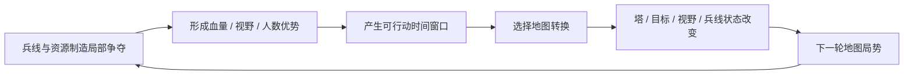

# 可行动时间窗口与地图转换：MOBA 的兵线节拍、人数差与优势兑现

> 系列：游戏系统的共同语言
>
> 日期：2026-08-16
>
> 状态：草稿
>
> 核心问题：MOBA 中一次击杀、一次团战或一次线权优势，怎样从短暂的战斗收益转换成能够持续影响后续局势的地图状态？
>
> 关键词：MOBA、Action Window、Lane Pressure、Map Conversion、Vision、Objective

[系列目录](../blog.html)

一支队伍刚刚打出了一波非常漂亮的团战。

对方三名英雄阵亡。

己方五人全部存活。

战绩面板上，击杀数字明显领先。

所有人都觉得这一波赚得很大。

但胜方随后做了几件事：

- 一个人继续刷附近野怪；
- 两个人原地回城；
- 一个人清了一波兵；
- 另一个人在河道闲逛。

二十多秒以后，对方陆续复活。

地图上的塔没有少。

大型目标还在。

兵线也没有形成明显优势。

双方重新回到五人状态。

刚才看起来非常巨大的胜利，最后只留下了几百金币和一点经验差。

这在 MOBA 中并不罕见。

因为 MOBA 的胜负并不是由：

```text
谁赢了更多次战斗
```

直接决定的。

真正决定长期局势的是：

```text
战斗胜利以后
你利用对方暂时无法行动的时间
改变了什么。
```

## 先说结论：MOBA 的核心资源之一是地图行动权

**可行动时间窗口（后文简称“地图行动权”）**：由于敌方死亡、回城、被兵线牵制、技能资源不足或位置过远，在未来一段有限时间内，一方可以以较低风险执行地图行为的机会。

假设敌方核心英雄死亡 30 秒。

这个结果表面上是：

```text
敌方少一个人
持续 30 秒
```

但真正有战略价值的解释是：

```text
未来 30 秒
我方拥有更高概率安全执行地图行为。
```

这些行为可能包括：

- 推塔；
- 控制大型中立目标；
- 入侵野区；
- 布置深层视野；
- 清理敌方视野；
- 推动边线；
- 回城购买装备；
- 重新分配路线；
- 建立下一轮资源控制。

因此，MOBA 中最重要的循环并不是：

```text
打架
→
击杀
→
继续打架
```

而更接近：



一场战斗只是制造窗口。

真正的战略发生在：

> 窗口出现之后，你选择把它换成什么。

## 兵线是整场比赛不断自动运行的基础时钟

**兵线节拍（后文简称“地图的周期钟”）**：固定时间生成并沿线路自动推进的单位流，它同时提供经济、经验、建筑压力和玩家转线的机会成本。

兵线并不是普通的小怪。

即使十名玩家全部停止操作：

```text
基地仍然生成兵线
→
兵线仍然沿路线推进
→
双方兵线仍然接触
→
仍然会有一方逐渐形成推进压力
→
最终仍可能接触建筑
```

也就是说：

> 地图本身不会等待玩家。

兵线持续给比赛提出新的问题。

每一波兵线都在重新问：

```text
谁来处理？
谁能吃资源？
谁可以先离开？
谁如果离开会损失塔或经济？
```

这也是 MOBA 中很多“节奏”真正的来源。

玩家不是任意时间想去哪里就去哪里。

他的移动自由受到下一波兵线持续约束。

## 线路不是道路，而是一条周期资源带

一条线路同时包含：

- 周期金钱；
- 周期经验；
- 建筑；
- 野区入口；
- 支援路径；
- 安全区域；
- 被伏击风险；
- 下一批兵线到达时间。

所以控制一条线，不等于：

```text
我站在这里。
```

更重要的是：

```text
我能够更自由地离开这里
而对方不能。
```

**线权（后文简称“更早离开线路的资格”）**：当前兵线状态允许某一方在不承担严重经济或建筑损失的情况下，先于对手离开线路参与其他地图行为的能力。

例如：

```text
蓝方快速清完兵线
↓
红方下一波兵必须在塔下处理
↓
蓝方中单先离开
↓
河道暂时出现人数差
```

蓝方获得的并不只是：

```text
清兵更快。
```

而是：

```text
未来几秒可以先在别处出现。
```

兵线因此天然会转换成时间优势。

## Wave State 本质上是在预先安排未来的人力成本

兵线可以存在不同状态：

```text
Frozen
SlowPush
FastPush
Neutral
Crashing
Rebounding
```

它们不仅影响当前补刀。

还会改变未来几十秒哪一方必须投入人员。

### Freeze

让兵线长期停在较安全位置。

收益：

- 安全获取资源；
- 限制敌方补刀；
- 增加敌人向前暴露的风险。

代价：

- 自己也更难迅速离线；
- 地图支援能力降低。

### Fast Push

快速清掉当前兵线。

收益通常不是“多杀几个小兵”。

而是：

```text
我现在可以获得短暂自由时间。
```

这段时间可以用于：

- 回城；
- 游走；
- 抢目标；
- 推塔；
- 插眼。

### Slow Push

故意让多批己方兵线逐渐积累。

最终会形成一支需要敌方认真处理的大兵线。

这等于提前创建一个：

> 未来必须有人去支付的地图账单。

当大型目标即将刷新时，一条已经形成 Slow Push 的边线可以迫使对方作出选择：

```text
派人处理兵线
→
目标区域少人

不处理兵线
→
建筑承受长期压力
```

兵线因此是一种延迟生效的人员调度工具。

## 人数差真正重要的是“持续多久”

MOBA 中很多战斗都不是理想化的：

```text
5v5
```

而是：

```text
2v1
3v2
4v3
5v4
```

这些人数差可能来自：

- 击杀；
- 回城；
- 兵线牵制；
- 传送冷却；
- 游走；
- 视野缺失；
- 移动距离；
- 英雄复活时间。

因此：

**局部人数差（后文简称“这几秒谁能来更多人”）**并不是一个静态数字，而是一段时间函数。

当前可能是：

```text
2v2
```

三秒后：

```text
己方打野到达
→
3v2
```

再过两秒：

```text
敌方中路赶到
→
3v3
```

所以真正需要判断的是：

> 在战斗达到不可逆结果之前，双方各自还有谁能赶到。

这也是地图移动时间为什么本身是一种战略资源。

## 击杀真正产生的是一段低风险地图时间

**战斗优势（后文简称“这波打赢了”）**：血量、技能、人数和位置上形成的短期胜利状态。

**地图转换（后文简称“这波赢下来以后真正拿到了什么”）**：利用战斗优势获得建筑、目标、视野、兵线状态、野区控制或装备节奏等更持久收益的过程。

二者必须分开。

例如：

```text
击杀敌方中单
```

产生：

```text
300 金币
+
经验
+
敌方中单 25 秒无法参与地图
```

前两项是直接经济收益。

第三项则是地图行动权。

如果胜方什么都不做：

```text
25 秒结束
→
敌人复活
```

那么这部分价值直接蒸发。

所以一次击杀的真实价值可以粗略理解成：

```text
直接奖励
+
可利用窗口产生的地图收益
```

后者有时甚至比击杀金币更重要。

## 地图转换并不存在固定答案

赢下一次小规模战斗以后，团队可能选择：

### 推塔

获得：

- 建筑经济；
- 永久地图变化；
- 更深的安全边界；
- 更大的入侵空间。

### 控制大型目标

获得：

- 团队增益；
- 推进能力；
- 特殊地图状态；
- 下一阶段战斗优势。

### 入侵野区

获得：

- 敌方资源剥夺；
- 深层视野；
- 后续野区控制。

### 推兵线

获得：

- 未来兵线压力；
- 迫使敌方复活后先清线；
- 下一轮目标的人员窗口。

### 回城

获得：

- 将已经赚到的金钱转成装备；
- 恢复生命和技能资源；
- 为下一轮强势期做准备。

这些都可能是合理选择。

关键不是：

> 击杀以后永远先打某个目标。

而是比较：

```text
窗口剩余多久
目标有多远
当前兵线在哪里
团队剩余血量如何
关键技能是否还在
敌人什么时候复活
当前经济是否需要兑现
```

## 一个可行动窗口可以用“剩余有效时间”理解

虽然实际游戏不会只使用一个简单公式，但从设计上可以使用一个很有帮助的心智模型：

```text
有效行动时间
≈
敌方重新获得行动能力前的时间
-
我方移动时间
-
完成目标需要的时间
-
安全撤离或重组需要的时间
```

假设：

```text
敌人 25 秒后复活
目标需要 10 秒击杀
从当前位置走过去需要 8 秒
打完以后安全离开至少需要 5 秒
```

那么：

```text
25 - 8 - 10 - 5 = 2 秒
```

这已经是一项非常紧张的操作。

如果玩家只看到：

```text
敌人还死 25 秒
```

很容易误以为时间非常充足。

真正的窗口永远要减掉执行成本。

## 死亡的主要惩罚是失去地图存在权

传统角色扮演游戏中，死亡可能意味着：

- 经验损失；
- 装备损失；
- 重新加载。

MOBA 中，英雄通常会复活。

所以死亡并不是永久丢失角色。

它更接近：

**地图存在权冻结（后文简称“暂时不能参与世界”）**：在复活结束之前，玩家无法通过自己的英雄影响兵线、目标、视野和建筑。

因此死亡损失包括：

- 当前地图位置；
- 兵线经验；
- 补刀；
- 建筑防守；
- 团队人数；
- 中立目标控制；
- 野区资源；
- 当前节奏。

这也解释了复活时间为什么通常随比赛阶段增加。

早期：

```text
死亡 8 秒
```

可能只是损失一小波资源。

后期：

```text
死亡 50 秒
```

却可能意味着：

```text
大型目标
→
高地
→
基地
```

连续丢失。

死亡时间本身就是比赛后期越来越高的地图杠杆。

## 防御塔是一条地图安全边界

**结构安全边界（后文简称“地图上仍然相对安全的前沿”）**：建筑通过攻击、视野和位置限制，定义一方可以较低风险活动的空间范围。

防御塔的价值不能只用：

```text
HP = 5000
```

理解。

外塔被摧毁以后，变化的可能是：

- 野区入口暴露；
- 回城路线变危险；
- 深层守卫更容易被布置；
- 敌方兵线可以推进更深；
- 自己清线时必须站得更远；
- 对方游走路线扩大。

所以拆塔真正改变的是：

> 哪些区域还属于相对安全空间。

这是一种比金币奖励更持久的地图收益。

## 地图结构改变以后，未来窗口的转换效率也会改变

这里存在一个非常重要的正反馈。

第一次击杀敌人时：

```text
最近的塔很远
→
只能获得少量资源。
```

外塔被拆以后：

```text
地图安全边界前移
→
下一次战斗胜利后更容易进入敌方野区
→
更容易做深层视野
→
更容易继续制造下一次人数差
```

因此地图转换不是一次独立收益。

它会改变之后：

```text
每一段 Action Window 的价值。
```

这正是 MOBA 滚雪球真正危险的地方。

## 视野是一种“降低行动不确定性”的资源

**视野控制（后文简称“知道哪些地方现在可以放心做事”）**：通过英雄、兵线、建筑、守卫和技能获取敌方位置与地图状态，降低推进、入侵和目标控制时的不确定性。

视野本身通常不会：

```text
造成 500 伤害。
```

但它会改变：

- 能不能安全推线；
- 能不能进入野区；
- 能不能偷大型目标；
- 当前人数差是否真实；
- 敌方支援多久会到；
- 哪条撤退路线安全。

因此，视野本质上影响：

```text
地图行动成功率。
```

这也是为什么击杀后的一项合理转换可能不是：

```text
立即打目标
```

而是：

```text
先清视野
→
布置深层视野
→
为下一轮目标创造更高确定性。
```

## 视野必须是可以被争夺的信息基础设施

如果守卫永远存在，视野会逐渐变成永久地图解锁。

如果排眼成本为零，视野又没有真正竞争。

更合理的循环是：

```text
布置视野
→
获得信息
→
安全执行行动
→
敌方侦测和清除
→
重新进入不确定状态
→
再次投入资源
```

这使：

```text
Information Control
```

成为一项需要持续维护的团队资源。

视野并不是：

> 看到了敌人。

而是：

> 我们为未来的地图行动购买了更高确定性。

## 小地图因此不是辅助 UI

玩家需要同时理解：

- 三条兵线；
- 队友位置；
- 已知敌人位置；
- 建筑状态；
- 中立目标；
- 视野区域；
- Ping；
- 正在形成的边线压力。

这些信息无法只靠主视角表达。

所以小地图本质上是：

> MOBA 的战略状态视图。

如果小地图信息不足，玩家无法判断：

```text
这一波到底有没有地图行动权。
```

例如当前屏幕内看起来是：

```text
2v2
```

但小地图可能告诉玩家：

```text
己方支援距此 4 秒
敌方中单刚在线上出现
敌方上单正在处理慢推兵线
```

于是这场战斗实际上具有更安全的短期窗口。

## 中立目标是局部优势的放大器

**团队目标转换器（后文简称“把一小段优势放大成整队收益”）**：大型中立目标把局部人数、视野或位置优势转换为持续团队增益、推进能力或地图状态。

如果一个大型目标只是：

```text
高血 Boss
→
死后 +500 金币
```

它的战略意义有限。

更有价值的是：

```text
赢下一场河道战
→
获得人数差
→
控制大型目标
→
全队获得推进 Buff
→
兵线压力增加
→
多路建筑同时受压
```

于是：

```text
一次局部战斗
```

被放大成：

```text
整个地图的结构性压力。
```

大型目标真正连接的是战斗层和战略层。

## 超级兵线是一种自动占用敌方注意力的长期资产

当某条线路的高地结构被破坏以后，强化兵线可以周期性生成。

它的价值不只是：

```text
小兵更强。
```

而是：

**自动人员税（后文简称“对方以后必须不断派人来处理”）**：持续生成的线路压力迫使防守方投入英雄时间，否则兵线会自动损害更深层建筑。

例如大型目标即将刷新：

```text
蓝方三路正常
红方下路存在超级兵
```

红方必须选择：

```text
五人都去目标
→
下路基地持续承压

派一人处理
→
目标区域暂时形成 4v5
```

之前拆掉高地所获得的地图优势，现在转化成了新的局部人数差。

因此：

```text
过去的地图转换
```

会继续制造：

```text
未来的行动窗口。
```

## 回城同样是一种时间交易

**回城窗口（后文简称“不会因为暂时离开地图而亏太多的时间”）**：玩家在兵线、敌人位置和目标时间允许的情况下，将自己暂时移出地图，以完成装备购买、生命恢复和资源重组。

玩家拥有：

```text
1500 金币
```

并不意味着已经获得对应战力。

只有：

```text
回城
→
购买装备
→
重新到达地图
```

以后，经济才真正转化成战斗能力。

因此回城会交换：

```text
地图存在时间
```

和：

```text
未来战斗强度。
```

寻找 Recall Window，本质上也是时间窗口管理。

## Power Spike 也可以制造主动窗口

可行动时间窗口并不只来自敌人死亡。

英雄自身强势期同样可以创造行动机会。

例如：

```text
到达 6 级
获得终极技能
```

或者：

```text
完成第一件核心装备
```

这时即使敌方没有死亡，双方相对力量关系也已经改变。

**强势窗口（后文简称“现在这几分钟我比正常状态更有行动资格”）**：英雄由于等级、技能、装备或临时 Buff 进入相对强于对手的阶段。

如果一个英雄刚完成重大装备，而敌方还差 800 金币：

```text
未来几分钟
```

就是主动制造战斗和地图转换的机会。

如果玩家只是继续和平补刀，直到双方装备重新接近：

```text
Power Spike
```

就被浪费掉了。

所以 MOBA 中的“强”一直是时间敏感的。

## 优势不是一个数字，而是一组仍未兑现的机会

很多分析工具喜欢显示：

```text
Gold Difference = +5000
```

这当然有价值。

但同样的 5000 金领先可能处于完全不同状态。

情况 A：

```text
+5000 金
三路外塔全部存在
视野平衡
大型目标未控制
```

情况 B：

```text
+5000 金
敌方两座外塔消失
野区深层视野已经建立
大型目标 Buff 在手
边线慢推正在形成
```

后者拥有更强的：

```text
未来行动能力。
```

所以领先不应该只表示：

```text
已有多少资源差。
```

还应该分析：

- 地图结构；
- 线权；
- 视野；
- 目标；
- 复活时间；
- 装备强势期；
- 未来兵线。

## 滚雪球真正危险的是“优势提高未来转换效率”

MOBA 天然存在正反馈：

```text
击杀
→
金钱
→
装备
→
更容易击杀
```

但更深的一层是：

```text
击杀
→
拆塔
→
地图边界前移
→
更容易布深眼
→
更容易抓人
→
更容易获得下一次人数差
→
更容易继续拆塔
```

也就是说：

> 领先方不只是更强，还可能更容易把下一次优势兑现。

这就是为什么完全没有负反馈的 MOBA 很容易过早进入确定局。

## 翻盘机制的职责是保留决策空间，不是取消领先

**翻盘空间（后文简称“落后方仍有值得执行的高价值行动”）**：即使一方处于明显劣势，仍然存在风险较高但有战略价值的反击机会，使比赛尚未完全失去决策意义。

常见机制可能包括：

- 连杀赏金；
- 高地防守；
- 大型目标争夺风险；
- 较长的后期复活时间；
- 兵线推进距离；
- 装备槽上限。

这些机制的目标不是：

```text
领先 20 分钟
→
被击杀一次
→
优势全部归零
```

而是：

```text
领先方犯下高价值错误
→
落后方可以利用窗口
→
重新改变地图状态。
```

翻盘的价值来自：

> 领先仍然重要，但错误仍然有后果。

## 后期复活时间会把一次战斗放大成比赛终结窗口

随着比赛推进：

```text
复活时间增加
```

同样一次击杀产生的地图行动权会越来越大。

早期：

```text
击杀一人
→
可能只够推一波线。
```

后期：

```text
击杀三人
→
可能足够拿大型目标
→
拆高地
→
直接结束比赛。
```

所以比赛后期不需要无限增加建筑伤害或目标奖励。

仅仅通过：

```text
更长的敌方缺席时间
```

就已经能够自然提高一次团战的战略权重。

## 击杀 UI 不应压过地图目标

如果整个表现系统一直强调：

```text
DOUBLE KILL
TRIPLE KILL
QUADRA KILL
```

而拆塔、线权、视野和大型目标几乎没有等量反馈，

玩家会很自然地学到：

> MOBA 的目标就是杀人。

这会产生典型行为：

```text
赢团
→
继续追残血
→
追到敌方深区
→
目标窗口消失
→
地图收益为零。
```

因此教学和反馈必须反复强化：

> 击杀的价值在于它允许你接下来做什么。

Scoreboard 也不应该只突出 K/D/A。

还应包含：

- 补刀；
- 金钱；
- 等级；
- 建筑；
- 中立目标；
- 视野；
- 目标参与。

系统展示什么，玩家就会逐渐优化什么。

## 一次典型的优势兑现链

可以用一个简化案例说明整个机制。

中期，大型目标已经刷新。

蓝方中路快速清掉兵线。

红方中路必须停留处理塔下兵。

因此：

```text
蓝方中路先获得离线时间。
```

蓝方打野已经提前在河道布置视野。

敌方支援位置不明，但主要路线暂时安全。

蓝方中野制造 2v1。

红方中单死亡。

服务器确定：

```text
Respawn = 25 秒。
```

现在产生一段 Action Window。

蓝队检查：

```text
己方状态良好
大型目标就在附近
敌方下路距离较远
上路仍被兵线牵制
```

于是决定：

```text
先控制大型目标。
```

过程中，中路兵线已经继续进入敌方外塔。

蓝方获得目标 Buff。

红方中单复活。

但蓝方随后回到中路：

```text
目标 Buff
+
推进兵线
```

共同拆掉外塔。

结果不是：

```text
蓝方中单 +1 击杀。
```

而是：

```text
一次中路线权
→
一次 2v1
→
一个死亡时间窗口
→
一个大型目标
→
一座外塔
→
敌方中路安全边界后退
→
未来河道与野区更容易被控制。
```

这才是一条完整的 MOBA 优势兑现链。

## 常见设计失败

### 兵线只是定时刷新的小怪

玩家不需要围绕到线时间、控线和支援成本做判断。

兵线没有真正承担时间节拍职责。

### 击杀收益远高于地图收益

玩家长期只优化 K/D/A。

推塔、中立目标和兵线成为附属玩法。

### 击杀以后几乎没有地图转换空间

敌方复活过快、目标太远或建筑过强，使赢团几乎无法改变地图。

战斗和战略层被切断。

### 中立目标只是高生命金币包

无法把人数优势和视野优势转成团队级地图状态。

### 塔只是高 HP 静态障碍

拆塔前后野区安全、视野和移动路径几乎不变。

建筑没有真正改变地图结构。

### 兵线 AI 高度随机

玩家无法稳定判断：

- 到线时间；
- 相遇位置；
- 推线方向；
- 回城窗口。

线权失去可学习性。

### 死亡时间始终非常短

后期战斗仍无法制造足够大的转换窗口。

比赛容易拖长。

### 死亡时间增长过快

一次偶然失误过早直接结束整场比赛。

### 视野只是客户端表现层隐藏

服务器仍向客户端发送完整敌方信息，产生严重作弊面。

### 视野太便宜或太永久

信息控制不再需要争夺。

### 翻盘机制过弱

领先方一旦获得地图边界优势，就越来越容易继续兑现下一次优势。

比赛过早失去决策意义。

### 翻盘机制过强

一次高赏金击杀可以抹掉长期战略经营。

领先本身失去价值。

### Scoreboard 只强调人头

系统主动教育玩家忽视：

- 兵线；
- 视野；
- 建筑；
- 目标。

## 与相近类型的边界

| 类型 | 短期战斗胜利后的主要转换 | 地图压力来源 | 失败后的存在状态 |
|---|---|---|---|
| MOBA | 塔、目标、视野、兵线与地图行动权 | 周期兵线 + 玩家移动 | 定时复活 |
| 英雄射击 | 据点、护送进度、回合目标 | 固定目标区域 | 通常较短复活 |
| RTS | 单位、经济、基地、资源区 | 玩家生产军队 | 单位永久损失 |
| 大逃杀 | 存活资格与安全空间 | 缩圈 + 不可逆淘汰 | 通常直接淘汰 |
| 塔防 | 防线存续与资源再投资 | 固定波次路径 | 多为关卡失败 |

MOBA 最独特的地方，是：

```text
战斗本身经常不是最终目标
```

而只是获取：

```text
地图行动权
```

的主要手段之一。

## 这套模型不能简单照搬到所有竞技游戏

如果一款游戏：

- 没有长期地图状态；
- 没有周期兵线；
- 没有结构建筑；
- 死亡后几秒立即返回；
- 比赛主要按击杀计分；

那么强行设计复杂的 Map Conversion 并不会自动增加策略深度。

“优势兑现”成立的前提是：

> 地图中存在比一次战斗更持久、且可以被战斗结果改变的战略对象。

MOBA 中这些对象通常是：

- 塔；
- 高地；
- 兵线；
- 野区；
- 视野；
- 中立目标。

值得迁移的是这种关系。

而不是机械复制：

```text
三路
+
塔
+
Boss。
```

## 我的可行动时间窗口设计检查表

1. 兵线是否拥有稳定且可学习的生成节拍？
2. 玩家能否预测下一波兵线何时到达？
3. 线权是否真的影响玩家何时可以离开线路？
4. Freeze、Fast Push 和 Slow Push 是否产生不同地图机会成本？
5. 击杀以后是否会产生有意义的地图行动窗口？
6. 复活时间是否与比赛阶段相匹配？
7. 早期死亡是否不会过度决定比赛？
8. 后期死亡是否能够明显提高战略后果？
9. 战斗优势与地图转换是否在数据和教学上被明确区分？
10. 一次击杀后是否存在多种合理转换？
11. 转换选择是否受到距离、兵线、血量和冷却约束？
12. 防御塔被拆以后是否真的改变地图安全边界？
13. 大型目标是否能够把局部优势放大成团队级收益？
14. 中立目标是否拥有合理的争夺风险？
15. 超级兵线是否真正形成长期人员税？
16. 视野是否能够显著降低地图行动不确定性？
17. 视野是否可以被敌方清除和重新争夺？
18. 小地图是否能够支持人数、兵线和目标判断？
19. 玩家能否估计支援者大概还需要多久到达？
20. 回城是否拥有真实兵线和地图机会成本？
21. Power Spike 是否形成值得主动利用的阶段？
22. 一次短期领先是否可以转换成长期地图状态？
23. 长期地图优势是否会过度提高下一次转换效率？
24. 是否保留足够的翻盘空间？
25. 翻盘机制是否不会直接取消长期领先价值？
26. Scoreboard 是否展示建筑、目标和视野贡献？
27. Death Recap 是否能够解释无视野、人数差和技能状态？
28. Objective Timeline 是否能够追踪一次目标之后产生了哪些地图收益？
29. Team Fight Timeline 是否能够继续追踪到最终 Map Conversion？
30. Replay 是否能够从兵线、视野和人员位置解释某次决策？
31. Bot Simulation 是否统计首塔、目标率、经济差、翻盘率和雪球速度？
32. 玩家赢下一场关键战斗后，是否能够清楚回答：“现在最值得用这段时间换什么？”

MOBA 最容易被看见的，是英雄。

最容易被统计的，是击杀。

最容易被讨论的，是装备和技能。

但真正让整个类型持续运转的，是一个更隐性的东西：

> **时间窗口。**

兵线不断制造必须处理的时间节点。

视野决定哪些行动可以安全执行。

英雄移动制造局部人数差。

击杀暂时冻结敌方地图行动能力。

复活时间决定窗口能持续多久。

塔、中立目标和边线则决定这段时间最终能够兑换成什么。

于是，一场 MOBA 的长期局势并不是一连串独立战斗的简单相加。

它更接近：

```text
局部优势
→
获得时间
→
使用时间
→
改变地图
→
新的地图状态
→
下一轮优势争夺。
```

优秀的队伍真正擅长的，也不只是：

```text
把团战打赢。
```

而是：

> **让每一次短暂胜利都尽可能留下不会随着敌人复活一起消失的东西。**

## 术语对照

| 正式术语 | 文中通俗称呼 |
|---|---|
| 可行动时间窗口 | 地图行动权 |
| 兵线节拍 | 地图的周期钟 |
| 线权 | 更早离开线路的资格 |
| 局部人数差 | 这几秒谁能来更多人 |
| 战斗优势 | 这波打赢了 |
| 地图转换 | 这波赢下来以后真正拿到了什么 |
| 地图存在权冻结 | 暂时不能参与世界 |
| 结构安全边界 | 地图上仍然相对安全的前沿 |
| 视野控制 | 知道哪些地方现在可以放心做事 |
| 团队目标转换器 | 把一小段优势放大成整队收益 |
| 自动人员税 | 对方以后必须不断派人来处理 |
| 回城窗口 | 不会因为暂时离开地图而亏太多的时间 |
| 强势窗口 | 现在这几分钟我比正常状态更有行动资格 |
| 翻盘空间 | 落后方仍有值得执行的高价值行动 |

---

## 内部资料依据

本文主要基于以下材料整理：

- `game-designs/MOBA游戏设计范式.md`
- `game-designs/README.md`
- `game-designs/catalog.v1.json`
- `blogs/README.md`
- `blogs/publication.v1.json`

本文是对 MOBA / 线路式英雄团队竞技设计范式的个人综述。

文中的 Action Window、Map Conversion、Lane Pressure、Power Spike、Structure Safety Boundary 等概念属于用于解释 MOBA 宏观比赛结构的分析模型，不表示所有 MOBA 都使用完全相同的兵线节拍、复活公式、赏金、塔结构或大型目标规则。

尤其需要注意：

- “击杀的价值主要来自后续地图转换”并不表示击杀直接经济可以忽略；
- “复活时间产生地图行动权”不意味着复活时间越长越好；
- “兵线是基础时钟”是一种宏观设计抽象，不要求所有线路式竞技游戏都采用完全固定的兵线周期；
- “Map Conversion”用于分析短期优势怎样留下持久结果，并不意味着每次击杀都必须立即获得塔或大型目标。