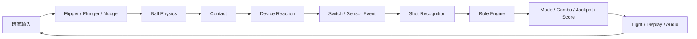

# 物理事实到规则语义：弹球中的 Switch、Shot Recognition 与模式状态机

> 系列：游戏系统的共同语言
>
> 日期：2026-08-31
>
> 状态：草稿
>
> 核心问题：一个高速、连续、长期不可完全预测的球体运动过程，怎样被转换成稳定、可学习、可审计的 Shot、Mode、Combo 和计分规则，同时又不让游戏规则反过来破坏真实物理结果？
>
> 关键词：Pinball、Physics、Switch、Shot Recognition、Mode、Ball Lifecycle

[系列目录](../blog.html)

一颗 Ball 从左侧 Flipper 被击出。

它沿着斜坡向上运动。

进入左侧 Orbit。

连续触发两个 Sensor。

从桌面上方绕回来。

最后重新落到右侧 Flipper。

从物理模拟的角度看，刚才发生的只是：

```text
球的位置改变
→
速度改变
→
经过若干碰撞体和 Trigger。
```

但从弹球规则的角度看，这段轨迹可能意味着：

```text
完成 Left Orbit
→
Combo +1
→
Mode Progress +1
→
Multiplier 提升
→
下一个 Ramp 被点亮
→
如果当前处于 Multiball
   还可能同时获得 Jackpot Qualification。
```

更重要的是：

同一条 Ball 轨迹，在另一局、另一个 Mode、另一个 Multiplier 状态下，可能完全拥有不同的游戏意义。

物理事实没有改变。

规则解释改变了。

这就是数字弹球最值得研究的地方。

## 先说结论：弹球需要把连续物理与离散规则彻底分层

**物理事实—规则语义分层（后文简称“球只负责真的撞到了什么，规则再决定这件事意味着什么”）**：Physics 负责产生连续运动与真实 Contact，Sensor / Switch 将局部物理事实离散化，Shot Recognizer 再把多个事件识别成稳定球路，Rule Engine 最后根据当前规则状态解释这些球路。

整个链路可以先压缩成：



这里每一层都回答不同问题。

| 层次 | 回答的问题 |
|---|---|
| Physics | 球实际上怎样运动 |
| Device | 装置受到球影响后怎样反应 |
| Switch / Sensor | 哪个可审计检测事实发生了 |
| Shot Recognition | 这一串事实能否构成一个正式球路 |
| Rule Engine | 当前规则状态下，这条球路意味着什么 |
| Presentation | 玩家现在最应该注意什么 |

如果把这些层压进：

```text
OnCollisionEnter()
```

弹球很快会变成一张无法维护的事件脚本表。

## 玩家并不直接控制主游戏对象

大多数动作游戏中，玩家直接控制主角。

按左：

```text
角色向左移动。
```

按跳：

```text
角色执行跳跃。
```

弹球不同。

主游戏对象是 Ball。

玩家通常不能直接说：

```text
Ball.Position += ...
```

真正能够控制的是：

- Flipper；
- Plunger；
- Nudge。

这些都是：

**致动器（即“玩家不能搬动球，只能改变会影响球的物理装置”）**。

于是游戏输入关系变成：

```text
玩家
→
控制装置
→
装置改变物理环境
→
Ball 根据同一物理规则自然响应。
```

这是一种典型的间接运动控制。

玩家训练的不是：

> 怎样直接移动 Ball。

而是：

> 怎样利用极少数控制器，在正确时间改变 Ball 的未来轨迹。

## Ball 必须始终是独立权威物理实体

弹球最危险的捷径之一，是把一些特殊装置实现成：

```text
Ball 进入 Ramp
→
隐藏 Ball
→
几秒后在 Ramp Exit Spawn 一个新 Ball。
```

从视觉上看可能完全正常。

从运行时状态看，已经破坏了 Ball Identity。

**Ball Identity（后文简称“从发球到掉球，这始终是同一颗球”）**应该跨越：

- Playfield；
- Ramp；
- Orbit；
- Scoop；
- Kicker；
- Lock；
- Drain Transit；

持续存在。

例如：

```text
Ball A
→
进入 Lock

Ball B
→
继续在 Playfield

Ball C
→
发生 Drain。
```

如果 Ball 不拥有稳定身份，

Multiball 很快会出现：

- 重复 Ball；
- Ball Save 发错对象；
- Lock 数量漂移；
- Trough 数量异常；
- Replay 无法解释。

## Ball Conservation 是比普通物理对象更强的不变量

假设一张数字球台配置六颗物理 Ball。

任意时刻都应近似满足：

```text
Trough
+
Shooter Lane
+
Playfield
+
Physical Locks
+
Held Devices
+
Transit
=
6。
```

这就是：

**Ball Conservation（后文简称“球不会因为装置切换偷偷多一颗或少一颗”）**。

普通 Projectile 可以：

```text
Spawn
→
飞行
→
Destroy。
```

Ball 不适合这样理解。

因为它同时参与：

- 当前 Ball 生命周期；
- 玩家剩余 Ball；
- Lock；
- Multiball；
- Ball Save；
- End-of-Ball；
- 故障恢复。

所以 BallRegistry 更接近一套：

```text
运行时资产完整性系统。
```

而不是普通物理 Entity 列表。

## Physics 不应该知道当前打这个 Bumper 值多少分

假设 Ball 撞上左侧 Bumper。

一个最直接的实现是：

```text
Bumper.OnCollisionEnter
{
    score += 1000;

    if (ModeA)
        score *= 2;
}
```

这种代码的问题不是“不够优雅”。

而是它把两个完全不同的事实混在了一起。

Physics 能够证明：

```text
Ball 碰到了 Bumper。
```

它不能自己决定：

```text
这个碰撞当前值多少分。
```

Mode、Multiplier、Jackpot、Combo 都属于 Rule State。

更合理的链路是：

```text
Ball Contact
→
Bumper Physical Reaction
→
BumperSwitchEvent
→
Rule Engine
→
Score Pipeline。
```

于是同一个 Bumper：

```text
普通状态
→
500

Mode A
→
5000

Wizard Mode
→
完成特殊目标。
```

Physics 完全不需要知道这些规则。

## Device Reaction 与 Rule Event 同样需要分开

一个 Bumper 被 Ball 撞中以后可能同时发生：

```text
物理冲量
+
灯光闪烁
+
机械动画
+
Switch 激活。
```

其中：

```text
给 Ball 一个反弹冲量
```

属于 Device Physical Reaction。

而：

```text
Bumper #3 被合法命中
```

才是 Rule Engine 应该消费的事件。

这意味着：

**装置事实（即“机械结构发生了什么”）**

和：

**规则事件（即“游戏规则应该知道什么”）**

依然不是同一层。

这样设计以后，一套 Rule Engine 可以在：

- 不同 Physics 参数；
- 不同视觉模型；
- 不同桌面 Theme；

上复用。

## Switch Matrix 是连续物理与离散规则之间的真正桥梁

Physics 世界是连续的。

Ball 每个 Fixed Step 都拥有：

```text
Position
Velocity
AngularVelocity。
```

规则世界却需要离散事实：

```text
LeftOrbitEnter
RampExit
TargetBankHit
ScoopOccupied。
```

**Switch Matrix（后文简称“把连续球路转换成稳定开关事实”）**承担的是这个转换。

它不应该简单等于：

```text
所有 Physics Contact。
```

因为一个物理接触可能：

- 持续很多 Tick；
- 反复抖动；
- 从错误方向进入；
- 擦过边缘；
- 同时命中多个碰撞体。

Switch 需要自己的语义，例如：

```text
Open
Closed
Pressed
Released
Pulse
Debounce。
```

Rule Engine 才能获得稳定输入。

## Physics Contact 不能直接当作 Shot

Ball 进入一个 Orbit 时，可能连续触发：

```text
Sensor A
Sensor B
Sensor C。
```

单独任何一个 Sensor 都不能证明：

```text
Left Orbit Completed。
```

它可能只是：

- 反向进入；
- 只经过一半；
- 被 Bumper 弹出去；
- 从出口方向倒灌。

因此弹球需要一个非常关键的中间层：

**Shot Recognition（后文简称“从一串局部开关事件里确认玩家真的完成了一条正式球路”）**。

例如：

```text
Shot: Left Orbit

Expected Sequence:
A → B → C

Direction:
Forward

Time Window:
900ms

Ball:
Same BallId
```

只有满足这些条件，

系统才产生：

```text
LeftOrbitCompleted。
```

## Shot 是一种域语义，而不是物理路径名称

这层存在以后，

Rule Engine 不必关心：

```text
Sensor A 的具体坐标
Sensor B 的 collider shape
Ramp mesh 怎样建。
```

它只消费：

```text
LeftOrbitCompleted
CenterRampCompleted
ThreeBankCompleted。
```

这就是：

**域语义事件（即“把底层实现细节压缩成玩法真正关心的事实”）**。

这种模式非常值得迁移。

赛车可以：

```text
Wheel Contact
→
Checkpoint Crossing
→
Sector Completed。
```

足球模拟可以：

```text
Ball Contact
→
Controlled Touch
→
Pass Completed。
```

物理解谜也可以：

```text
Collider Contacts
→
Object Stable In Socket。
```

规则系统最好消费高层事实，而不是重新解释所有底层传感器。

## Shot Recognition 必须考虑方向和时间

假设球经过：

```text
A
→
B
→
C。
```

和：

```text
C
→
B
→
A。
```

物理上都触发了同样三个 Sensor。

规则上却可能分别是：

```text
Forward Left Orbit
```

和：

```text
Reverse Orbit。
```

因此：

```text
Sensor Set
```

本身通常不够。

还需要：

- Sequence；
- Direction；
- Time Window；
- Ball Identity。

否则玩家通过偶然抖动或倒灌就可能获得本不应该成立的 Shot。

## 同一物理事实可以被多个规则消费者解释

假设：

```text
CenterRampCompleted。
```

当前可能同时满足：

- Mode A 要求命中 Center Ramp；
- Combo 系统正在等待连续 Ramp；
- Multiball Jackpot 正好点亮；
- Achievement 统计正在记录；
- Score Pipeline 需要计算基础分。

因此：

**规则多重解释（即“一个真实事件可以同时进入多个规则，但只能由各自状态决定意义”）**是弹球非常自然的结构。

不要让 Shot Recognizer 自己决定：

```text
现在是 Jackpot。
```

它只负责：

```text
Shot 成立。
```

剩下的属于各个 Rule Consumer。

## 但多消费者必须防止重复奖励

如果：

```text
ShotEvent
```

被多个 System 同时解释，

就需要明确：

```text
哪些奖励可以叠加
哪些只能兑现一次。
```

例如一个 Shot 同时满足：

```text
Mode Objective
+
Jackpot。
```

两项都可能合法。

但同一个：

```text
Jackpot Qualification
```

不能因为两个 Listener 都看见事件就发两次奖励。

所以规则事件需要：

- Stable EventId；
- Source BallId；
- ShotId；
- Rule Scope；
- 必要时的 idempotence。

否则事件广播会把内容组合能力变成重复计分风险。

## Mode 是弹球长期内容的主要组织单位

单纯 Physics 可以让球一直弹。

真正让一张桌面玩几十分钟仍然不断出现新目标的，是：

**Mode（后文简称“当前这段时间，这张桌面要求你完成什么”）**。

一个 Mode 可以定义：

- Qualification；
- Start Condition；
- Objectives；
- Timer；
- Scoring Modifier；
- Completion；
- Failure；
- Light Profile；
- Audio Profile。

例如：

```text
Mode: Reactor Meltdown

目标：
60 秒内完成
Left Orbit
Center Ramp
Right Orbit。
```

同一张桌面几何没有改变。

但玩家现在看到的“地图”已经不同。

普通状态下：

```text
Center Ramp
只是一个安全得分路线。
```

该 Mode 中：

```text
Center Ramp
变成任务必需目标。
```

所以弹球很像在同一个物理空间上不断叠加新的规则解释层。

## Mode Qualification 与 Mode Start 应分离

玩家可能已经完成：

```text
三个 Qualify Shot。
```

于是：

```text
Mode Qualified。
```

但真正进入 Mode 可能还要求：

```text
打入 Scoop。
```

这两个状态最好分开：

```text
Qualified
≠
Active。
```

否则系统很难表达：

> 玩家已经准备好了这个 Mode，但什么时候启动由玩家自己决定。

这种分离会产生真实策略。

玩家可能选择：

- 现在启动；
- 先把 Multiplier 做高；
- 先准备 Ball Lock；
- 等下一颗 Ball 再启动。

## Mode 也不应该默认全部互斥

一张成熟球台可能同时运行：

```text
Main Mode
+
Multiball
+
Combo
+
Hurry-Up
+
Multiplier。
```

如果所有 Mode 都只能：

```text
CurrentMode = X，
```

内容组合空间会非常有限。

更适合的是：

```text
Mode Stack
+
Mode Priority
+
Conflict Rules。
```

一些状态可以并行。

另一些才需要互斥。

## 同一张桌面通过 Rule State 不断改变意义

这是弹球设计中非常有价值的一点。

桌面几何可能几十分钟都不变化。

玩家仍然会不断重新判断：

```text
现在该打哪里？
```

因为规则状态改变了：

```text
普通阶段
→
先打 Drop Targets

Mode Qualified
→
进 Scoop

Mode Active
→
打左 Orbit

Multiball
→
追 Jackpot

Hurry-Up
→
必须马上冒险打高风险 Ramp。
```

因此内容密度不完全依赖：

```text
不断增加新地图。
```

同一物理空间可以被多层规则反复重解释。

## Lighting 不是装饰，而是 Rule State 的信息投影

玩家在高速 Ball 状态下没有时间读长文本。

规则必须通过：

- Lamp；
- Insert；
- Arrow；
- Display；
- Audio；

实时告诉玩家：

```text
现在什么最重要。
```

所以：

**规则信息投影（即“把复杂状态压缩成玩家一眼能读懂的桌面信号”）**是弹球 UI 的核心。

例如：

```text
Left Orbit Flashing
```

应该对应某个明确 Rule State：

```text
Active Objective。
```

而不是视觉脚本自己决定：

```text
现在看起来应该闪一下。
```

## 灯光也需要优先级仲裁

同一个 Lamp 可能同时被多个 Mode 请求：

```text
Mode A
想要常亮

Jackpot
想要快速闪烁

Ball Save
想要呼吸效果。
```

如果最后一个写入者直接覆盖：

```text
谁后 Update 谁赢，
```

显示结果会和规则优先级完全脱节。

因此 Lighting System 应该做：

```text
Rule State
→
Light Requests
→
Priority Arbitration
→
最终表现。
```

Display 和 Audio 同样适用。

## Audio 是高速游戏的重要规则通道

玩家盯着 Ball 时，

很可能根本没有时间看 Display。

因此：

```text
Jackpot Ready
Ball Save Expiring
Mode Completed
Extra Ball。
```

这些关键状态应该拥有稳定 Audio Cue。

音效不只是：

```text
更有打击感。
```

它在承担：

> 玩家没有视觉注意力时的规则信息通道。

## Scoring 应该拥有独立 Pipeline

同一个 Shot 的最终 Score 可能来自：

```text
Base Score
× Playfield Multiplier
× Mode Multiplier
× Combo Multiplier
+ Jackpot Bonus
+ Rule Modifier。
```

如果每个 Device 自己：

```text
score += ...
```

就无法解释最终数字。

因此：

**计分管线（即“先产生得分事实，再由统一规则逐层算出最终奖励”）**应该允许形成 Score Breakdown。

例如：

```text
Left Orbit
Base              10,000
Mode             ×2
Playfield        ×3
Combo            ×1.5
Final             90,000
```

这同时服务：

- 玩家理解；
- Rule Debug；
- Tournament 审计；
- Replay。

## 得分真正应该引导玩家承担不同物理风险

一个特别安全的 Ramp 和一个非常危险的 Side Shot，

如果：

```text
长期期望分完全一样，
```

理性玩家会自然重复安全路线。

因此得分不是纯奖励。

它也是：

**风险定价（即“更难、更容易掉球或更难连续命中的球路，应该拥有相应收益结构”）**。

风险可以来自：

- Drain Probability；
- Return Angle；
- Control Loss；
- Shot Difficulty；
- Recovery Difficulty；
- Ball Speed；
- Multiball Pressure。

真正的风险最好来自 Telemetry。

而不是设计师看着几何说：

```text
这条 Ramp 看起来比较难，
给两倍分。
```

## Combo 把单次 Shot 变成 Ball Flow

如果玩家只需要：

```text
反复命中同一高分目标，
```

空间策略会很快收敛。

Combo 可以要求：

```text
Left Orbit
→
Center Ramp
→
Right Orbit
```

在有限时间内连续成立。

于是玩家不再只考虑：

> 当前这一拍怎样打进去。

而开始考虑：

> 这次 Shot 的返回球路，会不会把我送到下一次 Shot 的良好控制位置？

这就是：

**Ball Flow（即“每一拍都同时在为下一拍创造空间和速度条件”）**。

弹球高级技能因此不是一系列独立反射。

而是连续轨迹管理。

## Hurry-Up 用时间衰减改变风险偏好

Hurry-Up 可以提供：

```text
当前奖励 = 1,000,000
```

然后持续下降。

玩家必须决定：

```text
现在立即打一个危险 Shot
```

还是：

```text
先把 Ball 控稳
但奖励继续下降。
```

它建立了很清楚的：

```text
风险
vs
等待
```

交换。

同一个 Shot 因为时间价值变化，决策意义也改变。

## Flipper 是弹球最重要的控制接口

Ball 服从 Physics。

但玩家的大部分技能最终都通过 Flipper 表达。

因此 Flipper 不应该只是：

```text
按键
→
角度瞬间从 0 跳到 50°。
```

更适合拥有明确状态：

```text
Rest
Upstroke
Hold
Return。
```

并定义：

- 角速度；
- 扭矩；
- 最大角度；
- Return Profile；
- Collision Surface。

这样高级技巧才能从同一套稳定 Physics 中自然出现。

## 高级技巧应该涌现自同一物理规则

玩家逐渐可以学习：

- 延迟击球；
- Dead Flip；
- Trap；
- Post Transfer；
- Backhand；
- Live Catch。

真正有价值的技能不是：

```text
系统检测到高级操作
→
给 Ball 一个秘密辅助速度。
```

而是：

> 同一套 Flipper 与 Ball Physics 足够稳定，玩家能够自己发现更高精度的输入方式。

这和精密平台跳跃存在一个很好的共同原则：

```text
系统保持稳定
→
玩家技能增长。
```

但弹球增加了长期混沌性：

同样输入只能保证局部行为相近，

并不意味着整个 Ball 未来数十秒完全可预测。

## Pinball Physics 的目标是局部稳定，而不是跨平台完美确定

弹球拥有：

- 高速 Ball；
- Spin；
- 多次 Collision；
- Bumper；
- Flipper Contact；
- Nudge。

微小浮点差异经过大量碰撞以后会不断放大。

因此：

**局部确定、长期混沌（即“相同局部状态应该产生可信结果，但不要求整局永远逐 bit 一致”）**比：

```text
所有平台完整 Physics Replay 一定逐帧相同
```

更现实。

真正必须稳定的是：

- Fixed Physics Step；
- Collision 规则；
- Flipper 行为；
- Device Reaction；
- Shot Recognition；
- Rule State。

只有产品明确采用确定物理或固定点时，

才适合进一步承诺完整跨平台 deterministic replay。

## Rule Clock 与 Physics Clock 应分开

Physics 需要稳定 Fixed Step。

Mode Timer、Hurry-Up、Ball Save 等规则时间则有自己的语义。

例如：

```text
Slow Motion 表现
```

不应该自动让：

```text
Ball Save 多持续一倍现实时间，
```

除非规则明确如此。

所以至少要区分：

```text
Physics Clock
Rule Clock
Presentation Clock。
```

这和任何时间敏感游戏一样：

> 谁拥有规则时间，必须是明确合同。

## Nudge 应该影响桌面，而不是直接给 Ball 作弊位移

现实弹球中的 Nudge 是玩家推动整个 Machine。

Ball 因参考系变化受到影响。

如果数字实现只是：

```text
按左
→
Ball.velocity.x -= 5，
```

结果虽然类似，却删除了 Nudge 的真正语义。

更好的模型是：

```text
Nudge Intent
→
Table impulse / reference frame effect
→
所有当前 Ball 都受到一致物理影响。
```

这在 Multiball 中尤其重要。

玩家 Nudge 的不是：

> 某一颗最危险的球。

而是：

> 整张桌面。

## Tilt 是对额外控制权的风险成本

如果 Nudge 没有成本，

玩家就可以不断：

```text
修正 Ball 轨迹。
```

于是本来有限控制的游戏变成：

```text
隐藏的直接 Ball Movement。
```

Tilt 则为这种额外控制设置长期风险。

可以理解为：

```text
Nudge
→
Tilt Meter 上升

超过 Warning
→
警告

继续滥用
→
Tilt
→
Flipper Disabled / 本球失去控制。
```

这是一种很典型的设计：

> 允许玩家临时突破基础控制限制，但需要累积风险。

## Multiball 不是简单 Spawn 更多 Ball

这是数字实现最容易做错的部分之一。

Multiball 真正发生时，

系统可能需要同时完成：

```text
释放 Lock Ball
→
Serve 新 Ball
→
更新 Ball Inventory
→
启用 Ball Save
→
进入新的 Rule Mode
→
点亮 Jackpot
→
切换 Lighting
→
切换 Music
→
提高信息密度。
```

因此：

**Multiball Phase（即“从单球控制模式切换到多球高压力规则阶段”）**是一项正式规则事务。

它不能只是：

```text
Instantiate(ballPrefab, 2)。
```

## Multiball 首先必须维护 Ball Conservation

假设：

```text
两颗 Ball 已经被锁住
一颗 Ball 仍在 Playfield。
```

启动三球 Multiball 时：

```text
Locked A
Locked B
Playfield C
```

应该成为：

```text
Playfield A
Playfield B
Playfield C。
```

不是：

```text
Destroy Locked
→
Spawn 3 New Balls。
```

Ball Identity 和 Inventory 必须继续守恒。

否则 Ball Save、Drain 和 Multiball End 都会开始失去可靠输入。

## Jackpot 是 Multiball 中的目标重映射

Multiball 一旦启动，

屏幕上 Ball 数量更多，

玩家认知负担显著增加。

如果目标仍然只是：

```text
随便打任何东西刷分，
```

阶段会变得杂乱。

Jackpot 可以重新明确：

```text
当前最值钱的目标在哪里。
```

于是高信息密度中仍然存在清楚的规则方向。

Multiball 的乐趣并不是单纯：

```text
球多了。
```

而是：

```text
控制压力更高
+
奖励上限更高
+
目标优先级发生变化。
```

## Drain 是弹球最核心的失败事实

Ball 进入 Drain 后，

Physics 产生的事实应该明确成立：

```text
Ball Drained。
```

后续规则再决定：

```text
这次 Drain
究竟意味着什么。
```

可能是：

```text
单球
→
当前 Ball 结束

Multiball
→
只减少 Balls In Play

Ball Save Active
→
重新 Serve

最后一颗 Ball
→
进入 End-of-Ball。
```

这里再次体现同一套设计思想：

```text
物理事实
≠
最终规则后果。
```

## Ball Save 不应该取消 Drain

如果 Ball Save 实现成：

```text
检测到 Drain
→
假装 Drain 没发生。
```

很多系统会失去真实事实。

更清楚的流程是：

```text
DrainEvent
→
Ball 从 Playfield 离开
→
Ball Save Rule 发现本次可救
→
重新 Serve 一颗合法 Ball。
```

这就是：

**失败事实与补救结果分离（即“失败真的发生了，但规则允许你恢复”）**。

这和很多可恢复失败设计具有相同价值：

> 不要删除已经发生的世界事实，补救系统应该在事实之后产生新的状态转换。

## Extra Ball 与 Ball Save 不是同一个东西

Ball Save：

```text
当前 Ball 早期掉落
→
本次失败被补发。
```

Extra Ball：

```text
玩家获得额外的未来 Ball 生命周期。
```

两者都可能让玩家：

```text
多打一颗球。
```

但状态意义不同。

如果混成：

```text
RemainingBalls += 1，
```

UI、Tournament Rule 和结算都很难区分。

相同表现结果不代表相同业务语义。

## End-of-Ball 必须等 Ball Inventory 稳定

一颗 Ball Drain 后，

不能立即假设：

```text
当前 Ball 结束。
```

因为：

- Ball Save 可能准备 Serve；
- 另一颗 Multiball Ball 仍然在 Playfield；
- 某颗 Ball 可能处于 Kicker；
- Ball Inventory 仍在 Transit。

真正进入 End-of-Ball 前，

系统需要确认：

```text
当前 Rule State
+
Ball Registry
+
Pending Serve
```

都已经稳定。

这是一项很典型的：

**终态确认（即“看到失败事件以后，还要确认系统真的没有后续合法恢复动作”）**。

## End-of-Ball Bonus 是一个正式结算点

弹球会在一颗 Ball 的生命周期中积累很多长期状态：

- Bonus；
- Target Progress；
- Multiplier；
- Mode Result。

Ball 真正结束以后，

可以统一计算 End-of-Ball Bonus。

这里计分应该先完成：

```text
Rule Calculation
```

再播放：

```text
Bonus Count Animation。
```

不能让：

```text
UI 数字跳完
```

决定：

```text
实际 Score 什么时候到账。
```

Presentation 仍然只是权威规则结果的投影。

## Ball Search 是非常独特的失败恢复系统

真实或高精度数字球台都会遇到一种特殊故障：

```text
系统认为 Ball 还在 Playfield
但很久没有任何 Switch Activity。
```

Ball 可能：

- 卡在某个装置；
- 停在异常区域；
- 传感器遗漏；
- 状态账本出现偏差。

此时系统不能无限等待。

**Ball Search（即“球理论上还在，但系统长时间没有看到它活动，于是开始主动寻找或恢复”）**可以逐级尝试：

- 激活 Kicker；
- Pulse 某些 Device；
- 触发 Search Sequence；
- 最后进入安全恢复。

Ball Search 因此同时是：

```text
Gameplay Recovery
+
Runtime Integrity Check。
```

这是弹球非常少见、也非常有价值的一类故障恢复设计。

## Ball Search 不应该静默生成新 Ball

如果系统找不到 Ball，

最简单修复是：

```text
Spawn 一个新的。
```

但如果旧 Ball 实际只是卡住，

随后它又重新出现：

```text
Ball Conservation
```

立即被破坏。

所以恢复策略首先应该围绕：

```text
找到现有 Ball
恢复现有 Ball
重新收敛 Ball Registry。
```

只有明确确认 Ball 丢失时，

才能进入特殊恢复。

这再次说明为什么 Ball Inventory 本身必须是正式状态。

## 同一张桌面应该允许长期技巧和规则共同成长

弹球设计很容易走向两个极端。

第一个极端：

```text
只做纯 Physics。
```

结果是一张球台很快变成：

```text
尽量不掉球
刷同一批 Bumper。
```

第二个极端：

```text
规则层极度复杂
但 Ball Physics 不稳定。
```

玩家无法真正掌握 Shot。

Mode 只剩随机触发。

成熟 Pinball 的价值来自两者共同存在：

```text
Physical Skill
+
Rule Planning。
```

玩家一方面学习：

- Flipper Timing；
- Trap；
- Aim；
- Ball Flow。

另一方面学习：

- Mode 顺序；
- Multiplier；
- Lock；
- Jackpot；
- Risk Timing。

真正高水平玩法来自：

> 用已经掌握的物理技能，执行越来越复杂的规则计划。

## 同一张桌面因此拥有两种地图

可以把 Pinball Table 理解成两层地图。

### 物理地图

描述：

- Ramp；
- Orbit；
- Target；
- Bumper；
- Drain；
- Return Lane。

它决定：

```text
Ball 实际能怎么走。
```

### 规则地图

描述：

```text
当前哪些 Shot 有价值
哪些 Shot 已点亮
哪些路线组成 Combo
哪些目标会启动 Mode。
```

它决定：

```text
玩家现在为什么要走这条球路。
```

物理地图基本稳定。

规则地图不断变化。

这就是同一张桌面能够长期保持决策密度的重要原因。

## 与精密平台跳跃的边界

精密平台和弹球都强调：

- 稳定运动；
- Fixed Step；
- 高精度输入；
- 可学习物理。

但两者控制结构完全不同。

精密平台：

```text
玩家直接控制主要角色运动。
```

弹球：

```text
玩家只控制有限致动器
Ball 始终独立服从物理。
```

更重要的是，

精密平台的关卡几何本身通常就是主要挑战。

弹球还额外拥有：

```text
Switch
→
Shot
→
Mode
→
Scoring
```

完整规则解释层。

因此不能把数字 Pinball 只当成：

> 一个角色换成球的平台游戏。

## 与纯物理沙盒的边界

物理沙盒可能拥有：

- 刚体；
- 碰撞；
- 力；
- 机械装置。

但如果缺少：

```text
离散传感器
Shot Recognition
Mode
Ball Lifecycle
长期规则状态，
```

它仍然不是完整 Pinball。

Pinball 真正独特的地方恰恰是：

> 高连续物理过程被稳定地翻译成离散规则语言。

## 与节奏游戏的边界

弹球同样高度依赖输入时机。

但节奏游戏主要围绕：

```text
音频 / Chart Authority
→
输入时间误差。
```

弹球中的击球时机则通过 Physics：

```text
改变 Ball 未来轨迹。
```

没有一个固定谱面告诉玩家：

```text
第 2.341 秒应该按左 Flipper。
```

时机来自实时 Ball State。

所以弹球更接近：

```text
连续状态预测
+
时机控制。
```

而不是预先定义的时间判定。

## 与街机积分游戏的边界

很多街机游戏都有：

```text
Score
High Score。
```

但弹球的 Score 不是简单记录：

```text
活了多久
杀了多少敌人。
```

它同时承担：

- 风险引导；
- Mode Priority；
- Jackpot；
- Combo；
- Multiplier；
- Tournament Comparison。

所以 Scoring 本身是正式规则系统。

高分不是玩法外统计。

它直接影响玩家当下选择哪条 Shot。

## 不能把所有弹球技巧都脚本化

数字游戏拥有一个危险优势：

```text
我们可以检测玩家想做什么
然后偷偷帮他。
```

例如：

```text
检测到玩家试图打 Center Ramp
→
轻微修正 Ball 方向。
```

少量 Accessibility 可以存在。

但如果高级技巧依赖隐藏磁吸，

玩家最终学习的不是 Physics。

而是：

```text
系统什么时候决定让我成功。
```

这会破坏整个 Skill Loop。

辅助机制必须透明且有边界。

## 也不能为了“真实”复制所有机械噪声

另一极端是：

```text
真实弹球台有各种材料误差、机械抖动和长期磨损，
数字模拟全部照搬。
```

如果随机噪声大到让相同局部操作失去可预测性，

Skill 同样无法成立。

数字 Pinball 的首要目标应该是：

> 保留决定球路和风险的物理复杂性，同时保证局部操作足够稳定、可训练。

真实感服务于技能。

不是压倒技能。

## 高分记录必须绑定规则版本

假设版本更新：

```text
Center Ramp
10,000
→
20,000。
```

新旧玩家的 High Score 已经不在同一规则环境中。

因此高分记录至少应该知道：

```text
TableRuleSetVersion。
```

Tournament 更应明确：

- Ball 数；
- Extra Ball 是否允许；
- 随机 Award；
- Rule Version；
- Physics Version。

否则：

```text
Leaderboard
```

会逐渐混合互不兼容的比赛条件。

## Replay 同样应该记录规则身份

完整跨平台 Physics bit-perfect Replay 未必现实。

但调试和赛事系统仍然可以记录：

- Input；
- Ball Snapshot；
- Switch Event；
- Shot Event；
- Rule Event；
- Score Event；
- Rule Version；
- Physics Version。

这样即使不保证所有浮点步骤完全一致，

仍然可以重建：

```text
为什么这个 Jackpot 成立
为什么这颗 Ball 被 Save
为什么最终 Score 是这个数字。
```

弹球 Replay 的第一目标可以是：

```text
可审计。
```

而不是盲目承诺：

```text
所有平台完全逐 bit 重现。
```

## 对其他游戏最值得迁移的是“连续事实 → 离散语义”分层

很多游戏都会遇到类似问题。

### 赛车

```text
Car Transform
→
Crossing Sensor
→
Checkpoint Passed
→
Lap Progress。
```

### 体育

```text
Ball Contact
→
Controlled Possession
→
Pass / Shot / Goal。
```

### 动作游戏

```text
Collider Contact
→
Hit Candidate
→
Valid Hit
→
Damage Rule。
```

### 物理解谜

```text
RigidBody Contacts
→
Object Stable In Region
→
Puzzle Condition Completed。
```

只要游戏规则直接绑定最底层 Physics Callback，

以后就很难：

- Replay；
- Debug；
- 换 Physics Backend；
- 组合规则；
- 做可靠测试。

一个正式语义层通常非常值得存在。

## 我的弹球物理—规则分层检查表

1. Ball 是否拥有稳定 BallId？
2. Ball 是否不会因为进入 Ramp / Scoop / Lock 被随意 Destroy / Spawn？
3. 是否存在统一 BallRegistry？
4. Trough、Shooter Lane、Playfield、Lock 与 Transit 是否保持 Ball Conservation？
5. Ball Integrity Error 是否能够被主动检测？
6. Physics 是否只决定 Ball Motion，而不直接计分？
7. Device Physical Reaction 与 Rule Event 是否分离？
8. Switch 是否拥有独立 debounce / direction / state 语义？
9. Physics Contact 是否不会被直接当成正式 Shot？
10. Shot Recognition 是否支持 Sequence？
11. Shot 是否考虑 Direction？
12. Shot 是否拥有 Time Window？
13. 复杂 Shot 是否能够绑定同一个 BallId？
14. Reverse Shot 是否有明确语义？
15. Rule Engine 是否只消费稳定语义事件？
16. 一个 Shot 是否允许被多个 Rule Consumer 合法解释？
17. 重复奖励是否拥有 EventId / Scope / 幂等保护？
18. Mode Qualification 与 Mode Start 是否分离？
19. 多个 Mode 是否支持合法并行与冲突规则？
20. Mode 是否能够重新解释同一物理桌面的目标价值？
21. Lighting 是否来自 Rule State，而不是独立视觉脚本？
22. 多个 Light Request 是否拥有 Priority Arbitration？
23. Display 与 Audio 是否同样表达 Rule State？
24. Scoring 是否拥有独立 Pipeline？
25. Score 是否可以提供 Breakdown？
26. Shot Reward 是否与实际风险大致匹配？
27. Combo 是否鼓励连续 Ball Flow，而不是重复单点刷分？
28. Hurry-Up 是否形成清楚的风险—时间交换？
29. Flipper 是否是连续物理致动器，而不是角度 Teleport？
30. 高级技巧是否来自同一稳定 Physics，而不是隐藏 Aim Assist？
31. Nudge 是否作用于桌面参考系而不是单独作弊修改某颗 Ball？
32. Tilt 是否为额外控制权建立累积风险？
33. Multiball 是否是一项完整 Phase Transition？
34. 启动 Multiball 时 Ball Inventory 是否仍然守恒？
35. Jackpot 是否在高 Ball 密度下提供明确目标重映射？
36. Drain 是否是不可否认的物理事实？
37. Ball Save 是否在 Drain 之后产生恢复，而不是删除 Drain 事实？
38. Extra Ball 与 Ball Save 是否拥有不同业务语义？
39. End-of-Ball 是否等待 Ball Inventory 真正稳定？
40. Bonus 是否由规则先结算，动画只负责展示？
41. Ball Search 是否同时承担 Stuck Recovery 与 Integrity Check？
42. Ball Search 是否避免直接静默 Spawn 新球？
43. Physics Clock、Rule Clock 与 Presentation Clock 是否分离？
44. Fixed Physics Step 是否不会受渲染 FPS 直接影响？
45. 高速 Ball 是否拥有足够可靠的连续碰撞策略？
46. Replay 是否明确自身确定性承诺？
47. High Score 是否绑定 Rule / Physics Version？
48. Tournament Mode 是否固定关键随机与长期特权规则？
49. Debugger 是否能沿 `Contact → Switch → Shot → Rule → Score` 追踪完整因果链？
50. 当前实现是真正的 Pinball Rule System，还是只在 Physics Callback 里不断增加 `if`？

弹球最容易被看见的是：

```text
Ball
Flipper
Ramp
Bumper
Jackpot。
```

但真正让这套系统能够长期扩展的，不是增加更多碰撞体。

而是始终保持几个事实互不冒充。

Ball 真实撞到了什么，

属于 Physics。

哪个 Sensor 被合法触发，

属于 Switch。

一串 Sensor 是否构成了完整 Left Orbit，

属于 Shot Recognition。

当前 Left Orbit 是普通得分、Mode 目标还是 Jackpot，

属于 Rule Engine。

最终需要闪哪盏灯、播放什么声音，

属于 Presentation。

同一颗 Ball 可以高速、连续、甚至长期混沌地运动。

规则系统却仍然能够得到稳定的离散语言：

```text
LeftOrbitCompleted
ModeStarted
JackpotQualified
BallDrained。
```

正因为这条转换链存在，

一张固定不变的物理桌面才能不断产生新的规则空间。

玩家也才能同时学习两件事：

```text
怎样控制 Ball
```

以及：

```text
现在最值得把 Ball 打到哪里。
```

这就是物理弹球最值得迁移的设计思想：

> **不要让复杂游戏规则直接依赖连续物理细节；先把物理事实转换成稳定的领域语义，再让规则系统解释这些语义。**

## 术语对照

| 正式术语 | 文中通俗称呼 |
|---|---|
| 物理事实—规则语义分层 | 球只负责真的撞到了什么，规则再决定这件事意味着什么 |
| 致动器 | 玩家不能搬动球，只能改变会影响球的物理装置 |
| Ball Identity | 从发球到掉球，这始终是同一颗球 |
| Ball Conservation | 球不会因为装置切换偷偷多一颗或少一颗 |
| 装置事实 | 机械结构发生了什么 |
| 规则事件 | 游戏规则应该知道什么 |
| Switch Matrix | 把连续球路转换成稳定开关事实 |
| Shot Recognition | 从一串局部开关事件里确认玩家真的完成了一条正式球路 |
| 域语义事件 | 把底层实现细节压缩成玩法真正关心的事实 |
| 规则多重解释 | 一个真实事件可以同时进入多个规则，但只能由各自状态决定意义 |
| Mode | 当前这段时间，这张桌面要求你完成什么 |
| 规则信息投影 | 把复杂状态压缩成玩家一眼能读懂的桌面信号 |
| 计分管线 | 先产生得分事实，再由统一规则逐层算出最终奖励 |
| 风险定价 | 更难、更容易掉球或更难连续命中的球路，应该拥有相应收益结构 |
| Ball Flow | 每一拍都同时在为下一拍创造空间和速度条件 |
| 局部确定、长期混沌 | 相同局部状态应该产生可信结果，但不要求整局永远逐 bit 一致 |
| Multiball Phase | 从单球控制模式切换到多球高压力规则阶段 |
| 失败事实与补救结果分离 | 失败真的发生了，但规则允许你恢复 |
| 终态确认 | 看到失败事件以后，还要确认系统真的没有后续合法恢复动作 |
| Ball Search | 球理论上还在，但系统长时间没有看到它活动，于是开始主动寻找或恢复 |

---

## 内部资料依据

本文主要基于以下材料整理：

- `game-designs/物理弹球游戏设计范式.md`
- `game-designs/精密平台跳跃游戏设计范式.md`
- `blogs/游戏系统的共同语言/03-音游格斗与竞速的权威时间源.md`
- `blogs/游戏系统的共同语言/17-运动可信度.md`
- `blogs/README.md`
- `blogs/publication.v1.json`

本文是对物理弹球 / Pinball / Pinball Table Simulation 设计范式的个人综述。

文中的 BallRegistry、Ball Conservation、Switch Matrix、Shot Recognition、Mode Stack、Scoring Pipeline、Ball Search 和 Rule Clock 等属于用于设计数字 Pinball 的工程化模型，并不表示所有物理弹球作品或所有真实机械球台都使用完全相同的状态结构、Switch 编码、计分规则或物理实现。

尤其需要注意：

- “Physics 与 Rule Engine 分离”是一项职责边界原则，不表示 Physics Layer 不能产生 Device-specific Contact Data；
- “Ball 必须保持稳定身份”用于维护 Multiball、Lock、Drain 和 Recovery 的一致性，具体实现不一定必须使用显式整数 `BallId`；
- “局部确定、长期混沌”用于强调可学习的物理手感，不表示数字弹球不能采用完全确定的固定点 Physics；
- “Nudge 应影响桌面参考系”是对真实弹球控制语义的工程抽象，不要求每个数字产品完整模拟机器 Cabinet 的刚体结构；
- “Ball Save 不取消 Drain 事实”强调事件语义分层，具体表现可以瞬间重新发球，也可以采用其他合法恢复方式；
- 本文中的 Tournament、Replay 和 High Score 版本治理属于适合竞技/长期榜单产品的扩展，不是所有单机 Pinball 的必要基础设施。
