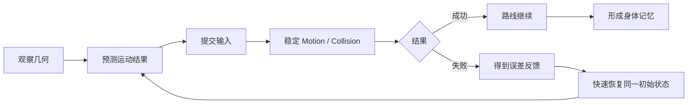

# 运动可信度：精密平台跳跃的输入宽容、可达包络与快速重试

> 系列：游戏系统的共同语言
>
> 日期：2026-08-26
>
> 状态：草稿
>
> 核心问题：精密平台跳跃怎样在保持高执行要求的同时，让玩家确信每一次成功和失败都来自可以理解、学习和重复的运动规则？
>
> 关键词：Precision Platformer、Movement、Jump Buffer、Coyote Time、Reachability、Fast Retry

[系列目录](../blog.html)

玩家站在平台边缘。

他明确按下了跳跃。

角色却没有跳。

原因可能非常“正确”：

```text
这一帧碰撞体
已经离开平台边缘 2 像素。
```

下一次，他稍微提前一点按跳。

这次输入又发生在落地前一帧，于是系统判断：

```text
当前不是 Grounded
→
跳跃无效。
```

再下一次，玩家终于起跳成功。

头部却只差一点点碰到平台角落，垂直速度被整个清零。

角色掉进尖刺。

死亡以后播放几秒动画。

重新加载房间。

玩家再跑二十秒回到刚才的位置。

从规则实现的角度看，这些判定可能全部没有 Bug。

从玩家体验看，问题却已经非常严重：

> 他无法建立“我做什么，会得到什么结果”的稳定预测。

而精密平台跳跃一旦失去这种预测能力，再高明的关卡设计也很难真正成立。

## 先说结论：高难度首先需要运动可信度

**运动可信度（即“我相信角色会按我学会的规则运动”）**：在相同规则版本、相近初始状态和相同输入条件下，角色能够稳定地产生可预测结果，并把玩家明确的操作意图与系统采样、碰撞和视觉误差区分开。

精密平台跳跃真正依赖的并不是：

```text
输入窗口越窄越难
=
游戏越硬核。
```

更接近：

```text
运动规则稳定
+
输入意图可解释
+
空间边界可学习
+
失败反馈足够快
=
高难度可以被训练。
```

整个类型可以先压缩成一条学习链：



这里最重要的不是“死亡很多”。

而是：

> 每一次死亡是否都能成为下一次操作的有效信息。

## 精密平台的成长首先发生在玩家本人

传统角色扮演游戏的成长容易被系统直接记录：

```text
Level 12
→
Level 13

Attack 42
→
Attack 47。
```

精密平台跳跃完全可以从头到尾没有这些数值。

角色的：

- 最大速度；
- 跳跃高度；
- 重力；
- 空中控制；

甚至可能整个游戏保持不变。

但玩家对它们的内部预测会越来越准确。

最开始，玩家可能只是：

```text
这里应该能跳过去。
```

几次失败以后，他开始理解：

```text
需要从平台后三分之一开始加速。
```

继续练习以后，他甚至不再显式计算：

```text
起跳
→
按住
→
松开
→
空中左修
→
落地。
```

动作已经进入身体记忆。

**身体技能循环（即“不是角色升级，而是玩家越来越会用同一个角色”）**因此成为这一类型真正的成长系统。

这也是为什么运动规则不能不断偷偷变化。

玩家学习的对象必须足够稳定。

## Movement Controller 优先追求可预测性，而不是物理真实性

真实世界中的跳跃可以涉及：

- 摩擦；
- 动量；
- 接触面；
- 刚体旋转；
- 连续碰撞；
- 复杂重力；
- 物理求解误差。

但精密平台真正关心的问题不是：

> 这是不是最真实的人类运动模型？

而是：

> 玩家能不能准确预测下一秒角色会在哪里？

因此很多作品更适合使用明确的 Kinematic / Character Motor 规则，而不是把全部行为交给通用 Rigidbody。

例如：

```text
GroundAcceleration
GroundDeceleration
AirAcceleration
MaximumAirSpeed
GravityUp
GravityDown
JumpInitialVelocity
JumpCutMultiplier
MaximumFallSpeed
```

都可以成为显式 Gameplay Rule。

## 上升和下降使用不同重力并不是物理错误

现实抛物线通常使用同一套重力。

平台跳跃可以故意：

```text
上升阶段
→
较低 Gravity

下降阶段
→
较高 Gravity。
```

效果是：

- 起跳阶段更容易控制；
- Apex 更容易阅读；
- 落地更迅速；
- 动作节奏更紧凑。

这属于：

**游戏运动规则（即“角色服务于操作，而不是模拟真实人体”）**。

类似地，空中控制也没有唯一正确值。

高 Air Control：

```text
允许玩家在空中大量修正
```

会把难度更多放到空中执行。

低 Air Control：

```text
起跳前速度决定更多结果
```

则把难度更多放到动量规划。

两种设计都可以成立。

真正不能接受的是：

> 关卡按照一种运动模型设计，角色却运行另一种运动模型。

## 状态语义不能只从速度符号临时猜

一个平台角色通常需要区分：

```text
Grounded
Rising
Falling
WallSliding
Dashing
Climbing
Knockback
Disabled。
```

如果所有逻辑都依赖：

```text
velocity.y > 0
```

临时推断状态，很快就会遇到：

- Moving Platform；
- Wall Slide；
- Dash；
- Knockback；
- Ground Snap；

等无法解释的组合。

因此：

**运动状态（即“角色现在遵守哪一套运动规则”）**应该成为正式状态，而不是由某个单一速度分量隐式推导。

动画、音效和镜头再从 Motion State 读取表现。

方向应该是：

```text
Input
→
Motion
→
Collision
→
Result
→
Animation / FX。
```

而不是：

```text
动画播到第 5 帧
→
角色获得向上速度。
```

## 高难度不等于拒绝所有输入误差

这是精密平台中最值得单独讨论的误区。

玩家在落地前 60ms 按下 Jump。

他的意图非常明确：

> 落地以后立刻再次跳。

如果系统只检查：

```text
当前 Simulation Tick
IsGrounded == true ?
```

那么这个输入会直接消失。

从程序角度看：

```text
规则严格。
```

从玩家角度看：

```text
角色不听话。
```

解决这一问题的典型机制是 Jump Buffer。

## Jump Buffer 处理“按得稍微早了一点”

**Jump Buffer（即“先记住这次跳跃意图，稍后条件成立就消费”）**：玩家提交 Jump Press 后，在短时间内保留请求；如果角色随后进入合法跳跃状态，则自动消费这次已经存在的输入。

例如：

```text
Buffer = 100ms

玩家在落地前 60ms
按 Jump

60ms 后 Grounded
→
消费 Jump Request
→
正常起跳。
```

它没有替玩家选择：

```text
应该在哪里跳。
```

玩家仍然必须主动按 Jump。

系统只是在说：

> 我知道你刚才是在要求“下一次合法时机立刻跳”。

这就是输入解释和自动游戏之间的边界。

## Coyote Time 处理“按得稍微晚了一点”

另一种误差发生在平台边缘。

玩家视觉上仍然认为角色站在平台上。

但碰撞体在这一帧已经离开边缘。

随后玩家按 Jump。

严格系统会判断：

```text
Not Grounded
→
Reject。
```

但人类视觉对离散碰撞边界没有像素级、毫秒级感知。

因此可以使用：

**Coyote Time（即“刚离开地面的一小段时间仍然认可普通跳跃意图”）**：记录最近一次 Grounded 时刻，在非常短的 Grace Period 内继续允许一次普通 Jump。

它的职责不是：

```text
凭空赠送二段跳。
```

而是弥合：

```text
视觉上仍然在边缘
```

和：

```text
碰撞体已经离开边缘
```

之间的小范围时间差。

## Jump Buffer 与 Coyote Time 共同形成 Intent Window

玩家最常见的两种时序误差正好相反：

```text
太早按
→
Jump Buffer

太晚按
→
Coyote Time。
```

两者共同建立：

**意图宽容窗口（即“动作要求仍然精确，但系统不会因为几帧采样差异误解你”）**。

这里需要强调：

```text
宽容输入
≠
降低空间要求。
```

平台仍然可以很小。

落点仍然可以很窄。

路线仍然可以要求墙跳、短跳、冲刺和动量保持。

被消除的只是：

```text
我明明已经表达 Jump 意图
但系统完全没有执行 Jump。
```

这种失败很难形成有价值的技能学习。

## 输入宽容的边界是“修正意图解释”，不是“替玩家解决路线”

同类机制还可以包括：

- Corner Correction；
- Ledge Correction；
- Wall Jump Grace；
- One-Way Platform Grace；
- Ground Snap。

它们都应该遵守同一条原则：

> 系统可以修正离散采样和碰撞边缘误差，但不能替玩家完成宏观路线决策。

例如 Corner Correction。

玩家向上跳时，头部只差 2 像素碰到平台角。

严格碰撞可能立即：

```text
VelocityY = 0。
```

有限 Correction 可以尝试向旁边移动 2 像素，让角色进入视觉上合理的空隙。

但如果 Correction 可以自动移动几十像素：

```text
角色就开始主动绕障碍。
```

此时宽容机制已经变成辅助导航。

高难度真正需要的不是“零宽容”。

而是：

> 宽容范围足够小，只解决系统误解，不解决玩家的路线问题。

## Variable Jump Height 用一个按钮制造连续控制空间

Jump 不一定只是：

```text
按下
→
固定跳跃。
```

通过 Jump Cut：

```text
上升阶段仍按住
→
保留完整上升

提前松开
→
削减 Vertical Velocity
→
形成短跳。
```

同一个 Jump Button 于是同时表达两个决定：

```text
什么时候起跳
+
什么时候结束完整上升。
```

一个输入按钮因此形成连续操作空间。

这比不断增加新动作按钮更符合精密平台的核心：

> 少量稳定运动原语，通过时序组合产生深度。

## 运动包络才是关卡真正的尺度

角色从一个平台边缘起跳以后，并不是只能得到一条固定轨迹。

不同：

- 起跳水平速度；
- Jump Hold；
- Jump Release；
- Air Input；

会形成一个二维可达区域。

**可达运动包络（即“从这里出发，这套运动规则真正允许角色到达哪里”）**：在给定 Movement Profile 与初始状态下，由合法输入组合形成的空间可达集合。

可以想象成：

```text
平台边缘
     │
     │     稳定可达区域
     │   ██████████
     │ █████████████
─────┼────────────────
```

它比：

```text
MaximumJumpDistance = 5m
```

更接近真实关卡能力。

因为同一个“最大跳距”无法表达：

- 短跳；
- 高跳；
- 移动起跳；
- 空中修正；
- Wall Jump；
- Dash。

## 关卡不应该依赖“设计师目测应该跳得过去”

当角色 Movement Profile 已经明确以后，编辑器完全可以离线计算：

- 最大水平距离；
- 最大垂直距离；
- Short Jump 最低高度；
- Full Jump Apex；
- Air Correction Range；
- Wall Jump Reach；
- Dash Reach。

然后直接在关卡编辑器中绘制：

**Reachability Overlay（即“把角色理论可达空间直接画在关卡上”）**。

例如：

```text
绿色
→
稳定可达

黄色
→
需要接近极限输入

红色
→
当前 Movement Profile 不可达。
```

这会把平台设计从：

```text
感觉这里差不多。
```

升级成：

```text
这里的难度落在哪个运动余量区间？
```

## Movement Profile 本身就是 Level Contract

如果：

```text
JumpInitialVelocity +5%
```

游戏里数百个房间的：

- 跳跃边；
- 天花板；
- 尖刺；
- 隐藏路线；

都可能改变。

因此核心 Movement Profile 不是普通 Balance Number。

**运动关卡合同（即“角色手感参数同时定义了整个关卡的合法几何”）**意味着内容生产进入稳定阶段以后，运动参数应该逐渐冻结。

如果必须调整：

```text
自动重新运行
Reachability Regression Test。
```

否则一次看起来很小的“手感优化”可能同时：

- 打开原本不可达的捷径；
- 让关键平台变得过易；
- 让低天花板路线彻底失效；
- 破坏旧 Replay。

平台手感和关卡几何其实属于同一个合同。

## 新运动能力会重写可达包络

Dash 加入以后，关卡不再只有：

```text
Jump Envelope。
```

而是：

```text
Jump
→
Dash
```

组成新的 Reachability Envelope。

Wall Jump、Climb、Bounce、Grapple 也是一样。

这里和银河城存在明显联系，但两者关注层级不同。

银河城关心：

```text
拥有 Dash
→
哪些世界连接现在获得通行权限？
```

精密平台首先关心：

```text
Dash 到底怎样改变局部空间里的合法轨迹？
```

只有先回答第二个问题，第一层世界拓扑才有可信基础。

## 关卡更像运动句法，而不是平台集合

平台、墙、尖刺本身只是原语。

真正的挑战来自组合。

例如一个短 Section 可以写成：

```text
Run
→
Jump
→
Short Hold
→
Wall Slide
→
Wall Jump
→
Jump Cut
→
Dash
→
Land。
```

**运动句法（即“关卡用空间组织一串需要执行的动作关系”）**让关卡设计可以被理解成：

- Introduce；
- Validate；
- Combine；
- Twist；
- Mastery。

先安全展示一个新原语。

再要求正确使用。

随后和旧能力组合。

最后放进长路线中要求稳定掌握。

这也是为什么精密平台往往不需要大段文字教程。

几何本身就可以成为教学语言。

## 可站立、危险和背景必须一眼可读

高难关卡最不应该依赖：

```text
仔细看美术边缘
猜这里到底有没有碰撞。
```

玩家必须快速知道：

- 哪里能站；
- 哪里会死；
- 哪里能墙跳；
- 哪里只是背景。

这可以称为：

**碰撞语义可读性（即“美术首先要让玩家看懂规则边界”）**。

角色视觉边界和真实 Collision Bounds 也可以分开。

头发、披风和手臂不应该自动扩大受击区域。

尖刺的实际危险体也可以略小于视觉。

但这种差异必须保持在玩家仍能形成稳定直觉的范围内。

如果角色身体已经明显穿进半根尖刺却仍然不死，同样会破坏规则信任。

## 碰撞解算本身就是核心玩法

很多所谓“手感问题”并不是：

```text
Acceleration 调得不对。
```

而是：

- 角落卡住；
- Grounded 闪烁；
- 下坡抖动；
- 高速穿墙；
- Moving Platform 把角色甩飞；
- One-Way Platform 状态残留。

因此 Collision Motor 不能被当成普通引擎底层细节。

它直接决定玩家能不能建立运动预测。

## 高速运动需要 Sweep，而不是到终点再检查 Overlap

如果每个 Tick 只是：

```text
Position += Velocity * dt
```

随后才检查是否进入墙体，

高速 Dash 很容易从墙的一侧直接跨到另一侧。

更稳定的做法是：

```text
根据 Motion Delta
做 Shape Sweep
→
找到最近 Contact
→
移动到 Contact
→
分解剩余位移
→
继续求解。
```

即使角色数量只有一个，

Continuous Collision 也比“碰撞后再纠错”更符合这一类型对稳定性的要求。

## Grounded 也不能只依赖刚好发生一次底部碰撞

角色沿轻微下坡移动时，如果每个 Tick 都要求：

```text
这一帧必须重新撞到底面
```

Grounded 很容易：

```text
true
false
true
false。
```

结果会影响：

- Jump；
- Animation；
- Coyote；
- Wall State。

因此可以使用 Ground Probe 与 Ground Snap。

**Ground Snap（即“只要仍然合理贴近可站立地面，就保持稳定地面关系”）**用于吸收小范围离散几何差异。

它服务的仍然是规则稳定，而不是自动移动。

## Moving Platform 是参考系问题，不只是 Parenting

最简单的移动平台实现是：

```text
Player
成为 Platform Child。
```

这很容易引入：

- Scale；
- Rotation；
- Transform 顺序；
- Physics 顺序；

问题。

更明确的模型是记录：

```text
GroundEntityId
PreviousPlatformTransform
CurrentPlatformTransform。
```

每个 Tick：

```text
先应用 Platform Delta
→
再处理 Player 自己的 Motion。
```

玩家跳离平台时，还需要显式决定：

```text
是否继承平台水平 / 垂直速度。
```

这不是普通 Transform 关系。

它是一条 Gameplay Motion Rule。

## 高难度成立的另一半，是失败必须非常便宜

假设一个房间预期需要玩家：

```text
尝试 20 次。
```

每次失败以后：

```text
死亡动画 5 秒
Loading 10 秒
重新跑回难点 1 分钟。
```

玩家实际上没有在练习跳跃。

他主要在练习等待。

因此：

**快速失败恢复（即“犯错以后尽快回到可以再次学习的位置”）**是精密平台能够承受高失败频率的关键机制。

典型失败链更接近：

```text
Hazard
→
极短 Hit Stop / Death Feedback
→
恢复 Checkpoint Snapshot
→
重新获得 Input。
```

原始设计甚至可以把：

```text
失败
→
重新可控制
```

压缩到几百毫秒量级。

具体时间当然取决于作品。

核心原则是：

> 重试时间必须显著短于一次有效尝试本身。

## Checkpoint 保存的不只是 Spawn Position

失败后如果只恢复：

```text
Player.Position
```

环境可能已经和第一次尝试不同。

例如：

- Moving Platform 相位变了；
- Dash Charge 不同；
- 开关状态不同；
- Timer 没有重置；
- Collectible 状态不同。

玩家下一次面对的就不再是同一个问题。

因此更完整的是：

**确定性区段快照（即“失败以后把当前训练题恢复成同一道题”）**。

进入 Section 时保存：

```text
Player State
Moving Platform Phase
Ability State
Switch State
Collectible Policy
Timer State。
```

失败以后恢复同一初始条件。

这样玩家才能真正比较：

```text
上一次晚了多少
这一次提前了多少。
```

## 快速重试把死亡转化成误差测量

普通惩罚型死亡可能意味着：

```text
损失资产
失去进度
长距离重跑。
```

精密平台中的失败更适合被理解为：

**控制误差反馈（即“这一跳差在哪里”）**。

例如：

```text
第一次
落点差 30 像素

第二次
差 10 像素

第三次
成功。
```

系统真正提供的是一个非常短的反馈循环：

```text
输入
→
结果
→
误差
→
再次输入。
```

如果中间夹着大量非训练时间，

玩家很难建立动作记忆。

## 难度和重试速度是同一套设计

因此不能单独说：

```text
这个房间很难
```

却不讨论：

```text
失败以后多久能再试。
```

两段拥有完全相同操作要求的关卡：

```text
A
失败后 0.3 秒重试

B
失败后 30 秒回到难点
```

实际心理难度完全不同。

高失败率本身不一定是问题。

高失败率乘以高失败成本，才很容易变成挫败。

## Attempt Analytics 应该分析学习曲线，而不只是死亡数

既然失败是一种训练信息，就可以进一步记录：

```text
AttemptId
SectionId
DeathPosition
DeathCause
InputTimeline
MaximumProgress
CompletionTime。
```

然后统计：

- Median Attempts；
- P95 Attempts；
- Death Heatmap；
- Failure Cause；
- Completion Time Distribution。

如果一个房间：

```text
90% 死亡集中在同一个角落，
```

可能说明：

```text
这是预期难点。
```

也可能说明：

- 视觉误导；
- Corner Collision 不合理；
- 输入窗口过窄；
- Camera 没有提前展示危险。

Telemetry 的价值不是：

> 自动判断关卡好坏。

而是帮助设计者区分：

```text
玩家正在学习挑战
```

和：

```text
系统在反复制造同一种误解。
```

## 输入采样不能完全绑定固定逻辑 Tick

假设：

```text
Render = 144Hz
Simulation = 60Hz。
```

玩家的一次非常短 Jump Press 可能完整发生在两个 Simulation Tick 之间。

如果系统只在 Fixed Tick 时读取：

```text
Button Is Down?
```

这次输入可能从未被逻辑层看见。

因此：

**输入事件缓冲（即“设备事件先被记录，逻辑 Tick 再按时间顺序消费”）**应该和 Simulation Tick 分开。

例如 Input Frame 保存：

```text
Timestamp
Sequence
Horizontal
JumpPressed
JumpReleased
DashPressed。
```

Simulation 每次推进时，消费自上次 Tick 以来的所有事件。

这样：

```text
高刷新显示
```

只增加表现采样。

不会改变规则。

## Press 与 Held 必须分开

Jump Press：

```text
只发生一次。
```

Jump Held：

```text
可以跨多个 Tick 持续。
```

如果两者混成一个：

```text
Jump = true，
```

系统就很难同时正确实现：

- Jump Buffer；
- Variable Jump；
- Replay；
- Input Sampling。

输入层应先忠实记录：

```text
发生了什么。
```

运动层再解释：

```text
这意味着什么动作。
```

## 精密平台天然适合 Deterministic Replay

如果一个平台游戏真的相信自己的运动规则，

那么一个非常高标准的验收测试就是：

```text
相同 Section Snapshot
+
相同 Movement Profile
+
相同 Input Frames
=
相同 Player Path。
```

**运动确定性回放（即“同一道题、同一串输入，应得到同一条轨迹”）**可以同时服务：

- Replay；
- Ghost；
- Speedrun；
- Debug；
- 自动测试。

Replay 还必须绑定：

```text
MovementProfileVersion。
```

否则版本更新以后：

```text
Gravity 变了
→
旧 Input Replay
自然跑出完全不同轨迹。
```

这不是 Replay 系统坏了。

而是规则版本已经变化。

## State Hash 可以定位第一处轨迹分歧

每隔若干 Tick 记录：

```text
Position
Velocity
MovementState
ContactState。
```

两次 Replay 如果最终位置不同，

不需要从整场录像猜原因。

可以找到：

```text
第一个 State Hash 不一致的 Tick。
```

这非常适合排查：

- dt 依赖；
- Collision 顺序；
- Moving Platform；
- Input Consumption；
- Corner Correction。

精密平台的实体数量不大。

真正珍贵的是规则可复现性。

## 摄像机也是 Gameplay 信息系统

玩家能不能完成一跳，不只取决于角色。

还取决于：

> 玩家能不能提前看到自己要落在哪里。

如果 Camera：

- 滞后太多；
- 过度追随 Input；
- 垂直跳跃时太早离开脚下平台；
- Dash 时没有合理 Look Ahead；

操作难度会被镜头系统偷偷抬高。

因此 Camera 应消费 Motion State。

例如根据：

- Velocity；
- Facing；
- Stable Intent；

产生 Look Ahead。

它不能反过来改变 Collision 或逻辑坐标。

高难度应该来自路线。

不应该来自摄像机不给信息。

## 表现必须追随 Motion，而不能定义 Motion

这和权威时间源文章中的原则高度一致：

```text
逻辑决定结果
表现展示结果。
```

例如：

```text
Jump Animation 第 5 帧
→
施加 Jump Impulse
```

会让：

```text
动画资源长度
```

直接改变运动手感。

更合理的是：

```text
PlayerMotor
决定 Jump 已经发生

Animation
读取 JumpState
→
播放表现。
```

角色提前落地时，即使 Jump Animation 尚未完整播放，也应该快速转入 Grounded 表现。

动画完整性不能优先于操作状态。

## Assist Mode 最好继续使用同一套 Movement Core

精密平台非常适合辅助模式，例如：

- 降低 Simulation Speed；
- 增加 Dash；
- 扩大 Coyote；
- 扩大 Jump Buffer；
- 降低 Hazard；
- Invulnerability。

但最好不要：

```text
普通模式
一套 Controller

辅助模式
另一套 Controller。
```

**参数化辅助（即“降低执行压力，但仍然运行同一套运动规则”）**可以让同一关卡在不同参数下运行。

例如：

```text
Simulation Speed = 80%。
```

玩家获得更多现实反应时间。

游戏内部运动关系仍然保持相同。

辅助由此改变的是：

```text
人类能够多容易执行规则。
```

而不是偷偷换了一款游戏。

## 宽容和辅助都必须保持语义透明

这里也存在反例。

如果 Coyote Time 变得过长：

```text
玩家明显已经离开平台很远
仍然可以起跳，
```

它就不再是在解释感知误差。

如果 Corner Correction 可以移动半个角色宽度：

```text
系统正在自动绕开障碍。
```

如果 Assist Mode 在后台偷偷改变关卡碰撞，却没有告诉玩家：

```text
玩家也无法再形成稳定规则模型。
```

所以“更友好”仍然需要可解释边界。

## Speedrun 是稳定规则自然产生的第二层玩法

普通玩家的目标：

```text
通过。
```

高手开始优化：

- 起跳位置；
- 速度保持；
- 路线长度；
- 多余停顿；
- 动量损失。

如果基础运动规则足够稳定，这些高级技巧不一定需要设计成新的：

```text
Speedrun Skill System。
```

例如：

```text
更靠近边缘起跳
→
自然获得更远水平位移。
```

只要结果稳定，玩家会自己发现。

这就是：

**执行优化（即“系统没有新增规则，玩家开始把已有规则用得更极致”）**。

这种深度通常比不停增加新按钮更持久。

## 什么时候不应该照搬这些设计

这套范式并不适用于所有带 Jump 的游戏。

### 普通动作 RPG

如果跳跃只是：

```text
跨过小障碍
偶尔走平台路线，
```

并不一定需要完整 Reachability Tool、Replay Determinism 和 100ms 级 Intent Window 设计。

### 高动量物理平台游戏

如果游戏核心乐趣本来就是：

- Rigidbody；
- 摇摆；
- 不确定碰撞；
- 物理涌现；

过度 Kinematic 化反而可能删除类型特色。

### 故意使用混沌空间的游戏

如果关卡挑战来自：

```text
不断变化的环境
随机移动平台
物理物体互动，
```

失败后恢复完全相同 Snapshot 也不一定合适。

值得迁移的不是具体参数。

而是：

> 难度必须建立在玩家可以学习的规则上。

即使规则本身包含随机，它也要让玩家理解随机属于哪里。

## 常见设计失败

### 把物理真实性放在运动可预测性之前

角色每次接触角落都产生稍有不同的结果。

玩家无法建立稳定轨迹模型。

### Jump 只在当前 Grounded Tick 接受

稍早或稍晚的明确玩家意图被系统直接丢弃。

### Coyote Time 和 Jump Buffer 无限扩张

宽容机制开始替玩家解决真正路线要求。

### Jump、Dash 等参数频繁调整，却不重测关卡

Movement Profile 与 Level Geometry 合同发生漂移。

### 关卡只靠设计师目测可达性

极限路线在角色参数调整后大量失效。

### 碰撞体完全跟随视觉轮廓

头发、披风和美术尖角产生无法学习的判定。

### 高速 Dash 只检查终点 Overlap

角色随机穿过薄墙。

### Grounded 只依赖瞬时碰撞

下坡和 Tile Seam 让 Ground State 反复闪烁。

### Moving Platform 只靠 Parenting

参考系、速度继承和碰撞顺序变得不可解释。

### 失败后只恢复玩家位置

平台相位和房间状态改变，玩家每次实际上面对不同题目。

### 高难关卡同时拥有高重试成本

玩家大部分时间都消耗在等待和跑图，而不是学习。

### 固定逻辑 Tick 直接读取当前设备按键状态

短输入在不同渲染刷新率下被丢失。

### 动画事件驱动运动事实

替换表现资源就改变 Gameplay。

### 辅助模式维护第二套 Controller

普通和辅助模式长期出现碰撞与规则漂移。

### Telemetry 只统计总死亡次数

无法区分预期训练难点和系统性误解点。

## 我的精密平台运动检查表

1. 相同 Movement Profile 与相同输入是否能够得到稳定轨迹？
2. Movement Controller 是否优先服务可预测性，而不是无条件追求真实物理？
3. Grounded、Rising、Falling、WallSlide、Dash 是否拥有明确状态语义？
4. Input Sampling 是否独立于固定 Simulation Tick？
5. Press、Release 与 Held 是否分别记录？
6. Jump Press 是否可以进入短期 Buffer？
7. Coyote Time 是否只修正平台边缘的感知误差？
8. Jump Buffer 和 Coyote 是否共同形成可解释 Intent Window？
9. 宽容机制是否没有替玩家完成真正路线问题？
10. Variable Jump 是否允许玩家控制起跳和释放两个时机？
11. Ground / Air Acceleration 是否拥有明确差异？
12. Air Control 是否符合关卡真正要求的运动风格？
13. Movement Profile 是否是单一事实源？
14. 是否能够计算 Jump / Dash / Wall Jump Reachability Envelope？
15. 关卡编辑器是否能够显示稳定可达、极限可达和不可达区域？
16. Movement Profile 修改以后是否自动运行 Reachability Regression？
17. Character Visual Bounds 与 Collision Bounds 是否分离？
18. 高速运动是否使用 Sweep / Continuous Collision？
19. Ground Probe / Ground Snap 是否避免离散地面闪烁？
20. Corner Correction 是否有严格的小范围阈值？
21. Moving Platform 是否使用明确参考系和速度继承规则？
22. One-Way Platform 是否拥有独立碰撞语义？
23. Wall Jump / Dash 是否明确修改 Reachability，而不是只作为视觉技能？
24. 新运动能力加入以后是否重新验证旧关卡？
25. 关卡是否按照 Introduce → Validate → Combine → Twist → Mastery 逐步组合原语？
26. 安全表面、危险表面和背景是否具有清楚视觉语义？
27. 失败到重新获得控制权的时间是否足够短？
28. Checkpoint 是否恢复完整 Section Snapshot，而不仅是玩家位置？
29. Moving Platform、Ability、Timer 等状态是否拥有确定重置规则？
30. 同一失败以后玩家是否能够立即再次测试修改后的输入？
31. Attempt Analytics 是否记录 Death Position、Cause 和 Input Timeline？
32. Death Heatmap 是否能够帮助区分关卡难点与碰撞/视觉问题？
33. Camera 是否提前提供下一段落点所需信息？
34. Animation / FX 是否只消费 Motion Result？
35. Assist Mode 是否仍然使用同一套 Movement Core？
36. Replay 是否绑定 MovementProfileVersion？
37. 相同 Snapshot + Input 是否能通过 Deterministic Replay Test？
38. State Hash 是否能够定位第一处分歧？
39. 30 / 60 / 144 FPS 下相同输入是否产生一致逻辑轨迹？
40. 当前的高难度究竟来自玩家执行要求，还是来自系统不稳定和信息不足？

精密平台跳跃最容易被看见的是：

```text
小平台
尖刺
高死亡率
快速角色。
```

但这些都不是类型真正成立的前提。

真正的基础是玩家逐渐形成一种非常强的信任：

```text
我知道这个角色能跳多远。

我知道什么时候松开会变成短跳。

我知道刚刚失败是因为晚了一点。

我知道下一次提前一点就可能成功。
```

系统可以很严格。

关卡可以很困难。

路线可以要求极高执行水平。

但这一切都建立在同一个前提上：

> **玩家相信自己正在学习一套稳定规则，而不是不断适应系统偶然给出的结果。**

Jump Buffer、Coyote Time 和 Corner Correction 并没有削弱这件事。

它们反而是在清理噪声。

Reachability Envelope 让关卡真正按照角色能力设计。

Deterministic Snapshot 让每次尝试面对同一道题。

Fast Retry 让失败变成一次高频误差测量。

最终，角色的数值可能从未成长。

真正成长的是玩家自己的预测模型。

这也是精密平台跳跃最纯粹的成长形式之一：

> **系统保持稳定，玩家逐渐变得更准确。**

## 术语对照

| 正式术语 | 文中通俗称呼 |
|---|---|
| 运动可信度 | 我相信角色会按我学会的规则运动 |
| 身体技能循环 | 不是角色升级，而是玩家越来越会用同一个角色 |
| 游戏运动规则 | 角色服务于操作，而不是模拟真实人体 |
| 运动状态 | 角色现在遵守哪一套运动规则 |
| Jump Buffer | 先记住这次跳跃意图，稍后条件成立就消费 |
| Coyote Time | 刚离开地面的一小段时间仍然认可普通跳跃意图 |
| 意图宽容窗口 | 动作要求仍然精确，但系统不会因为几帧采样差异误解你 |
| 可达运动包络 | 从这里出发，这套运动规则真正允许角色到达哪里 |
| Reachability Overlay | 把角色理论可达空间直接画在关卡上 |
| 运动关卡合同 | 角色手感参数同时定义了整个关卡的合法几何 |
| 运动句法 | 关卡用空间组织一串需要执行的动作关系 |
| 碰撞语义可读性 | 美术首先要让玩家看懂规则边界 |
| Ground Snap | 只要仍然合理贴近可站立地面，就保持稳定地面关系 |
| 快速失败恢复 | 犯错以后尽快回到可以再次学习的位置 |
| 确定性区段快照 | 失败以后把当前训练题恢复成同一道题 |
| 控制误差反馈 | 这一跳差在哪里 |
| 输入事件缓冲 | 设备事件先被记录，逻辑 Tick 再按时间顺序消费 |
| 运动确定性回放 | 同一道题、同一串输入，应得到同一条轨迹 |
| 参数化辅助 | 降低执行压力，但仍然运行同一套运动规则 |
| 执行优化 | 系统没有新增规则，玩家开始把已有规则用得更极致 |

---

## 内部资料依据

本文主要基于以下材料整理：

- `game-designs/精密平台跳跃游戏设计范式.md`
- `game-designs/README.md`
- `blogs/游戏系统的共同语言/03-音游格斗与竞速的权威时间源.md`
- `blogs/游戏系统的共同语言/04-世界拓扑与能力门控.md`
- `blogs/README.md`
- `blogs/publication.v1.json`

本文是对精密平台跳跃 / Precision Platformer 设计范式的个人综述。

文中的 Jump Buffer、Coyote Time、Corner Correction、Ground Snap、Variable Jump、Reachability Envelope、Deterministic Section Snapshot 和 Assist Profile 属于常见或推荐的设计工具，并不表示所有高难平台游戏都必须采用完全相同的毫秒窗口、运动参数、碰撞修正规则或检查点结构。

尤其需要注意：

- “Movement Controller 优先追求可预测性”不等于通用 Rigidbody 或物理模拟一定不适合平台游戏；如果物理涌现本身就是核心乐趣，设计目标会不同。
- “输入宽容不会降低难度”成立的前提是宽容只修补意图解释误差，而不是主动完成关卡路线。
- “确定性重试”是身体技能学习非常有效的结构，但如果环境变化和随机性本身就是正式挑战，则无需强制所有尝试完全相同。
- “运动包络是 Level Contract”是一种内容生产和验证模型，不意味着关卡必须完全由自动工具生成。
- 文中的 Replay Determinism 属于高标准工程目标；不同引擎、物理后端或跨平台浮点实现可能需要先明确自身真正承诺的确定性边界。
