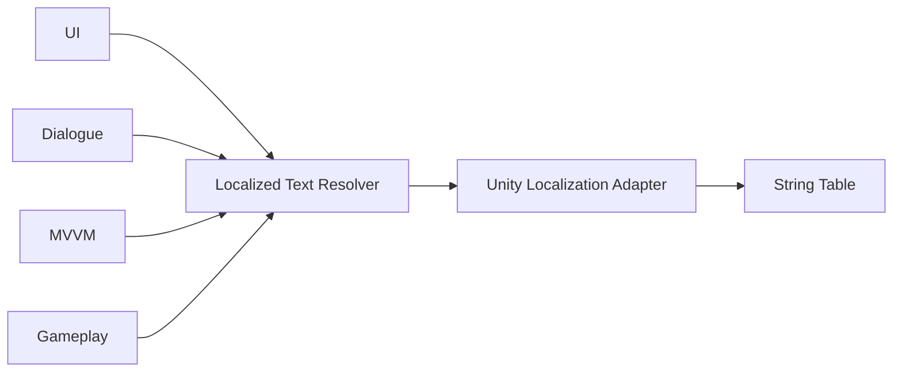
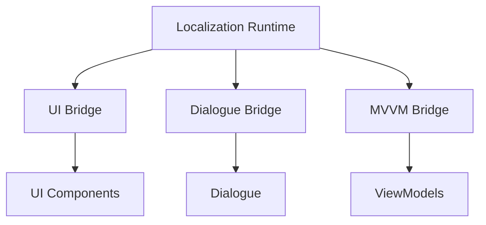
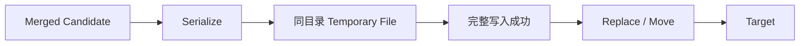
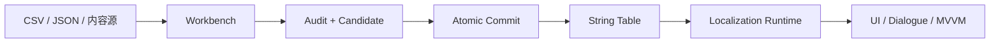

# 本地化文本生命周期：Resolver 所有权、语言状态与原子表写入

> 系列：Sakura Framework 工程实践
>
> 日期：2026-08-07
>
> 状态：可发布候选
>
> 核心问题：Unity 本地化系统如何从一次字符串查询扩展为覆盖 Resolver 所有权、Fallback、偏好状态、跨模块 Bridge、诊断以及安全表写入的完整生命周期？

[系列目录](../blog.html)

很多项目的本地化系统最初只有一个函数：

```text
GetText("button.confirm")
```

输入 Key，返回当前语言对应的字符串。

在功能较少时，这似乎已经足够。

但真实项目很快会遇到更多问题：

- Key 属于哪张 String Table；

- 当前 Locale 谁负责保存；

- Language 切换后现有 UI 如何得到新文本；

- Dialogue、UI 和 MVVM 是否各自直接访问 Unity Localization；

- Key 不存在时返回空字符串、默认文案还是 Key；

- Resolver 尚未初始化时如何表现；

- 测试结束后全局 Resolver 谁负责清理；

- CSV 导入失败时会不会把旧表覆盖一半；

- 多行文本和引号如何安全进入 CSV；

- JSON 出现非法 Unicode 或尾随数据时是否仍然接受；

- 编辑器工具预览的内容与最终写入内容是不是同一份数据。


当这些问题出现以后，“字符串查询函数”已经不足以描述本地化系统。

真正需要管理的是一条文本生命周期。

## 先说结论：本地化核心应该是 Resolver 合同，而不是全局数据库调用

**Localized Text Resolver（后文简称“文本解析器”）**：接收稳定的 Table、Key 和 Fallback 等请求信息，并返回解析结果的统一只读边界。

调用方不再直接依赖：

```text
UnityEngine.Localization.Settings
```

而是依赖：

```text
ILocalizedTextResolver
```

于是结构变为：



这样做并不是为了多包一层接口。

而是为了把几个职责从业务模块中拿出来：

- Locale 状态；

- 表选择；

- Fallback；

- Diagnostics；

- Unity API 适配；

- 生命周期所有权。


## Request 应表达完整查找意图

单独一个 Key 经常缺少足够上下文。

例如：

```text
confirm
```

它可能存在于：

```text
UI
Dialogue
Tutorial
System
```

因此更可靠的请求至少需要表达：

```text
Table
Key
Fallback
```

形成类似：

```text
LocalizedTextRequest(
    table = "Dialogue",
    key = "npc.guard.warning",
    fallback = "Stop!"
)
```

**本地化请求合同（后文简称“文本地址”）**：把一次翻译查询需要的身份和退化策略显式放入请求，而不是依赖全局隐藏状态。

未来如果需要增加：

- 参数；

- Plural；

- Gender；

- Format Culture；


也应继续围绕请求合同扩展，而不是让各业务模块分别实现。

## Fallback 是运行时合同的一部分

本地化失败并不罕见。

可能发生：

- Resolver 尚未安装；

- Table 不存在；

- Key 缺失；

- Locale 尚未加载；

- Adapter 抛出异常；

- 测试环境没有真实 Localization Asset。


业务层需要明确回答：

> 失败以后画面显示什么？

常见选择包括：

1. 返回空字符串；

2. 返回 Key；

3. 返回设计时默认文案；

4. 抛出异常。


不同场景适合不同策略。

例如对话系统可以使用：

```text
fallbackText = 原始剧情文案
```

开发工具则可能更适合直接显示 Key，让缺失内容更明显。

**显式 Fallback（后文简称“失败时显示什么”）**：Fallback 由 Request 或调用边界明确提供，而不是散落在各个 UI 脚本的 `try/catch` 中。

这使失败行为也可以被测试。

## Resolver 也需要 Owner

即使使用接口，如果 Resolver 最终被塞进一个永不清理的静态字段，生命周期问题仍然存在。

例如 PlayMode：

```text
Run A 安装 Resolver A
→ 退出
→ Run B 安装 Resolver B
→ Resolver A 的静态状态仍存在
```

或者两个系统同时认为自己拥有 Dialogue 的 Table：

```text
Feature A 安装 Dialogue Resolver
Feature B 再次覆盖
```

最终退出顺序稍有变化，就可能把仍在使用的 Resolver 清空。

因此需要：

**Resolver Owner Lease（后文简称“谁装的谁负责拆”）**：安装 Resolver 时获得唯一 Owner Token / Lease，只有对应 Owner 释放时才能撤销当前绑定。

典型生命周期：

```text
Install
→ 获得 Lease
→ 使用 Resolver
→ Owner Dispose
→ Release
```

这种模式与资源 Lease、Scope、事件 Subscription 的思想一致。

全局访问并不意味着全局状态没有 Owner。

## Bridge 的职责是把业务模块接到同一条文本管线

如果 UI、Dialogue 和 MVVM 各自调用 Unity Localization，系统虽然使用同一个插件，却已经形成多个本地化实现。

例如：

```text
UI        → Unity Localization
Dialogue  → Unity Localization
MVVM      → 自己的 Dictionary
Tutorial  → 硬编码 fallback
```

切换 Locale 或处理缺失 Key 时，它们可能产生不同结果。

更稳定的结构是：



Bridge 不应该复制翻译规则。

它只负责把所属模块的数据结构转换成统一 `LocalizedTextRequest`。

这样：

- Dialogue 不再伪装“已经本地化”后直接返回默认文案；

- UI 不需要知道 Unity String Database；

- MVVM 可以继续保持 ViewModel 与 Unity 资源系统解耦。


## Preferences 负责“用户选择”，Localization 负责“当前语言”

Locale 有两个相近但不同的问题：

```text
当前 Runtime 正在使用什么语言？
```

以及：

```text
用户希望下次启动时使用什么语言？
```

前者属于 Runtime 状态。

后者属于 Preferences。

把两者完全绑死，会让测试和临时语言预览变得困难。

因此更合理的关系是：

```text
Preferences
→ 读取用户语言偏好
→ Localization Owner 应用 Locale

用户切换语言
→ Runtime 更新
→ 成功后同步 Preferences
```

这使语言偏好可以：

- 使用内存 Store 测试；

- 使用项目持久化实现；

- 在没有 Preferences 包时由项目自行决定。


Localization Core 不需要因此持有具体存档系统。

## Diagnostics 应区分“成功 Fallback”和“正常命中”

假设 Key 缺失，但 Resolver 返回了 fallback。

从玩家角度看，界面没有崩溃。

从内容生产角度看，这仍然是一个需要修复的问题。

因此解析结果最好能够区分：

```text
Resolved
FallbackUsed
MissingKey
MissingTable
ResolverUnavailable
InvalidRequest
```

**本地化诊断（后文简称“这段文字从哪里来的”）**：除了最终 Text，还能解释本次结果是否真正来自目标 Locale/Table。

否则 fallback 会把内容缺失长期隐藏起来。

这对大型项目尤其重要。

如果所有错误都表现为“界面上还有字”，缺失翻译只能靠玩家人工发现。

## Editor Workbench 的 Preview 必须审计最终合并结果

本地化工具通常支持：

```text
现有表
+
导入 CSV / JSON
=
新表
```

一个容易出现的错误是，只审计“这次导入的数据”。

假设旧表里已经存在：

- 重复 Key；

- 缺少基准语言；

- 遗留非法项。


新导入内容本身完全正确。

如果工具只检查 incoming：

```text
Incoming Valid
→ 显示 Preview 通过
→ 合并后旧问题仍然存在
```

因此 Preview 应围绕：

```text
Current
+
Incoming
=
Merged
→ Audit
```

**合并态审计（后文简称“检查真正准备写进去的表”）**：预览报告检查最终 Candidate，而不是只检查新输入。

这与配置事务和热更新 Prepare 阶段是相同思想。

验证对象应该是即将提交的状态。

## 文件扩展名也是数据合同

如果用户导入的是：

```text
localization.csv
```

工具内部可以转成统一模型处理。

但最终写回时不能悄悄输出 JSON 内容，只因为内部序列化器更方便。

文件格式本身也是消费合同。

因此：

```text
.csv → CSV
.json → JSON
```

应该保持一致。

如果未来需要格式迁移，应明确创建新目标，而不是原地改变语义。

## CSV 不是按换行 Split 就能正确解析

本地化内容经常出现真正的多行文本：

```text
"Hello,
traveler."
```

同时还可能包含：

```text
"He said ""hello""."
```

因此 CSV Parser 必须正确处理：

- Quoted Cell；

- Cell 内换行；

- 双引号转义；

- CRLF / LF；

- 空字段；

- 分隔符。


用：

```text
Split('\n')
```

或者简单的逗号 Regex，迟早会破坏剧情文本。

本地化工具面对的是内容生产数据，而不是简单配置键值。

## JSON Parser 也应该严格拒绝异常输入

另一端的错误是 JSON 过度宽容。

例如：

```text
合法对象
后面还有垃圾字符
```

或者：

- 非法 Escape；

- 未转义控制字符；

- 错误 Unicode；

- 非法代理项。


如果 Import 工具仍然接受，最终文件可能在另一个 Parser、平台或 TMS 中失败。

因此输入阶段应该严格解析。

“尽量读出来”适合人工恢复工具。

不适合即将写回正式内容表的 Confirm 流程。

## Confirm 写入应该是原子提交

即使所有内容都已经验证，最后一步仍然可能失败：

- Editor 被终止；

- 磁盘空间不足；

- 进程异常；

- 写入中途崩溃。


直接：

```text
File.WriteAllText(target)
```

意味着旧文件会先被修改。

如果写入未完成，项目可能只剩一份损坏表。

**原子文件提交（后文简称“整份写好再换过去”）**：先在目标同目录生成完整临时文件，成功后再通过 replace / move 切换为正式文件。



同目录非常重要。

跨文件系统 Move 不一定具备相同原子语义。

成功或失败后，Temporary File 都应被清理。

## UTF-8 细节也属于确定性输出

文本工具还应固定：

- UTF-8；

- 是否 BOM；

- 换行策略；

- Serializer 顺序；

- Quote 规则。


否则不同机器可能产生语义相同、字节不同的文件。

这会制造：

- Git Diff 噪声；

- Hash 漂移；

- Evidence 不一致；

- 不必要的冲突。


对于经常由策划、翻译和自动化共同修改的本地化文件，确定性格式尤其重要。

## Runtime 与 Workbench 最终应该共享同一内容事实

成熟的本地化流水线应该逐渐形成：



当前阶段最重要的是把两端各自的合同建立清楚：

运行时：

- Resolver；

- Owner；

- Fallback；

- Preferences；

- Diagnostics；

- Bridge。


编辑器：

- Parse；

- Merge；

- Audit；

- Preview；

- Confirm；

- Atomic Write。


等这两边稳定之后，再考虑：

- Asset Table；

- 远程语言包；

- TMS；

- AI 翻译；


会更安全。

## 我的判断

本地化最容易被低估为一种数据查询功能：

```text
Key → String
```

但真正的工程结构更接近：

```text
内容生产
→ 校验
→ 原子提交
→ Runtime Owner
→ Locale
→ Resolver
→ Bridge
→ UI / Dialogue / MVVM
→ Diagnostics
```

当这条链路完整以后，换语言才不只是“调用 Unity Localization 的一个 API”。

它成为一个拥有输入、状态、所有权、失败策略和调试能力的正式运行时模块。

## 设计检查表

- 业务模块是否直接访问 Unity Localization 全局状态；

- Text Request 是否明确 Table、Key 和 Fallback；

- Fallback 是否有统一合同；

- Resolver 是否拥有明确 Owner；

- Owner 释放是否幂等；

- UI、Dialogue、MVVM 是否共享同一 Resolver；

- 用户 Locale Preference 与 Runtime Locale 是否解耦；

- Fallback 是否仍产生可观察 Diagnostics；

- Import Preview 是否审计最终 Merged Table；

- CSV 是否正确支持多行与转义引号；

- JSON 是否严格拒绝尾随内容和非法 Unicode；

- 输出格式是否尊重目标扩展名；

- Confirm 是否使用同目录原子写入；

- 临时文件是否在成功与失败后都清理；

- 生成文本是否采用稳定编码与格式规则。


## 术语对照

|正式术语|通俗称呼|含义|
|---|---|---|
|Localized Text Resolver|文本解析器|统一处理 Table、Key、Fallback 的只读查询边界|
|Localized Text Request|文本地址|一次本地化查询的完整输入合同|
|Resolver Owner Lease|谁装的谁负责拆|管理 Resolver 注册生命周期的 Owner Token|
|Explicit Fallback|失败时显示什么|Resolver 未命中时的明确退化策略|
|Localization Bridge|模块接线层|将 UI、Dialogue、MVVM 接到统一 Runtime|
|Merged-state Audit|检查真正准备写进去的表|对最终合并 Candidate 做验证|
|Atomic File Commit|整份写好再换过去|临时完整写入后再替换目标文件|

> 资料说明：本文依据 2026-08-06 的 Localization Runtime Phase 2 与后续 Localization Workbench 写入加固整理。当前 Runtime 已覆盖 Core、Unity Owner、Preferences、Diagnostics 以及 UI/Dialogue/MVVM Bridge；Asset Table、远程语言包、AI 翻译与 TMS 集成不应从本文内容中外推。
