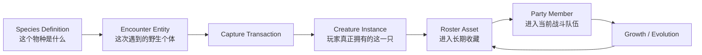
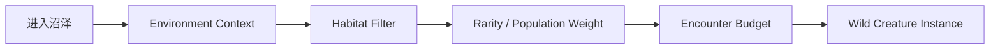
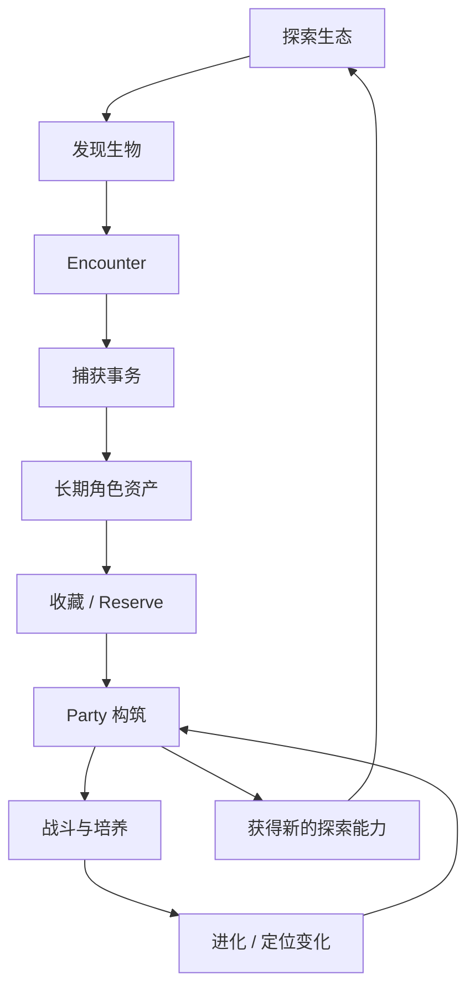

# 角色资产化与个体身份：怪物收集 RPG 的捕获事务、队伍压缩与长期成长

> 系列：游戏系统的共同语言
>
> 日期：2026-08-14
>
> 状态：草稿
>
> 核心问题：当世界中的敌对生物可以被玩家捕获、培养、进化、交换并陪伴几十小时以后，系统怎样保证“物种”“这一只个体”“当前战斗单位”和“玩家长期拥有的资产”始终是四个不会混淆的概念？

[系列目录](../blog.html)

怪物收集 RPG 中，一个玩家可能在沼泽里遇到一只野生生物。

它会攻击玩家。

它有当前生命值、技能、状态和自己的战斗 AI。

几分钟之后，玩家成功捕获它。

同一个生物现在可能：

- 被命名；
- 放入长期仓库；
- 加入当前队伍；
- 升级；
- 学习新技能；
- 形成关系；
- 进化；
- 参加数十场战斗；
- 被交换给其他玩家。

多年以后，玩家仍然可能记得：

> 这是我当初在雷暴天气里抓到的那一只。

从玩家体验看，这是一段非常自然的角色关系。

但从系统设计看，它意味着一个很难被“敌人类 + 宠物标记”正确表达的问题：

> 一个短生命周期的世界实体，如何变成一个拥有长期身份、历史和所有权的持久角色资产？

这也是怪物收集 RPG 与普通“打怪掉奖励”系统真正拉开距离的地方。

## 先说结论：捕获的核心不是改阵营，而是建立长期角色资产

**角色资产化（后文简称“从世界里的怪，变成我的这一只”）**：将世界遭遇中的临时生物实体，通过一次明确的所有权转换，提交为拥有稳定身份、来源、成长状态和长期存档责任的玩家角色资产。

整个转换链可以先写成：



这里至少存在四种完全不同的东西：

```text
Species
Encounter Entity
Creature Instance
Battle Runtime
```

它们之间可以互相派生。

但不能互相替代。

## 物种和个体必须从数据模型上分开

**物种定义（后文简称“这一类生物是什么”）**：描述一个物种共有的静态规则，包括基础属性、技能池、栖息地、捕获难度、进化规则和表现资源。

例如：

```text
SpeciesId = ThunderCub
Element = Electric
BaseStats = ...
Habitat = Wetland
EvolutionRules = ...
```

这些数据属于：

```text
CreatureSpeciesDefinition
```

它描述的是：

> 所有雷泽幼兽作为一种物种，理论上拥有哪些共同规则。

而玩家真正捕获的某一只：

```text
CreatureInstanceId = C-982731
SpeciesId = ThunderCub
Level = 23
Temperament = Timid
Trait = StormSense
CaptureRegion = BlackMarsh
CaptureWeather = Thunderstorm
Bond = 42
```

则属于：

**个体实例（后文简称“玩家真正拥有的这一只”）**：在物种定义基础上拥有唯一身份、当前成长、来源和个体差异的持久角色对象。

这两个模型如果没有分开，问题会非常严重。

例如把 Level 直接写在 SpeciesDefinition 上：

```text
一只雷泽幼兽升级
→
所有雷泽幼兽一起升级
```

这不是小 Bug。

而是系统从一开始就没有区分：

```text
类型
```

和：

```text
实例。
```

## Encounter Entity 也不等于长期 Creature Instance

世界中生成一只野生生物以后，它确实需要拥有一些“个体数据”。

例如：

- 当前等级；
- 当前生命；
- 随机 Trait；
- 技能；
- Temperament；
- 当前状态。

但这并不意味着它已经是玩家长期资产。

**遭遇实例（后文简称“这一次世界里出现的它”）**：为了完成当前探索和战斗而创建的临时实体，其生命周期属于 Encounter，而不是玩家角色仓库。

它可能拥有：

```text
EncounterId
WildCreatureId
CurrentHP
Status
GeneratedTraits
GeneratedMoves
```

如果玩家离开区域、战斗结束或 Encounter 被销毁，这个运行时实体可能正常消失。

真正的长期身份只应在捕获被成功提交后建立。

因此，不建议使用：

```text
WildEnemy
→ enemy.IsMine = true
→ 完成
```

这种模型。

它只是改变了阵营。

没有完成资产转换。

## 捕获是一笔所有权事务

**捕获事务（后文简称“真正成为我的那一刻”）**：把目标从 Encounter 所有权域移出，并在玩家角色仓库中创建或确认一个唯一持久实例的原子状态转换。

一次完整捕获至少涉及：

```text
验证目标仍存在
→
验证目标仍可捕获
→
冻结捕获结果
→
停止敌方行为
→
从 Encounter 移除
→
创建 CreatureInstance
→
分配永久 InstanceId
→
写入来源与个体状态
→
写入 Roster
→
更新图鉴
→
更新任务
→
提交事件
```

这里最重要的不是步骤数量。

而是：

> 这些步骤必须属于同一个业务结果。

不能出现：

```text
世界里的怪已经消失
但玩家仓库没有它。
```

也不能出现：

```text
玩家仓库已经生成一份 CreatureInstance
但野生实体还留在世界里，可以再抓一次。
```

前者是资产丢失。

后者是资产复制。

因此捕获成功真正的提交条件应该是：

```text
Encounter Ownership Released
AND
Player Ownership Established
```

两个事实同时成立。

## 捕获失败也应该产生状态，而不是只重复抽概率

如果捕获只有：

```text
按按钮
→
随机失败
→
再按一次
```

玩家面对的就不是策略。

而是重复抽奖。

更有价值的失败可以改变当前 Encounter：

```text
第一次捕获失败
→
目标警觉提高
→
捕获抵抗暂时变化
→
攻击模式改变
→
目标可能逃跑
```

玩家于是需要重新处理：

- 削弱目标；
- 施加状态；
- 更换捕获工具；
- 改变时机；
- 承担继续尝试的风险。

这样一次捕获过程就变成：

```text
观察
→
尝试
→
失败暴露信息
→
调整状态
→
重新尝试
```

而不是单纯刷新随机数。

## 捕获概率可以不显示数字，但不能完全不可理解

**捕获可解释性（后文简称“至少知道现在好不好抓”）**：玩家能够根据目标状态、工具、环境和已知规则判断当前捕获条件的大致优劣，而不必知道精确数学概率。

游戏完全可以不显示：

```text
37.42%
```

但玩家至少应该能理解：

```text
目标生命很高
→
当前较难捕获

目标进入麻痹
→
条件改善

当前捕获工具适配电系
→
进一步改善

雷暴环境满足特殊修正
→
当前是较好时机
```

否则捕获系统就无法形成：

```text
玩家假设
→
行动
→
结果
→
修正假设
```

的学习循环。

## 收藏的价值来自“宽候选集合”，而不是全部同时上场

怪物收集 RPG 很容易拥有：

```text
几十
几百
甚至上千
```

个可获得角色。

但真正参与一次战斗的通常只有：

```text
3～6
```

个。

这形成该品类另一个极其重要的结构。

**收藏—激活压缩（后文简称“拥有很多，但只能带少量”）**：玩家长期拥有庞大候选角色集合，但每次实际战斗只能激活一个很小的子集，因此必须持续完成筛选、编队和替换。

可以表示成：

```text
Collection
████████████████████████████████

Active Party
████
```

如果所有捕获的生物都能够自动贡献完整战斗价值：

```text
抓得越多
→
总战力自动越高
```

收藏会退化成纯数量累积。

真正的构筑来自：

```text
拥有 200 只
↓
当前只能选 6 只
↓
谁进入 Party？
↓
谁暂时留在 Reserve？
↓
谁值得投入培养资源？
```

所以，收藏宽度和战斗深度必须分离。

## Reserve 不是垃圾桶，而是未来选择空间

未进入当前 Party 的生物通常会进入 Reserve / Storage。

如果 Reserve 只提供：

```text
第一页
第二页
第三页
……
```

玩家拥有数百个个体以后，收藏本身很快会变成 UI 管理负担。

长期角色仓库至少需要支持：

- 搜索；
- 物种筛选；
- 属性筛选；
- 技能筛选；
- 等级；
- Trait；
- 捕获地区；
- 收藏夹；
- 自定义标签；
- Party Preset。

这里的本质和库存管理不同。

普通材料：

```text
Iron Ore × 132
```

可以堆叠。

CreatureInstance 不能简单堆叠，因为：

```text
同一种生物
≠
同一个个体。
```

Reserve 实际管理的是大量独立角色身份。

## 生物不是装备，它需要来源历史

**个体来源（后文简称“它是从哪里一路走到现在的”）**：CreatureInstance 在整个生命周期中保留捕获、所有权、培养和形态变化等关键历史，使长期成长仍然绑定于同一角色身份。

玩家可能在意：

- 在哪里捕获；
- 什么天气捕获；
- 最初等级；
- 原始主人；
- 特殊技能；
- 第一次进化时间；
- 战斗次数；
- 曾经加入哪些队伍；
- 是否参与过关键 Boss 战。

这类数据可以统一归入：

```text
Provenance
```

当一个角色陪伴玩家几十个小时后，它的价值已经不只来自当前 Combat Power。

它还来自：

```text
历史连续性。
```

因此 CreatureInstance 更接近一个持久角色，而不是一件随机词条装备。

## 进化应该保持身份连续，而不是删除旧角色

假设玩家最初捕获的是：

```text
CreatureInstanceId = C-982731
SpeciesId = ThunderCub
```

经过长期培养后，它进化成：

```text
StormBeast
```

一个危险的实现方式是：

```text
删除 ThunderCub Instance
→
创建新的 StormBeast Instance
```

这样做虽然视觉结果可能一样，却会人为切断大量长期关系：

- 名字；
- 捕获记录；
- Bond；
- Trait；
- 技能历史；
- 战斗历史；
- OriginalOwner；
- Lineage。

**身份连续进化（后文简称“形态变了，但还是这一只”）**：CreatureInstance 保持稳定 InstanceId，进化只改变 Species、EvolutionState 与相关派生属性。

即：

```text
Before

InstanceId = C-982731
Species = ThunderCub

After

InstanceId = C-982731
Species = StormBeast
```

而不是：

```text
C-982731 被删除
创建 C-104882
```

这项设计的价值非常直接：

> 玩家对角色的记忆不会因为系统换了一套 Species 数据而被重置。

## 进化应该改变角色解释，而不只是提高数值

低质量进化很容易变成：

```text
HP + 50
Attack + 20
模型变大
```

这种变化当然可以提供成长反馈。

但如果一个系统有大量收集和编队空间，更有价值的是让进化改变角色定位。

例如同一基础生物可以沿不同条件进入：

```text
A
高速单体输出

B
防御控制

C
天气支援
```

玩家实际做的就是：

```text
角色构筑方向选择。
```

此时进化不只是：

> 升级了。

而是：

> 这个长期角色在队伍中的解释发生了变化。

## 分支进化会把培养变成长期承诺

进化条件可以来自：

- 等级；
- 地点；
- 时间；
- 天气；
- Bond；
- 道具；
- 已学技能；
- 当前 Party；
- 特殊剧情。

这使玩家提前思考：

```text
我想把这一只培养成什么？
```

例如：

```text
Storm Evolution
需要雷暴天气
+
较高 Bond
+
指定技能
```

玩家获得的不只是一个隐藏条件。

而是一条长期培养路线。

当然，这里有一个非常重要的边界：

> 条件可以复杂，但不能完全无法推理。

如果玩家只能通过外部 Wiki 才知道：

```text
必须星期三凌晨 2 点
站在某块石头旁
携带特定隐藏值
```

系统就不再是发现。

而是信息隐藏。

图鉴、NPC、环境线索和 Evolution Debug UI 至少应该逐步提供可推理提示。

## 图鉴最好记录“知识”，而不只是“拥有过”

很多图鉴只有：

```text
？？？
→
已捕获
```

但怪物收集系统天然拥有更多认知层次：

```text
Seen
Encountered
Fought
Captured
Studied
```

**生态知识模型（后文简称“玩家对这个物种到底知道多少”）**：图鉴记录玩家通过观察、战斗、捕获和研究逐渐获得的信息，而不是只维护一个 Boolean Checklist。

例如：

```text
首次看到
→
只知道轮廓和大致属性

战斗过
→
开始记录技能和行为

捕获
→
解锁基础物种资料

多次观察
→
解锁栖息时间和天气规律

完成研究
→
获得进化提示
```

这样图鉴本身也进入探索循环。

它帮助玩家回答：

> 下一只应该去哪里找？

而不是只告诉玩家：

> 还差 37 个问号。

## 稀有物种最好拥有可学习规律，而不只是极低概率

一种最简单的稀有设计是：

```text
SpawnChance = 0.1%
```

然后玩家在同一片草地不断触发 Encounter。

这种设计确实能制造稀缺。

但它几乎没有制造新的决策。

更有价值的稀有条件可以来自：

- 夜晚；
- 雷暴；
- 季节；
- 隐藏区域；
- 特殊生态事件；
- 前置任务；
- 特殊诱饵。

这样玩家会逐渐学习：

```text
这个物种喜欢什么环境？
```

发现过程就从：

```text
重复抽随机
```

变成：

```text
学习生态规则
→
准备条件
→
主动寻找。
```

## 世界生态应该决定“为什么它在这里”

如果每一个 Region 都只是维护：

```text
RandomMonsterTable
```

生物很容易变成：

> 会移动的 Loot Table。

更完整的遭遇系统可以根据：

```text
Biome
Time
Weather
Season
Altitude
World State
Population
Player Progress
```

共同构造 Encounter Context。

例如：



这样玩家得到的体验是：

> 某种生物属于这个世界。

而不是：

> 系统这次随机把什么塞进来了。

## 收集越宽，追赶机制越重要

玩家主力队伍可能已经：

```text
Level 60
```

此时新区域捕获一只：

```text
Level 18
```

的新生物。

如果想真正测试它，需要：

```text
重复练几十级
```

大多数玩家最终会选择：

> 算了，还是继续用旧队伍。

这会产生一个很严重的系统反作用：

```text
收集内容越来越多
但真正可用角色越来越固定。
```

**角色追赶机制（后文简称“新成员能 reasonably 加入竞争”）**：降低后期新获得生物进入真实队伍测试所需的重复培养成本。

可以使用：

- 后备经验；
- 区域等级；
- 训练设施；
- 经验物品；
- 等级同步；
- 高级区域直接出现高等级个体。

目标不是：

> 所有新生物立即和主力一样强。

而是：

> 玩家愿意真正试它。

如果获取新角色以后首先想到的是：

```text
我要花三个小时把它练到能用
```

收藏系统实际上在惩罚玩家探索新内容。

## Learned Moves 和 Equipped Moves 也应该形成大集合到小集合的压缩

一个长期角色可能学会：

```text
18 个技能
```

但一次战斗只允许装备：

```text
4 个。
```

这又形成一次：

```text
大候选集合
→
小激活集合
```

它和 Collection / Party 使用的是同一类设计思想。

```text
我知道很多
≠
我现在全部能带。
```

限制并不只是为了减少 UI。

限制本身创造构筑。

如果所有已学技能都可以同时使用：

```text
角色越老
→
能力覆盖越全面
→
新选择越来越少。
```

小型 Equipped Set 则迫使玩家针对：

- 当前队伍；
- 当前区域；
- Boss；
- PvP；
- 属性覆盖；

持续调整。

## 属性克制的目的不是自动判胜，而是阻止单一队伍解决一切

属性系统最直观的写法是：

```text
Fire > Grass
Water > Fire
```

但它真正承担的战略职责应该是：

> 队伍不能只围绕一个绝对强单位无限解决所有内容。

如果克制倍率过高：

```text
猜中属性
→
自动获胜
```

那么：

- 技能；
- 速度；
- 状态；
- 角色定位；
- 配合；

都会被属性表压过。

更合理的队伍分析应该同时关注：

```text
Element Coverage
+
Role Coverage
```

例如一支队伍可能属性覆盖很好，却缺少：

- 控制；
- 恢复；
- 防御；
- 高速成员；
- 长期输出。

所以 Team Coverage UI 更适合告诉玩家：

> 当前有什么明显缺口。

而不是直接算出：

> 最优六人队。

## 战斗应该使用快照，而不是直接让外部仓库状态持续渗入

CreatureInstance 是玩家长期资产。

战斗则是一段短生命周期模拟。

这两个状态域不应该在整场战斗中无约束共享。

**战斗角色快照（后文简称“这一场战斗里的版本”）**：进入战斗时从 CreatureInstance 派生当前等级、属性、技能、状态和战斗修正，战斗结束后再把允许持久化的结果提交回长期实例。

例如：

```text
CreatureInstance
↓
BattleCreatureSnapshot
↓
Combat Runtime
↓
BattleResult
↓
Commit Progression
```

这样战斗过程中外部系统不会突然：

```text
替换技能
改变 Species
修改装备
```

导致正在运行的战斗状态失去一致性。

同样，捕获成功也必须是一条特殊终止路径。

不能同时发生：

```text
CreatureCaptured
+
EnemyKilled
+
普通死亡掉落
```

捕获和击杀必须是互斥结局。

## 交易比捕获更需要严格所有权事务

多人交换看起来只是：

```text
A 把怪给 B
B 把怪给 A
```

但对于高价值长期角色资产，这是非常危险的状态转换。

一次交易至少需要：

```text
双方提交
→
锁定 CreatureInstance
→
生成交易快照
→
双方确认
→
重新验证当前 Owner
→
原子交换 OwnerId
→
更新双方 Roster
→
提交交易结果
```

必须防止：

- 重复确认；
- 断线重试；
- 同一个 Creature 同时参加两个交易；
- 回滚产生副本；
- 一边成功一边失败。

**角色所有权唯一性（后文简称“任何时刻只能真正属于一个 Owner”）**：每个持久 CreatureInstance 在业务真理源中只能拥有一个有效所有者，捕获、交易和其他转移必须通过原子事务改变该关系。

这已经不是普通 UI 数据。

它和道具交易、市场资产甚至服务端经济系统属于同一类完整性问题。

## CreatureInstance 应被视为高价值存档资产

玩家可能在一只生物身上投入：

```text
几十小时。
```

因此它需要：

- 稳定 InstanceId；
- Owner；
- Version；
- Provenance；
- Integrity；
- Migration；
- EvolutionHistory。

绝不能只存在：

```text
Scene GameObject
```

或者：

```text
当前 Party Prefab。
```

场景实体只是表现和运行载体。

长期 CreatureRepository 才应该是真理源。

## 内容更新不能让旧角色突然无法加载

游戏发布新版本后，可能发生：

```text
某技能被删除
某 Trait 改名
某进化形态被重构
某 Species Schema 增加字段
```

如果长期角色资产只是直接序列化当前 Definition 引用，一次内容调整就可能让玩家多年培养结果无法加载。

因此：

**角色资产迁移（后文简称“版本变了，旧角色也必须活下来”）**：内容 Schema 更新后，为已有 CreatureInstance 提供确定性的字段、技能、形态和规则转换路径。

例如：

```text
OldMoveId
→
NewMoveId
```

或者：

```text
DeletedForm
→
ReplacementForm
+
Compensation
```

真正需要保护的不是旧数据格式。

而是：

> 玩家长期拥有的角色事实不能因为开发者更新内容而消失。

## 完整性错误必须显式暴露，不能静默覆盖

长期存档中最危险的问题之一是：

```text
两个 Creature 拥有同一个 InstanceId。
```

如果加载逻辑选择：

```text
后加载的覆盖前一个。
```

用户可能永久失去一个角色。

更安全的方式是：

```text
发现重复 ID
→
隔离冲突实例
→
标记 IntegrityError
→
停止静默覆盖
```

类似问题还包括：

```text
Party 引用了一个 Roster 中不存在的 Creature
Trade 锁没有释放
Species 已经不存在
Move 引用非法
Legendary 重复生成
```

**角色资产完整性（后文简称“任何时候都能证明这只角色是谁、在哪、属于谁”）**是这类系统必须单独治理的状态。

## 捕获成功以后，世界状态、收藏状态和知识状态仍然不是同一个东西

怪物系统中至少可以区分：

```text
Seen
Owned
In Party
Currently Active
```

它们不是一组 Boolean 的不同叫法。

例如：

玩家第一次看到稀有生物，但没有抓到：

```text
Seen = true
Owned = false
```

玩家后来成功捕获：

```text
Owned = true
```

但 Party 已满：

```text
In Party = false
Reserve = true
```

再后来加入主队：

```text
In Party = true
```

如果这些概念被合并成：

```text
Unlocked
```

系统很快会失去表达能力。

长期收集游戏尤其需要避免：

> 用一个状态词代表多个领域事实。

## 世界、资产和战斗应该拥有不同 Owner

可以把主要状态责任压缩为：

```text
SpeciesCatalog
→
拥有物种定义

EncounterSystem
→
拥有当前野生实例

CreatureRepository
→
拥有长期 CreatureInstance

RosterSystem
→
拥有收藏关系

PartySystem
→
拥有当前激活队伍

BattleSystem
→
拥有本场 Battle Snapshot

EncyclopediaSystem
→
拥有玩家知识

Capture / Trade / Evolution
→
负责跨域状态转换
```

最危险的架构是：

```text
Scene GameObject
```

逐渐变成：

- 角色真理源；
- 存档真理源；
- 队伍真理源；
- 战斗真理源；
- 所有权真理源。

场景对象生命周期太短，也太容易受到表现层操作影响，不应该承担长期角色资产责任。

## 一个完整循环实际是“世界生态 → 角色资产 → 队伍构筑”

假设玩家在雷暴天气进入沼泽。

系统通过：

```text
Biome
+
Time
+
Weather
```

判断某种稀有电系生物可以出现。

玩家第一次遭遇：

```text
Seen
```

进入图鉴。

野生个体生成时，当前：

- Level；
- Trait；
- Skills；
- Temperament；

被固定下来。

玩家第一次尝试捕获失败。

目标进入更高警觉。

玩家改用：

- 低生命控制；
- 麻痹；
- 特定工具。

第二次捕获成功。

系统执行 Capture Transaction。

野生 Encounter Entity 消失。

新的：

```text
CreatureInstanceId
```

进入长期 Roster。

因为 Party 已满，它暂时进入 Reserve。

之后玩家主动将它加入队伍，完成培养。

数小时以后，它满足：

```text
Level
+
Bond
+
Thunderstorm
```

的特殊进化条件。

进化发生。

它的 Species 从：

```text
ThunderCub
```

变为：

```text
StormBeast
```

但：

```text
CreatureInstanceId
```

保持不变。

玩家仍然知道：

> 这是当初沼泽里抓到的那一只。

而它新的战斗定位，又促使玩家重新调整整支队伍。

这就形成了真正完整的循环：



所以，怪物收集 RPG 最重要的不是：

> 地图上有很多怪。

而是：

> 世界中的生态多样性，能够不断转换成玩家自己的长期角色组合空间。

## 与普通 JRPG 的边界

普通 JRPG 通常拥有：

```text
固定或半固定主角团
```

玩家核心成长围绕：

- 角色等级；
- 装备；
- 技能；
- 剧情关系；

逐渐展开。

怪物收集 RPG 则把角色集合本身变成主要成长维度。

玩家不断：

```text
发现新角色
→
获得新角色
→
筛选
→
替换
→
重新构筑。
```

所以二者虽然都可以拥有：

- 地图；
- 回合战斗；
- Boss；
- 剧情；

运行时中心仍然不同。

一个主要经营：

```text
已有角色的纵向成长。
```

另一个同时经营：

```text
角色候选空间的横向扩大。
```

## 与宠物养成的边界

宠物养成更强调：

- 情绪；
- 生理需求；
- 信任；
- 日常互动；
- 陪伴关系。

怪物收集 RPG 可以拥有 Bond。

但如果 Bond 逐渐成为：

```text
必须每天摸十次
必须喂大量重复物品
否则战力大幅下降
```

系统就会偏向照护模拟。

怪物收集 RPG 中的关系更适合服务：

- 特殊进化；
- 技能；
- 少量表现；
- 探索互动；
- 角色记忆。

它应该强化“这是我的这一只”。

不应该变成高频生活维护负担。

## 与抽卡角色收集的边界

抽卡游戏也会拥有大量角色。

但它的角色获得来源通常是：

```text
外部抽取系统
→
直接进入玩家资产。
```

怪物收集 RPG 更强调：

```text
角色先属于世界
→
玩家发现
→
遭遇
→
理解
→
捕获
→
成为资产。
```

角色获取本身参与探索和世界生态。

因此玩家记忆的不只是：

> 我抽到了它。

而可能是：

> 我在哪里找到它、当时发生了什么、我怎样把它抓到手。

这就是捕获资产化与普通 Collection Unlock 的重要差别。

## 这套模型不能简单照搬到所有收集系统

如果游戏中的“单位”本质上是：

- 消耗品；
- 无长期差异；
- 可完全堆叠；
- 没有来源；
- 没有个体成长；

那么为每一个实例建立完整：

```text
Unique Id
Provenance
Evolution History
Ownership Transaction
```

会制造不必要复杂度。

只有当玩家确实会把它理解成：

> 一个独立角色。

长期身份才有足够价值。

所以真正应该先问的是：

> 玩家拥有的是“某种单位的一份数量”，还是“这一只具体角色”？

前者适合 Item Stack。

后者才需要 Character Asset。

## 常见设计失败

### Species 和 CreatureInstance 混在一起

物种规则与个体成长互相污染。

### 捕获只是改变阵营字段

没有完成长期身份、所有权和存档转换。

### 捕获成功不是原子事务

产生重复、生物丢失或图鉴状态漂移。

### 捕获失败只重复 RNG

没有产生新的战术状态。

### 所有收藏都自动贡献战力

收藏数量直接膨胀为战力，没有 Party 压缩和编队选择。

### Reserve 只提供翻页

角色数量增加后，收藏系统变成 UI 仓库劳动。

### 进化删除旧实例再创建新实例

长期身份和来源历史被切断。

### 稀有只等于极低概率

玩家只能通过重复刷取而不是学习世界规律寻找。

### 新成员缺少追赶机制

后期获得的角色无法合理进入真实队伍竞争。

### 属性克制过于绝对

队伍构筑被“猜对属性”替代。

### Battle 直接持续修改长期 CreatureInstance

短生命周期模拟和长期资产状态互相污染。

### 交易不是原子所有权事务

断线或重试可以产生角色复制。

### 长期角色只存 Scene Object

场景销毁或重载导致高价值资产失去权威状态。

### 内容更新缺少迁移

技能和形态调整让旧存档角色无法加载。

### 重复 InstanceId 静默覆盖

高价值角色在加载时无提示丢失。

## 我的角色资产设计检查表

1. Species Definition 与 Creature Instance 是否是两个数据模型？
2. 每个长期角色是否拥有稳定且唯一的 InstanceId？
3. Encounter Entity 与长期 CreatureInstance 是否拥有不同生命周期？
4. 捕获是否是明确的所有权事务？
5. 捕获成功是否保证世界移除与 Roster 写入同时成立？
6. 捕获失败是否能改变后续决策，而不是单纯重复抽概率？
7. 玩家能否理解哪些因素改善捕获条件？
8. Seen、Owned、InParty 是否被明确分离？
9. 大型 Collection 与小型 Active Party 是否形成真实压缩关系？
10. Reserve 是否支持搜索、标签和队伍预设？
11. CreatureInstance 是否保存必要 Provenance？
12. 进化是否保持同一个 InstanceId？
13. 分支进化是否改变角色构筑方向，而不仅是数值？
14. Evolution 条件是否可以逐步被玩家理解？
15. 后期获得的新生物是否有合理追赶方式？
16. Learned Moves 与 Equipped Moves 是否形成构筑取舍？
17. 属性与角色定位是否共同参与 Team Coverage？
18. 图鉴是否记录知识层次，而不仅是拥有状态？
19. 稀有出现是否拥有可以学习的生态规律？
20. Encounter 是否由 Habitat Context 驱动，而不是纯随机表？
21. 战斗是否使用独立 Battle Snapshot？
22. 捕获成功是否与击杀结算互斥？
23. Trade 是否锁定角色并进行原子 Owner 转换？
24. 同一个 Creature 是否能够同时参与多个 Ownership Transaction？
25. CreatureRepository 是否是真正长期状态 Owner？
26. Party、Roster、Battle 和 Scene 是否都没有越权拥有 Creature 数据？
27. 存档是否拥有 Creature Schema Version 与 Migration？
28. 删除技能或形态以后，旧 Creature 是否仍然可以恢复？
29. 是否存在 InstanceId、Roster、Party 和 Owner 完整性检查？
30. 调试工具能否解释一个角色“是谁、从哪里来、现在属于谁、经历过什么”？

怪物收集 RPG 最直观的表面特征，是：

> 可以抓很多怪。

但真正让这个系统能够长期运转的，并不是“怪物数量”。

而是系统能够始终准确地区分：

```text
这个物种是什么
这次世界里遇到的是哪一只
玩家最终拥有的是哪一只
这一场战斗使用的是哪个状态版本
```

捕获把一个临时世界实体变成长期资产。

收藏扩大候选空间。

Party 把庞大收藏压缩成当前决策。

培养与进化继续改变角色定位。

生态系统又不断提供新的候选。

于是玩家的成长并不只是：

```text
等级越来越高。
```

而是：

```text
世界里的可能性
不断被转换成
自己拥有、记得并能够重新组合的角色空间。
```

这也是“怪物收集”真正比“敌人掉角色奖励”更有辨识度的地方：

> 玩家收集的不是一条解锁记录，而是一群拥有持续身份的角色。

## 术语对照

| 正式术语 | 文中通俗称呼 |
|---|---|
| 角色资产化 | 从世界里的怪，变成我的这一只 |
| 物种定义 | 这一类生物是什么 |
| 个体实例 | 玩家真正拥有的这一只 |
| 遭遇实例 | 这一次世界里出现的它 |
| 捕获事务 | 真正成为我的那一刻 |
| 捕获可解释性 | 至少知道现在好不好抓 |
| 收藏—激活压缩 | 拥有很多，但只能带少量 |
| 个体来源 | 它是从哪里一路走到现在的 |
| 身份连续进化 | 形态变了，但还是这一只 |
| 生态知识模型 | 玩家对这个物种到底知道多少 |
| 角色追赶机制 | 新成员能 reasonably 加入竞争 |
| 战斗角色快照 | 这一场战斗里的版本 |
| 角色所有权唯一性 | 任何时刻只能真正属于一个 Owner |
| 角色资产迁移 | 版本变了，旧角色也必须活下来 |
| 角色资产完整性 | 任何时候都能证明这只角色是谁、在哪、属于谁 |

---

## 内部资料依据

本文主要基于以下材料整理：

- `game-designs/怪物收集RPG设计范式.md`
- `game-designs/README.md`
- `blogs/README.md`
- `blogs/publication.v1.json`

本文是对怪物收集 / Monster Taming / Creature Collection RPG 设计范式的个人综述。

文中的 CaptureTransaction、CreatureRepository、BattleCreatureSnapshot、EvolutionTransaction、Provenance、Roster Integrity 等属于工程化分析模型与可选实现方案，不表示所有怪物收集游戏都使用完全相同的数据结构、事务系统、服务器权威模型或战斗架构。

尤其需要注意：“保持同一 CreatureInstanceId 完成进化”是用于保护角色身份连续性的推荐设计，而不是所有游戏都必须采用的唯一实现。只要系统能够可靠保留玩家所感知的角色身份、来源和长期成长历史，也可以采用其他内部表示。
