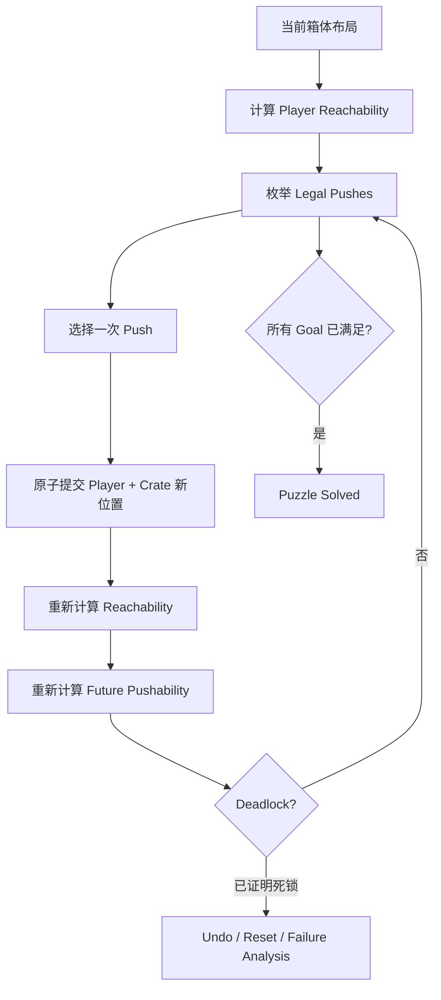
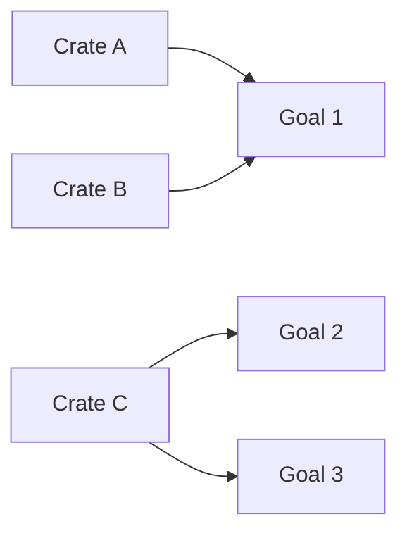

# 可推动性重构：推箱子中的可达域、不可逆推动与死锁分析

> 系列：游戏系统的共同语言
>
> 日期：2026-09-05
>
> 状态：草稿
>
> 核心问题：推箱子中的一次推动怎样同时改变箱体位置、玩家可达区域和未来施力条件，并让一个仍然可以继续走动的棋盘悄悄进入永久无解状态？
>
> 关键词：Sokoban、Pushability、Reachability、Deadlock、Solver、Puzzle Design

[系列目录](../blog.html)

玩家面前只有一个箱子。

目标点也就在几格之外。

最直觉的操作是：

```text
把箱子往目标方向推。
```

于是玩家向前推动一格。

箱子离目标更近了。

从“箱子到目标的距离”来看，这一步显然是进展。

几步以后，玩家却发现：

```text
箱子就在目标旁边，
但自己再也走不到箱子的另一侧。
```

棋盘仍然可以移动。

角色仍然能够在房间里自由走动。

游戏没有弹出失败动画。

箱子甚至可能只差最后一格。

但谜题已经无法完成。

这正是推箱子最独特的地方。

玩家失败的原因往往不是：

```text
没有找到箱子通往目标的路径。
```

而是：

> 在之前某一次推动中，删除了未来完成这条路径所需要的施力位置。

所以推箱子的核心并不是“箱体寻路”。

它更接近一场围绕**未来行动权**展开的空间规划。

## 先说结论：玩家真正规划的是未来的可推动性

**可推动性（后文简称“未来还能怎么推”）**：在当前箱体布局和玩家可达区域下，所有仍然合法执行的箱体推动动作集合。

一个箱体是否能够向右移动，不只取决于：

```text
箱子右边是不是空格。
```

还必须同时满足：

```text
玩家能够站到箱子左边。
```

因此，一次推动真正改变的并不只有：

```text
Crate Position。
```

它还可能改变：

- 玩家能够进入哪些区域；

- 哪些箱体背后仍有可站立空间；

- 哪些通道被打开；

- 哪些通道被永久堵住；

- 哪些箱体还能对应哪些目标；

- 哪些未来推动顺序仍然成立。


可以把整个类型的核心循环压缩成：



因此：

> **推箱子的基本战略单位不是“走一步”，而是“执行一次会重新定义后续动作集合的 Push”。**

## Walking 和 Push 应该被视为两个不同层次

玩家可能在一间大厅里：

```text
向左走 10 格
向上走 5 格
再绕回右边。
```

如果期间没有推动任何箱子，那么从谜题结构看：

- 墙没有变化；

- 箱子没有变化；

- 目标没有变化；

- 下一批可推动动作通常没有变化。


这些 Walking 的主要作用只是：

> 把玩家送到下一次施力位置。

因此可以把运行时分成两层。

### Micro Movement

**微观移动（后文简称“走到能推的位置”）**：玩家在当前可达区域内移动，本身通常不改变箱体结构。

它主要承担：

- 操作反馈；

- 空间表现；

- 到达推动侧；

- 玩家体验。


### Strategic Push

**战略推动（后文简称“真正改题目的那一步”）**：推动箱体并同时改变箱体布局、玩家位置与后续可达关系。

真正的 Puzzle State 变化主要发生在这里。

这会直接影响：

- Undo 应该优先撤销什么；

- Solver 应该搜索什么；

- Replay 应该在哪些点做 Hash；

- 关卡难度应该统计什么。


如果架构只存在：

```text
PlayerMovementController
+
BoxCollision，
```

系统就很难表达这种层级差异。

## 静态地形与动态占用应该彻底分开

推箱子棋盘非常适合拆成两层。

### Terrain

保存：

```text
Wall
Floor
Goal。
```

这是关卡定义。

### Occupancy

保存：

```text
Player
Crate。
```

这是当前运行状态。

因此：

```text
箱子站在 Goal 上
```

不应该创建一个特殊：

```text
CrateOnGoalTile。
```

真正的状态是：

```text
Terrain = Goal
Occupancy = Crate。
```

这项分层看似基础，却会直接影响：

- Save；

- Solver；

- Undo；

- Level Editor；

- Theme；

- Deadlock Analysis。


Goal 是静态规则位置。

Crate 是否占据它，是动态事实。

两者一旦混在一起，关卡定义和运行状态就会开始互相污染。

## 箱体在经典规则中往往是逻辑可交换的

经典 Sokoban 中，普通箱子通常没有：

```text
箱子 A 必须进入 Goal A
箱子 B 必须进入 Goal B。
```

只要所有目标最终都被任意箱体占据即可。

因此从 Solver 视角：

```text
Crate A at (2,4)
Crate B at (5,7)
```

和：

```text
Crate B at (2,4)
Crate A at (5,7)
```

往往属于同一个谜题状态。

这意味着 Solver 可以把箱体表示为：

```text
排序后的 Crate Position Set。
```

而不需要把每一个可视实例身份都纳入搜索状态。

但运行时仍然适合拥有稳定的：

```text
CrateInstanceId。
```

因为：

- 动画；

- Sound；

- Undo；

- Replay；

- Debug；


仍然需要知道：

> 刚才到底是哪一个可见箱体移动。

这是一个很常见的设计边界：

> **逻辑等价不代表表现身份必须被删除。**

如果以后加入：

- 彩色箱体；

- 专属 Goal；

- 箱体能力；


逻辑可交换性就不再成立。

原来的 Solver Canonicalization 也必须随规则变化重新定义。

## 一个合法 Push 本质上是“三格关系”

假设箱体当前位置为：

```text
C
```

希望向方向：

```text
D
```

推动。

系统至少需要同时检查两个关键位置。

```text
Player Stance = C - D

Crate Destination = C + D
```

可以画成：

```text
[Player Stance] [Crate] [Destination]
      C-D          C        C+D
```

合法推动至少要求：

```text
Destination
可以被箱体占据

并且

Player Stance
属于当前 Player Reachable Region。
```

因此：

> 箱子前方有空间，并不等于箱子能被推过去。

这正是推箱子和普通路径规划最根本的差异之一。

路径规划通常主要关心：

```text
目标位置是否可达。
```

推箱子还必须关心：

```text
执行移动所需要的施力位置是否可达。
```

## 玩家可达域比精确玩家坐标更接近谜题状态

**玩家可达域（后文简称“当前可以自由走动的整片区域”）**：在把箱体视为障碍后，从玩家当前位置进行 Flood Fill 得到的所有可到达格子集合。

假设玩家位于一个大型开放房间。

他从：

```text
左上角
```

走到：

```text
右下角。
```

只要中途没有推动箱体，

他仍然属于同一个：

```text
Reachable Region。
```

从下一次战略动作看：

```text
他仍然能够站到所有相同的箱体施力侧。
```

所以 Solver 甚至没有必要保存：

```text
精确 Player Position。
```

它可以只保存：

```text
当前 Reachable Region 的 canonical representative。
```

例如：

```text
可达区域中的最小 Cell Index。
```

于是大量：

```text
玩家在同一个房间里走来走去
```

的搜索状态会自动合并。

这是一项非常典型的建模优化：

> **搜索状态应该描述真正影响未来决策的事实，而不是把所有运行时细节原样复制进去。**

## Push 应该是一笔原子事务

一次合法 Push 同时发生两件事：

```text
Crate
前移一格

Player
进入 Crate 原位置。
```

这两个状态在谜题逻辑里不能分成两帧。

如果系统先执行：

```text
Crate Move
```

下一帧再执行：

```text
Player Move，
```

中间会短暂出现一个没有合法含义的 Puzzle State。

因此更适合把 Push 设计成：

**Push Transaction（后文简称“箱子和玩家一起提交”）**：在统一校验后，原子修改箱体位置、玩家位置、统计值和派生状态版本。

流程可以是：

```text
收到 Push Intent
↓
重新验证当前 StateRevision
↓
检查 Stance
↓
检查 Destination
↓
提交 CrateFrom → CrateTo
↓
提交 Player → CrateFrom
↓
PushCount +1
↓
StateRevision +1
↓
更新 Goal Occupancy
↓
Reachability Cache Dirty
↓
发布 PushCommitted
```

事务只有两个结果：

```text
全部成功
```

或者：

```text
Puzzle State 完全不变。
```

这会显著简化：

- Undo；

- Replay；

- Save；

- Solver；

- 网络扩展；

- 自动测试。


## 每次 Push 都会重新计算玩家可达域

假设一个箱体原本堵在门口。

玩家把它推开一格。

结果可能是：

```text
整个新房间变得可进入。
```

另一次 Push 则可能：

```text
把箱体推入狭窄门道
→
玩家永久失去另一边区域。
```

因此：

```text
Push
→
Reachability Dirty。
```

是非常自然的运行时边界。

反过来，大量普通 Walking：

```text
只要仍然位于同一 Reachable Region
```

通常不需要重新执行完整 Flood Fill。

这形成一种非常高效的结构：

```text
Walking
高频
低成本

Push
低频
触发 Puzzle 重分析。
```

## 每次 Push 都在重构未来动作集合

可以把当前所有战略动作表示成：

```text
LegalPushes(State)
```

其中每一个候选 Push 包含：

```text
Crate
Direction
Required Stance
Destination
Deadlock Risk
Goal Effect。
```

于是一次推动实际上执行：

```text
State_t
→
Push
→
State_t+1
```

随后：

```text
LegalPushes(State_t)
```

和：

```text
LegalPushes(State_t+1)
```

可能完全不同。

这就是：

**可推动性重构（后文简称“推一步以后，未来还能做的事情被重新洗牌”）**。

它解释了为什么推箱子的战略深度并不依赖大量规则。

一个极小规则集：

```text
四向移动
只能 Push
不能 Pull
一个格子只能一个箱子
```

已经足以产生非常复杂的状态空间。

复杂性来自：

> **玩家自己的动作会改变未来动作存在的条件。**

## Deadlock 才是推箱子最核心的失败结构

**Deadlock（后文简称“还能继续走，但已经永远解不出来”）**：当前棋盘仍然允许合法操作，但已经不存在任何能够让全部箱体最终占据合法目标的解序列。

这是一种很特别的失败。

动作游戏通常会：

```text
HP = 0
→
失败。
```

推箱子则经常：

```text
没有任何显式失败事件。
```

玩家自己需要发现：

> 很久以前某一次 Push 已经破坏了可解性。

这也意味着 Deadlock 不应该只被视作：

```text
失败动画触发条件。
```

它本身就是：

- 关卡设计对象；

- Solver 剪枝对象；

- Hint 数据；

- 作者工具数据；

- 玩家学习内容。


## 最简单的 Deadlock 是非目标角落

经典情况：

```text
##
#C
```

箱子被推进两面墙形成的 Corner。

如果当前位置不是 Goal，

因为玩家永远无法站到墙后面施力，

箱子已经无法离开。

这种位置可以在关卡加载阶段直接标成：

```text
Static Dead Square。
```

但只检查 Corner 远远不够。

很多格子看起来不是角落，

实际上仍然永远不可能让箱子到达任何 Goal。

## Reverse Pull 是比手写死角规则更强的静态分析

**Reverse Pull Analysis（后文简称“从目标反过来问箱子理论上能从哪里来”）**：在只考虑静态墙体、不考虑其他箱体时，从 Goal 开始做反向箱体搜索，模拟一个虚拟 Agent 将箱子向后拉。

正向规则是：

```text
玩家站在箱子后面
→
Push。
```

反向分析则问：

```text
如果箱子最终在 Goal
前一步可能在哪里？

再前一步可能在哪里？
```

最终得到：

```text
Goal-Reachable Crate Cells。
```

所有不属于这个集合的普通 Floor：

```text
理论上无论其他箱子怎样摆
都不可能把箱子送到任何 Goal。
```

因此可以直接标记为：

```text
Static Dead Square。
```

这比：

```text
贴墙就是死
```

一类手写经验规则准确得多。

## Reverse Pull Map 还是极高价值的关卡作者工具

在 Level Editor 中直接覆盖一层：

```text
绿色：
至少能够反向到达一个 Goal

红色：
无法反向到达任何 Goal
```

设计师放置箱体时就可以立刻看到：

> 这个初始位置是否天然非法。

这是工具化设计的典型价值：

> 不要只在运行时发现错误，把能够静态证明的事实前移到内容生产阶段。

## Freeze Deadlock 来自箱体彼此锁死

有些箱体单独看都不位于 Dead Square。

但多个箱体放在一起以后会互相冻结。

例如：

```text
Wall
Crate A
Crate B
Wall
```

A 的右边被 B 阻挡。

B 的左边被 A 阻挡。

如果两者在另一个轴上也无法移动，

就会形成：

```text
Freeze Cluster。
```

这类失败不能只通过：

```text
当前位置是不是静态死格
```

发现。

它需要分析箱体之间的相互依赖。

常见低成本动态检测还包括：

```text
2×2 Wall / Crate Freeze。
```

但也必须保留一个重要例外：

> 如果冻结的箱体全部已经处在正确最终 Goal 上，不能因为“再也动不了”就自动判定失败。

Deadlock 的定义始终围绕：

```text
Puzzle 是否仍可完成。
```

而不是：

```text
某个对象是否还能移动。
```

## Assignment Deadlock 是更隐蔽的失败

假设存在三只箱子：

```text
A
B
C
```

和三个目标：

```text
1
2
3。
```

静态分析显示：

```text
A → Goal 1

B → Goal 1

C → Goal 2 / Goal 3。
```

每一只箱子单独看：

```text
都至少能够到达一个 Goal。
```

但整体仍然无解。

因为：

```text
A 和 B
同时只能使用 Goal 1。
```

这就是：

**Assignment Deadlock（后文简称“每个箱子都有去处，但大家无法同时都有去处”）**。

可以构造一张二分图：



然后执行：

```text
Maximum Bipartite Matching。
```

如果最大匹配数：

```text
< Crate Count，
```

就可以证明：

```text
当前状态至少从 Goal Assignment 层面已经无解。
```

这是一种非常强的 Solver 剪枝。

但必须注意：

```text
Matching 存在
```

通常只是必要条件。

它不自动证明：

```text
真实推动顺序一定可行。
```

## Goal 已经被占据，也不代表这个箱子可以忘掉

一个狭窄 Goal Corridor 可能有三个目标：

```text
[Goal 3][Goal 2][Goal 1] ← 入口
```

如果只能从右边往里推，

正确顺序可能必须是：

```text
先 Goal 3
再 Goal 2
最后 Goal 1。
```

如果玩家先把一个箱子推到最外侧 Goal 1：

```text
这个箱子本身“已经正确”。
```

但它同时堵死了后续所有箱子。

因此：

> **Crate on Goal 不等于 Crate 从此不再参与谜题。**

Goal Occupancy 是局部正确。

Puzzle Solvability 是全局正确。

两者不能互相替代。

## Corral Deadlock 则来自玩家失去施力区域

还有一种更高级的失败：

一些箱子围成边界。

内部仍然看起来有空间。

但玩家当前：

```text
无法进入那片区域。
```

于是内部箱体虽然从纯几何角度：

```text
似乎还能移动，
```

真正需要的施力侧却都不可达。

这类区域可以称为：

**Corral（后文简称“箱子围出来、玩家自己进不去的区域”）**。

分析它必须同时考虑：

- Player Reachability；

- 不可进入区域；

- 边界箱体；

- 区域内部箱体；

- Goal；

- 边界箱体还能否被外部推动。


这说明：

> 推箱子的可解性从来不只是箱体几何问题，它一直是“箱体位置 + 玩家可达域”的联合问题。

## Deadlock Detection 应该分层实现

第一版运行时没有必要一次实现所有高级算法。

更现实的层级可以是：

### Level 1

Static Dead Squares。

### Level 2

Corner、2×2、Freeze。

### Level 3

Goal Assignment Matching。

### Level 4

Corral、Goal Room、复杂顺序分析。

其中高级算法即使存在：

```text
疑似 Deadlock
```

也不能随便：

```text
强制判玩家失败。
```

如果算法不能保证没有 False Positive，

它更适合用于：

- Debug；

- Solver；

- Hint；

- 作者工具。


## “已证明死锁”和“疑似死锁”必须分开

这是非常值得迁移的一个通用设计原则。

**Proven Deadlock（后文简称“系统可以证明已经无解”）**

和：

**Suspected Deadlock（后文简称“系统觉得很危险，但还证明不了”）**

不应该拥有相同权限。

前者可以：

```text
提示玩家
建议 Undo
标记 Solver Prune。
```

后者更适合：

```text
内部诊断
玩家主动请求 Hint 时辅助分析。
```

一个不完美的分析器不能因为：

```text
“我觉得大概率错了”
```

就修改玩家权威状态。

这也是：

> **分析工具不能因为拥有推断能力，就自动获得裁决权限。**

## Undo 是实验工具，而不是作弊按钮

Push 具有非常强的不可逆性。

如果玩家每做错一次 Push 都必须：

```text
整关重新开始，
```

真正被放大的往往不是谜题难度。

而是：

```text
恢复成本。
```

因此推箱子非常适合提供：

**Push-centric Undo（后文简称“撤销真正改变谜题的那一步”）**。

玩家可能走了：

```text
40 步
```

只是为了绕到箱子后方。

真正想撤销的通常是：

```text
最后那次 Push。
```

所以产品可以同时提供：

```text
Full Undo

以及

Undo Last Push。
```

这不是自动帮玩家解题。

它只是在降低：

```text
已经明确知道错误以后
回到上一个实验状态
```

的成本。

## 低恢复成本允许更高推理密度

推箱子和高难平台跳跃在这一点上有相似结构。

如果：

```text
失败成本低，
```

设计师就可以允许：

```text
更高试错频率。
```

区别在于：

精密平台的试错主要在训练：

```text
执行精度。
```

推箱子的试错主要在训练：

```text
状态预测。
```

Undo 让玩家能够：

```text
提出一个空间假设
→
执行 Push
→
观察后果
→
发现假设错误
→
快速回退。
```

它实际上是谜题实验循环的一部分。

## 自动化 Walking，不要自动化 Push Planning

如果玩家已经确定：

```text
下一次要站到箱子左边。
```

系统完全可以提供：

```text
点击目标格
→
自动寻路过去。
```

因为当前 Reachable Region 内的 Walking 通常只是机械执行。

但到达推动侧以后：

```text
系统不应该自动替玩家决定箱子该往哪里推。
```

这可以总结成一条非常实用的 UX 原则：

> **可以自动化策略无关的执行摩擦，但不要自动化真正承载策略的决策。**

同样的原则也适用于：

- 战术游戏中的安全走位；

- 经营游戏中的重复运输；

- 卡牌游戏中的显然操作；

- UI 批量管理。


关键不是：

```text
操作能不能自动化。
```

而是：

```text
这部分操作是否仍然承载有意义的选择。
```

## Solver 应该搜索 Push，而不是搜索玩家每一步 Walking

最朴素的 Solver 可以展开：

```text
Up
Down
Left
Right。
```

问题是它会生成大量：

```text
玩家只是在同一房间里走来走去
```

的状态。

真正更高价值的搜索图应该是：

```text
当前 Crate Layout
↓
计算 Reachable Region
↓
枚举所有 Legal Push
↓
每次 Push 生成一个新状态。
```

于是搜索图中的边是：

```text
Push。
```

而不是：

```text
Walk。
```

这与前面的状态建模完全一致：

> Solver 也应该围绕真正改变未来决策的动作建图。

## Push-state Solver 还能自然支持更好的 Hint

一个 Hint 系统不一定要直接显示：

```text
完整解法。
```

它可以分层提供：

### Hint 1

显示一个值得关注的箱体。

### Hint 2

显示下一次建议 Push 的方向。

### Hint 3

显示需要先到达的 Stance Cell。

### Hint 4

展示若干步 Push Plan。

因为 Solver 自身就是：

```text
Push State Graph，
```

它能够直接输出真正的战略节点。

而不需要向玩家播放几十步无意义 Walking。

## 关卡难度不等于地图面积或箱子数量

一张有：

```text
15 个箱子
```

的大地图，

完全可能只是大量独立、简单搬运。

另一张只有：

```text
4 个箱子
```

的小地图，

却可能拥有：

- 高度耦合的 Goal Order；

- 狭窄通道；

- Corral；

- 临时逆向推动；

- 多个诱人但错误的 Push。


因此更值得分析的难度指标包括：

- Minimum Pushes；

- Expanded Solver States；

- Branching Factor；

- Deadlock Density；

- Goal Assignment Complexity；

- Required Reverse Progress；

- Reachability Changes；

- Corral Count；

- Tunnel Count。


地图尺寸只是表现规模。

真正的难度来自：

> **多个 Push 之间的未来约束耦合程度。**

## 好关卡经常围绕一个“空间悖论”展开

典型结构包括：

```text
必须暂时把箱子推离 Goal。

距离最近的箱子不能去最近的 Goal。

必须先堵住一条路，之后才能重新打开。

Goal 本身同时也是通道。

必须先处理看似无关的箱子，
才能绕到真正目标箱子背后。

最深的 Goal 必须最先填。
```

这些设计表面上不同。

底层都在表达同一件事：

> **当前看起来像进展的移动，可能损害未来可推动性；当前看起来像倒退的移动，可能是在购买未来施力空间。**

这比单纯增加：

```text
箱子数量
```

更能形成推箱子独有的推理。

## 作者工具应该可视化“可推动性”，而不只是地图

传统 Tile Editor 主要告诉设计师：

```text
墙在哪
地板在哪
Goal 在哪。
```

这对 Sokoban 不够。

更高价值的 Overlay 包括：

- Static Dead Squares；

- Goal Reverse Reachability；

- Player Reachability；

- Current Legal Pushes；

- Crate-to-Goal Edges；

- Tunnel；

- Goal Room；

- Corral Candidate；

- Deadlock Warning。


例如选中一个测试状态后：

```text
绿色区域
=
玩家当前可走区域

箱体旁绿色箭头
=
合法 Push

红色箭头
=
目标格属于 Static Dead Square。
```

设计师看到的终于不是：

```text
地图长什么样。
```

而是：

```text
这张地图当前允许什么。
```

## 关卡验证应该使用真正的 Solver

人工试玩一次通关只能证明：

```text
至少存在一个人类已经找到的解。
```

正式关卡还可以离线验证：

- 初始状态是否合法；

- Crate / Goal 数量是否匹配；

- 所有 Crate 是否理论上有 Goal；

- Puzzle 是否可解；

- 是否存在意外超短解；

- Minimum Pushes；

- Expanded States；

- 初始 Deadlock；

- Difficulty Metric。


如果 Solver 在预算内没有找到解：

```text
不能直接写成
Unsolvable。
```

更准确的状态是：

```text
Unknown
/
SolverBudgetExceeded。
```

这仍然是证据等级问题：

> **“我没有证明存在解”和“我证明不存在解”不是同一个结论。**

## Reverse Generation 可以保证“有解”，但不能保证“有趣”

程序生成 Sokoban 最危险的方法是：

```text
随机摆墙
随机放箱
随机放 Goal
→
希望最后有解。
```

无解率会非常高。

更稳健的方向是：

```text
从 Solved State 开始
↓
使用 Reverse Pull
把箱子逐渐拉远
↓
生成一个理论上存在正向解的状态。
```

这样反向动作天然对应一条正向解。

但它只保证：

```text
至少存在解。
```

不保证：

- 难度合理；

- 没有捷径；

- 解法有趣；

- 没有大量机械搬运；

- Puzzle 拥有真正空间悖论。


所以完整生成流程仍然应该：

```text
Reverse Generation
→
Forward Solver
→
Shortest Solution
→
Shortcut Check
→
Difficulty Analysis
→
Content Filter。
```

程序生成不能用“保证可解”冒充“保证好玩”。

## 表现不能成为 Puzzle State 的事实源

逻辑 Push 已经确定：

```text
Player A → B
Crate C → D。
```

动画可以随后：

```text
Tween
插值
播放推箱动作。
```

如果玩家 Skip Animation，

Puzzle State 仍然应该完全正确。

因此：

```text
动画播完
→
才真正修改格子状态
```

通常是错误方向。

权威关系应该是：

```text
Puzzle Transaction
→
产生逻辑结果
→
Presentation 展示结果。
```

这会让：

- Undo；

- Fast Forward；

- Replay；

- Solver；

- 自动测试；


全部简单很多。

## 整数网格让 Replay 天然简单

经典 Sokoban 完全没有必要用浮点世界坐标决定：

```text
箱子是否占据某格。
```

权威状态可以只保存：

```text
Grid Coordinate。
```

视觉世界坐标只负责表现。

于是：

```text
相同 Initial State
+
相同 Input / Push Sequence
=
相同 Puzzle State。
```

Replay 甚至不需要每帧保存 Snapshot。

可以只记录：

```text
LevelVersion
InitialState
Action Sequence
Optional State Hash。
```

由于真正结构变化主要发生在 Push，

State Hash 也可以：

```text
每次 Push 后记录一次。
```

Desync 定位会非常直接。

## Save 最适合落在稳定事务边界

Save Snapshot 不需要保存：

```text
动画移动到一半
```

或者：

```text
Push 事务只提交了一半。
```

更稳健的是在：

```text
Move / Push Transaction 完成后
```

保存稳定 Puzzle State。

可以包含：

```text
LevelId
LevelVersion
PlayerCoordinate
CratePositions
MoveCount
PushCount
UndoHistory
StateRevision。
```

Terrain 本身属于 Level Definition，

通常没有必要每份 Save 重复保存。

如果 Save 保留 Undo History，

加载后玩家还可以继续 Undo。

如果不保留，也应该明确：

```text
Load
=
新的 Undo Root。
```

## Safe Repeat Policy 可以消除低价值误操作

玩家按住：

```text
Right。
```

角色沿走廊自动移动。

到达箱子以后，

如果 Input Repeat 继续无条件触发，

可能瞬间：

```text
连续 Push 三格。
```

玩家真正想做的也许只有：

```text
推一格。
```

一种可选的 UX 策略是：

```text
Held Input
可以连续 Walking

第一次进入 Push
只执行一次

下一次 Push
需要新的 Press
或更长 Repeat Delay。
```

这并不是降低谜题难度。

它只是减少：

```text
输入重复机制
意外替玩家提交多个不可逆战略动作。
```

经典硬核模式当然也可以允许连续 Push。

关键仍然是：

> 规则稳定、明确、可配置。

## 与普通路径规划的边界

普通 Pathfinding 主要回答：

```text
从 A 到 B 是否存在可行路径？
```

推箱子需要回答：

```text
箱子能不能到 B？

玩家能不能在正确时刻到达箱子背面？

这次推动以后，
玩家是否还能够到下一次背面？

其他箱子是否仍然保留自己的目标匹配？
```

所以 Sokoban 不是：

```text
多个物体的 A*。
```

其核心状态是：

```text
Occupancy
+
Reachability
+
Pushability。
```

## 与银河城可达性的边界

银河城中的可达性通常随着：

```text
玩家永久能力增加
```

逐渐扩大。

推箱子恰好更残酷。

玩家自己的 Push 会：

```text
扩大某些局部可达区域
```

同时：

```text
删除另一些施力位置。
```

银河城更多研究：

```text
能力怎样重新打开世界连接。
```

Sokoban 更多研究：

```text
自己的不可逆动作怎样重新定义未来行动权。
```

相同的“Reachability”概念，在两个类型中承担完全不同的时间方向。

## 与物理推箱交互的边界

很多 3D 游戏拥有：

```text
刚体箱子
玩家可以推。
```

这并不自动属于 Sokoban。

如果箱体：

- 连续物理移动；

- 可以任意角度拉扯；

- 没有稳定 Grid；

- 没有明确 Goal；

- 没有不可逆施力结构；


其核心问题更接近：

```text
Physics Interaction。
```

本文讨论的是：

```text
离散棋盘
+
单向 Push
+
有限施力位置
+
不可逆空间规划。
```

不要因为视觉上都是“推箱子”，就复制同一套 Solver 和 Deadlock 模型。

## 扩展规则会破坏经典 Solver 假设

如果加入：

```text
Ice
Conveyor
Teleporter
One-Way
Pull
Colored Crates
Moving Goal，
```

很多经典假设会失效。

例如：

### Colored Crates

箱体不再可交换。

State Canonicalization 必须保留类型。

### Pull

原本很多 Dead Square 不再死亡。

Reverse Pull 与正向规则的对称关系也会变化。

### Conveyor

Push 不再是唯一结构变化源。

Reachability Cache 的失效规则必须扩展。

### Teleporter

局部三格关系不再足以表达完整移动后果。

因此：

> **扩展 Sokoban 最危险的不是新增规则本身，而是继续沿用已经不成立的经典分析假设。**

## 我的推箱子设计与工程检查表

1. Terrain 与 Occupancy 是否严格分离？

2. Goal 是否仍然是 Terrain，而不是特殊箱体 Tile？

3. 经典箱体是否在 Solver 中被正确 Canonicalize？

4. 表现实例是否仍然保留稳定 CrateId？

5. 普通 Walking 和 Strategic Push 是否是两个语义层？

6. 所有 Push 是否经过统一合法性查询？

7. Push 是否检查 Destination？

8. Push 是否检查 Required Stance？

9. Required Stance 是否必须属于 Player Reachability？

10. Push 是否是原子事务？

11. Player 与 Crate 是否在同一次事务中提交？

12. StateRevision 是否能阻止旧 Intent 提交到新状态？

13. Push 后是否重新计算或失效 Reachability Cache？

14. Walking 是否避免无意义重复 Flood Fill？

15. 是否存在统一 Legal Push Enumerator？

16. Solver 是否以 Push 而不是 Walk 作为主要搜索边？

17. Player Solver State 是否可以 Canonicalize 为 Reachable Region？

18. Static Dead Square 是否能够离线预计算？

19. 是否使用 Reverse Pull，而不只是手写 Corner Rule？

20. Freeze / 2×2 Deadlock 是否有基础动态检测？

21. 是否存在 Crate-to-Goal Reachability Graph？

22. Assignment Deadlock 是否可以通过 Matching 做必要条件检查？

23. Goal Corridor 是否检查装填顺序？

24. 高级 Corral 分析是否与基础运行时解耦？

25. Deadlock Detector 是否区分 Proven 与 Suspected？

26. 不确定算法是否不会强制修改玩家权威状态？

27. 是否提供低成本 Undo？

28. 是否提供 Undo Last Push？

29. Reset 是否直接恢复 State Snapshot，而不是重载整场景？

30. 自动寻路是否只替代无策略 Walking？

31. 系统是否不会自动替玩家选择 Push？

32. Input Repeat 是否避免意外连续提交多个不可逆 Push？

33. Level Editor 是否显示 Player Reachability？

34. 是否显示 Current Legal Pushes？

35. 是否显示 Static Dead Squares？

36. 是否显示 Goal Reverse Reachability？

37. 是否显示 Crate-to-Goal Edges？

38. 正式关卡是否经过真正 Solver 验证？

39. Solver 超预算是否记录为 Unknown，而不是 Unsolvable？

40. Procedural Generation 是否避免纯随机正向摆放？

41. Reverse Generation 以后是否仍做 Forward Solver？

42. 是否检查非预期超短解？

43. 难度指标是否超越简单地图尺寸和箱子数量？

44. 好关卡是否围绕少量高耦合 Push 关系，而不是大量机械搬运？

45. 动画是否只展示 Transaction 结果？

46. 权威状态是否使用整数 Grid Coordinate？

47. Replay 是否记录稳定 LevelVersion 与 Action Sequence？

48. State Hash 是否可以在 Push 后记录？

49. Save 是否发生在稳定事务边界？

50. 新增扩展规则以后，经典 Reachability / Deadlock / Canonicalization 假设是否重新验证？


推箱子表面上只有非常少的规则：

```text
走路。

遇到箱子时可以向前推一格。

箱子不能被拉回来。
```

但正因为“不能拉”存在，

每一次 Push 都拥有一种普通移动没有的意义：

> 它不仅决定箱子现在在哪里，还决定玩家以后还能不能站到正确的位置继续施力。

于是玩家真正规划的并不是：

```text
箱子的终点。
```

而是一整条不断变化的未来行动结构。

一次看起来远离目标的 Push，

可能是在购买未来的绕行空间。

一次看起来接近目标的 Push，

可能正在删除最后一个合法施力位置。

一个已经站在 Goal 上的箱子，

也可能仍然堵死整个目标房间。

一只箱子单独看拥有合法目标，

也不意味着所有箱子能够同时获得目标。

所以优秀 Sokoban 的复杂度并不来自庞大的规则词典。

它来自一个极小规则集不断重复执行同一种结构变化：

```text
Push
→
重构 Reachability
→
重构 Pushability
→
重新定义未来。
```

这也是推箱子最值得迁移到其他系统中的设计思想：

> **一个真正有战略深度的动作，不只应该改变当前世界，还应该改变之后哪些动作仍然存在。**

## 术语对照

|正式术语|文中通俗称呼|
|---|---|
|可推动性|未来还能怎么推|
|微观移动|走到能推的位置|
|战略推动|真正改题目的那一步|
|玩家可达域|当前可以自由走动的整片区域|
|Push Transaction|箱子和玩家一起提交|
|可推动性重构|推一步以后，未来还能做的事情被重新洗牌|
|Deadlock|还能继续走，但已经永远解不出来|
|Reverse Pull Analysis|从目标反过来问箱子理论上能从哪里来|
|Assignment Deadlock|每个箱子都有去处，但大家无法同时都有去处|
|Corral|箱子围出来、玩家自己进不去的区域|
|Proven Deadlock|系统可以证明已经无解|
|Suspected Deadlock|系统觉得很危险，但还证明不了|
|Push-centric Undo|撤销真正改变谜题的那一步|
|Reachability Overlay|把当前真正可行动的空间直接画在关卡上|
|Push-state Search|不搜索每一步走路，只搜索真正改变谜题的推动|
|State Canonicalization|把逻辑等价的运行状态压成同一个搜索状态|

---

## 内部资料依据

本文主要基于以下材料整理：

- `game-designs/推箱子游戏设计范式.md`

- `game-designs/README.md`

- `blogs/游戏系统的共同语言/04-世界拓扑与能力门控.md`

- `blogs/游戏系统的共同语言/17-运动可信度.md`

- `blogs/README.md`

- `blogs/publication.v1.json`


本文是对推箱子 / Sokoban / Crate-Pushing Puzzle 设计范式的个人综述。

文中的 Player Reachability、Push Transaction、Reverse Pull、Static Dead Square、Freeze Deadlock、Assignment Deadlock、Corral、Push-state Solver 与 Reverse Generation 属于经典规则下非常有价值的分析和工程工具，但不表示所有推箱子作品都必须采用完全相同的算法、UI、Undo 策略或关卡生成流程。

尤其需要注意：

- “Push 是主要战略动作”适用于经典离散 Sokoban；加入 Conveyor、Teleporter、自动机关等规则后，其他系统事件同样可能改变 Puzzle State。

- “箱体逻辑可交换”只适用于普通同质箱体；彩色箱体、专属目标或能力箱体需要不同 Canonicalization。

- Reverse Pull 可以证明大量 Static Dead Square，但不能独立证明所有动态状态可解。

- Goal Matching 通常只能提供必要条件，不代表实际 Push 顺序一定存在。

- 高级 Deadlock Detector 如果不能保证没有误判，应服务于 Solver、Debug 和 Hint，而不应该自动删除玩家进度。

- Reverse Generation 可以提高“至少有解”的概率和证明能力，但不能自动保证谜题有趣、难度合理或不存在捷径。

- 自动 Walking、Unlimited Undo 和 Safe Input Repeat 属于 UX 选择；它们的设计目标是减少策略无关摩擦，并不意味着所有硬核 Sokoban 产品都必须采用。
