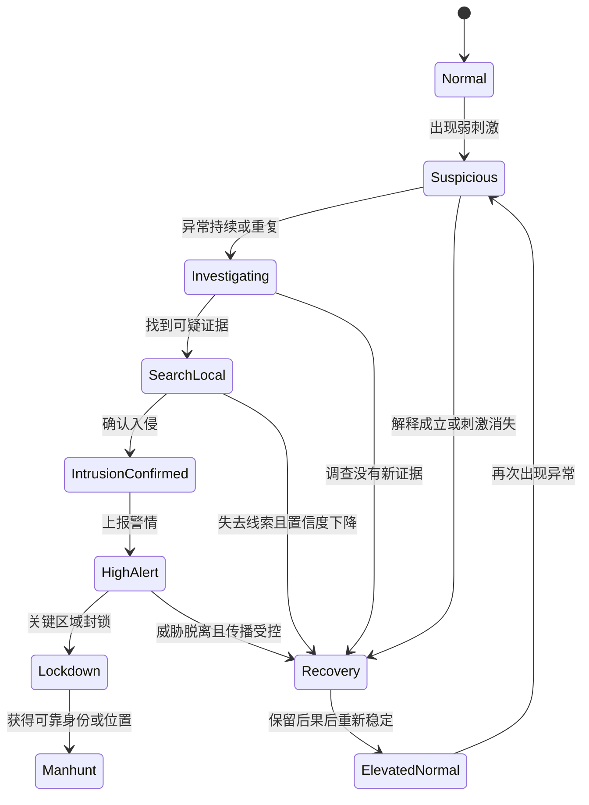

# 潜行游戏的可恢复暴露循环：警戒升级、信息传播与补救空间

> 系列：游戏系统的共同语言
>
> 状态：可发布候选
>
> 核心问题：潜行失败怎样从“立即读档”变成一段仍可判断、可补救、但会留下后果的玩法？

[系列目录](../blog.html) · [上一篇](./extraction-transaction-boundary.html) · [下一篇](./authoritative-time-source.html)

潜行游戏里最令人沮丧的时刻，未必是被守卫抓住。

更常见的挫败是：守卫刚看见玩家一眼，整张地图立刻知道玩家的精确位置；所有敌人同时拔枪；警报永久拉满；先前的侦察、伪装和路线准备全部失去意义。

玩家当然犯了错，但系统没有让这个错误发展成新的局面，只把它变成了读档按钮。

我认为，潜行游戏真正值得设计的并不是“永远不被发现”，而是敌人如何从零散迹象逐步形成判断，以及玩家如何在判断尚未完全收拢之前改变局面。

## 先说结论：可恢复暴露循环，就是“被发现了也还有救”

先定义本文最重要的概念。

**可恢复暴露循环（即“被发现了也还有救”）**：玩家暴露后，警戒和敌人行动发生升级，但玩家仍能通过脱离、误导、切断传播或改变身份回到可继续行动的状态。

这里的“有救”不是免费撤销错误。

玩家可能已经失去一条路线、一套伪装或一段行动时间；某些门会被封锁，巡逻会变密，尸体和破坏痕迹也不会消失。恢复只意味着任务仍然有可以理解的后续，而不是世界假装什么都没发生。

因此，一个完整循环至少包含：

1. 玩家留下迹象；
2. 局部敌人获得信息；
3. 敌人产生怀疑并调查；
4. 新证据让警戒继续升级；
5. 玩家脱离、误导或阻断信息；
6. 敌人的置信度下降；
7. 世界进入一个带有后果的新稳定状态。

关键不在于“有没有警报”，而在于警报是怎样形成、传播、升级和下降的。

## 感知不对称：双方看到的不是同一份真相

**感知不对称（即“双方看到的不是同一份真相”）**：玩家、守卫和安防设备只能从各自位置与能力出发，获得局部且可能过时的信息。

潜行成立的基础，就是双方看到的不是同一份真相。

玩家知道自己藏在通风管后面，却未必知道摄像头是否拍到了背影。守卫听见金属落地声，却未必知道那是玩家失误、设备故障，还是故意制造的诱饵。

如果守卫能够绕过这些信息限制，直接读取玩家当前坐标，潜行就不再是信息博弈，只剩下系统是否愿意暂时装作没看见。

为了避免这种情况，需要再区分两个正式概念。

**世界真实状态（即“事情实际上怎样”）**：游戏世界中已经发生、但不一定被任何角色知道的完整事实。

**敌人认知状态（即“守卫以为事情怎样”）**：某个敌人根据感知、记忆、证据和他人报告建立的局部判断。

例如，事情实际上怎样，可能是：

- 玩家已经换上维修人员制服；
- 西侧摄像头被玩家关闭；
- 一名守卫在仓库里失去意识；
- 目标文件已被取走；
- 玩家正在从地下通道撤离。

而守卫以为事情怎样，可能只是：

- 维修区出现了一个身份未确认的人；
- 西侧监控信号异常；
- 仓库守卫暂时没有回应；
- 文件是否丢失尚未确认；
- 最后一次可疑脚步声来自一楼走廊。

两份状态之间的差距，才给观察、伪装、诱饵、藏匿和切断通信留下发挥空间。

## 发现进度：让守卫“逐渐看清”，而不是一眼定罪

**发现进度（即“逐渐看清”）**：敌人对一个刺激进行识别和确认时，随时间积累并可因条件变化而衰减的认知量。

逐渐看清比“未发现／已发现”更适合表达很多日常潜行情境：

- 玩家从走廊尽头短暂经过；
- 伪装身份进入了权限略有不符的区域；
- 守卫听见一次不确定的碰撞声；
- 摄像头只拍到模糊轮廓；
- 门被打开，但也可能是同事刚刚通过；
- 玩家在被盘问时及时离开了禁区。

敌人获得的信息越清晰、持续时间越长、行为越不合理，进度就越接近确认。距离拉远、遮挡出现、身份解释成立或刺激被证明无害，进度则可以停止或下降。

这段时间不是系统故意放水，而是把“识别一个异常”表现为过程。

玩家因此得到一个很重要的反馈窗口：

- 现在只是引起注意，还是身份已经确认？
- 停下奔跑是否还能装作正常？
- 立刻离开禁区是否来得及？
- 是否应该出示凭证？
- 是否需要制造另一个更合理的声音？

好的潜行反馈会帮助玩家理解自己为什么正在被识别，却不会把所有守卫的内部状态做成全图透视。

## 警戒状态机：从起疑到封锁的台阶

**警戒状态机（即“从起疑到封锁的台阶”）**：用一组有明确进入条件、行为变化和退出条件的阶段，描述敌方警戒如何演化。

一套完整的台阶可以写成：

这不是要求所有游戏都使用相同的英文状态，而是提醒设计者：每一级都应该改变世界行为。

- 起疑时，守卫朝声音方向看去。
- 调查时，守卫离开固定巡逻路线。
- 局部搜索时，敌人检查藏身点和附近出口。
- 确认入侵后，守卫尝试报告并请求支援。
- 高度警戒时，摄像头转向敏感区域，门禁权限收紧。
- 封锁时，部分出口关闭，身份检查变严。
- 追捕时，敌人才围绕可靠位置和路线组织拦截。

玩家面对的不是一个突然翻转的失败开关，而是一段越来越困难、仍能读懂的局势变化。

## 最后已知位置：守卫最后确定你在哪

**最后已知位置（即“守卫最后确定你在哪”）**：敌人在某一时刻通过可靠感知确认的目标位置，以及该信息产生的时间和置信度。

守卫最后确定你在哪，不等于知道你现在在哪。

当玩家脱离视线后，敌人可以：

1. 前往那个位置；
2. 检查附近的门、通道和藏身点；
3. 根据脚步、开门或破坏痕迹更新判断；
4. 推测几条可能逃跑路线；
5. 随时间降低旧信息的可信度。

如果玩家已经绕到另一层，守卫仍然直接朝玩家当前坐标奔跑，那么搜索只是披着动画外衣的追踪。

真正的搜索应该允许玩家利用敌人的旧判断：

- 在转角制造假声音；
- 从搜索圈边缘反向穿过；
- 改变衣着或通行身份；
- 打开一扇门，却从另一条路线离开；
- 让敌人追逐一条合理但错误的线索。

潜行由此从“躲开视锥”升级为“管理对方的判断”。

## 信息传播延迟：一个守卫知道，不等于全地图都知道

**信息传播延迟（即“一个守卫知道，不等于全地图都知道”）**：信息从发现者传递给其他角色或系统时，由报告动作、通信网络、设备状态和距离产生的时间与范围限制。

一个守卫知道，不等于全地图都知道。

他可能需要：

- 说完一段无线电报告；
- 跑到警报器旁；
- 接入仍有电力的安防网络；
- 先确认目标身份；
- 把录像传回监控室；
- 等待主管批准封锁。

玩家则可以在这段传播过程中采取行动：

- 在报告完成前打断通信；
- 切断某个网段或备用电源；
- 伪造低优先级警报；
- 让监控室误判设备故障；
- 控制局部门禁，延迟支援到达；
- 清理尚未被其他人发现的证据。

这让无线电、摄像头、警报器、门禁和电力不再只是关卡装饰，而成为真正的信息网络。

当然，延迟也不能变成纯粹照顾玩家的固定宽限期。它应该由世界中的可见结构解释：无线电可用时传播快，通信被切断时只能靠人员接力；监控室在线时录像会被集中处理，离线摄像头则只留下局部异常。

## 证据持久性：留下的痕迹不会自己消失

**证据持久性（即“留下的痕迹不会自己消失”）**：尸体、血迹、失窃物、破坏设备、门禁日志等事实在警戒下降后仍能继续影响世界。

留下的痕迹不会自己消失，是恢复机制保持可信的关键。

如果玩家切断视线十秒钟，所有守卫便忘记尸体、打开的金库和失联同伴，系统虽然恢复了潜行，却同时取消了玩家行为的后果。

更合理的做法是区分：

- 敌人是否还知道玩家当前在哪；
- 敌人是否仍然知道这里发生过入侵；
- 某项证据是否已经被发现；
- 警戒网络是否仍在传播该信息；
- 玩家身份是否已经进入通报名单。

玩家可以甩掉追兵，但不能自动抹除已经成立的事实。

## 新常态：警报降了，但世界没失忆

**新常态（即“警报降了，但世界没失忆”）**：高警戒结束后，世界恢复为可继续行动的稳定状态，同时保留由先前暴露造成的部分改变。

警报降了，但世界没失忆，可能表现为：

- 巡逻路线变密；
- 关键门继续上锁；
- 一套伪装已被列入黑名单；
- 守卫开始两人一组行动；
- 被破坏的摄像头仍然离线；
- 已发现的尸体继续被看守；
- 次要出口关闭，玩家必须启用备用撤离点；
- 后续任务中的通缉或安防预算上升。

这使恢复既不是立即失败，也不是免费重置。

玩家重新获得计划空间，却必须面对自己制造的新条件。一次失误由此变成故事：“原计划从正门伪装进入，身份暴露后切断了西区通信，最后放弃次要目标，从地下通道撤出。”

## 这套循环与相邻类型有什么区别

很多类型都会使用有限信息、搜索和压力恢复，但它们并不因此成为同一种潜行系统。

| 类型 | 主要管理对象 | 暴露或压力后的核心变化 | 与本文模型的边界 |
|---|---|---|---|
| 潜行游戏 | 敌人知道什么、信息如何传播 | 调查、搜索、封锁、恢复 | 认知控制本身就是主要玩法 |
| 生存恐怖 | 资源、身体脆弱、未知威胁 | 追逐、消耗、安全窗口 | 信息有价值，但资源压力同样决定路线 |
| 沉浸式模拟 | 可组合系统与多路径解题 | 世界规则重新组合 | 潜行只是系统性解题的一种路径 |
| 盗窃计划模拟 | 情报、计划、安防拓扑与撤离 | 启用备用方案、放弃收益 | 更强调行动前侦察和计划崩坏后的应急分支 |
| 社交推理 | 个人知识、公开声明与可信度 | 讨论、证据、投票 | 认知主体主要是真人，系统不替玩家判断谎言 |
| 战术射击 | 火力、位置与战斗协同 | 交火、压制、增援 | 战斗是主要解法；潜行中战斗通常会扩大信息暴露 |

生存恐怖也需要压力下降，否则持续高压会让玩家麻木；沉浸式模拟也要求角色不能读取全局真相；社交推理同样区分客观事实与个人认知。

本文模型的特殊之处，是把这些原则收拢到一个问题上：玩家能否通过控制线索、认知与传播，让暴露后的局面重新变得可操作。

## 一份潜行系统检查表

### 感知

- 敌人是否只根据实际感知和证据行动？
- 视觉、声音、身份异常和场景痕迹是否提供不同强度的信息？
- 短暂刺激是否会经过识别过程，而不是立即确认入侵？
- 玩家能否理解自己为什么引起怀疑？

### 认知与搜索

- 世界事实与单个敌人的认知是否分开保存？
- 敌人失去视线后，是否围绕最后可靠信息搜索？
- 旧信息是否会随时间降低置信度？
- 诱饵、伪装和路线误导是否真的能改变敌人判断？

### 传播

- 局部发现是否需要通过可见渠道传播？
- 通信、电力和安防网络是否影响传播范围与速度？
- 玩家是否能打断、延迟或伪造一次报告？
- 敌人共享的是“发现了异常”，还是不合理的精确坐标？

### 升级与恢复

- 警戒是否有多个行为明确不同的阶段？
- 每一级是否都有可以理解的进入与退出条件？
- 暴露后是否存在至少一种高成本但可靠的补救方式？
- 警戒下降后，世界是否保留合理后果？
- 一次普通失误是否只剩立即读档这一个最优选择？

## 结语：潜行不是不被看见，而是管理别人知道什么

把潜行理解成“避开视野扇形”，很容易得到一套脆弱的二元系统：没被发现时一切正常，被发现后整套玩法结束。

把潜行理解成认知管理，设计问题就会发生变化：

- 敌人从哪里得到信息？
- 信息有多可靠？
- 谁已经知道？
- 信息怎样传播？
- 玩家如何制造另一种解释？
- 警戒下降后，世界还记得什么？

可恢复暴露循环的价值，并不是降低潜行难度。

它让错误产生后果，让后果形成新局面，也让玩家仍然有机会凭观察、准备和临场判断把局面救回来。

完美潜入让玩家证明计划有效。

计划崩坏后仍能撤出，才让玩家证明自己真的理解了系统。

## 术语对照

| 正式术语 | 文中通俗称呼 | 含义 |
|---|---|---|
| 可恢复暴露循环 | 被发现了也还有救 | 暴露会升级局势，但仍可通过行动回到可继续的状态 |
| 感知不对称 | 双方看到的不是同一份真相 | 不同角色只能获得局部且可能过时的信息 |
| 世界真实状态 | 事情实际上怎样 | 世界中已经成立的完整事实 |
| 敌人认知状态 | 守卫以为事情怎样 | 敌人依据感知、证据、记忆与报告形成的判断 |
| 发现进度 | 逐渐看清 | 对刺激的识别随时间积累或衰减 |
| 警戒状态机 | 从起疑到封锁的台阶 | 敌方警戒逐级演化的状态与规则 |
| 最后已知位置 | 守卫最后确定你在哪 | 敌人最近一次可靠确认的目标位置 |
| 信息传播延迟 | 一个守卫知道，不等于全地图都知道 | 信息传播受报告动作和网络结构限制 |
| 证据持久性 | 留下的痕迹不会自己消失 | 已成立的痕迹在警戒下降后仍影响世界 |
| 新常态 | 警报降了，但世界没失忆 | 恢复可行动状态，同时保留暴露造成的改变 |

## 内部资料依据

以下链接用于仓库内部审稿与追溯，不是公开版最终引用：

- [生存恐怖：有限资源、威胁不确定性与压力循环](../journal/survival-horror.html)
- [沉浸式模拟：系统性世界、可组合能力与多路径解题](../journal/immersive-sim.html)
- [盗窃计划模拟：侦察、安防拓扑与应急分支](../journal/heist-planning.html)
- [社交推理：个人知识、公开叙事与证据](../journal/social-deduction-hidden-identity.html)

公开发布前应补充公开案例或公开设计资料，并把内部路径替换为稳定公开链接。
