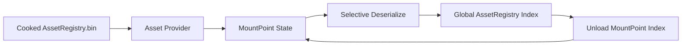

# 索引驻留与可重试恢复：UE6 AssetRegistry ActiveMounts 的 Current/Target 状态机

> 系列：从 Unreal Engine 源码理解引擎设计
>
> 日期：2026-09-08
>
> 状态：草稿
>
> 核心问题：内容 MountPoint 被卸载后，如果只想释放 AssetRegistry 索引内存而不是卸载实际 Package 和 UObject，怎样建立可以接受反向请求、失败重试和安全回调的异步驻留状态机？
>
> 关键词：Unreal Engine、AssetRegistry、ActiveMounts、State Machine、Retry

[系列目录](../blog.html)

一个大型客户端支持：

```text
按区域
DLC
GameFeature
```

动态挂载内容。

即使某个区域已经离开，

它对应的：

```text
AssetRegistry FAssetData
```

仍然可能留在全局索引里。

内容越多，

仅仅是：

```text
“世界上有哪些 Asset”
```

这份索引本身就可能占用明显内存。

于是产生一个需求：

```text
MountPoint 暂时不使用时
把对应 AssetRegistry 索引数据移走。

以后重新 Mount
再恢复。
```

这个需求看起来像：

```text
资源卸载。
```

但实际上并不是。

## 先说结论：ActiveMounts 管的是“资产索引是否驻留”，不是“资产文件和对象是否存在”

**索引驻留（后文简称“AssetRegistry 现在还记不记得这些 Asset”）**：控制 cooked `AssetRegistry.bin` 中对应 MountPoint 的 `FAssetData`、路径缓存等是否存在于全局 AssetRegistry 内存中。

它不会自动替代：

- Pak/IoStore mount；

- LoadPackage；

- AsyncLoading2；

- UObject GC；

- AssetManager；

- GameFeature State Machine。


可以表示为：



所以：

```text
ActiveMounts Unloaded
```

不等于：

```text
UObject 已经释放。
```

## 系统边界必须先说清楚

ActiveMounts 可能移除：

- FAssetData；

- Path Cache；

- Verse File Record；

- MountPoint Path State。


但它不负责：

```text
Pak File 是否挂载
Package 是否已经 Load
UObject 是否还活着。
```

这是典型的：

> **索引生命周期和实体生命周期分离。**

如果把这两个层次混淆，

开发者可能以为：

```text
AssetRegistry Unload 成功
→
内存中的 Mesh / Texture 全都已经释放。
```

结果错误判断内存预算。

## Enabled、Created、Active 是三层状态

配置启用：

```text
不等于 Loader 已经真正可以工作。
```

一套更精确的理解是：

```text
Config Enabled
↓
Wrapper 创建 Inner Loader
↓
ActiveMountsInitialize
↓
Loader Active
↓
才允许真实 unload/load。
```

初始化之前：

```text
Load
```

可能只意味着：

```text
本来就还没有卸载任何索引
所以无事可做。
```

而：

```text
Unload
```

却可能属于非法时序。

所以：

**启用意图和运行阶段（后文简称“功能允许存在，不代表现在已经到了可以执行副作用的阶段”）**

必须分开。

## Provider 和 MountPoint 是两个不同身份层

一个：

```text
AssetRegistry.bin
```

对应：

**Asset Provider（后文简称“以后重新把索引读回来的磁盘来源”）**。

一个 Provider 可以包含：

```text
多个 MountPoint。
```

而每个 MountPoint 自己维护：

```text
CurrentState
TargetState。
```

这意味着：

```text
Provider
```

回答：

```text
去哪里读？
```

MountPoint 回答：

```text
这一片索引现在应该处于什么状态？
```

## CurrentState 和 TargetState 分开非常关键

异步系统里最棘手的情况通常不是：

```text
Load
→
完成。
```

而是：

```text
正在 Load
↓
突然收到 Unload
```

或者：

```text
正在 Unload
↓
突然又 Load。
```

如果只有：

```text
State = Loading
```

系统不知道：

```text
当前动作结束以后
真正应该收敛到哪里。
```

所以：

**目标状态（后文简称“无论现在正在做什么，最后我想停在哪”）**

应该和：

**当前状态（即“现在实际进行到哪一步”）**

分开。

例如：

```text
Current = Loading
Target = Unloaded。
```

并不需要强制：

```text
取消底层正在进行的所有 IO。
```

可以让当前操作先安全结束，

然后继续收敛到新的 Target。

## 目标覆盖比硬取消更容易维护一致性

异步 IO 已经进入：

```text
文件读取
反序列化
Consume State
```

时，

强制打断可能非常复杂。

Current/Target 模式允许：

```text
Request A
被 Request B 覆盖
```

而不是要求：

```text
所有底层阶段都必须支持精确 Cancel。
```

这和很多 Streaming / Residency 系统共享同一种收敛思想：

> **允许请求变化，但让状态机始终有明确最终稳定态。**

## Load 和 Unload 的合批方向并不相同

恢复索引时：

```text
同一个 Provider
```

里的多个 MountPoint 可以共享一次文件读取 / 选择性反序列化。

所以：

```text
Load
```

天然适合：

```text
按 Provider 合批。
```

而 Unload 修改的是：

```text
Global Registry 中的 MountPoint 数据。
```

可以跨 Provider 按 MountPoint 合并处理。

这说明 Batch Key 不应该为了 API 对称而强行一致。

真正应该围绕：

```text
哪一项昂贵工作可以共享。
```

选择批次边界。

## Callback 不是状态快照

一个异步 API 最危险的设计之一是：

```text
OnComplete(canceled)
```

然后调用方把：

```text
canceled
```

直接解释成：

```text
最终没有加载。
```

ActiveMounts 中 canceled 可能来自：

- feature disabled；

- shutdown；

- 相反请求覆盖；

- reload failure。


所以回调只说明：

```text
这次请求怎样收口。
```

不一定说明：

```text
当前 MountPoint 最终是什么状态。
```

因此调用方仍需要：

```text
ActiveMountsIsLoaded()
```

查询真正状态。

这是一条非常值得迁移的异步 API 原则：

> **Completion Result 描述一次请求，State Query 描述系统事实。**

不要互相代替。

## 事件必须在锁外广播

状态机内部需要锁保护：

- Current；

- Target；

- Subscriber；

- Provider 状态。


但如果持锁时直接执行：

```text
User Callback，
```

Callback 可能：

```text
重新调用 Load / Unload
```

形成：

- 重入；

- 锁顺序反转；

- 死锁。


所以更安全的流程是：

```text
Lock
→
更新内部状态
→
累积 Completion Event
→
Unlock
→
执行 Callback。
```

**锁外通知（后文简称“锁只保护事实，不能把用户代码一起锁进去”）**

是状态机的核心安全合同。

## Wait 同样不能发生在 ActiveMountsLock 内

更隐蔽的问题是：

```text
Main Thread
持锁
→
Wait Worker。
```

但 Worker 完成时又需要：

```text
重新取得同一把锁
```

做收尾。

这就是标准死锁。

所以注册、注销和 Shutdown 更适合拆成：

```text
Start
↓
Release Lock
↓
Wait / Join
↓
Reacquire
↓
Finish。
```

等待不是：

```text
为了安全所以一直把锁拿住。
```

恰恰相反：

> **如果异步任务的收尾也需要这把锁，等待时必须把锁让出去。**

## Reload 失败以后必须落回一个可重试状态

一次 Provider Reload 失败，

最危险的状态是：

```text
Current = Loading
```

永久卡住。

或者进入：

```text
Error
```

但没有正式重试入口。

更新后的设计选择：

```text
Reload Failure
→
MountPoint 回退 Unloaded。
```

这样未来：

```text
LoadAsync
```

仍然能够重新尝试。

这就是：

**可重试失败（后文简称“失败以后仍然回到一张合法状态图上”）**。

失败不是一个无法离开的异常角落。

## Retry 并不等于隐藏无限重试

可以重试，

不意味着系统应该：

```text
无限自动重试。
```

真正重要的是：

```text
失败后状态仍可解释
```

以及：

```text
下一次明确请求仍然有合法入口。
```

重试策略可以由更高层根据：

- 错误类型；

- 用户行为；

- 网络 / 磁盘；

- GameFeature；


决定。

## Subscriber 是批次完成屏障

一次 API 调用可能请求：

```text
Load A
Load B
Load C。
```

调用方期待：

```text
三个都真正收口后
再收到最终 Callback。
```

所以系统需要：

**Batch Completion Barrier（后文简称“这批请求全部有结果以后再告诉上层”）**。

它维护：

```text
RemainingCount
WasCanceled。
```

而不是让三个 MountPoint 分别触发最终业务回调。

这让 API 的一次调用仍然拥有清晰 Completion Identity。

## 与 Pak / IoStore Mount 的边界

ActiveMounts 不决定：

```text
内容文件还能不能从磁盘访问。
```

那属于 PlatformFile / IoStore 等更底层系统。

所以：

```text
Index Unloaded
```

不能被解释成：

```text
Content Container Unmounted。
```

## 与 AsyncLoading2 的边界

AsyncLoading2 负责：

```text
Package / UObject Load。
```

AssetRegistry ActiveMounts 只负责：

```text
Asset Discovery Index。
```

一个 Asset 可以：

```text
已经有 UObject 活着
但 Registry Entry 当前被移除。
```

这并不矛盾。

## 与 AssetManager 的边界

AssetManager 负责：

```text
Primary Asset 策略
Bundle
业务级资源组织。
```

它消费 AssetRegistry。

但它不是 ActiveMounts 的替代品。

## 常见失败

### 把 ActiveMounts 当 Pak Unmount

系统边界错误。

### Config Enabled 就认为 Loader Active

忽略初始化阶段。

### CurrentState 和 TargetState 合并

反向请求难以安全处理。

### 所有操作强制 Cancel

底层 IO 和反序列化复杂度上升。

### Callback canceled 被当作最终状态

请求结果和系统事实混淆。

### 持锁执行用户回调

重入与死锁风险。

### 持锁 Wait Worker

Worker 无法取得锁完成收尾。

### Reload Failure 卡在 Loading

失去正式重试路径。

## 我的 ActiveMounts 检查表

1. 当前管理的到底是 Index 还是实际 Asset？

2. Provider 与 MountPoint 是否分离？

3. Config、Loader Exists、Active 是否分层？

4. Current 与 Target 是否分别保存？

5. 相反请求是否可以覆盖 Target？

6. 底层操作是否真的需要 Hard Cancel？

7. Load Batch 是否围绕共享 Provider IO？

8. Completion Callback 是否区别于 State Query？

9. Callback 是否始终锁外执行？

10. Wait 是否在锁外？

11. Shutdown 是否不会持锁 Join Worker？

12. Failure 是否回到合法可重试状态？

13. Retry Policy 是否由明确 Owner 控制？

14. Batch Subscriber 是否拥有清晰 Completion Barrier？

15. Debugger 是否能同时显示 Current / Target / Provider / Pending Work？


ActiveMounts 最值得学习的地方不是：

```text
UE 可以动态卸载 AssetRegistry。
```

而是这套状态管理方法：

> **异步资源系统真正稳定的关键，不是保证每一个请求都成功，而是保证请求改变、失败、回调和等待发生以后，系统仍然能够回到一张可解释、可继续收敛的状态图。**

## 术语对照

|正式术语|通俗称呼|
|---|---|
|Index Residency|AssetRegistry 现在还记不记得这些 Asset|
|Asset Provider|重新读取索引的磁盘来源|
|Current State|现在实际进行到哪一步|
|Target State|最后真正想停在哪|
|Lock-out Callback|锁只保护事实，不把用户代码一起锁进去|
|Retryable Failure|失败以后仍然回到合法状态图|
|Completion Barrier|一批请求全部有结果后再通知|

## 内部资料依据

- `notes/UnrealEngine源码研究/UE6/11_AssetRegistryActiveMounts从MountPoint状态机到AssetProvider重载_失败回退与可重试契约.md`

- `notes/UnrealEngine源码研究/UE5/14_AssetRegistry到PrimaryAsset_发现规则与异步句柄.md`

- `blogs/从UnrealEngine源码理解引擎设计/02-UnrealEngine的资源生产线.md`

- `blogs/从UnrealEngine源码理解引擎设计/03-AsyncLoading2对象发布协议.md`

- `blogs/README.md`


本文依据 UE6-main 源码静态研究与后续增量复核整理。研究材料已经定位后续 ActiveMounts 专项测试代码，但本轮研究没有实际构建 Unreal Engine 或运行这些测试，因此不把“存在测试入口”表述成“本地已经验证通过”。
