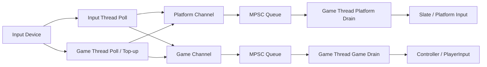

# 输入新鲜度与重入安全：UE6 Input Thread 的设备轮询、双通道 Drain 与快照所有权

> 系列：从 Unreal Engine 源码理解引擎设计
>
> 日期：2026-09-08
>
> 状态：草稿
>
> 核心问题：为了降低输入采样延迟，把设备轮询移到独立线程以后，怎样避免主线程阻塞、输入映射错位、旧输入回放，以及 Slate 重入 Drain 破坏正在消费的事件批次？
>
> 关键词：Unreal Engine、Input Thread、Slate、MPSC、Input Freshness、Reentrancy

[系列目录](../blog.html)

假设游戏运行在：

```text
60 FPS。
```

主线程每：

```text
16.67ms
```

推进一次。

如果输入设备也只在 Game Thread 的固定位置轮询一次，

玩家在这一轮 Poll 刚结束以后按下按钮，

这个输入可能要等到下一帧才被看到。

于是一个很自然的优化是：

```text
独立 Input Thread
以更高频率轮询设备。
```

例如：

```text
120Hz。
```

输入确实可能更新鲜。

但问题也随之出现。

现在同一套输入系统同时面对：

- 后台 Poll；

- Game Thread Poll；

- 平台键鼠；

- Controller；

- Modal Window；

- Focus；

- User Mapping；

- 多个生产者；

- 单消费者；

- Slate Callback 重入；

- Runtime Start / Stop。


如果只是：

```text
开一个线程
不断把 Event push 到队列，
```

很快就会遇到另一组问题：

```text
按键被分配给错误的用户

Modal 结束后突然回放一大批旧手柄输入

Game Thread 为了追求“最新输入”反而阻塞等待 Input Thread

一个 Slate Handler 在 Drain 过程中又泵了一次 Slate
把外层正在遍历的数组重置掉。
```

所以 UE6 当前 Input Thread 最值得研究的地方并不是：

> “Unreal 把输入放进后台线程了。”

而是一整套围绕**新鲜度、线程所有权和重入**建立的消费协议。

## 先说结论：后台线程负责尽快采集，Game Thread 仍然拥有最终输入提交权

**输入新鲜度协议（后文简称“后台尽量早点拿到输入，主线程仍然决定什么时候正式消费”）**：设备可以根据线程能力在 Input Thread 或 Game Thread 上轮询，事件进入并发队列，但最终由 Game Thread 按明确通道和顺序 Drain，再交给 Slate / PlayerInput。

当前主链可以压缩成：



这里最重要的边界是：

```text
Input Thread
不是第二个 Gameplay Thread。
```

它负责：

```text
更早地观察设备。
```

而不是：

```text
直接在后台调用任意 Slate / Gameplay Handler。
```

## “配置想开”和“线程真的在跑”是两个不同状态

Input Thread 是否运行，不只是：

```text
input.UseInputThread = 1。
```

还取决于：

- 平台是否支持；

- 进程类型；

- 是否允许交互输入；

- commandlet / unattended 规则；

- Startup 是否真的完成。


因此：

**运行意图（后文简称“配置希望它开着”）**

和：

**实际运行状态（后文简称“线程此刻真的存在并正在生产”）**

必须分开。

这类区分非常普遍：

```text
Requested
≠
Started。
```

如果系统只保存一个：

```text
Enabled
```

Boolean，

Shutdown、Restart、动态配置都会变得难以解释。

## 生命周期顺序必须先建立转发目标，再启动生产者

Input Thread 启动大致需要：

```text
Game Thread
→
安装 Message Handler Proxy
→
创建 Runnable
→
启动 Input Thread。
```

退出则需要反方向：

```text
Stop Signal
→
Join Thread
→
确认生产者已经停止
→
再移除 Proxy。
```

为什么不能：

```text
先 Remove Proxy
→
再 Stop Thread？
```

因为线程仍可能正在生产事件。

它会继续向：

```text
已经撤销的转发目标
```

写数据。

所以：

> **先停生产者，再拆消费者依赖。**

这是一条非常通用的并发 Shutdown 原则。

## Runtime CVar 变化也不能假装整个生命周期线程安全

一个整数 CVar 可以从多个线程安全修改。

但：

```text
创建 Runnable
安装 Proxy
Stop
Join
重新接管 Device Handler
```

这一整套生命周期不因此自动成为：

```text
任意线程安全。
```

所以 Input Thread 的完整 start/stop reconcile 仍然属于 Game Thread。

这里体现了一条值得迁移的工程判断：

> **“配置字段是原子的”不能推出“配置控制的整个对象图也是跨线程可重构的”。**

## 修改 Message Handler 前，需要先暂停生产者

如果 Slate 准备替换某些底层 Message Handler，

正在运行的 Input Thread 可能恰好：

```text
Poll
→
准备向旧 Handler 写入。
```

因此系统会先建立一个短暂：

**结构变更窗口（后文简称“改线路以前先把正在送数据的人停下来”）**。

进入窗口时：

```text
记录线程是否真的 Running
→
Stop / Join。
```

退出以后：

```text
只有进入前确实在运行
→
才恢复。
```

注意这里保存的是：

```text
Actual State。
```

而不是：

```text
Configuration Intent。
```

否则可能出现：

```text
配置想开
但因为平台 gate 实际没运行

ScopedSuspend 结束
却错误启动了一条此前不存在的线程。
```

## 设备需要明确自己的线程亲和性

不是所有输入设备都适合在后台线程 Poll。

因此设备可以表达：

```text
GameThreadOnly
```

或者：

```text
InputThreadSafe。
```

这意味着：

```text
Input Thread 开启
```

以后，

Game Thread 仍然不能完全停止 Poll。

某些平台设备仍然只能：

```text
在 Game Thread 访问。
```

**设备线程亲和（后文简称“这个设备究竟允许谁来问它”）**应该成为设备接口的一部分。

否则底层平台 API 的线程限制会被隐藏在实现细节里。

## 标记 InputThreadSafe 不是改一个 Enum 就结束

如果一个设备声明：

```text
InputThreadSafe，
```

意味着它内部所有会被 Input Thread 观察的共享状态也必须满足并发条件。

例如：

```text
高精度鼠标状态
```

如果此前默认只由主线程读写，

现在后台线程也会访问，

就需要重新检查：

- Atomic；

- Lock；

- Message Ordering；

- Lifetime。


这是并发系统很典型的“传染性”：

> **线程安全不是某个接口的标签，而是整条被访问状态链的合同。**

## 120Hz Poll 仍然可能留下 8ms 左右的窗口

假设 Input Thread：

```text
120Hz
→
约 8.33ms 一次 Poll。
```

Game Thread 准备 Drain 时，

最近一次后台 Poll 可能刚刚发生在：

```text
8ms 以前。
```

于是系统还提供：

**Game Thread Top-up（后文简称“主线程提交前再试着问一次设备有没有新东西”）**。

它不是替代后台 Poll。

而是在最终消费前尽量缩短：

```text
Last Device Sample
→
Game Thread Drain
```

的距离。

## Top-up 最关键的设计是 TryLock，而不是“保证拿到最新输入”

Input Thread 正在进行完整 Poll Pass 时，

Game Thread Top-up 如果：

```text
等待锁
```

就可能为了：

```text
少几毫秒输入延迟
```

反过来：

```text
卡住整帧。
```

所以 Game Thread 使用：

```text
TryLock。
```

抢不到：

```text
直接跳过这次 Top-up。
```

这表达了非常清楚的优先级：

```text
更更新鲜的输入
是优化。

Frame 不被后台输入线程阻塞
是硬约束。
```

**非阻塞新鲜度优化（后文简称“有机会就拿更新的数据，没机会不能卡住主线程”）**

是这条路径最值得迁移的思想之一。

## 输入不只一条队列，因为不同输入拥有不同消费语义

当前系统把输入大体拆成两条 channel。

### Platform Channel

主要承担：

- Keyboard；

- Mouse；

- Platform Input；

- Text / Character 相关前置事件。


它需要：

```text
无条件 Drain。
```

### Game Channel

主要承担：

- Controller；

- Gamepad。


它仍然受：

- Modal；

- Focus；

- Debug Guard；


等条件影响。

两条通道存在的原因不是：

```text
为了分类好看。
```

而是：

> **它们在某些状态下拥有不同的“是否应该继续消费”规则。**

## Platform Input 为什么不能套用 Gamepad Guard

想象一个 Modal Window：

```text
正在等待用户键盘输入。
```

如果 Platform Channel 也因为：

```text
Modal Window Active
```

被禁止 Drain，

就会出现：

```text
窗口因为 Modal
禁止键盘输入

但窗口本身
正在等待键盘输入。
```

形成逻辑闭环。

所以 Keyboard / Character 等平台输入必须仍能进入 Slate。

这说明输入分类不能只看：

```text
设备类型。
```

还要看：

```text
消费语义。
```

## Game Channel 在被抑制时应该丢弃旧 Backlog

假设 Controller Input 因为窗口失焦：

```text
5 秒没有被 Gameplay 消费。
```

如果这 5 秒事件继续积压，

窗口恢复以后：

```text
一次性回放
5 秒前按下的攻击、移动和菜单操作。
```

这对实时交互显然非常危险。

所以被 Guard 抑制期间，

更合理的是：

```text
Drain
但不 Dispatch。
```

也就是：

```text
Discard old backlog。
```

这表达了一条很重要的输入原则：

> **实时输入的价值会过期。**

旧输入不是日志。

不能因为“可靠”就无限回放。

## 多生产者并不意味着多消费者

后台输入线程、Game Thread Top-up 和不同设备都可能生产事件。

所以事件队列可以是：

```text
MPSC
→
Multi Producer
Single Consumer。
```

关键在：

```text
Single Consumer。
```

最终只有 Game Thread 负责：

```text
ProcessQueuedEvents
DiscardQueuedEvents。
```

这样可以大幅降低：

- Dispatch 顺序；

- Handler 线程安全；

- Slate State；


的复杂度。

**单消费者提交（后文简称“很多人可以上报，只有一个线程正式把它变成 UI / Gameplay 输入”）**

是一个非常适合 Engine Input 的所有权模型。

## 同一个消费者线程仍然可能发生重入

“Single Consumer”

并不等于：

```text
永远不会同时存在两次 Drain 调用。
```

同一个 Game Thread 可以：

```text
外层 Slate Drain
→
执行某个 Handler
→
Handler 打开 Modal Window
→
内部再次 Pump Slate
→
再次调用 Drain。
```

线程没变。

调用栈却重入了。

这就是：

**Nested Drain（后文简称“同一个消费者在还没吃完上一批事件时，又进来吃下一批”）**。

很多所谓“单线程系统”真正危险的问题恰恰来自这里。

## 旧实现的问题是外层和内层共享同一份 Scratch Array

假设外层正在：

```text
for event in MemberEvents
```

遍历。

中间某个 Handler：

```text
触发 nested drain。
```

内层为了取新输入：

```text
Reset / Reuse MemberEvents。
```

外层 Iterator 立刻失效。

于是得到：

```text
Array changed during ranged-for。
```

这里没有：

```text
两个线程同时访问 Vector。
```

问题仍然是：

```text
Ownership。
```

外层并没有真正拥有自己正在遍历的快照。

## 修复方式是每次 Drain 拿走自己的局部 Snapshot

更稳健的结构是：

```text
Outer Drain
→
把 Member Scratch move 到 Local Snapshot
→
Member Scratch 立即变空

Handler Reenter
→
Nested Drain
→
只处理后来进入的新事件
→
拿自己的 Local Snapshot

Nested 完成
→
Outer 继续遍历原来那份 Local Snapshot。
```

于是：

```text
每一次 Drain
拥有自己独立的 Event Batch。
```

**快照所有权（后文简称“我开始消费以后，这一批就是我的，后面的重入不能再改它”）**

解决的不只是 Array Iterator。

它建立了：

```text
消费批次
```

的正式生命周期。

## Snapshot 的真正价值是冻结当前调用的事实

这条原则可以迁移到很多系统：

```text
Event Dispatch
Observer Notification
UI Callback
Command Execution
Plugin Iteration。
```

只要 Callback 可能：

```text
重新进入同一 Dispatcher，
```

就要小心：

```text
外层正在读的集合
```

是否还会被内层复用或修改。

一个可靠模式就是：

```text
入口
→
取得本轮 Snapshot Ownership

重入
→
只能看到之后产生的新状态。
```

## Timestamp Sort 解决多生产者调度不等于真实输入顺序

多个 Producer 入队时，

实际：

```text
Push Queue 顺序
```

可能受到线程调度影响。

所以一次 Drain 会按照：

```text
Capture Timestamp
```

进行 Stable Sort。

Stable 的意义在于：

```text
Timestamp 相同
→
保留原相对顺序。
```

这可以减少：

```text
线程调度差异
```

对用户可见输入顺序的影响。

当然：

```text
Timestamp
```

仍然需要来自可靠统一时间基准。

排序本身不能修复错误时钟。

## Mapping Change 必须作为 Event Stream 中的 Marker

假设 Controller 当前属于：

```text
User A。
```

队列里已经有：

```text
Button1
Button2。
```

随后设备重新映射到：

```text
User B。
```

然后产生：

```text
Button3。
```

如果 Drain 时只是读取：

```text
当前 Device → User Mapping
```

就可能把：

```text
Button1
Button2
```

错误归给：

```text
User B。
```

但它们捕获时明明属于 A。

所以 Mapping Change 自己也必须进入事件流：

```text
Button1
Button2
Mapping A→B
Button3。
```

Drain 遇到 Marker 时：

```text
从这里开始更新 Mapping。
```

于是历史事件和映射变化拥有明确顺序。

**流内元数据（后文简称“会影响事件解释方式的配置变化，也必须和事件一起排队”）**

是一种非常重要的事件系统设计。

## 配置状态不能总用“最新值”解释历史事件

这个问题远不只输入系统。

例如：

```text
Locale Changed
Control Scheme Changed
User Mapping Changed
Rule Version Changed
Camera Mode Changed。
```

如果过去事件在真正消费时使用：

```text
当前最新配置
```

历史含义可能被重新解释。

因此有两种常见策略：

```text
事件捕获时
直接记录需要的解释上下文。
```

或者：

```text
把上下文变化本身放进同一有序事件流。
```

UE6 当前 mapping marker 属于后者。

## Analog Input 可以合并，但 Digital Event 通常不应该

模拟摇杆在一次 Drain 批次里可能产生：

```text
0.11
0.14
0.18
0.20
0.23。
```

对于当前实时控制，

通常真正有价值的是：

```text
本批次最后一个状态。
```

于是可以按照：

```text
(axis/key, device)
```

合并，只保留最后 sample。

这就是：

**Analog Coalescing（后文简称“连续值只保留本轮最新状态”）**。

它降低消费侧工作量。

但：

```text
Button Down
Button Up
```

不能随便合并。

否则一个极短点击可能彻底消失。

所以 Coalescing 必须理解：

```text
State Sample
```

和：

```text
Discrete Event
```

的差别。

## Coalescing 是消费预算，不是生产去重

后台仍然可以完整生产：

```text
所有 Analog Sample。
```

合并发生在：

```text
当前消费批次。
```

这意味着：

- Debug 可以关闭 Coalescing；

- 其他消费者策略可以变化；

- Producer 不需要猜未来谁会需要哪些样本。


这是一种相对干净的职责分层：

```text
Producer
忠实记录

Consumer
决定当前需要多少精度。
```

## Input Thread 没有改变最终规则时间

即使设备在：

```text
120Hz
```

捕获输入，

Gameplay 仍然可能在：

```text
60Hz Fixed Simulation
```

上推进。

输入线程只是让：

```text
这一 Tick 到来时
能拿到更接近当前时刻的设备事实。
```

它不会自动让 Gameplay：

```text
变成 120Hz。
```

也不会自动改变：

```text
哪个 Tick
正式消费这次输入。
```

所以 Input Sampling 和 Simulation Authority 仍然是两个层次。

## 诊断不能只显示 CVar

如果开发者看到：

```text
input.UseInputThread = 1
```

却发现：

```text
输入线程不存在，
```

这不一定是 Bug。

还需要检查：

- 平台 gate；

- Process mode；

- Startup；

- IsRunning；

- off-thread CVar warning。


更有价值的 Debugger 应该显示：

```text
Intent:
Enabled

PlatformAllowed:
true

ProcessAllowed:
true

ActualState:
Running

PollHz:
120

TopUp:
enabled

LastTopUp:
skipped due lock contention。
```

这样才能区分：

```text
配置
```

与：

```text
运行事实。
```

## 这套设计最值得迁移到哪里

它不仅适用于 Game Input。

### 网络消息

```text
多个 Socket Producer
→
Single Gameplay Consumer

Protocol Mapping Change
→
Stream Marker

Nested Dispatch
→
Local Snapshot。
```

### UI Event Bus

```text
多个事件源
→
UI Thread Drain

Modal Callback 重入
→
Snapshot Ownership。
```

### 编辑器文件监视

```text
多个 OS Watcher
→
Background Queue
→
Main Thread Apply

大量重复 Change
→
Coalesce。
```

### Telemetry

```text
高频 Sample
→
Consumer Batch
→
按语义压缩。
```

真正值得迁移的不是：

```text
再开一个线程。
```

而是：

> **后台生产、主线程提交、流内上下文、有限合并和重入快照共同组成完整协议。**

## 常见设计失败

### 开启 Input Thread 后彻底停止 Game Thread Poll

GameThreadOnly 设备永久失去输入。

### Top-up 为了拿最新状态阻塞等待 Input Thread

输入优化反而制造帧延迟。

### 所有输入都使用同一个 Guard

Modal / Focus 可能把文本和平台输入一起堵死。

### Gamepad Guard 解除后回放所有旧积压

用户收到几秒前已经失去意义的操作。

### MPSC Queue 被多个线程同时 Drain

Handler 和 Slate 状态失去单一提交线程。

### “Single Consumer”被误解成“不可能重入”

Modal / Nested Pump 仍然能在同线程嵌套 Drain。

### 外层和内层 Drain 共用成员 Scratch

内层 Reset 导致外层 Iterator 失效。

### Device Mapping 只在消费时查询当前值

旧事件被错误归给新用户。

### Analog 和 Button Event 使用同一合并逻辑

短按输入被吃掉。

### CVar 是 Atomic，就允许任意线程 start/stop Runnable

配置安全被错误扩展成生命周期安全。

### Stop 时先 Remove Proxy 再 Join

后台 Producer 仍可能写入已经失效的目标。

## 我的 Input Pipeline 检查表

1. 每个 Device 是否声明明确 Thread Affinity？

2. Background-safe 是否真的覆盖 Device 内部共享状态？

3. Input Thread Intent 与 Actual Running State 是否分离？

4. Start 是否先建立 Handler / Proxy，再启动 Producer？

5. Stop 是否先停止并 Join，再删除 Proxy？

6. Runtime reconfiguration 是否只在合法 Owner Thread 提交？

7. GameThreadOnly Device 是否仍有 Poll 路径？

8. Background Poll Rate 与 Gameplay Tick Rate 是否分离？

9. Top-up 是否是 TryLock / non-blocking？

10. Top-up 失败是否只降低输入新鲜度，而不影响正确性？

11. Platform Input 与 Game Input 是否有不同消费规则？

12. Platform Channel 是否不会被 Modal Guard 错误饿死？

13. Game Channel 被抑制时是否处理旧 Backlog？

14. Event Queue 是否明确 Multi-Producer / Single-Consumer？

15. Consumer Thread 是否唯一？

16. 同一 Consumer Thread 是否可能重入？

17. 每次 Drain 是否取得独立 Local Snapshot？

18. Nested Drain 是否只消费之后进入的新事件？

19. Event 是否保存可靠 Capture Timestamp？

20. 多 Producer 批次是否需要 Stable Sort？

21. Mapping / Context Change 是否有流内时序？

22. 历史事件是否不会使用当前最新 Mapping 重新解释？

23. Analog Coalescing 是否按 Device + Axis 隔离？

24. Digital Event 是否避免被连续值策略吞掉？

25. Coalescing 是否属于 Consumer Policy，而不是修改源输入事实？

26. Debugger 是否同时显示 Intent、Gate 与 Actual State？

27. Automation 是否覆盖 nested drain、mapping marker 和 discard？

28. 是否还有真实 Device → Slate → PlayerInput 的 E2E 证据缺口？


Input Thread 看起来像一个很直接的性能改动：

```text
把输入 Poll
从 Game Thread
移到后台线程。
```

但真正成熟以后，它面对的并不是一个线程问题。

而是三种不同的时间：

```text
设备什么时候产生事实

后台什么时候观察到事实

Game Thread 什么时候正式消费事实。
```

同时又面对三种不同的所有权：

```text
谁可以 Poll Device

谁拥有 Event Queue

谁有资格真正 Dispatch。
```

再加上一项经常被遗漏的现实：

```text
同一个 Game Thread
也会重入自己。
```

最终，一个可靠输入系统需要的并不是“尽量快地把所有东西扔到队列里”。

而是一份清楚的协议：

> **后台线程负责尽量早地采集；主线程负责最终提交；解释历史事件所需的上下文必须和事件拥有一致时序；消费一旦开始，本批次数据必须真正属于当前调用，后续重入不能再改变它。**

输入越快，这些边界越重要。

否则降低几毫秒延迟的优化，反而可能引入比延迟本身更难复现的状态错误。

## 术语对照

|正式术语|文中通俗称呼|
|---|---|
|输入新鲜度协议|后台尽量早点拿到输入，主线程仍然决定什么时候正式消费|
|运行意图|配置希望它开着|
|实际运行状态|线程此刻真的存在并正在生产|
|设备线程亲和|这个设备究竟允许谁来问它|
|Game Thread Top-up|主线程提交前再试着问一次设备有没有新东西|
|非阻塞新鲜度优化|有机会就拿更新的数据，没机会不能卡住主线程|
|单消费者提交|很多人可以上报，只有一个线程正式把它变成 UI / Gameplay 输入|
|Nested Drain|同一个消费者在还没吃完上一批事件时，又进来吃下一批|
|快照所有权|我开始消费以后，这一批就是我的，后面的重入不能再改它|
|流内元数据|会影响事件解释方式的配置变化，也必须和事件一起排队|
|Analog Coalescing|连续值只保留本轮最新状态|

---

## 内部资料依据

本文主要基于以下材料整理：

- `notes/UnrealEngine源码研究/UE6/14_InputThread从设备轮询到Slate双通道Drain与重入安全.md`

- `notes/UnrealEngine源码研究/UE6/README.md`

- `blogs/游戏系统的共同语言/03-音游格斗与竞速的权威时间源.md`

- `blogs/README.md`

- `blogs/publication.v1.json`


本文主要依据研究时的 Unreal Engine UE6-main 源码快照整理。

当前源码研究已经静态闭合：

- Input Thread lifecycle；

- Device Thread Affinity；

- Input Thread 高频 Poll；

- Game Thread non-blocking top-up；

- Platform / Game 双通道；

- MPSC consumer；

- timestamp stable sort；

- analog coalescing；

- mapping marker；

- nested drain snapshot ownership；

- 对应 AsyncInputConsumer 测试入口。


但本轮研究没有构建 Unreal Engine，也没有运行真实 OS/GameInput Device → 120Hz Runnable → Slate Modal/Focus → PlayerInput 的端到端 Automation。

因此本文不声称：

- 所有 UE6 平台默认实际运行 Input Thread；

- 120Hz 是所有产品最优输入采样频率；

- Game Thread top-up 一定降低所有硬件上的实际端到端输入延迟；

- 当前单元测试已经证明所有真实设备、窗口、焦点和 PlayerInput 场景正确；

- 开启 Input Thread 会自动改变 Gameplay Simulation Tick Rate。


文中将 MPSC + Single Consumer、non-blocking top-up、in-stream mapping marker 和 nested snapshot ownership 等思想迁移到其他事件系统，属于工程设计归纳。
