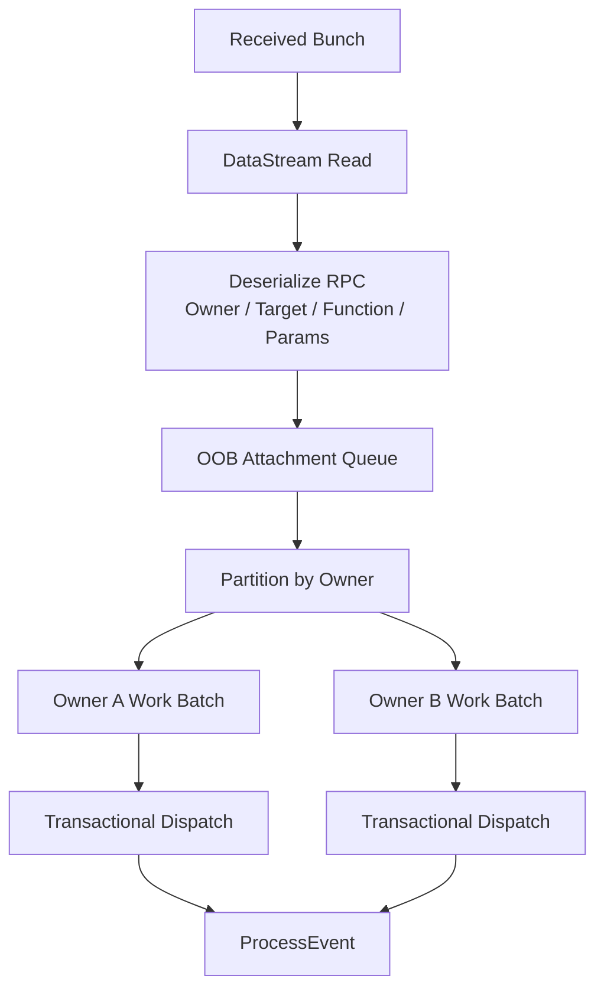

# 事务化远程副作用：UE6 Iris RPC 的 Owner Batch、整批回滚与重调度

> 系列：从 Unreal Engine 源码理解引擎设计
>
> 日期：2026-09-08
>
> 状态：草稿
>
> 核心问题：当远程 RPC 会在服务器上触发真实 Gameplay 副作用时，UE6 Iris 怎样避免把一整个网络读取过程绑进过大的事务，又怎样保证同一对象顺序域中的多条 RPC 可以统一提交、回滚和重试？
>
> 关键词：Unreal Engine、Iris、RPC、Transaction、Owner Batch、AutoRTFM

[系列目录](../blog.html)

服务器一次收到一批网络数据。

其中包含：

```text
Player A
→ RPC 1
→ RPC 2

Player B
→ RPC 3。
```

如果把整个网络 Read：

```text
包成一个巨大事务，
```

那么 A 的某条 RPC 需要回滚时，

可能把：

```text
与 A 无关的 B
```

一起拖回去。

但如果：

```text
每一条 RPC
都是完全独立事务，
```

同一个对象连续收到：

```text
RPC 1
RPC 2
```

时，又可能失去它们应该共享的顺序和副作用边界。

UE6 Iris 当前值得研究的方案位于两者之间：

> **按 Attachment Owner 划分事务 Work Batch。**

## 先说结论：事务粒度应该围绕副作用所有权，而不是网络包大小

核心链：



**Owner Batch（后文简称“属于同一个调用顺序域的 RPC 一起提交”）**：以 attachment carrier / caller owner 为分组键，把同一 owner 的 RPC 按接收顺序放进同一事务 Work。

这样：

```text
网络包边界
```

不再自动成为：

```text
Gameplay 事务边界。
```

## 功能开关不是唯一启用条件

某个 CVar 开启，

并不意味着所有连接都会自动进入事务 RPC。

当前静态源码研究中，

至少还需要满足：

- 编译支持 Transactional Execution；

- Replication System 本身处于 Transactional；

- Server Role；

- queue policy 开启。


所以：

```text
Config Enabled
≠
Runtime Path Active。
```

这是整个 UE 源码系列反复出现的一条规律：

> **配置意图和实际运行资格必须分开。**

## 开启 Queue 反而是在缩小事务

一个很容易产生的误解是：

```text
Queue RPC for Transactions
=
以前没事务
现在加事务。
```

实际上兼容路径已经可以：

```text
把整个 DataStreamManager::ReadData
包进一次大事务。
```

Owner batching 开启以后，

重点反而是：

> **不再让整次 Read 共用一个宽事务，而是把对象解析与 RPC Dispatch 收窄到更小的事务边界。**

这是一种典型的：

**事务尺度收窄（后文简称“只回滚真正属于同一副作用域的事情”）**。

## Owner 和 Target 是两个不同身份

这是整个设计最关键的一层。

一条 RPC 可以拥有：

### Owner / Caller

回答：

```text
这条 Attachment
由哪个已复制对象承载？

属于哪个顺序和事务域？
```

### Target

回答：

```text
最终 ProcessEvent
真正调用哪个 UObject？
```

两者通常相同。

但 subobject 场景下不一定。

例如：

```text
某个 subobject
不能独立作为 replication carrier。
```

它可以：

```text
借 root object / replicated outer
作为 Owner。
```

但真实 RPC Target 仍然是：

```text
那个 subobject。
```

如果只保留 Owner：

```text
调用会错误落在 root。
```

如果只保留 Target：

```text
接收端又失去稳定 carrier / ordering domain。
```

所以：

> **承载身份和作用身份不能因为大多数时候相同就合并。**

## 发送端在入队以前就固定 Carrier Identity

接收端的 Owner Partition 并不是：

```text
收到 RPC 以后临时猜
这个 subobject 应该属于谁。
```

发送端已经先确定：

```text
CallerRef
TargetRef。
```

然后才把 Attachment 放进 Send Queue。

所以接收端消费的是：

```text
已经编码完成的承载合同。
```

这可以减少两端对对象层级做不一致推断。

## Decode 和 Dispatch 是两个阶段

RPC 接收并不是：

```text
读到函数
→
立刻 ProcessEvent。
```

解码阶段首先处理：

```text
Payload
Owner / Target Reference
Function Locator
Function / Object Resolution
Parameters。
```

真正执行副作用则发生在之后的 Owner Batch Dispatch。

因此至少可以看到两类事务：

```text
事务 A
→
解析 Object / Function

事务 B
→
真正 Dispatch / ProcessEvent。
```

这种拆分的价值在于：

> **把“我知道要调用谁”与“我已经允许调用产生副作用”分开。**

## 同一 Owner 的多个 RPC 是一个 Work Batch

假设某个对象连续收到：

```text
RPC A
RPC B
RPC C。
```

它们按稳定 Receive Queue 顺序进入：

```text
一个 Owner Work。
```

不同 Owner：

```text
Owner X
Owner Y
```

则拥有不同 Work。

这样某一个 Owner 的副作用需要 rollback 时，

不要求把所有不相关对象的工作绑在一起。

## 回滚不是“从失败 RPC 继续执行”

这是事务重试最容易被误解的一点。

假设 Batch：

```text
RPC A
RPC B
RPC C。
```

执行到 B 时发现：

```text
RequiresDependencies。
```

事务 abort。

下一次不是：

```text
从 B 继续。
```

而是：

```text
整批从 A 重新执行。
```

因此：

**整批重放（后文简称“回滚以后重新从这批副作用的起点再来一次”）**

要求 Batch 内所有真正进入事务的副作用都必须符合事务语义。

## Pending Dependency 是“暂时不能提交”，不是普通错误

RPC 执行可能因为：

```text
远程对象依赖尚未可用
```

无法完成。

如果这是可恢复依赖，

更合理的结果不是：

```text
永久失败
断开连接。
```

而是：

```text
Abort
→
保留 Work
→
等待依赖
→
Reschedule
→
从 Batch 开头重放。
```

这是一种：

**依赖等待型失败（即“现在不能提交，不代表这项工作本身非法”）**。

## 事务隔离不等于所有错误都被隔离

这点尤其不能过度宣传。

不同 Owner 的 Work 可以独立事务化，

但网络连接仍然拥有共享状态：

- Serialization Context；

- Connection Error；

- Invalid Function；

- Permission；

- RPC DoS。


如果发生的是：

```text
协议级严重错误，
```

它可能仍然影响整个 Connection。

所以不能简单写：

```text
Owner A RPC 出任何错误
绝不影响 Owner B。
```

更准确的是：

> **事务副作用可以按 Owner 分离，但协议错误仍然服从自己的连接级错误传播规则。**

## 事务系统需要区分三类失败

### 业务依赖暂时不足

```text
Abort
Reschedule
Retry。
```

### RPC 本身非法

例如：

```text
Function 不允许远程调用。
```

应该明确拒绝。

### Connection / Serialization Failure

可能进入：

```text
连接级错误处理。
```

把三者全部叫：

```text
RPC Failed
```

会让诊断几乎失去价值。

## 为什么 Owner 是很好的事务边界候选

Owner 同时提供：

```text
承载
顺序
对象归属。
```

所以它天然比：

```text
Network Packet
```

更接近 Gameplay Side Effect Domain。

这是一条很值得迁移的工程思想：

> **异步系统中的事务边界，应该围绕“谁拥有这些副作用”，而不是围绕“这些数据恰好一起被读到了”。**

## 可以迁移到哪些系统

### Command Bus

同一个 Aggregate 的命令：

```text
按 AggregateId
组成 Work Batch。
```

### Inventory Network

同一个 Inventory Owner 的多项操作：

```text
统一提交。
```

### Remote Editor

同一个 Document 的一组远程 Edit：

```text
按 Document Owner 隔离。
```

真正要寻找的是：

```text
Side-effect Ownership Domain。
```

而不是传输层包边界。

## 常见误读

### “Queue RPC”就是每条 RPC 单独排队事务

实际核心是 Owner Batch。

### Owner 就是 Target

subobject carrier 场景并不成立。

### Abort 后从失败点继续

实际是 Batch replay。

### 事务隔离等于协议错误完全隔离

Connection Error 仍可能共享。

### CVar 默认开启等于项目一定在跑这条路径

还存在编译、系统和角色 gate。

## 我的事务 RPC 检查表

1. 配置 Intent 与 Runtime Gate 是否分离？

2. Wide Read Transaction 是否被过度使用？

3. Side Effect 是否有明确 Owner？

4. Carrier 与 Actual Target 是否分离？

5. Sender 是否在 Queue 前固定 Identity？

6. Decode 与 Dispatch 是否是两个阶段？

7. 同 Owner 顺序是否稳定？

8. 不同 Owner 是否可以独立提交？

9. Abort 后是 Resume 还是 Replay 是否明确？

10. Dependency Pending 是否区别于 Invalid RPC？

11. Connection Error 是否与 Work Failure 分开？

12. Retry 是否能够保持幂等/事务语义？

13. Debugger 是否能显示 Owner Batch 内容？

14. 测试是否覆盖多 Owner + Abort + Reschedule？


UE6 Iris 这一段源码最值得迁移的地方，不是：

```text
RPC 也可以支持事务。
```

而是它对事务边界的选择：

> **不要让传输层恰好把哪些数据放在一起，决定业务副作用应该一起提交还是一起回滚。**

真正更稳定的边界来自：

```text
Owner。
```

## 术语对照

|正式术语|通俗称呼|
|---|---|
|Owner Batch|属于同一调用顺序域的 RPC 一起提交|
|Transaction Scope Narrowing|只回滚真正属于同一副作用域的事情|
|Carrier Identity|谁负责承载和排队|
|Target Identity|最终真正调用谁|
|Whole-batch Replay|回滚以后从整批开头重来|
|Reschedule|等依赖满足后重新执行|

## 内部资料依据

- `notes/UnrealEngine源码研究/UE6/10_Iris事务化RPC从AttachmentOwner到WorkBatch_AutoRTFM提交回滚与失败隔离.md`

- `notes/UnrealEngine源码研究/UE6/07_Iris从ObjectBridge到每连接DataStream_复制帧流水线与交付反馈.md`

- `blogs/从UnrealEngine源码理解引擎设计/07-Iris复制资格与交付确认.md`

- `blogs/README.md`


本文基于 UE6-main 研究快照的源码静态闭环整理。原始研究没有编译 Unreal Engine，也没有运行 focused transactional owner-batch regression，因此本文不把源码结构等同于本地运行验证通过。
