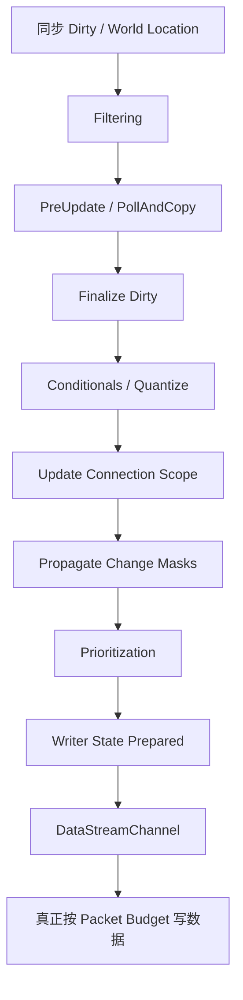
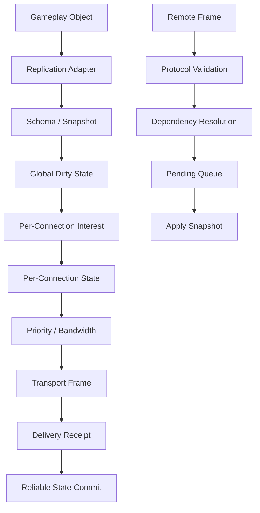

# 复制资格与交付确认：UE6 Iris 的对象协议、连接可见性与可靠状态

> 系列：从 Unreal Engine 源码理解引擎设计
>
> 日期：2026-08-24
>
> 状态：草稿
>
> 核心问题：一个 UObject 的状态已经发生变化以后，怎样逐步判断哪些连接有资格看到它、本次带宽是否应该发送它，以及什么时候才能真正认为这一份状态已经可靠交付？
>
> 关键词：Unreal Engine、Iris、Replication、Filtering、Prioritization、DataStream、Delivery

[系列目录](../blog.html)

一个角色的生命值刚刚从：

```text
100
```

变成：

```text
72。
```

最直观的网络同步模型似乎非常简单：

```text
Health 改变
→
序列化 Health
→
发给客户端。
```

但只要服务器上不再只有：

```text
一个对象
一个客户端
无限带宽，
```

事情就会迅速复杂起来。

服务器真正需要回答的是：

- 这个对象是不是已经进入复制系统；
- 当前变化是否已经被复制系统读取；
- 哪些客户端现在有资格知道这个对象存在；
- 对这个客户端而言，对象是否真的有变化；
- 当前 Packet Budget 是否值得把它放进去；
- 对象状态太大时怎么办；
- Packet 写出以后如果丢了怎么办；
- 远端依赖的另一个对象还没创建怎么办；
- 对象引用还没有映射完成时能不能先应用其他字段；
- 本帧复制结束以后，哪些 Dirty 状态可以真正清掉。

所以“属性变化以后发送”只描述了复制系统最表面的一层。

真正成熟的状态复制，更像是一套不断把**全局对象真相投影成每个连接自己的可交付状态**的流水线。

## 先说结论：Iris 管理的是复制状态投影，而不是直接发送 UObject

**复制状态投影（后文简称“同一个世界，为不同连接生成不同网络视图”）**：复制系统从服务器对象状态出发，经过协议化、Dirty 检测、连接过滤、作用域维护、优先级排序和发送预算，最终为每个连接生成自己的待发送状态。

整个发送链可以先压缩为：


这条链最重要的不是类名。

而是每一层回答的问题不同。

| 层次 | 回答的问题 |
|---|---|
| UObject | 游戏世界里发生了什么 |
| Fragment / Protocol | 这些状态怎样被复制系统理解 |
| Dirty / Quantized State | 什么真正发生了可复制变化 |
| Filter | 当前连接有没有资格看到这个对象 |
| Scope | 这个对象与连接之间当前处于什么复制关系 |
| Priority | 有资格发送的对象中，本次先发哪些 |
| Writer / DataStream | 怎样塞进有限 Packet |
| Delivery Record | 写出去的状态到底有没有真正到达 |

如果这些状态全部被压成：

```text
Replicated = true
```

复制系统很快就会失去可解释性。

## UObject 需要先经过 Bridge 才成为网络对象

**对象复制桥（后文简称“把游戏对象翻译成复制系统能理解的对象”）**：负责读取 UObject 的复制描述，把实例状态注册为 Fragment / Protocol，并建立网络身份、内部索引和复制策略。

Iris 并不是：

```text
Actor
→
Serialize Properties
→
Socket。
```

对象首先需要经过 Bridge。

一个简化注册过程可以理解为：

```text
StartReplicatingRootObject
→
注册 Replication Fragments
→
建立 Instance Protocol
→
计算或复用 Replication Protocol
→
分配网络身份
→
绑定 Dirty Tracking
→
配置 Filter
→
配置 Prioritizer
→
配置 Poll Frequency。
```

这一步非常重要。

它把：

```text
游戏对象是什么
```

和：

```text
网络系统怎样表达它
```

分开。

核心复制层不需要直接理解：

- Actor 的具体业务类；
- 游戏技能系统；
- UI；
- AI。

它处理的是已经协议化的状态。

这是一种很值得迁移的边界：

> 业务对象通过 Adapter / Bridge 接入复制系统，复制核心不反向依赖所有游戏对象类型。

## Protocol 描述的是共享状态布局，不是某个对象的当前值

这里还需要继续区分两个概念。

**Instance Protocol（后文简称“这一只对象从哪里读取和写回状态”）**描述具体实例怎样与 Fragment 交互。

**Replication Protocol（后文简称“这一类复制状态长什么样”）**描述可以共享的序列化布局。

于是两个结构相同的对象不需要：

```text
每个实例都重新建立一份完整网络描述。
```

可以复用相同 Protocol。

这个分层和很多数据驱动系统很相似：

```text
Schema
≠
Instance Data。
```

Schema 负责描述结构。

Instance 负责提供当前状态。

## 网络身份和内部索引不能混成一个 ID

Iris 对象注册以后，会涉及多种不同身份。

可以按职责理解：

| 身份 | 主要职责 |
|---|---|
| UObject Pointer | 当前进程里的实际实例 |
| Net Handle | 本地网络对象句柄 |
| NetRefHandle | Iris 网络对象身份 |
| Internal NetRef Index | 当前复制系统内部的密集索引 |

这里最容易犯的错误是：

```text
既然 NetRefHandle 能标识对象
→
那就把它当全局永久 ID。
```

这并不成立。

**网络复制身份（后文简称“这套复制系统里它是谁”）**和：

```text
数据库角色 ID
跨服实体 ID
永久资产 ID
```

不是同一种身份。

Internal Index 更明显只适合：

- BitArray；
- Dense Table；
- 当前 Replication System。

它不应该被提升成跨运行时长期身份。

这是一个非常通用的设计原则：

> 内部高效索引和外部稳定身份可以同时存在，但不能互相冒充。

## Dirty、Poll 和 Send 是三个不同状态

复制系统里另一个常见误解是：

```text
Dirty
=
这一帧一定发送。
```

实际上至少还有两层。

**Dirty State（后文简称“系统知道这里可能有变化”）**

并不一定等于：

```text
当前已经重新读取了实例。
```

Iris 还需要构造 Poll List。

Poll 会考虑：

- Dirty；
- Poll Frequency；
- Push Model；
- Dormancy；
- ForceNetUpdate；
- Root / SubObject；
- Dependent Object。

所以：

```text
Dirty
```

和：

```text
本帧需要从 UObject 重新抓状态
```

并不是简单一一对应。

## Push Model 也没有消灭 Poll

Push Model 很容易被理解成：

```text
对象自己标 Dirty
→
复制系统再也不用 Poll。
```

但复制系统仍然需要处理：

- PreUpdate；
- 非 Push Fragment；
- Dormancy Flush；
- Root/SubObject 传播；
- 强制更新；
- Poll Frequency。

Push Model 真正减少的是：

> 没有变化对象被无意义重新读取的范围。

它改变 Dirty 信息来源。

并没有删除整个 Poll 阶段。

## PreUpdate 是一条用户代码边界

在真正抓取 Fragment 状态以前，Bridge 可能执行 PreUpdate。

这意味着：

```text
复制系统
```

会暂时进入：

```text
游戏代码。
```

而游戏代码又可能：

- 修改属性；
- 标 Dirty；
- 创建 SubObject；
- 改变对象状态。

因此 Dirty List 不能在 PreUpdate 以前就宣布：

```text
本帧已经最终确定。
```

更合理的顺序是：

```text
初始 Dirty
→
PreUpdate / Poll
→
可能产生新 Dirty
→
Finalize Dirty。
```

这是一个典型的重入边界。

只要执行用户代码，基础设施就必须重新考虑：

> 我的输入集合还会不会变化？

## Quantize 把 UObject 状态转成内部可比较状态

**协议化状态（后文简称“先变成网络系统能稳定比较的形式”）**：把实例 Fragment 当前值转换成 Iris 内部用于 Change Mask、Delta 和序列化的量化状态。

流程可以近似理解成：

```text
Instance Fragment State
→
Quantize
→
Internal State Buffer
→
Change Mask。
```

从这里开始，后续每连接计算就不需要继续直接读取复杂业务对象。

复制系统可以围绕：

```text
稳定的内部状态
```

计算：

- 哪些字段变了；
- 哪些连接需要看；
- 需要发送多少；
- Baseline 怎样变化。

这也是业务对象层与网络状态层真正分开的地方。

## Filter、Scope 与 Priority 必须分成三层

这是 Iris 中最值得单独记住的一组边界。

很多网络系统会使用一个：

```text
PriorityScore
```

同时决定：

- 对象是否可见；
- 是否应该发送；
- 什么时候发送。

这样做短期简单。

长期会越来越难解释。

Iris 更接近把问题拆成三层。

### Filter：这个连接有没有资格看到它

**连接过滤（后文简称“这个连接原则上能不能知道它存在”）**：根据连接身份、空间、Owner、Group 和其他规则确定对象是否属于该连接的相关集合。

它解决的是：

```text
Relevant / Not Relevant。
```

例如：

- 距离太远；
- 不属于这个玩家；
- 处于另一个兴趣区域；
- 当前 Group 被过滤。

被过滤以后：

```text
Priority 再高也不能回来。
```

### Scope：双方当前处于什么复制关系

**连接作用域（后文简称“这个对象现在是不是已经进入这名客户端的世界视图”）**：维护对象相对某个连接的持续复制状态，而不是只保存一次 Filter 查询结果。

一个对象可以：

```text
首次进入 Scope
→
需要创建和 Initial State

继续留在 Scope
→
只发送变化

离开 Scope
→
需要停止复制或产生销毁语义。
```

所以 Scope 本身是一台状态机。

它不是：

```text
bool IsRelevant。
```

### Priority：本次预算先发谁

**发送优先级（后文简称“有资格的对象里，这个包先装谁”）**：在已经 Relevant、并且具有待发送变化的对象中，根据有限 Packet Budget 排序。

Priority 不能：

```text
把已经被 Filter 掉的对象重新放回来。
```

也不负责：

```text
凭空制造 Dirty。
```

所以关系应该保持：

```text
Filter
→
Scope
→
Dirty
→
Priority。
```

而不是一个万能 Score 解决所有问题。

## 可见性和带宽是两种不同约束

这套分层实际上对应两个完全不同的问题。

第一：

```text
Privacy / Interest / World Relevance。
```

第二：

```text
Bandwidth / Urgency。
```

例如某个远处敌人可能：

```text
Relevant = true
Priority = low。
```

它仍然属于客户端世界。

只是状态更新频率较低。

另一个对象可能：

```text
Relevant = false。
```

那么无论它多重要，也不应该发送。

把这两个概念混起来，会导致非常危险的错误：

> 带宽优先级系统意外获得了改变客户端可见范围的权力。

## 全局状态和每连接状态也必须分开

服务器上的 UObject 只有一份。

但每个连接可能拥有完全不同的复制视图。

例如同一个 Actor：

```text
Connection A
已经进入 Scope
最新状态已全部确认

Connection B
刚刚进入 Scope
还需要 Initial State

Connection C
当前被 Filter

Connection D
上一包丢失
仍有旧 Change Mask 等待重发。
```

所以：

**每连接复制状态（后文简称“同一个对象，每个客户端都有自己的同步进度”）**不能被保存在 UObject 自己的一个统一：

```text
LastReplicatedState。
```

否则一个客户端的确认会错误推进所有客户端。

这也是大规模复制系统复杂度迅速增加的根本来源之一。

## NetUpdate 主要准备状态，并不直接等于网络发送

一个非常常见的直觉是：

```text
ReplicationSystem.NetUpdate()
→
把网络包发出去了。
```

但当前结构并不是这样。

可以把发送帧粗略拆成：



**复制准备阶段（后文简称“先决定这一帧有哪些东西值得发”）**和：

**包写出阶段（后文简称“真正把这些状态塞进网络包”）**

是两个不同责任。

这让：

- 对象复制策略；
- Packet 编排；
- 底层传输；

不必全部耦合在一个函数中。

## DataStream 是复制状态与 Packet Budget 之间的适配层

每个连接拥有自己的 Reader 和 Writer。

DataStream 再把它们接入更低层的包编排。

可以近似理解成：

```text
Replication System
→
准备 Connection State

Replication DataStream
→
把 Connection State 转成 Stream Work

DataStream Manager
→
多个 Stream 共享一个 Packet

Channel
→
驱动真正写读。
```

这里还有一个很实用的设计：

每个 Stream 可以先在：

```text
Substream
```

里尝试写数据。

有数据才 Commit。

没有数据或者写失败，则丢弃该 Substream。

这样一个 Stream 的部分失败不会轻易污染整个主 Packet 状态。

## Dirty 不等于本帧一定上网

Writer 仍然受到：

- Bit Capacity；
- Packet Count；
- Record Storage；
- Huge Object；
- Object Splitting；

等约束。

所以：

```text
Dirty
→
Relevant
→
Priority 高
```

也仍然不代表：

```text
这帧一定发送。
```

当前预算可能只允许处理前一批对象。

剩余状态继续保留到下一次发送机会。

这是带宽系统非常重要的一条原则：

> Budget 应该控制多久发完，而不是让尚未发送的合法状态凭空消失。

## 写入 Packet 也不等于复制完成

这是整套流水线最关键的一层。

假设 Writer 已经成功把某个对象状态写进 Packet。

当前可以确认的是：

```text
数据已经进入发送包。
```

仍然不能确认：

```text
远端已经收到。
```

Packet 可能：

- Delivered；
- Lost；
- Discard。

因此 Writer 会建立：

**在途复制记录（后文简称“已经发出去，但还不能结账的状态”）**：保存当前 Packet 涉及的对象状态、Change Mask、Attachment、Destroy/Tear-off 和 Baseline 信息，等待底层交付反馈以后再决定如何收口。

这让复制可靠性形成：

```text
Serialize
→
Packet
→
In-flight Record
→
Delivery Notification
→
Commit / Retry / Discard。
```

而不是：

```text
WriteData 成功
→
清空状态。
```

## Delivered、Lost 与 Discard 是三种不同终态

### Delivered

表示对应 Packet 已被确认送达。

此时可以推进：

- 已确认状态；
- Reliable Attachment；
- Baseline；
- 相关在途记录。

### Lost

表示这份状态没有真正交付。

复制系统需要恢复：

- Change Mask；
- 可靠 Attachment；
- 需要重发的 Stream State。

### Discard

通常对应连接或 Stream teardown。

这里不是：

```text
重新发送。
```

而是：

```text
这条发送上下文本身已经结束
→
按放弃语义清理记录。
```

这三个状态如果只有：

```text
Success / Failure
```

很难正确表达连接关闭等场景。

## 可靠性不是 Transport 单方面负责的

底层 Packet 系统可以告诉 Iris：

```text
这个 Packet Delivered / Lost。
```

但 Transport 本身并不知道：

```text
Packet 里包含哪些对象 Change Mask
哪些 Attachment
哪些 Baseline。
```

反过来，Replication Writer 知道：

```text
我这次写了哪些复制事实。
```

却不知道 Packet 最后有没有真的到达。

因此：

**交付闭环（后文简称“底层告诉我包到了，我才能确认上层状态真的完成”）**需要两个层次共同完成。

这是一个非常通用的网络系统原则：

```text
Transport Delivery
+
Application Replication Record
=
Reliable State Progress。
```

## 接收端同样不是“读完 Bitstream 就写对象”

发送端拥有复杂流水线。

接收端也一样。

Reader 首先需要验证：

- Batch Count；
- NetRefHandle；
- Root / SubObject 关系；
- Protocol；
- Baseline；
- Batch Size；
- Incoming Replication 是否允许；
- Bitstream 是否 Overflow / Underflow。

只有协议状态合法以后，才继续：

```text
创建对象
→
反序列化
→
Dequantize
→
应用状态
→
后续通知。
```

这意味着：

> 网络输入不是可信数据源。

复制系统必须先证明它符合当前协议。

## Initial State 也不是对象初始化完成的唯一瞬间

收到一个新的动态网络对象时，大致需要：

```text
读取 Creation Header
→
创建或查找 UObject
→
建立远端 Handle
→
找到 Protocol
→
绑定内部索引
→
应用 Initial State
→
PostApply
→
RepNotify / 后续逻辑。
```

所以：

```text
对象实例已经被创建
```

和：

```text
对象网络初始化已经完成
```

仍然不是同一状态。

这与异步资源加载中的对象发布问题非常相似：

> 地址存在，不代表完整生命周期合同已经成立。

## 未解析引用不能半应用

假设一个复制 Batch 包含：

```text
Owner = Object B
Health = 72
Weapon = Object C。
```

但当前客户端：

```text
Object B 尚未创建。
```

最直接的实现可能是：

```text
Health 先写进去
Owner 等以后再说。
```

这样会让对象图进入一种：

```text
部分新状态
+
部分旧状态
+
关键依赖缺失
```

的中间阶段。

Iris 更倾向于：

**依赖阻塞批次（后文简称“关键引用没准备好，就把这一整批状态先保留下来”）**：保存当前 Batch 的原始数据、引用集合和 Creation Parent，等依赖全部满足以后再按原顺序重放。

于是：

```text
引用未解析
→
Pending Batch

引用完成
→
Replay Batch
→
Dispatch State。
```

这可以防止业务代码观察到半初始化对象图。

## Pending Batch 还必须能够终止

延迟等待当然不能无限进行。

可能出现：

```text
Creation Parent 永远不会出现
```

或者：

```text
服务端已经发出 End Replication。
```

如果 Reader 继续永久保存这些 Batch：

```text
连接内存
```

会不断增长。

因此 Pending System 还需要：

- Blockage Time；
- 原因记录；
- Stale Detection；
- End-Replication Cleanup。

这是一项很重要的设计提醒：

> “以后再处理”本身不是完整生命周期。

所有 Deferred State 都需要明确：

```text
什么时候成功
什么时候重试
什么时候必须放弃。
```

## 发送帧本身也需要稳定快照

复制系统在一帧中会经历：

```text
Filter
Poll
Quantize
Scope
Priority。
```

如果中途允许任意游戏代码持续：

```text
修改 Filter
```

前半段和后半段就可能基于两个不同世界。

例如：

```text
对象已经 Quantize
↓
突然被移出 Filter
↓
Attachment 已经按旧 Scope 排队。
```

因此 Iris 会在发送窗口中冻结某些输入。

**发送一致性窗口（后文简称“这一轮复制计算期间，资格规则先别变化”）**：从发送准备开始到 PostSend 收口期间，对影响本帧 Connection Scope 的关键输入建立修改边界。

这和：

- ECS Processing Window；
- Render Graph Compile；
- 数据库事务快照；

拥有非常相似的思想。

## PostSendUpdate 是真正的帧收口点

复制帧结束以后，还需要：

- 清除已处理 Dirtiness；
- 解锁 Filter 修改；
- Reset Change Mask Cache；
- 保存 Scope；
- 收敛 Destroy / Tear-off；
- 更新 Baseline；
- 结束 DataStream Tick；
- 复位当前 Send Pass。

所以：

**复制帧提交边界（后文简称“这一轮状态计算终于结账”）**不是：

```text
NetUpdate 返回。
```

也不是：

```text
第一个 Packet 写完。
```

而是完整 PostSend 收口完成。

漏掉这一阶段，破坏的不只是缓存。

下一帧入口依赖的状态不变量也会一起失效。

## 并行复制真正需要的是冻结输入，而不是“所有 API 都线程安全”

Iris 存在并行支持路径。

但源码中：

```text
存在 parallel branch
```

并不能直接推导：

```text
所有 Target 默认并行
所有复制 API 都可以任意线程调用。
```

真正值得借鉴的是：

```text
先建立稳定输入
→
把适合并行的纯状态处理拆出去
→
最后统一收口。
```

而不是：

```text
加锁以后所有阶段都并行。
```

**并行复制窗口（后文简称“把能纯计算的部分并行，不让结构规则同时乱动”）**仍然需要：

- 编译门控；
- 实例配置；
- 用户代码边界；
- 输入冻结；
- 最终提交点。

## 一个完整复制周期拥有很多“还没有完成”

把所有阶段放在一起，可以看到复制系统有很多不同的未完成状态：

```text
UObject changed
→
还没 Poll

Poll complete
→
还没 Quantize

Quantize complete
→
该连接可能不 Relevant

Relevant
→
可能还没进入 Scope

In Scope + Dirty
→
可能优先级不够

Scheduled
→
可能 Packet Budget 不够

Written
→
Packet 可能还没 Delivery

Delivered
→
远端引用可能仍未满足

Received
→
对象初始化和通知可能还没完成。
```

这也是复杂网络系统最应该避免的一个错误：

> 用一个 `IsReplicated` 表达整个生命周期。

不同层的“完成”必须有自己的 Owner。

## 对自研网络层最值得迁移的是责任分层

如果设计自己的 Unity / C# 网络复制框架，不需要复制 Unreal 的类名。

可以抽象成：



然后为每一层明确唯一职责。

### Replication Adapter

负责：

```text
业务对象
→
复制 Schema。
```

### Interest / Filter

负责：

```text
这个连接是否应该知道对象。
```

### Connection State

负责：

```text
这个连接当前已经同步到哪里。
```

### Priority

负责：

```text
当前有限带宽下先服务谁。
```

### Delivery Record

负责：

```text
已经发送但仍未确认的状态。
```

### Pending Queue

负责：

```text
远端依赖尚未满足的状态。
```

这样新增：

- AOI；
- Dormancy；
- Snapshot；
- Delta；
- Replay；
- Bandwidth Budget；

时，不需要不断把功能塞进一个万能 Replicator。

## Filter 和 Priority 尤其不应该合并

假设一个服务器自行设计：

```text
score =
distanceWeight
+
importance
+
ownerBonus。
```

然后：

```text
score < threshold
→
不发。
```

表面上很方便。

但这会把：

```text
“没有权限知道”
```

和：

```text
“暂时没带宽更新”
```

混成同一个问题。

在隐私、安全和 Gameplay Interest 上，这非常危险。

更适合的是：

```text
Interest / Authorization
→
先决定资格

Priority
→
只在有资格对象中调度预算。
```

这是 Iris 最值得直接迁移的一条边界之一。

## Delivery Record 同样适用于游戏业务消息

这套模式也不仅适合属性复制。

例如一个可靠 Gameplay Command：

```text
Inventory Item Granted
```

同样可能拥有：

```text
命令已序列化
命令已写 Packet
Packet 已发送
Packet 已确认
远端已应用
业务已回执。
```

如果资产价值很高，

还可能继续：

```text
Durable Commit。
```

不同完成等级不应该全部叫：

```text
Sent。
```

越高价值的业务，越需要明确：

> 你说的“完成”到底指哪一层。

## 小型多人游戏未必需要完整 Iris 式架构

这套设计不能机械复制。

如果一个项目只有：

- 2～4 个玩家；
- 几十个同步对象；
- 所有人基本看见同一场景；
- 没有复杂 Interest；
- 带宽压力很低；
- 没有动态大世界；

那么：

```text
Per-Connection Scope
Protocol Cache
Pending Batch
复杂 Priority
Delivery Record
```

的工程成本可能高于收益。

一个简单：

```text
Authoritative State
→
Serialize Changed Components
→
Broadcast
```

就可能足够。

Iris 的结构价值主要来自：

> 对象多、连接差异大、带宽有限、依赖复杂，而且需要严格的可靠状态推进。

## 常见设计失败

### UObject 改变以后直接序列化发送

业务状态、复制协议和连接状态全部耦合。

### 把 NetRefHandle 当跨服永久对象 ID

运行时复制身份被错误提升成长生命周期资产身份。

### Dirty 就等于本帧一定发送

忽略 Poll、Filter、Priority 和 Packet Budget。

### Push Model 开启后彻底移除 Poll

PreUpdate、Dormancy 和非 Push 状态无法正确处理。

### Filter 和 Priority 合并成一个分数

可见资格和发送预算混成同一权力。

### 所有客户端共享一个 LastReplicatedState

不同连接的确认和丢包状态互相污染。

### `NetUpdate()` 被理解成实际 Packet Send

状态准备层与 Channel/DataStream 层被混淆。

### `WriteData()` 成功以后立即清除可靠状态

Packet 丢失以后没有可恢复的 In-flight Record。

### Delivery 只由 Transport 负责

网络层不知道这个 Packet 对应哪些对象语义。

### 接收端完全信任 Bitstream

非法 Handle、Protocol 和 Batch 可以污染 Runtime。

### 未解析引用时先应用其余属性

远端业务代码看到半初始化对象图。

### Pending Batch 没有超时与失效清理

连接长期积累无法完成的状态。

### 发送过程中允许 Filter 规则任意变化

同一轮复制计算读取了互相不一致的连接视图。

### 忘记 PostSend 收口

下一帧继承不完整的 Dirty、Scope 或 SendPass 状态。

### 源码里存在 parallel 分支，就认为全部复制逻辑线程安全

编译能力被扩大成运行时默认事实。

## 我的网络复制检查表

1. 业务对象与网络复制表示是否分离？
2. 是否存在明确的 Replication Adapter / Bridge？
3. Schema / Protocol 与 Instance State 是否分离？
4. 网络身份与内部密集索引是否是两个概念？
5. 网络身份是否不会被错误用作长期资产 ID？
6. Dirty、Poll、Quantize 是否具有不同语义？
7. PreUpdate 执行用户代码以后是否会重新收敛 Dirty？
8. Push Model 是否仍保留必要 Poll 路径？
9. Interest / Filter 是否先于 Priority？
10. Priority 是否绝不能绕过 Filter？
11. 每个连接是否拥有独立 Scope？
12. 首次进入 Scope 与持续更新是否拥有不同语义？
13. 离开 Scope 是否存在明确 End Replication / Destroy 行为？
14. 同一对象是否可以对不同连接拥有不同同步进度？
15. 全局源状态与每连接状态是否分离？
16. Packet Budget 耗尽以后状态是否会保留到后续发送？
17. 大对象是否拥有 splitting / bounded failure 策略？
18. 写入 Packet 与 Delivery 是否是两个状态？
19. 是否为在途可靠状态保留 Delivery Record？
20. Lost 是否可以恢复 Change Mask 或可靠附件？
21. Connection teardown 是否拥有独立 Discard 语义？
22. 接收端是否先验证协议和 Handle，再应用状态？
23. Initial State 是否不会被等同于对象全部初始化完成？
24. 未解析对象引用是否进入 Pending Batch？
25. Pending Batch 是否保持原始顺序和完整状态？
26. Pending 状态是否有超时、Stale 和 End-Replication 清理？
27. 一轮复制计算期间是否拥有稳定 Filter / Scope 输入？
28. 用户代码边界以后是否重新确认关键集合？
29. 是否存在明确 PostSend / Frame Commit Point？
30. 并行阶段是否只处理已经冻结的稳定输入？
31. Debugger 能否回答某个对象为何没有发给某个连接？
32. Debugger 能否区分 Filtered、LowPriority、BudgetExhausted 和 InFlight？
33. 是否能够追踪 Packet 对应的 Replication Record？
34. 丢包以后能否解释具体哪些对象状态重新进入待发送？
35. 接收阻塞时能否说明缺少哪个 Object Reference 或 Creation Parent？
36. 自动化测试是否覆盖 Filtering、Prioritization、DataStream、Loss 和 Pending Batch？
37. 当前项目规模真的需要完整 Per-Connection Replication State 吗？

Iris 最容易被误解成：

```text
Unreal 新的属性复制系统。
```

但从当前主链看，它真正解决的问题远不只是属性序列化。

服务器世界只有一份。

每个连接看到的却不同。

对象状态只有一份。

每个连接的同步进度却不同。

一个属性已经改变。

不代表每个连接都有资格看到。

即使有资格看到。

也不代表当前带宽应该优先发送。

即使已经写进 Packet。

也不代表远端已经收到。

即使远端收到。

也不代表相关对象依赖已经完整建立。

因此成熟复制系统真正需要维护的是一连串不同的事实：

```text
对象发生了什么
谁有资格知道
这次先告诉谁
哪些内容已经发出
哪些内容真正到达
哪些内容还在等待依赖
```

这些事实各自拥有自己的状态机。

这也是 Iris 最值得迁移的设计思想：

> **网络复制不是把世界广播出去，而是把同一个权威世界持续投影成多个连接各自能够合法、按预算并且可恢复地接收的状态视图。**

## 术语对照

| 正式术语 | 文中通俗称呼 |
|---|---|
| 复制状态投影 | 同一个世界，为不同连接生成不同网络视图 |
| 对象复制桥 | 把游戏对象翻译成复制系统能理解的对象 |
| Instance Protocol | 这一只对象从哪里读取和写回状态 |
| Replication Protocol | 这一类复制状态长什么样 |
| 网络复制身份 | 这套复制系统里它是谁 |
| 协议化状态 | 先变成网络系统能稳定比较的形式 |
| 连接过滤 | 这个连接原则上能不能知道它存在 |
| 连接作用域 | 这个对象现在是不是已经进入这名客户端的世界视图 |
| 发送优先级 | 有资格的对象里，这个包先装谁 |
| 每连接复制状态 | 同一个对象，每个客户端都有自己的同步进度 |
| 复制准备阶段 | 先决定这一帧有哪些东西值得发 |
| 在途复制记录 | 已经发出去，但还不能结账的状态 |
| 交付闭环 | 底层告诉我包到了，我才能确认上层状态真的完成 |
| 依赖阻塞批次 | 关键引用没准备好，就把这一整批状态先保留下来 |
| 发送一致性窗口 | 这一轮复制计算期间，资格规则先别变化 |
| 复制帧提交边界 | 这一轮状态计算终于结账 |

---

## 内部资料依据

本文主要基于以下材料整理：

- `notes/UnrealEngine源码研究/UE6/07_Iris从ObjectBridge到每连接DataStream_复制帧流水线与交付反馈.md`
- `notes/UnrealEngine源码研究/UE6/README.md`
- `notes/UnrealEngine源码研究/UE5/05_UWorld与AActor生命周期及Tick调度.md`
- `blogs/从UnrealEngine源码理解引擎设计/01-UnrealEngine的第一帧提交链.md`
- `blogs/从UnrealEngine源码理解引擎设计/03-AsyncLoading2对象发布协议.md`
- `blogs/README.md`
- `blogs/publication.v1.json`

本文主要依据 2026-08-23 的 Unreal Engine UE6-main 源码研究快照整理。

当前研究已经通过源码声明、实现、Engine 调用点和 `ReplicationSystemTestPlugin` 测试入口核对：

- UObjectReplicationBridge；
- Fragment / Protocol / Handle 注册；
- NetUpdate；
- Dirty / Poll / Quantize；
- Filtering；
- Per-Connection Scope；
- Prioritization；
- DataStream；
- ReplicationWriter / Reader；
- Packet Delivery Feedback；
- Pending Batch。

但本次研究没有运行 Unreal Editor、PIE Network Test、Automation、ReplicationSystemTestPlugin 或 Iris Benchmark。

因此本文不声称：

- 当前 UE6-main Iris API 或 wire format 已冻结为正式 Release 合同；
- 当前源码快照的 Iris 自动化测试已经在本机或 Runner 通过；
- `UE_SUPPORT_PARALLEL_IRIS` 存在就意味着所有 Target 默认并行；
- Iris 在所有项目中一定优于传统 Replication / ReplicationGraph；
- Delivery Notification 等价于所有业务 RepNotify、RPC 和 Gameplay 副作用都已经完成；
- 本文已经覆盖 RPC、NetBlob、FastArray、Delta Compression、NetToken 或全部远程对象事务。

文中将 Filter / Priority 分离、Per-Connection State、Delivery Record 和 Pending Batch 等思想迁移到自研 Unity/C# 网络层，属于工程设计归纳，不表示其他项目需要复制 Unreal 的具体类型、DataStream 或协议实现。
