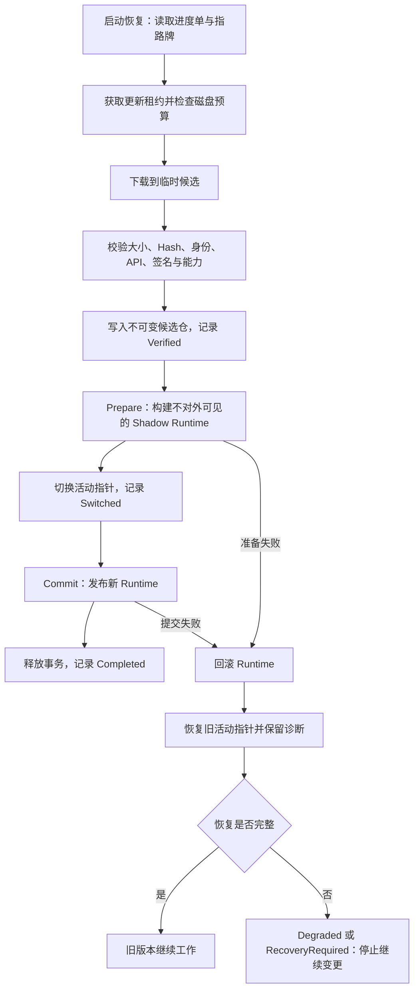

# Unity 热更新的事务提交边界：磁盘版本切换、Runtime 提交与失败恢复

> 系列：Sakura Framework 工程实践
>
> 日期：2026-07-30
>
> 状态：可发布候选
>
> 核心问题：一次热更新究竟要到哪个时刻，才可以被系统承认为“已经完成”？

[系列目录](../blog.html)

开发热更新功能时，人很容易把注意力集中在最后一步：

- 新配置能不能读出来；
- 新资源能不能显示；
- Lua、Wasm 或托管程序集能不能加载；
- HybridCLR 的热更入口能不能运行。

如果这些步骤都成功，画面也出现了新内容，我们很自然地会说：“更新完成了。”

但真正麻烦的问题通常发生在这些步骤之间。

下载已经结束，进程却在切换版本时退出；磁盘上的新包已经生效，内存里仍有旧资源；新脚本启动成功，却无法安全卸载；下一次启动时，系统甚至不知道上一次更新停在了哪里。

所以我在整理 Sakura Framework 当前的 Modding 与 Hot Update Solution 实现时，得到的核心判断不是“热更新就是动态加载”，而是：

> 热更新首先是一套跨越磁盘状态与运行时状态的可恢复事务，加载代码只是其中一种内容处理方式。

## 先说结论：更新完成，需要磁盘与 Runtime 对同一版本达成一致

**热更新事务提交边界（即“整套换挡点”）**：新版本的存储指向与运行时状态都已完成切换，失败恢复责任也已经结清的边界。

这个定义里有两个不能拆开的事实：

1. 磁盘需要知道“当前活动版本是谁”。
2. Runtime 需要知道“当前真正运行的是哪套内容”。

只改其中一个，都可能产生分裂状态。

例如，活动版本已经从 `1.0.0` 指向 `1.1.0`，但新资源注册失败，内存仍在使用旧资源。此时如果系统只看版本号，就会误以为更新已经成功；如果系统只看当前画面，又无法解释下一次启动应该加载哪一份内容。

因此，整套换挡点不能等同于下载完成、Hash 校验通过、文件替换成功或 DLL 入口被调用。它必须覆盖整个切换过程。

## 三个基础结构：候选仓、指路牌与进度单

为了让更新可恢复，Sakura Framework 当前的严格更新路径使用了三个彼此分离的结构。

**不可变版本目录（即“候选仓”）**：每个已验证版本写入独立目录，已存版本不在原地改写。

**活动版本指针（即“指路牌”）**：一个很小的持久化记录，指出下一次启动应采用哪个版本及其包指纹。

**更新 Journal（即“进度单”）**：记录一次更新的操作身份、旧指针、候选指针与最近完成阶段。

它们分别回答三个问题：

| 结构 | 回答的问题 |
|---|---|
| 候选仓 | 新旧版本的物理内容是否仍然完整存在？ |
| 指路牌 | 当前对外承认的活动版本是哪一个？ |
| 进度单 | 上一次更新进行到了哪里，是否需要恢复？ |

这比“把新文件覆盖到 current 目录”多了一层间接性，却换来了一个非常重要的能力：版本切换可以通过改指针完成，旧版本也仍有机会被恢复。

## 一次严格更新，实际经过了什么

当前流程可以压缩成下面这张图：

这里最关键的一步是 `Prepare`。

**Shadow Runtime（即“后台试运行”）**：候选内容已经被解析、编译或组装，但尚未发布为全局可见状态的运行时。

后台试运行阶段允许系统发现问题，却不能提前让一半新状态泄漏给业务层。只有它准备成功，流程才切换指路牌，再提交新的 Runtime。

这其实是一种很克制的顺序：

1. 先证明候选可以准备。
2. 再承认磁盘活动版本发生变化。
3. 最后发布运行时状态。

如果第三步失败，系统必须同时做两件事：回滚 Runtime，并恢复旧指路牌。只完成其中之一，恢复都不能算完整。

事务最终释放也不是无关紧要的清理动作。若释放失败，当前实现会返回单独的 `CleanupFailed`，并把诊断留在进度单里，而不是为了得到一个好看的“成功”结果就吞掉异常。

## 为什么进程中途退出后，下一次启动仍能知道该做什么

更新 Journal 的价值，要到异常退出时才真正显现。

启动恢复逻辑不会猜测“用户大概想用新版本”，而是根据进度单和指路牌做保守判断：

- 如果候选还没有切换为活动版本，就安全放弃候选，旧版本保持不变。
- 如果阶段已经越过切换点，或者候选确实已经成为活动版本，就恢复旧指路牌。
- 如果进度单或指路牌无法被安全解释，就返回 `RecoveryRequired`，不擅自改写状态。
- 同一恢复动作可以重复执行，不会因为第二次启动又把状态翻转一次。

这种策略的重点不是“尽量自动修好”，而是“只做能够证明安全的恢复”。

我更愿意把它称为**失败封闭（即“看不懂就别继续动”）**：当系统无法确认真实状态时，停止继续更新，把问题暴露给诊断和人工处置。

## 信任校验不能只回答“文件有没有被改过”

SHA-256 可以证明下载到的字节是否与发布记录一致，签名可以证明这些字节来自某个密钥，但它们仍没有回答：

- 这个包是不是我要更新的那个 Mod？
- Request、远端索引与 Manifest 的 id、版本是否一致？
- 发布者是否是当前项目允许的发布者？
- 包声明的 Game API 与 Framework API 范围是否接受当前版本？
- 签名密钥是否被允许授予包声明的 capabilities？

因此，严格更新在进入后台试运行之前，会把身份、版本、包指纹、发布者、API 范围、签名和 capability 放在同一条信任链上核验。

这带来一个重要区别：

> “签名有效”只说明签名数学上成立，不等于这个发布者有权获得任意运行能力。

托管代码加载也因此默认拒绝。项目必须显式选择 Loader、Artifact Provider、入口和信任策略；仅仅在包里放入 DLL，不会自动得到执行权限。

## 数据、资源、脚本与 HybridCLR，不应该假装拥有相同的热更语义

Hot Update Solution 当前把能力拆为四种 experimental Preset。它们可以组合，但各自有不同的直接 Owner 和失败边界。

| 能力档位 | 主要职责 | 不能隐瞒的边界 |
|---|---|---|
| Data | 配置、数值、Save Bridge、事务激活与回滚 | 业务 Schema 与远端来源仍由项目提供 |
| Assets | 持久化来源、Addressables Catalog、资源 Scope | 存活实例替换需要项目参与 Quiesce、Capture、Restore |
| Scripts | Lua/Wasm 会话、预算、停止与替换 | 没有状态迁移协议时可能必须重启 |
| HybridCLR | IL2CPP 下的 AOT metadata、热更程序集与入口 Lease | 当前不支持可靠卸载，更新后需要进程重启 |

资源切换并不只是“加载一个新 Catalog”。如果场景里已有存活对象，合理顺序通常是暂停消费、捕获必要状态、加载并注册新资源、恢复状态，最后恢复运行。

脚本切换也不是“重新执行一段代码”。Sandbox 需要限制 host function、fuel、内存页数与超时；若希望保留脚本状态，还需要显式的 Schema 版本和迁移协议。

HybridCLR 的边界更加明显。当前适配器只在 IL2CPP 与 HybridCLR 运行时真实可用时开放；它会检查目标平台、Game/Framework API、AOT metadata 顺序、程序集依赖顺序、Hash、主程序集和唯一入口。加载后的入口可以停止，但已经进入进程的 metadata 与程序集不能被假装成可靠卸载，所以能力合同明确标记为“更新后需要重启”。

承认这些差异，比提供一个看似统一、实际无法兑现的 `ReloadEverything()` 更可靠。

## 工具化的意义，是让第一次接入就看到真实边界

运行时合同完整，并不等于开发者能正确接入。

Sakura Framework 当前的 Editor Hot Update Recipe 把接入过程整理成：选择能力、解析 Preset、预览安装闭包、执行 Preflight、明确确认，再 create-once 生成项目自己的 Host。

这里有几条我很认同的约束：

- Recipe 不保存凭据、远端地址或业务 Schema。
- HybridCLR 依赖由消费项目显式选择，不静默安装外部工具链。
- 工具不自动修改 Scripting Backend、BuildTarget 或 Build Settings。
- 非 IL2CPP、目标未知、metadata 或 DLL 缺失时，HybridCLR 保持 Blocked。
- 已有 Host 不会被覆盖。
- 生成的 Host 只负责生命周期与绑定租约，不复制 Handler、Trust 或更新事务。
- 诊断面板只读 Runtime Snapshot，不为了“显示状态”偷偷创建全局 Owner。

这让向导承担的是“把问题提前说清楚”，而不是“替项目做所有决定”。

对于第一次接入热更新的开发者而言，真正有价值的也不是少写几行安装代码，而是尽早知道：哪些包会被安装、哪些环境条件尚未满足、哪些能力需要项目提供、失败后系统会停在哪里。

## 截至 2026-07-30，这套实现能证明到哪里

基于当天仓库状态，可以确认的是：

- 热更新一致性、Modding Core/Unity/Code 分层、HybridCLR Adapter 与 Editor Recipe 已进入已实施状态。
- 本地 Modding、Editor Tools、架构门禁与 Semantic Battle HybridCLR 样例检查有对应通过记录。
- macOS 上已有 Mono/IL2CPP Player 构建与启动 smoke，以及 HybridCLR 热更入口执行的本地证据。
- 最新产品化切片记录了 Bootstrap `293/293`、Full `307/307`、Modding `29/29 + 69/69` 与 Semantic Battle `4/4` 的本地结果。

但这些事实不能被外推为：

- 同一提交的远程 Runner 已通过；
- Android、Windows、iOS、Linux 或 WebGL 已获得等价验证；
- 四种 experimental Preset 已成为 Supported Profile；
- 当前实现已经完成 RC、Tag 或 Release；
- 任意游戏接入后都不再需要自己的 Schema、信任策略与生命周期设计。

证据边界不是文章结尾的免责声明，而是热更新工程的一部分。无法区分“本地能跑”“目标平台通过”“同提交 Runner 通过”和“正式发布”的系统，也很难在真正失败时给出可信结论。

## 我的检查清单：什么时候才可以说“这次更新完成了”

如果要为另一个 Unity 项目设计热更新，我会至少追问下面这些问题：

1. 每个版本是否保存在不可变位置，而不是原地覆盖？
2. 活动版本是否由一个可恢复的持久化指针决定？
3. 每个不可逆阶段之前或之后，是否写入了可供下次启动解释的 Journal？
4. `Prepare` 是否保证候选状态不会提前对全局可见？
5. `Commit` 失败时，Runtime 与活动指针能否一起恢复？
6. 回滚或释放不完整时，系统是否会进入 Degraded 并停止继续变更？
7. 信任策略是否同时绑定身份、发布者、API、Hash、签名与 capability？
8. 不支持可靠卸载的运行时，是否诚实声明需要重启？
9. 编辑器向导是否展示真实依赖和 Blocker，而不是静默改写项目环境？
10. 团队是否清楚当前证据只到本地、Player、Runner 还是 Release 的哪一层？

只要其中一个问题没有答案，“新内容已经显示出来”就仍然只是一次局部成功。

真正完成的热更新，不是让新版本短暂地跑起来，而是让系统在成功、失败、重启和恢复之后，都能回答同一个问题：

> 现在生效的究竟是哪一版，为什么可以相信它？

## 术语对照

| 正式术语 | 文中通俗称呼 |
|---|---|
| 热更新事务提交边界 | 整套换挡点 |
| 不可变版本目录 | 候选仓 |
| 活动版本指针 | 指路牌 |
| 更新 Journal | 进度单 |
| Shadow Runtime | 后台试运行 |
| 失败封闭 | 看不懂就别继续动 |

---

本文是基于 Sakura Framework 在 2026-07-30 的当前源码、规格、测试与本地证据做出的工程复盘，不是版本发布公告，也不把未执行的远程或跨平台验证写成已完成事实。
