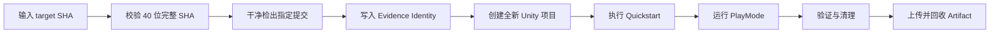

# Unity Quickstart 的可执行接入证据与有界进程治理

> 系列：Sakura Framework 工程实践
>
> 日期：2026-08-05
>
> 状态：可发布候选
>
> 核心问题：一个 Unity 框架已经拥有安装器、Sample 和快速接入文档后，怎样证明新项目真的能够从固定提交开始，走完整条接入路径，并在失败或进程悬挂时留下可审计结果？

[系列目录](../blog.html)

框架维护者在自己的开发工程中验证 Quickstart，通常很顺利：

- 菜单可以打开；

- 安装器能找到包；

- Sample 可以导入；

- 场景能进入 PlayMode；

- 按钮点击后有反应。


于是文档中写下：

> 十五分钟即可完成接入。

但换到一台干净 Runner 或新项目后，问题才开始出现：

- 仓库地址校验只允许 HTTPS，而实际私有 Gitea 使用 HTTP；

- Evidence 程序集与包内测试程序集重名，干净项目首次编译失败；

- Unity 已经写出成功结果，却没有正常退出；

- 测试 XML 没有生成，Job 只能等待超时；

- 清理逻辑因为进程未结束而没有执行；

- Artifact 上传成功，却没有验证下载后仍然完整；

- Workflow 验证的提交不是准备登记的目标提交。


这些问题不是功能按钮本身的 Bug。

它们说明 Quickstart 还没有成为一条可证明、可复现、可回收的用户路径。

## 先说结论：接入成功需要一条端到端证据链

**可执行接入证据（后文简称“新电脑第一次也能走完”）**：从确定代码身份出发，在全新消费项目中执行真实接入流程，验证关键行为、保存结果、回收环境，并证明 Artifact 仍可被重新读取的完整证据链。

“新电脑第一次也能走完”至少包含六层。

|层级|要证明的事实|
|---|---|
|代码身份|Runner 检出的就是指定完整 SHA|
|干净消费环境|项目不是仓库内长期存在的测试工程|
|接入语义|Preview、确认、安装和 Sample 导入确实完成|
|运行行为|目标 PlayMode 测试实际执行并通过|
|生命周期|Unity 退出异常时仍能有界终止并执行清理|
|Artifact 闭包|上传后的证据下载回来仍完整且身份一致|

少任何一层，结论都应该收窄。

## Runtime Starter 和 Quickstart 不是同一种证明

近期仓库同时加强了 Runtime Starter 与 Editor Tools Quickstart。

二者容易被混为一谈，但回答的问题不同。

|路径|回答的问题|不能替代什么|
|---|---|---|
|Runtime Starter|当前项目中的 Bootstrap、Event、Pooling、Input、Asset、Save、Preferences、Config、UI、Audio 十项基础能力是否能够被自检|不能证明新项目能完成安装和 Sample 导入|
|Editor Tools Quickstart|一个全新项目能否从固定提交进入安装器、完成确认、导入 Beginner Sample 并运行目标 PlayMode|不能证明所有生产业务配置已经完成|

Runtime Starter 更像环境体检。

Quickstart 更像第一次真实办理入场手续。

前者验证能力点，后者验证用户路径。

大型框架需要同时保留这两种证据，而不是用一个综合 Demo 代替全部接入证明。

## 第一层：固定提交不是附加信息，而是证据主键

**同提交接入（后文简称“测的就是这一版”）**：Workflow 输入、实际检出、Receipt、测试结果和 Artifact 全部绑定到同一个不可变 Commit SHA。

合理流程是：



这里需要防止的不是普通测试失败，而是身份漂移。

例如：

```text
Workflow 从 main 启动
→ 执行期间 main 又前进
→ 测试使用了新的 HEAD
→ 工作记录却把结果登记给旧的目标提交
```

因此，证据目录中的每个关键 Receipt 都应携带：

- `targetSha`；

- `runId`；

- Workflow 与 Job 身份；

- 生成时间；

- Artifact 名称；

- 必要时还包括阶段、SampleId 和结果状态。


如果 Receipt 身份对不上，即使界面曾经运行成功，也不能为目标提交背书。

## 第二层：必须创建真正的新消费项目

长期维护的 Testbed 很有价值。

它能快速运行大量回归，也能保存昂贵的 Unity Library 缓存。

但它可能长期掩盖：

- 已安装的包；

- 手工创建的 asmdef；

- 旧的 ProjectSettings；

- 本地凭据；

- 维护者熟悉的操作顺序；

- 上一次测试留下的资源；

- 未声明的仓库路径。


**干净消费证明（后文简称“空房子验收”）**：从一个此前不存在的目录创建 Unity 项目，再通过公开入口完成接入。

空房子验收必须做到：

1. 目标项目路径启动前不存在。

2. Unity 真实执行 `-createProject`。

3. 接入所需文件通过明确的 prepare 阶段写入。

4. Quickstart 走正式 Preview 与确认语义。

5. Sample 由正式入口导入，而不是复制仓库内部成品。

6. 目标 PlayMode 在该新项目中运行。

7. 流程结束后只清理自己声明拥有的目录。


这一步最容易暴露“维护者工程能跑，消费者工程不能编译”的问题。

## 第三层：不能只检查进程退出码

Unity 自动化有一个不舒服但必须正视的现实：

> 业务流程可能已经写出最终结果，Unity 进程却仍然没有退出。

反过来，Unity 也可能以零退出码结束，但关键 Receipt 或测试 XML 根本没有生成。

因此，单独依赖进程退出码不够。

**终态凭据（后文简称“事情真的办完了”）**：由被测流程写出的结构化结果，明确说明阶段、身份和通过或失败状态。

Quickstart 可以使用终态 JSON：

```text
status = passed | failed
phase = Completed
runId = 当前 Run
targetSha = 当前目标提交
sampleId = 预期 Sample
```

PlayMode 则可以使用非空测试结果 XML 作为完成文件。

监控器需要同时观察：

- 子进程是否退出；

- 终态凭据是否出现；

- 完成文件是否出现；

- 总执行时间是否超过上限；

- Receipt 身份是否与当前 Run 一致。


## 第四层：只终止自己拥有的 Unity 子进程

当 Unity 写出成功 Receipt 后仍然悬挂，最危险的修复是：

```text
pkill Unity
```

自托管 Runner 可能同时承担其他工作。

广泛杀进程会把当前 Job 的问题扩散成其他项目的随机失败。

**Owned Process Watchdog（后文简称“只管自己开的进程”）**：由父进程直接保存子进程 PID，只对该子进程执行超时、TERM 和 KILL。

合理策略是：

```text
启动指定 Unity 子进程
→ 每隔短周期检查终态凭据或完成文件
→ 观察到终态后等待短暂退出宽限期
→ 仍未退出则只向该 PID 发送 SIGTERM
→ 再等待终止宽限期
→ 仍未退出才向同一 PID 发送 SIGKILL
→ 超过总时限则明确失败
```

它解决了三个问题：

1. 流程已完成但 Unity 退出悬挂，不再无限占用 Runner。

2. 只处理当前父进程拥有的子进程，不污染其他 Job。

3. 最终结论同时受 Receipt 和退出行为约束，而不是把“被强杀”误写成成功。


如果终态 JSON 报告 `failed`，Watchdog 即使成功结束进程，也必须返回失败。

如果进程正常退出却没有写出预期终态，同样必须失败。

## 第五层：清理也需要所有权证明

自动化经常把清理写成：

```bash
rm -rf "$PROJECT_PATH"
```

但如果路径变量错误、目录已被复用，或者多个 Run 指向同一根目录，这条命令可能删除不属于自己的内容。

**所有者安全清理（后文简称“只拆自己搭的棚”）**：创建阶段写入 Owner 与 Run 标识，清理阶段核对标识后，只删除精确拥有的项目、临时目录和生成文件。

清理结果也应形成结构化摘要，例如：

- target SHA 是否一致；

- RunId 是否一致；

- 项目目录是否删除；

- Runner 临时根是否删除；

- 是否发现未知文件；

- 清理是否幂等。


更重要的是，清理应通过 `trap` 或等价机制绑定到流程退出。

这样即使 Quickstart、PlayMode 或验证失败，清理仍然有机会执行。

## 第六层：Artifact 上传成功仍不算闭环

很多 CI 流程最后一步是上传 Artifact。

Job 页面出现下载按钮后，维护者就认为证据已经保存。

但还可能存在：

- 上传路径漏掉文件；

- 空目录没有进入压缩包；

- Artifact 名称和 Receipt 不一致；

- 下载后目录层级改变；

- 文件被截断；

- 关键日志没有包含；

- 上传的是旧 Run 残留。


**Artifact 回收验证（后文简称“证据拿回来还能用”）**：上传完成后，在新的恢复目录下载同一 Artifact，并比较源目录与恢复目录的闭包和身份。

这一步证明：

> 被登记的证据不仅在 Job 工作区中存在，而且确实进入了可下载、可复查的 Artifact。

一个完整的 Quickstart Evidence 至少应保留：

- Identity JSON；

- 初始、准备后和最终 Manifest；

- Packages Lock；

- Preview Receipt；

- Quickstart Receipt；

- PlayMode 测试结果；

- Unity Editor 日志；

- 静态 Wiring 检查；

- Cleanup Summary；

- Artifact Recovery Receipt。


这些文件不是越多越好。

每一项都应该回答一个明确问题。

## 传输策略也属于接入合同

私有仓库 Quickstart 还必须面对认证与 Clone URL。

有些环境使用 HTTPS，有些自托管 Gitea 在受控网络中使用 HTTP。

如果 Workflow、C# 校验器和文档对 URL 策略理解不一致，就会出现：

- Shell 允许 HTTP(S)；

- C# 仍只接受 HTTPS；

- Preview 成功；

- 实际执行阶段失败。


因此，传输策略应只有一个规范化判断。

同时，凭据不应直接拼进 URL。

更安全的做法是使用临时 AskPass 或 Runner 提供的凭据通道，并在流程退出时删除临时脚本。

这里需要明确：

> 支持 HTTP 不等于推荐在不可信网络中明文传输凭据。

它只表示自动化合同应如实匹配当前部署；是否允许 HTTP，应由网络边界和风险策略单独决定。

## Quickstart 通过不等于发布完成

即使一条干净项目 Quickstart Evidence 完整通过，它仍然只能证明：

- 指定提交可以完成该接入路径；

- 目标 Sample 可以在声明环境中运行；

- 对应测试和清理成立；

- 证据 Artifact 可以回收。


它不能自动证明：

- 所有 Unity 版本都受支持；

- 所有平台 Player 都通过；

- Preview 包已经升级为 Supported；

- Candidate、RC、Tag 和 Release 门禁已经完成；

- 生产项目的资源、输入、存档和业务配置已经准备好。


我的判断是：

> Quickstart 的成熟标志不是“按钮更少”，而是第一次使用者走过的每一步，都能被自动执行、明确失败、留下证据并安全收尾。

## 设计检查表

为 Unity 框架建设 Quickstart Evidence 时，可以检查：

- Workflow 是否要求完整目标 SHA；

- 实际检出、Receipt 和 Artifact 是否绑定同一 SHA；

- 是否创建此前不存在的新 Unity 项目；

- 是否走正式 Preview、确认和 Sample 导入路径；

- PlayMode 是否在新项目中真实执行；

- 测试结果是否验证非零执行与全量通过；

- Unity 悬挂时是否只终止当前拥有的 PID；

- 是否同时检查退出码、终态 JSON 和完成文件；

- 清理是否核对 Owner 与 RunId；

- Artifact 是否上传后重新下载并验证闭包；

- HTTP(S)、凭据与 C# 校验是否使用同一传输策略；

- Evidence 通过后是否仍保持产品生命周期和发布结论克制。


## 术语对照

|正式术语|通俗称呼|含义|
|---|---|---|
|可执行接入证据|新电脑第一次也能走完|在全新项目中复现完整接入路径|
|同提交接入|测的就是这一版|所有证据绑定同一个完整 SHA|
|干净消费证明|空房子验收|在此前不存在的项目中完成接入|
|终态凭据|事情真的办完了|结构化证明流程已通过或失败|
|Owned Process Watchdog|只管自己开的进程|只监控并终止当前父进程拥有的子进程|
|所有者安全清理|只拆自己搭的棚|核对 Owner 后删除精确拥有的目录|
|Artifact 回收验证|证据拿回来还能用|下载后验证证据闭包与身份仍完整|

> 资料说明：本文依据 2026-08-03 至 2026-08-05 的 Runtime Starter、Editor Tools Quickstart 与 Runner Evidence 更新整理。该时间点部分 Quickstart Runner 复验仍在推进中，不能据此声明正式发布门禁已经完成。
