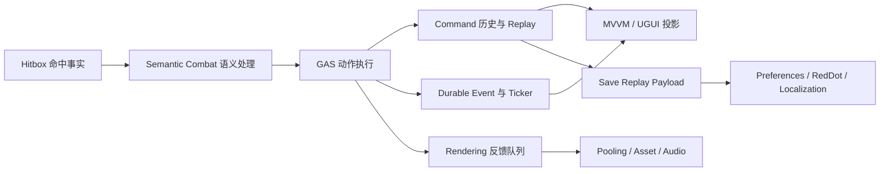

# Unity Sample 的条件组合层与渐进式依赖闭包

> 系列：Sakura Framework 工程实践
>
> 日期：2026-08-05
>
> 状态：可发布候选
>
> 核心问题：一个综合 Sample 想展示十多个框架模块时，怎样避免为了“效果完整”而扩大父包依赖、污染消费项目，并让缺少可选包的项目仍能安全运行？

[系列目录](../blog.html)
开发框架 Sample 时，很容易出现一种扩张路径。

最初，示例只需要展示战斗主循环：

- 接收一次命中；

- 解析语义信号；

- 执行伤害；

- 更新生命值；

- 判断胜负。


随后，为了让示例更像一款真正的游戏，又不断加入：

- 输入录制；

- Command、Undo、Redo 与 Replay；

- Event 与公告；

- MVVM 和正式 UGUI；

- 对象池、资源引用和音效；

- Save、Preferences、RedDot 与 Localization。


最后，示例确实更完整了，但父包也可能被迫依赖十几个模块。任何只想使用战斗编排内核的项目，都要承担整套 UI、音频、存档和本地化依赖。

这时，Sample 不再只是展示能力，而开始反向改变产品边界。

## 先说结论：综合展示应该向上组合，而不是向下污染核心

**条件组合层（后文简称“够包才升级”）**：只有当一组可选依赖形成完整闭包时，才装配对应展示能力；否则保持较低档位，而不扩大核心包的硬依赖。

“够包才升级”解决的不是某一个 `#if`。

它解决的是三个同时存在的问题：

1. 核心包只承诺最小职责。

2. 综合 Sample 可以展示真实的跨模块协作。

3. 消费项目缺少可选包时，仍然可以编译、导入和运行基础路径。


近期的 Semantic Battle Final Showcase 采用了四档结构。

|档位|条件能力|展示内容|缺失时的行为|
|---|---|---|---|
|Baseline|Core、GAS、Hitbox 等父包基础闭包|命中语义、伤害、状态与基础操作|始终保留|
|P1|再满足 Bootstrap、Input、Command、Event、Config、Ticker、UI、MVVM|正式 UGUI、命令按钮、撤销重做、Replay、公告与诊断|任一条件不足时回到 Baseline|
|P2|在 P1 上再满足 Rendering、Pooling、Asset、Audio|反馈队列、池化命中闪光、资源引用计数、程序化音效|条件不足时保持 P1|
|P3|在 P2 上再满足 Preferences、Save、RedDot、Localization|语言、检查点、未读状态与双语操作面板|条件不足时保持 P2|

这里最重要的不是“总共接了十六个包”。

真正重要的是：

> 十六个包只存在于 Sample 的最高展示档位，没有被写进战斗编排父包的产品合同。

## Sample 应该展示组合关系，而不是制造第二套框架

综合 Sample 的价值，在于把已经存在的模块放进同一条真实链路。



这条链路应该尽量复用各模块的公开合同。

例如：

- 战斗状态通过 Command 记录，而不是另写一套 Sample 专用历史系统；

- 存档保存可重演的命令序列，而不是直接修改战斗对象内部字段；

- 命中反馈先进入有界队列，再由表现消费者处理；

- 资源通过引用计数管理，而不是把 Sample 的 Sprite 和 AudioClip 变成全局单例；

- UI 按钮和键盘输入进入同一条命令管线，而不是各写一套行为。


一旦 Sample 为了方便而绕过正式合同，它展示的就不再是框架用法，而是维护者知道内部细节时才能成立的特殊路径。

## 为什么不能“有几个包就开几个功能”

看起来最灵活的方案，是逐项检测：

- 有 Command 就开撤销；

- 有 UI 就开界面；

- 有 Audio 就播放声音；

- 有 Save 就显示存档；

- 有 Localization 就切语言。


但这种逐项启用会制造大量半成品状态。

例如：

- 有 Save，没有 Command Replay，存档到底保存什么；

- 有 RedDot，没有 Save revision，未读依据从哪里来；

- 有 Rendering，没有 Pooling，反馈对象由谁回收；

- 有 UI，没有 MVVM，展示层从哪里读取稳定状态；

- 有 Preferences，没有 Localization，语言偏好写入后由谁消费。


**能力闭包（后文简称“整套才成立”）**：一组模块只有在其依赖、所有者、数据来源和清理责任全部存在时，才构成可以对外启用的能力。

因此，P1、P2、P3 都不应被理解为若干独立开关。

它们更像逐层建立的合同：

```text
Baseline
  └─ P1：交互与可视化合同完整
       └─ P2：表现反馈合同完整
            └─ P3：跨会话连续性合同完整
```

任何一层不完整，都保持上一层，而不是进入无法解释的部分启用状态。

## 运行时生成资源，是一种边界保护

综合 Sample 常见的另一个问题，是把演示资源偷偷变成项目依赖。

例如，示例要求项目预先存在：

- 指定 Canvas；

- 特定 Prefab；

- Addressables Group；

- AudioMixer；

- Input Actions；

- 本地化表；

- PlayerPrefs 键；

- 固定存档目录。


这种示例在维护者工程里可以运行，导入干净项目后却会立即失效。

因此，近期展示层采用了更克制的所有权策略：

|内容|Sample 的处理方式|
|---|---|
|UGUI 舞台|运行时创建，Host 销毁时释放|
|命中闪光|运行时生成并由对象池复用|
|Sprite / AudioClip|Sample 自有瞬态资源，通过引用计数核销|
|Preferences|命名空间隔离的内存 Store|
|Save|唯一系统临时目录中的 Replay Payload|
|输入|Sample 自己的 ActionId 与 Recorder|
|清理|只删除自己拥有的对象、监听器、槽位和临时目录|

这不是生产方案。

它是一种 Sample 边界声明：

> 我可以证明模块如何协作，但不会擅自替消费项目决定资源、输入、持久化和发布策略。

## Dispose 不是收尾细节，而是组合层的反向证明

模块组合越多，清理顺序越重要。

创建路径通常很显眼：

```text
创建 Command
→ 订阅 Event
→ 创建 View
→ 注册按钮
→ 创建反馈池
→ 持有资源
→ 打开存档与偏好
```

真正容易被忽略的是反向路径：

```text
停止观察
→ 注销监听
→ 清空未读树
→ 释放扩展层
→ 回收池对象
→ 核销资源引用
→ 销毁 View
→ 关闭 UI 状态机
→ 从 Controller 脱离
```

**对称生命周期（后文简称“怎么装上就怎么拆下”）**：每一项注册、持有、订阅和创建，都存在唯一且可重复执行的反向动作。

综合 Sample 必须验证：

- Host 销毁后没有残留监听；

- 重复 Dispose 不会二次释放；

- 重复运行不会累积按钮回调；

- 对象池 active 数归零；

- AssetRef 引用归零；

- 临时存档和偏好不泄漏到下一次运行；

- 降级档位不会残留高阶对象。


如果一个组合层只能启动，不能完整退出，它证明的只是“Demo 曾经亮起来”，不是模块能够安全协作。

## 这套方式的代价

条件组合层并不是免费方案。

它会增加：

- 条件程序集；

- 最低版本约束；

- 档位识别；

- 组合测试；

- 降级路径；

- 文档说明；

- 清理矩阵。


但这些复杂度本来就存在。

区别只在于，是把它们显式放在 Sample 私有组合层，还是隐式转嫁给每一个消费项目。

我的判断是：

> 对大型框架而言，Sample 的职责不是展示最多功能，而是展示最小核心如何在不改变产品边界的前提下，被逐层组合成完整体验。

## 设计检查表

准备为一个 Sample 继续增加模块前，可以检查：

- 新能力属于核心合同，还是只属于展示；

- 是否会扩大父包硬依赖；

- 是否存在完整的条件闭包，而不是若干随意开关；

- 缺少依赖时能否回到明确档位；

- 是否依赖消费项目已有 Prefab、设置或持久化目录；

- 输入、Command、Event 和 UI 是否走同一事实源；

- 每项资源、监听和临时文件是否有明确 Owner；

- Host 销毁与重复 Dispose 是否有回归测试；

- Sample 通过是否被错误描述为正式产品成熟度提升。


## 术语对照

|正式术语|通俗称呼|含义|
|---|---|---|
|条件组合层|够包才升级|完整依赖闭包满足后才装配对应能力|
|能力闭包|整套才成立|依赖、数据、Owner 与清理责任共同完整|
|对称生命周期|怎么装上就怎么拆下|创建和注册均有幂等反向动作|
|渐进降级|保住上一档|高阶条件不足时稳定回到已成立档位|

> 资料说明：本文依据 2026-08-04 至 2026-08-05 的仓库实现与测试记录整理。文中档位描述是该时间点的工程快照，不等同于相关包已升级为 Supported 或已完成正式发布。
