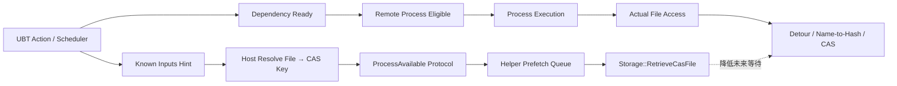
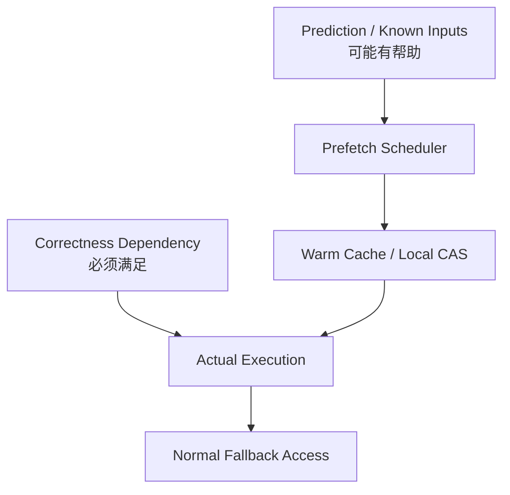

# 数据预热与正确性分离：Unreal Build Accelerator 的 Known Inputs、CAS 预取与执行闸门

> 系列：从 Unreal Engine 源码理解引擎设计
>
> 日期：2026-08-27
>
> 状态：草稿
>
> 核心问题：远程构建已经知道一个编译 Action 很可能读取哪些文件时，怎样提前把这些内容送到 Helper 附近以隐藏网络延迟，同时又不让“预测输入”变成构建正确性必须依赖的隐藏协议？
>
> 关键词：Unreal Engine、UBA、Known Inputs、CAS、Prefetch、Distributed Build

[系列目录](../blog.html)

一台远程构建机器已经空闲。

Scheduler 也已经决定：

```text
这个 C++ Compile Action
可以交给它执行。
```

编译器进程成功启动。

CPU 也开始运行。

但真正进入编译以后，第一批 Header Include 开始访问文件。

Helper 发现这些内容本地并不存在。

于是：

```text
编译器请求文件
→
Helper 才开始向 Host / CAS 拉取
→
等待网络
→
内容到达
→
编译继续
```

如果网络延迟很高，这种等待会重复发生。

从任务调度的角度看：

```text
远程机器已经拿到工作。
```

从数据路径的角度看：

```text
工作真正需要的数据还没有靠近执行位置。
```

于是一个很自然的优化出现了：

> 既然构建系统在 Action 开始以前已经知道很多潜在输入，为什么不提前把它们送过去？

这就是 Known Inputs 预热真正解决的问题。

但它同时制造了一个很危险的架构诱惑：

```text
既然我们已经知道输入
→
那这份 Known Inputs 列表是不是就等于 Action 的完整依赖清单？
```

答案是否定的。

而这条否定，比预取本身更值得研究。

## 先说结论：Known Inputs 是数据预热平面，不是构建正确性平面

**数据预热（后文简称“文件真正被读取以前先把它搬近一点”）**：根据已有依赖信息或预测结果，在任务正式访问数据以前异步准备其内容，以降低之后真实访问时的等待时间。

**正确性主链（后文简称“就算预热完全失败，系统仍然必须能得到正确文件”）**：真正决定 Action 能否执行、文件访问返回什么内容以及构建结果是否有效的依赖、文件系统、Detour、Storage 与 CAS 访问协议。

两者之间最重要的关系是：

```text
Prefetch
可以让正确路径更快

但
Prefetch 不能成为正确路径成立的前提。
```

可以把 UBA 当前主链压缩成：



真正决定构建是否正确的是：

```text
Dependency Ready
+
Actual File Access Correctness。
```

Known Inputs 只是在这条路径旁边提前做准备。

## UBA 首先不是 UBT 的别名

讨论 Known Inputs 以前，需要先把几个常见名字分开。

Unreal 构建工具链中至少存在：

```text
UBT
UHT
UAT
UBA。
```

它们不是同一个“大构建工具”的不同函数。

可以粗略理解为：

| 系统 | 主要职责 |
|---|---|
| UBT | Target、Module、Action Graph 与构建决策 |
| UHT | Unreal Header 解析与代码生成 |
| UAT | Build/Cook/Stage/Package/Deploy 等自动化编排 |
| UBA | Action 执行加速、远程进程、CAS/Storage、Helper 协调与 Trace |

UBA 可以作为 UBT 的 Action Executor。

也可以由 `UbaCli` 通过独立 Scheduler / YAML 驱动。

因此：

```text
UBT 知道构建图
```

和：

```text
UBA 知道某个 Action 怎样执行得更快
```

本身就是两层职责。

## Dependency 与 Known Input 必须分开

**Action Dependency（后文简称“这个任务什么时候有资格开始”）**：决定前置 Action 是否完成，以及当前 Action 是否具备执行条件的调度事实。

**Known Input（后文简称“它大概率很快会读这些文件”）**：提前告诉远程数据面哪些内容值得准备的性能提示。

例如：

```text
Compile Foo.cpp
```

可能依赖：

```text
GenerateHeader Action
```

必须先完成。

这属于：

```text
Dependency。
```

同时，Foo.cpp 编译大概率会读取：

```text
Foo.h
CoreMinimal.h
若干 Generated Header
```

这属于：

```text
Known Inputs。
```

两者虽然都叫“输入相关信息”，意义完全不同。

Dependency 回答：

```text
现在能不能执行？
```

Known Input 回答：

```text
如果要执行，哪些数据值得提前准备？
```

如果这两件事被混在一起，优化层就会开始拥有改变构建语义的权力。

## PrerequisiteItems 可以成为预取提示，但不因此升级成依赖图

UBT 本来就拥有：

```text
LinkedAction.PrerequisiteActions
LinkedAction.PrerequisiteItems。
```

前者参与 Action Graph。

后者可以被编码成 UBA Action 级 Known Inputs。

这项复用很合理。

因为构建系统已经掌握一批：

```text
高概率会被当前 Action 使用的文件。
```

但：

```text
PrerequisiteItems
→
Known Inputs
```

并不意味着：

```text
Known Inputs
→
Action 的全部真实运行时文件访问。
```

编译器实际还可能通过：

- 响应文件；
- 系统 Header；
- 工具自身资源；
- 间接 Include；
- 动态路径；

访问其他数据。

所以 Known Inputs 最安全的定义应该始终保持：

> 已知有价值输入的一个子集或提示集合。

而不是：

> 构建过程唯一合法输入 Manifest。

## UbaCli 又提供了另一条 Known Inputs 输入面

除了 UBT Action 自带的 Known Inputs，Scheduler YAML 还可以提供：

```yaml
knowninputsfile: /path/CommonInputs.txt

processes:
  - app: ...
    dir: ...
    knowninputsfile: /path/ActionInputs.txt
```

这里出现两个层级：

**Common Known Inputs（后文简称“这个 Helper 大概率很多任务都会用”）**

和：

**Action Known Inputs（后文简称“这一项工作尤其可能马上用”）**。

两者虽然最终都进入 CAS 预取路径，但生命周期并不一样。

## Common 与 Action 不应该强行共用同一个状态机

Common Inputs 的特点是：

```text
跨多个 Action 共享。
```

例如一个构建 Helper 可能反复访问：

- 编译器工具；
- 常用 Header；
- 公共 Runtime 文件。

Action Inputs 则只与某一个进程分配关联。

因此两者的合同天然不同。

| 维度 | Common | Action |
|---|---|---|
| 作用域 | 当前 Helper Session | 单个 Process |
| 登记时间 | Helper 连接以前 | Process 入队时 |
| 发送方式 | 可分批流式发送 | 随 Process Response 携带 |
| 完成状态 | 每 Client 有独立 Cursor | 当前 Response 内处理 |
| 对进程分配 | 会形成前置闸门 | 可与进程创建重叠 |
| 去重 | Per-client `sentKeys` | 同一 `sentKeys` |

共享字段不代表共享生命周期。

这是非常值得迁移的一条设计原则：

> 两类对象即使最终使用同一个底层数据结构，只要完成条件不同，就不应该为了“统一”强行做成同一个状态机。

## Common Known Inputs 必须在 Helper 连接前登记

这项顺序不是普通代码风格。

它属于初始化拓扑。

Common Input 的流程近似：

```text
解析配置
→
登记 Common Known Inputs
→
允许 Coordinator 创建 Helper
→
Helper 连接
→
Session 首次启动 Common Preparation。
```

如果顺序反过来：

```text
先连接 Helper
→
Session 已经开始
→
之后才设置 Common Inputs
```

系统就需要面对：

```text
已经启动的 Client
是否应该重新补发？
谁拥有重新初始化？
已有 Cursor 怎么办？
```

当前合同更简单：

> Common 配置属于 Session 启动以前的注册信息。

因此：

```text
Registration
→
Session Start
```

是一条不可随意交换的生命周期顺序。

## 配置阶段和运行阶段应该拥有明确冻结边界

**注册冻结边界（后文简称“连接一旦开始，这份公共预热计划就不再随便改”）**：在远端执行 Session 对外可见以前完成 Common Known Inputs 登记，Session 启动以后将其视作稳定输入。

这种结构可以迁移到很多系统：

```text
服务发现列表
→
在 Worker 启动以前注册

网络协议能力
→
在 Connection Handshake 以前确定

资源 Warmup Profile
→
在 Loading Session 以前冻结。
```

如果运行阶段允许任意修改启动配置，系统就需要持续处理：

- 重新广播；
- 版本漂移；
- Client 补偿；
- Cursor Reset。

很多时候更合理的设计是：

> 初始化阶段解决配置变化，运行阶段消费稳定快照。

## Host 会先把路径解析成内容身份

Known Input 不是直接把整个文件内容塞进控制消息。

Host 会为输入准备：

```text
File StringKey
CAS Key
Memory Map Alignment
Allow Proxy。
```

这里最重要的转换是：

```text
Path
→
Content Address。
```

**内容寻址（后文简称“用内容身份描述文件，而不是只相信某台机器上的路径”）**让远端 Helper 可以围绕 CAS 获取数据。

路径回答：

```text
这个文件在 Host 上叫什么？
```

CAS Key 更接近：

```text
我真正需要的是哪份内容？
```

对于远程执行系统，这种分离非常重要。

本地路径并不是跨机器稳定身份。

## Known Inputs 的真正价值是把 Retrieve 提前

如果没有 Known Inputs：

```text
Process Start
→
Compiler 真正访问 File X
→
Helper 发现本地缺失
→
Retrieve CAS
→
等待
→
继续。
```

有 Known Inputs 以后：

```text
Process 被分配以前或同时
→
Known Input 到达 Helper
→
Retrieve CAS 提前进入 Work Queue

稍后 Compiler 访问 File X
→
内容可能已经在本地
或至少已经在途。
```

这不是减少文件数量。

也不是改变编译器行为。

它只是把：

```text
必然或高概率发生的数据等待
```

从关键路径上向前移动。

这就是典型的 latency hiding。

## Common Process Gate 只保证“预取已开始”，不保证“文件已下载完”

这是整套协议最容易被误读的地方。

Common Known Inputs 尚未准备完成，或者当前 Client 还没有接收完自己的 Common Entries 时：

```text
ProcessAvailable
```

可以暂时不下发真正 Process。

客户端收到：

```text
Common-only Response
```

以后会继续 Poll。

表面看起来很像：

```text
Common 文件下载结束
→
才允许 Process Start。
```

实际并不是。

真正保证的是：

```text
Common Entry
已经送到 Client
↓
Client 已经把对应 Retrieve 工作安排进去
↓
随后 Process 才开始获得分配机会。
```

并没有等待：

```text
Storage::RetrieveCasFile
全部完成。
```

所以：

**预热闸门（后文简称“先确保下载已经开跑，再让任务进来”）**只改变数据准备的起跑时间。

它不是：

**正确性屏障（后文简称“没有全部完成就绝对不能执行”）**。

这一区分非常重要。

## 为什么不直接等所有 Common 下载完成再启动进程

最直观的“更保险”方案是：

```text
所有 Known Input
全部 Retrieve 完成
→
Process Start。
```

但这样会带来新的问题。

假设某个文件：

```text
最终根本没有被当前 Process 使用。
```

现在进程仍然必须等待它下载。

Known Inputs 一旦预测过宽：

```text
性能优化
```

反而变成：

```text
额外启动延迟。
```

UBA 当前更像：

```text
让数据下载领先进程一步
```

而不是：

```text
要求所有预测数据在进程前形成完整 Barrier。
```

这是更符合 Prefetch 语义的设计。

## Action Known Inputs 更明确地允许数据和计算重叠

Action Known Inputs 与 Process Record 位于同一个完整响应中。

Helper 会先安排对应 Retrieve。

但随后仍然可以继续进入 Process Creation。

因此：

```text
Retrieve
```

和：

```text
Process Startup
```

存在重叠空间。

这说明预取系统真正追求的是：

**工作重叠（后文简称“下载和进程启动能并行就不要硬串行”）**。

只要真实文件访问路径仍然可以在内容尚未到达时正确等待，

就没有必要把所有预取都升级成同步屏障。

## 预取失败必须退回正确路径，而不是让构建语义改变

假设一个 Known Input：

```text
RetrieveCasFile
```

失败。

如果 Known Inputs 是正确性主链：

```text
整个 Action 必须失败。
```

如果 Known Inputs 是优化提示：

```text
预取没有成功隐藏延迟
→
后续真实文件访问仍走正常 Storage / Detour 路径。
```

这两种 failure semantic 完全不同。

因此设计任何 Prefetch 系统时，都应该先问：

> 预取失败是“变慢”，还是“结果不再正确”？

如果答案是后者，

它其实已经不是普通 Prefetch。

它是正式依赖传输协议。

命名和测试都应该升级。

## 64 KiB 边界暴露了 Known Inputs 的真实性质

Action Known Input 路径会被编码成连续字符串 Block。

当前存在约：

```text
64 KiB
```

边界。

超过整体容量的后续路径可能被跳过，而解析仍然返回成功。

这个行为如果应用在：

```text
Correctness Manifest
```

上会非常危险。

假设：

```text
1000 个真正必要输入
只发送了前 800 个
系统仍然认为 Manifest 有效。
```

那么构建结果可能直接不可信。

但对 Prefetch Hint 来说，语义是：

```text
前 800 个被提前准备
后 200 个没有预热
→
以后按普通路径读取。
```

最坏结果应该是：

```text
性能下降。
```

而不是：

```text
构建错误。
```

**退化只影响性能（后文简称“提示不完整最多变慢，不能变错”）**是判断一个优化层是否真正与正确性分离的最好试金石之一。

## 优化提示可以允许不完整，正确性声明不可以

这一点可以推广成一个非常实用的判断表。

| 信息 | 是否允许缺失 | 缺失后的合理后果 |
|---|---|---|
| Dependency | 否 | 任务调度错误 |
| Correctness Manifest | 否 | 结果不可信 |
| Security Allowlist | 否 | 权限语义失效 |
| Prefetch Hint | 可以 | 性能下降 |
| Branch Prediction | 可以 | CPU 效率下降 |
| Cache Warmup | 可以 | 首次访问更慢 |

所以，当一个系统开始允许：

```text
静默截断
best effort
失败继续
```

时，

首先应该重新确认：

> 它究竟是在表达事实，还是只是在表达优化建议？

两类数据的失败合同不能互换。

## Common Input 的 Host 完成仍然不是 Client 下载完成

Common Known Inputs 至少存在几种不同“完成”。

```text
Registered
→
Host 正在准备 CAS Identity

Host Done
→
所有可准备 Entry 已经生成

Delivered To Client
→
当前 Client Cursor 已经追上 Entry 集合

Retrieve Complete
→
Helper 真的拥有对应内容。
```

这四个状态不能压成：

```text
CommonReady = true。
```

尤其：

```text
Host Done
```

只说明 Host 端已经准备完 key。

```text
Client Cursor Done
```

只说明控制信息已经送达。

它们都不能证明：

```text
内容文件已经完整落到 Helper。
```

这也是分布式系统里非常常见的状态分层：

> “消息已发送”与“工作已完成”不是同一件事。

## 每个 Helper 需要自己的 Common Cursor

Common Inputs 是共享集合。

但不同 Helper 连接时间不同。

网络容量也不同。

因此不能只维护一个全局：

```text
commonInputsSent = true。
```

每个 ClientSession 都需要独立知道：

```text
我已经接收到 Common Entries 的哪一段。
```

这就是 per-client cursor。

例如：

```text
Helper A
cursor = 120

Helper B
cursor = 43

Helper C
刚连接
cursor = 0。
```

Host 的 Common 集合是一份。

每个 Helper 的交付进度却不同。

**每连接进度（后文简称“同一份共享数据，每台远端机器都要单独记自己收到哪儿”）**是所有广播式控制协议都会遇到的问题。

## `sentKeys` 去重针对的是 Client 已经知道的内容身份

Common 和 Action Known Inputs 可能重叠。

两个连续 Action 也可能引用相同 Header。

如果每次都重复发送：

```text
同一个 CAS Key，
```

控制消息和 Retrieve Queue 都会浪费。

因此每个 Client 可以维护：

```text
sentKeys。
```

这不是全局去重。

原因依然是：

```text
不同 Client 的已知集合不同。
```

共享事实与每连接状态再次被明确分开。

## 调度消息的容量本身也是协议资源

Known Inputs 并不是脱离 `ProcessAvailable` 消息无限发送。

它受到：

```text
Network Buffer Capacity
```

限制。

因此系统必须在：

```text
Common Entries
Action Records
Action Known Inputs
```

之间安排协议空间。

这说明：

> 控制面消息本身也有 Budget。

一个分布式优化系统如果只计算：

```text
文件下载带宽，
```

却忽略：

```text
控制消息大小，
```

同样可能把预热信息做得比真正工作还重。

## 协议格式变化必须显式升版

本轮 Known Inputs 协议修改了：

```text
ProcessAvailable Response
```

开头布局。

旧 Client 原本会把第一个字段解释成另一种值。

新 Client 则先读取 Common Entry Count。

这不是：

```text
多一个可选字段
旧 Reader 忽略就好。
```

而是：

```text
相同 bit
在不同版本里含义已经改变。
```

因此：

```text
SessionNetworkVersion
57
→
58。
```

**协议版本闸门（后文简称“布局变了就拒绝让旧 reader 猜”）**把不兼容性放到连接协商层解决。

这是非常稳健的网络协议原则：

> 不可兼容 wire layout 变化应该 fail early，而不是让下游 parser 尝试猜对端到底是哪一版。

## 版本号不是文档数字，而是解析安全边界

如果 57 Client 连接 58 Server，

却没有版本阻断，

它可能把：

```text
Common Count
```

误读成：

```text
Process Race Count。
```

后续整个消息游标都会错位。

结果未必立刻 Crash。

更危险的是：

```text
继续按照错误字段解释剩余数据。
```

因此协议版本检查保护的是：

```text
parser 对同一组 bytes 拥有一致语义。
```

这和存档 Schema、网络 RPC、Binary Artifact Format 都是一类问题。

## Scheduler 的输入 Buffer 也需要明确所有权

YAML Parser 可以暂时把 Known Inputs 编码在自己的 Cache Buffer 中。

如果 Scheduler 入队以后仍然只是：

```text
保存一个 pointer/view
```

下一个 Action 重新解析其他文件时，

Cache 被覆盖，

旧 Process 就会持有悬空或错误数据。

当前链路会在进入 Process Entry 时复制对应 Block，使入队后的 Process 拥有自己的数据。

这是：

**配置视图与任务所有权分离（后文简称“解析器可以借给你看，但任务入队以后必须自己持有”）**。

这条规则同样适用于很多异步系统：

```text
Parser Buffer
Request Span
Stack Memory
Temporary Builder Data。
```

只要生命周期将跨越当前调用栈，

临时 view 就必须在明确边界转换成 owned state。

## “列表缓存”不等于长期文件真相

Scheduler YAML 路径还会缓存最近一次解析的 Known Inputs 文件。

连续多个 Action 使用同一个列表时可以复用编码结果。

这是一项纯解析优化。

因此：

```text
源文本稍后发生变化
```

不意味着已经入队的 Action 自动重新解析。

这也是合理的。

Process Entry 应该拥有：

```text
入队时的稳定输入快照。
```

而不是运行到一半突然因为配置文件变化，预取计划跟着漂移。

## 已知输入不是依赖图，也不是 Sandbox Allowlist

这是最需要明确禁止的两种误用。

### 误用一：把 Known Inputs 当依赖图

如果文件不在 Known Inputs：

```text
就禁止 Action 读取。
```

这已经改变了原本的 Correctness Path。

必须重新建立：

- 完整依赖生成；
- 失败语义；
- 诊断；
- 测试。

不能借 Prefetch Hint 顺便实现。

### 误用二：把 Known Inputs 当安全白名单

安全 Allowlist 要求：

```text
遗漏一个合法文件
→
明确拒绝并报告。
```

Known Inputs 则允许：

```text
遗漏
→
后续普通文件访问。
```

两者的失败哲学完全相反。

所以：

> 性能预测信息绝不能因为“看起来像文件列表”就被提升为权限事实。

## 预取提示的最大价值，是可以大胆失败

这是一个非常重要的工程优势。

只要 Prefetch 层不拥有 Correctness，

它就可以更激进地：

- 猜测；
- 缓存；
- 丢弃；
- 截断；
- 并行；
- 延迟；
- 部分失败。

因为系统始终存在：

```text
真实访问时的正确路径
```

作为兜底。

这实际上给性能工程提供了更大的优化自由。

如果所有性能预测都必须：

```text
100% 准确，
```

它就不再是 Prediction。

而会逐渐变成另一套必须维护的事实源。

## 同样不要让 Correctness Path 依赖“预取通常都会成功”

最危险的系统往往不是显式声明：

```text
Prefetch 是正确性依赖。
```

而是随着时间演化成：

```text
理论上不是，
但实际大家都假设它一定成功。
```

例如：

```text
Fallback 路径长期没人测试
↓
性能优化成为默认
↓
普通访问路径逐渐腐烂
↓
某次 Prefetch 失败
↓
构建突然彻底失败。
```

所以如果设计声明：

```text
Prefetch failure only hurts latency，
```

就应该有测试证明：

```text
Prefetch disabled / failed
→
任务仍然正确完成。
```

否则“正确性分离”只存在于架构图上。

## 测试需要同时证明收益路径和退化路径

Known Inputs 至少适合分成几类验证。

### 编码合同

验证：

- LF / CRLF；
- 终止符；
- Count；
- 64 KiB 边界；
- Cache 复用。

### Common 协议

验证：

- Helper 连接前登记；
- Host 构建完成；
- per-client cursor；
- common-only response；
- repoll；
- `sentKeys` 去重。

### Action 预取

验证：

- Action Known Inputs 与 Process Record 同批传输；
- Retrieve 可以和 Process Start 重叠；
- 相同 CAS Key 不重复安排。

### Failure

尤其应该验证：

```text
Known Input Retrieve 失败
→
真实进程仍能通过正常文件访问获得正确内容。
```

这是最能证明：

```text
Optimization
≠
Correctness
```

的一项测试。

### WAN 性能

最后才是：

- 高 RTT；
- 冷 CAS；
- 多 Helper；
- 大型 Header Set；
- Prefetch Hit Rate；
- Process Stall Time。

正确性证据和性能证据同样不能混为一谈。

## 当前源码测试并没有证明真实 WAN 收益

当前研究能够确认源码树存在：

- YAML 编码 / 缓存相关测试；
- Common Known Inputs 场景；
- 远程 Process 可以完成的测试入口。

但这不等于：

```text
本轮已经实际跑过。
```

也不等于：

```text
真实高延迟环境一定获得某个百分比提升。
```

当前仍没有从这次源码研究得到：

- WAN Benchmark；
- 多 Client 极限；
- 所有 Retrieve Failure；
- 容量压力；
- 跨版本真实二进制互联；

的运行证据。

因此正确的结论只能是：

> 当前源码结构明确把 Known Inputs 建模成预热优化，并已有部分测试入口；实际性能收益仍需要真实环境 Benchmark。

## 对 Asset Streaming 的迁移启示

游戏资源系统也经常拥有：

```text
下一房间大概率会使用这些资源。
```

可以：

```text
Warmup / Prefetch。
```

但加载预测失败以后，

真正进入房间时仍然应该：

```text
按正常 Asset Acquire 路径补加载。
```

否则 Warmup Profile 就从：

```text
性能优化
```

变成了：

```text
隐藏资源 Manifest。
```

一旦二者混在一起：

```text
策划漏配 Warmup
→
游戏资源直接缺失。
```

这就是典型的正确性泄漏。

## 对开放世界 Streaming 的迁移启示

玩家速度和方向可以预测：

```text
未来可能进入哪些 Cell。
```

系统可以提前提高这些 Cell 的优先级。

但：

```text
Prediction Miss
```

不应该让真正位于玩家当前位置的 Cell：

```text
因为不在预测列表里而永远不加载。
```

真正当前位置需求属于：

```text
Correctness / Required Target。
```

未来轨迹属于：

```text
Optimization Hint。
```

两者同样应该分层。

## 对 AI Context Preload 的迁移启示

Agent 执行任务以前，可以根据：

- Task Type；
- Project Graph；
- Historical Usage；

提前预取若干文件进入 Context Cache。

这能够减少后续检索等待。

但预测到的文件集合不能直接变成：

```text
唯一允许读取的任务事实。
```

如果 Agent 之后发现另一个合法相关文件，

它仍然应该走正式：

```text
Read Scope / Capability
```

规则。

性能预测不应该改变 Authority。

## 对数据库 Read-Ahead 的迁移启示

数据库和文件系统长期使用同样原则：

```text
预读可能命中
→
访问更快

预读没有命中
→
真实读取仍然正确。
```

UBA Known Inputs 的特殊之处只是：

```text
它把这个原则应用到分布式构建 Action 与 CAS。
```

底层思想并不局限于 Unreal。

## 一个更通用的三层模型

对于任何带 Prefetch 的系统，我会优先分成三层：



这里必须维持三个不变量。

### 不变量一

```text
删除所有 Prefetch
→
系统仍然正确。
```

### 不变量二

```text
Prefetch 不完整
→
最多增加延迟。
```

### 不变量三

```text
Correctness Dependency 不完整
→
必须明确失败。
```

只要三个条件中任何一个不成立，

就需要重新审视：

> 这个“优化层”是不是已经偷偷变成正式业务协议。

## 常见设计失败

### 把 Known Inputs 当作完整依赖图

优化提示开始决定任务正确性。

### 把 Known Inputs 当 Sandbox 文件白名单

Best-effort 列表被错误升级成安全权限事实。

### 所有预取完成以后才启动进程

预测过宽时，预取反而变成新的关键路径。

### Common 和 Action Known Inputs 强行使用同一个完成状态

跨 Session 预热与单 Action 预热的生命周期被混淆。

### Helper 已经连接以后才注册 Common Inputs

初始化协议变成动态补发状态机。

### Host Prepared 被解释成 Client 已经拥有内容

Control Plane 完成与 Data Plane 完成混为一谈。

### Client Cursor 完成被解释成 CAS Retrieve 完成

“已经通知去下载”和“已经下载完”混为一谈。

### 所有 Helper 共享一个全局 sent flag

不同连接的交付进度互相覆盖。

### 不做 CAS Key 去重

大量公共 Header 被每个 Action 反复安排下载。

### 临时 Parser Buffer 直接被异步 Process 长期引用

下一轮解析覆盖数据以后产生悬空或错误输入。

### Wire Layout 改变但不升协议版本

旧 Client 继续用旧字段布局解释新消息。

### Prefetch 失败路径长期不测试

架构上声称 best-effort，实际上已经形成隐藏 correctness dependency。

### 性能优化没有真实 WAN Benchmark

源码结构合理被错误扩大成“已经证明显著加速”。

## 我的数据预热与正确性分离检查表

1. 当前数据列表是 Correctness Dependency，还是 Optimization Hint？
2. 两者是否拥有不同数据类型或至少不同 API？
3. Prefetch 完全关闭以后任务是否仍然正确？
4. Prefetch 列表缺失部分数据以后是否只会变慢？
5. Prefetch Retrieve 失败以后是否存在可靠 Fallback？
6. Fallback 是否在自动测试中真正执行过？
7. Scheduler Dependency 是否不会被 Known Inputs 替代？
8. 安全 Allowlist 是否不会复用 Prefetch Hint 作为权威来源？
9. Common 与 Action Prefetch 是否拥有不同生命周期？
10. Common Configuration 是否在 Session 启动以前冻结？
11. Session 启动以后是否拒绝无协议的 Common Set 变更？
12. Path 是否会转换成稳定 Content Identity？
13. CAS Key 是否成为跨机器真正的数据身份？
14. Host Preparation、Control Delivery 与 Content Retrieve 是否是三个状态？
15. Process Gate 到底等待哪一个状态，是否有明确名称？
16. Gate 是否没有无意中升级成全下载 Barrier？
17. Action Prefetch 是否允许和 Process Startup 合理重叠？
18. 每个 Client 是否拥有自己的 Common Delivery Cursor？
19. Dedupe 是否按每个 Client 的已知 CAS Key 维护？
20. Control Message 是否有明确容量预算？
21. 容量不足时 Prefetch 是否有可解释退化语义？
22. 静默截断是否只出现在允许不完整的 Hint 数据中？
23. 如果列表必须完整，是否会 fail-closed 而不是继续？
24. Async Task 入队以后是否拥有自己的输入副本？
25. 临时 parser view 是否不会越过所有权边界？
26. Wire Format 改变以后是否显式提升协议版本？
27. Version Negotiation 是否在 Parser 看到不兼容布局前失败？
28. 测试是否分别覆盖 correctness fallback 与 latency optimization？
29. 性能测试是否包含高 RTT、冷缓存和多个 Helper？
30. Telemetry 是否能够区分 Prefetch Hit、Late Hit 与 Miss？
31. 是否能够统计进程真正因文件等待而停顿的时间？
32. 优化层是否始终可以被移除而不改变结果？
33. 当前系统是否已经出现“大家都假设预取一定成功”的隐性耦合？

UBA Known Inputs 最值得保留的设计思想，并不是：

```text
提前下载 Header。
```

这件事本身并不新鲜。

真正重要的是它把两类事实保持在不同层级。

构建系统知道：

```text
这个 Action 什么时候有资格执行。
```

预热系统知道：

```text
哪些文件很可能马上被读取。
```

CAS 知道：

```text
这些路径对应哪份内容。
```

Helper 可以：

```text
在真正访问发生以前尽量把内容搬近。
```

但即使所有预测全部失败，

实际文件访问仍然必须能够沿正常路径得到正确结果。

正是因为预取不拥有正确性，

它才可以：

- 不完整；
- 并行；
- 提前；
- 截断；
- 猜测；
- 部分失败。

而系统仍然可信。

因此 UBA Known Inputs 最值得迁移的原则可以压缩成一句话：

> **性能预测应该拥有加速系统的权力，但不应该获得决定系统真相的权力。**

## 术语对照

| 正式术语 | 文中通俗称呼 |
|---|---|
| 数据预热 | 文件真正被读取以前先把它搬近一点 |
| 正确性主链 | 就算预热完全失败，系统仍然必须能得到正确文件 |
| Action Dependency | 这个任务什么时候有资格开始 |
| Known Input | 它大概率很快会读这些文件 |
| Common Known Inputs | 这个 Helper 大概率很多任务都会用 |
| Action Known Inputs | 这一项工作尤其可能马上用 |
| 注册冻结边界 | 连接一旦开始，这份公共预热计划就不再随便改 |
| 内容寻址 | 用内容身份描述文件，而不是只相信某台机器上的路径 |
| 预热闸门 | 先确保下载已经开跑，再让任务进来 |
| 正确性屏障 | 没有全部完成就绝对不能执行 |
| 工作重叠 | 下载和进程启动能并行就不要硬串行 |
| 退化只影响性能 | 提示不完整最多变慢，不能变错 |
| 每连接进度 | 同一份共享数据，每台远端机器都要单独记自己收到哪儿 |
| 协议版本闸门 | 布局变了就拒绝让旧 reader 猜 |
| 配置视图与任务所有权分离 | 解析器可以借给你看，但任务入队以后必须自己持有 |

---

## 内部资料依据

本文主要基于以下材料整理：

- `notes/UnrealEngine源码研究/UE6/09_UnrealBuildAccelerator从Scheduler到HelperCAS预取_KnownInputs协议与远程执行闸门.md`
- `notes/UnrealEngine源码研究/UE6/08_UE6核心模块全景_依赖层级生命周期与纵向主链.md`
- `notes/UnrealEngine源码研究/UE6/README.md`
- `notes/UnrealEngine源码研究/README.md`
- `blogs/README.md`
- `blogs/publication.v1.json`

本文主要依据研究时的 Unreal Engine UE6-main 源码快照整理。

当前研究已经从源码层确认：

- UBT Action 可提供 Action-level Known Inputs；
- UbaCli / Scheduler YAML 支持 Common 与 Action `knowninputsfile`；
- Common Inputs 必须在 Helper Session 启动前登记；
- Host 会把路径转换为 CAS / name-to-hash 所需身份；
- Common Inputs 使用每 Client Cursor 分批交付；
- Common Gate 不等待 `RetrieveCasFile` 全部完成；
- Action Inputs 可以和 Process Creation 重叠；
- Common / Action 使用 per-client `sentKeys` 去重；
- 协议布局变化伴随 `SessionNetworkVersion` 升版；
- Action Known Input 编码存在有限容量与部分省略语义。

但本次源码研究没有：

- 编译 UBA；
- 实际运行 UbaTest；
- 启动真实远端 Helper；
- 执行高 RTT / WAN Benchmark；
- 验证全部 Retrieve Failure；
- 验证多 Client 极限；
- 证明当前机制在任何项目中具有固定百分比性能提升。

因此本文把 Known Inputs 定位为**源码上已经明确建立的数据预热协议**，但不把真实 WAN 性能、所有失败路径或跨版本二进制互操作写成已经验证完成的事实。

文中将“Prefetch Hint 与 Correctness Dependency 分离”的思想迁移到 Asset Streaming、开放世界预取、AI Context Preload 和数据库 Read-Ahead，属于工程设计归纳，不表示这些系统需要复制 UBA 的 Scheduler、CAS、Helper 或 wire protocol 实现。
