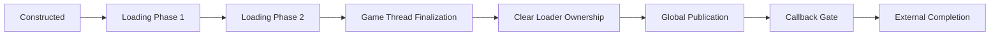
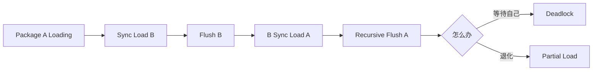
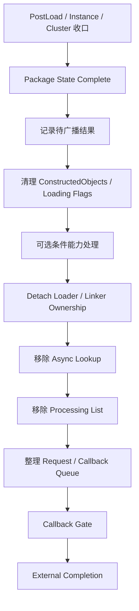

# 对象发布协议：AsyncLoading2 的可见性阶段、递归加载与安全完成边界

> 系列：从 Unreal Engine 源码理解引擎设计
>
> 日期：2026-08-18
>
> 状态：草稿
>
> 核心问题：异步加载中的 UObject 已经分配内存之后，为什么还不能立即被普通代码发现和长期持有，以及加载器怎样把内部就绪状态逐步转换成真正安全的外部完成状态？
>
> 关键词：Unreal Engine、AsyncLoading2、UObject、Visibility、PostLoad、Partial Load、Completion Boundary

[系列目录](../blog.html)

异步加载系统最容易制造一种非常自然的错觉：

```text
对象已经创建
=
对象已经加载完成
=
其他代码现在可以使用它
```

但在一个拥有并行序列化、PostLoad、递归依赖和全局对象查找能力的大型引擎里，这三个等号都可能不成立。

假设一个 Package 正在后台加载。

某个 UObject 的内存已经分配。

构造函数已经运行。

甚至加载器内部已经能够找到这个对象，用它继续处理同一批 Package 的其他依赖。

此时另一个系统执行：

```text
StaticFind
Soft Reference Resolve
Global Registry Lookup
```

它应该看到这个对象吗？

如果答案是：

```text
对象存在，所以当然可以
```

就可能把一个仍在 Serialize、PostLoad 或依赖收口过程中的半成品暴露给普通业务代码。

于是问题会表现成：

- 偶发字段仍然是默认值；
- 某些对象在开发环境正常、并行加载时失败；
- `StaticFind` 有时找到、有时找不到；
- Thread Sanitizer 在看似无关的位置发现竞争；
- `PostLoad` 中一次同步 `LoadObject` 突然制造长时间卡顿；
- Package 已经被内部标记完成，外部完成回调却还没有触发；
- 循环依赖只在特定加载顺序下出现缺字段或半初始化对象。

这些现象看起来来自不同模块。

实际上，它们都在指向同一个问题：

> **对象什么时候真正从“加载器内部状态”进入“外部可观察状态”？**

## 先说结论：对象创建与对象发布是两个生命周期阶段

**对象发布协议（后文简称“什么时候真的可以给外部用”）**：加载器在对象已经创建之后，通过内部阶段、可见性控制、生命周期清理和完成回调，把一个仍由加载器拥有的对象逐步转换成普通系统可以安全发现和持有的对象。

理解 AsyncLoading2 时，最重要的一条关系可以直接写成：

```text
constructed
!=
loader-ready
!=
globally published
!=
callbacks delivered
```

它们分别回答四个不同问题：

| 状态 | 回答的问题 |
|---|---|
| Constructed | UObject 的内存和身份是否已经建立 |
| Loader Ready | Async Loader 内部是否已经可以继续依赖它 |
| Globally Published | 普通代码是否可以安全发现并使用它 |
| Callback Delivered | 外部观察者是否已经收到本次加载完成通知 |

这四件事如果被压成一个：

```text
isLoaded
```

很多并发和生命周期错误就会失去表达空间。

AsyncLoading2 更值得借鉴的地方，也不是某几个 flag 的名字。

而是它明确承认：

> **内部能够继续工作，与外部已经获得访问权，是两种不同事实。**

## UE6 并没有推翻原来的 Package 加载主链

在进入具体发布阶段之前，需要先明确一个边界。

当前源码研究并不是在说：

> UE6 出现了一个完全不同的资源系统。

原来的主链仍然成立：

```text
Package
→
Archive / Package Metadata
→
Object Construction
→
Serialize
→
PostLoad
→
Runtime UObject
```

AsyncLoading2 仍然处于这条链中。

变化更多体现在：

> **对象在这条链的不同阶段究竟对谁可见。**

因此可以把旧的简单模型：

```text
Create
→
Serialize
→
PostLoad
→
Done
```

升级成：



这张图并不是 AsyncLoading2 所有内部事件的完整实现图。

它只是强调一件事：

> **Done 不是单一瞬间。**

## Phase1 表示对象仍然明确属于 Loader

**加载器所有权阶段（后文简称“还在加载器手里”）**：对象虽然已经存在，但其完整状态和外部可见性仍由当前异步 Package 加载流程控制。

对象被构造以后，会进入 Async Loading Phase。

此时最危险的错误认知是：

```text
UObject* ptr != null
→
可以对外发布
```

实际上，一个对象可能仍然需要完成：

- 属性反序列化；
- Import / Export 解析；
- 依赖对象加载；
- PostLoad；
- Instance 或 Cluster 处理；
- Game Thread 收口。

所以指针存在只证明：

```text
内存已经存在。
```

它不能证明：

```text
对象图已经稳定。
```

这种分离和数据库中的：

```text
Row 已经写入临时事务状态
```

与：

```text
事务已经 Commit
```

非常相似。

两者都“有数据”。

但可见性权限完全不同。

## Phase1 → Phase2 的切换必须避免短暂裸露窗口

加载中的对象需要从较早阶段进入较后阶段。

一个看起来很普通的实现可能是：

```text
Clear Phase1
→
Set Phase2
```

问题是两个操作之间存在一个非常短的窗口：

```text
Phase1 = false
Phase2 = false
```

如果其他对象发现逻辑把：

```text
没有任何 Loading Flag
```

解释为：

```text
这个对象已经属于普通 Runtime
```

那么一个仍在加载流程中的 UObject 可能瞬间被外部代码发现。

因此更稳健的状态转换是：

```text
先进入 Phase2
→
再离开 Phase1
```

可以近似理解为：

```text
旧保护还没有撤掉以前
先建立新的保护状态
```

这是一个非常通用的并发设计原则。

状态切换不是：

```text
A
→ 空状态
→ B
```

而应尽量是：

```text
A
→ A+B
→ B
```

当两个状态都承担安全语义时，短暂重叠通常比短暂无保护更加安全。

## Phase2 仍然不等于“业务代码可以用了”

**内部就绪态（后文简称“加载器自己已经能继续用了”）**：对象已经满足加载流程后续阶段的内部依赖，但仍然不代表普通 Game Thread 或任意业务系统获得了长期访问权。

这是整个模型最容易被误解的一步。

如果一个对象进入更后阶段，加载器可能需要让：

```text
同一批加载流程中的其他 UObject
```

访问它。

例如：

```text
Object A PostLoad
→
需要解析 Object B

Object B
→
已经完成必要阶段
```

加载器可以在受控 Visibility Scope 中允许这种访问。

这里的关键词是：

```text
受控。
```

它表达的是：

> Async Loader 为了推进自己的依赖图，可以看见一部分尚未全局发布的对象。

而不是：

> 这个对象现在已经正式进入普通业务世界。

因此：

```text
Loader Can See
```

不能自动推导：

```text
Everyone Can See。
```

## 内部可见性与全局可见性应该是两种权限

很多异步系统喜欢只有一个状态：

```text
Ready
```

但真正成熟的加载器往往需要至少两种 Ready。

第一种：

```text
Internal Ready
```

表示：

> 后台流水线可以继续推进。

第二种：

```text
Externally Observable
```

表示：

> 普通消费者可以安全使用。

这两个阶段分开以后，加载器可以获得一个非常重要的优化空间：

```text
内部已经完成足够工作
→
可以继续并行处理其他对象

但
→
暂时不允许业务代码拿到半成品
```

这实际上是一种：

**内部进度与外部一致性分离（后文简称“后台可以继续跑，外面先别看到”）**。

这条原则可以迁移到很多系统。

例如 Service 初始化：

```text
Service A 已经足够让 Service B 初始化
```

并不代表：

```text
Gameplay 可以立刻调用 Service A。
```

又例如场景 Streaming：

```text
Scene Object Graph 已经建立
```

并不代表：

```text
Scene 已经正式进入 Active Gameplay。
```

## 构造和 Serialize 中最危险的行为是提前发布 `this`

一个对象仍处于加载阶段时，最危险的操作通常不是：

```text
修改自己的字段。
```

而是：

```text
让其他系统提前知道自己存在。
```

例如：

```text
构造函数
→
GlobalRegistry.Register(this)

Serialize
→
GlobalEventBus.Subscribe(this)

Parallel PostLoad
→
Manager.Add(this)
```

这类操作会让对象逃离 Loader Ownership。

一旦进入：

- 全局 Registry；
- Multicast Delegate；
- Manager；
- 可被其他 UObject 遍历的共享容器；

普通系统就可能在错误时间访问它。

**加载中对象逃逸（后文简称“半成品跑出了加载器”）**：对象在加载协议尚未完成时，被写入一个对加载器外部可见的长期引用位置。

这种 Bug 的特点是非常难复现。

因为结果取决于：

- Worker 执行顺序；
- Package 依赖；
- 当前线程；
- Game Thread 时机；
- 是否启用并行加载；
- 是否出现递归同步加载。

单线程测试可能永远正常。

切到并行加载以后才出现。

## `PostLoad` 也不能被简单理解成 Game Thread Hook

很多工程代码会逐渐形成一种经验：

```text
构造阶段不能做
→
那就全部放进 PostLoad。
```

这同样不够准确。

某些类可以声明自己的 PostLoad 是线程安全的。

这意味着相应逻辑可能在 Loader Worker 执行。

所以实现 PostLoad 时需要首先区分两类工作。

### 纯数据整理

例如：

- 根据已加载字段构建局部缓存；
- 计算不会触碰全局状态的派生数据；
- 整理当前 UObject 自己的内容。

这类工作更容易适配并行 PostLoad。

### 外部发布

例如：

- 注册全局 Delegate；
- 修改全局 Manager；
- 触碰 Editor 单例；
- 修改 Renderer / Audio 等线程敏感系统；
- 把自身写入共享跨线程容器。

这类行为需要明确的线程和发布边界。

如果某个类无法继续满足：

```text
Thread-safe PostLoad
```

更稳健的做法通常不是继续在内部堆特殊分支。

而是重新审视：

> 这个类是否真的应该承诺并行 PostLoad？

## Game Thread 也不自动代表对象已经发布

另一个很容易产生误判的条件是：

```text
当前代码运行在 Game Thread。
```

Game Thread 确实承担很多最终收口工作。

但：

```text
IsInGameThread()
```

并不能单独证明：

```text
对象已经完成加载协议。
```

启动阶段尤其可能存在：

```text
Loader 本身就在 Game Thread 推进
+
对象仍然携带 Loading State。
```

所以：

```text
Game Thread
```

描述的是执行线程。

```text
Published
```

描述的是对象生命周期。

两者是正交维度。

这与很多并发系统中的一个常见错误相同：

> “已经切回主线程”被误认为“所有状态都已经稳定”。

实际上，主线程只是一个执行地点。

不是自动完成证明。

## 同步 `LoadObject` 会把异步依赖图重新压回调用栈

异步 Loader 之所以复杂，是因为它试图把：

```text
Package A
Package B
Package C
```

之间的关系组织成一张可以并行推进的依赖图。

此时如果某个对象在：

- 构造；
- Serialize；
- PostLoad；

内部主动调用：

```text
LoadObject
LoadPackage
StaticLoadObject
```

就等于要求：

> 我现在立刻需要另一个 Package 完成。

原本：

```text
Dependency Graph
```

被重新压成：

```text
Call Stack。
```

**递归同步加载（后文简称“异步流水线里突然要求现场等另一车货”）**会带来几个直接后果：

- Loader 流水线被串行化；
- Game Thread 可能出现明显 stall；
- 依赖顺序开始受到调用栈控制；
- 环依赖更难处理；
- 原本独立的 Package 生命周期开始互相嵌套。

因此，在 Serializer 中主动拉取 Package，通常比声明：

```text
Import
Soft Reference
Explicit Dependency
```

更难维护。

## 循环递归同步加载最终会遇到活性问题

考虑：

```text
Package A
正在 Serialize

A
→
同步 Load B

B
→
又同步要求 A
```

此时形成：



如果 A 坚持：

```text
必须等我自己完整加载完
```

才能返回，

系统会永久等待自身。

为了避免死锁，Loader 只能在某些条件下选择一个退化路径。

## Partial Load 是防死锁退化，不是正常完成

**部分加载（后文简称“先让一个没完全做完的 Package 暂时返回”）**：递归同步加载形成无法正常完成的环时，为了维持系统活性，让其中一个 Package 在未完成完整反序列化/PostLoad 的状态下返回。

Partial Load 最危险的误解是：

```text
它返回了
→
所以成功了。
```

更准确的理解是：

```text
系统选择了
活着继续跑
而不是
永久死锁。
```

它是 Recovery。

不是 Happy Path。

调用方拿到的对象可能还没有完整完成：

- Deserialize；
- PostLoad；
- 依赖初始化。

而且：

```text
哪个 Package 被迫 Partial
```

可能受到加载顺序影响。

于是 Bug 可能表现为：

```text
偶尔 A 缺字段
有时 B 缺字段
重启以后又正常
```

这种“随机感”实际上来自依赖环的执行顺序，而不是普通 RNG。

## Partial Flush 最应该做的是暴露依赖设计问题

如果出现 Partial Load，最差的修复通常是：

```text
再 Flush 一次
Sleep 一下
多加一把锁
```

这些方式只是改变：

```text
谁先进入环。
```

更合理的排查顺序是：

```text
发现 Partial Flush
→
定位触发 Package
→
找到 Serialize / PostLoad 中的同步 Load
→
画出 Package Dependency Cycle
→
改成声明式依赖
```

Partial Flush 因此不应该被当作：

```text
Loader 的普通优化细节。
```

它更像一种架构诊断信号：

> 依赖图中存在一个被同步调用栈隐藏起来的环。

## Package 内部完成也还不是外部通知点

假设一个 Package 的核心内容已经完成。

系统内部可能已经执行：

- 非线程安全 PostLoad；
- Instance 处理；
- Cluster 处理；
- Package Full Load 状态更新。

这仍然不意味着：

```text
现在立刻广播所有外部 callback。
```

原因是加载器本身还有内部 Ownership 和索引状态需要清理。

一个简化完成顺序可以表示成：



这里最值得注意的是：

> **回调出现在内部状态清理之后。**

## 完成回调本身会重新进入加载系统

为什么不能：

```text
Package 完成
→
立即 callback？
```

因为 callback 不是纯通知。

外部代码收到通知以后，完全可能：

```text
LoadPackageAsync(...)
LoadObject(...)
FlushAsyncLoading(...)
触发另一批依赖
```

也就是说：

```text
Completion Callback
```

是一个潜在的重入点。

**回调门（后文简称“内部状态整理好以后才允许外部重新进来”）**：在加载器仍处于 PostLoad routing 或递归同步加载栈时暂缓外部完成通知，直到内部状态已经满足重入安全要求。

这是一条非常重要的设计思想。

完成回调不是：

```text
最后一行顺手 Invoke 一下。
```

它是：

> 把控制权重新交还给未知外部代码的边界。

在这个边界之前，内部系统必须先问：

```text
如果 callback 现在重新调用我
我的所有列表、索引和 Ownership 是否已经稳定？
```

## 清理顺序属于并发合同，而不是代码风格

Loader 完成阶段中，一些操作必须保持确定顺序。

例如，如果旧 Async Package 还持有某个 Linker，却先从全局 lookup 中移除自己：

```text
Lookup
认为当前 Package 已经不存在
```

另一个加载流程可能立即为同一个 Package Identity 创建新状态。

但旧对象仍然没有完成 Detach。

于是形成：

```text
Old Package
仍拥有 Linker

New Package
尝试重新 Attach
```

这就是 Ownership Race。

所以：

```text
Detach
→
Remove Lookup
```

不只是更“整洁”。

它承担的是并发安全语义。

类似地：

```text
Processing List
```

也需要在允许 callback 重入之前先进入稳定状态。

这类顺序最不适合被“代码清理”随意交换。

## “Package Complete”与“外部完成”应当是两个指标

在调试工具里，如果只记录：

```text
Package State = Complete
```

开发者可能仍然会遇到：

```text
为什么我的 callback 没来？
```

因为中间还可能存在：

```text
Callback Gate
```

或者内部待广播队列。

所以加载诊断更适合分别记录：

```text
Internal Package Complete
Publication Complete
External Completion Delivered
```

当三个指标被拆开以后，问题定位会非常直接。

例如：

```text
Internal Complete = true
Published = false
```

说明问题在 Loader Ownership 清理或可见性。

而：

```text
Published = true
Callback Delivered = false
```

则更应该检查 callback gate 和当前重入状态。

## “完成回调名字听起来对”并不代表它仍然是正确 API

大型引擎演化过程中，一个非常危险的兼容陷阱是：

```text
API 还存在
+
名字非常符合需求
→
继续使用。
```

但当前源码研究已经显示，某些旧的 Package 完成通知虽然仍然保留声明，却已经明确进入 Deprecated / Unsafe 状态。

这说明迁移时不能只问：

```text
这个函数还编译吗？
```

还要问：

```text
当前生命周期合同还承认它是安全观察点吗？
```

新的批次型 End Load Context 也不应该被机械理解成：

```text
旧 callback 换了一个名字。
```

它的：

- 通知粒度；
- 构建条件；
- 使用环境；

都可能不同。

普通 Runtime Consumer 更适合依赖：

```text
自己发起的异步请求完成
```

而不是寻找一个看起来能观察“所有 Package 完成”的全局 Hook。

## 全局 Loader Hook 与业务加载完成不是同一个需求

这里很容易出现一种架构膨胀。

业务系统只是需要：

```text
我的这次资源请求完成以后做某件事。
```

却选择监听：

```text
全局所有 Package 加载完成事件。
```

于是它开始处理：

- 其他系统的 Package；
- Editor 加载；
- 间接依赖；
- Loader 内部批次；
- 不同构建配置。

一个本来局部的需求被升级成全局 Observer。

这通常不是更强。

而是扩大了不必要的生命周期耦合。

所以：

> **最小观察边界优先于全局完成事件。**

如果一个 Consumer 只拥有自己的 Request，就让它只观察自己的 Request。

## 条件能力必须插入现有生命周期，而不是绕开它

当前源码中还存在一些只在特定宏条件下启用的新能力。

例如某些额外对象形态或新的初始化路径。

这类代码很容易在阅读源码时产生错觉：

```text
UE6 已经全面采用这个新模型。
```

但：

```text
代码存在
```

与：

```text
默认启用
```

仍然不是一回事。

更值得关注的是：

> 新能力被插入生命周期的哪个位置。

如果一个新的对象副本必须等：

```text
Async Loading Flags 已清
PostLoad 已完成
Config 已加载
```

之后才能建立，

这说明它并没有创造另一套平行生命周期。

它仍然服从已有 Publication Boundary。

这其实是成熟基础设施接入方式的一个很好案例：

```text
扩展能力
→
嵌入已有完成协议
```

而不是：

```text
扩展能力
→
偷偷建立一条旁路。
```

## 对一般资源加载器的迁移启示

AsyncLoading2 的实现细节当然不适合直接复制到普通 Unity 项目。

但它暴露出的几个设计问题非常通用。

### 1. 给对象增加 Published 状态

不要只有：

```text
Created
Loaded
```

至少考虑：

```text
Creating
InternalReady
Published
Failed
Released
```

### 2. 内部依赖和外部 Consumer 使用不同访问权限

Loader 可以拥有：

```text
ResolveInternal(id)
```

而业务代码只能使用：

```text
ResolvePublished(id)
```

避免半成品对象泄露。

### 3. Completion Callback 放到 Ownership 清理之后

不要：

```text
状态还在内部表里
→
先 Callback
→
Callback 重入
→
再慢慢 Cleanup。
```

更安全的是：

```text
Cleanup Internal State
→
Enter Reentrant-Safe State
→
Callback。
```

### 4. 把同步递归加载视为设计警告

Serializer 中出现：

```text
LoadSync()
```

不应自动被接受。

至少需要检查：

- 是否可以声明依赖；
- 是否会制造环；
- 是否阻塞主线程；
- 是否破坏并行流水线。

### 5. Partial Success 必须有独立状态

如果系统为了避免死锁允许：

```text
PartiallyReady
```

就不能继续用：

```text
Success = true。
```

上层需要知道：

> 这不是完整结果。

## 对 Service 初始化系统的迁移启示

对象发布协议同样可以用于模块启动。

例如：

```text
Service Constructed
→
Dependencies Resolved
→
Internal Ready
→
Registered
→
Published
→
Consumer Callback
```

Service A 可能已经足够让 Bootstrap 初始化 Service B。

但普通 Gameplay 仍然不应该访问 A。

这样可以避免：

```text
Container 中已经能 Resolve
=
业务已经可以调用
```

这种典型启动竞态。

## 对 Scene Streaming 的迁移启示

Scene 加载同样可以拆成：

```text
Scene Data Loaded
→
Objects Constructed
→
References Resolved
→
Internal Initialization
→
Activation
→
Published To Gameplay
```

如果：

```text
Scene Objects 已经存在
```

就立即让 Gameplay 查找，

可能遇到：

- Component 未初始化；
- 依赖 Scene 未完成；
- Nav / Physics 尚未接入；
- Runtime Service 未绑定。

所以：

```text
Loaded
```

和：

```text
Activated
```

本来就应该是两种状态。

## 对网络 Session 的迁移启示

网络连接也具有类似关系：

```text
Socket Connected
!=
Protocol Ready
!=
Authenticated
!=
Session Published
```

TCP 已经连通不代表业务消息可以发送。

Authentication 完成也不一定代表 World Snapshot 已经同步。

如果这些状态被压成：

```text
Connected = true
```

协议层同样会看到“半初始化对象”。

AsyncLoading2 只是用 UObject 展示了同一种问题。

## 常见设计失败

### UObject 地址已经存在，就立即写入全局 Registry

半初始化对象逃出 Loader Ownership。

### Phase2 被直接解释成业务 Ready

内部依赖可见性被错误扩大成全局访问权限。

### 把 PostLoad 统一当 Game Thread Hook

线程安全 PostLoad 路径上的全局状态修改产生并发问题。

### Game Thread 被当成自动完成证明

执行线程与对象 Publication State 被混为一谈。

### Serialize 中主动同步 Load 依赖

依赖图退化为调用栈，加载流水线被串行化。

### 递归加载出现以后继续增加 Flush

只是改变哪一个 Package 先进入 Partial 状态。

### Partial Load 被登记为普通 Success

外部代码开始使用尚未完整 PostLoad 的对象。

### Package 内部 Complete 后立即广播外部回调

Callback 重入时内部 lookup、processing list 或 Ownership 尚未稳定。

### 清理顺序被当作无语义重构

Detach、Lookup Removal 和 Callback 顺序变化制造 Ownership Race。

### 只记录一个 `Loaded` 状态

无法区分 Internal Ready、Published 与 Callback Delivered。

### 看见一个全局完成 Delegate 就让所有业务订阅

局部 Request 被不必要地耦合到整个 Loader 生命周期。

### Deprecated API 仍然编译，就假设继续安全

编译兼容被错误解释成生命周期合同仍然有效。

### 条件编译能力存在，就写成默认 UE6 行为

Experimental / Conditional 路径被扩大成正式产品结论。

## 我的对象发布协议检查表

1. 对象创建和对象发布是否是两个明确状态？
2. Loader 是否拥有自己的 Internal Ready 状态？
3. Internal Ready 是否不会自动扩大成 Global Visibility？
4. 外部 Resolver 是否只返回 Published Object？
5. Phase 转换过程中是否存在短暂无保护状态？
6. 状态切换是否优先采用“先建立新保护，再撤旧保护”？
7. 构造函数是否可能把 `this` 注册到全局系统？
8. Serialize 是否会建立外部长期引用？
9. PostLoad 是否真的保证运行在需要的线程？
10. Thread-safe PostLoad 是否避免触碰线程不安全单例？
11. Game Thread 与 Published State 是否被分开建模？
12. Serializer 中是否存在同步 `LoadObject` / `LoadPackage`？
13. 同步加载是否可以改成显式依赖或 Soft Reference？
14. 是否存在 A → B → A 的递归 Package Load？
15. Partial Load 是否具有独立诊断和状态？
16. Partial Load 是否绝不会被当成普通完整成功？
17. Package 内部完成与 Global Publication 是否分别记录？
18. Loader Ownership 是否在 Callback 前已经清理？
19. Lookup / Linker / Processing List 的清理顺序是否有明确不变量？
20. Callback 是否可能重入 Loader？
21. Callback Gate 是否能够推迟不安全的重入通知？
22. 是否区分 Request Completion 与 Global Loader Event？
23. 普通 Consumer 是否优先观察自己的 Request？
24. Deprecated Completion Hook 是否还有新代码继续依赖？
25. 构建条件是否会让某些 Global Callback 在 Runtime 不存在？
26. 条件或 Experimental 能力是否被明确标注成熟度？
27. 调试工具能否回答对象当前处于 Constructed、InternalReady、Published 还是 CallbackDelivered？
28. 出现偶发缺字段时，是否会首先检查 Loading Object Escape 和 Partial Flush？
29. 测试是否覆盖递归加载、Callback 重入和并行 PostLoad？
30. 一次加载最终对外返回成功时，能否证明调用方拿到的是完整发布对象，而不是加载器内部半成品？

异步加载最容易让开发者把问题理解成：

```text
资源什么时候读完？
```

但真正复杂的系统最终都会遇到另一个更重要的问题：

```text
什么时候允许别人看见？
```

对象地址已经存在，并不足以回答它。

Serialize 已经结束，也未必足够。

甚至加载器内部已经能够继续依赖这个对象，也不代表业务系统应该获得访问权。

真正安全的完成需要一连串条件：

```text
对象完成必要阶段
→
加载器内部所有权收敛
→
全局可见性打开
→
索引和列表进入重入安全状态
→
外部完成通知被允许
```

于是 AsyncLoading2 最值得保留的设计思想，并不是某个 Phase Flag。

而是一条更普遍的生命周期原则：

> **存在是内存事实，Ready 是内部事实，Published 才是对外合同。**

只有当系统明确区分这三件事，异步并发才不需要依靠“大家刚好不要在错误时间访问”维持正确性。

## 术语对照

| 正式术语 | 文中通俗称呼 |
|---|---|
| 对象发布协议 | 什么时候真的可以给外部用 |
| 加载器所有权阶段 | 还在加载器手里 |
| 内部就绪态 | 加载器自己已经能继续用了 |
| 内部进度与外部一致性分离 | 后台可以继续跑，外面先别看到 |
| 加载中对象逃逸 | 半成品跑出了加载器 |
| 递归同步加载 | 异步流水线里突然要求现场等另一车货 |
| 部分加载 | 先让一个没完全做完的 Package 暂时返回 |
| 回调门 | 内部状态整理好以后才允许外部重新进来 |

---

## 内部资料依据

本文主要基于以下材料整理：

- `notes/UnrealEngine源码研究/UE6/00_UE6源码快照变化_调度加载与内容生产边界.md`
- `notes/UnrealEngine源码研究/UE6/02_AsyncLoading2对象发布_完成回调与递归加载.md`
- `notes/UnrealEngine源码研究/UE5/10_序列化与Package加载_FArchive到AsyncLoading.md`
- `blogs/从UnrealEngine源码理解引擎设计/02-UnrealEngine的资源生产线.md`
- `blogs/README.md`
- `blogs/publication.v1.json`

本文基于 2026-08-14 研究时的 Unreal Engine UE6-main 源码快照以及既有 UE5 研究基线整理。

当前 UE6 研究采用“两个源码快照的结构对照”方法，而不是完整线性升级日志。因此本文不声称：

- 当前 UE6-main 行为已经冻结为正式 Release API；
- Phase2 等同于普通业务代码可以自由访问对象；
- 所有 PostLoad 都运行在 Worker Thread 或都运行在 Game Thread；
- Partial Load 能提供确定且完整的对象状态；
- 所有完成 Delegate 在所有 Runtime 构建中都存在；
- 条件编译或 Experimental 代码已经成为默认产品能力。

文中将对象发布协议迁移到 Unity 资源加载、Service 初始化、Scene Streaming 和网络 Session 的部分属于工程设计归纳，不表示这些系统必须复制 Unreal 的 Phase Flag、Package 模型或 AsyncLoading2 实现。