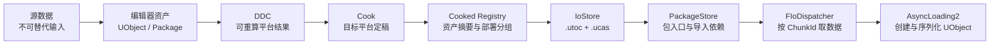

# Unreal Engine 的资源生产线：DDC、Cook、IoStore 与运行时加载

> 系列：从 Unreal Engine 源码理解引擎设计
>
> 日期：2026-08-09
>
> 状态：草稿
>
> 核心问题：编辑器里已经可以浏览和加载的资产，为什么还要经过 DDC、Cook 与 IoStore，才能成为运行时真正可读取的内容？

[系列目录](../blog.html)

做游戏内容时，最容易产生的一种错觉是：

```text
编辑器里看得见
=
发布包里一定存在
=
运行时可以立刻加载
```

但三个等号都不成立。

一张贴图能够在编辑器里预览，只说明编辑器认识它当前的资产表示。

它是否已经为目标平台生成正确的压缩格式，是否被 Cook 规则选中，是否进入发布容器，运行时能否找到对应 Package 和 IO chunk，又是四个不同问题。

这也是为什么资源问题经常表现得很“跳跃”：

- 编辑器一切正常，打包后资产缺失；
- 第一次 Cook 极慢，第二次明显变快；
- 资产明明进入容器，运行时却报告 `NotInstalled`；
- IO 已经完成，对象仍在反序列化或 PostLoad 阶段失败；
- 修改一个构建设置后，大量内容突然重新生成。

这些现象并不是同一个资源系统偶尔不稳定，而是资源在生产和加载过程中不断改变身份。

## 先说结论：资源要经过三次转换和两次寻址

Unreal 的资源主链可以概括为：



三次转换分别是：

1. 源数据进入可编辑的 UObject/Package；
2. 构建函数把输入转换成目标平台派生数据；
3. Cook 把项目内容筛选并保存成目标平台运行时数据。

两次寻址分别是：

1. AssetRegistry/AssetManager 决定“想加载哪个逻辑资产”；
2. PackageStore/FIoDispatcher 决定“从哪个运行时 chunk 读取它的数据”。

中间的 IoStore 负责容器布局，但不负责创建 UObject。

## DDC：不是资产仓库，而是可以推倒重建的车间缓存

> **派生数据缓存（Derived Data Cache，后文简称“可重算中间仓”）**：用构建函数版本和输入身份寻址，保存可以从源数据再次生成的平台相关结果。

DDC 最容易被误解成“引擎帮项目备份了一份处理后的资产”。

更准确的理解是：它保存的是某次确定性加工的结果。

一个缓存键大致回答：

```text
使用哪类构建结果？
采用哪个算法/格式版本？
输入内容是什么？
目标平台与质量设置是什么？
还有哪些依赖会影响输出？
```

现代 DDC key 由 bucket 和输入 hash 组成。更高层的 Build Definition 还会把构建函数、常量、文件、bulk data、其他 build 输出与版本关系写入定义。

这带来两个很重要的结论。

第一，缓存未命中不代表资产丢失。

它只表示当前 key 下没有可复用结果，需要重新加工。

第二，缓存命中也不自动证明结果正确。

如果构建逻辑漏掉了一个真正影响输出的设置，那么旧结果仍可能被错误复用。缓存系统只能相信调用方给出的输入身份，不能替调用方猜测完整因果。

所以一个健康的“可重算中间仓”应满足：

```text
删除它会变慢
但不会让项目失去唯一事实源
```

## DDC 请求本身也是异步任务

DDC 并不是一个简单的同步 Map。

它的 Get/Put 可以来自任意线程，回调可能乱序、并发，甚至可能在请求函数返回前执行。请求 owner 还负责优先级、取消、等待和保活。

这意味着调用方不能这样假设：

```text
发起 Get
→ 当前函数返回
→ 稍后一定在原线程收到结果
```

如果结果要更新编辑器 UI、Cook 状态或游戏线程对象，就需要明确的线程交接。

这条原则不仅适用于 DDC。任何共享构建缓存都应该把“数据身份”和“请求生命周期”同时建模，否则取消、退出和并发回调会不断制造边界错误。

## Cook：不是压缩，而是目标平台定稿

> **Cook（后文简称“平台定稿”）**：加载项目 Package，等待目标平台派生数据就绪，应用内容筛选规则，并把结果保存、提交为目标平台运行时 Package 的生产阶段。

“平台定稿”首先会完整加载待处理 Package。

之后它不会立刻保存，而是遍历 Package 中需要处理的对象，调用目标平台数据准备入口，并轮询这些数据是否已经可用。Texture、Mesh、Material 等类型各自负责具体加工；Cooker 负责协调什么时候可以进入保存边界。

主链更接近：

```text
Load Package
→ BeginCacheForCookedPlatformData
→ 等待派生结果 Ready
→ 应用平台与内容规则
→ PackageWriter.BeginPackage
→ SavePackage
→ PackageWriter.CommitPackage
```

这解释了为什么 DDC 会直接影响 Cook 时间：

- 有正确缓存时，平台数据可以快速复用；
- miss 时，需要重新构建；
- 构建仍未完成时，Cook Package 只能等待或重新排队；
- 超时可能触发释放状态和重试，而不是提交半成品。

Cook 还会应用很多“编辑器里看不出来”的规则：

- EditorOnly 内容是否应过滤；
- AssetManager 是否允许该 Package 进入目标平台；
- NeverCook 与平台专属排除；
- generator package 是否真的需要保存；
- optional content、字节序、保存 flags 和路径限制。

所以“编辑器里可加载”只说明上游事实成立，不代表目标平台定稿已经接受它。

## Cooked AssetRegistry：发布内容的清单，不是编辑器索引的复印件

> **Cooked AssetRegistry（后文简称“发布清单”）**：根据实际 Cook 结果生成的目标平台资产摘要、依赖与部署分组视图。

每个平台 Package 保存完成后，Cook 会把 SavePackage 产生的最新 AssetData、Package flags、文件大小和依赖更新到该平台的 Registry 生成器。

成功 Package 与失败/被排除 Package 的记录不同。运行时 Registry 还会继续过滤开发标签和未进入 cooked 集合的内容。

因此三份 Registry 不能画等号：

```text
编辑器全局 Registry
≠
DevelopmentAssetRegistry
≠
Runtime AssetRegistry
```

前者要支持编辑器浏览和项目分析。

Development 版本要支持增量 Cook、DLC 与诊断。

Runtime 版本只应保留目标平台加载和查询需要的数据。

“发布清单”还会计算逻辑 Chunk ID，用于安装、流式分发或打包分组。但这里的 chunk 仍不是运行时的 `FIoChunkId`。

## 三种名字相似的分组，解决三个问题

资源系统中至少有三种容易混淆的“组”：

| 概念 | 回答的问题 | 典型身份 |
| --- | --- | --- |
| Asset Bundle | 加载某个主资产时，还要带上哪些软引用资产？ | BundleName + AssetPaths |
| Packaging Chunk | 哪些 Package 应属于同一安装/发布分组？ | integer Chunk ID / manifest |
| IO Chunk | 运行时要读取哪一块具体数据？ | `FIoChunkId` + chunk type |

同一个 Asset Bundle 可以跨越多个 Package。

同一个 Package 可以属于多个发布分组。

同一个 Package 还可能生成 ExportBundle、BulkData、OptionalBulkData、MemoryMappedBulkData 等多个 IO chunk。

如果框架只用一个 `int chunkId` 同时表示三层概念，后续一定会出现错误的耦合。

## IoStore：运行时货柜，而不是对象加载器

> **IoStore 容器（后文简称“运行时货柜”）**：把 Cook 后的多个 IO chunk 按布局写入目录元数据和数据分区，使运行时可以按稳定 chunk identity 读取。

IoStore 生产端接收 `FIoChunkId` 和对应数据请求，执行 hash、布局、压缩以及可选的加密/签名，然后生成：

```text
.utoc：chunk 目录、offset、size、压缩 block、hash 等元数据
.ucas：实际 chunk payload，可按大小拆成多个分区
```

“运行时货柜”只负责把 byte chunks 放到可寻址位置。

它并不知道某个 UObject 的类是什么，也不决定 Outer、属性、import/export 或 PostLoad 顺序。

所以不能把运行时加载画成：

```text
AssetRegistry
→ 打开 .ucas
→ 得到 UObject
```

中间还缺少加载元数据、依赖图、IO 调度和反序列化。

## 运行时取货：先查 PackageStore，再按 ChunkId 读取

> **PackageStore 与 Runtime IO（后文简称“取货单”）**：先查询 Package 的 Loader 类型和导入依赖，再把 PackageId 转成 IO chunk 请求，由异步加载器消费结果。

PackageStore 会从已挂载 backend 中查询 Package entry，并区分：

```text
Missing
NotInstalled
Pending
Ok
```

这些状态不能合并成一个“加载失败”。

- Missing 表示当前后端没有这个 Package；
- NotInstalled 允许系统知道内容存在但尚未安装；
- Pending 表示元数据仍在准备；
- Ok 才能继续取得 imported package IDs、shader map hashes 和 loader 信息。

AsyncLoading2 得到 Package entry 后，会递归建立导入依赖，再把 `PackageId` 转成 `ExportBundleData` 的 `FIoChunkId`。FIoDispatcher 按优先级把请求发给文件系统、HTTP 或其他 backend。

IO callback 完成时，它释放事件 barrier，Package Summary、Export 创建、属性反序列化和 PostLoad 才能继续。

因此：

```text
IO 完成
≠
对象已经可用
```

IO 只解决“字节到了”。AsyncLoading2 还要解决“这些字节如何变成正确的 UObject 图”。

## 为什么要把这条链拆这么细

如果所有阶段都由一个 AssetLoader 负责，短期看起来更简单，长期却会产生四种耦合。

### 1. 编辑器格式与运行时格式耦合

Runtime 被迫理解源文件、导入器和编辑器数据，发布体积和攻击面都会扩大。

### 2. 构建算法与内容发布耦合

只改压缩器版本，也不得不把源资产身份和发布容器全部混在同一缓存规则中。

### 3. 逻辑资产与物理位置耦合

业务层开始依赖文件名、容器 offset 或发布 chunk，一次重打包就可能破坏上层引用。

### 4. IO 完成与对象生命周期耦合

调用方会误以为 read callback 就能安全使用对象，忽略 import、serialize、PostLoad 和游戏线程可见性边界。

Unreal 的分层代价是系统更复杂，但每一层可以独立变化：

- 替换派生算法，只需改变 build identity；
- 改变平台筛选，只影响 Cook 选择；
- 改变压缩/容器布局，不必改 UObject 模型；
- 增加 HTTP backend，不必让 AsyncLoading2 理解网络协议；
- AssetManager 继续用逻辑 ID，不必知道 `.ucas` offset。

## 我的资源生产线检查清单

如果为自己的引擎或框架设计类似系统，我会检查：

1. 源数据是否有独立于缓存和发布包的权威存储？
2. 派生缓存能否被删除并从稳定输入重建？
3. cache key 是否包含算法版本、平台设置和全部真实输入？
4. DDC 请求是否有显式 owner、取消、优先级和线程交接？
5. Cook 是否在保存前等待所有平台数据 Ready？
6. 内容选择规则是否能解释某个 Package 为什么被纳入或排除？
7. Save 与 Commit 是否是两个可观测状态？
8. 实际保存结果是否会反向更新目标平台 Registry？
9. Development Registry 与 Runtime Registry 是否使用不同过滤合同？
10. 逻辑加载 Bundle、部署 Chunk 与 IO Chunk 是否使用不同类型？
11. 容器 writer 是否只处理 byte layout，而不侵入对象反序列化？
12. Runtime 是否先查询 Package metadata，再发具体 IO 请求？
13. `Missing`、`NotInstalled`、`Pending` 和 `Corrupt` 是否能被分别诊断？
14. IO callback 是否只表示字节完成，而不是对象 Ready？
15. 日志能否贯通 AssetId、PackageId、ChunkId 和异步请求句柄？

理解这条资源生产线后，最重要的收获并不是背下 `.utoc` 与 `.ucas` 的扩展名。

真正值得保留的是这组边界：

```text
源数据负责不可替代的事实
DDC 负责可重算的加工结果
Cook 负责目标平台定稿
Registry 负责可查询清单
IoStore 负责物理布局
PackageStore 负责加载入口元数据
FIoDispatcher 负责把字节送达
AsyncLoading2 负责把字节恢复为对象图
```

资源只有跨过这些边界，才从“编辑器认识的内容”变成“运行时真正能够消费的数据”。

## 术语对照

| 正式术语 | 文中通俗称呼 |
| --- | --- |
| Derived Data Cache | 可重算中间仓 |
| Cook | 平台定稿 |
| Cooked AssetRegistry | 发布清单 |
| IoStore Container | 运行时货柜 |
| PackageStore 与 Runtime IO | 取货单 |

---

## 内部资料依据

本文主要基于以下研究材料整理：

- `notes/UnrealEngine源码研究/10_序列化与Package加载_FArchive到AsyncLoading.md`
- `notes/UnrealEngine源码研究/14_AssetRegistry到PrimaryAsset_发现规则与异步句柄.md`
- `notes/UnrealEngine源码研究/15_DDC到Cook与IoStore_资源生产和运行时读取.md`
- `notes/UnrealEngine源码研究/README.md`

本文依据当前 Unreal Engine 5.8.1 release 源码研究，覆盖 DDC key/request/build、Cook 保存提交、cooked AssetRegistry、IoStore 容器生产、PackageStore、FIoDispatcher 与 AsyncLoading2 的基础职责链。

本文不声称已经完整覆盖 Texture/Mesh/Shader 的具体派生算法、Pak fallback、Zen Server、DLC/补丁生成、IoStoreOnDemand、容器加密密钥治理或平台安装器。文中的分层与检查清单属于工程设计建议，不表示其他引擎必须复制 Unreal 的具体 API。
