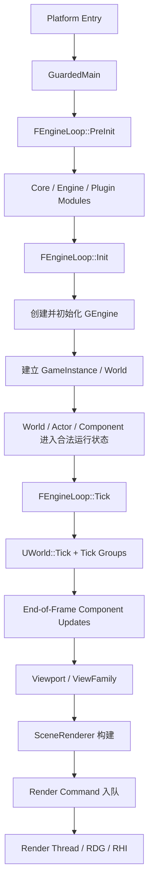

# Unreal Engine 的第一帧提交链：阶段化启动、世界 Tick 与渲染线程交接

> 系列：从 Unreal Engine 源码理解引擎设计
>
> 日期：2026-08-08
>
> 状态：草稿
>
> 核心问题：一个普通操作系统进程，经过哪些明确的生命周期边界，才真正变成一个能够推进游戏世界并向渲染线程提交画面的 Unreal Engine 运行时？

[系列目录](../blog.html)

第一次阅读 Unreal Engine 源码时，很容易试图寻找一个熟悉的入口：

```text
main()
→ 初始化
→ Update()
→ Render()
```

但顺着源码真正往下读，很快就会发现事情并不是这样。

进程入口在 Launch 层。

模块由 ModuleManager 管理。

`GEngine` 要到更后的 Init 阶段才真正创建。

World 还有自己的初始化和 BeginPlay 边界。

Actor 已经构造出来，也不代表它已经进入玩法状态。

Component 注册成功，也不代表渲染线程已经拥有它的可见表示。

游戏线程修改 Transform，更不意味着 Render Thread 此刻已经看到了最新数据。

所以，如果把 Unreal 的“第一帧”理解成：

> 某个大函数被调用了一次。

就会错过整个引擎最重要的一条设计原则。

## 先说结论：第一帧不是一个函数，而是一串就绪状态完成后的跨线程提交

**第一帧提交链（后文简称“第一帧接力”）**：进程经过启动阶段、模块就绪、Engine/World 生命周期建立、游戏线程模拟和渲染状态同步后，把第一批合法场景数据提交给渲染线程的连续过程。

可以先把整体结构压缩成下面这张图：



这条链最值得记住的不是函数名，而是每一段之间的状态边界。

Unreal 并不是：

```text
对象存在
=
对象已经可运行
=
对象已经可渲染
```

而更接近：

```text
进程存在
→ 引擎基础设施 ready
→ 模块 ready
→ Engine ready
→ World ready
→ Gameplay ready
→ Component render state ready
→ Render submission ready
```

每一个箭头都拥有自己的失败条件和生命周期责任。

## GuardedMain 首先建立的是受保护的进程生命周期

平台入口并不会直接开始 Tick 世界。

进入 `GuardedMain` 后，Launch 层首先要建立一套受保护的运行环境。

其中一个重要职责是明确当前游戏线程身份，并把整个 EngineLoop 放在可以统一退出和清理的保护边界内。

可以近似理解为：

```text
Platform Entry
→ 进入 GuardedMain
→ 标记 Game Thread
→ PreInit
→ Init
→ Tick Loop
→ Exit
```

这里值得注意的是退出路径。

正常主循环退出并不是唯一结束方式。

初始化失败、请求退出以及异常路径都可能提前离开。

因此，引擎不能依赖：

```text
while 循环正常 break
→ 再执行 cleanup
```

来保证资源释放。

启动和退出本身就是一套状态机。

这一思想可以迁移到任何大型 Runtime：

> 初始化阶段越多，就越不能把清理逻辑放在“正常运行结束之后”才考虑。

## PreInit 的职责是把普通进程变成可装载引擎模块的运行时

**阶段化启动（后文简称“分段开机”）**：把引擎初始化拆成多个具有明确前置条件、失败出口和扩展时机的阶段，而不是依赖一个巨大的初始化函数。

Unreal 的 PreInit 不是简单的：

```text
LoadEverything()
```

它包含不同层次：

```text
早期环境
→ CoreUObject
→ Engine
→ Renderer / RenderCore / RHI 等基础模块
→ Project / Plugin 不同 Loading Phase
```

这件事非常重要。

一个成熟引擎拥有大量模块：

- 对象系统；
- 引擎主体；
- 渲染；
- Slate；
- 网络；
- 插件；
- 编辑器；
- 平台适配；
- 项目模块。

它们不应该在完全相同的时刻进入运行时。

有些模块需要 UObject 系统已经存在。

有些插件要求 Engine 主体初始化以后才能启动。

有些 Editor 模块根本不应该进入 Shipping Game。

所以 Loading Phase 表达的是：

> 在整个启动序列中的哪个时点，请求这个模块进入运行时？

它不是单纯的加载性能优化。

它实际定义了模块允许依赖哪些前置环境。

## 模块被找到、模块被加载和模块可以使用是三种状态

**模块就绪边界（后文简称“真的能用了”）**：模块不仅已经存在于模块表或被操作系统映射，而且已经完成初始化，可以安全向其他调用者提供能力的时刻。

可以把 ModuleManager 中的重要过程抽象为：

```text
Known
→ Loading
→ Initializing
→ Ready
→ ShuttingDown
```

模块信息可能在 `StartupModule()` 之前就已经登记。

这样做有一个现实原因：

`StartupModule()` 自己可能再次触发模块查询或模块依赖。

如果系统直到初始化结束才知道这个模块存在，就无法正确处理初始化阶段的递归关系。

但反过来，如果模块一登记就被认为完全可用，其他线程又可能看到一个半初始化对象。

因此需要同时表达：

```text
这个模块已经被系统知道
```

和：

```text
这个模块已经完成 StartupModule
```

这两个事实。

这是一个非常值得框架开发借鉴的模式：

```text
registered
≠
ready
```

Service Container、插件系统、网络会话和资源加载器同样经常需要这种中间态。

## Init 阶段才真正把 Engine 实例建立起来

PreInit 完成后，进程已经拥有大量基础设施，但还不能直接称为“游戏正在运行”。

`FEngineLoop::Init` 会进一步建立真正的 Engine Runtime。

主线可以概括为：

```text
选择 Engine Class
→ 创建 GEngine
→ GEngine->Init(...)
→ 建立更高层运行时
→ 加载 PostEngineInit 模块
→ GEngine->Start()
→ 进入 Running
```

这里有一个很重要的认知边界：

> Engine 模块已经加载，不等于 GEngine 已经存在。

模块提供类型、代码和基础能力。

Engine 实例才开始承载具体运行时会话。

这种“类型已经可用，但系统实例尚未启动”的分层，在大型框架中非常常见。

例如：

```text
程序集已加载
≠
Service Scope 已建立

模块已安装
≠
Runtime Host 已运行

资源系统已注册
≠
当前 Session 已拥有资源上下文
```

把这些状态分开，才能避免初始化逻辑依赖偶然调用顺序。

## World 还有自己的运行生命周期

Engine 建立后，游戏世界依然不是一个简单的对象指针。

**世界运行状态（后文简称“世界开机状态”）**：World 是否已经完成子系统初始化、是否已经进入玩法、以及是否正在撕毁的显式生命周期。

至少需要区分：

```text
World Object 存在
→ World Initialized
→ World BegunPlay
→ World Running
→ World TearingDown
→ World Cleanup
```

`InitWorld` 会建立：

- World Subsystem；
- Scene；
- 物理；
- 导航；
- AI；
- Persistent Level 等运行基础。

而 `BeginPlay` 才意味着玩法层真正开始。

这带来一个非常重要的工程规律：

> 世界对象已经存在，不代表玩法代码已经获得合法执行时机。

创建 Editor Preview World、测试 World、PIE World 和正式 Game World 时，这种分层尤其重要。

它允许不同运行环境复用同一套 World 基础类型，却选择不同初始化能力。

## Actor 被 Spawn 出来也不代表玩法已经开始

同样的原则继续向下延伸到 Actor。

`SpawnActor` 并不是：

```text
new Actor
→ BeginPlay
```

而更接近：

```text
检查 World / Class / Network Context
→ NewObject
→ 加入 Level
→ PostSpawnInitialize
→ Construction
→ 初始化 Components
→ 满足条件时 DispatchBeginPlay
```

如果使用 Deferred Spawn，Construction 甚至可以被显式推迟。

这意味着 Actor 生命周期至少存在：

```text
对象身份已建立
→ Construction 完成
→ Component 初始化
→ BeginPlay
→ Tick 注册
```

Tick 默认也不是对象构造后立即开始。

Actor 真正进入 BeginPlay 路径后，Tick Function 才进入正式调度体系。

因此：

```text
Spawn 成功
≠
Gameplay Ready
```

这一边界能解释很多引擎 Bug。

例如，一个系统在 Construction 阶段错误假定：

- 其他组件已经 BeginPlay；
- World 所有子系统已经开始运行；
- 网络复制初始状态已经稳定；
- Tick 已经注册；

最终就会制造初始化顺序依赖。

## 一帧首先由游戏线程推进世界状态

当 Engine 初始化完成并进入主循环后，`FEngineLoop::Tick` 才开始持续产生真正的运行帧。

但 Unreal 的一帧同样不是：

```text
for actor in actors:
    actor.Tick()
```

Engine Tick 需要处理：

- 时间；
- 平台消息；
- 输入；
- Engine 状态；
- World；
- 渲染线程 BeginFrame；
- 帧结束相关工作。

World 内部则进一步使用 Tick Group 组织游戏逻辑。

**Tick Group（后文简称“帧内阶段”）**：在同一帧中按照物理和数据依赖，把 Tick Function 分配到具有明确先后关系的执行阶段。

可以简化为：

```text
PrePhysics
→ StartPhysics
→ DuringPhysics
→ EndPhysics
→ PostPhysics
→ PostUpdateWork
→ LastDemotable
```

这种设计解决的问题不是代码排版。

它表达的是数据时序。

例如：

- 某逻辑必须读取物理模拟之前的状态；
- 某逻辑必须等待物理结果；
- 某些工作可以在 Physics During 阶段异步推进；
- 本帧较晚创建的新 Tick 不能偷偷插回已经结束的阶段。

因此 Tick Group 本质上是一种帧内依赖协议。

## Component 注册、运行和可见也不是同一个状态

从 Actor 再进入 Component，生命周期继续被细分。

对于一个可渲染的 Primitive Component，可以看到类似链路：

```text
Component 存在
→ RegisterComponentWithWorld
→ bRegistered
→ CreateRenderState
→ 创建 SceneProxy
→ 加入 FScene
→ Render Thread 建立资源
```

这里特别容易产生一个错误直觉：

> Component 已注册，所以渲染线程应该已经能画它。

实际上并非如此。

至少存在三层状态：

```text
Component Registered
Render State Created
Primitive 已进入 Scene / Render Thread
```

这三层不能合并成一个 `isActive`。

## SceneProxy 是游戏对象与渲染对象之间的重要隔离层

**渲染代理（后文简称“渲染快照”）**：从游戏线程 Component 中提取渲染所需信息，形成可以由 Renderer 独立管理的非 UObject 表示。

例如 `UPrimitiveComponent` 本身属于游戏线程对象世界。

它拥有：

- Owner；
- World；
- Transform；
- Component 生命周期；
- UObject 身份；
- Gameplay 状态。

Renderer 并不应该在渲染线程直接遍历并访问这整棵可变对象图。

所以 Unreal 会建立：

```text
UPrimitiveComponent
→ FPrimitiveSceneProxy
→ FPrimitiveSceneInfo
→ FScene
```

SceneProxy 可以理解为：

> 游戏线程向渲染系统提交的一份专用表示。

这有几个重要收益。

第一，Renderer 不需要理解完整 Gameplay Object Graph。

第二，渲染线程不必随意读取不断变化的 UObject。

第三，生命周期责任更加清楚：

```text
Gameplay Object Lifetime
和
Rendering Representation Lifetime
```

是两本不同的账。

## Transform 改变也不会立即写入 Render Thread

玩家移动 Actor 时，游戏线程首先修改的是 Gameplay/Component 状态。

它不会直接跨线程改写正在被 Renderer 使用的 SceneProxy。

变化会先被记录为 Dirty：

```text
Transform Dirty
Dynamic Data Dirty
Render State Dirty
```

不同 Dirty 类型对应不同成本。

### Transform Dirty

对象还是同一个渲染表示。

只需要更新：

- Transform；
- Bounds；
- SceneInfo 中对应状态。

### Dynamic Data Dirty

Proxy 仍然可以复用。

只更新材质参数、实例数据等动态内容。

### Render State Dirty

原有 Proxy 表示已经不再足够。

需要：

```text
Destroy Render State
→ Create Render State
```

这比所有变化都“重建一次”更精确。

## End-of-Frame Update 是游戏线程到渲染提交的重要关口

**帧末同步边界（后文简称“交卷前整理”）**：在真正提交 ViewFamily 进行渲染之前，把游戏线程本帧积累的 Component 和 Render State 变化集中整理到合法渲染表示中的阶段。

这个阶段非常关键。

如果游戏线程：

```text
修改 Component
→ 立刻开始 Render
```

Renderer 可能看到的是：

- 一半更新后的 Transform；
- 旧 Bounds；
- 新材质状态；
- 尚未重建的 Proxy。

因此，在 BeginRenderingViewFamily 之前，World 会先处理 End-of-Frame Updates。

可以把它理解成：

> 游戏线程在交卷给 Renderer 之前，把本帧所有应当生效的渲染状态整理完。

这与事务系统中的 Commit Boundary 很相似。

不是每次字段修改都跨线程立即生效。

而是在明确边界统一提交一致状态。

## Viewport 才把游戏世界真正转成一帧渲染请求

游戏线程完成世界推进和渲染状态整理后，Viewport 路径会构造当前帧需要的 ViewFamily。

随后进入 Renderer：

```text
BeginRenderingViewFamily
→ Scene / ViewFamily 校验
→ End-of-Frame Updates
→ Canvas Flush
→ 创建 SceneRenderer
→ 注册 Render 工作
→ Execute
```

这里仍然主要运行在游戏线程。

游戏线程负责决定：

- 当前从哪里看；
- 使用哪个 Scene；
- 哪些 View；
- 当前帧有哪些渲染上下文；
- 需要提交哪一批 Render 工作。

然后才把真正的 Render 放到 Render Thread。

所以更准确的描述不是：

> 游戏线程负责游戏，渲染线程负责画画。

而是：

> 游戏线程拥有 Gameplay 状态，并负责构造一次合法渲染请求；渲染线程消费已经准备好的渲染表示并执行真正的 Render Pipeline。

## ENQUEUE_RENDER_COMMAND 是线程所有权的显式边界

**渲染命令队列（后文简称“跨线程投递箱”）**：游戏线程不直接修改渲染线程正在使用的状态，而是把需要执行的操作作为命令投递到渲染执行域。

典型关系可以表示为：


这种模式最重要的不是“多线程更快”。

而是所有权更清楚。

游戏线程可以说：

```text
我要提交这个变化
```

而不是：

```text
我要现在直接修改渲染线程正在访问的数据
```

只要跨线程边界保持清晰，系统就更容易处理：

- 并行执行；
- 生命周期；
- Flush；
- 帧延迟；
- 资源释放；
- 渲染线程关闭。

## Enqueue 完成不等于 Render 已经完成

这里同样存在一个需要明确区分的状态：

```text
命令已经提交
≠
渲染线程已经执行
```

如果游戏线程在某些特殊场景必须确认此前渲染工作已经完成，需要显式的同步屏障，例如 `FlushRenderingCommands`。

这类 API 成本通常很高，所以不能作为普通数据访问手段。

它的存在反而说明：

> 默认模型是异步拥有，而不是共享同步修改。

因此一个好的跨线程系统应该让：

```text
异步提交
```

成为默认路径，让：

```text
同步等待
```

成为明确而昂贵的特殊行为。

## 专用服务器再次说明“第一帧”不是固定渲染模板

Unreal 的 World 并不要求所有运行环境都拥有完整 Renderer。

Dedicated Server、Commandlet 或 NullRHI 环境可以使用空 Scene 实现。

这是一种非常重要的架构边界。

如果高层 World 代码假定：

```text
只要有世界
→ 就一定有真实 GPU Scene
```

大量 Server 和 Tool 路径就需要散布：

```cpp
#if SERVER
#endif
```

通过 Scene Interface 和 Null Scene，高层仍然可以维护统一生命周期：

```text
World 初始化
→ 获得 Scene Interface
```

但真正是否存在 GPU 渲染能力由底层决定。

这是一种典型的 Null Object / Capability Boundary：

> 高层依赖稳定合同，底层允许某项能力为空实现。

## 第一帧可以被理解为多本状态账终于对齐

顺着这条链阅读后，我认为 Unreal 的第一帧可以拆成至少四本账。

### 模块账

需要的 Runtime 模块已经：

```text
Known
→ Initialized
→ Ready
```

### Gameplay 账

Engine、World、Actor 和 Component 已进入对应合法生命周期。

### 帧调度账

当前帧的 Gameplay 状态已经按照 Tick Group 推进。

### 渲染账

Component 本帧产生的变化已经转成 Scene/Proxy 状态，并形成合法 Render Request。

只有这些状态共同成立，才真正得到：

> 第一批能够代表当前游戏世界的渲染工作。

这也解释了很多常见源码误判。

## 几组不能混淆的状态

阅读 Unreal 源码时，下面这些关系尤其值得单独记住：

| 看起来相似 | 实际含义 |
|---|---|
| DLL 已加载 | 不等于 Module Ready |
| Engine 模块存在 | 不等于 GEngine 已初始化 |
| UWorld 对象存在 | 不等于 World 已 BeginPlay |
| Actor 已 Spawn | 不等于 Actor 已 BeginPlay |
| Actor 已 BeginPlay | 也仍需满足 Tick 注册条件 |
| Component 已注册 | 不等于 Render State 已创建 |
| Render State 已创建 | 不等于 Render Thread 已完成处理 |
| Transform 已改变 | 不等于 SceneProxy 已立即更新 |
| Render Command 已 Enqueue | 不等于 GPU 工作已完成 |
| UObject 已 Destroy | 不等于底层内存已经即时回收 |

Unreal 大量复杂性，本质上来自：

> 一个大型运行时不能再用“存在 / 不存在”两个状态描述所有生命周期。

## 这种设计的代价

阶段化和多线程边界当然不是没有成本。

它会带来：

- 更多状态字段；
- 更多生命周期回调；
- 更多 Deferred 操作；
- 更复杂的调试时间线；
- 更难追踪的跨线程延迟；
- 更高的源码阅读门槛。

一个简单引擎完全可以选择更直接的模型。

例如：

```text
单线程 Gameplay + Rendering
```

对于小型项目可能更加容易维护。

所以值得迁移的并不是：

> 每个框架都应该复制 Unreal 的 FEngineLoop、TickGroup 和 SceneProxy。

而是更抽象的原则：

> 当系统复杂到需要跨阶段、跨模块和跨线程协作时，把中间状态显式化，比依赖隐式调用顺序更可靠。

## 对一般游戏框架的迁移启示

### 1. Bootstrap 使用阶段，而不是一个 StartAll

例如：

```text
Core
→ Runtime Services
→ Project Modules
→ Game Session
→ Running
```

每阶段都定义：

- 前置条件；
- Ready 条件；
- 失败清理；
- 可以加载的插件。

### 2. 注册状态与可用状态分开

模块、Service 和 Runtime Feature 可以使用：

```text
Registered
Initializing
Ready
Stopping
Stopped
```

不要：

```text
Dictionary 里存在
→ 默认已经可用
```

### 3. 实体生命周期不要直接绑定构造函数

实体可以分成：

```text
Constructed
Registered
Initialized
Started
Active
Stopping
Destroyed
```

从而支持：

- Deferred Construction；
- 网络初始状态；
- 场景加载；
- 编辑器预览；
- 测试环境。

### 4. 帧循环使用有名阶段

即使不需要 Unreal 这么多 Tick Group，也可以明确：

```text
Input
→ Simulation
→ Physics
→ PostPhysics
→ Presentation Sync
→ Render Submit
```

这样插件和系统可以知道自己应该挂在哪个阶段。

### 5. Gameplay Object 与 Render Object 分开

不要让 Render Thread 直接消费整棵可变业务对象树。

可以设计：

```text
Game Component
→ Render Snapshot / Render Proxy
→ Render Queue
```

### 6. 跨线程修改使用命令，而不是共享可变对象

通过：

```text
Command
Message
Snapshot
Handle
```

表达所有权交接。

必要时再使用明确的 Flush/Fence，而不是到处加锁同步。

## 我的第一帧架构检查清单

如果要为自己的引擎或框架设计类似启动和帧循环，我会检查：

1. 进程启动是否具有明确的阶段状态机？
2. 初始化中途失败时，已经建立的资源由谁清理？
3. 模块“已登记”和“已经 Ready”是否是两个状态？
4. 插件能否声明自己应在哪个启动阶段加载？
5. Editor、Game、Server 是否能够使用不同模块闭包？
6. Runtime Host 的建立是否与程序集加载分开？
7. World 是否明确区分 Initialized、Running 和 TearingDown？
8. Entity 构造完成是否与 Gameplay Start 分开？
9. Tick 注册是否有明确生命周期边界？
10. 帧内是否存在可解释的阶段顺序？
11. 异步工作是否明确在哪个阶段必须完成？
12. 新创建的 Tick 是否有明确的本帧插入规则？
13. Component 注册和 Render 可见性是否被分开？
14. Gameplay 对象是否拥有独立的 Render Proxy？
15. Transform 和结构性渲染变化是否采用不同更新成本？
16. 是否存在统一的帧末 Presentation Sync？
17. Render Thread 是否只消费自己的表示和命令？
18. 跨线程操作是否默认异步？
19. 强制同步是否通过显式 Fence / Flush 表达？
20. 无渲染环境是否可以通过 Null Capability 使用同一高层合同？
21. Debugger 能否回答某个对象当前究竟处于哪个生命周期阶段？
22. 一次 Frame Capture 能否解释 Gameplay 状态何时提交到 Renderer？

理解 Unreal 第一帧之后，最重要的收获并不是记住 `GuardedMain`、`FEngineLoop::Tick` 或 `BeginRenderingViewFamily` 的具体位置。

真正值得保留的模型是：

```text
阶段产生就绪状态
就绪状态允许下一阶段
游戏线程拥有世界事实
帧阶段推进这些事实
渲染表示在明确边界同步
跨线程通过命令完成所有权交接
```

于是，“第一帧”也不再只是屏幕终于亮起来的那个瞬间。

它是整个引擎第一次证明：

> 模块、世界、调度和渲染已经按照各自的生命周期合同完成了一次完整接力。

## 术语对照

| 正式术语 | 文中通俗称呼 |
|---|---|
| 第一帧提交链 | 第一帧接力 |
| 阶段化启动 | 分段开机 |
| 模块就绪边界 | 真的能用了 |
| 世界运行状态 | 世界开机状态 |
| Tick Group | 帧内阶段 |
| 渲染代理 | 渲染快照 |
| 帧末同步边界 | 交卷前整理 |
| 渲染命令队列 | 跨线程投递箱 |

---

## 内部资料依据

本文主要基于以下研究材料整理：

- `notes/UnrealEngine源码研究/UE5/01_Launch与ModuleManager启动及停机边界.md`
- `notes/UnrealEngine源码研究/UE5/05_UWorld与AActor生命周期及Tick调度.md`
- `notes/UnrealEngine源码研究/UE5/07_游戏线程到渲染线程的Scene与帧提交.md`
- `notes/UnrealEngine源码研究/UE5/11_进程启动到第一帧_GuardedMain到Tick与Present.md`
- `notes/UnrealEngine源码研究/UE5/12_Component从注册到SceneProxy_世界附着与线程提交.md`
- `notes/UnrealEngine源码研究/UE5/README.md`

本文基于当前 Unreal Engine 5.8.1 release 源码研究笔记整理，重点覆盖 Launch、ModuleManager、World/Actor/Component 生命周期以及游戏线程到 Render Thread 的基础帧提交路径。

本文不声称已经完整覆盖 RDG Pass 构建、Nanite、Lumen、具体 RHI 后端、交换链 Present、完整 Gameplay Framework、网络复制或 World Partition；这些仍属于后续源码研究范围。文中的 Bootstrap 阶段、Render Proxy 和跨线程命令等迁移方案属于工程设计建议，不表示其他框架必须采用与 Unreal 完全相同的实现。
