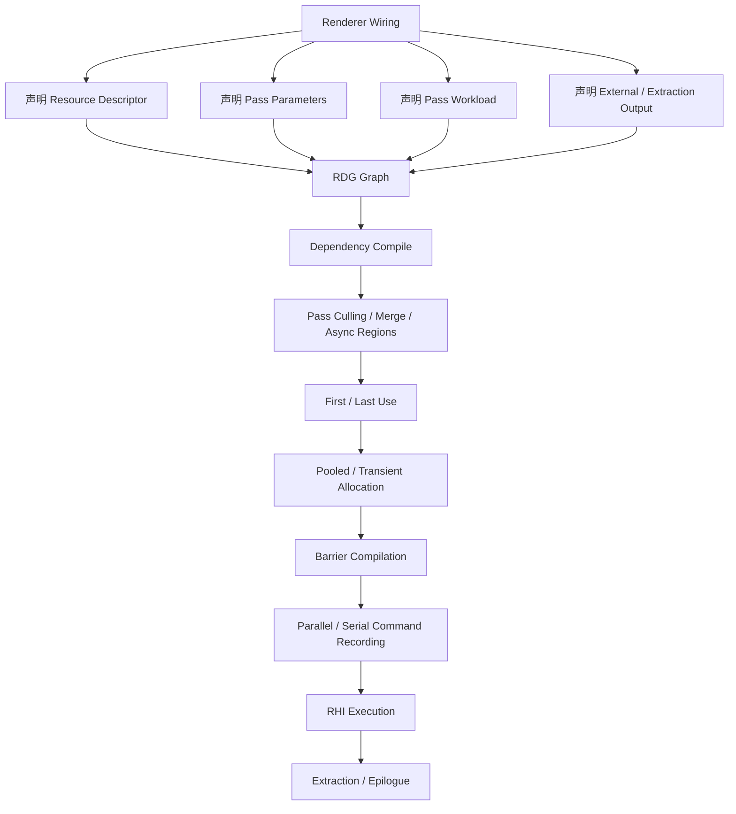
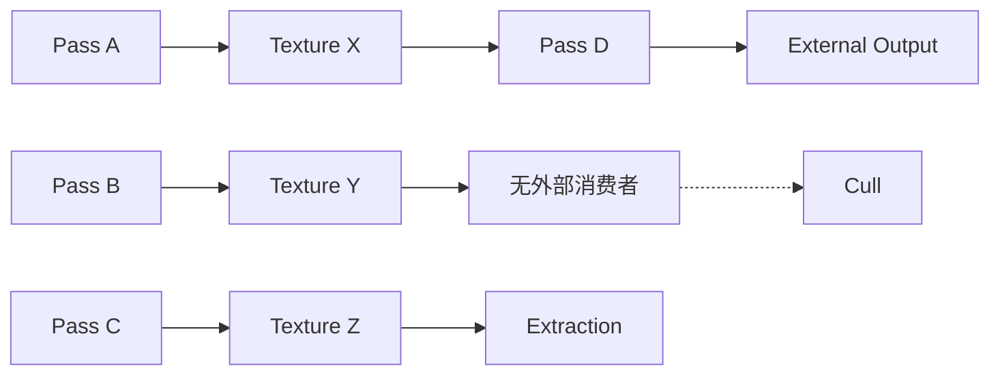
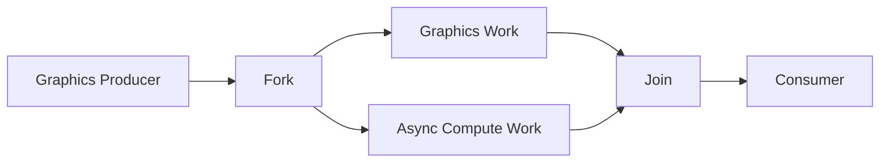

# 声明式渲染图编译：RDG 的依赖建图、资源生命周期与 Barrier 执行

> 系列：从 Unreal Engine 源码理解引擎设计
>
> 日期：2026-08-23
>
> 状态：草稿
>
> 核心问题：当一帧渲染包含大量 Pass、临时纹理、Async Compute 和跨 Pipeline 资源访问时，怎样让调用方只描述真实依赖，而由统一基础设施决定哪些工作必须执行、资源何时真正存在以及什么时候需要 GPU 状态转换？
>
> 关键词：Unreal Engine、RDG、Render Graph、Resource Lifetime、Barrier、Async Compute

[系列目录](../blog.html)

渲染代码最直观的写法，是按照执行顺序不断发命令：

```text
创建纹理 A
执行 Pass 1
写入 A

执行 Pass 2
读取 A
写入 B

执行 Pass 3
读取 B

释放 A
释放 B
```

在小型渲染器里，这种写法非常自然。

调用顺序就是执行顺序。

资源什么时候创建、什么时候释放，也由代码作者自己决定。

但当一帧开始拥有：

- 数百个 Render Pass；
- 大量临时 Texture / Buffer；
- Graphics 与 Async Compute 并行；
- 多个 Mip、Slice 和 Plane；
- GPU Resource State Transition；
- Render Pass Merge；
- Transient Memory Alias；
- Pass Culling；
- Parallel Command Recording；

以后，继续要求每个 Renderer 子系统自己决定：

```text
资源什么时候创建
谁依赖谁
什么时候插 Barrier
什么时候可以释放
能不能并行
```

很快就会出现一个问题：

> 每个局部系统只知道自己的那一小段逻辑，却被迫维护整张 GPU 执行图的全局正确性。

RDG 真正改变的，就是这一责任分配。

## 先说结论：RDG 把“直接执行渲染”改成“先声明，再统一编译”

**Rendering Dependency Graph（后文简称“先报需求，再统一排执行”）**：调用方声明 Pass、资源、访问方式、工作负载与图出口，由统一图编译器根据这些事实建立依赖、裁剪无效工作、计算资源生命周期和 GPU 同步，最后生成实际执行计划。

可以先把整体过程压缩为：



最关键的变化是：

```text
调用者不再提交完整执行过程。
```

调用者提交的是：

```text
事实。
```

例如：

```text
这个 Pass 会读取 Texture A。
这个 Pass 会写 Buffer B。
这是一个 Async Compute Pass。
这个 Texture 最后需要离开这张图。
```

至于：

```text
Pass 是否必须执行
A 和 B 实际什么时候分配
什么时候产生 Transition
是否可以和别的 Pass 并行
```

则交给 RDG 根据整张图统一决定。

## C++ 调用顺序不再等于完整 GPU 执行合同

传统即时式思维很容易写成：

```text
CreateTexture()
AddPassA()
AddPassB()
AddPassC()
```

然后自然推导：

```text
A 一定先于 B
B 一定先于 C。
```

但在 RDG 中，C++ 中的 wiring 顺序首先表达的是：

> 图是怎样被构建出来的。

真正的执行依赖来自：

- 谁生产 Resource；
- 谁读取 Resource；
- 谁写 Resource；
- 哪个结果最终离开图；
- 哪个 Pass 声明了不可剔除副作用；
- Graphics / Async Compute 之间存在什么依赖。

因此：

**建图顺序（即“代码按照什么顺序把工作登记进去”）**

和：

**执行约束（即“哪些工作实际上必须先后发生”）**

是两个不同概念。

这给编译器留下了全局调整空间。

如果一个系统把所有执行顺序都提前固定死：

```text
A
→
B
→
C
→
D
```

基础设施就无法再发现：

```text
B 和 C 其实互不依赖
```

也无法安全把它们放到不同 Pipeline 或 Command List。

## RDG Resource 首先是图中的逻辑身份

**图资源（后文简称“这张图里被大家共同引用的资源身份”）**：在当前 `FRDGBuilder` 内拥有稳定 descriptor、handle 和访问关系的逻辑 Texture / Buffer，不等于从创建时起就一直拥有实际 RHI Allocation。

例如：

```text
GraphBuilder.CreateTexture(...)
```

最先建立的是：

- Texture Descriptor；
- Name；
- RDG Handle；
- 图内资源身份。

它并不自动意味着：

```text
现在 GPU 上已经分配了一块对应显存。
```

这是一项很重要的抽象。

调用方可以先构造完整工作图。

编译器随后才根据：

```text
这个资源第一次什么时候被真正使用
最后一次什么时候被使用
```

决定实际物理资源需要存在多久。

于是：

```text
逻辑生命周期
```

和：

```text
物理内存生命周期
```

被主动分开。

## 一个资源至少同时拥有三层状态

理解 RDG Resource 时，可以把它拆成三层。

| 层次 | 主要内容 | 回答的问题 |
|---|---|---|
| 图身份 | Handle、Name、Descriptor | 图里大家说的是不是同一个逻辑资源 |
| 使用状态 | Producer、Reference、First/Last Use、Access | 哪些 Pass 怎样依赖和使用它 |
| 物理资源 | Pooled / Transient / RHI Resource | GPU 真正在哪段时间拥有对应内存 |

这三层如果被压成一个：

```text
Texture Object
```

很多优化就无法进行。

RDG 的价值恰恰在于：

> 资源可以在图中长期“存在”，而物理内存只在必要区间存在。

## Parameter Struct 是 RDG 的资源访问 IR

**资源访问 IR（后文简称“编译器真正相信的资源使用说明”）**：Pass Parameter Structure 中记录的 Texture、Buffer、SRV、UAV、RenderTarget 和显式 Access 信息，它同时供执行代码使用，也供 RDG 编译依赖和资源状态。

这是一个非常容易被低估的设计。

从 Shader 代码视角看：

```text
Parameters
```

似乎只是：

> 给 Shader 填数据。

但对于 RDG 来说，它还回答：

```text
这个 Pass 读了什么？
写了什么？
用什么 Access？
访问哪个 Mip？
哪个 Slice？
在哪个 Pipeline？
```

于是同一份参数结构同时承担：

```text
执行输入
+
编译输入。
```

这比维护两套信息：

```text
ShaderParameters

另外再写一张 ResourceDependencyList
```

可靠得多。

因为两份清单迟早会漂移。

## 少声明资源和多声明资源都会产生真实代价

如果一个 Pass 实际读取：

```text
Texture A
```

却没有在 RDG Parameter 中声明，

图编译器根本不知道：

```text
A
→
这个 Pass
```

之间存在依赖。

后果可能包括：

- Producer 边缺失；
- Barrier 缺失；
- Pass 被错误重排；
- GPU 读取旧状态或未初始化数据。

但另一极端同样有问题。

假设 Pass 参数里声明：

```text
Texture A
Texture B
Texture C
Texture D
```

实际上只真正使用 A。

RDG 会自然认为：

```text
这个 Pass
确实依赖 A/B/C/D。
```

于是可能造成：

- 资源生命周期被延长；
- 内存峰值提高；
- 不必要的 Pass 依赖；
- 并行机会减少。

所以声明式系统并不是：

> 多声明一点比较安全。

真正正确的是：

> **精确声明实际依赖。**

声明就是合同。

合同太少不正确。

合同太多同样限制优化。

## `AddPass` 提交的不只是一个 Lambda

一个典型 RDG Pass 会一起提交：

```text
Name
Parameters
Pass Flags
Execute Lambda。
```

这里至少包含三类事实。

### 资源事实

来自 Parameters：

```text
读什么
写什么。
```

### 工作负载事实

来自 Pass Flags：

```text
Raster
Compute
Async Compute
Copy。
```

### 执行代码

来自 Lambda：

```text
真正记录什么 GPU Command。
```

**Pass 声明（即“这一段 GPU 工作在图里是什么”）**因此不只是 Lambda 封装。

Pass Flags 会进一步影响：

- Graphics / Async Compute Pipeline；
- Raster Pass Merge；
- Transition；
- Async Overlap；
- Render Pass Begin / End。

这也是为什么：

```text
ERDGPassFlags
```

不是普通分类标签。

它属于编译输入。

## 延迟 Lambda 不能偷偷携带图外因果

RDG Pass 并不会保证：

```text
AddPass 返回以后立即执行 Lambda。
```

正常 Deferred 模式下，真正执行可能晚很多。

Parallel Execute 时，还可能发生在其他 Command List 或任务中。

因此这种代码非常危险：

```text
LocalVariable = ...

AddPass(
    [&LocalVariable]
    {
        使用 LocalVariable;
    });
```

如果被捕获对象生命周期只属于当前 Wiring Function，

Lambda 真正运行时它可能早已失效。

更深一层的问题是：

```text
Lambda 偷偷修改一个图完全不知道的外部状态。
```

此时 RDG 无法：

- 建依赖；
- 判断副作用；
- 判断 Pass 能否剔除；
- 判断能否并行。

因此：

**隐藏副作用（后文简称“图不知道，但代码自己偷偷做了别的事”）**

是声明式执行系统最危险的敌人之一。

一旦核心因果躲在 Lambda 闭包里，

图编译器得到的就不再是真实程序。

## Pass 是否执行，由图出口反向决定

传统即时渲染中：

```text
调用过这个函数
```

通常就意味着：

```text
它会执行。
```

RDG 不一定。

**Pass Culling（后文简称“没有任何有效结果的工作可以整段删除”）**：编译器从 External、Extracted Resource 和显式副作用根出发，反向追踪真正生产这些结果的 Pass；没有通向任何图出口的普通 Pass 可以被剔除。

可以近似理解为：



如果 Pass B 的结果：

```text
没有任何后续消费者
也没有 Extraction
也没有外部副作用
```

那么整条生产链可能没有存在价值。

这和普通 Dead Code Elimination 非常相似。

区别在于，它发生在 GPU 工作图上。

## `NeverCull` 不是“防止 RDG 犯错”的保险开关

如果开发者发现一个 Pass 被剔除了，

最简单的修复似乎是：

```text
NeverCull。
```

这当然可以让 Pass 保留下来。

但如果真正问题是：

```text
结果应该进入一个 External Output
却没有正确声明，
```

那么 NeverCull 只是掩盖了图合同缺失。

更准确的原则是：

```text
有真实图结果
→
声明图出口

有真实外部副作用
→
再使用 NeverCull。
```

**不可剔除副作用（后文简称“即使资源结果没流出去，这件事本身也必须发生”）**应该是显式而稀少的。

如果所有 Pass 都 NeverCull，

RDG 的 Dead Work Elimination 也就失去了意义。

## Extraction 不只是“把 Texture 拿出来”

**资源提取（后文简称“把单图资源正式转成交给图外系统持有的结果”）**：把当前 Graph 内的 RDG Resource 标记为外部结果，使其生命周期延长到图外，并在 Execute 收尾把对应 Pooled Resource 写回调用方。

Extraction 会同时影响：

- Cull Root；
- Last Use；
- Epilogue Access；
- Transient 策略；
- Graph 外所有权。

因此：

```text
QueueTextureExtraction
```

不只是：

> 给我一个指针。

它实际上在告诉编译器：

> 这项结果在这张图结束以后仍然有价值。

这会直接改变资源生命周期。

## first use 与 last use 才决定物理资源的有效区间

假设一张 RDG Texture 在代码中很早就被创建：

```text
CreateTexture
```

但直到 Pass 20 才第一次使用。

Pass 36 以后再也没有任何引用。

那么它真正需要物理内存的区间更接近：

```text
Pass 20
→
Pass 36。
```

而不是：

```text
Graph Begin
→
Graph End。
```

**资源生存区间（后文简称“显存真正必须为它保留的那一段时间”）**：从资源 first use 到 last use 的实际有效窗口。

RDG 会根据资源引用数量和存活 Pass 逐步识别：

```text
FirstPass
LastPass。
```

这让物理资源管理可以从：

```text
按对象创建时间。
```

升级成：

```text
按真实使用时间。
```

## Pooled 和 Transient 是两种不同的物理实现策略

逻辑 RDG Resource 最终可能获得不同类型的物理资源。

### Pooled Resource

从 Render Target / Buffer Pool 中获取。

使用结束以后可以被后续其他图或资源复用。

### Transient Resource

由底层瞬态分配器管理。

只要两个资源生命周期不重叠，

它们甚至可以共享同一块物理内存。

这种设计的本质不是：

```text
自动省内存。
```

而是：

> 图编译器掌握全局 first/last use，因此有资格判断哪些逻辑资源实际可以共享物理空间。

调用方自己局部创建 Texture 时，

通常没有足够信息做这件事。

## Transient Alias 把生命周期正确性变成显存优化前提

假设：

```text
Texture A
只在 Pass 1～5 使用

Texture B
只在 Pass 8～12 使用。
```

理论上，两者可以复用同一块显存。

但如果 A 实际直到 Pass 9 仍被某个隐藏访问使用，

Alias 就会直接造成数据破坏。

所以：

```text
正确资源声明
→
正确 first/last use
→
安全 alias。
```

这是一个非常典型的关系：

> 性能优化建立在生命周期模型正确之上。

如果生命周期声明不可信，

Transient Allocation 越激进，Bug 反而越容易暴露。

## 关闭 Transient 后 Bug 消失，不代表 Transient 本身有问题

调试中可能出现：

```text
正常模式画面随机错误

关闭 transient resource
→
问题消失。
```

很容易得出结论：

```text
Transient Allocator 有 Bug。
```

但更常见的可能是：

- 生命周期声明不完整；
- 未初始化读取；
- 资源被隐藏访问；
- First / Last Use 错误。

关闭 Transient 只是让不同资源不再复用同一片物理空间，

因此错误暂时不再被放大。

这也是为什么：

```text
Debug Mode 修好了问题
```

不能直接等价成：

```text
被关闭的优化有问题。
```

调试开关会改变系统。

必须明确它改变了什么。

## Barrier 是图编译产物，不是每个 Pass 手工插入的装饰

GPU Resource 不能在所有访问模式之间无条件自由切换。

例如：

```text
UAV Write
→
SRV Read
```

或者：

```text
Graphics
→
Async Compute
```

都可能需要显式状态转换或同步。

RDG 的做法不是要求每个 Pass 作者自己写：

```text
Transition A from X to Y。
```

而是让调用方声明：

```text
这个 Pass
以什么 Access 使用这个 Resource。
```

然后由图编译器根据相邻访问关系生成：

```text
FRDGTransitionInfo
→
RHI Transition Batch。
```

**访问状态编译（后文简称“先声明怎么用，再由系统生成 GPU 同步”）**把 Barrier 从业务代码中抽了出来。

这有两个直接收益。

第一，状态转换拥有全局上下文。

第二，Pass 作者不必手工维护前一个使用者到底是谁。

## Texture 的 Barrier 还可以细化到 Subresource

一张 Texture 并不总是整体以同一种方式被使用。

不同：

- Mip；
- Array Slice；
- Plane；

可能拥有不同访问状态。

因此 RDG 可以按 Subresource 追踪 Access，

而不是简单：

```text
Texture A
当前整体状态 = SRV。
```

这减少了不必要的全资源串行。

从更抽象的角度看：

> 同一个资源内部也可以存在更小的并发与生命周期单位。

只要访问模型足够精确，

调度器就可以获得更多优化空间。

## Pass Prologue 与 Epilogue 是资源状态真正落到 RHI 的边界

一个实际 Pass 的执行，可以粗略理解为：

```text
Switch Pipeline
↓
Pass Prologue
  Barrier
  Begin RenderPass
  Begin UAV Overlap
↓
Pass Execute
↓
Pass Epilogue
  End UAV Overlap
  End RenderPass
  Transition
```

这里：

```text
Pass::Execute
```

只是中间一段。

真正维持 GPU 资源状态的工作，

发生在整个 Pass 边界。

因此“执行 Pass”并不等于：

```text
调用一次 Lambda。
```

它实际上是一项被资源协议包围的 GPU 工作。

## Async Compute 的重点不是“把 Compute 丢到另一条队列”

**跨 Pipeline 并行区间（后文简称“Graphics 和 Compute 可以同时推进的安全窗口”）**：编译器根据生产者和消费者关系识别 Graphics 与 Async Compute 之间的 fork/join，建立对应 fence、transition 和资源生命周期边界。

可以表示成：



这里 fork/join 同时影响：

- GPU 同步；
- Resource Access；
- Transient Lifetime；
- Alias 安全。

所以 Async Compute 不是一个：

```text
PassFlags += Async。
```

然后自动获得性能收益的开关。

它需要整张依赖图共同证明：

> 这两段工作确实可以安全重叠。

## 并行记录命令也不等于 `Execute()` 返回前什么都完成了

RDG 可以把部分 Pass 分配到：

- Parallel Command List；
- Worker Task；
- Async Setup。

但：

**命令记录并行（后文简称“CPU 可以同时准备多份 GPU 命令”）**

与：

```text
GPU 已经执行完成
```

并不是同一回事。

`FRDGBuilder::Execute()` 需要统一收口：

- 应等待的 Parallel Execute Task；
- Pipeline 状态；
- Extraction；
- Post Execute Callback；
- Trace；
- Validation。

但这仍然不能自动推导：

```text
所有 GPU 工作已经真正执行结束。
```

这和很多异步系统一样：

```text
任务已经提交
```

与：

```text
硬件已经完成
```

是两个状态。

## 跨帧资源不能直接保存旧 `FRDGTextureRef`

这是非常值得单独记住的一条规则。

`FRDGTextureRef` 属于：

```text
当前 FRDGBuilder。
```

它表达的是：

> 这张图内部的逻辑资源身份。

因此不能：

```text
Frame N
保存 FRDGTextureRef

Frame N+1
继续直接使用同一个 Ref。
```

正确方式是：

```text
当前图
FRDGTextureRef
↓
QueueExtraction
↓
Pooled External Resource
↓
跨帧保存
↓
下一张图
RegisterExternalTexture
↓
新的 FRDGTextureRef。
```

**跨图身份转换（后文简称“离开这张图以后，要换一种所有权身份”）**明确区分：

```text
图内逻辑引用
```

和：

```text
图外长期资源。
```

这和资源系统里的 Lease、Handle、Snapshot 等很多设计具有相同思想：

> 临时执行上下文中的引用，不应该偷偷升级成长生命周期所有权。

## HZB 是非常清楚的真实案例

HZB 跨帧消费恰好展示了这套身份转换。

当前帧：

```text
Build HZB
→
得到 FRDGTextureRef。
```

本帧其他 Pass 可以继续使用它。

如果后续帧仍然需要：

```text
QueueTextureExtraction。
```

RDG Execute 收尾以后，

外部状态保存：

```text
IPooledRenderTarget。
```

下一帧再：

```text
RegisterExternalTexture
```

获得新的：

```text
FRDGTextureRef。
```

于是同一份底层数据经历：

```text
图内身份
→
图外身份
→
下一图的新图内身份。
```

这是一套非常清楚的生命周期转换，而不是让一个指针跨越所有执行域永久存在。

## 图首与图尾同样存在访问状态合同

资源进入 RDG 以前，可能已经拥有外部 RHI 状态。

资源离开 RDG 以后，也需要告诉后续系统：

```text
现在应该以什么 Access 继续使用。
```

因此图不只管理：

```text
Pass A
→
Pass B
```

之间的 Transition。

还需要处理：

```text
External State
→
Graph First Access

Graph Last Access
→
Epilogue State。
```

这意味着 RDG 更像一个拥有明确边界的资源状态事务：

```text
资源进入图
→
图内部管理
→
资源以明确状态离开。
```

## 声明式系统最大的收益来自全局信息

回头看 RDG 的所有主要能力：

- Pass Culling；
- Raster Merge；
- Async Compute；
- First / Last Use；
- Transient Alias；
- Barrier；
- Parallel Recording；

它们拥有同一个前提：

> 基础设施知道整张图。

任何一个局部 Pass 作者都很难单独判断：

```text
这张 Texture 后面还有没有人用？
```

但图编译器可以。

局部代码很难知道：

```text
另一条 Async Compute 链什么时候完成？
```

但完整依赖图可以。

所以：

**全局优化权（后文简称“把执行细节交出去以后，基础设施才有资格整体优化”）**是声明式设计真正换来的东西。

代价则是：

> 调用者必须诚实、完整地声明真实依赖。

## 声明式并不意味着系统会替你猜隐藏因果

这是所有 Render Graph 最容易被误解的地方。

开发者可能认为：

```text
RDG 很智能
所以它应该知道我 Lambda 里其实用了 Texture X。
```

它不知道。

图编译器只相信显式输入。

因此声明式系统不是：

> 系统自动理解代码。

而是：

> 调用方主动把真实因果提升成结构化数据。

这条原则也适用于：

- Job Graph；
- Build Graph；
- Task DAG；
- Dependency Injection；
- Workflow Engine。

真正可分析的优化，

只能建立在可分析的事实之上。

## Immediate Mode 是定位工具，不是正常时序证明

RDG 提供 Immediate Mode。

它可以让 Pass 更接近 Wiring 现场执行，

从而更容易得到：

- 调用栈；
- 崩溃位置；
- 哪个 AddPass 引发问题。

但它同时改变了：

```text
正常 Deferred 调度语义。
```

所以：

```text
Immediate 正常
```

不能证明：

```text
Deferred 一定正确。
```

反过来也一样。

如果一个 Bug 只在 Deferred 模式出现，

反而应该重点检查：

- Lambda 捕获生命周期；
- 隐藏外部状态；
- 缺失依赖；
- Resource Lifetime；
- Parallel / Async 行为。

## `FlushGPU` 也不是性能正常环境

另一个非常有效的 Debug 手段是：

```text
每个 Pass 后强制 GPU Flush。
```

它可以把：

```text
GPU 错误
```

更接近真正产生问题的 Pass。

但这样做会显著改变：

- Async Compute；
- Parallel Execute；
- GPU Overlap；
- 实际性能。

所以：

```text
Flush 后错误消失
```

不等于：

```text
问题解决。
```

它只能说明：

> 问题与异步、并发或生命周期有关的概率上升了。

好的 Debug Tool 应该告诉开发者：

```text
它帮助观察什么
以及
它为了观察改变了什么。
```

## Validation、Trace、VisualizeTexture 回答的是不同问题

RDG 提供多类工具。

它们不应该被理解成同一个“调试开关”。

### Validation

回答：

```text
图合同是否合法？
```

例如：

- 参数是否属于当前 Builder；
- 资源是否在写入前被读取；
- Pass Flags 与 Access 是否匹配；
- Resource Registration 是否正确。

### Trace

回答：

```text
编译器实际看到了怎样一张图？
```

包括：

- Pass；
- Resource；
- Dependency。

### VisualizeTexture

回答：

```text
某一张 Texture 实际存了什么内容？
```

### Transition Log

回答：

```text
资源状态实际怎样变化？
```

### Lifetime Debug

回答：

```text
问题是否和资源 alias / lifetime 有关？
```

这是一项很好的调试基础设施设计：

> 不同工具对应不同故障层，而不是一个万能 Debug Mode。

## Pass 被剔除通常意味着图没有看到真正结果

一个常见问题是：

```text
我明明 AddPass 了
为什么 Pass 没执行？
```

最值得先检查的不是：

```text
RDG Cull 出错。
```

而是：

```text
这个 Pass 的结果到底流向哪里？
```

如果：

```text
Output
没有被后续使用
也没有 Extraction
也没有外部副作用
```

那么从图的角度看：

```text
它确实没有存在价值。
```

此时正确修复不是强制 NeverCull。

而是补齐真实图出口。

## GPU 读到旧值时，首先检查声明而不是 Barrier 数量

另一个常见调试反应是：

```text
看起来像同步问题
→
多插一个 Barrier。
```

但在 RDG 中，更应该先检查：

```text
Producer 是否被正确声明？
Consumer Access 是否在 Parameters 中？
Subresource 是否正确？
Pass Flags 是否对应正确 Pipeline？
```

如果依赖图本身就是错的，

手工增加同步只是用时序掩盖模型错误。

声明式系统更理想的修复方式是：

> 修正事实，让编译器重新生成正确 Barrier。

## 内存峰值异常时，也要检查“声明过多”

如果一个 Pass 参数带入大量实际上不用的资源，

RDG 仍然可能认为：

```text
这些资源在这个 Pass 中有生命周期需求。
```

于是：

```text
Last Use
```

被人为推迟。

多个资源无法及时回收。

内存峰值自然增加。

所以内存问题不一定来自：

```text
资源创建太多。
```

也可能来自：

```text
依赖声明过宽。
```

这是声明式系统中一个非常典型的性能问题：

> 合同过宽同样会消耗优化空间。

## 与普通 Immediate Renderer 的边界

Immediate Renderer 的主要优势是：

```text
执行模型简单。
```

调用顺序直接对应命令记录。

小型项目很容易理解和调试。

Render Graph 更适合：

- Pass 多；
- 临时资源多；
- 资源复用重要；
- 多 Pipeline；
- GPU 同步复杂；
- 需要统一分析和工具链。

因此 RDG 并不是：

> 所有渲染器都必须有的高级设计。

如果一个项目只有十几个简单 Pass，

手工生命周期完全可控，

完整 Graph Compiler 可能反而增加维护成本。

值得引入 Render Graph 的真正信号通常是：

> 局部代码已经无法可靠维护全局资源与执行关系。

## 与普通任务图的边界

RDG 与 Task Graph 都是 DAG。

但不能因此把它们当成同一个系统。

Task Graph 主要关心：

```text
CPU 工作依赖
线程
任务完成。
```

RDG 还必须处理：

- GPU Resource Access；
- Graphics / Async Compute Pipeline；
- RHI State Transition；
- Transient Memory；
- RenderPass；
- GPU / CPU 两层提交。

因此值得迁移的是：

```text
声明 → 编译 → 执行
```

的结构。

不是把通用 Task Scheduler 直接改名叫 Render Graph。

## 对一般框架设计的迁移启示

### 1. 把真实依赖变成数据

不要让：

```text
调用顺序
```

成为唯一依赖来源。

更适合明确描述：

```text
Inputs
Outputs
Access
Side Effects。
```

### 2. 让同一份声明同时服务执行和分析

RDG Parameter 同时给 Pass 用，

也给 Graph Compiler 用。

这种设计可以迁移到：

- Build Pipeline；
- AI Workflow；
- Asset Processing；
- Job System。

避免维护：

```text
执行参数
+
另一份依赖清单。
```

### 3. 明确结果如何离开执行域

RDG 有：

```text
External
Extraction
NeverCull。
```

自己的任务系统同样应该区分：

```text
真正输出
显式副作用
纯中间结果。
```

### 4. 根据 first/last use 管理昂贵资源

不只是 GPU Texture。

以下资源同样可以考虑：

- Temporary File；
- Scratch Buffer；
- Network Connection；
- Large Intermediate Data；
- Worker Reservation。

资源对象在逻辑上存在很久，

并不意味着昂贵底层资源必须全程占用。

### 5. 调试工具必须说明自己改变了什么

如果为了定位问题：

- 强制串行；
- 禁止缓存；
- 延长生命周期；
- 关闭别名；
- 强制 Flush；

结果就不再代表正常运行环境。

诊断报告应同时记录：

```text
Observation
+
Debug Mode。
```

## 常见设计失败

### 把 RDG 当成 Lambda 包装器

没有理解 Resource Dependency 和生命周期才是核心。

### 在 Parameter Struct 外偷偷使用 RDG Resource

图无法得到真实依赖。

### 为了保险给 Pass 声明大量不用资源

资源生命周期扩大，并行和内存优化空间下降。

### 所有 Pass 都加 NeverCull

死工作剔除完全失效。

### 认为 `CreateTexture` 已经分配实际 GPU 内存

图身份与物理 Allocation 被混为一谈。

### 跨帧缓存 `FRDGTextureRef`

单图引用被错误提升成长生命周期所有权。

### Async Compute 只改一个 Pass Flag

没有验证真实 dependency、fork/join 和资源同步。

### GPU 错误就到处手工插 Barrier

声明层错误被时序补丁掩盖。

### Immediate Mode 正常就认为问题不存在

正常 Deferred 调度已经被改变。

### 关闭 Transient 后问题消失就认定 allocator 有 Bug

潜在生命周期或未初始化访问被错误归因。

### Pass Parallel 被理解成 GPU 已并行完成

CPU Command Recording、GPU Execution 和 Builder Completion 被混为一谈。

### 使用单一 Debug 开关判断所有问题

内容、依赖、生命周期、Barrier 和 GPU Crash 被混在一个层次。

## 我的 RDG / Render Graph 设计检查表

1. Pass 是否声明了所有真实 Resource Input？
2. Pass 是否声明了所有真实 Resource Output？
3. 是否存在通过 Lambda Capture 隐藏的资源访问？
4. Parameter Struct 是否同时作为执行参数和依赖 IR？
5. Resource 是否区分逻辑图身份与物理底层资源？
6. Builder 是否拥有单张图的唯一生命周期控制权？
7. 图执行以后是否禁止继续向同一 Builder 添加工作？
8. Pass Flags 是否真正表达 workload 类型？
9. Graphics 与 Async Compute 是否拥有合法 access 关系？
10. Pass 是否存在真正图出口？
11. `NeverCull` 是否只用于真实外部副作用？
12. Extraction 是否被理解成生命周期和所有权转换？
13. 是否能够计算 Resource First Use？
14. 是否能够计算 Resource Last Use？
15. Physical Allocation 是否只存在于真实需要区间？
16. Transient Alias 是否建立在可信生命周期声明上？
17. External Resource 进入图时是否拥有明确初始状态？
18. Resource 离开图时是否拥有明确 Epilogue Access？
19. Barrier 是否由声明的 Resource Access 自动生成？
20. Texture 是否需要 Subresource 粒度状态跟踪？
21. Raster Merge 与 Resource State Merge 是否被明确区分？
22. Async Compute 是否存在明确 Fork / Join？
23. 跨 Pipeline Resource Lifetime 是否考虑 overlap window？
24. Parallel Command Recording 是否拥有统一收口点？
25. Extracted Output 是否只在合法完成边界对外发布？
26. 跨帧 Resource 是否经过 Extraction / External Registration？
27. Validation 是否能够捕获未声明或非法资源访问？
28. Trace 是否能展示编译器实际看到的 Pass / Resource Graph？
29. VisualizeTexture 是否与 Dependency Debug 分开使用？
30. Immediate / Flush / Lifetime Debug 是否记录自己的语义副作用？
31. 内存峰值异常时是否检查过度 Resource Declaration？
32. Pass 被 Cull 时是否优先检查真实 Output，而不是直接 NeverCull？
33. GPU 读取异常时是否先修 Resource Contract，而不是先插手工 Barrier？
34. 当前项目规模是否真的已经需要完整 Render Graph，而不是简单 Immediate Pipeline？

RDG 最容易给人的第一印象是：

```text
Unreal 用一堆 Builder 和 Lambda 包装了渲染代码。
```

但真正值得保留的设计思想远比 API 形式重要。

它把渲染器从：

```text
我现在命令 GPU 按这个顺序做这些事
```

逐渐改造成：

```text
这些是我真正需要完成的工作，
这些是资源之间的真实关系，
这些结果必须离开这张图。
```

然后把剩下的全局问题交给基础设施：

```text
哪些工作实际上有必要
哪些资源什么时候存在
哪些内存可以复用
哪些工作可以并行
哪些状态必须转换
什么时候才能把结果交出去。
```

这种设计能够成立，依靠的不是图编译器“足够聪明”。

而是调用者愿意交出一部分执行控制权，并准确提供事实。

因此 RDG 最核心的交换其实非常简单：

> **局部系统放弃手工控制全部执行细节，换取基础设施对整张图进行全局分析、生命周期管理与同步编译的权力。**

## 术语对照

| 正式术语 | 文中通俗称呼 |
|---|---|
| Rendering Dependency Graph | 先报需求，再统一排执行 |
| 图资源 | 这张图里被大家共同引用的资源身份 |
| 资源访问 IR | 编译器真正相信的资源使用说明 |
| Pass 声明 | 这一段 GPU 工作在图里是什么 |
| 隐藏副作用 | 图不知道，但代码自己偷偷做了别的事 |
| Pass Culling | 没有任何有效结果的工作可以整段删除 |
| 不可剔除副作用 | 即使资源结果没流出去，这件事本身也必须发生 |
| 资源提取 | 把单图资源正式转成交给图外系统持有的结果 |
| 资源生存区间 | 显存真正必须为它保留的那一段时间 |
| 访问状态编译 | 先声明怎么用，再由系统生成 GPU 同步 |
| 跨 Pipeline 并行区间 | Graphics 和 Compute 可以同时推进的安全窗口 |
| 命令记录并行 | CPU 可以同时准备多份 GPU 命令 |
| 跨图身份转换 | 离开这张图以后，要换一种所有权身份 |
| 全局优化权 | 把执行细节交出去以后，基础设施才有资格整体优化 |

---

## 内部资料依据

本文主要基于以下材料整理：

- `notes/UnrealEngine源码研究/UE5/16_RDG从Pass声明到Barrier执行_图编译与资源生命周期.md`
- `notes/UnrealEngine源码研究/UE5/07_游戏线程到渲染线程的Scene与帧提交.md`
- `notes/UnrealEngine源码研究/UE5/12_Component从注册到SceneProxy_世界附着与线程提交.md`
- `blogs/从UnrealEngine源码理解引擎设计/01-UnrealEngine的第一帧提交链.md`
- `blogs/从UnrealEngine源码理解引擎设计/02-UnrealEngine的资源生产线.md`
- `blogs/README.md`
- `blogs/publication.v1.json`

本文主要基于 2026-08-18 研究时的 Unreal Engine 5.9.0 `ue5-main` 源码快照整理。

当前研究已经通过源码调用链与符号核对覆盖：

- Pass / Resource 声明；
- Parameter Access；
- Dependency Compilation；
- Pass Culling；
- Raster Merge；
- Async Compute Fork / Join；
- Resource First / Last Use；
- Pooled / Transient Allocation；
- Barrier Compilation；
- Parallel Command Recording；
- Extraction；
- HZB 跨帧消费；
- Validation / Trace / Lifetime Debug。

但本次研究没有运行 Unreal Editor、GPU Capture、Automation Test 或平台级性能 Benchmark，也没有深入验证 D3D12、Vulkan、Metal 对 `FRHITransition`、Queue、Fence 和 Heap 的具体实现。

因此本文不声称：

- `ERDGBuilderFlags::Parallel` 在所有平台和 Pass 上都一定产生并行执行；
- 使用 RDG 一定比 Immediate Renderer 更快；
- Transient Resource 一定用于所有 `CreateTexture` / `CreateBuffer`；
- Async Compute 一定带来正性能收益；
- 当前 `ue5-main` API 已冻结为正式 Release 合同；
- RDG Validation 能证明 Shader 算法输出正确。

文中将“声明 → 编译 → 执行”“First / Last Use”“显式图出口”等思想迁移到 Build Graph、Job System 和其他框架基础设施，属于工程设计归纳，不表示这些系统需要复制 Unreal 的具体 `FRDGBuilder`、Pass Flags 或 RHI 实现。